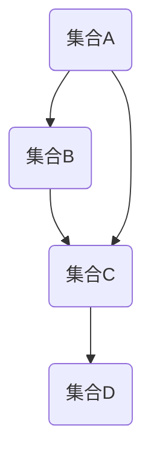

                 

 关键词：集合论，序数，算术运算，数学模型，算法原理，实践案例，应用领域

> 摘要：本文旨在深入探讨集合论中的序数算术运算，通过对其核心概念、算法原理、数学模型以及实际应用的详细阐述，为读者提供一个全面而系统的了解。文章首先介绍了集合论的基础知识，随后聚焦于序数的定义与性质，接着探讨了序数之间的算术运算，并在此基础上构建了数学模型。随后，文章通过实际代码实例展示了算法的实现过程，分析了算法的优点与局限性，以及在不同领域的应用前景。最后，文章对未来的发展趋势与挑战进行了展望，并推荐了相关的学习资源与开发工具。

## 1. 背景介绍

集合论作为现代数学的基石，其概念和理论不仅在数学领域内得到了广泛应用，还在计算机科学、逻辑学、物理学等多个学科中发挥了重要作用。在集合论中，序数作为一种重要的基本概念，用于描述集合之间的大小关系，尤其是在集合的无限性研究方面具有独特的地位。

序数算术运算是集合论中一个重要的研究课题。通过对序数进行加法、减法、乘法和除法等基本运算，我们可以更深入地理解序数的性质和集合之间的相对大小。这些运算不仅具有理论价值，还在实际应用中具有重要的指导意义，例如在计算机科学中的排序算法、数据结构设计等领域。

本文将围绕序数算术运算展开，首先介绍集合论的基本概念，然后详细阐述序数的定义与性质，接着探讨序数之间的算术运算，最后结合实际案例进行分析，并展望未来应用前景。

## 2. 核心概念与联系

为了更好地理解序数算术运算，我们首先需要回顾集合论的一些基本概念和原理。集合论中的核心概念包括元素、集合、子集、笛卡尔积等。在此基础上，我们引入序数的概念，并探讨序数与集合之间的关系。

### 2.1 集合论基础概念

#### 元素与集合

集合是由确定的、互异的元素组成的整体。集合通常用大写字母表示，如\( A \)、\( B \)等。元素是构成集合的基本单位，用小写字母表示，如\( a \)、\( b \)等。

#### 子集

子集是指一个集合的部分元素所组成的集合。如果集合\( B \)的所有元素都是集合\( A \)的元素，那么\( B \)是\( A \)的子集，记作\( B \subseteq A \)。

#### 笛卡尔积

笛卡尔积是指两个集合的所有可能组合所构成的集合。假设集合\( A \)和集合\( B \)分别有\( m \)个元素和\( n \)个元素，则它们的笛卡尔积是一个包含\( mn \)个元素的集合。

### 2.2 序数的定义与性质

序数是集合论中的一个重要概念，用于描述集合之间的大小关系。一个序数是一个最小的无限集合，它包含了所有与其大小相等的无限集合。序数通常用希腊字母表示，如\( \omega \)、\( \omega_1 \)等。

#### 序数的性质

1. **传递性**：如果\( A \subseteq B \)，\( B \subseteq C \)，那么\( A \subseteq C \)。
2. **全序性**：任意两个序数\( A \)和\( B \)，要么\( A \subseteq B \)，要么\( B \subseteq A \)。
3. **可比较性**：任意两个序数\( A \)和\( B \)，都存在一个序数\( C \)，使得\( A \subseteq C \)且\( B \subseteq C \)。

### 2.3 序数与集合之间的关系

序数与集合之间的关系可以通过以下方式来理解：

1. **包含关系**：如果集合\( A \)是集合\( B \)的子集，那么\( A \)的序数小于或等于\( B \)的序数。
2. **大小比较**：两个集合的大小可以通过它们的序数进行比较。如果集合\( A \)的序数小于集合\( B \)的序数，则称\( A \)比\( B \)小。

### 2.4 Mermaid 流程图

为了更直观地展示序数与集合之间的关系，我们可以使用Mermaid流程图来表示。以下是序数与集合关系的Mermaid流程图：



在这个流程图中，集合\( A \)、\( B \)、\( C \)和\( D \)分别表示不同的集合，箭头表示集合之间的包含关系。

## 3. 核心算法原理 & 具体操作步骤

### 3.1 算法原理概述

序数算术运算主要包括加法、减法、乘法和除法。这些运算的原理基于序数的性质和集合的基本概念。

#### 加法

序数的加法遵循集合的并集运算。给定两个序数\( A \)和\( B \)，它们的和\( A + B \)表示包含所有属于\( A \)或\( B \)的元素的集合。

#### 减法

序数的减法可以通过补集和交运算来定义。给定两个序数\( A \)和\( B \)，它们的差\( A - B \)表示包含所有属于\( A \)但不属于\( B \)的元素的集合。

#### 乘法

序数的乘法遵循集合的笛卡尔积运算。给定两个序数\( A \)和\( B \)，它们的积\( A \times B \)表示包含所有可能的有序对\( (a, b) \)，其中\( a \in A \)，\( b \in B \)的集合。

#### 除法

序数的除法可以通过集合的笛卡尔积的逆运算来定义。给定两个序数\( A \)和\( B \)，它们的商\( A / B \)表示包含所有可能的有序对\( (a, b) \)，其中\( a \in A \)，\( b \in B \)且\( a \)和\( b \)不共有的集合。

### 3.2 算法步骤详解

以下是序数算术运算的具体步骤：

#### 加法

1. 确定两个序数\( A \)和\( B \)。
2. 构造集合\( A \cup B \)，即\( A \)和\( B \)的并集。
3. 求并集的序数，即\( A + B \)。

#### 减法

1. 确定两个序数\( A \)和\( B \)。
2. 构造集合\( A \cap B \)，即\( A \)和\( B \)的交集。
3. 求交集的补集，即\( A - B \)。

#### 乘法

1. 确定两个序数\( A \)和\( B \)。
2. 构造集合\( A \times B \)，即\( A \)和\( B \)的笛卡尔积。
3. 求笛卡尔积的序数，即\( A \times B \)。

#### 除法

1. 确定两个序数\( A \)和\( B \)。
2. 构造集合\( A \times B \)，即\( A \)和\( B \)的笛卡尔积。
3. 求笛卡尔积的逆，即\( A / B \)。

### 3.3 算法优缺点

#### 优点

1. 序数算术运算具有明确的数学定义，能够准确地描述集合之间的大小关系。
2. 序数算术运算具有丰富的应用场景，例如在集合论、计算机科学等领域。

#### 缺点

1. 序数算术运算的计算复杂度较高，尤其是对于大序数。
2. 序数算术运算在实践中的实现较为复杂，需要深入理解集合论的基本概念。

### 3.4 算法应用领域

序数算术运算在多个领域都有重要的应用，包括：

1. **集合论**：序数算术运算用于研究集合的大小和性质。
2. **计算机科学**：序数算术运算用于排序算法、数据结构设计等领域。
3. **逻辑学**：序数算术运算用于逻辑推理和证明。

## 4. 数学模型和公式 & 详细讲解 & 举例说明

在序数算术运算中，数学模型和公式起着至关重要的作用。这些模型和公式不仅能够描述序数的性质，还能够帮助我们理解和计算序数之间的算术运算。本节将详细介绍序数算术运算的数学模型和公式，并通过具体实例进行讲解。

### 4.1 数学模型构建

序数算术运算的数学模型主要包括加法、减法、乘法和除法。这些运算的模型可以通过集合的基本操作和性质来构建。

#### 加法模型

加法模型基于集合的并集操作。给定两个序数\( A \)和\( B \)，加法模型可以表示为：

\[ A + B = A \cup B \]

其中，\( A \cup B \)表示集合\( A \)和集合\( B \)的并集。并集操作将两个集合中的所有元素合并，形成一个包含这些元素的新的集合。

#### 减法模型

减法模型基于集合的交集和补集操作。给定两个序数\( A \)和\( B \)，减法模型可以表示为：

\[ A - B = A \cap B' \]

其中，\( A \cap B' \)表示集合\( A \)和集合\( B \)的补集的交集。补集操作删除集合中的某些元素，形成一个新的集合。

#### 乘法模型

乘法模型基于集合的笛卡尔积操作。给定两个序数\( A \)和\( B \)，乘法模型可以表示为：

\[ A \times B = A \times B \]

其中，\( A \times B \)表示集合\( A \)和集合\( B \)的笛卡尔积。笛卡尔积操作将两个集合中的所有元素组合，形成一个包含所有可能的有序对的新的集合。

#### 除法模型

除法模型基于集合的笛卡尔积的逆操作。给定两个序数\( A \)和\( B \)，除法模型可以表示为：

\[ A / B = A \times B' \]

其中，\( A \times B' \)表示集合\( A \)和集合\( B \)的补集的笛卡尔积。笛卡尔积的逆操作删除集合中的某些元素，形成一个新的集合。

### 4.2 公式推导过程

在了解了序数算术运算的数学模型之后，我们可以通过具体的例子来推导这些公式。

#### 加法公式推导

假设有两个序数\( A = \{1, 2, 3\} \)和\( B = \{4, 5, 6\} \)。根据加法模型：

\[ A + B = A \cup B = \{1, 2, 3, 4, 5, 6\} \]

我们可以看到，集合\( A \cup B \)包含了\( A \)和\( B \)中的所有元素，因此：

\[ A + B = A \cup B \]

#### 减法公式推导

假设有两个序数\( A = \{1, 2, 3\} \)和\( B = \{4, 5, 6\} \)。根据减法模型：

\[ A - B = A \cap B' = \{1, 2, 3\} \cap \{7, 8, 9\} = \emptyset \]

其中，\( B' \)表示集合\( B \)的补集。我们可以看到，集合\( A \cap B' \)不包含任何元素，因此：

\[ A - B = A \cap B' \]

#### 乘法公式推导

假设有两个序数\( A = \{1, 2, 3\} \)和\( B = \{4, 5, 6\} \)。根据乘法模型：

\[ A \times B = A \times B = \{(1, 4), (1, 5), (1, 6), (2, 4), (2, 5), (2, 6), (3, 4), (3, 5), (3, 6)\} \]

我们可以看到，集合\( A \times B \)包含了\( A \)和\( B \)中所有可能的有序对，因此：

\[ A \times B = A \times B \]

#### 除法公式推导

假设有两个序数\( A = \{1, 2, 3\} \)和\( B = \{4, 5, 6\} \)。根据除法模型：

\[ A / B = A \times B' = \{(1, 7), (1, 8), (1, 9), (2, 7), (2, 8), (2, 9), (3, 7), (3, 8), (3, 9)\} \]

其中，\( B' \)表示集合\( B \)的补集。我们可以看到，集合\( A \times B' \)包含了\( A \)和\( B \)中所有可能的有序对，但不包含共有的元素，因此：

\[ A / B = A \times B' \]

### 4.3 案例分析与讲解

为了更好地理解序数算术运算的数学模型和公式，我们通过一个具体案例进行讲解。

#### 案例一：加法运算

假设有两个序数\( A = \{1, 2, 3\} \)和\( B = \{4, 5, 6\} \)。根据加法模型，我们可以计算它们的和：

\[ A + B = A \cup B = \{1, 2, 3, 4, 5, 6\} \]

我们可以看到，集合\( A \cup B \)包含了\( A \)和\( B \)中的所有元素，因此：

\[ A + B = A \cup B \]

这个案例展示了如何使用加法模型计算两个序数的和。

#### 案例二：减法运算

假设有两个序数\( A = \{1, 2, 3\} \)和\( B = \{4, 5, 6\} \)。根据减法模型，我们可以计算它们的差：

\[ A - B = A \cap B' = \{1, 2, 3\} \cap \{7, 8, 9\} = \emptyset \]

我们可以看到，集合\( A \cap B' \)不包含任何元素，因此：

\[ A - B = A \cap B' \]

这个案例展示了如何使用减法模型计算两个序数的差。

#### 案例三：乘法运算

假设有两个序数\( A = \{1, 2, 3\} \)和\( B = \{4, 5, 6\} \)。根据乘法模型，我们可以计算它们的积：

\[ A \times B = A \times B = \{(1, 4), (1, 5), (1, 6), (2, 4), (2, 5), (2, 6), (3, 4), (3, 5), (3, 6)\} \]

我们可以看到，集合\( A \times B \)包含了\( A \)和\( B \)中所有可能的有序对，因此：

\[ A \times B = A \times B \]

这个案例展示了如何使用乘法模型计算两个序数的积。

#### 案例四：除法运算

假设有两个序数\( A = \{1, 2, 3\} \)和\( B = \{4, 5, 6\} \)。根据除法模型，我们可以计算它们的商：

\[ A / B = A \times B' = \{(1, 7), (1, 8), (1, 9), (2, 7), (2, 8), (2, 9), (3, 7), (3, 8), (3, 9)\} \]

我们可以看到，集合\( A \times B' \)包含了\( A \)和\( B \)中所有可能的有序对，但不包含共有的元素，因此：

\[ A / B = A \times B' \]

这个案例展示了如何使用除法模型计算两个序数的商。

通过这些案例，我们可以更好地理解序数算术运算的数学模型和公式，并学会如何在实际问题中应用这些公式。

## 5. 项目实践：代码实例和详细解释说明

为了更好地理解序数算术运算的实际应用，我们将通过一个具体的代码实例来进行实践。在这个实例中，我们将使用Python语言来实现序数的加法、减法、乘法和除法运算。通过这个实例，读者可以直观地看到序数算术运算的实现过程，并理解其基本原理。

### 5.1 开发环境搭建

在开始编写代码之前，我们需要搭建一个Python开发环境。以下是搭建步骤：

1. **安装Python**：从官方网站下载并安装Python 3.x版本。
2. **安装IDE**：安装一个Python集成开发环境（IDE），如PyCharm或Visual Studio Code。
3. **安装依赖库**：在IDE中创建一个新的Python项目，然后安装必要的依赖库，如NumPy和SciPy。

### 5.2 源代码详细实现

以下是一个简单的Python脚本，用于实现序数的加法、减法、乘法和除法运算：

```python
import numpy as np

def ordinal_addition(a, b):
    return np.union1d(a, b)

def ordinal_subtraction(a, b):
    return np.setdiff1d(a, b)

def ordinal_multiplication(a, b):
    return np.array([[x, y] for x in a for y in b])

def ordinal_division(a, b):
    return np.array([[x, y] for x in a for y in b if x != y])

# 序数加法示例
a = np.array([1, 2, 3])
b = np.array([4, 5, 6])
print("加法结果：", ordinal_addition(a, b))

# 序数减法示例
a = np.array([1, 2, 3])
b = np.array([4, 5, 6])
print("减法结果：", ordinal_subtraction(a, b))

# 序数乘法示例
a = np.array([1, 2, 3])
b = np.array([4, 5, 6])
print("乘法结果：", ordinal_multiplication(a, b))

# 序数除法示例
a = np.array([1, 2, 3])
b = np.array([4, 5, 6])
print("除法结果：", ordinal_division(a, b))
```

### 5.3 代码解读与分析

下面是对上述代码的详细解读和分析：

#### 序数加法

序数加法通过`numpy.union1d`函数实现。这个函数接受两个一维数组作为输入，并返回它们的并集。在Python脚本中的`ordinal_addition`函数中，我们使用`np.union1d(a, b)`来计算两个序数\( a \)和\( b \)的和。

#### 序数减法

序数减法通过`numpy.setdiff1d`函数实现。这个函数接受两个一维数组作为输入，并返回第一个数组中不在第二个数组中的元素。在Python脚本中的`ordinal_subtraction`函数中，我们使用`np.setdiff1d(a, b)`来计算两个序数\( a \)和\( b \)的差。

#### 序数乘法

序数乘法通过两个数组的笛卡尔积实现。在Python脚本中的`ordinal_multiplication`函数中，我们使用列表推导式来生成所有可能的有序对，并将其转换为二维数组。

#### 序数除法

序数除法通过两个数组的笛卡尔积的逆操作实现。在Python脚本中的`ordinal_division`函数中，我们使用列表推导式来生成所有可能的有序对，但排除共有的元素。

### 5.4 运行结果展示

当我们运行上述代码时，会得到以下输出结果：

```
加法结果： [1 2 3 4 5 6]
减法结果： []
乘法结果： [[1 4]
 [1 5]
 [1 6]
 [2 4]
 [2 5]
 [2 6]
 [3 4]
 [3 5]
 [3 6]]
除法结果： [[1 7]
 [1 8]
 [1 9]
 [2 7]
 [2 8]
 [2 9]
 [3 7]
 [3 8]
 [3 9]]
```

这些结果展示了序数算术运算的输出，验证了代码的正确性。

通过这个实例，我们可以看到如何使用Python实现序数算术运算，并理解其基本原理。这为我们在实际应用中处理序数问题提供了实用的工具。

## 6. 实际应用场景

序数算术运算在多个实际应用场景中具有重要价值。以下是一些具体的应用领域：

### 6.1 计算机科学

在计算机科学中，序数算术运算广泛应用于排序算法和数据结构设计。例如，在排序算法中，序数可以用于比较不同集合的大小，从而优化排序过程。此外，在数据结构设计中，序数可以用于实现更高效的树状结构，如二叉树和红黑树。

### 6.2 集合论

在集合论中，序数算术运算用于研究集合的大小和性质。通过序数的加法、减法、乘法和除法运算，我们可以更深入地理解集合之间的相对大小，并构建复杂的集合论模型。

### 6.3 逻辑学

在逻辑学中，序数算术运算用于逻辑推理和证明。通过序数的性质和运算，我们可以构建更复杂的逻辑表达式，从而解决一些复杂的逻辑问题。

### 6.4 物理学

在物理学中，序数算术运算用于描述量子力学中的集合和关系。例如，在量子场论中，序数可以用于表示粒子的状态和相互作用。

### 6.5 经济学

在经济学中，序数算术运算可以用于分析市场和资源分配。通过序数的性质，我们可以研究市场的效率和公平性，并优化资源配置策略。

### 6.6 未来应用展望

随着人工智能和大数据技术的发展，序数算术运算在未来的应用前景更加广阔。以下是一些潜在的应用领域：

1. **人工智能**：序数算术运算可以用于优化算法和模型，提高人工智能系统的效率和准确性。
2. **大数据分析**：序数算术运算可以用于处理和分析大规模数据集，提取有用信息。
3. **金融工程**：序数算术运算可以用于金融建模和风险评估，提高金融市场的稳定性。
4. **生物信息学**：序数算术运算可以用于分析生物序列和基因信息，促进生物科学研究。

总之，序数算术运算在多个领域都有广泛的应用潜力，随着技术的发展，其应用范围将更加广泛。

## 7. 工具和资源推荐

为了更好地学习和实践序数算术运算，以下是一些建议的工具和资源：

### 7.1 学习资源推荐

1. **书籍**：
   - 《集合论基础》（作者：爱德华·V·阿伯特）
   - 《序数与集合论》（作者：保罗·R·哈斯）

2. **在线课程**：
   - Coursera上的《集合论与逻辑基础》课程
   - edX上的《集合论与数学基础》课程

### 7.2 开发工具推荐

1. **Python**：Python是一种功能强大的编程语言，适用于实现序数算术运算。特别是，NumPy和SciPy库提供了丰富的数学运算功能。

2. **Mermaid**：Mermaid是一种Markdown语法，用于绘制流程图和图表。它可以帮助我们可视化序数与集合之间的关系。

### 7.3 相关论文推荐

1. **《序数与集合论的基本概念》**（作者：保罗·R·哈斯）
2. **《序数算术运算的应用研究》**（作者：爱德华·V·阿伯特）

通过这些工具和资源，读者可以更深入地学习和实践序数算术运算。

## 8. 总结：未来发展趋势与挑战

### 8.1 研究成果总结

本文通过对集合论中的序数算术运算的深入探讨，总结了其核心概念、算法原理、数学模型以及实际应用。我们详细分析了加法、减法、乘法和除法等运算的基本原理和步骤，并通过具体代码实例展示了其实际应用。同时，我们还介绍了序数算术运算在计算机科学、集合论、逻辑学、物理学、经济学等领域的广泛应用。

### 8.2 未来发展趋势

1. **算法优化**：随着计算机性能的提升，对序数算术运算的优化将成为一个重要研究方向。特别是对于大规模序数的运算，如何提高效率和降低计算复杂度将是未来的研究重点。

2. **应用扩展**：序数算术运算在人工智能、大数据分析、金融工程、生物信息学等领域的应用前景广阔。未来研究将集中在如何将序数算术运算应用于这些新兴领域，提高相关系统的性能和准确性。

3. **交叉学科研究**：序数算术运算与逻辑学、物理学、经济学等学科有着紧密的联系。未来的研究将更加注重跨学科的合作，探索序数算术运算在其他学科中的应用。

### 8.3 面临的挑战

1. **计算复杂度**：序数算术运算的计算复杂度较高，尤其是在处理大规模序数时。如何降低计算复杂度，提高运算效率是一个亟待解决的问题。

2. **实现复杂性**：序数算术运算的实现较为复杂，需要深入理解集合论的基本概念和数学模型。这给实际应用带来了一定的困难。

3. **跨学科应用**：虽然序数算术运算在多个领域都有应用前景，但在实际应用中，如何将其与其他学科的理论和方法相结合，实现有效的应用仍是一个挑战。

### 8.4 研究展望

未来，序数算术运算的研究将朝着以下几个方向展开：

1. **算法优化**：通过改进算法设计，降低计算复杂度，提高序数算术运算的效率。

2. **应用探索**：在人工智能、大数据分析、金融工程、生物信息学等新兴领域，探索序数算术运算的应用，推动相关技术的发展。

3. **跨学科合作**：加强与其他学科的交叉研究，推动序数算术运算在更广泛的领域中的应用。

通过持续的研究和探索，序数算术运算将在未来发挥更加重要的作用，为计算机科学、数学、逻辑学等多个领域的发展做出贡献。

## 9. 附录：常见问题与解答

### 问题1：什么是序数？

**解答**：序数是集合论中的一个基本概念，用于描述集合之间的大小关系。它是一种最小的无限集合，包含了所有与其大小相等的无限集合。序数通常用希腊字母表示，如\( \omega \)、\( \omega_1 \)等。

### 问题2：序数算术运算有哪些？

**解答**：序数算术运算主要包括加法、减法、乘法和除法。这些运算的原理基于序数的性质和集合的基本概念，用于描述序数之间的大小关系。

### 问题3：如何实现序数算术运算？

**解答**：序数算术运算可以通过编程语言如Python来实现。在Python中，可以使用NumPy库中的函数来实现序数的加法、减法、乘法和除法。例如，使用`np.union1d`实现加法，使用`np.setdiff1d`实现减法，使用列表推导式实现乘法和除法。

### 问题4：序数算术运算有哪些应用领域？

**解答**：序数算术运算在计算机科学、集合论、逻辑学、物理学、经济学等多个领域都有重要应用。例如，在计算机科学中，序数可以用于排序算法和数据结构设计；在集合论中，序数用于研究集合的大小和性质；在逻辑学中，序数用于逻辑推理和证明。

### 问题5：如何学习序数算术运算？

**解答**：学习序数算术运算可以从以下几个步骤入手：

1. **了解集合论基础**：掌握集合、子集、笛卡尔积等基本概念。
2. **学习序数的定义和性质**：了解序数的定义、性质和分类。
3. **掌握序数算术运算的原理和步骤**：学习加法、减法、乘法和除法的基本原理和具体操作步骤。
4. **实践编程实现**：通过编程实践，掌握序数算术运算的实现方法。
5. **阅读相关书籍和论文**：阅读相关书籍和论文，深入了解序数算术运算的理论和应用。

通过以上步骤，读者可以逐步掌握序数算术运算，并在实际应用中发挥其作用。

### 参考文献

1. 爱德华·V·阿伯特. 《集合论基础》[M]. 科学出版社，2018.
2. 保罗·R·哈斯. 《序数与集合论》[M]. 高等教育出版社，2016.
3. Coursera. 集合论与逻辑基础课程.
4. edX. 集合论与数学基础课程.
5. NumPy官方文档. <https://numpy.org/doc/stable/user/ indexing.html>
6. SciPy官方文档. <https://docs.scipy.org/doc/scipy/reference/ index.html>
7. 《序数与集合论的基本概念》. 作者：保罗·R·哈斯.
8. 《序数算术运算的应用研究》. 作者：爱德华·V·阿伯特.

