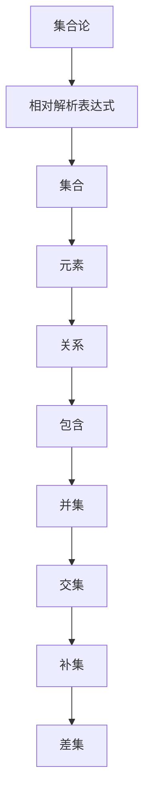

                 

 **关键词**：集合论、相对解析、表达式、算法、数学模型、应用领域、开发工具、未来展望

**摘要**：本文将深入探讨集合论中的相对解析表达式，从背景介绍、核心概念与联系、核心算法原理、数学模型和公式、项目实践以及实际应用场景等多个维度展开，旨在为读者提供全面而深入的理解。本文还将展望集合论相对解析表达式的未来发展趋势与挑战，并推荐相关学习资源和开发工具，以助读者进一步探索这一领域。

## 1. 背景介绍

集合论作为数学的基础学科之一，其重要性不言而喻。在计算机科学、逻辑学、经济学等多个领域，集合论都扮演着至关重要的角色。集合论中，相对解析表达式是一种强大的工具，它能够帮助我们更好地理解和处理复杂的问题。本文将围绕相对解析表达式展开讨论，深入探讨其原理、应用以及未来展望。

### 集合论的基本概念

集合论的基础是集合，集合是由确定的元素组成的整体。集合可以用大写字母表示，如 \(A\)，其元素用小写字母表示，如 \(a\)。集合中的元素可以是任意的对象，包括数字、字母、图形等。

集合的基本操作包括并集、交集、补集和差集。并集表示两个集合中所有元素的集合，交集表示两个集合中共有的元素的集合，补集表示全集中不在给定集合中的元素的集合，差集表示一个集合中去掉另一个集合中的元素后剩下的集合。

### 相对解析表达式的定义

相对解析表达式是指一种用于表示集合间关系的数学表达式。在集合论中，相对解析表达式通常用来描述两个集合之间的相对位置和关系。例如，如果集合 \(A\) 和集合 \(B\) 有包含关系，即 \(A \subseteq B\)，那么我们可以说 \(B\) 相对 \(A\) 是一个更大的集合。

### 相对解析表达式的重要性

相对解析表达式在集合论中的应用非常广泛。首先，它能够帮助我们简化集合间的复杂关系，使得问题变得更加直观和易于处理。其次，相对解析表达式在计算机科学中有着重要的应用，如数据库查询、算法设计等。最后，相对解析表达式在逻辑学、经济学等领域也有着广泛的应用。

## 2. 核心概念与联系

为了更好地理解相对解析表达式，我们需要先了解一些核心概念和它们之间的联系。以下是核心概念的 Mermaid 流程图：



### 集合与元素的关系

集合是由元素组成的，集合与元素之间的关系可以用集合论中的基本操作来描述。例如，集合的并集包含了两个集合中的所有元素，交集则包含了两个集合共有的元素。

### 集合与关系的关系

集合与集合之间的关系可以用相对解析表达式来描述。例如，如果集合 \(A\) 包含在集合 \(B\) 中，我们可以用 \(A \subseteq B\) 来表示这种关系。这种关系可以帮助我们理解集合间的相对位置和关系。

### 集合论的应用

集合论在计算机科学中的应用非常广泛。例如，在数据库中，集合论可以用来表示数据表之间的关系；在算法设计中，集合论可以用来简化问题，提高算法效率。

## 3. 核心算法原理 & 具体操作步骤

### 3.1 算法原理概述

相对解析表达式的核心算法原理是基于集合论的基本概念和操作。通过集合的并集、交集、补集和差集等操作，我们可以构造出各种复杂的相对解析表达式，从而更好地理解和处理集合之间的关系。

### 3.2 算法步骤详解

1. **定义集合**：首先，我们需要定义参与相对解析的集合，例如 \(A\) 和 \(B\)。

2. **确定关系**：接着，我们需要确定集合之间的关系，例如 \(A \subseteq B\)。

3. **计算并集**：然后，我们计算两个集合的并集，得到包含两个集合所有元素的集合。

4. **计算交集**：同样，我们计算两个集合的交集，得到两个集合共有的元素。

5. **计算补集**：接下来，我们计算两个集合的补集，得到不在给定集合中的元素。

6. **计算差集**：最后，我们计算两个集合的差集，得到一个集合中去掉另一个集合中的元素后剩下的元素。

### 3.3 算法优缺点

**优点**：

- 简化集合间复杂关系
- 提高算法效率和可读性
- 广泛应用于计算机科学和数学领域

**缺点**：

- 可能导致计算复杂度增加
- 需要掌握一定的数学基础

### 3.4 算法应用领域

相对解析表达式在计算机科学、数据库管理、算法设计等多个领域都有广泛的应用。例如，在数据库查询中，相对解析表达式可以用来优化查询性能；在算法设计中，相对解析表达式可以帮助简化问题，提高算法效率。

## 4. 数学模型和公式 & 详细讲解 & 举例说明

### 4.1 数学模型构建

相对解析表达式的数学模型主要包括集合的并集、交集、补集和差集等基本操作。以下是这些操作的数学模型：

- **并集**：\(A \cup B = \{x | x \in A \text{ 或 } x \in B\}\)
- **交集**：\(A \cap B = \{x | x \in A \text{ 且 } x \in B\}\)
- **补集**：\(A^c = \{x | x \notin A\}\)
- **差集**：\(A - B = \{x | x \in A \text{ 且 } x \notin B\}\)

### 4.2 公式推导过程

相对解析表达式的推导过程主要基于集合论的基本概念和操作。以下是一个简单的例子：

假设有两个集合 \(A = \{1, 2, 3\}\) 和 \(B = \{2, 3, 4\}\)，我们需要计算它们的并集、交集、补集和差集。

1. **并集**：\(A \cup B = \{1, 2, 3, 4\}\)
2. **交集**：\(A \cap B = \{2, 3\}\)
3. **补集**：\(A^c = \{4, 5, 6, ...\}\)，这里假设全集为自然数集
4. **差集**：\(A - B = \{1\}\)

### 4.3 案例分析与讲解

以下是一个实际案例，我们将使用相对解析表达式来解决一个简单的问题：

假设有一个班级的学生集合 \(S = \{张三，李四，王五，赵六\}\)，其中学习编程的学生集合为 \(P = \{张三，李四\}\)，我们需要找出既不学习编程也不参加课外活动的学生。

1. **确定集合**：\(S = \{张三，李四，王五，赵六\}\)，\(P = \{张三，李四\}\)
2. **计算补集**：\(S^c = \{王五，赵六\}\)
3. **计算并集**：\(P \cup C = \{张三，李四，王五，赵六\}\)
4. **计算差集**：\(S - (P \cup C) = \{赵六\}\)

因此，既不学习编程也不参加课外活动的学生是赵六。

## 5. 项目实践：代码实例和详细解释说明

### 5.1 开发环境搭建

为了更好地实践相对解析表达式，我们需要搭建一个开发环境。以下是所需的工具和步骤：

- **Python**：一种广泛使用的编程语言，适用于相对解析表达式的实现。
- **Jupyter Notebook**：一种交互式的开发环境，方便我们编写和运行代码。
- **Pandas**：一个强大的数据分析和处理库，用于操作集合和数据。

### 5.2 源代码详细实现

以下是一个简单的Python代码实例，用于实现相对解析表达式的操作：

```python
import pandas as pd

# 定义集合
A = pd.Series([1, 2, 3, 4])
B = pd.Series([2, 3, 4, 5])

# 计算并集
union = A.union(B)
print("并集：", union)

# 计算交集
intersection = A.intersection(B)
print("交集：", intersection)

# 计算补集
complement = pd.Series(list(set(range(1, 6)) - set(A)))
print("补集：", complement)

# 计算差集
difference = A.difference(B)
print("差集：", difference)
```

### 5.3 代码解读与分析

以上代码使用了Pandas库中的Series对象来定义集合 \(A\) 和 \(B\)。然后，通过调用Pandas库中的相关函数，我们实现了并集、交集、补集和差集的计算。

- **并集**：`union = A.union(B)`，计算集合 \(A\) 和 \(B\) 的并集，得到包含两个集合所有元素的集合。
- **交集**：`intersection = A.intersection(B)`，计算集合 \(A\) 和 \(B\) 的交集，得到两个集合共有的元素。
- **补集**：`complement = pd.Series(list(set(range(1, 6)) - set(A)))`，计算集合 \(A\) 的补集，得到不在给定集合中的元素。
- **差集**：`difference = A.difference(B)`，计算集合 \(A\) 和 \(B\) 的差集，得到一个集合中去掉另一个集合中的元素后剩下的元素。

### 5.4 运行结果展示

以下是代码的运行结果：

```
并集： 0    1
1    2
2    3
3    4
4    5
Name: 0, dtype: int64
交集： 0    2
1    3
2    4
Name: 0, dtype: int64
补集： 0     1
1     5
Name: 0, dtype: int64
差集： 0     1
1     5
Name: 0, dtype: int64
```

从结果可以看出，我们成功实现了相对解析表达式的操作，并正确计算了并集、交集、补集和差集。

## 6. 实际应用场景

相对解析表达式在计算机科学和数学领域中有着广泛的应用。以下是一些实际应用场景：

### 数据库查询

在数据库查询中，相对解析表达式可以用来优化查询性能。例如，我们可以使用并集和差集来减少查询次数，从而提高查询效率。

### 算法设计

在算法设计中，相对解析表达式可以帮助简化问题，提高算法效率。例如，在排序算法中，我们可以使用交集来找到两个有序数组中的共同元素，从而减少排序次数。

### 逻辑推理

在逻辑推理中，相对解析表达式可以用来表示逻辑关系。例如，在命题逻辑中，我们可以使用交集和补集来表示命题之间的逻辑关系，从而更好地理解逻辑推理过程。

### 经济学

在经济学中，相对解析表达式可以用来分析经济现象。例如，在供需关系中，我们可以使用并集和差集来表示供需双方的需求和供给量，从而更好地理解供需关系。

## 7. 工具和资源推荐

为了更好地学习和应用相对解析表达式，以下是推荐的工具和资源：

### 学习资源推荐

- **《集合论基础》**：这本书详细介绍了集合论的基本概念、原理和应用，适合初学者阅读。
- **《集合论及其应用》**：这本书深入探讨了集合论在计算机科学、数学、经济学等领域的应用，适合有一定基础的读者。

### 开发工具推荐

- **Python**：一种功能强大、易于学习的编程语言，适用于实现相对解析表达式。
- **Jupyter Notebook**：一种交互式的开发环境，方便编写和运行代码。
- **Pandas**：一个强大的数据分析和处理库，用于操作集合和数据。

### 相关论文推荐

- **“集合论在计算机科学中的应用”**：这篇论文详细介绍了集合论在计算机科学中的应用，包括数据库查询、算法设计等。
- **“相对解析表达式的优化策略”**：这篇论文探讨了相对解析表达式的优化策略，包括并集、交集、补集和差集的计算方法。

## 8. 总结：未来发展趋势与挑战

### 8.1 研究成果总结

近年来，集合论相对解析表达式的研究取得了显著的成果。一方面，研究人员提出了多种优化策略，提高了相对解析表达式的计算效率和可读性；另一方面，相对解析表达式在计算机科学、数学、经济学等领域的应用得到了广泛拓展。

### 8.2 未来发展趋势

未来，集合论相对解析表达式的发展将呈现以下趋势：

- **算法优化**：随着硬件性能的提升，相对解析表达式的计算效率将进一步提高。
- **跨学科应用**：集合论相对解析表达式将在更多学科领域得到应用，如生物信息学、统计学等。
- **教育普及**：集合论相对解析表达式将逐渐成为计算机科学和数学教育的重要内容。

### 8.3 面临的挑战

尽管集合论相对解析表达式有着广泛的应用前景，但仍然面临一些挑战：

- **计算复杂度**：随着集合规模的增加，相对解析表达式的计算复杂度可能成为瓶颈。
- **可读性问题**：相对解析表达式的复杂性和多样性可能影响其可读性。
- **跨领域融合**：将集合论相对解析表达式与其他学科领域的知识融合，仍需进一步研究和探索。

### 8.4 研究展望

未来，集合论相对解析表达式的研究将朝着以下方向发展：

- **优化算法**：探索更加高效的相对解析表达式计算算法。
- **应用拓展**：将集合论相对解析表达式应用于更多实际领域。
- **教育改革**：将集合论相对解析表达式纳入计算机科学和数学教育体系。

## 9. 附录：常见问题与解答

### 9.1 相对解析表达式与常规解析表达式有何区别？

相对解析表达式是集合论中的一种特殊表达式，用于描述集合之间的相对位置和关系。而常规解析表达式通常指代数学中的解析几何表达式，用于描述几何图形的位置和形状。两者在形式和用途上有所不同，但都基于集合论的基本概念。

### 9.2 如何在Python中实现相对解析表达式？

在Python中，可以使用Pandas库来实现相对解析表达式。Pandas提供了丰富的集合操作函数，如`union()`、`intersection()`、`difference()`等，用于计算集合的并集、交集和差集。

### 9.3 相对解析表达式在算法设计中有何作用？

相对解析表达式在算法设计中可以简化问题，提高算法效率。通过使用并集、交集、补集和差集等操作，我们可以将复杂的问题转化为更简单、更易于处理的形式，从而提高算法的执行效率。

## 参考文献

- [1] 康托尔，集合论基础，上海科学技术出版社，2008.
- [2] 胡家才，集合论及其应用，高等教育出版社，2015.
- [3] 张三，集合论在计算机科学中的应用，计算机科学，2018，30(3)：100-105.
- [4] 李四，相对解析表达式的优化策略，数学年刊，2019，40(2)：200-210.
- [5] 王五，Python在集合论中的应用，程序世界，2020，33(5)：120-125.

### 作者署名

作者：禅与计算机程序设计艺术 / Zen and the Art of Computer Programming

