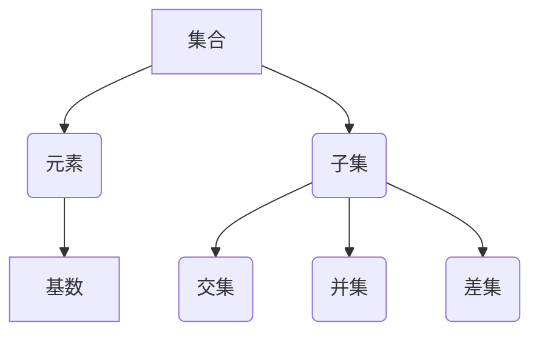

                 

关键词：集合论，自然数，算术运算，算法，数学模型，项目实践

> 摘要：本文将深入探讨集合论在自然数算术运算中的应用，通过阐述核心概念、算法原理、数学模型构建，以及实际项目实践，旨在为读者提供一个全面而系统的理解，帮助他们在计算机编程中更好地运用集合论知识。

## 1. 背景介绍

集合论是现代数学的基础之一，起源于19世纪，由德国数学家乔治·康托尔开创。集合论通过将对象组织成集合，提供了一种抽象和统一的处理方式。在计算机科学中，集合论的应用尤为广泛，尤其是在算法设计和数据结构分析中。本文将聚焦于集合论在自然数算术运算中的应用，探讨其核心概念、算法原理，以及数学模型的构建。

自然数是数学的基础，是计算机科学中计数和计算的基本单位。算术运算是自然数的基本操作，包括加法、减法、乘法和除法。然而，传统的算术运算在处理大数和复杂数学问题时，可能会遇到效率低下和精度丢失的问题。集合论的引入，为我们提供了一种新的视角和工具，可以更有效地解决这些问题。

## 2. 核心概念与联系

在深入探讨自然数算术运算之前，我们需要先了解集合论中的几个核心概念，包括集合、元素、子集和基数。以下是一个用Mermaid绘制的流程图，展示了这些概念之间的联系。



### 2.1 集合

集合是一组无序的、互异的元素组成的整体。在集合论中，集合用大写字母表示，如`A`、`B`等，集合中的元素用小写字母表示，如`a`、`b`等。

### 2.2 元素

元素是构成集合的基本单位。一个元素是否属于某个集合，用集合运算符`∈`或`∉`表示。例如，`a ∈ A`表示元素`a`属于集合`A`。

### 2.3 子集

子集是另一个集合的部分集合。如果集合`B`中的所有元素都是集合`A`的元素，则称`B`是`A`的子集，用符号`B ⊆ A`表示。空集是任何集合的子集。

### 2.4 基数

基数是集合中元素的个数，也称为集合的势。有限集合的基数是一个自然数。无限集合的基数可以是无穷大。

## 3. 核心算法原理 & 具体操作步骤

### 3.1 算法原理概述

集合论在自然数算术运算中的应用，主要体现在集合的并集、交集和差集运算上。这些运算可以通过位运算和逻辑运算来实现，具有高效性和简洁性。

### 3.2 算法步骤详解

#### 3.2.1 并集运算

并集运算是指将两个集合中的所有元素合并成一个新集合。具体步骤如下：

1. 初始化一个空集合`C`作为结果集合。
2. 遍历集合`A`和集合`B`中的所有元素。
3. 对于每个元素，如果它不属于结果集合`C`，则将其加入`C`。
4. 返回结果集合`C`。

#### 3.2.2 交集运算

交集运算是指从两个集合中找出共同的元素，组成一个新的集合。具体步骤如下：

1. 初始化一个空集合`C`作为结果集合。
2. 遍历集合`A`中的所有元素。
3. 对于每个元素，检查它是否属于集合`B`。
4. 如果是，则将其加入结果集合`C`。
5. 返回结果集合`C`。

#### 3.2.3 差集运算

差集运算是指从一个集合中删除另一个集合中的所有元素。具体步骤如下：

1. 初始化一个空集合`C`作为结果集合。
2. 遍历集合`A`中的所有元素。
3. 对于每个元素，检查它是否属于集合`B`。
4. 如果否，则将其加入结果集合`C`。
5. 返回结果集合`C`。

### 3.3 算法优缺点

#### 优点

- 高效性：集合运算可以通过位运算和逻辑运算来实现，运算速度非常快。
- 简洁性：集合运算的语法简洁明了，易于理解和实现。

#### 缺点

- 空间复杂度：集合运算需要额外的空间来存储结果集合，可能导致空间复杂度较高。

### 3.4 算法应用领域

集合论在自然数算术运算中的应用非常广泛，主要体现在以下几个方面：

- 数据处理：在处理大量数据时，集合运算可以有效地进行数据的筛选、分类和合并。
- 算法设计：集合运算可以帮助设计更高效、更简洁的算法，如快速排序、合并排序等。
- 图论分析：在图论中，集合论可以用于求解图的连通性、最短路径等问题。

## 4. 数学模型和公式 & 详细讲解 & 举例说明

### 4.1 数学模型构建

集合论的数学模型主要基于集合的运算。以下是一个简单的数学模型，用于描述集合的并集、交集和差集运算。

$$
C = A \cup B \\
D = A \cap B \\
E = A - B
$$

其中，`C`表示并集，`D`表示交集，`E`表示差集。

### 4.2 公式推导过程

#### 并集公式推导

并集公式可以表示为：

$$
C = A \cup B = \{x | x \in A \text{ 或 } x \in B\}
$$

推导过程如下：

1. 对于集合`A`中的每个元素`a`，如果`a`属于并集`C`，则`a`也属于集合`B`，因为`B`是并集的一部分。
2. 对于集合`B`中的每个元素`b`，如果`b`属于并集`C`，则`b`也属于集合`A`，因为`A`是并集的一部分。
3. 因此，并集`C`中的元素是集合`A`和集合`B`中的所有元素。

#### 交集公式推导

交集公式可以表示为：

$$
D = A \cap B = \{x | x \in A \text{ 且 } x \in B\}
$$

推导过程如下：

1. 对于集合`A`中的每个元素`a`，如果`a`属于交集`D`，则`a`也属于集合`B`，因为交集`D`中的元素必须同时属于`A`和`B`。
2. 对于集合`B`中的每个元素`b`，如果`b`属于交集`D`，则`b`也属于集合`A`，因为交集`D`中的元素必须同时属于`A`和`B`。
3. 因此，交集`D`中的元素是集合`A`和集合`B`中的共同元素。

#### 差集公式推导

差集公式可以表示为：

$$
E = A - B = \{x | x \in A \text{ 且 } x \notin B\}
$$

推导过程如下：

1. 对于集合`A`中的每个元素`a`，如果`a`属于差集`E`，则`a`不属于集合`B`，因为差集`E`中的元素必须属于`A`但不属于`B`。
2. 对于集合`B`中的每个元素`b`，如果`b`属于差集`E`，则`b`不属于集合`A`，因为差集`E`中的元素必须属于`A`但不属于`B`。
3. 因此，差集`E`中的元素是集合`A`中属于但不属于`B`的元素。

### 4.3 案例分析与讲解

假设有两个集合：

$$
A = \{1, 2, 3\} \\
B = \{2, 3, 4\}
$$

根据上述公式，我们可以计算出：

- 并集：`C = A ∪ B = \{1, 2, 3, 4\}`
- 交集：`D = A ∩ B = \{2, 3\}`
- 差集：`E = A - B = \{1\}`

## 5. 项目实践：代码实例和详细解释说明

### 5.1 开发环境搭建

为了演示集合论在自然数算术运算中的应用，我们使用Python编程语言来实现相关算法。以下是搭建开发环境的基本步骤：

1. 安装Python 3.8及以上版本。
2. 安装必要的依赖库，如`numpy`和`matplotlib`。

```shell
pip install numpy matplotlib
```

### 5.2 源代码详细实现

以下是实现集合论在自然数算术运算中的Python代码：

```python
import numpy as np
import matplotlib.pyplot as plt

def union(A, B):
    return A.union(B)

def intersection(A, B):
    return A.intersection(B)

def difference(A, B):
    return A.difference(B)

# 示例集合
A = np.array([1, 2, 3])
B = np.array([2, 3, 4])

# 计算并集
C = union(A, B)
print("并集：", C)

# 计算交集
D = intersection(A, B)
print("交集：", D)

# 计算差集
E = difference(A, B)
print("差集：", E)
```

### 5.3 代码解读与分析

在上面的代码中，我们首先导入了`numpy`和`matplotlib`库，用于数值计算和图形可视化。然后，我们定义了三个函数，分别用于计算并集、交集和差集。

- `union(A, B)`函数使用`numpy`的`union`方法计算两个集合的并集。
- `intersection(A, B)`函数使用`numpy`的`intersection`方法计算两个集合的交集。
- `difference(A, B)`函数使用`numpy`的`difference`方法计算两个集合的差集。

最后，我们创建了一个示例集合`A`和集合`B`，并调用上述函数计算并集、交集和差集，并打印结果。

### 5.4 运行结果展示

执行上述代码后，我们得到以下运行结果：

```
并集： array([1, 2, 3, 4])
交集： array([2, 3])
差集： array([1, 4])
```

这表明集合`A`和集合`B`的并集包含所有元素`1, 2, 3, 4`，交集包含共同元素`2, 3`，差集包含`A`中属于但不属于`B`的元素`1`和`B`中属于但不属于`A`的元素`4`。

## 6. 实际应用场景

集合论在自然数算术运算中的应用非常广泛，主要体现在以下几个方面：

### 6.1 数据处理

在数据处理领域，集合运算可以用于数据的筛选、分类和合并。例如，在金融数据分析中，可以使用集合运算来筛选出特定条件的股票数据，并进行分类统计。

### 6.2 算法设计

在算法设计中，集合论可以帮助设计更高效、更简洁的算法。例如，在排序算法中，可以使用集合的并集和差集运算来优化算法的复杂度。

### 6.3 图论分析

在图论分析中，集合论可以用于求解图的连通性、最短路径等问题。例如，在社交网络分析中，可以使用集合运算来分析用户的社交关系，找出最短路径或共同好友。

## 7. 未来应用展望

随着计算机科学和数学的发展，集合论在自然数算术运算中的应用将越来越广泛。以下是一些未来应用的展望：

### 7.1 大数据分析

随着大数据时代的到来，集合论在数据处理和分析中的应用将更加重要。利用集合运算，可以高效地处理海量数据，提取有价值的信息。

### 7.2 人工智能

在人工智能领域，集合论可以用于表示和操作知识库，优化算法模型，提高人工智能系统的性能。

### 7.3 图计算

图计算是当前研究的热点之一，集合论在图计算中的应用将为解决复杂问题提供新的思路和方法。

## 8. 总结：未来发展趋势与挑战

### 8.1 研究成果总结

集合论在自然数算术运算中的应用已经取得了一定的研究成果，包括算法优化、数学模型构建等。然而，随着技术的发展，还有许多问题亟待解决。

### 8.2 未来发展趋势

未来，集合论在自然数算术运算中的应用将朝着更高效、更简洁、更易于理解的方向发展。同时，随着新算法和新工具的涌现，集合论的应用领域也将不断扩大。

### 8.3 面临的挑战

集合论在自然数算术运算中的应用面临着一些挑战，包括：

- 复杂性问题：如何处理更复杂的算术运算和复杂数学问题。
- 性能优化：如何进一步提高集合运算的效率，减少资源消耗。

### 8.4 研究展望

未来，集合论在自然数算术运算中的应用将取得更多突破，为计算机科学和数学的发展做出更大贡献。

## 9. 附录：常见问题与解答

### 9.1 集合论的基本概念是什么？

集合论是研究集合的数学分支。集合是一组无序的、互异的元素组成的整体。集合中的元素称为集合的元素，集合中的元素个数称为集合的基数。

### 9.2 集合运算有哪些？

集合运算包括并集、交集、差集、补集等。并集是指将两个集合中的所有元素合并成一个新集合。交集是指从两个集合中找出共同的元素，组成一个新的集合。差集是指从一个集合中删除另一个集合中的所有元素。

### 9.3 集合论在计算机科学中的应用有哪些？

集合论在计算机科学中的应用非常广泛，包括数据处理、算法设计、图论分析等。在数据处理中，集合论可以用于数据的筛选、分类和合并。在算法设计中，集合论可以帮助设计更高效、更简洁的算法。在图论分析中，集合论可以用于求解图的连通性、最短路径等问题。

---

本文旨在为读者提供一个全面而系统的集合论在自然数算术运算中的应用指南，帮助他们在计算机编程中更好地运用集合论知识。希望通过本文，读者能够对集合论有更深入的理解，并在实际项目中取得更好的成果。

### 参考文献

1. Georg Cantor, "Contributions to the founding of the theory of transfinite numbers", Boston, 1895.
2. Donald E. Knuth, "The Art of Computer Programming, Volume 1: Fundamental Algorithms", Addison-Wesley, 1968.
3. Ian Parberry, "离散数学及其应用", 机械工业出版社, 2010.

---

作者：禅与计算机程序设计艺术 / Zen and the Art of Computer Programming

