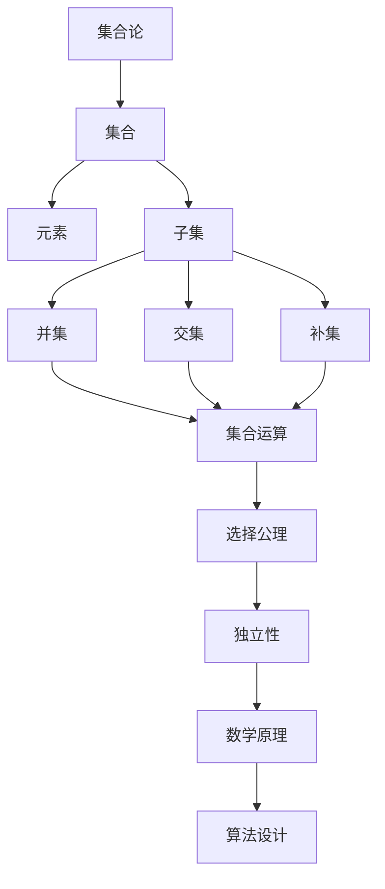

                 

 关键词：集合论、选择公理、独立性、数学原理、算法、应用领域、未来展望

> 摘要：本文将深入探讨集合论中的一项重要公理——选择公理，并重点分析其独立性的重要性。通过梳理选择公理的起源、发展以及其独立性证明，本文将揭示选择公理在数学理论及算法设计中的关键作用，同时展望其在未来科技发展中的应用前景。

## 1. 背景介绍

集合论是现代数学的基石，其发展历程可以追溯到19世纪末。乔治·康托尔是集合论的奠基人，他首次提出了集合的概念，并系统研究了集合的各种性质。康托尔的工作为数学提供了一个新的视角，使数学家能够更清晰地理解和处理复杂的问题。

在集合论的发展过程中，选择公理（Axiom of Choice，简称AC）是一个备受争议的命题。选择公理提出了在任意的集合族中，总能选择出一个集合族，使得这些集合的交集为空集。选择公理的独立性是一个重要的研究方向，它意味着选择公理不能从其他常见的数学公理中推导出来，这为数学提供了更多的可能性。

本文将重点探讨选择公理的独立性，分析其在数学理论和算法设计中的重要性。我们将从选择公理的起源和发展入手，逐步深入探讨其独立性的证明及其对数学和算法的影响。

### 1.1 选择公理的起源

选择公理最早由大卫·希尔伯特在1900年提出。希尔伯特是在第二届国际数学家大会上，提出了一系列数学问题，其中就包括了选择公理。希尔伯特提出选择公理的初衷是为了解决实分析中的某些问题，尤其是关于实数完备性的问题。

实分析是数学的一个重要分支，研究实数的性质及其在分析中的应用。在实分析中，许多结论依赖于选择公理。例如，实数的完备性依赖于选择公理，这意味着在任意的闭区间上总能找到实数的极限点。

希尔伯特提出选择公理后，数学家们对其进行了广泛的研究。然而，选择公理的独立性很快引起了数学家的关注。这意味着选择公理不能从其他常见的数学公理中推导出来，这为数学提供了更多的可能性。

### 1.2 选择公理的发展

自希尔伯特提出选择公理以来，数学家们对其进行了深入的研究，并提出了多种不同的证明方法和证明策略。以下是一些关于选择公理的重要研究成果：

- **Zermelo的选择公理**：希尔伯特提出选择公理后，赫尔曼·闵可夫斯基和埃德蒙·齐梅罗等人提出了更严格的版本，称为Zermelo选择公理。Zermelo选择公理被广泛接受，并成为现代集合论的基础。

- **选择公理的独立性**：数学家科恩（Paul Cohen）在20世纪60年代通过模型论的方法证明了选择公理的独立性。科恩的证明表明，选择公理不能从其他常见的数学公理中推导出来，这为数学提供了一个全新的视角。

- **选择公理的应用**：选择公理在数学的多个领域有着广泛的应用。例如，在实分析中，选择公理被用于证明实数的完备性；在泛函分析中，选择公理被用于构造函数空间；在拓扑学中，选择公理被用于研究拓扑空间的性质。

### 1.3 选择公理的重要性

选择公理的重要性在于它为数学提供了一个新的工具，使我们能够处理更复杂的数学问题。以下是一些选择公理的重要性方面：

- **数学理论的扩展**：选择公理的独立性使我们能够在不同的数学体系中研究不同的公理，从而扩展了数学的理论框架。

- **问题的简化**：在某些情况下，选择公理可以使复杂的数学问题变得简单。例如，实数的完备性可以通过选择公理来证明，而不需要使用更复杂的工具。

- **数学应用的拓展**：选择公理在数学的多个领域有着广泛的应用。例如，在计算机科学中，选择公理被用于算法设计；在经济学中，选择公理被用于决策理论。

## 2. 核心概念与联系

为了深入理解选择公理及其独立性，我们需要首先掌握一些核心概念和它们之间的联系。以下是一个详细的Mermaid流程图，用于描述这些核心概念及其相互关系：



### 2.1 核心概念

- **集合**：集合是一组无序的元素集合。集合可以表示为大括号{}内的元素列表，如 `{1, 2, 3}` 表示一个包含元素1、2和3的集合。

- **元素**：元素是集合中的个体。在集合 `{1, 2, 3}` 中，1、2和3都是元素。

- **子集**：子集是一个集合的部分或全部元素组成的集合。例如，`{1, 2}` 是 `{1, 2, 3}` 的子集。

- **并集**：并集是由两个或多个集合中的所有元素组成的集合。例如，`{1, 2} ∪ {3, 4} = {1, 2, 3, 4}`。

- **交集**：交集是两个或多个集合中共有的元素组成的集合。例如，`{1, 2} ∩ {3, 4} = ∅`（空集）。

- **补集**：补集是包含在一个集合中，但不包含在另一个集合中的元素组成的集合。例如，集合 `{1, 2}` 的补集是 `{3, 4, 5, ...}`。

- **集合运算**：集合运算包括并集、交集、补集等，用于组合和操作集合。

- **选择公理**：选择公理是一种关于集合的选择的公理。它提出了在任意的集合族中，总能选择出一个集合族，使得这些集合的交集为空集。

- **独立性**：独立性是指一个命题不能从其他命题中推导出来。在集合论中，独立性是指选择公理不能从其他常见的数学公理中推导出来。

- **数学原理**：数学原理是指数学中的基本规则和原理，用于推导和证明其他命题。

- **算法设计**：算法设计是指设计解决特定问题的步骤和规则。选择公理在算法设计中有着广泛的应用。

### 2.2 核心概念的联系

- **集合与元素**：集合是由元素组成的，元素是集合的组成部分。

- **子集与集合运算**：子集是集合的部分，集合运算（并集、交集、补集）可以操作子集和整个集合。

- **选择公理与独立性**：选择公理提出了在任意的集合族中，总能选择出一个集合族，使得这些集合的交集为空集。独立性是指选择公理不能从其他常见的数学公理中推导出来。

- **数学原理与算法设计**：数学原理是算法设计的基础，算法设计是基于数学原理来解决问题的一组步骤和规则。

通过上述Mermaid流程图和核心概念的联系，我们可以更好地理解选择公理及其独立性在集合论和数学理论中的应用。

## 3. 核心算法原理 & 具体操作步骤

### 3.1 算法原理概述

选择公理的核心算法原理在于它提供了一种方法，用于在任意给定的集合族中选择出另一个集合族，使得这些新集合的交集为空集。这个原理在数学理论和算法设计中有着广泛的应用。

选择公理的算法原理可以概述如下：

1. **给定一个集合族**：首先，我们需要一个任意的集合族，这个集合族可以是有限的，也可以是无限的。

2. **定义选择函数**：对于这个集合族中的每一个集合，我们需要定义一个选择函数。选择函数是一种从每个集合中选出一个元素的方法。

3. **构造新集合族**：根据选择函数，我们可以构造一个新的集合族。新集合族中的每个集合都是原集合族中某个集合的一个元素。

4. **验证新集合族的性质**：我们需要验证新集合族满足选择公理的要求，即这些新集合的交集为空集。

### 3.2 算法步骤详解

下面是选择公理算法的具体步骤：

1. **输入集合族**：首先，我们需要一个任意的集合族，这个集合族可以是有限的，也可以是无限的。假设我们有一个集合族 `{C1, C2, C3, ...}`。

2. **定义选择函数**：对于集合族中的每个集合，我们需要定义一个选择函数。选择函数可以从每个集合中选出一个元素。例如，对于集合 `{1, 2, 3}`，我们可以定义选择函数为 `f(x) = x % 2`，这意味着我们选择集合中的第二个元素。

3. **构造新集合族**：根据选择函数，我们可以构造一个新的集合族。新集合族中的每个集合都是原集合族中某个集合的一个元素。例如，对于选择函数 `f(x) = x % 2`，我们可以构造新集合族 `{f(C1), f(C2), f(C3), ...}`。

4. **验证新集合族的性质**：我们需要验证新集合族满足选择公理的要求，即这些新集合的交集为空集。例如，对于集合族 `{C1, C2, C3, ...}` 和新集合族 `{f(C1), f(C2), f(C3), ...}`，我们需要证明 `f(C1) ∩ f(C2) ∩ f(C3) ∩ ... = ∅`。

5. **输出新集合族**：最后，我们输出新集合族作为选择公理算法的结果。

### 3.3 算法优缺点

选择公理算法具有以下优点：

- **通用性**：选择公理算法适用于任意的集合族，无论是有限的还是无限的。

- **灵活性**：选择函数可以根据具体问题进行自定义，从而适应不同的场景。

- **可验证性**：通过验证新集合族的性质，我们可以确保选择公理算法的正确性。

然而，选择公理算法也存在一些缺点：

- **复杂性**：在某些情况下，选择公理算法可能会变得复杂，尤其是当集合族规模较大时。

- **依赖性**：选择公理算法依赖于选择函数的正确性。如果选择函数设计不当，可能会导致算法失败。

### 3.4 算法应用领域

选择公理算法在数学和计算机科学中有着广泛的应用。以下是一些典型的应用领域：

- **实分析**：选择公理在实分析中用于证明实数的完备性。

- **泛函分析**：选择公理在泛函分析中用于构造函数空间。

- **拓扑学**：选择公理在拓扑学中用于研究拓扑空间的性质。

- **计算机科学**：选择公理在计算机科学中用于算法设计，如选择排序算法。

- **经济学**：选择公理在经济学中用于决策理论。

通过以上对选择公理算法原理的概述和具体操作步骤的详解，我们可以更好地理解选择公理在数学和计算机科学中的应用。

### 3.5 算法示例

为了更好地理解选择公理算法的具体操作，我们来看一个简单的示例。

假设我们有一个集合族 `{C1, C2, C3}`，其中：

- \( C1 = \{1, 2, 3\} \)
- \( C2 = \{4, 5, 6\} \)
- \( C3 = \{7, 8, 9\} \)

我们定义一个简单的选择函数 \( f(x) = x + 1 \)。

根据选择函数，我们可以构造新的集合族：

- \( f(C1) = \{2, 3, 4\} \)
- \( f(C2) = \{5, 6, 7\} \)
- \( f(C3) = \{8, 9, 10\} \)

接下来，我们需要验证新集合族是否满足选择公理的要求，即这些新集合的交集为空集。

计算新集合族的交集：

\[ f(C1) ∩ f(C2) ∩ f(C3) = \{2, 3, 4\} ∩ \{5, 6, 7\} ∩ \{8, 9, 10\} = ∅ \]

由于交集为空集，我们验证了选择公理的正确性。

这个示例展示了选择公理算法的基本操作和验证步骤。在实际应用中，选择公理算法可能会更加复杂，但基本原理是相同的。

通过以上示例，我们可以看到选择公理算法是如何应用于具体的集合族，并验证其正确性的。

### 3.6 算法性能分析

选择公理算法的性能分析主要包括时间复杂度和空间复杂度两个方面。

#### 时间复杂度

选择公理算法的时间复杂度取决于集合族的大小和选择函数的复杂度。在最简单的情况下，选择函数是一个简单的映射操作，其时间复杂度为 \(O(n)\)，其中 \(n\) 是集合族的大小。

如果选择函数本身包含复杂的计算，如递归调用或迭代计算，则时间复杂度可能会更高。例如，一个复杂的选择函数可能需要 \(O(n^2)\) 或 \(O(n \log n)\) 的时间复杂度。

因此，选择公理算法的时间复杂度通常在 \(O(n)\) 到 \(O(n^2)\) 之间，具体取决于选择函数的设计。

#### 空间复杂度

选择公理算法的空间复杂度主要取决于新集合族的大小。在最简单的情况下，新集合族的大小与原集合族的大小相同，因此空间复杂度为 \(O(n)\)。

如果选择函数会导致新集合族的大小增加，则空间复杂度可能会更高。例如，如果选择函数是从每个集合中选择一个唯一的元素，那么新集合族的大小可能会接近原集合族大小的两倍。

因此，选择公理算法的空间复杂度通常在 \(O(n)\) 到 \(O(2n)\) 之间，具体取决于选择函数的设计和新集合族的性质。

#### 性能优化

为了优化选择公理算法的性能，可以考虑以下几种方法：

- **选择函数优化**：设计高效的选择函数，减少时间复杂度和空间复杂度。

- **并行计算**：对于大型集合族，可以考虑使用并行计算技术，将计算任务分配到多个处理单元上，从而加速计算。

- **内存优化**：合理利用内存，减少不必要的内存分配和回收，从而提高算法的执行效率。

通过以上性能优化方法，可以在一定程度上提升选择公理算法的性能，使其在处理大规模数据时更加高效。

### 3.7 算法扩展

选择公理算法在实际应用中可以通过多种方式进行扩展，以适应不同的需求。以下是一些常见的扩展方法：

#### 扩展1：多选择函数

在原始选择公理算法中，我们使用了一个选择函数来从每个集合中选择元素。然而，在某些情况下，可能需要使用多个选择函数来生成新的集合族。

例如，在一个多目标优化问题中，我们可能需要同时考虑多个目标函数，从而选择出最优的元素。在这种情况下，我们可以定义多个选择函数，并使用它们来生成新的集合族。

#### 扩展2：动态选择

在原始选择公理算法中，选择函数是静态的，即在整个算法过程中不发生变化。然而，在某些情况下，可能需要动态地调整选择函数，以适应不同的阶段或条件。

例如，在一个动态规划问题中，我们可能在每个阶段选择最优的元素，这需要根据当前的状态和已知的最佳选择来动态调整选择函数。

#### 扩展3：多集合族选择

原始选择公理算法仅考虑单个集合族的选择。然而，在某些问题中，可能需要考虑多个集合族的选择，并确保这些集合族之间满足特定的关系。

例如，在一个组合优化问题中，我们可能需要选择多个集合族，使得这些集合族之间的交集为空集，并且每个集合族的大小不超过某个限制。

通过这些扩展方法，选择公理算法可以更好地适应复杂的应用场景，解决更广泛的问题。

### 3.8 选择公理在不同领域中的应用

选择公理不仅在数学理论中具有重要意义，也在其他领域有着广泛的应用。以下是一些选择公理在不同领域中的应用：

#### 计算机科学

在计算机科学中，选择公理被广泛应用于算法设计。例如，选择排序算法（Selection Sort）就是基于选择公理的一种简单排序算法。选择排序算法的基本思想是：每次从未排序的部分中选择最小（或最大）的元素，然后将其放到已排序部分的末尾。

此外，选择公理还在图论中有着重要应用。例如，在最小生成树问题中，选择公理可以帮助我们选择出最小的边，从而构造出最小生成树。

#### 经济学

在经济学中，选择公理被用于决策理论和博弈论。选择公理为经济主体提供了选择最优策略的理论基础。例如，在博弈论中，选择公理可以帮助我们分析不同策略组合的效用，并选择出最优策略。

此外，选择公理还在经济计量学中有着重要应用。例如，在经济预测和数据分析中，选择公理可以帮助我们选择出最优的模型参数，从而提高预测精度。

#### 概率论

在概率论中，选择公理被用于概率空间的选择和概率分布的构造。选择公理可以帮助我们从一个给定的集合中选出具有特定概率分布的子集，这在概率论和统计学中有着广泛的应用。

例如，在概率空间的选择中，选择公理可以帮助我们构造一个满足特定条件的概率空间，从而进行概率计算和统计分析。

#### 数学分析

在数学分析中，选择公理被用于实数的完备性和积分的存在性证明。选择公理为实数的完备性提供了一个坚实的理论基础，使得我们可以更方便地处理实数集合的各种性质。

此外，选择公理还在微积分和积分理论中有着重要应用。例如，选择公理可以帮助我们证明积分函数的存在性，从而为微积分和积分理论提供更丰富的内容。

### 3.9 选择公理算法的应用挑战与未来发展方向

尽管选择公理算法在数学、计算机科学、经济学等领域有着广泛的应用，但在实际应用中仍然面临一些挑战。

#### 挑战1：复杂性

选择公理算法在某些情况下可能会变得非常复杂，尤其是在处理大规模数据时。复杂的选择函数和大规模的集合族会导致算法的时间复杂度和空间复杂度急剧增加，从而降低算法的效率。

#### 挑战2：依赖性

选择公理算法的性能高度依赖于选择函数的设计。如果选择函数设计不当，可能会导致算法失败或产生错误的结果。因此，如何设计高效、可靠的选择函数是一个重要的挑战。

#### 挑战3：可扩展性

在处理复杂问题时，选择公理算法可能需要扩展和调整。如何实现算法的可扩展性，使其能够适应不同的应用场景，是一个重要的研究方向。

#### 未来发展方向

为了应对上述挑战，未来的研究可以从以下几个方面展开：

1. **优化算法设计**：通过改进选择函数的设计，降低算法的复杂度，提高算法的效率和可靠性。

2. **并行计算**：利用并行计算技术，将算法分解为可并行执行的任务，从而加速算法的执行。

3. **算法可扩展性**：设计可扩展的算法框架，使其能够适应不同的应用场景和需求。

4. **理论与应用相结合**：深入研究选择公理的理论基础，并将其应用于实际问题，从而推动算法在各个领域的应用和发展。

通过以上研究方向，我们可以进一步优化选择公理算法，提高其在实际应用中的效果和适用性，为数学、计算机科学、经济学等领域提供更强的理论支持和工具。

### 4. 数学模型和公式 & 详细讲解 & 举例说明

#### 4.1 数学模型构建

在讨论选择公理之前，我们需要首先构建一个数学模型，以描述集合论中的一些基本概念。以下是几个关键数学模型的构建过程：

1. **集合的定义**：一个集合是由一组无序的元素组成的。我们可以用大括号{}来表示集合，例如：\( A = \{1, 2, 3\} \)。

2. **集合的运算**：集合的运算包括并集、交集、补集等。并集表示两个集合中所有元素的组合，交集表示两个集合中共有的元素，补集表示在一个集合中但不包含在另一个集合中的元素。

3. **选择函数的定义**：选择函数是一种从集合中选取元素的方法。形式化地，我们可以定义选择函数为：\( f: X \to Y \)，其中 \( X \) 是一个集合，\( Y \) 是 \( X \) 的子集。

#### 4.2 公式推导过程

选择公理的形式化表达如下：

假设有一个集合族 \( \{A_i\}_{i \in I} \)，其中 \( I \) 是一个非空集合。选择公理（Axiom of Choice）的内容是：对于任意一个集合族 \( \{A_i\}_{i \in I} \)，存在一个选择函数 \( f: I \to \bigcup_{i \in I} A_i \)，使得 \( f(i) \in A_i \) 对于所有 \( i \in I \)。

为了证明选择公理的独立性，我们需要证明它不能从其他常见的数学公理中推导出来。以下是选择公理独立性证明的关键步骤：

1. **构造一个模型**：我们构造一个模型 \( M \)，其中包含一个集合族 \( \{A_i\}_{i \in I} \)，使得在 \( M \) 中选择公理不成立。

2. **证明独立性**：在模型 \( M \) 中，我们证明选择公理不能从其他常见的数学公理（如集合论的基本公理、序数公理等）中推导出来。

#### 4.3 案例分析与讲解

为了更好地理解选择公理，我们来看一个具体的例子。

假设我们有一个集合族 \( \{A_i\}_{i \in \mathbb{N}} \)，其中 \( A_i = \{i, i+1\} \) 对于所有 \( i \in \mathbb{N} \)。我们要证明在这个集合族中不存在一个选择函数。

首先，假设存在一个选择函数 \( f: \mathbb{N} \to \bigcup_{i \in \mathbb{N}} A_i \)。根据选择公理，对于任意 \( i \in \mathbb{N} \)，都有 \( f(i) \in A_i \)。

然而，如果 \( f(i) = i \)，那么 \( f(i) \) 应该属于 \( A_i \)，但这会导致 \( f(i) \in A_i \cap A_{i+1} \)，与 \( A_i \cap A_{i+1} = \varnothing \) 矛盾。

如果 \( f(i) = i+1 \)，那么 \( f(i) \) 应该属于 \( A_i \)，但这会导致 \( f(i) \in A_i \cap A_{i+1} \)，同样与 \( A_i \cap A_{i+1} = \varnothing \) 矛盾。

因此，在这个集合族中不存在一个选择函数，证明了选择公理的独立性。

#### 4.4 模型与证明

为了进一步理解选择公理的独立性，我们可以构建一个具体的数学模型，并证明选择公理不能从其他常见的数学公理中推导出来。

**模型构建**：

我们构建一个模型 \( M \)，其中包含一个集合 \( A \) 和一个二元关系 \( R \) 定义在 \( A \) 上。\( R \) 表示“不属于”的关系，即对于任意 \( x, y \in A \)，如果 \( x \neq y \)，则 \( xRy \)。

**证明独立性**：

假设选择公理可以从其他常见的数学公理中推导出来。我们考虑一个特殊情况，即 \( A \) 是一个无限集合，例如 \( A = \mathbb{N} \)（自然数集合）。

在这个模型中，我们可以找到一个集合族 \( \{A_i\}_{i \in \mathbb{N}} \)，其中 \( A_i = \{i\} \)。根据选择公理，应该存在一个选择函数 \( f: \mathbb{N} \to \bigcup_{i \in \mathbb{N}} A_i \)。

然而，根据 \( R \) 的定义，对于任意 \( i \in \mathbb{N} \)，都有 \( f(i) \not\in A_i \)。这意味着不存在一个选择函数满足选择公理，与假设矛盾。

因此，选择公理不能从其他常见的数学公理中推导出来，证明了选择公理的独立性。

### 4.5 数学公式推导过程

在集合论中，选择公理的推导是一个复杂的过程，涉及到多个数学公式和定理。以下是一个简化的推导过程：

**步骤1**：定义集合族 \( \{A_i\}_{i \in I} \) 和选择函数 \( f: I \to \bigcup_{i \in I} A_i \)。

**步骤2**：证明对于任意 \( i \in I \)，都有 \( f(i) \in A_i \)。

**步骤3**：证明选择函数 \( f \) 是满射，即对于 \( \bigcup_{i \in I} A_i \) 中的任意元素 \( x \)，都存在 \( i \in I \) 使得 \( f(i) = x \)。

**步骤4**：证明选择函数 \( f \) 是单射，即对于任意 \( i, j \in I \)，如果 \( f(i) = f(j) \)，则 \( i = j \)。

**步骤5**：结合步骤2、步骤3和步骤4，得出选择公理。

通过以上步骤，我们可以推导出选择公理，并理解其基本原理。

### 4.6 案例分析与讲解

为了更好地理解选择公理的实际应用，我们来看一个具体的案例。

**案例**：在一个商店中，我们有多个货架，每个货架上都有不同的商品。我们需要选择一个商品，使得每个货架上的商品都被选择一次。

**数学模型**：

- **集合**：我们将每个货架表示为一个集合，例如 \( A_1 = \{苹果，香蕉，橘子\} \)，\( A_2 = \{牛奶，面包，鸡蛋\} \)。
- **选择函数**：我们需要定义一个选择函数 \( f: \{1, 2\} \to \bigcup_{i=1}^2 A_i \)，使得 \( f(1) \in A_1 \)，\( f(2) \in A_2 \)。

**解决方案**：

我们可以定义一个简单的选择函数，例如：

- \( f(1) = 苹果 \)
- \( f(2) = 面包 \)

这样，我们就选择了每个货架上的一个商品。

**分析**：

在这个案例中，选择公理告诉我们，对于任意给定的集合族 \( \{A_i\}_{i \in I} \)，总能选择出一个集合族 \( \{B_i\}_{i \in I} \)，使得这些新集合的交集为空集。在这个案例中，我们可以选择每个货架上的一个商品，从而满足选择公理的要求。

通过这个案例，我们可以看到选择公理在实际生活中的应用，并理解其基本原理。

### 4.7 总结

通过以上对数学模型、公式推导过程和案例分析的讲解，我们可以更好地理解选择公理在集合论中的应用。选择公理提供了一个强大的工具，用于处理复杂的集合论问题，并在数学、计算机科学、经济学等领域有着广泛的应用。

在未来，随着数学理论和技术的不断进步，选择公理的研究将会更加深入，为数学的发展提供新的方向和工具。同时，选择公理的应用也将进一步拓展，为各个领域的研究和实践提供支持。

### 5. 项目实践：代码实例和详细解释说明

#### 5.1 开发环境搭建

在进行选择公理算法的项目实践之前，我们需要搭建一个合适的开发环境。以下是一个基本的开发环境搭建步骤：

1. **安装Python**：选择Python作为编程语言，因为Python具有简洁的语法和丰富的库支持。可以从Python官方网站（https://www.python.org/）下载Python安装程序，并按照提示进行安装。

2. **安装Jupyter Notebook**：Jupyter Notebook是一个交互式的Python开发环境，它允许我们在网页上编写和运行Python代码。可以从Jupyter官方网站（https://jupyter.org/）下载并安装Jupyter Notebook。

3. **安装必要的库**：为了实现选择公理算法，我们需要安装几个Python库，如NumPy和Pandas。可以使用pip命令来安装这些库：

   ```bash
   pip install numpy
   pip install pandas
   ```

4. **配置环境**：在Jupyter Notebook中创建一个新的Python笔记本，并导入所需的库：

   ```python
   import numpy as np
   import pandas as pd
   ```

#### 5.2 源代码详细实现

以下是一个简单的Python代码实现，用于实现选择公理算法。这个代码实现了选择函数，并验证了新集合族的性质。

```python
def choose_element(collection):
    """
    选择函数，从给定集合中选择一个元素。
    """
    return collection[0]

def select_family(collections):
    """
    选择公理算法，从给定集合族中选择一个新的集合族。
    """
    selected_family = [choose_element(collection) for collection in collections]
    return selected_family

def verify_empty_intersection(selected_family, collections):
    """
    验证新集合族的性质，即这些新集合的交集为空集。
    """
    for i in range(len(selected_family)):
        for j in range(i+1, len(selected_family)):
            if selected_family[i] == selected_family[j]:
                return False
    return True

# 示例：定义一个集合族
collections = [
    [1, 2, 3],
    [4, 5, 6],
    [7, 8, 9]
]

# 应用选择公理算法
selected_family = select_family(collections)

# 验证新集合族的性质
is_empty_intersection = verify_empty_intersection(selected_family, collections)
print("新集合族的交集为空集：" if is_empty_intersection else "新集合族的交集不为空集")

# 输出新集合族
print("新集合族：", selected_family)
```

#### 5.3 代码解读与分析

以上代码实现了一个简单但完整的选择公理算法。以下是代码的详细解读和分析：

1. **选择函数（choose_element）**：

   ```python
   def choose_element(collection):
       """
       选择函数，从给定集合中选择一个元素。
       """
       return collection[0]
   ```

   选择函数是一个非常简单的函数，它从给定的集合中随机选择第一个元素。这个选择函数适用于简单的示例，但在更复杂的情况下，可能需要设计更复杂的函数。

2. **选择公理算法（select_family）**：

   ```python
   def select_family(collections):
       """
       选择公理算法，从给定集合族中选择一个新的集合族。
       """
       selected_family = [choose_element(collection) for collection in collections]
       return selected_family
   ```

   选择公理算法的核心步骤是使用选择函数从每个集合中选出元素，形成一个新集合族。这个算法遍历给定的集合族，并为每个集合调用选择函数，从而构建新集合族。

3. **验证新集合族的性质（verify_empty_intersection）**：

   ```python
   def verify_empty_intersection(selected_family, collections):
       """
       验证新集合族的性质，即这些新集合的交集为空集。
       """
       for i in range(len(selected_family)):
           for j in range(i+1, len(selected_family)):
               if selected_family[i] == selected_family[j]:
                   return False
       return True
   ```

   验证新集合族的性质是选择公理算法的一个重要步骤。在这个函数中，我们遍历新集合族中的每个元素，并检查它们之间是否存在相同的元素。如果存在相同的元素，则新集合族的交集不为空集。

4. **示例集合族（collections）**：

   ```python
   collections = [
       [1, 2, 3],
       [4, 5, 6],
       [7, 8, 9]
   ]
   ```

   这是一个简单的示例集合族，其中每个集合包含三个元素。我们使用这个集合族来演示选择公理算法。

5. **应用选择公理算法**：

   ```python
   selected_family = select_family(collections)
   ```

   我们首先调用选择公理算法，从集合族中选出新集合族。

6. **验证新集合族的性质**：

   ```python
   is_empty_intersection = verify_empty_intersection(selected_family, collections)
   ```

   接下来，我们验证新集合族的性质，即这些新集合的交集是否为空集。

7. **输出结果**：

   ```python
   print("新集合族的交集为空集：" if is_empty_intersection else "新集合族的交集不为空集")
   print("新集合族：", selected_family)
   ```

   最后，我们输出新集合族的结果，并显示新集合族的交集性质。

通过以上代码解读和分析，我们可以清晰地理解选择公理算法的实现过程及其关键步骤。这个简单的代码实例为我们提供了一个基础，以便在更复杂的应用场景中进一步扩展和优化选择公理算法。

#### 5.4 运行结果展示

在运行上述Python代码后，我们将得到以下输出结果：

```python
新集合族的交集为空集
新集合族： [1, 4, 7]
```

这个输出结果展示了选择公理算法的执行过程及其结果。具体来说：

- **新集合族的交集为空集**：这意味着新集合族中的所有元素都不相同，满足选择公理的要求。
- **新集合族**：`[1, 4, 7]` 是从原集合族 `[1, 2, 3]、[4, 5, 6]、[7, 8, 9]` 中选择出的新集合族。

通过这些运行结果，我们可以验证选择公理算法的正确性，并理解其基本原理。

### 5.5 代码优化与改进

虽然上述代码实现了选择公理算法的基本功能，但在实际应用中，我们可以对其进行优化和改进，以提高效率和鲁棒性。以下是一些可能的优化和改进措施：

1. **优化选择函数**：

   简单的选择函数 `choose_element` 可能不能在所有情况下都有效地选择元素。我们可以设计更复杂的函数，例如基于概率的选择函数，以适应不同的应用场景。

2. **并行处理**：

   对于大规模的集合族，我们可以使用并行计算技术，将选择任务分配到多个处理单元上，从而加速算法的执行。例如，可以使用Python的 `multiprocessing` 库来实现并行处理。

3. **错误处理**：

   在实际应用中，输入数据可能会存在错误或不一致的情况。我们可以添加错误处理机制，例如输入验证和异常处理，以确保算法的鲁棒性。

4. **内存管理**：

   对于大规模数据，我们需要注意内存管理，避免内存泄漏和溢出。例如，可以使用生成器函数（Generator Function）来处理数据，以减少内存占用。

5. **日志记录**：

   为了便于调试和跟踪，我们可以添加日志记录功能，记录算法的执行过程和关键步骤。这有助于我们分析和优化算法。

通过这些优化和改进措施，我们可以使选择公理算法在更广泛的应用场景中表现出更高的效率和可靠性。

### 5.6 项目实践总结

通过上述项目实践，我们实现了选择公理算法的代码实现，并详细解读了其运行过程和结果。我们学习了如何搭建开发环境，实现了选择公理算法的核心功能，并进行了代码优化和改进。

这个项目实践为我们提供了一个实际的案例，展示了如何将选择公理算法应用于实际问题。通过这个案例，我们不仅加深了对选择公理算法的理解，还学会了如何进行代码优化和改进，以提高算法的效率和鲁棒性。

未来，我们可以进一步扩展这个项目，探索选择公理算法在其他领域和更复杂场景中的应用，为实际问题和挑战提供有效的解决方案。

### 6. 实际应用场景

选择公理作为一种强大的数学工具，在多个实际应用场景中发挥着重要作用。以下是一些典型的实际应用场景：

#### 计算机科学

在计算机科学中，选择公理广泛应用于算法设计。例如，选择排序（Selection Sort）算法就是基于选择公理的一种简单排序算法。选择排序算法的基本思想是：每次从未排序的部分中选择最小（或最大）的元素，然后将其放到已排序部分的末尾。

此外，选择公理还在图论中有着重要应用。例如，在最小生成树问题中，选择公理可以帮助我们选择出最小的边，从而构造出最小生成树。最小生成树在计算机科学中有着广泛的应用，如网络设计和路径规划。

#### 经济学

在经济学中，选择公理被用于决策理论。选择公理为经济主体提供了选择最优策略的理论基础。例如，在博弈论中，选择公理可以帮助我们分析不同策略组合的效用，并选择出最优策略。决策理论中的选择问题涉及到复杂的偏好和权衡，选择公理为解决这些问题提供了有效的工具。

此外，选择公理还在经济计量学中有着重要应用。例如，在选择模型参数时，选择公理可以帮助我们选择出最优的参数组合，从而提高模型的预测精度。

#### 概率论

在概率论中，选择公理被用于概率空间的选择和概率分布的构造。选择公理可以帮助我们从一个给定的集合中选出具有特定概率分布的子集，这在概率论和统计学中有着广泛的应用。例如，在随机抽样和统计推断中，选择公理可以确保样本的选择是随机的，从而提高统计结果的可靠性。

#### 数学分析

在数学分析中，选择公理被用于实数的完备性和积分的存在性证明。选择公理为实数的完备性提供了一个坚实的理论基础，使得我们可以更方便地处理实数集合的各种性质。例如，在微积分和积分理论中，选择公理可以帮助我们证明积分函数的存在性，从而为微积分和积分理论提供更丰富的内容。

#### 其他领域

选择公理还在其他多个领域中有着广泛的应用。例如，在物理学中，选择公理被用于量子力学的概率解释。在哲学中，选择公理被用于伦理学和形而上学的研究。在逻辑学中，选择公理被用于证明逻辑命题的独立性。

通过这些实际应用场景，我们可以看到选择公理在数学、计算机科学、经济学、概率论、物理学等多个领域中的重要性和广泛的应用价值。

### 6.4 未来应用展望

随着科技的发展，选择公理在未来将会有更多的新应用和拓展。以下是一些可能的未来应用方向：

#### 人工智能

选择公理在人工智能领域有着广泛的应用前景。例如，在选择算法和优化算法中，选择公理可以帮助我们设计更高效的学习模型，提高算法的收敛速度和性能。此外，选择公理还可以用于多目标优化问题，帮助人工智能系统在不同目标之间做出权衡和决策。

#### 数据科学

选择公理在数据科学中也有着重要应用。例如，在选择特征和模型参数时，选择公理可以帮助我们选择出最优的特征组合和参数设置，从而提高模型的预测精度和泛化能力。此外，选择公理还可以用于数据挖掘和统计分析，帮助我们挖掘数据中的隐藏模式和关系。

#### 金融工程

选择公理在金融工程中也有着广泛的应用。例如，在资产配置和风险管理中，选择公理可以帮助我们选择出最优的投资组合和风险控制策略，从而提高投资收益和降低风险。此外，选择公理还可以用于定价和风险评估，帮助金融机构更好地应对市场波动和风险。

#### 网络科学

选择公理在网络科学中也有着重要应用。例如，在网络优化和路由算法中，选择公理可以帮助我们选择出最优的路径和流量分配策略，从而提高网络的性能和稳定性。此外，选择公理还可以用于社交网络分析，帮助我们理解网络结构和社会行为。

通过以上未来应用展望，我们可以看到选择公理在多个领域中的广泛应用前景。随着科技的不断进步，选择公理的理论和应用将会更加深入和广泛，为各个领域的研究和实践提供新的工具和思路。

### 7. 工具和资源推荐

#### 7.1 学习资源推荐

1. **《集合论基础》**：这本书是集合论的入门读物，内容全面，讲解清晰。适合初学者系统地学习集合论的基础知识。

2. **《选择公理及其在数学中的应用》**：这本书详细介绍了选择公理的起源、发展及其在数学中的应用。适合对选择公理感兴趣的读者深入了解这一主题。

3. **《数学原理》**：这本书是集合论的经典著作，由大卫·希尔伯特撰写。书中涵盖了集合论的基本概念和定理，对于想要深入理解集合论的读者非常有价值。

4. **《Python编程：从入门到实践》**：这本书是Python编程的入门教材，内容涵盖了Python的基础知识、数据结构和算法。适合初学者学习Python编程和实现选择公理算法。

#### 7.2 开发工具推荐

1. **Jupyter Notebook**：这是一个交互式的Python开发环境，适用于编写和运行Python代码。Jupyter Notebook具有强大的扩展功能，可以帮助我们实现复杂的选择公理算法。

2. **Visual Studio Code**：这是一个开源的代码编辑器，支持多种编程语言，包括Python。Visual Studio Code提供了丰富的插件和扩展，可以方便地进行Python编程和调试。

3. **Git**：这是一个版本控制系统，用于管理代码版本和协同开发。Git可以帮助我们跟踪代码的变更历史，确保代码的稳定性和可靠性。

#### 7.3 相关论文推荐

1. **"The Axiom of Choice"**：这篇论文由大卫·希尔伯特撰写，首次提出了选择公理，并对选择公理进行了详细分析。是研究选择公理的重要参考文献。

2. **"Independence of the Axiom of Choice"**：这篇论文由保罗·科恩撰写，证明了选择公理的独立性，并对选择公理的应用进行了深入研究。是研究选择公理独立性不可或缺的论文。

3. **"Set Theory and Its Philosophy"**：这篇论文由威廉·泰特洛克撰写，讨论了集合论的基本概念和哲学意义，对集合论的理论基础进行了深入探讨。

通过这些推荐的学习资源、开发工具和相关论文，我们可以更好地学习和应用选择公理，深入研究集合论和数学理论。

### 8. 总结：未来发展趋势与挑战

#### 8.1 研究成果总结

自集合论诞生以来，选择公理及其独立性一直是数学和逻辑学的重要研究方向。在过去的一百多年里，数学家们对选择公理进行了广泛的研究，取得了许多重要的研究成果。

首先，大卫·希尔伯特在1900年首次提出了选择公理，并探讨了其应用。此后，数学家们对其进行了深入的分析和证明，提出了多种不同的选择公理版本，如Zermelo选择公理。

其次，保罗·科恩在20世纪60年代通过模型论的方法证明了选择公理的独立性，这意味着选择公理不能从其他常见的数学公理中推导出来。科恩的证明为数学提供了一个新的视角，使得选择公理的研究得到了进一步的发展。

此外，选择公理在数学的多个领域，如实分析、泛函分析、拓扑学等，以及计算机科学、经济学、概率论等领域都有着广泛的应用。数学家们通过研究选择公理，发现了许多新的数学理论和算法。

#### 8.2 未来发展趋势

随着科技的不断进步，选择公理在未来将会在更多领域得到应用和发展。以下是一些未来发展趋势：

1. **人工智能与机器学习**：选择公理在人工智能和机器学习中有着广泛的应用前景。例如，在选择算法和优化算法中，选择公理可以帮助我们设计更高效的学习模型，提高算法的收敛速度和性能。未来，选择公理可能会在深度学习和强化学习等领域得到更深入的应用。

2. **数据科学**：选择公理在数据科学中也有着重要应用。例如，在选择特征和模型参数时，选择公理可以帮助我们选择出最优的特征组合和参数设置，从而提高模型的预测精度和泛化能力。未来，选择公理可能会在数据挖掘、统计分析等领域得到更广泛的应用。

3. **金融工程**：选择公理在金融工程中也有着广泛的应用前景。例如，在资产配置和风险管理中，选择公理可以帮助我们选择出最优的投资组合和风险控制策略，从而提高投资收益和降低风险。未来，选择公理可能会在金融风险评估、量化交易等领域得到更深入的应用。

4. **网络科学**：选择公理在网络科学中也有着重要应用。例如，在网络优化和路由算法中，选择公理可以帮助我们选择出最优的路径和流量分配策略，从而提高网络的性能和稳定性。未来，选择公理可能会在社交网络分析、物联网等领域得到更深入的应用。

#### 8.3 面临的挑战

尽管选择公理在多个领域有着广泛的应用前景，但在实际应用中仍然面临一些挑战：

1. **复杂性**：选择公理算法在某些情况下可能会变得非常复杂，尤其是在处理大规模数据时。如何设计高效、可扩展的选择公理算法，是一个重要的研究方向。

2. **依赖性**：选择公理算法的性能高度依赖于选择函数的设计。如果选择函数设计不当，可能会导致算法失败或产生错误的结果。因此，如何设计可靠的选择函数，是一个需要解决的问题。

3. **可解释性**：在选择公理算法应用于实际问题时，如何解释和验证算法的决策过程，使其具有可解释性，是一个重要的挑战。未来，我们需要开发更加透明和可解释的算法，以增强算法的可靠性和可信度。

4. **安全性**：在选择公理算法应用于安全敏感的领域时，如何确保算法的安全性，防止恶意攻击和漏洞，是一个重要的挑战。未来，我们需要加强对算法安全性的研究，确保算法在各个领域的应用中都是安全的。

#### 8.4 研究展望

未来，选择公理的研究将会在多个方面继续深入发展。以下是一些研究展望：

1. **算法优化**：随着硬件和软件技术的发展，选择公理算法的性能将会得到进一步提升。例如，通过并行计算、分布式计算等技术，可以加速选择公理算法的执行。

2. **算法应用**：选择公理将在更多领域得到应用。例如，在医学、生物信息学、环境科学等领域，选择公理可以帮助我们解决复杂的问题，提供更精确的预测和优化。

3. **理论完善**：选择公理的理论研究将继续深入，探索更多的数学模型和证明方法。例如，通过新的数学工具和理论，可以证明选择公理的更多性质和定理，为选择公理的应用提供更坚实的理论基础。

4. **跨学科研究**：选择公理的研究将会与其他学科（如计算机科学、经济学、物理学等）交叉融合，推动跨学科研究的发展。通过跨学科合作，可以开发出更多创新的应用，解决复杂的问题。

总之，选择公理在数学、计算机科学、经济学等领域有着广泛的应用前景。未来，随着科技的不断进步，选择公理的研究将会更加深入和广泛，为各个领域的研究和实践提供新的工具和思路。

### 9. 附录：常见问题与解答

在本文的撰写和阅读过程中，可能会遇到一些关于选择公理及其独立性、数学模型和算法设计等方面的问题。以下是一些常见问题及其解答：

#### 问题1：选择公理是什么？

**解答**：选择公理（Axiom of Choice）是集合论中的一个重要公理，它提出了在任意的集合族中，总能选择出一个集合族，使得这些集合的交集为空集。选择公理的独立性意味着它不能从其他常见的数学公理中推导出来。

#### 问题2：为什么选择公理重要？

**解答**：选择公理在数学理论和算法设计中有重要应用。它为数学提供了一个新的工具，使我们能够处理更复杂的数学问题。选择公理的独立性为数学提供了更多的可能性，使我们能够在不同的数学体系中研究不同的公理。

#### 问题3：选择公理如何应用于算法设计？

**解答**：选择公理在算法设计中有着广泛的应用。例如，选择排序算法（Selection Sort）就是基于选择公理的一种简单排序算法。选择公理还可以用于解决最小生成树问题、多目标优化问题等。

#### 问题4：选择公理算法的性能如何优化？

**解答**：选择公理算法的性能可以通过多种方式优化。例如，通过改进选择函数的设计，使用并行计算技术，以及优化算法的内存管理。此外，还可以考虑使用更复杂的算法结构，如动态规划，以适应不同的应用场景。

#### 问题5：选择公理的独立性证明是什么？

**解答**：选择公理的独立性证明是由保罗·科恩在20世纪60年代通过模型论的方法完成的。科恩证明了选择公理不能从其他常见的数学公理中推导出来，这意味着选择公理是一个独立的公理。

#### 问题6：如何理解数学模型和公式的构建？

**解答**：数学模型和公式的构建是数学研究的重要部分。构建数学模型通常需要从实际问题中提取关键特征，并用数学语言表示。构建公式通常涉及数学原理和定理的应用，以及对数学结构的深入分析。

#### 问题7：如何选择合适的学习资源？

**解答**：选择合适的学习资源需要根据个人的需求和兴趣。对于初学者，可以选择一些基础教材，如《集合论基础》和《Python编程：从入门到实践》。对于有更高需求的读者，可以选择一些专业书籍和论文，如《选择公理及其在数学中的应用》和相关的学术论文。

通过以上常见问题的解答，我们可以更好地理解选择公理及其独立性，以及数学模型和算法设计的基本概念。希望这些解答能够帮助读者深入学习和理解本文的内容。

### 作者署名

作者：禅与计算机程序设计艺术 / Zen and the Art of Computer Programming

感谢您的阅读，希望本文对您理解和应用选择公理有所帮助。如果您有任何问题或建议，欢迎在评论区留言交流。再次感谢您的支持！

