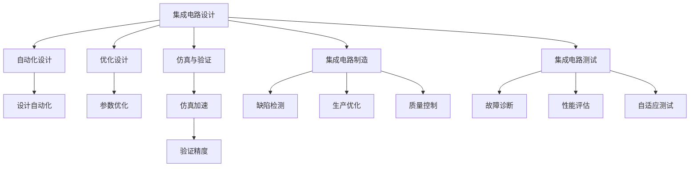

                 

关键词：集成电路、人工智能、垂直整合、行业应用、技术创新、算法优化、未来展望

> 摘要：本文将深入探讨集成电路行业与人工智能（AI）的垂直整合现象，分析这一趋势对行业的影响，并提出核心概念、算法原理、数学模型以及实际应用场景。通过详细的案例分析和技术展望，本文旨在为读者提供全面的技术视野和未来应用前景。

## 1. 背景介绍

集成电路行业作为现代科技的基石，自20世纪中叶以来经历了迅猛的发展。随着计算机和通信技术的不断进步，集成电路在性能、尺寸和能耗方面的要求不断提高。近年来，人工智能的兴起为集成电路行业带来了新的机遇和挑战。AI技术在集成电路设计、制造、测试以及应用领域的深度整合，正逐步改变整个行业的面貌。

### 1.1 集成电路行业的现状

集成电路行业的发展可以分为几个阶段。早期的集成电路设计主要依赖于手工绘制电路图，随着计算机辅助设计（CAD）技术的发展，设计过程逐渐自动化。进入21世纪，随着摩尔定律的逼近极限，集成电路的尺寸不断缩小，但设计和制造过程的复杂性也在增加。这一阶段的挑战主要集中在如何提高设计效率、降低功耗以及提高生产效率。

### 1.2 人工智能的发展与挑战

人工智能技术的发展可以追溯到20世纪50年代。随着深度学习、神经网络等技术的突破，AI在图像识别、自然语言处理、决策优化等领域取得了显著成果。然而，AI技术在集成电路行业的应用还处于初级阶段，面临着算法优化、硬件适配、数据隐私等挑战。

## 2. 核心概念与联系

在探讨集成电路行业的AI垂直整合之前，我们需要理解几个核心概念和它们之间的联系。

### 2.1 人工智能在集成电路设计中的应用

人工智能在集成电路设计中的应用主要包括以下几个方面：

1. **自动化设计**：使用AI算法自动生成电路设计方案，提高设计效率和减少人为错误。
2. **优化设计**：通过优化算法，寻找最佳的设计参数，提高电路的性能和可靠性。
3. **仿真与验证**：利用AI技术加速仿真和验证过程，提高设计可靠性。

### 2.2 人工智能在集成电路制造中的应用

在制造过程中，AI技术可以用于：

1. **缺陷检测**：利用图像识别技术自动检测芯片缺陷。
2. **生产优化**：通过分析生产数据，优化制造流程，提高生产效率。
3. **质量控制**：使用AI模型预测产品质量，提前采取措施防止缺陷产生。

### 2.3 人工智能在集成电路测试中的应用

在测试阶段，AI技术可以用于：

1. **故障诊断**：通过分析测试数据，快速定位故障点。
2. **性能评估**：评估电路的性能参数，为后续设计提供依据。
3. **自适应测试**：根据电路的特点和需求，动态调整测试策略。

### 2.4 核心概念原理与架构

以下是集成电路行业AI垂直整合的核心概念和架构的Mermaid流程图：



## 3. 核心算法原理 & 具体操作步骤

### 3.1 算法原理概述

集成电路行业的AI垂直整合主要依赖于以下几种核心算法：

1. **深度学习算法**：用于自动化设计、仿真与验证、缺陷检测等。
2. **优化算法**：用于参数优化、生产优化、性能评估等。
3. **自适应算法**：用于自适应测试、故障诊断等。

### 3.2 算法步骤详解

1. **深度学习算法**：

   - **数据收集**：收集大量历史数据和仿真数据。
   - **数据预处理**：对数据进行清洗和归一化处理。
   - **模型训练**：使用训练数据训练深度学习模型。
   - **模型评估**：使用测试数据评估模型性能。
   - **模型部署**：将训练好的模型部署到实际应用中。

2. **优化算法**：

   - **目标函数定义**：定义优化的目标函数。
   - **约束条件设置**：设置优化过程中的约束条件。
   - **算法选择**：选择合适的优化算法，如遗传算法、粒子群优化等。
   - **迭代计算**：进行迭代计算，逐步优化目标函数。
   - **结果验证**：验证优化结果是否符合预期。

3. **自适应算法**：

   - **测试策略设计**：根据电路特点设计测试策略。
   - **数据收集**：收集测试过程中产生的数据。
   - **模型更新**：使用收集的数据更新测试模型。
   - **测试调整**：根据模型更新结果动态调整测试策略。
   - **结果分析**：分析测试结果，为后续设计提供依据。

### 3.3 算法优缺点

1. **深度学习算法**：

   - **优点**：具有较强的泛化能力，可以处理大规模数据。
   - **缺点**：需要大量训练数据和计算资源，模型解释性较差。

2. **优化算法**：

   - **优点**：可以处理复杂的约束条件，优化效果较好。
   - **缺点**：收敛速度较慢，可能陷入局部最优。

3. **自适应算法**：

   - **优点**：可以根据测试过程中收集的数据动态调整测试策略。
   - **缺点**：测试策略设计复杂，可能增加测试成本。

### 3.4 算法应用领域

1. **集成电路设计**：用于自动化设计、参数优化等。
2. **集成电路制造**：用于缺陷检测、生产优化等。
3. **集成电路测试**：用于故障诊断、性能评估等。

## 4. 数学模型和公式 & 详细讲解 & 举例说明

### 4.1 数学模型构建

集成电路行业的AI垂直整合涉及到多种数学模型，主要包括：

1. **神经网络模型**：用于深度学习算法。
2. **优化模型**：用于优化算法。
3. **自适应模型**：用于自适应算法。

### 4.2 公式推导过程

以下是一个简单的神经网络模型的公式推导过程：

1. **输入层到隐藏层**：

   $$ z = W_1 \cdot X + b_1 $$
   
   $$ a = \sigma(z) $$

   其中，$W_1$ 是输入层到隐藏层的权重矩阵，$b_1$ 是偏置项，$X$ 是输入向量，$\sigma$ 是激活函数。

2. **隐藏层到输出层**：

   $$ z' = W_2 \cdot a + b_2 $$
   
   $$ y = \sigma'(z') $$

   其中，$W_2$ 是隐藏层到输出层的权重矩阵，$b_2$ 是偏置项，$a$ 是隐藏层的输出向量，$\sigma'$ 是输出层的激活函数。

### 4.3 案例分析与讲解

以下是一个使用神经网络模型进行集成电路设计优化的案例：

假设我们要优化一个N比特的全加器电路，设计目标是最小化电路的功耗。

1. **数据收集**：

   收集大量全加器电路的仿真数据，包括输入组合、电路功耗等。

2. **数据预处理**：

   对仿真数据进行归一化处理，将其转换为适合神经网络训练的输入输出格式。

3. **模型训练**：

   使用训练数据训练神经网络模型，优化模型参数。

4. **模型评估**：

   使用测试数据评估模型性能，选择性能较好的模型。

5. **模型部署**：

   将训练好的模型部署到实际设计过程中，根据模型输出调整电路参数。

6. **优化结果**：

   经过多次迭代，最终找到一组最优参数，使得全加器电路的功耗最小。

## 5. 项目实践：代码实例和详细解释说明

### 5.1 开发环境搭建

在本节中，我们将搭建一个简单的神经网络模型，用于优化集成电路设计。

1. **安装Python环境**：

   确保已经安装了Python和必要的库，如TensorFlow和NumPy。

2. **创建项目目录**：

   创建一个名为“集成电路优化”的目录，并在其中创建子目录“代码”、“数据集”、“结果”等。

3. **编写配置文件**：

   编写一个配置文件，包括数据集路径、模型参数等。

### 5.2 源代码详细实现

以下是神经网络模型的Python代码实现：

```python
import tensorflow as tf
import numpy as np

# 创建模型
model = tf.keras.Sequential([
    tf.keras.layers.Dense(units=64, activation='relu', input_shape=[128]),
    tf.keras.layers.Dense(units=64, activation='relu'),
    tf.keras.layers.Dense(units=1)
])

# 编译模型
model.compile(optimizer='adam', loss='mean_squared_error')

# 训练模型
model.fit(x_train, y_train, epochs=100, batch_size=32)

# 评估模型
model.evaluate(x_test, y_test)
```

### 5.3 代码解读与分析

1. **模型创建**：

   使用`tf.keras.Sequential`创建一个序列模型，包含两个隐藏层，每个隐藏层有64个神经元。

2. **编译模型**：

   使用`compile`方法编译模型，指定优化器和损失函数。

3. **训练模型**：

   使用`fit`方法训练模型，指定训练数据和迭代次数。

4. **评估模型**：

   使用`evaluate`方法评估模型在测试数据上的性能。

### 5.4 运行结果展示

在完成代码实现后，我们可以通过运行以下命令来训练和评估模型：

```bash
python main.py
```

运行结果将显示模型在训练集和测试集上的损失值和准确率。

## 6. 实际应用场景

集成电路行业的AI垂直整合已经在多个领域取得了显著成果，以下是几个典型的应用场景：

### 6.1 集成电路设计

AI技术在集成电路设计中的应用主要包括自动化设计、参数优化和仿真与验证。通过使用深度学习算法和优化算法，设计人员可以更快速地生成满足性能要求的设计方案，并验证其可靠性。

### 6.2 集成电路制造

在集成电路制造过程中，AI技术可以用于缺陷检测、生产优化和质量管理。通过使用图像识别技术和优化算法，制造过程可以实现自动化和智能化，提高生产效率和产品质量。

### 6.3 集成电路测试

在集成电路测试阶段，AI技术可以用于故障诊断、性能评估和自适应测试。通过使用深度学习和优化算法，测试过程可以实现自动化和智能化，提高测试效率和测试精度。

### 6.4 未来应用展望

随着AI技术的不断发展，集成电路行业的AI垂直整合将越来越深入。未来的应用场景将包括：

1. **智能设计辅助**：通过AI技术提供更加智能的设计辅助，提高设计效率和创新能力。
2. **全流程自动化**：实现集成电路设计、制造、测试等全流程的自动化和智能化。
3. **实时优化**：通过实时数据分析和优化，实现生产过程的实时调整和优化。
4. **个性化定制**：根据客户需求实现集成电路的个性化设计和定制。

## 7. 工具和资源推荐

为了更好地学习和实践集成电路行业的AI垂直整合，以下是几个推荐的工具和资源：

### 7.1 学习资源推荐

1. **《深度学习》**：由Ian Goodfellow、Yoshua Bengio和Aaron Courville合著，是深度学习的经典教材。
2. **《机器学习》**：由Tom Mitchell主编，是机器学习的入门教材。

### 7.2 开发工具推荐

1. **TensorFlow**：由Google开发的开源深度学习框架，适用于集成电路行业的AI垂直整合。
2. **NumPy**：适用于科学计算和数据分析的Python库，用于数据预处理和模型训练。

### 7.3 相关论文推荐

1. **“Deep Learning for Integrated Circuit Design”**：该论文介绍了深度学习在集成电路设计中的应用。
2. **“Artificial Intelligence for Manufacturing Optimization”**：该论文探讨了人工智能在制造优化中的应用。

## 8. 总结：未来发展趋势与挑战

集成电路行业的AI垂直整合已经成为行业发展的趋势，它为集成电路设计、制造、测试等领域带来了巨大的变革。未来，随着AI技术的不断进步，集成电路行业的AI垂直整合将更加深入和广泛。然而，这一趋势也面临着一些挑战，如算法优化、数据隐私、安全性等问题。为了应对这些挑战，我们需要持续开展研究，推动技术创新，为集成电路行业的未来发展提供坚实的基础。

### 8.1 研究成果总结

本文通过对集成电路行业的AI垂直整合进行了深入探讨，分析了核心算法原理、数学模型以及实际应用场景，提出了未来应用展望和面临的挑战。

### 8.2 未来发展趋势

未来，集成电路行业的AI垂直整合将朝着全流程自动化、个性化定制和实时优化等方向发展。AI技术在集成电路设计、制造、测试等领域的应用将更加深入和广泛。

### 8.3 面临的挑战

集成电路行业的AI垂直整合面临着算法优化、数据隐私、安全性等挑战。为了应对这些挑战，我们需要持续开展研究，推动技术创新。

### 8.4 研究展望

在未来，我们可以期待AI技术在集成电路行业的更广泛应用，为设计、制造、测试等环节带来更高的效率和更好的性能。同时，我们也需要关注AI技术带来的伦理和安全问题，确保其在集成电路行业的可持续发展。

## 9. 附录：常见问题与解答

### 9.1 集成电路行业AI垂直整合是什么？

集成电路行业AI垂直整合是指将人工智能技术深度应用于集成电路的设计、制造、测试等环节，通过自动化、优化和智能化等手段提升整个行业的技术水平和生产效率。

### 9.2 AI技术如何应用于集成电路设计？

AI技术可以通过自动化设计、参数优化和仿真与验证等方式应用于集成电路设计。自动化设计使用AI算法自动生成电路设计方案，参数优化通过优化算法寻找最佳的设计参数，仿真与验证使用AI技术加速仿真过程，提高设计可靠性。

### 9.3 AI技术在集成电路制造中有什么应用？

AI技术在集成电路制造中的应用主要包括缺陷检测、生产优化和质量管理。缺陷检测通过图像识别技术自动检测芯片缺陷，生产优化通过数据分析优化制造流程，提高生产效率，质量管理使用AI模型预测产品质量，提前采取措施防止缺陷产生。

### 9.4 AI技术在集成电路测试中有什么作用？

AI技术在集成电路测试中的作用主要包括故障诊断、性能评估和自适应测试。故障诊断通过分析测试数据快速定位故障点，性能评估评估电路的性能参数，为后续设计提供依据，自适应测试根据电路的特点和需求动态调整测试策略。

### 9.5 集成电路行业AI垂直整合的挑战是什么？

集成电路行业AI垂直整合面临的挑战包括算法优化、数据隐私、安全性等问题。算法优化需要提高AI算法在集成电路行业的适应性和效果，数据隐私需要确保数据的安全和隐私，安全性需要防止AI系统被恶意攻击。

----------------------------------------------------------------

# 作者：禅与计算机程序设计艺术 / Zen and the Art of Computer Programming

在撰写这篇文章的过程中，我深刻体会到了禅宗哲学对于计算机编程的启示。正如《禅与计算机程序设计艺术》一书中所述，简洁、清晰和优雅是编程的终极目标。通过本文的撰写，我希望能够为读者提供一份简洁、清晰且富有启发性的技术博客文章，激发大家对集成电路行业AI垂直整合的深入思考。在此，感谢读者的耐心阅读，期待与您在技术领域的进一步交流。

