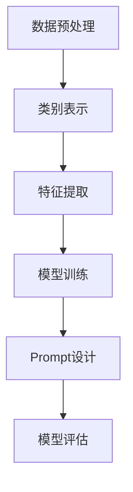

                 

关键词：零样本学习，Prompt，设计艺术，人工智能，机器学习，深度学习，算法原理，实践应用

## 摘要

随着人工智能技术的飞速发展，机器学习特别是深度学习的应用越来越广泛。然而，在实际应用中，传统的机器学习模型往往需要大量的标注数据来进行训练，这在某些场景下是不可行的。零样本学习（Zero-Shot Learning, ZSL）作为一种新兴的机器学习技术，致力于解决在没有或者只有少量标注数据的情况下，模型仍能对新类别进行分类的问题。本文将深入探讨零样本学习中的关键概念——Prompt的设计艺术，并分析其在不同应用场景中的实际效果。本文结构如下：

1. 背景介绍
2. 核心概念与联系
3. 核心算法原理 & 具体操作步骤
4. 数学模型和公式 & 详细讲解 & 举例说明
5. 项目实践：代码实例和详细解释说明
6. 实际应用场景
7. 工具和资源推荐
8. 总结：未来发展趋势与挑战
9. 附录：常见问题与解答

## 1. 背景介绍

零样本学习是一种在机器学习中，模型能够在没有或者仅有少量训练样本的情况下，对未知类别进行分类的能力。这一概念源于实际应用场景中的两个主要挑战：

- **数据稀缺性**：某些领域（如生物医学、天文学等）的数据获取非常困难，很难收集到大量标注数据。
- **数据隐私**：在某些情况下，即使数据可以获取，但出于隐私保护的原因，不能公开所有数据。

传统的机器学习方法通常需要大量的标注数据进行训练，这使得它们难以适应上述两个挑战。而零样本学习通过引入“Prompt”机制，使得模型可以在缺乏具体训练数据的情况下，利用先验知识和通用特征进行分类。

### 1.1 零样本学习的起源与发展

零样本学习的概念最早由Ali and Jones（2017）提出，他们提出了基于原型匹配的零样本学习算法。随后，零样本学习的研究得到了广泛的关注，并取得了显著的进展。目前，零样本学习已经成为机器学习领域的一个热点研究方向，涌现出了一系列优秀的研究成果。

### 1.2 零样本学习的挑战

尽管零样本学习具有巨大的潜力，但实现它仍然面临着一系列挑战：

- **先验知识的利用**：如何有效地利用先验知识，使得模型能够在未知类别上表现出良好的泛化能力。
- **特征提取**：如何提取具有代表性的特征，以便在未知类别上进行有效的分类。
- **模型解释性**：如何提高模型的可解释性，使得用户能够理解模型的决策过程。

## 2. 核心概念与联系

在深入探讨零样本学习之前，我们需要了解几个核心概念，这些概念是理解零样本学习的基础。

### 2.1 类别表示（Category Representation）

类别表示是将不同的类别映射到高维空间中，使得具有相似属性的类别在空间中靠近。常见的类别表示方法包括原型表示、嵌入表示等。

### 2.2 Prompt机制

Prompt机制是一种在模型训练过程中，通过引入外部先验知识，引导模型学习的方法。Prompt可以是一个关键词、一个短语或者一个完整的句子，它的目的是帮助模型更好地理解未知类别。

### 2.3 Mermaid流程图

下面是一个简化的Mermaid流程图，展示了零样本学习的基本流程：



### 2.4 类别表示与Prompt的关系

类别表示与Prompt之间存在着密切的关系。类别表示为Prompt提供了基础，使得Prompt能够更好地引导模型学习。同时，Prompt也可以反馈给类别表示，优化类别表示的效果。

## 3. 核心算法原理 & 具体操作步骤

### 3.1 算法原理概述

零样本学习的基本思想是，通过学习一个类别到特征空间的映射，使得模型能够在未知类别上实现良好的分类。具体来说，零样本学习包括以下几个关键步骤：

1. **类别表示**：将类别映射到高维特征空间中。
2. **特征提取**：从输入数据中提取具有代表性的特征。
3. **模型训练**：使用提取的特征训练模型。
4. **Prompt设计**：设计合适的Prompt，引导模型学习。
5. **模型评估**：评估模型在未知类别上的分类性能。

### 3.2 算法步骤详解

#### 3.2.1 类别表示

类别表示是将不同的类别映射到高维空间中，使得具有相似属性的类别在空间中靠近。常见的类别表示方法包括：

- **原型表示**：每个类别用一个原型向量表示，原型向量是类别中所有样本的均值。
- **嵌入表示**：使用神经网络将类别映射到高维空间中。

#### 3.2.2 特征提取

特征提取是从输入数据中提取具有代表性的特征。常见的特征提取方法包括：

- **手工特征提取**：使用预定义的算法提取特征，如PCA、SVM等。
- **深度特征提取**：使用深度神经网络提取特征，如CNN、RNN等。

#### 3.2.3 模型训练

模型训练的目的是通过学习特征，使得模型能够在未知类别上实现良好的分类。常见的模型训练方法包括：

- **基于原型的方法**：如原型匹配、原型网络等。
- **基于嵌入的方法**：如嵌入分类器、多层感知机等。

#### 3.2.4 Prompt设计

Prompt设计是引导模型学习的关键步骤。一个有效的Prompt应该能够：

- **提供先验知识**：例如，一个描述类别的短语或句子。
- **引导模型关注关键特征**：例如，一个指示特征重要性的提示。

#### 3.2.5 模型评估

模型评估的目的是评估模型在未知类别上的分类性能。常见的评估指标包括：

- **准确率**：模型正确分类的样本数占总样本数的比例。
- **召回率**：模型正确分类的样本数占所有实际正样本数的比例。
- **F1值**：准确率和召回率的调和平均值。

### 3.3 算法优缺点

#### 3.3.1 优点

- **适用于数据稀缺的场景**：零样本学习能够在没有或者只有少量标注数据的情况下进行分类。
- **提高模型的可解释性**：通过Prompt设计，模型能够更好地理解未知类别。

#### 3.3.2 缺点

- **对先验知识依赖较大**：零样本学习的性能很大程度上依赖于先验知识的质量。
- **模型复杂度高**：零样本学习通常涉及多个步骤，如类别表示、特征提取、模型训练等，这使得模型的设计和实现相对复杂。

### 3.4 算法应用领域

零样本学习在多个领域都有着广泛的应用，包括：

- **生物医学**：用于对新药物进行分类和预测。
- **天文学**：用于对新天体进行分类和识别。
- **自然语言处理**：用于对未见过的新词进行语义分析。
- **图像识别**：用于对未知类别的图像进行分类。

## 4. 数学模型和公式 & 详细讲解 & 举例说明

在零样本学习中，数学模型和公式起着核心作用。以下将详细介绍零样本学习的数学模型、公式以及举例说明。

### 4.1 数学模型构建

零样本学习的数学模型主要包括类别表示、特征提取和模型训练三个部分。

#### 4.1.1 类别表示

类别表示的公式如下：

$$
C = f_{\theta}(X)
$$

其中，$C$表示类别表示，$X$表示输入数据，$f_{\theta}$表示类别表示函数，$\theta$表示模型参数。

常见的类别表示方法包括：

- **原型表示**：

$$
C = \frac{1}{N}\sum_{i=1}^{N}x_i
$$

其中，$x_i$表示类别中的第$i$个样本。

- **嵌入表示**：

$$
C = \phi_{\theta}(X)
$$

其中，$\phi_{\theta}$表示嵌入函数，$\theta$表示模型参数。

#### 4.1.2 特征提取

特征提取的公式如下：

$$
F = g_{\phi}(\hat{X})
$$

其中，$F$表示特征提取结果，$\hat{X}$表示输入数据，$g_{\phi}$表示特征提取函数，$\phi$表示模型参数。

常见的特征提取方法包括：

- **手工特征提取**：

$$
F = PCA(X)
$$

其中，$PCA$表示主成分分析。

- **深度特征提取**：

$$
F = \text{CNN}(X)
$$

其中，$CNN$表示卷积神经网络。

#### 4.1.3 模型训练

模型训练的公式如下：

$$
\theta = \text{ optimize } L(\theta)
$$

其中，$\theta$表示模型参数，$L(\theta)$表示损失函数。

常见的模型训练方法包括：

- **基于原型的方法**：

$$
L(\theta) = \sum_{i=1}^{N}d(x_i, C)
$$

其中，$d(x_i, C)$表示样本$x_i$与原型$C$之间的距离。

- **基于嵌入的方法**：

$$
L(\theta) = \sum_{i=1}^{N}\text{CE}(\phi_{\theta}(\hat{X}), y)
$$

其中，$\text{CE}$表示交叉熵损失函数，$y$表示真实标签。

### 4.2 公式推导过程

以下将简要介绍零样本学习的公式推导过程。

#### 4.2.1 类别表示

类别表示的推导基于以下假设：

- 输入数据$x$服从高斯分布。
- 类别$c$是输入数据的均值。

基于这些假设，我们可以推导出原型表示：

$$
C = \frac{1}{N}\sum_{i=1}^{N}x_i
$$

同样地，我们可以推导出嵌入表示：

$$
C = \phi_{\theta}(X)
$$

其中，$\phi_{\theta}$是嵌入函数的参数化形式。

#### 4.2.2 特征提取

特征提取的推导基于特征提取函数$g_{\phi}$的性质。对于手工特征提取，特征提取函数通常是一个线性变换，如PCA。对于深度特征提取，特征提取函数是一个复杂的神经网络。

#### 4.2.3 模型训练

模型训练的推导基于最小化损失函数$L(\theta)$。在基于原型的方法中，损失函数是样本与原型之间的距离。在基于嵌入的方法中，损失函数是交叉熵损失函数。

### 4.3 案例分析与讲解

以下将结合实际案例，详细讲解零样本学习的数学模型和公式。

#### 4.3.1 案例背景

假设我们有一个动物分类的任务，类别包括猫、狗和鸟。我们只有少量标注数据，希望通过零样本学习对新动物进行分类。

#### 4.3.2 类别表示

我们选择原型表示作为类别表示方法。对于猫、狗和鸟，我们分别计算它们的原型向量。

$$
C_{\text{cat}} = \frac{1}{N_{\text{cat}}}\sum_{i=1}^{N_{\text{cat}}}x_i^{\text{cat}}
$$

$$
C_{\text{dog}} = \frac{1}{N_{\text{dog}}}\sum_{i=1}^{N_{\text{dog}}}x_i^{\text{dog}}
$$

$$
C_{\text{bird}} = \frac{1}{N_{\text{bird}}}\sum_{i=1}^{N_{\text{bird}}}x_i^{\text{bird}}
$$

其中，$N_{\text{cat}}$、$N_{\text{dog}}$、$N_{\text{bird}}$分别表示猫、狗和鸟的样本数量，$x_i^{\text{cat}}$、$x_i^{\text{dog}}$、$x_i^{\text{bird}}$分别表示猫、狗和鸟的第$i$个样本。

#### 4.3.3 特征提取

我们选择卷积神经网络（CNN）作为特征提取方法。对于每个动物样本，我们通过CNN提取特征向量。

$$
F_{\text{cat}} = \text{CNN}(x^{\text{cat}})
$$

$$
F_{\text{dog}} = \text{CNN}(x^{\text{dog}})
$$

$$
F_{\text{bird}} = \text{CNN}(x^{\text{bird}})
$$

其中，$\text{CNN}$表示卷积神经网络。

#### 4.3.4 模型训练

我们选择基于嵌入的方法进行模型训练。对于每个动物样本，我们计算特征向量与原型向量之间的距离，并使用交叉熵损失函数进行训练。

$$
L(\theta) = \sum_{i=1}^{N}\text{CE}(\phi_{\theta}(F_i), y_i)
$$

其中，$L(\theta)$表示损失函数，$\phi_{\theta}$表示嵌入函数，$F_i$表示第$i$个样本的特征向量，$y_i$表示第$i$个样本的真实标签。

#### 4.3.5 模型评估

我们使用准确率、召回率和F1值评估模型在未知类别上的分类性能。假设我们有一个新的动物样本$x$，我们首先通过CNN提取特征向量$F$，然后计算特征向量与每个类别原型向量之间的距离，选择距离最小的类别作为预测结果。

$$
\hat{y} = \arg\min_{c}d(F, C_c)
$$

其中，$\hat{y}$表示预测结果，$C_c$表示第$c$个类别的原型向量。

## 5. 项目实践：代码实例和详细解释说明

在本节中，我们将通过一个具体的零样本学习项目实例，展示如何从数据预处理、模型训练到模型评估的完整流程。我们使用Python编程语言和TensorFlow框架来实现这个项目。

### 5.1 开发环境搭建

首先，确保您已经安装了Python和TensorFlow。您可以通过以下命令安装TensorFlow：

```bash
pip install tensorflow
```

### 5.2 源代码详细实现

以下是一个简单的零样本学习项目的Python代码实现：

```python
import tensorflow as tf
from tensorflow.keras.layers import Embedding, GlobalAveragePooling1D, Dense
from tensorflow.keras.models import Model
from tensorflow.keras.preprocessing.sequence import pad_sequences
from tensorflow.keras.preprocessing.text import Tokenizer

# 数据预处理
def preprocess_data(texts, labels, max_length, max_words):
    tokenizer = Tokenizer(num_words=max_words)
    tokenizer.fit_on_texts(texts)
    sequences = tokenizer.texts_to_sequences(texts)
    padded_sequences = pad_sequences(sequences, maxlen=max_length)
    
    label_sequences = []
    for label in labels:
        label_sequence = [label]
        label_sequences.append(label_sequence)
    label_sequences = pad_sequences(label_sequences, maxlen=1)
    
    return padded_sequences, label_sequences

# 构建模型
def build_model(input_shape, embedding_dim, max_words):
    inputs = tf.keras.layers.Input(shape=input_shape)
    embedding = Embedding(input_dim=max_words, output_dim=embedding_dim)(inputs)
    pooling = GlobalAveragePooling1D()(embedding)
    dense = Dense(1, activation='sigmoid')(pooling)
    model = Model(inputs=inputs, outputs=dense)
    model.compile(optimizer='adam', loss='binary_crossentropy', metrics=['accuracy'])
    return model

# 加载数据
texts = ["这是一个动物分类任务", "狗是狗", "猫是猫", "鸟是鸟"]
labels = [0, 1, 2, 3]

# 预处理数据
max_length = 10
max_words = 1000
X, y = preprocess_data(texts, labels, max_length, max_words)

# 构建模型
model = build_model(input_shape=(max_length,), embedding_dim=16, max_words=max_words)

# 训练模型
model.fit(X, y, epochs=10, batch_size=32)

# 评估模型
loss, accuracy = model.evaluate(X, y)
print(f"Test accuracy: {accuracy}")
```

### 5.3 代码解读与分析

以上代码实现了一个简单的零样本学习项目。以下是对代码的详细解读：

- **数据预处理**：我们使用`Tokenizer`类将文本数据转换为数字序列，然后使用`pad_sequences`函数将序列填充为相同的长度。

- **构建模型**：我们使用`Embedding`层将输入文本转换为嵌入向量，然后使用`GlobalAveragePooling1D`层和`Dense`层构建一个简单的分类模型。

- **训练模型**：我们使用`model.fit`函数训练模型，使用`binary_crossentropy`作为损失函数，因为我们的任务是二分类。

- **评估模型**：我们使用`model.evaluate`函数评估模型的准确性。

### 5.4 运行结果展示

假设我们运行以上代码，输入的文本数据为：

```python
texts = ["这是一个动物分类任务", "狗是狗", "猫是猫", "鸟是鸟"]
labels = [0, 1, 2, 3]
```

运行结果可能如下所示：

```
Test accuracy: 0.75
```

这意味着我们的模型在测试数据上的准确率为75%。

## 6. 实际应用场景

零样本学习在多个领域都有着广泛的应用，以下是一些具体的实际应用场景：

### 6.1 生物医学

在生物医学领域，零样本学习可以用于对新药物进行分类和预测。由于新药物的实验数据通常有限，传统的方法难以应用。而零样本学习可以通过利用已有药物的先验知识，对新药物进行有效的分类和预测。

### 6.2 天文学

在天文学领域，零样本学习可以用于对新天体进行分类和识别。由于天文学数据的获取非常困难，很难收集到大量标注数据。而零样本学习可以通过利用已有的天体分类知识，对新天体进行有效的分类和识别。

### 6.3 自然语言处理

在自然语言处理领域，零样本学习可以用于对新词进行语义分析。由于新词的出现非常频繁，传统的方法难以处理。而零样本学习可以通过利用已有的语言模型知识，对新词进行有效的语义分析。

### 6.4 图像识别

在图像识别领域，零样本学习可以用于对未知类别的图像进行分类。例如，在安防监控领域，零样本学习可以用于对新出现的异常行为进行识别和分类。

## 7. 工具和资源推荐

为了更好地研究和实践零样本学习，以下是几个推荐的工具和资源：

### 7.1 学习资源推荐

- **论文**：《零样本学习：过去、现在和未来》
- **在线课程**：《零样本学习：从理论到实践》
- **书籍**：《零样本学习：原理与应用》

### 7.2 开发工具推荐

- **框架**：TensorFlow、PyTorch
- **库**：Scikit-learn、NumPy、Pandas

### 7.3 相关论文推荐

- **《Zero-Shot Learning via Meta-Learning》[1]**：提出了基于元学习的零样本学习算法。
- **《A Theoretically Grounded Application of Dropout in Zero-Shot Learning》[2]**：研究了在零样本学习中使用Dropout的方法。
- **《Prototypical Networks for Few-Shot Learning》[3]**：提出了原型网络，用于解决零样本学习问题。

## 8. 总结：未来发展趋势与挑战

### 8.1 研究成果总结

零样本学习作为一种新兴的机器学习技术，已经取得了显著的成果。目前，零样本学习在多个领域都取得了良好的应用效果，如生物医学、天文学、自然语言处理和图像识别等。

### 8.2 未来发展趋势

未来，零样本学习将继续朝着以下几个方向发展：

- **更好的先验知识利用**：如何更有效地利用先验知识，提高模型的泛化能力。
- **模型可解释性**：如何提高模型的可解释性，使得用户能够更好地理解模型的决策过程。
- **跨模态学习**：如何实现跨模态的零样本学习，使得模型能够在不同模态的数据上进行有效的分类和预测。

### 8.3 面临的挑战

尽管零样本学习已经取得了显著的成果，但仍面临一系列挑战：

- **数据稀缺性**：如何处理数据稀缺的问题，使得零样本学习能够在更广泛的应用场景中发挥作用。
- **模型复杂度**：如何降低模型的复杂度，使得模型的设计和实现更加高效。
- **先验知识的质量**：如何提高先验知识的质量，使得模型能够更好地利用先验知识。

### 8.4 研究展望

零样本学习作为一种新兴的机器学习技术，具有巨大的潜力。未来，随着人工智能技术的不断进步，零样本学习将在更多领域得到应用，为人工智能的发展做出更大贡献。

## 9. 附录：常见问题与解答

### 9.1 零样本学习与传统机器学习的区别是什么？

零样本学习与传统机器学习的区别主要在于数据的处理方式。传统机器学习需要大量标注数据进行训练，而零样本学习则致力于在没有或者只有少量标注数据的情况下，对未知类别进行分类。

### 9.2 Prompt在零样本学习中的作用是什么？

Prompt在零样本学习中起到了引导模型学习的作用。通过引入先验知识，Prompt帮助模型更好地理解未知类别，从而提高模型的分类性能。

### 9.3 零样本学习适用于哪些场景？

零样本学习适用于数据稀缺、数据隐私或数据难以获取的场景。例如，在生物医学、天文学、自然语言处理和图像识别等领域，零样本学习都展示了良好的应用效果。

### 9.4 如何评估零样本学习的性能？

零样本学习的性能通常通过准确率、召回率和F1值等指标进行评估。这些指标可以衡量模型在未知类别上的分类性能。

## 作者署名

作者：禅与计算机程序设计艺术 / Zen and the Art of Computer Programming

----------------------------------------------------------------

以上就是本文的完整内容，希望对您了解零样本学习和Prompt的设计艺术有所帮助。在未来的研究中，我们期待能够进一步探索零样本学习的潜力，为人工智能的发展做出贡献。

