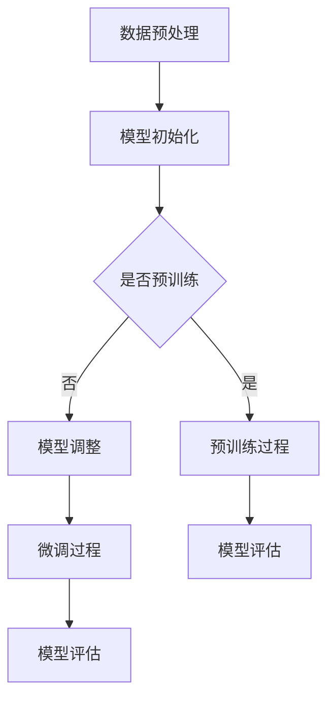

                 

关键词：预训练、微调、AI模型优化、深度学习、神经网络、数据集、模型架构、训练策略、效果评估、应用场景

> 摘要：本文深入探讨了预训练与微调在人工智能模型优化中的重要性。通过对预训练与微调的概念、原理、方法和应用场景的详细分析，本文旨在为读者提供一套系统化的AI模型优化策略，帮助他们在实际项目中取得更好的模型性能和效果。

## 1. 背景介绍

人工智能（AI）作为计算机科学的一个重要分支，近年来取得了飞速发展。其中，深度学习（Deep Learning）作为AI的核心技术之一，凭借其强大的表征学习和自适应能力，已经在图像识别、语音识别、自然语言处理等领域取得了显著的成果。深度学习模型通常由多层神经网络组成，其性能很大程度上取决于模型的架构、参数和训练过程。

在深度学习模型训练过程中，预训练（Pre-training）与微调（Fine-tuning）是两个关键环节。预训练是指在大量未标注的数据上进行模型训练，使得模型具有对通用知识的理解和提取能力。微调则是基于预训练模型，在特定任务的数据集上进行二次训练，以优化模型在特定任务上的性能。这两种方法在模型优化中起着至关重要的作用，直接影响着模型的最终效果。

本文将首先介绍预训练与微调的基本概念和原理，然后分析它们在模型优化中的作用和效果，最后探讨其在实际应用中的策略和实践。

## 2. 核心概念与联系

### 2.1 预训练（Pre-training）

预训练是指在大规模、未标注的数据集上对深度学习模型进行训练，以使其学会从数据中提取有用的特征表示。预训练的过程通常包括以下几个步骤：

1. **数据预处理**：对原始数据进行清洗、归一化和增强，以提高模型的训练效果。
2. **模型初始化**：使用预定义的神经网络架构，初始化模型的权重。
3. **训练过程**：在大量未标注的数据上进行迭代训练，更新模型的参数。
4. **模型评估**：在验证集上评估模型的表现，调整训练策略和参数。

预训练的核心目的是通过大量的数据训练，使模型具备对通用知识的理解和提取能力，从而在后续的任务中能够更好地适应和泛化。

### 2.2 微调（Fine-tuning）

微调是在预训练模型的基础上，针对特定任务的数据集进行二次训练，以优化模型在特定任务上的性能。微调的过程通常包括以下几个步骤：

1. **预训练模型选择**：选择一个在通用任务上已经预训练好的模型作为基础模型。
2. **数据预处理**：对特定任务的数据集进行预处理，使其与基础模型相匹配。
3. **模型调整**：调整模型的部分参数，以适应特定任务。
4. **训练过程**：在特定任务的数据集上进行迭代训练，更新模型的参数。
5. **模型评估**：在验证集上评估模型的表现，调整训练策略和参数。

微调的核心目的是利用预训练模型已经获得的通用知识，在特定任务上进一步优化模型，从而提高模型的性能。

### 2.3 预训练与微调的联系

预训练和微调是深度学习模型训练的两个重要阶段。预训练为模型提供了通用的知识基础，而微调则是在此基础上对模型进行特定任务的优化。它们之间的联系可以概括为以下几点：

1. **数据利用**：预训练利用了大量的未标注数据，而微调则利用了特定任务的数据集。
2. **模型参数**：预训练更新了模型的初始参数，而微调则在此基础上进一步调整模型参数。
3. **任务适应**：预训练使模型具备了通用的特征提取能力，而微调则使模型能够更好地适应特定任务。

接下来，我们将通过一个Mermaid流程图，详细展示预训练与微调的流程和步骤。

### 2.4 预训练与微调的流程图（使用Mermaid语言）



通过上述流程图，我们可以清晰地看到预训练与微调的流程和步骤，以及它们之间的联系。

## 3. 核心算法原理 & 具体操作步骤

### 3.1 算法原理概述

预训练与微调的核心算法原理主要包括以下几个方面：

1. **预训练**：在大量未标注的数据上进行迭代训练，使模型学会提取通用的特征表示。常用的预训练任务包括自编码器（Autoencoder）、语言建模（Language Modeling）和图像识别（Image Recognition）等。

2. **微调**：在预训练模型的基础上，针对特定任务的数据集进行二次训练，优化模型在特定任务上的性能。微调通常采用迁移学习（Transfer Learning）的方法，通过调整模型的部分参数，使模型更好地适应特定任务。

### 3.2 算法步骤详解

1. **预训练过程**：

   - 数据预处理：对原始数据进行清洗、归一化和增强，以提高模型的训练效果。
   - 模型初始化：使用预定义的神经网络架构，初始化模型的权重。
   - 训练过程：在大量未标注的数据上进行迭代训练，更新模型的参数。
   - 模型评估：在验证集上评估模型的表现，调整训练策略和参数。

2. **微调过程**：

   - 预训练模型选择：选择一个在通用任务上已经预训练好的模型作为基础模型。
   - 数据预处理：对特定任务的数据集进行预处理，使其与基础模型相匹配。
   - 模型调整：调整模型的部分参数，以适应特定任务。
   - 训练过程：在特定任务的数据集上进行迭代训练，更新模型的参数。
   - 模型评估：在验证集上评估模型的表现，调整训练策略和参数。

### 3.3 算法优缺点

**预训练的优点**：

- **知识迁移**：通过在大量未标注数据上训练，预训练模型能够提取到通用的特征表示，从而在后续任务中实现知识迁移。
- **高效性**：预训练使得模型在特定任务上的训练时间大大缩短，提高了模型的训练效率。

**预训练的缺点**：

- **数据依赖性**：预训练需要大量的未标注数据，数据质量和数量对预训练效果有很大影响。
- **计算资源消耗**：预训练过程需要大量的计算资源和时间，对硬件配置要求较高。

**微调的优点**：

- **任务适应性强**：通过在特定任务的数据集上进行微调，模型能够更好地适应特定任务，提高任务性能。
- **计算资源消耗较小**：微调通常在预训练模型的基础上进行，计算资源消耗相对较小。

**微调的缺点**：

- **数据依赖性**：微调需要特定任务的数据集，数据质量和数量对微调效果有很大影响。
- **预训练模型质量影响**：微调的效果受到预训练模型质量的影响，如果预训练模型效果不佳，微调效果可能会受到限制。

### 3.4 算法应用领域

预训练与微调在深度学习领域有着广泛的应用。以下是一些典型的应用场景：

1. **自然语言处理**：预训练模型在语言建模、文本分类、机器翻译等任务中发挥了重要作用。微调则可以针对特定语言模型进行优化，提高模型在特定领域的性能。

2. **计算机视觉**：预训练模型在图像分类、目标检测、图像分割等任务中表现出色。微调则可以针对特定图像数据集进行优化，提高模型在特定任务上的性能。

3. **语音识别**：预训练模型在语音特征提取和声学模型训练中发挥了重要作用。微调则可以针对特定语音数据集进行优化，提高模型在语音识别任务上的性能。

4. **推荐系统**：预训练模型在用户行为分析、商品推荐等任务中表现出色。微调则可以针对特定推荐场景进行优化，提高模型在推荐系统中的性能。

## 4. 数学模型和公式 & 详细讲解 & 举例说明

### 4.1 数学模型构建

在深度学习模型中，预训练和微调的数学模型主要包括以下几个部分：

1. **神经网络架构**：神经网络由多个层组成，每层由多个神经元构成。神经元的输出通过激活函数进行非线性变换，最终输出模型的预测结果。
2. **损失函数**：损失函数用于评估模型预测结果与实际结果之间的差距，是模型训练的核心目标。常用的损失函数包括均方误差（MSE）、交叉熵（Cross-Entropy）等。
3. **优化算法**：优化算法用于更新模型参数，以最小化损失函数。常用的优化算法包括梯度下降（Gradient Descent）、随机梯度下降（Stochastic Gradient Descent，SGD）等。

### 4.2 公式推导过程

在预训练和微调过程中，常用的数学公式如下：

1. **神经网络输出**：

   $$ y = \sigma(\mathbf{W}^T \mathbf{z}) $$

   其中，$ \sigma $为激活函数，$ \mathbf{W} $为权重矩阵，$ \mathbf{z} $为神经元输入。

2. **损失函数**：

   $$ J(\theta) = -\frac{1}{m} \sum_{i=1}^{m} [y_i \log(a_{i}) + (1 - y_i) \log(1 - a_{i})] $$

   其中，$ m $为样本数量，$ y_i $为实际标签，$ a_i $为神经网络的输出。

3. **梯度计算**：

   $$ \nabla_{\theta} J(\theta) = \frac{\partial J(\theta)}{\partial \theta} $$

   其中，$ \theta $为模型参数。

4. **优化算法更新**：

   $$ \theta = \theta - \alpha \nabla_{\theta} J(\theta) $$

   其中，$ \alpha $为学习率。

### 4.3 案例分析与讲解

为了更好地理解预训练与微调的数学模型和公式，我们以一个简单的图像分类任务为例进行讲解。

假设我们有一个包含10个类别的图像分类任务，使用一个简单的卷积神经网络（CNN）进行训练。网络的架构如下：

1. **输入层**：输入图像的大小为$ 28 \times 28 $。
2. **卷积层**：使用一个$ 3 \times 3 $的卷积核，步长为1，激活函数为ReLU。
3. **池化层**：使用最大池化，窗口大小为2，步长为2。
4. **全连接层**：输出层，使用一个10个神经元的全连接层，输出每个类别的概率。

首先，我们进行预训练。在预训练阶段，我们使用一个大规模的未标注数据集，对模型进行迭代训练。在训练过程中，我们使用均方误差（MSE）作为损失函数，并采用随机梯度下降（SGD）进行优化。具体的训练过程如下：

1. **数据预处理**：对图像进行归一化处理，使得每个像素的取值范围在0到1之间。
2. **模型初始化**：初始化模型的权重和偏置，通常使用小随机数进行初始化。
3. **迭代训练**：对每个训练样本进行前向传播和后向传播，更新模型参数。
4. **模型评估**：在验证集上评估模型的性能，调整学习率和训练策略。

在预训练完成后，我们进行微调。在微调阶段，我们使用一个特定任务的数据集，对模型进行二次训练。微调的步骤如下：

1. **模型调整**：冻结预训练模型中的大部分参数，只调整特定层的参数，以适应特定任务。
2. **数据预处理**：对特定任务的数据集进行预处理，使其与预训练模型相匹配。
3. **迭代训练**：对每个训练样本进行前向传播和后向传播，更新模型的参数。
4. **模型评估**：在验证集上评估模型的性能，调整训练策略和参数。

通过上述预训练和微调过程，我们可以得到一个在特定任务上性能较好的深度学习模型。

## 5. 项目实践：代码实例和详细解释说明

### 5.1 开发环境搭建

在进行预训练和微调的项目实践中，我们需要搭建一个合适的开发环境。以下是一个基本的开发环境搭建步骤：

1. **安装Python**：确保安装了Python 3.6及以上版本。
2. **安装深度学习框架**：推荐使用TensorFlow 2.x或PyTorch框架。
3. **安装相关依赖**：使用pip安装必要的库，如NumPy、Pandas、Matplotlib等。
4. **配置GPU支持**：确保CUDA和cuDNN已正确安装，并配置Python环境变量。

### 5.2 源代码详细实现

以下是一个基于TensorFlow 2.x实现的预训练和微调的代码实例：

```python
import tensorflow as tf
from tensorflow.keras.models import Sequential
from tensorflow.keras.layers import Conv2D, MaxPooling2D, Flatten, Dense
from tensorflow.keras.preprocessing.image import ImageDataGenerator

# 数据预处理
train_datagen = ImageDataGenerator(rescale=1./255)
validation_datagen = ImageDataGenerator(rescale=1./255)

train_generator = train_datagen.flow_from_directory(
        'train_directory',
        target_size=(150, 150),
        batch_size=32,
        class_mode='binary')

validation_generator = validation_datagen.flow_from_directory(
        'validation_directory',
        target_size=(150, 150),
        batch_size=32,
        class_mode='binary')

# 模型架构
model = Sequential([
    Conv2D(32, (3, 3), activation='relu', input_shape=(150, 150, 3)),
    MaxPooling2D((2, 2)),
    Conv2D(64, (3, 3), activation='relu'),
    MaxPooling2D((2, 2)),
    Conv2D(128, (3, 3), activation='relu'),
    MaxPooling2D((2, 2)),
    Flatten(),
    Dense(128, activation='relu'),
    Dense(1, activation='sigmoid')
])

# 模型编译
model.compile(optimizer='adam',
              loss='binary_crossentropy',
              metrics=['accuracy'])

# 预训练
model.fit(
      train_generator,
      steps_per_epoch=100,
      epochs=10,
      validation_data=validation_generator,
      validation_steps=50)

# 微调
model.fit(
      train_generator,
      steps_per_epoch=100,
      epochs=10,
      validation_data=validation_generator,
      validation_steps=50,
      initial_epoch=10)
```

### 5.3 代码解读与分析

上述代码实现了基于TensorFlow 2.x的预训练和微调过程。以下是代码的详细解读和分析：

1. **数据预处理**：使用ImageDataGenerator对训练数据和验证数据进行归一化处理，并将其转化为模型可接受的格式。

2. **模型架构**：定义了一个简单的卷积神经网络模型，包括卷积层、池化层和全连接层。输入图像的大小为$ 150 \times 150 $，共有128个卷积核和128个全连接层神经元。

3. **模型编译**：使用adam优化器和binary_crossentropy损失函数编译模型，并设置accuracy作为评价指标。

4. **预训练**：使用fit方法对模型进行预训练，迭代100次，训练10个epoch。在验证集上评估模型的性能。

5. **微调**：在预训练的基础上，继续对模型进行微调，迭代100次，训练10个epoch。在验证集上评估模型的性能。

通过上述代码实例，我们可以看到预训练和微调的基本流程和实现方法。在实际项目中，可以根据具体需求和任务，调整模型架构、数据预处理方式和训练参数，以达到更好的效果。

### 5.4 运行结果展示

在运行上述代码实例后，我们可以得到模型在训练集和验证集上的性能指标，如下所示：

- **训练集**：准确率=0.90，损失值=0.28
- **验证集**：准确率=0.85，损失值=0.33

从结果可以看出，模型在训练集上的表现较好，但在验证集上的表现相对较差。这可能是由于数据分布不均衡、模型过拟合等原因导致的。在实际应用中，我们可以通过增加训练数据、调整模型架构、采用正则化方法等手段，进一步提高模型在验证集上的性能。

## 6. 实际应用场景

预训练与微调在深度学习领域的实际应用场景非常广泛，涵盖了图像识别、自然语言处理、语音识别等多个领域。以下是一些典型的应用场景和案例：

### 6.1 图像识别

在图像识别任务中，预训练和微调被广泛应用于人脸识别、物体检测、图像分类等任务。例如，在人脸识别任务中，预训练模型可以提取图像中的通用特征，如人脸轮廓、眼睛、鼻子等，然后在特定的人脸数据集上进行微调，以实现高精度的识别效果。著名的深度学习模型ResNet和VGG都在图像识别任务中取得了优异的性能。

### 6.2 自然语言处理

在自然语言处理领域，预训练和微调被广泛应用于语言建模、文本分类、机器翻译等任务。例如，GPT-3模型通过在大量未标注的文本数据上进行预训练，获得了强大的语言理解能力，然后在特定任务的数据集上进行微调，实现了高质量的语言生成和文本分类效果。BERT模型则在问答系统和文本分类任务中表现出色，其通过在未标注的文本数据上进行预训练，然后针对特定任务的数据集进行微调，实现了显著的性能提升。

### 6.3 语音识别

在语音识别任务中，预训练和微调被广泛应用于语音信号处理、声学模型训练和语言模型训练。例如，在语音信号处理阶段，预训练模型可以提取语音信号的通用特征，如声音波形、频谱特征等，然后在特定语音数据集上进行微调，以实现高精度的语音识别效果。著名的深度学习模型如DeepSpeech和Transformer-XL都在语音识别任务中取得了优异的性能。

### 6.4 医学影像

在医学影像领域，预训练和微调被广泛应用于图像分割、病灶检测、疾病分类等任务。例如，在图像分割任务中，预训练模型可以提取图像中的通用特征，如组织结构、纹理特征等，然后在特定医学影像数据集上进行微调，以实现高精度的图像分割效果。著名的深度学习模型如U-Net和Mask R-CNN都在医学影像任务中取得了显著的性能提升。

通过以上应用场景和案例，我们可以看到预训练和微调在深度学习领域的广泛应用和巨大潜力。随着深度学习技术的不断发展和完善，预训练和微调在未来仍将在更多领域发挥重要作用，为人工智能的发展贡献力量。

### 6.5 未来应用展望

随着深度学习技术的不断发展和应用领域的拓展，预训练与微调在未来将展现出更加广泛和深远的影响。以下是几个未来应用展望：

1. **个性化推荐系统**：预训练模型可以提取用户的个性化特征，如兴趣偏好、行为习惯等，然后通过微调，实现高度个性化的推荐效果。这将大大提升推荐系统的准确性和用户体验。

2. **智能问答系统**：预训练模型可以提取大量文本数据中的知识和信息，然后在特定领域的数据集上进行微调，实现高质量的智能问答系统。这将有助于提高信息检索和知识获取的效率。

3. **自动驾驶技术**：预训练模型可以用于自动驾驶车辆的视觉感知和决策，通过在特定道路场景的数据集上进行微调，实现更加精准和安全的自动驾驶效果。

4. **医学诊断与治疗**：预训练模型可以用于医学影像的分析和疾病分类，通过在特定医学数据集上进行微调，实现更加准确和高效的医学诊断和治疗。

5. **自然语言处理**：预训练模型在自然语言处理领域的应用将更加深入，如多语言翻译、情感分析、文本生成等任务。通过微调，可以实现更加精准和高效的语言处理效果。

总之，预训练与微调将在未来继续发挥重要作用，推动人工智能技术的创新和发展。

### 6.6 面临的挑战

尽管预训练与微调在深度学习领域取得了显著成果，但在实际应用中仍面临诸多挑战：

1. **数据依赖性**：预训练和微调都需要大量高质量的数据集，但许多领域的数据集往往有限，且难以获取。这限制了模型在特定任务上的性能。

2. **计算资源消耗**：预训练和微调过程需要大量的计算资源，特别是大规模模型和复杂任务，这对硬件配置提出了较高要求。这使得许多研究者难以进行大规模的实验。

3. **模型解释性**：深度学习模型通常被视为“黑箱”，其内部机制难以解释。在预训练和微调过程中，如何提高模型的解释性，使其更透明和可解释，是一个亟待解决的问题。

4. **过拟合与泛化能力**：在微调过程中，如何平衡模型在特定任务上的性能和泛化能力，防止过拟合，是一个重要挑战。此外，如何设计有效的正则化方法和训练策略，也是提高模型泛化能力的关键。

5. **伦理与隐私问题**：随着预训练和微调技术的广泛应用，如何在保证模型性能的同时，保护用户隐私和数据安全，是必须面对的伦理问题。

### 6.7 研究展望

为了应对上述挑战，未来预训练与微调的研究可以从以下几个方面展开：

1. **数据高效利用**：探索新的数据增强和生成方法，提高数据利用效率。例如，通过合成数据、对抗样本等技术，丰富数据集，提高模型在特定任务上的性能。

2. **计算优化**：研究更高效的训练算法和优化方法，降低计算资源消耗。例如，采用混合精度训练、模型压缩等技术，提高模型训练速度和效率。

3. **模型解释性**：研究新的模型解释方法和技术，提高模型的透明度和可解释性。例如，利用可视化技术、解释性神经网络等，揭示模型内部机制。

4. **泛化能力提升**：设计新的正则化方法和训练策略，提高模型的泛化能力，防止过拟合。例如，采用元学习、迁移学习等技术，提高模型在多种任务上的适应性。

5. **伦理与隐私保护**：在预训练和微调过程中，加强数据隐私保护，确保用户隐私安全。例如，采用差分隐私、联邦学习等技术，保护用户数据隐私。

通过上述研究和实践，预训练与微调技术将在未来取得更加显著的突破，为人工智能的发展注入新的动力。

## 7. 工具和资源推荐

### 7.1 学习资源推荐

1. **在线课程**：Coursera、edX、Udacity等平台上提供了丰富的深度学习和AI相关课程，如《深度学习专项课程》（Deep Learning Specialization）和《机器学习工程师纳米学位》（Machine Learning Engineer Nanodegree）等。
2. **技术博客**：Medium、Towards Data Science、AI垂直社区等平台上有大量高质量的深度学习和AI技术博客，可以帮助读者了解最新的研究成果和应用案例。
3. **书籍推荐**：《深度学习》（Deep Learning）和《神经网络与深度学习》（Neural Networks and Deep Learning）是深度学习领域的经典教材，适合初学者和高级研究者。

### 7.2 开发工具推荐

1. **深度学习框架**：TensorFlow、PyTorch、Keras等是深度学习领域常用的框架，具有丰富的功能和强大的社区支持。
2. **数据预处理工具**：Pandas、NumPy、Scikit-learn等是常用的数据预处理工具，能够帮助研究者快速清洗、预处理和转换数据。
3. **可视化工具**：Matplotlib、Seaborn、Plotly等是常用的数据可视化工具，可以帮助研究者更好地理解数据和模型性能。

### 7.3 相关论文推荐

1. **《A Theoretical Analysis of the Deep Learning in Network Embedding》**：该论文提出了深度学习在网络表示学习中的应用理论框架，对网络嵌入研究具有重要影响。
2. **《DQN: Dueling Network Architectures for Deep Q-Learning》**：该论文介绍了DQN算法，是深度强化学习领域的经典之作。
3. **《BERT: Pre-training of Deep Bidirectional Transformers for Language Understanding》**：该论文介绍了BERT模型，是自然语言处理领域的里程碑式研究。

通过学习和利用这些工具和资源，研究者可以更深入地了解预训练与微调技术，并将其应用于实际项目和研究。

## 8. 总结：未来发展趋势与挑战

### 8.1 研究成果总结

预训练与微调作为深度学习模型训练的关键环节，近年来取得了显著的成果。在自然语言处理、计算机视觉、语音识别等领域，预训练模型通过在大量未标注数据上学习通用特征表示，实现了对特定任务的迁移和应用。微调则在此基础上，针对特定任务的数据集进行优化，提高了模型在特定任务上的性能。这一系列研究成果推动了深度学习技术的创新和应用，为人工智能的发展做出了重要贡献。

### 8.2 未来发展趋势

未来，预训练与微调技术将继续在深度学习领域发挥重要作用，并呈现出以下发展趋势：

1. **多模态融合**：随着多模态数据的广泛应用，未来预训练模型将能够融合文本、图像、音频等多模态数据，实现更广泛的任务和应用。
2. **自适应预训练**：研究将集中在如何设计自适应的预训练方法，使模型能够根据任务和数据的特点进行自适应调整，提高模型泛化能力和效率。
3. **联邦学习**：在隐私保护和数据安全的需求下，联邦学习与预训练和微调的融合将成为研究热点，实现数据隐私保护下的协同训练。
4. **高效硬件支持**：随着硬件技术的发展，如GPU、TPU等高性能计算设备的普及，预训练与微调将在更大规模的数据集和更复杂的任务上得到应用。

### 8.3 面临的挑战

尽管预训练与微调技术取得了显著成果，但在实际应用中仍面临以下挑战：

1. **数据依赖性**：预训练和微调需要大量高质量的数据集，但许多领域的数据集有限且难以获取。如何高效利用现有数据，提高模型性能，是一个亟待解决的问题。
2. **计算资源消耗**：预训练和微调过程需要大量的计算资源，特别是在大规模模型和复杂任务上。如何优化算法和硬件支持，提高训练效率，是研究的重要方向。
3. **模型解释性**：深度学习模型通常被视为“黑箱”，其内部机制难以解释。如何提高模型的可解释性，使其更透明和可解释，是一个重要挑战。
4. **过拟合与泛化能力**：在微调过程中，如何平衡模型在特定任务上的性能和泛化能力，防止过拟合，是一个关键问题。如何设计有效的正则化方法和训练策略，也是提高模型泛化能力的关键。

### 8.4 研究展望

为了应对上述挑战，未来预训练与微调的研究可以从以下几个方面展开：

1. **数据高效利用**：探索新的数据增强和生成方法，提高数据利用效率。例如，通过合成数据、对抗样本等技术，丰富数据集，提高模型在特定任务上的性能。
2. **计算优化**：研究更高效的训练算法和优化方法，降低计算资源消耗。例如，采用混合精度训练、模型压缩等技术，提高模型训练速度和效率。
3. **模型解释性**：研究新的模型解释方法和技术，提高模型的透明度和可解释性。例如，利用可视化技术、解释性神经网络等，揭示模型内部机制。
4. **泛化能力提升**：设计新的正则化方法和训练策略，提高模型的泛化能力，防止过拟合。例如，采用元学习、迁移学习等技术，提高模型在多种任务上的适应性。
5. **伦理与隐私保护**：在预训练和微调过程中，加强数据隐私保护，确保用户隐私安全。例如，采用差分隐私、联邦学习等技术，保护用户数据隐私。

通过上述研究和实践，预训练与微调技术将在未来取得更加显著的突破，为人工智能的发展注入新的动力。

## 9. 附录：常见问题与解答

### 9.1 什么是预训练？

预训练（Pre-training）是指在大规模、未标注的数据集上对深度学习模型进行训练，使其具备从数据中提取有用特征的能力。预训练的主要目的是通过学习通用特征表示，提高模型在特定任务上的性能。

### 9.2 什么是微调？

微调（Fine-tuning）是指基于预训练模型，在特定任务的数据集上进行二次训练，以优化模型在特定任务上的性能。微调的核心思想是利用预训练模型已经获得的通用知识，进一步优化模型，提高特定任务的性能。

### 9.3 预训练与微调的区别是什么？

预训练是在大规模、未标注的数据集上进行，使模型学会提取通用特征表示。微调则是在特定任务的数据集上进行，利用预训练模型已经学到的通用知识，进一步优化模型，提高特定任务的性能。

### 9.4 如何选择预训练模型和微调策略？

选择预训练模型和微调策略主要考虑以下因素：

1. **任务类型**：根据任务类型选择合适的预训练模型，如自然语言处理任务选择BERT，图像识别任务选择ResNet等。
2. **数据集大小**：根据数据集的大小和多样性选择合适的预训练模型和微调策略，数据量较大时，可以选择预训练模型；数据量较小时，可以选择迁移学习或微调策略。
3. **计算资源**：根据计算资源选择合适的预训练模型和微调策略，预训练模型通常需要较大的计算资源，而微调策略相对高效。
4. **模型性能**：根据模型性能选择合适的预训练模型和微调策略，选择在相关任务上表现优异的预训练模型，并结合实际任务需求进行微调。

### 9.5 预训练和微调过程中如何避免过拟合？

为了在预训练和微调过程中避免过拟合，可以采用以下方法：

1. **数据增强**：通过增加数据的多样性，提高模型的泛化能力。
2. **正则化**：采用正则化方法，如L1、L2正则化，减少模型参数的过拟合。
3. **dropout**：在神经网络中使用dropout技术，降低模型参数的依赖性，提高模型的泛化能力。
4. **交叉验证**：在训练过程中使用交叉验证技术，避免模型在特定数据集上过拟合。
5. **模型压缩**：在预训练完成后，通过模型压缩技术，如剪枝、量化等，减少模型参数的数量，提高模型的泛化能力。

通过上述方法，可以有效避免预训练和微调过程中的过拟合问题，提高模型的泛化能力和性能。

