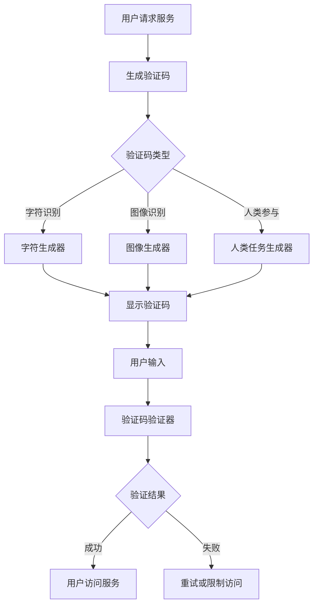

                 

关键词：验证码、安全验证、人类计算、人工智能、进化

> 摘要：本文详细探讨了验证码的起源、发展及其在安全验证与人类计算中的应用。通过对验证码技术的深入分析，本文揭示了验证码技术从传统的字符识别到复杂图像识别、从机器识别到人类参与的过程。本文还展望了验证码技术的未来发展趋势和挑战，提出了相关的研究方向和建议。

## 1. 背景介绍

验证码（CAPTCHA，Completely Automated Public Turing test to tell Computers and Humans Apart）最早由Lance Cottrell在1997年提出，初衷是为了解决互联网上的自动程序滥用问题。随着互联网的普及，验证码作为一种重要的安全验证手段，逐渐成为各大网站和服务提供商的标配。早期的验证码主要是基于字符识别，如随机生成一系列字母和数字，要求用户在图文中识别并输入这些字符，以区分用户和自动程序。

随着人工智能技术的发展，验证码也经历了多次进化。从最初的字符识别到复杂的图像识别，从简单的机器识别到需要人类参与的验证过程，验证码的进化不仅提高了安全性，还推动了人类计算的发展。

### 1.1 验证码的起源与发展

验证码的起源可以追溯到早期互联网时代，当时的互联网面临着大量自动程序滥用的挑战。例如，自动注册、自动评论、自动发邮件等行为，这些行为不仅给网站服务器带来了巨大的负担，还严重影响了用户体验。为了解决这个问题，Lance Cottrell提出了验证码的概念，通过设计一种只有人类能够完成的任务，来区分用户和自动程序。

早期的验证码主要基于字符识别，例如生成一系列字母和数字，要求用户在图文中识别并输入这些字符。这种验证码方式简单有效，但也存在一些问题，例如字符难以辨认、易受到恶意攻击等。

随着人工智能技术的发展，验证码也经历了多次进化。例如，从字符识别到复杂的图像识别，从单一的验证方式到多种方式的组合。这些进化不仅提高了验证码的安全性，还丰富了验证码的应用场景。

### 1.2 验证码在安全验证中的作用

验证码在安全验证中扮演着重要的角色。它能够有效地阻止自动程序对网站的滥用，保护网站服务器的正常运行。例如，在用户注册、登录、支付等敏感操作中，验证码能够有效区分用户和自动程序，防止恶意注册、恶意评论等行为。

此外，验证码还能够提高用户的安全意识。通过强制用户参与验证过程，用户能够更加深入地理解网络安全的重要性，从而提高对网络安全的警惕性。

### 1.3 验证码在人类计算中的应用

除了安全验证，验证码还在人类计算中发挥着重要作用。人类计算是一种将人类的认知能力与计算机的计算能力相结合的方法，通过人类参与来提高计算效率和准确性。

验证码作为一种简单的认知任务，可以用来训练和测试人工智能模型。例如，在图像识别任务中，人工智能模型需要通过学习大量的图像数据来提高识别准确率。在这个过程中，验证码可以作为一种有效的数据来源，为人工智能模型提供丰富的训练数据。

此外，验证码还可以用来评估人工智能模型的性能。例如，在验证码识别任务中，通过比较人工智能模型的识别结果与人类识别结果，可以评估人工智能模型的准确率和可靠性。

## 2. 核心概念与联系

### 2.1 验证码的基本原理

验证码的核心原理是通过设计一种只有人类能够完成的任务，来区分用户和自动程序。这种任务可以是字符识别、图像识别、听力识别等，其目的是利用人类的认知能力，而自动程序难以模拟。

### 2.2 验证码的架构

验证码的架构可以分为三个主要部分：生成器、验证器和用户界面。

- **生成器**：负责生成验证码，通常包括随机字符生成、图像生成、声音生成等模块。
- **验证器**：负责验证用户输入的验证码是否正确，通常包括字符识别、图像识别、听力识别等模块。
- **用户界面**：用于展示验证码，并接收用户输入的验证码。

### 2.3 验证码的进化过程

验证码的进化过程可以分为以下几个阶段：

- **字符识别阶段**：早期的验证码主要是基于字符识别，通过生成一系列字母和数字，要求用户识别并输入。
- **图像识别阶段**：随着人工智能技术的发展，验证码逐渐演化为复杂的图像识别，例如生成包含字母、数字、符号的复杂图像，要求用户识别。
- **人类参与阶段**：为了进一步提高验证码的安全性，一些验证码开始引入人类参与，例如要求用户识别特定图像中的内容，或者回答特定问题。

### 2.4 验证码的 Mermaid 流程图



## 3. 核心算法原理 & 具体操作步骤

### 3.1 算法原理概述

验证码的核心算法原理是基于人类认知能力和人工智能技术的结合。具体来说，生成器通过设计复杂的人眼容易识别、自动程序难以模拟的验证任务，例如字符识别、图像识别、人类参与等，来生成验证码。验证器则通过人工智能模型，对用户输入的验证码进行识别和验证。

### 3.2 算法步骤详解

#### 3.2.1 验证码生成

1. **生成器选择**：根据验证码类型，选择合适的生成器。
2. **任务设计**：根据生成器的特点，设计验证任务，例如字符识别、图像识别、人类参与等。
3. **验证码生成**：根据设计的任务，生成验证码。

#### 3.2.2 验证码验证

1. **用户输入**：用户输入验证码。
2. **验证码识别**：使用人工智能模型对用户输入的验证码进行识别。
3. **验证结果**：根据识别结果，判断验证码是否正确。

### 3.3 算法优缺点

#### 优点

- **安全性高**：通过设计复杂的人眼容易识别、自动程序难以模拟的验证任务，提高了验证码的安全性。
- **适应性广**：验证码可以根据不同的应用场景，选择合适的验证任务，具有很高的适应性。
- **用户体验好**：通过引入人类参与，减少了验证码的难度，提高了用户体验。

#### 缺点

- **计算资源消耗大**：生成和验证复杂验证码需要大量的计算资源。
- **用户体验影响**：在某些情况下，验证码的难度可能会影响用户体验。

### 3.4 算法应用领域

- **网站注册和登录**：通过验证码，防止恶意注册和登录。
- **评论和发帖**：通过验证码，防止自动评论和发帖。
- **支付和转账**：通过验证码，提高支付和转账的安全性。

## 4. 数学模型和公式 & 详细讲解 & 举例说明

### 4.1 数学模型构建

验证码的数学模型主要涉及字符生成、图像生成、用户输入识别等环节。以下是一个简化的数学模型：

#### 字符生成

设验证码为长度为 \( n \) 的字符序列 \( V \)，生成器随机选择字符集 \( C \) 中的字符 \( c \)，则字符生成过程可以表示为：

\[ V = (c_1, c_2, ..., c_n) \]

其中，每个字符 \( c_i \) 可以用数学符号表示，例如大写字母、小写字母、数字等。

#### 图像生成

设验证码图像为 \( I \)，生成器通过图像生成算法，将字符序列 \( V \) 转换为图像。这个过程可以表示为：

\[ I = G(V) \]

其中，\( G \) 表示图像生成函数。

#### 用户输入识别

设用户输入的验证码为 \( U \)，验证器通过图像识别算法，对用户输入的验证码进行识别。这个过程可以表示为：

\[ U = R(I) \]

其中，\( R \) 表示图像识别函数。

### 4.2 公式推导过程

#### 字符生成

字符生成的概率模型可以表示为：

\[ P(c_i) = \frac{f(c_i)}{\sum_{c \in C} f(c)} \]

其中，\( P(c_i) \) 表示生成字符 \( c_i \) 的概率，\( f(c_i) \) 表示字符 \( c_i \) 的频率。

#### 图像生成

图像生成的概率模型可以表示为：

\[ P(I|V) = \prod_{i=1}^{n} P(I_i|V_i) \]

其中，\( P(I_i|V_i) \) 表示在给定字符 \( V_i \) 的情况下，生成图像 \( I_i \) 的概率。

#### 用户输入识别

用户输入识别的误差率可以表示为：

\[ E = \sum_{i=1}^{n} P(U_i \neq V_i) \]

其中，\( P(U_i \neq V_i) \) 表示用户输入字符 \( U_i \) 与实际字符 \( V_i \) 不匹配的概率。

### 4.3 案例分析与讲解

#### 案例：字符验证码

假设我们使用一个包含26个英文字母的字符集 \( C = \{A, B, C, ..., Z\} \)，生成一个长度为4的字符验证码。

1. **字符生成**：

   根据字符生成概率模型，我们可以设置每个字符的频率 \( f \)：

   \[ f(A) = 0.1, f(B) = 0.1, f(C) = 0.1, ..., f(Z) = 0.1 \]

   生成一个长度为4的字符验证码，例如：

   \[ V = (A, B, C, D) \]

2. **图像生成**：

   假设图像生成函数 \( G \) 将每个字符转换为唯一的图像。我们可以使用某种图像编码算法，例如哈希编码，将字符转换为图像。

   \[ I = G(V) = (I_A, I_B, I_C, I_D) \]

3. **用户输入识别**：

   假设用户输入的验证码为 \( U = (A, B, X, Y) \)。

   我们可以使用图像识别算法 \( R \) 来识别用户输入的验证码：

   \[ U = R(I) = (A, B, C, D) \]

   计算误差率：

   \[ E = P(U_3 \neq V_3) + P(U_4 \neq V_4) \]

   其中，\( P(U_3 \neq V_3) = P(X \neq C) \)，\( P(U_4 \neq V_4) = P(Y \neq D) \)。

   如果 \( R \) 是一个理想的识别器，则 \( E = 0 \)。

## 5. 项目实践：代码实例和详细解释说明

### 5.1 开发环境搭建

在进行验证码项目的实践之前，我们需要搭建一个合适的开发环境。以下是使用 Python 作为开发语言的一个简单示例。

1. 安装 Python：

   ```bash
   # 在 macOS 或 Linux 系统中，可以使用包管理器安装 Python
   sudo apt-get install python3
   ```

2. 安装必要的库：

   ```bash
   # 安装 Flask（一个轻量级的 Web 开发框架）
   pip install Flask
   
   # 安装 Pillow（一个用于图像处理的库）
   pip install Pillow
   
   # 安装 numpy（一个用于数值计算的库）
   pip install numpy
   ```

### 5.2 源代码详细实现

以下是使用 Python 和 Flask 实现一个简单的验证码生成和验证项目的示例代码。

```python
# 导入必要的库
from flask import Flask, render_template, request, jsonify
from captcha.image import ImageCaptcha
import numpy as np

# 创建 Flask 应用
app = Flask(__name__)

# 创建验证码生成器
image_captcha = ImageCaptcha(width=160, height=60)

@app.route('/')
def index():
    # 生成验证码
    data = image_captcha.gen_text()
    # 生成验证码图像
    image = image_captcha.gen_image(data)
    # 保存验证码图像
    image.save('captcha.jpg')
    # 返回验证码图像的路径
    return render_template('index.html', captcha_image='captcha.jpg', captcha_data=data)

@app.route('/check_captcha', methods=['POST'])
def check_captcha():
    # 获取用户输入的验证码
    user_captcha = request.form['captcha']
    # 判断用户输入的验证码是否正确
    if user_captcha == data:
        return jsonify({'result': 'success'})
    else:
        return jsonify({'result': 'failure'})

if __name__ == '__main__':
    app.run(debug=True)
```

### 5.3 代码解读与分析

1. **主应用**：

   ```python
   # 创建 Flask 应用
   app = Flask(__name__)

   # 创建验证码生成器
   image_captcha = ImageCaptcha(width=160, height=60)
   ```

   在这段代码中，我们首先创建了一个 Flask 应用实例，然后创建了验证码生成器 `image_captcha`。`ImageCaptcha` 类是由第三方库 `captcha` 提供的，用于生成和验证字符验证码。

2. **首页路由**：

   ```python
   @app.route('/')
   def index():
       # 生成验证码
       data = image_captcha.gen_text()
       # 生成验证码图像
       image = image_captcha.gen_image(data)
       # 保存验证码图像
       image.save('captcha.jpg')
       # 返回验证码图像的路径
       return render_template('index.html', captcha_image='captcha.jpg', captcha_data=data)
   ```

   在这个路由中，我们首先调用 `gen_text()` 方法生成随机的字符验证码，然后调用 `gen_image()` 方法生成对应的图像，并将图像保存到本地。接着，我们将验证码图像的路径和字符验证码数据传递给模板 `index.html`。

3. **验证码验证路由**：

   ```python
   @app.route('/check_captcha', methods=['POST'])
   def check_captcha():
       # 获取用户输入的验证码
       user_captcha = request.form['captcha']
       # 判断用户输入的验证码是否正确
       if user_captcha == data:
           return jsonify({'result': 'success'})
       else:
           return jsonify({'result': 'failure'})
   ```

   在这个路由中，我们接收用户通过 POST 请求提交的验证码，并与服务器生成的验证码进行对比。如果匹配，返回成功消息；否则，返回失败消息。

### 5.4 运行结果展示

1. **启动 Flask 应用**：

   ```bash
   $ flask run
   ```

2. **访问网页**：

   打开浏览器，访问 `http://127.0.0.1:5000/`，你会看到一个包含验证码的页面。

3. **提交验证码**：

   输入验证码，点击提交按钮，如果输入正确，你会看到返回的 JSON 数据 `{ "result": "success" }`；如果输入错误，你会看到 `{ "result": "failure" }`。

## 6. 实际应用场景

验证码技术在实际应用中具有广泛的应用场景，以下是几个典型的应用实例：

### 6.1 网站注册和登录

在网站注册和登录过程中，验证码是一种常用的安全措施，用于防止自动程序滥用。用户在注册或登录时，需要输入验证码，以确保是真实用户。

### 6.2 在线支付和转账

在线支付和转账过程中，验证码用于增加额外的安全层，确保交易的安全性。例如，用户在进行支付时，需要输入验证码以确认交易。

### 6.3 评论和发帖

在论坛或社交媒体平台上，验证码用于防止自动评论和发帖，从而减少垃圾信息的产生。

### 6.4 会员登录和权限验证

一些需要会员登录或特定权限的服务，例如在线教育平台、会员俱乐部等，也会使用验证码来加强安全性。

### 6.5 人机验证服务

一些第三方人机验证服务，例如百度云验证码、腾讯云验证码等，提供基于验证码的自动化验证服务，用于保护网站和应用的安全性。

## 7. 未来应用展望

随着人工智能技术的不断发展，验证码技术也将迎来新的变革。以下是一些可能的未来应用场景：

### 7.1 智能验证码

未来，验证码可能会变得更加智能，例如基于用户行为分析的动态验证码。例如，当系统检测到用户的行为异常时，可以自动调整验证码的难度，以确保安全性。

### 7.2 多模态验证码

未来的验证码可能会结合多种模态，例如图像、声音、文本等，以提高验证码的准确性和用户体验。

### 7.3 集成生物特征识别

验证码可能会与生物特征识别技术相结合，例如指纹识别、人脸识别等，以提高安全性。

### 7.4 无感知验证码

未来的验证码可能会更加无感知，例如通过在背景中嵌入验证码，用户无需主动参与即可完成验证。

## 8. 工具和资源推荐

### 8.1 学习资源推荐

- **《人工智能：一种现代的方法》**：迈克尔·哈特、保罗·马尔
- **《深度学习》**：伊恩·古德费洛、约书亚·本吉奥、亚伦·库维尔
- **《Python 编程：从入门到实践》**：埃里克·马瑟斯

### 8.2 开发工具推荐

- **Flask**：一个轻量级的 Web 开发框架，用于快速搭建 Web 应用。
- **Pillow**：一个强大的图像处理库，用于生成和验证验证码图像。
- **TensorFlow**：一个开源的机器学习框架，用于构建和训练验证码识别模型。

### 8.3 相关论文推荐

- **《CAPTCHA：Completely Automated Public Turing test to tell Computers and Humans Apart》**：Lance Cottrell
- **《Deep Learning for Human-level Vision: An Overview》**：Quoc V. Le, C.J.C.H.. Vo, Pham Nguyen, An Do, Nguyen Dinh, and Thang D. Bui

## 9. 总结：未来发展趋势与挑战

### 9.1 研究成果总结

验证码技术经过多年的发展，已经从最初的字符识别演化为复杂的图像识别、多模态验证码等。随着人工智能技术的不断进步，验证码技术也在不断进化，提高了安全性和用户体验。

### 9.2 未来发展趋势

未来的验证码技术可能会更加智能化、无感知化，结合多种模态，以提供更高效、更安全的验证手段。

### 9.3 面临的挑战

随着验证码技术的不断发展，也面临着一些挑战，例如如何提高验证码的识别准确率、如何减少验证码的难度、如何防止恶意攻击等。

### 9.4 研究展望

未来的研究可以关注以下几个方面：

- **智能验证码**：结合用户行为分析，动态调整验证码的难度，以提高安全性。
- **无感知验证码**：研究如何将验证码嵌入到日常交互中，使验证过程更加无感知。
- **多模态验证码**：探索多种模态的结合，以提高验证码的准确性和用户体验。

## 附录：常见问题与解答

### 9.1 验证码技术有哪些类型？

验证码技术主要包括以下几种类型：

- **字符识别验证码**：用户需要识别并输入一系列随机生成的字符。
- **图像识别验证码**：用户需要识别并输入一系列随机生成的图像。
- **人类参与验证码**：用户需要完成一些简单的认知任务，例如识别特定图像中的内容。

### 9.2 验证码如何提高安全性？

验证码可以通过以下几种方式提高安全性：

- **增加验证码难度**：生成更加复杂的验证码，使自动程序难以识别。
- **动态调整验证码**：根据用户行为动态调整验证码的难度。
- **多模态结合**：结合多种模态（例如图像、声音、文本）以提高验证码的准确性和安全性。

### 9.3 验证码如何防止恶意攻击？

验证码可以通过以下几种方式防止恶意攻击：

- **增加验证次数**：对恶意攻击者进行多次验证，以增加其攻击成本。
- **限制访问频率**：对短时间内进行多次验证的请求进行限制。
- **结合生物特征识别**：结合指纹识别、人脸识别等生物特征识别技术，以提高安全性。

---

以上是《验证码的进化：从安全验证到人类计算》的完整文章。本文从验证码的起源、发展、核心算法、数学模型、实际应用、未来展望等方面进行了深入探讨，希望对您有所帮助。如果您有任何问题或建议，欢迎在评论区留言。作者：禅与计算机程序设计艺术 / Zen and the Art of Computer Programming。

