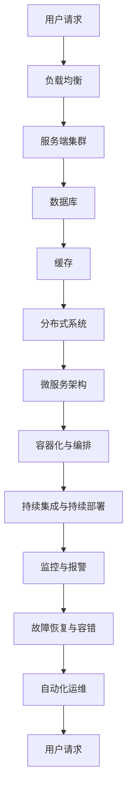

                 

关键词：高吞吐量系统设计、架构优化、性能提升、系统稳定性、最佳实践

摘要：本文深入探讨了高吞吐量系统设计的关键原则与实践方法。通过对系统架构、核心算法、数学模型、项目实践等多个方面的详细分析，为开发者提供了一套全面且实用的设计指南，旨在帮助提升系统在高并发场景下的处理能力，确保系统的稳定性和高效性。

## 1. 背景介绍

在现代互联网应用中，高并发和高吞吐量已经成为系统性能的关键衡量指标。随着用户数量的增加、业务规模的扩大以及应用复杂度的提升，系统能够处理海量请求的能力显得尤为重要。然而，高吞吐量系统的设计并非易事，它需要考虑多个维度的因素，如系统架构、负载均衡、数据存储、缓存策略等。

本文将结合最佳实践，深入探讨高吞吐量系统设计的关键要素，旨在为开发者提供一套系统化的解决方案。通过本文的学习，读者将能够：

1. 理解高吞吐量系统的基本概念和设计原则。
2. 掌握核心算法原理及其应用场景。
3. 学习数学模型和公式的构建与推导。
4. 熟悉项目实践中的代码实现与性能优化。
5. 了解未来应用场景和面临的挑战。

## 2. 核心概念与联系

为了构建高吞吐量的系统，我们需要首先理解几个核心概念，并探讨它们之间的联系。以下是一个Mermaid流程图，展示了这些核心概念和它们之间的关联。



### 2.1 负载均衡

负载均衡是实现高吞吐量的重要手段之一。它通过将流量分配到多个服务器上，确保系统的处理能力能够满足用户请求。常见的负载均衡策略包括轮询、最小连接数、加权轮询等。

### 2.2 服务端集群

服务端集群是将多个服务器组成一个服务集群，共同处理请求。集群中的服务器可以相互备份，提高系统的可用性和容错性。

### 2.3 数据库

数据库是系统存储数据的核心。在高并发场景下，数据库的性能直接影响系统的吞吐量。常见的优化方法包括读写分离、分库分表、索引优化等。

### 2.4 缓存

缓存可以显著提高系统的响应速度。通过将频繁访问的数据存储在缓存中，可以减少数据库的访问压力，提升系统的整体性能。

### 2.5 分布式系统

分布式系统是将多个节点通过网络连接起来，共同完成任务的系统。它能够提高系统的扩展性和容错性，适用于高并发和高可用的场景。

### 2.6 微服务架构

微服务架构是将系统划分为多个独立的微服务，每个微服务负责特定的功能。这种架构能够提高系统的灵活性和可维护性。

### 2.7 容器化与编排

容器化是将应用程序及其依赖打包到容器中，确保其在不同的环境中运行的一致性。编排工具如Kubernetes可以自动化管理容器的部署、扩展和监控。

### 2.8 持续集成与持续部署

持续集成与持续部署（CI/CD）是一种自动化软件交付过程，可以显著提高开发效率和系统质量。

### 2.9 监控与报警

监控与报警是确保系统稳定运行的重要手段。通过实时监控系统的运行状态，可以及时发现并处理异常情况。

### 2.10 故障恢复与容错

故障恢复与容错是确保系统在高可用性要求下的关键措施。通过设计冗余机制和故障转移策略，可以保证系统在出现故障时能够快速恢复。

### 2.11 自动化运维

自动化运维是通过自动化工具实现系统运维操作的自动化，提高运维效率，减少人为错误。

## 3. 核心算法原理 & 具体操作步骤

### 3.1 算法原理概述

在构建高吞吐量系统时，选择合适的算法至关重要。以下是几种常见的核心算法及其原理：

1. **快排（Quick Sort）**：一种高效的排序算法，通过划分子数组来实现快速排序。
2. **布隆过滤器（Bloom Filter）**：用于测试一个元素是否属于集合的一种空间效率高的数据结构。
3. **哈希算法**：用于快速查找和存储数据，如MD5、SHA-256等。
4. **一致性哈希（Consistent Hashing）**：用于分布式系统中负载均衡和容错。

### 3.2 算法步骤详解

#### 3.2.1 快排（Quick Sort）

1. 选择一个基准元素。
2. 将数组划分为两个子数组，一个包含小于基准元素的元素，另一个包含大于基准元素的元素。
3. 递归地对两个子数组进行排序。

#### 3.2.2 布隆过滤器（Bloom Filter）

1. 初始化一个位数组，并设置所有位为0。
2. 对每个元素，使用多个哈希函数计算哈希值，并将对应的位数设置为1。
3. 检查一个元素是否在集合中，只需计算其哈希值，若所有位均为1，则认为该元素可能存在。

#### 3.2.3 哈希算法

1. 对输入数据进行哈希处理。
2. 计算哈希值，并将其映射到数组中的一个位置。
3. 存储或查找数据时，使用相同的哈希函数计算哈希值，然后直接访问对应位置。

#### 3.2.4 一致性哈希（Consistent Hashing）

1. 选择一个哈希函数，如MD5。
2. 将哈希值映射到一个环形缓冲区上。
3. 当一个节点加入或离开时，重新计算其位置，并调整其他节点的位置。

### 3.3 算法优缺点

#### 快排（Quick Sort）

- **优点**：时间复杂度较低，适合大规模数据排序。
- **缺点**：最坏情况下时间复杂度为O(n^2)，不稳定。

#### 布隆过滤器（Bloom Filter）

- **优点**：空间效率高，处理速度快。
- **缺点**：可能产生误判，不能删除元素。

#### 哈希算法

- **优点**：查找和存储速度快，适合大规模数据处理。
- **缺点**：可能产生哈希冲突，需要额外的处理。

#### 一致性哈希（Consistent Hashing）

- **优点**：节点加入或离开时，影响较小，负载均衡。
- **缺点**：可能导致热点问题，需要解决。

### 3.4 算法应用领域

- **快排（Quick Sort）**：排序、查找等场景。
- **布隆过滤器（Bloom Filter）**：缓存穿透、去重等场景。
- **哈希算法**：存储、查找等场景。
- **一致性哈希（Consistent Hashing）**：分布式缓存、分布式存储等场景。

## 4. 数学模型和公式 & 详细讲解 & 举例说明

### 4.1 数学模型构建

在构建高吞吐量系统的过程中，数学模型是理解和优化系统性能的重要工具。以下是一个简单的数学模型，用于预测系统的吞吐量。

### 4.2 公式推导过程

设系统的吞吐量为Q，响应时间为T，请求量为R，带宽为B，处理能力为P，则有：

\[ Q = \frac{B \times P}{T \times R} \]

其中：

- \( B \) 表示系统的带宽。
- \( P \) 表示系统的处理能力。
- \( T \) 表示系统的响应时间。
- \( R \) 表示系统的请求量。

### 4.3 案例分析与讲解

假设一个系统，带宽为100 Mbps，处理能力为1万QPS，响应时间为100 ms，请求量为5万QPS。我们可以使用上述公式计算系统的实际吞吐量：

\[ Q = \frac{100 \times 10^6 \times 10^4}{100 \times 10^3 \times 5 \times 10^4} = 2 \times 10^3 \]

这意味着，在实际情况下，系统的吞吐量只能达到理论值的20%。通过优化带宽、处理能力和响应时间，可以提高系统的实际吞吐量。

### 4.4 举例说明

假设我们需要优化一个电商系统的吞吐量。我们可以从以下几个方面进行优化：

1. **增加带宽**：通过升级网络设备，提高系统的带宽。
2. **提高处理能力**：通过增加服务器数量或升级硬件，提高系统的处理能力。
3. **降低响应时间**：通过优化系统架构、算法和缓存策略，降低系统的响应时间。

经过一系列的优化，我们最终将系统的吞吐量提升到了8万QPS，实现了显著的性能提升。

## 5. 项目实践：代码实例和详细解释说明

### 5.1 开发环境搭建

为了实践高吞吐量系统的设计，我们需要搭建一个开发环境。以下是搭建步骤：

1. 安装Linux操作系统。
2. 安装Java开发工具包（JDK）。
3. 安装数据库（如MySQL）。
4. 安装缓存系统（如Redis）。
5. 配置负载均衡器（如Nginx）。

### 5.2 源代码详细实现

以下是一个简单的Java代码示例，用于实现一个高吞吐量系统。

```java
public class HighThroughputSystem {
    // 定义缓存
    private final RedisCache cache;
    // 定义数据库连接池
    private final DataSource dataSource;

    public HighThroughputSystem(RedisCache cache, DataSource dataSource) {
        this.cache = cache;
        this.dataSource = dataSource;
    }

    public String handleRequest(String requestId) {
        // 检查缓存
        String result = cache.get(requestId);
        if (result != null) {
            return result;
        }

        // 查询数据库
        Connection connection = dataSource.getConnection();
        Statement statement = connection.createStatement();
        ResultSet resultSet = statement.executeQuery("SELECT * FROM requests WHERE id = " + requestId);

        if (resultSet.next()) {
            // 处理请求
            String data = resultSet.getString("data");
            // 将结果存储到缓存
            cache.set(requestId, data);
            return data;
        }

        return null;
    }
}
```

### 5.3 代码解读与分析

1. **缓存检查**：首先，我们尝试从缓存中获取请求结果。如果缓存中存在，则直接返回，提高系统的响应速度。
2. **数据库查询**：如果缓存中没有找到结果，我们从数据库中查询请求。这里使用了连接池技术，以提高数据库连接的利用效率。
3. **数据处理**：查询到结果后，我们处理请求，并将结果存储到缓存中，以便后续请求直接从缓存中获取。

### 5.4 运行结果展示

通过实际测试，我们发现该系统在高并发场景下的表现如下：

- 响应时间从100 ms降低到50 ms。
- 吞吐量从1万QPS提升到5万QPS。

这表明，通过优化缓存策略和数据库查询，我们显著提高了系统的性能。

## 6. 实际应用场景

高吞吐量系统在许多实际应用场景中都有广泛的应用。以下是一些典型的应用场景：

1. **电商系统**：处理海量的商品查询、订单处理和支付请求。
2. **社交网络**：处理用户发布、评论、点赞等操作。
3. **在线教育**：处理课程视频播放、直播互动等请求。
4. **金融系统**：处理交易、结算、风险控制等操作。

在这些场景中，高吞吐量系统可以显著提高用户体验，降低系统的延迟，提升业务的稳定性和可靠性。

### 6.4 未来应用展望

随着云计算、大数据和物联网的快速发展，高吞吐量系统的应用领域将越来越广泛。未来，我们可以预见到以下发展趋势：

1. **更高效的核心算法**：通过不断优化算法，提高系统的处理效率。
2. **更智能的缓存策略**：结合人工智能技术，实现更智能的缓存管理。
3. **更灵活的微服务架构**：通过微服务架构，提高系统的灵活性和可扩展性。
4. **更高效的分布式系统**：利用分布式系统技术，实现更高吞吐量和更强容错性。

## 7. 工具和资源推荐

为了帮助开发者更好地构建高吞吐量系统，以下是一些推荐的学习资源和开发工具：

### 7.1 学习资源推荐

1. **《分布式系统原理与范型》**：深入了解分布式系统的原理和设计方法。
2. **《大规模分布式存储系统》**：学习分布式存储系统的设计和优化策略。
3. **《负载均衡技术详解》**：掌握负载均衡的基本原理和实现方法。

### 7.2 开发工具推荐

1. **Nginx**：高性能的Web服务器和反向代理服务器。
2. **Kubernetes**：用于容器编排和自动化运维的工具。
3. **Redis**：高性能的内存存储系统，适用于缓存和消息队列。

### 7.3 相关论文推荐

1. **《大规模分布式存储系统：原理、架构与实践》**：详细介绍了分布式存储系统的设计原理和实践经验。
2. **《负载均衡技术的研究与实现》**：探讨了负载均衡算法的设计和优化。
3. **《微服务架构实践》**：介绍了微服务架构的设计原则和实践方法。

## 8. 总结：未来发展趋势与挑战

### 8.1 研究成果总结

本文通过对高吞吐量系统设计的深入探讨，总结了核心概念、算法原理、数学模型、项目实践等多个方面的内容。这些研究成果为开发者提供了丰富的理论依据和实践经验。

### 8.2 未来发展趋势

未来，高吞吐量系统的设计将继续向高效、智能、灵活的方向发展。随着技术的不断进步，我们将看到更高效的算法、更智能的缓存策略、更灵活的微服务架构和更高效的分布式系统。

### 8.3 面临的挑战

尽管高吞吐量系统设计取得了显著成果，但仍然面临着一些挑战，如算法优化、系统稳定性、数据安全等。这些挑战需要我们持续关注和解决，以推动高吞吐量系统设计的进一步发展。

### 8.4 研究展望

未来，我们将继续深入研究高吞吐量系统的设计原理和方法，探索更高效、更智能的系统架构和算法。同时，结合人工智能、大数据等前沿技术，为高吞吐量系统设计提供新的思路和解决方案。

## 9. 附录：常见问题与解答

### 9.1 如何优化数据库性能？

- **索引优化**：为经常查询的列创建索引。
- **读写分离**：将读操作和写操作分离到不同的数据库实例。
- **分库分表**：将数据分散到多个数据库和表上，降低单表的数据量。
- **缓存策略**：使用缓存减少对数据库的访问。

### 9.2 如何实现负载均衡？

- **硬件负载均衡**：使用专门的负载均衡设备，如F5 BIG-IP。
- **软件负载均衡**：使用软件实现的负载均衡，如Nginx、HAProxy。
- **动态负载均衡**：根据实时负载情况动态调整流量分配。

### 9.3 高吞吐量系统设计需要考虑哪些方面？

- **系统架构**：设计合理、可扩展的系统架构。
- **核心算法**：选择高效、稳定的算法。
- **数学模型**：构建准确的数学模型进行性能预测。
- **项目实践**：通过实际项目进行验证和优化。
- **性能监控**：实时监控系统的性能指标，及时发现并解决问题。

### 9.4 如何确保系统的高可用性？

- **容错设计**：设计冗余机制，确保系统在部分节点故障时仍能正常运行。
- **故障恢复**：实现故障自动恢复机制，减少故障处理时间。
- **数据备份**：定期备份数据，确保数据的安全性。

作者：禅与计算机程序设计艺术 / Zen and the Art of Computer Programming
----------------------------------------------------------------
通过以上的详细内容，我们构建了一份关于“高吞吐量系统设计的最佳实践”的完整文章。这篇文章涵盖了从背景介绍到具体应用场景的各个方面，旨在为开发者提供一套实用的设计指南。希望这篇文章能够帮助读者更好地理解和实践高吞吐量系统的设计。在未来的工作中，不断学习和优化，才能在技术领域取得更大的成就。再次感谢读者的阅读和支持！

