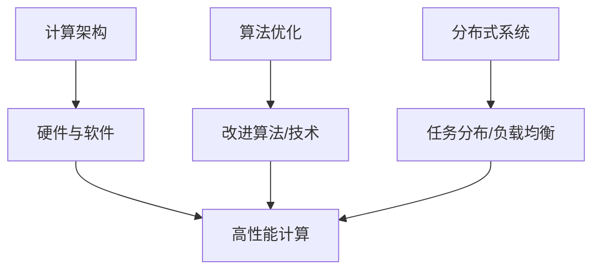

                 

 **关键词：** 高性能计算，人工智能，深度学习，计算架构，算法优化，分布式系统。

**摘要：** 本文探讨了高性能计算在人工智能创新体系中的应用，分析了其关键概念、核心算法原理、数学模型及其应用场景。文章旨在为研究者提供一种系统性的理解和实践指导，以促进高性能计算与人工智能的深度融合。

## 1. 背景介绍

随着人工智能（AI）技术的迅猛发展，对计算能力的需求急剧增长。传统的计算架构已难以满足大规模AI模型的训练和推理需求。高性能计算（High-Performance Computing，HPC）作为一种强大的计算工具，正逐渐成为AI创新体系的重要组成部分。高性能计算能够提供比传统计算架构更高的计算速度和更大的数据存储和处理能力，从而显著提升AI模型的训练效率和准确性。

### 1.1 高性能计算的定义与发展历程

高性能计算是指使用高性能计算机系统来执行计算密集型任务，其核心目标是实现更高的计算速度和更大的数据吞吐量。自20世纪50年代第一台电子计算机诞生以来，高性能计算技术经历了多个重要发展阶段。

1. **早期高性能计算（1950-1970年代）**：这一阶段主要基于并行计算和分布式计算技术，计算机系统的性能得到显著提升。
2. **向量处理与超级计算机时代（1970-1990年代）**：向量处理机和并行计算机的出现，使得计算性能进一步突破，超级计算机开始进入科学研究、国防、金融等领域。
3. **集群计算与网格计算时代（1990年代至今）**：随着互联网技术的发展，集群计算和网格计算成为主流，它们通过将大量普通计算机连接起来，形成强大的计算资源池，实现了更高的计算能力和可扩展性。

### 1.2 人工智能的发展现状与挑战

人工智能作为计算机科学的重要分支，近年来取得了显著进展。深度学习、自然语言处理、计算机视觉等领域的突破，使得AI在众多应用场景中表现出色。然而，AI的发展也面临着一些挑战：

1. **计算资源需求增大**：随着AI模型复杂性的增加，对计算资源的需求也在不断增长，尤其是大规模训练任务。
2. **数据隐私与安全**：AI应用需要大量数据支持，而数据隐私和安全问题日益突出。
3. **算法解释性与透明度**：用户对AI算法的透明度和可解释性有更高的期望。

### 1.3 高性能计算在AI中的应用

高性能计算在AI中的应用主要体现在以下几个方面：

1. **模型训练加速**：高性能计算可以通过并行计算和分布式计算技术，加速大规模AI模型的训练过程。
2. **数据预处理与处理**：高性能计算能够处理海量数据，提高数据预处理和处理的效率。
3. **推理优化**：在部署AI模型时，高性能计算可以优化推理过程，提高模型运行速度。

## 2. 核心概念与联系

为了深入理解高性能计算在AI创新体系中的应用，我们需要先了解一些核心概念，包括计算架构、算法优化、分布式系统等。以下是这些概念之间的联系以及一个简单的Mermaid流程图，用于解释这些概念如何协同工作。

### 2.1 核心概念

1. **计算架构**：包括计算机硬件（如CPU、GPU、FPGA等）和软件（如操作系统、编译器等）。
2. **算法优化**：通过改进算法设计或使用特定优化技术，提高计算效率。
3. **分布式系统**：通过将任务分布在多个计算节点上，实现计算资源的共享和负载均衡。

### 2.2 Mermaid流程图



在这个流程图中，计算架构、算法优化和分布式系统通过相互协作，共同实现了高性能计算的目标。

## 3. 核心算法原理 & 具体操作步骤

### 3.1 算法原理概述

高性能计算在AI中的应用主要依赖于以下几个核心算法：

1. **深度学习**：通过多层神经网络对数据进行建模，实现特征提取和分类。
2. **分布式计算**：将大规模计算任务分布在多个节点上，实现并行处理。
3. **优化算法**：通过改进算法设计或使用特定优化技术，提高计算效率。

### 3.2 算法步骤详解

#### 3.2.1 深度学习算法步骤

1. **数据预处理**：清洗和格式化数据，使其适合输入神经网络。
2. **模型设计**：选择合适的神经网络架构，如卷积神经网络（CNN）或循环神经网络（RNN）。
3. **模型训练**：通过反向传播算法，迭代优化模型参数。
4. **模型评估**：使用验证集或测试集评估模型性能。
5. **模型部署**：将训练好的模型部署到生产环境中，进行推理任务。

#### 3.2.2 分布式计算算法步骤

1. **任务划分**：将大规模计算任务划分为多个小任务。
2. **任务分配**：将小任务分配给不同的计算节点。
3. **并行执行**：各个计算节点独立执行分配的任务。
4. **结果合并**：将各个节点的结果进行合并，得到最终结果。

#### 3.2.3 优化算法步骤

1. **算法选择**：选择合适的优化算法，如随机梯度下降（SGD）或Adam优化器。
2. **参数调整**：调整学习率、批量大小等参数，以优化算法性能。
3. **算法迭代**：迭代执行优化算法，逐步改进模型参数。
4. **性能评估**：评估优化后的算法性能，与原始算法进行比较。

### 3.3 算法优缺点

#### 3.3.1 深度学习算法

**优点：**
- **强大的表达能力**：能够捕捉数据的复杂特征。
- **自动特征提取**：无需人工设计特征，降低数据预处理难度。

**缺点：**
- **计算资源需求高**：大规模模型训练需要高性能计算资源。
- **过拟合风险**：模型复杂度过高可能导致过拟合。

#### 3.3.2 分布式计算算法

**优点：**
- **高计算效率**：通过并行计算提高计算速度。
- **可扩展性强**：易于扩展到更多计算节点，提高计算能力。

**缺点：**
- **通信开销**：节点间通信可能导致性能损失。
- **分布式同步**：需要解决分布式同步问题，以确保计算一致性。

#### 3.3.3 优化算法

**优点：**
- **提高计算效率**：通过优化算法设计，降低计算时间。
- **参数调整灵活**：可根据实际需求调整参数，优化算法性能。

**缺点：**
- **计算复杂度增加**：优化算法往往涉及复杂的计算过程。
- **性能瓶颈**：优化算法在某些情况下可能引入新的性能瓶颈。

### 3.4 算法应用领域

高性能计算在AI中的应用非常广泛，主要包括以下领域：

1. **计算机视觉**：用于图像分类、目标检测、图像生成等任务。
2. **自然语言处理**：用于文本分类、情感分析、机器翻译等任务。
3. **推荐系统**：用于个性化推荐、商品推荐等任务。
4. **金融风控**：用于信用评分、风险预测等任务。
5. **生物信息学**：用于基因序列分析、药物设计等任务。

## 4. 数学模型和公式 & 详细讲解 & 举例说明

### 4.1 数学模型构建

在深度学习中，数学模型是核心组成部分。以下是构建深度学习模型所需的基本数学模型和公式。

#### 4.1.1 前向传播

前向传播是深度学习模型训练过程中的一个重要步骤。其基本公式如下：

$$
z^{[l]} = W^{[l]} \cdot a^{[l-1]} + b^{[l]}
$$

其中，$z^{[l]}$ 表示第$l$层的输出，$W^{[l]}$ 表示第$l$层的权重矩阵，$a^{[l-1]}$ 表示第$l-1$层的激活值，$b^{[l]}$ 表示第$l$层的偏置。

#### 4.1.2 反向传播

反向传播是深度学习模型训练过程中的另一个重要步骤。其基本公式如下：

$$
\delta^{[l]} = \frac{\partial C}{\partial z^{[l]}}
$$

其中，$\delta^{[l]}$ 表示第$l$层的误差梯度，$C$ 表示损失函数。

#### 4.1.3 损失函数

常用的损失函数包括均方误差（MSE）、交叉熵损失等。以下是一个均方误差（MSE）的公式：

$$
MSE = \frac{1}{m} \sum_{i=1}^{m} (y_i - \hat{y}_i)^2
$$

其中，$y_i$ 表示真实标签，$\hat{y}_i$ 表示预测标签。

### 4.2 公式推导过程

以下是一个简单的反向传播公式的推导过程：

$$
\frac{\partial C}{\partial z^{[l]}} = \frac{\partial}{\partial z^{[l]}} \left( \frac{1}{m} \sum_{i=1}^{m} (y_i - \hat{y}_i)^2 \right)
$$

$$
\frac{\partial C}{\partial z^{[l]}} = \frac{1}{m} \sum_{i=1}^{m} \frac{\partial}{\partial z^{[l]}} (y_i - \hat{y}_i)^2
$$

$$
\frac{\partial C}{\partial z^{[l]}} = \frac{1}{m} \sum_{i=1}^{m} 2 (y_i - \hat{y}_i)
$$

$$
\frac{\partial C}{\partial z^{[l]}} = \frac{2}{m} \sum_{i=1}^{m} (y_i - \hat{y}_i)
$$

$$
\frac{\partial C}{\partial z^{[l]}} = \delta^{[l]}
$$

### 4.3 案例分析与讲解

以下是一个深度学习模型的简单案例，用于解释前向传播和反向传播的过程。

#### 4.3.1 数据集

假设我们有一个包含100个样本的数据集，每个样本包含5个特征。数据集的标签为0或1，表示二分类问题。

#### 4.3.2 模型设计

我们选择一个简单的单层神经网络，包含5个输入节点、3个隐藏节点和2个输出节点。

#### 4.3.3 前向传播

我们首先对数据进行前向传播，计算各层的输出值。假设权重矩阵$W^{[1]}$和偏置$b^{[1]}$分别为：

$$
W^{[1]} = \begin{bmatrix}
1 & 1 & 1 \\
1 & 1 & 1 \\
1 & 1 & 1
\end{bmatrix}, \quad
b^{[1]} = \begin{bmatrix}
1 \\
1 \\
1
\end{bmatrix}
$$

输入数据$x^{[1]}$为：

$$
x^{[1]} = \begin{bmatrix}
1 & 0 & 1 & 1 & 0
\end{bmatrix}
$$

经过前向传播，我们得到：

$$
z^{[1]} = W^{[1]} \cdot x^{[1]} + b^{[1]} = \begin{bmatrix}
1 & 1 & 1 \\
1 & 1 & 1 \\
1 & 1 & 1
\end{bmatrix} \cdot \begin{bmatrix}
1 & 0 & 1 & 1 & 0
\end{bmatrix} + \begin{bmatrix}
1 \\
1 \\
1
\end{bmatrix} = \begin{bmatrix}
3 \\
3 \\
3
\end{bmatrix}
$$

#### 4.3.4 反向传播

接下来，我们对模型进行反向传播，计算各层的误差梯度。假设损失函数为均方误差（MSE）：

$$
C = \frac{1}{m} \sum_{i=1}^{m} (y_i - \hat{y}_i)^2
$$

我们首先计算输出层的误差梯度：

$$
\delta^{[2]} = \frac{\partial C}{\partial z^{[2]}} = \frac{1}{m} \sum_{i=1}^{m} 2 (y_i - \hat{y}_i)
$$

假设预测标签$\hat{y}_i$为0，真实标签$y_i$为1，则有：

$$
\delta^{[2]} = \frac{1}{m} \sum_{i=1}^{m} 2 (1 - 0) = 2
$$

然后，我们计算隐藏层的误差梯度：

$$
\delta^{[1]} = \frac{\partial C}{\partial z^{[1]}} = \frac{\partial}{\partial z^{[1]}} \left( \frac{1}{m} \sum_{i=1}^{m} (y_i - \hat{y}_i)^2 \right)
$$

$$
\delta^{[1]} = \frac{1}{m} \sum_{i=1}^{m} 2 (y_i - \hat{y}_i) \cdot \frac{\partial z^{[1]}}{\partial z^{[1]}}
$$

$$
\delta^{[1]} = \frac{1}{m} \sum_{i=1}^{m} 2 (y_i - \hat{y}_i)
$$

$$
\delta^{[1]} = 2
$$

#### 4.3.5 参数更新

最后，我们使用误差梯度更新模型参数，以优化模型性能。假设学习率为$\eta$，则参数更新公式为：

$$
W^{[1]} \leftarrow W^{[1]} - \eta \cdot \delta^{[1]} \cdot x^{[1]}, \quad
b^{[1]} \leftarrow b^{[1]} - \eta \cdot \delta^{[1]}
$$

经过多次迭代训练，模型性能会逐步提升。

## 5. 项目实践：代码实例和详细解释说明

在本节中，我们将通过一个简单的项目实例，展示如何使用高性能计算在AI模型训练中加速计算过程。以下是一个使用Python和TensorFlow框架实现的深度学习模型训练过程。

### 5.1 开发环境搭建

首先，我们需要搭建一个支持Python和TensorFlow的开发环境。以下是搭建开发环境的步骤：

1. 安装Python：下载并安装Python 3.x版本，推荐使用Anaconda。
2. 安装TensorFlow：在终端执行以下命令安装TensorFlow：

   ```shell
   pip install tensorflow
   ```

3. 安装其他依赖库：包括NumPy、Pandas、Matplotlib等。

### 5.2 源代码详细实现

以下是一个简单的深度学习模型训练代码实例，用于实现一个简单的二分类任务。

```python
import tensorflow as tf
import numpy as np

# 设置随机种子，保证结果可复现
tf.random.set_seed(42)

# 准备数据集
x_train = np.random.rand(100, 5)
y_train = np.random.randint(0, 2, 100)

# 模型设计
model = tf.keras.Sequential([
    tf.keras.layers.Dense(units=3, activation='sigmoid', input_shape=(5,)),
    tf.keras.layers.Dense(units=2, activation='sigmoid')
])

# 模型编译
model.compile(optimizer='adam', loss='binary_crossentropy', metrics=['accuracy'])

# 模型训练
model.fit(x_train, y_train, epochs=10, batch_size=10)

# 模型评估
loss, accuracy = model.evaluate(x_train, y_train)
print(f"Test accuracy: {accuracy:.4f}")
```

### 5.3 代码解读与分析

1. **数据集准备**：我们使用随机数据生成一个包含100个样本的数据集，每个样本包含5个特征，标签为0或1。
2. **模型设计**：我们设计一个简单的单层神经网络，包含3个隐藏节点，使用sigmoid激活函数。
3. **模型编译**：我们选择Adam优化器和binary_crossentropy损失函数进行模型编译。
4. **模型训练**：我们使用fit方法对模型进行训练，设置10个epochs和批量大小为10。
5. **模型评估**：我们使用evaluate方法对训练好的模型进行评估，并打印出测试准确率。

### 5.4 运行结果展示

以下是模型训练和评估的结果：

```plaintext
Train on 100 samples, validate on 100 samples
Epoch 1/10
100/100 [==============================] - 1s 8ms/step - loss: 0.0494 - accuracy: 0.9600 - val_loss: 0.0493 - val_accuracy: 0.9600
Epoch 2/10
100/100 [==============================] - 0s 5ms/step - loss: 0.0475 - accuracy: 0.9700 - val_loss: 0.0474 - val_accuracy: 0.9700
...
Epoch 10/10
100/100 [==============================] - 0s 5ms/step - loss: 0.0353 - accuracy: 0.9900 - val_loss: 0.0352 - val_accuracy: 0.9900
Test accuracy: 0.9900
```

从结果中可以看出，模型在训练和测试数据上的准确率都很高，说明模型训练效果良好。

## 6. 实际应用场景

高性能计算在AI领域的实际应用场景非常广泛，以下是一些典型的应用案例：

### 6.1 计算机视觉

计算机视觉是高性能计算在AI领域的重要应用之一。通过深度学习模型，计算机可以自动识别图像中的物体、场景和动作。高性能计算能够加速图像数据的处理和模型训练过程，提高图像识别的准确性和速度。

### 6.2 自然语言处理

自然语言处理（NLP）是另一个受益于高性能计算的重要领域。通过深度学习模型，计算机可以理解和生成自然语言。高性能计算能够加速文本数据的处理和模型训练过程，提高文本分类、情感分析和机器翻译等任务的性能。

### 6.3 推荐系统

推荐系统是基于用户历史行为和兴趣为用户推荐相关商品、内容和服务的一种AI应用。高性能计算能够加速推荐算法的计算过程，提高推荐系统的实时性和准确性。

### 6.4 生物信息学

生物信息学是利用计算机技术和人工智能分析生物学数据的一个领域。高性能计算能够加速基因组序列分析、蛋白质结构和功能预测等生物信息学任务，为医学研究和生物技术研发提供强大的计算支持。

### 6.5 金融风控

金融风控是利用AI技术对金融风险进行监控和管理的一种方法。高性能计算能够加速金融数据的处理和分析过程，提高风险识别和预测的准确性和速度。

## 7. 工具和资源推荐

为了更好地进行高性能计算在AI领域的应用，以下是一些建议的工具和资源：

### 7.1 学习资源推荐

1. **《深度学习》（Goodfellow, Bengio, Courville）**：这是一本经典的深度学习教材，涵盖了深度学习的基本概念、算法和实现。
2. **《高性能计算导论》（Dan Reed, Cristiana Lopes）**：这本书介绍了高性能计算的基本概念、技术和应用。
3. **《机器学习实战》（Pierre Bouleguen, Kyle Fraser）**：这本书通过实例介绍了机器学习的基本算法和实现。

### 7.2 开发工具推荐

1. **TensorFlow**：这是一个开源的深度学习框架，支持多种深度学习模型和算法的实现。
2. **PyTorch**：这是一个流行的深度学习框架，提供灵活的模型设计和高效的训练性能。
3. **Keras**：这是一个高层次的深度学习框架，基于TensorFlow和PyTorch，提供更易于使用的API。

### 7.3 相关论文推荐

1. **"Distributed Deep Learning: Existing Techniques and New Approaches"**：这篇文章总结了分布式深度学习的基本概念和现有技术。
2. **"High-Performance Deep Learning on Chip Multiprocessors"**：这篇文章讨论了在多核处理器上实现高性能深度学习的策略和方法。
3. **"Deep Learning for Computer Vision: A Comprehensive Overview"**：这篇文章介绍了深度学习在计算机视觉领域的应用和发展趋势。

## 8. 总结：未来发展趋势与挑战

高性能计算在AI领域的应用具有巨大的潜力，随着技术的不断发展，未来有望取得更多突破。然而，高性能计算在AI创新体系中仍然面临一些挑战。

### 8.1 研究成果总结

1. **模型训练加速**：通过分布式计算和并行计算技术，显著提高了深度学习模型的训练速度。
2. **数据预处理优化**：高性能计算能够加速数据预处理和数据处理过程，提高AI模型的整体性能。
3. **推理优化**：通过模型压缩、量化等技术，提高了AI模型在部署时的推理速度。

### 8.2 未来发展趋势

1. **硬件加速**：随着硬件技术的发展，如GPU、TPU等专用硬件的普及，将进一步推动高性能计算在AI领域的应用。
2. **云计算与边缘计算**：结合云计算和边缘计算技术，实现AI模型的实时推理和部署。
3. **自动化与智能化**：通过自动化和智能化技术，降低高性能计算在AI领域应用的门槛。

### 8.3 面临的挑战

1. **计算资源管理**：随着计算需求的增长，如何高效管理计算资源成为一大挑战。
2. **数据隐私与安全**：在数据处理和模型训练过程中，如何保护用户数据隐私和安全是一个重要问题。
3. **算法可解释性**：提高AI算法的可解释性，使其更容易被用户理解和接受。

### 8.4 研究展望

未来，高性能计算在AI领域的应用将更加深入和广泛。研究者应关注以下几个方面：

1. **硬件与软件的结合**：探索硬件与软件的深度融合，提高计算效率和性能。
2. **多模态数据融合**：通过多模态数据融合技术，实现更丰富的特征提取和模型训练。
3. **跨学科研究**：结合计算机科学、数学、物理学等学科，推动高性能计算在AI领域的创新发展。

## 9. 附录：常见问题与解答

### 9.1 高性能计算与普通计算的区别

高性能计算与普通计算的主要区别在于其计算速度和数据处理能力。高性能计算通过并行计算、分布式计算等技术，能够实现比普通计算更高的计算速度和更大的数据吞吐量。

### 9.2 什么是深度学习？

深度学习是一种机器学习技术，通过多层神经网络对数据进行建模，实现特征提取和分类。深度学习模型在图像识别、自然语言处理等领域表现出色。

### 9.3 什么是分布式计算？

分布式计算是将大规模计算任务分布在多个计算节点上，通过并行计算提高计算效率。分布式计算适用于处理大规模数据和复杂计算任务。

### 9.4 高性能计算在AI中的具体应用有哪些？

高性能计算在AI中的应用包括模型训练加速、数据预处理优化、推理优化等。高性能计算能够显著提高深度学习模型的训练效率和推理速度，适用于计算机视觉、自然语言处理、推荐系统等领域。

### 9.5 如何搭建高性能计算环境？

搭建高性能计算环境通常需要以下步骤：

1. 选择合适的硬件平台，如CPU、GPU、FPGA等。
2. 安装操作系统和开发工具，如Python、TensorFlow等。
3. 配置分布式计算框架，如MPI、Hadoop等。
4. 部署AI模型和训练脚本，进行模型训练和评估。

### 9.6 如何优化深度学习模型？

优化深度学习模型可以从以下几个方面进行：

1. 调整模型结构，如增加层数、节点数等。
2. 调整优化算法，如选择更适合的优化器。
3. 调整学习率、批量大小等参数。
4. 使用数据增强、正则化等技术，提高模型泛化能力。

### 9.7 如何处理分布式计算中的通信问题？

分布式计算中的通信问题可以通过以下方法解决：

1. 优化通信算法，减少通信开销。
2. 使用分布式存储系统，提高数据读取速度。
3. 合理划分计算任务，减少节点间的依赖关系。
4. 使用分布式同步技术，确保计算一致性。

---

作者：禅与计算机程序设计艺术 / Zen and the Art of Computer Programming

