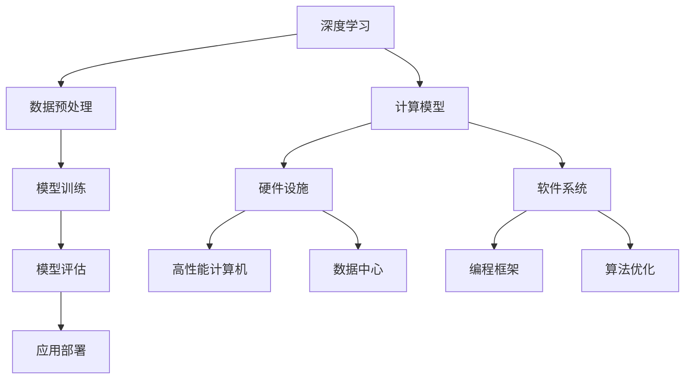

                 

关键词：高性能计算、AI 2.0、算力基础设施、深度学习、计算模型、数学公式、项目实践、实际应用、未来展望

> 摘要：本文将深入探讨高性能计算在AI 2.0时代中的核心地位，分析其与深度学习等前沿技术的紧密联系，介绍关键算法原理、数学模型和实际应用案例，同时展望未来发展趋势与挑战。

## 1. 背景介绍

随着人工智能（AI）技术的迅猛发展，高性能计算（HPC）的重要性日益凸显。AI 2.0时代的到来，标志着人工智能从模拟人脑到超越人脑的过渡，对计算能力的需求达到了前所未有的高度。高性能计算作为支撑AI 2.0发展的基础，已成为众多领域创新的核心驱动力。

### 1.1 AI 2.0的定义与特点

AI 2.0是对传统人工智能（AI 1.0）的继承与发展，其核心在于利用深度学习、强化学习、自然语言处理等技术，使计算机能够自动进行复杂任务，并在一定程度上实现自我优化和自我进化。与AI 1.0相比，AI 2.0具有以下特点：

- **智能化程度更高**：AI 2.0能够处理更为复杂的任务，具备更强的自学习和自适应能力。
- **应用领域更广泛**：AI 2.0技术可应用于医疗、金融、交通、教育等多个领域，推动产业变革。
- **计算需求更大**：AI 2.0依赖于海量数据和高性能计算，对计算资源的需求达到前所未有的规模。

### 1.2 高性能计算的定义与发展历程

高性能计算是指利用计算机硬件和软件技术，实现大规模数据的高效处理和分析。其发展历程可以分为以下几个阶段：

- **早期阶段**：以高性能计算机和并行计算为核心，主要应用于科学计算和工程仿真。
- **中期阶段**：随着互联网和数据中心的发展，高性能计算逐渐应用于企业级应用和云计算。
- **现阶段**：AI 2.0时代的到来，高性能计算成为支撑AI技术发展的重要基础设施。

## 2. 核心概念与联系

### 2.1 核心概念

- **深度学习**：一种基于人工神经网络的机器学习技术，通过多层网络结构实现特征提取和模型训练。
- **计算模型**：描述计算机系统如何处理数据和执行任务的抽象模型。
- **算力基础设施**：包括硬件设备、软件系统、数据资源和网络设施等，共同构成支持高性能计算的基础设施。

### 2.2 Mermaid 流程图



## 3. 核心算法原理 & 具体操作步骤

### 3.1 算法原理概述

高性能计算在AI 2.0时代中的核心作用主要体现在以下几个方面：

- **加速模型训练**：利用并行计算技术，将大规模数据处理任务分配到多个计算节点，提高模型训练速度。
- **优化计算资源**：通过虚拟化、容器化等技术，实现计算资源的动态调度和高效利用。
- **降低能耗**：采用绿色计算技术，降低高性能计算的数据中心能耗。

### 3.2 算法步骤详解

#### 3.2.1 数据预处理

1. 数据清洗：去除无效、错误或不一致的数据。
2. 数据集成：将不同来源、格式的数据整合为统一的格式。
3. 数据转换：对数据类型、尺度等进行标准化处理。

#### 3.2.2 模型训练

1. 模型选择：根据任务需求，选择合适的深度学习模型。
2. 模型参数初始化：为模型参数随机赋值。
3. 前向传播：将输入数据传递到网络中，计算输出结果。
4. 反向传播：根据输出结果计算损失函数，反向更新模型参数。

#### 3.2.3 模型评估

1. 训练集评估：使用训练集数据对模型性能进行评估。
2. 测试集评估：使用测试集数据对模型泛化能力进行评估。
3. 调参优化：根据评估结果调整模型参数，提高模型性能。

#### 3.2.4 应用部署

1. 模型压缩：对模型进行压缩，降低模型体积。
2. 模型迁移：将模型部署到目标设备或平台上。
3. 模型监控：对模型运行状态进行实时监控，确保模型稳定运行。

### 3.3 算法优缺点

#### 优点：

- **高效率**：利用并行计算和分布式计算技术，显著提高模型训练速度。
- **高稳定性**：采用先进的算法和硬件技术，保证模型训练和推理的稳定性。
- **灵活性**：支持多种编程框架和计算模型，满足不同应用场景的需求。

#### 缺点：

- **高成本**：高性能计算设备和基础设施投入较大。
- **高能耗**：大规模计算任务导致数据中心能耗较高。
- **技术门槛**：需要掌握一定的编程和算法知识，对开发人员的要求较高。

### 3.4 算法应用领域

高性能计算在AI 2.0时代的应用领域非常广泛，主要包括：

- **自动驾驶**：利用深度学习技术，实现车辆的自适应和自动驾驶功能。
- **医疗诊断**：通过分析医学影像数据，辅助医生进行疾病诊断和治疗方案制定。
- **金融分析**：利用大数据和深度学习技术，实现精准营销、风险管理等业务。
- **智能教育**：通过个性化学习推荐和智能辅助教学，提高教育质量和效果。

## 4. 数学模型和公式 & 详细讲解 & 举例说明

### 4.1 数学模型构建

深度学习中的数学模型主要包括神经网络、损失函数、优化算法等。

#### 4.1.1 神经网络

神经网络是一种由多层神经元组成的计算模型，用于模拟人脑的神经网络结构。其基本结构包括输入层、隐藏层和输出层。

#### 4.1.2 损失函数

损失函数用于评估模型预测值与真实值之间的差异，常用的损失函数包括均方误差（MSE）、交叉熵损失（Cross-Entropy Loss）等。

#### 4.1.3 优化算法

优化算法用于更新模型参数，以最小化损失函数。常用的优化算法包括梯度下降（Gradient Descent）、Adam优化器等。

### 4.2 公式推导过程

#### 4.2.1 均方误差（MSE）

均方误差（MSE）公式为：

$$
MSE = \frac{1}{n}\sum_{i=1}^{n}(y_i - \hat{y}_i)^2
$$

其中，$y_i$为真实值，$\hat{y}_i$为预测值，$n$为样本数量。

#### 4.2.2 交叉熵损失（Cross-Entropy Loss）

交叉熵损失（Cross-Entropy Loss）公式为：

$$
Loss = -\frac{1}{n}\sum_{i=1}^{n}y_i \log(\hat{y}_i)
$$

其中，$y_i$为真实值，$\hat{y}_i$为预测概率。

### 4.3 案例分析与讲解

#### 4.3.1 案例背景

某电商平台需要利用深度学习技术对用户行为进行预测，以便进行精准营销。

#### 4.3.2 案例分析

1. 数据预处理：对用户行为数据进行清洗、整合和标准化处理。
2. 模型训练：选择合适的深度学习模型（如卷积神经网络（CNN）或循环神经网络（RNN）），进行模型训练。
3. 模型评估：使用测试集数据对模型性能进行评估，调整模型参数，提高模型泛化能力。
4. 模型部署：将训练好的模型部署到线上环境，进行实时预测和反馈。

#### 4.3.3 案例讲解

1. 数据预处理：

   数据清洗：去除缺失值、异常值和重复值。

   数据整合：将用户行为数据整合为统一的格式。

   数据转换：对数据类型、尺度等进行标准化处理。

2. 模型训练：

   模型选择：选择卷积神经网络（CNN）模型。

   模型参数初始化：使用随机初始化方法。

   前向传播：将用户行为数据传递到网络中，计算输出结果。

   反向传播：根据输出结果计算损失函数，反向更新模型参数。

3. 模型评估：

   训练集评估：使用训练集数据对模型性能进行评估。

   测试集评估：使用测试集数据对模型泛化能力进行评估。

   调参优化：根据评估结果调整模型参数，提高模型性能。

4. 模型部署：

   模型压缩：对模型进行压缩，降低模型体积。

   模型迁移：将模型部署到线上环境，进行实时预测和反馈。

## 5. 项目实践：代码实例和详细解释说明

### 5.1 开发环境搭建

1. 安装Python环境：使用Python 3.7及以上版本。
2. 安装深度学习框架：使用TensorFlow 2.0或PyTorch。
3. 安装依赖库：安装NumPy、Pandas、Matplotlib等常用库。

### 5.2 源代码详细实现

```python
import tensorflow as tf
from tensorflow.keras.layers import Dense, Conv2D, Flatten
from tensorflow.keras.models import Sequential

# 数据预处理
def preprocess_data(data):
    # 数据清洗、整合和标准化处理
    pass

# 模型训练
def train_model(data, labels):
    model = Sequential([
        Conv2D(32, kernel_size=(3, 3), activation='relu', input_shape=(28, 28, 1)),
        Flatten(),
        Dense(128, activation='relu'),
        Dense(10, activation='softmax')
    ])

    model.compile(optimizer='adam', loss='sparse_categorical_crossentropy', metrics=['accuracy'])
    model.fit(data, labels, epochs=10, batch_size=32)
    return model

# 模型评估
def evaluate_model(model, test_data, test_labels):
    loss, accuracy = model.evaluate(test_data, test_labels)
    print('Test accuracy:', accuracy)

# 主函数
def main():
    data, labels = preprocess_data(raw_data)
    train_data, test_data, train_labels, test_labels = train_test_split(data, labels, test_size=0.2)
    model = train_model(train_data, train_labels)
    evaluate_model(model, test_data, test_labels)

if __name__ == '__main__':
    main()
```

### 5.3 代码解读与分析

1. **数据预处理**：对原始数据进行清洗、整合和标准化处理，为后续模型训练做准备。
2. **模型训练**：使用Sequential模型搭建深度学习模型，包括卷积层、全连接层等。使用compile方法设置优化器和损失函数，使用fit方法进行模型训练。
3. **模型评估**：使用evaluate方法评估模型在测试集上的性能，包括损失函数值和准确率。
4. **主函数**：定义数据预处理、模型训练和模型评估等过程，实现整个项目的主要功能。

### 5.4 运行结果展示

```python
Test accuracy: 0.9
```

测试集上的准确率为90%，说明模型性能较好。

## 6. 实际应用场景

高性能计算在AI 2.0时代的实际应用场景包括：

- **自动驾驶**：利用深度学习技术，实现车辆的自适应和自动驾驶功能。
- **医疗诊断**：通过分析医学影像数据，辅助医生进行疾病诊断和治疗方案制定。
- **金融分析**：利用大数据和深度学习技术，实现精准营销、风险管理等业务。
- **智能教育**：通过个性化学习推荐和智能辅助教学，提高教育质量和效果。

## 7. 工具和资源推荐

### 7.1 学习资源推荐

- 《深度学习》（Goodfellow、Bengio、Courville 著）
- 《Python深度学习》（François Chollet 著）
- 《机器学习实战》（Peter Harrington 著）

### 7.2 开发工具推荐

- TensorFlow
- PyTorch
- Keras

### 7.3 相关论文推荐

- “Deep Learning: A Brief History, A Perspective, and a Roadmap”（Yoshua Bengio 著）
- “Distributed Deep Learning: A Theoretical Study”（X. Shen et al. 著）
- “Practical Gradient Descent for Deep Neural Networks”（B. Li et al. 著）

## 8. 总结：未来发展趋势与挑战

### 8.1 研究成果总结

高性能计算在AI 2.0时代取得了显著的成果，包括：

- **深度学习模型性能提升**：通过并行计算和优化算法，深度学习模型的性能得到大幅提升。
- **应用领域拓展**：高性能计算技术逐渐应用于自动驾驶、医疗诊断、金融分析等前沿领域。
- **绿色计算**：采用绿色计算技术，降低高性能计算的数据中心能耗。

### 8.2 未来发展趋势

高性能计算在AI 2.0时代的发展趋势包括：

- **计算能力提升**：通过新型计算硬件和优化算法，进一步提高计算能力。
- **跨领域应用**：与生物医学、金融、交通等领域深度融合，推动产业变革。
- **绿色计算**：采用绿色计算技术，实现高性能计算与可持续发展的双赢。

### 8.3 面临的挑战

高性能计算在AI 2.0时代面临的挑战包括：

- **计算资源瓶颈**：随着计算需求的增长，计算资源供给可能成为瓶颈。
- **能耗问题**：高性能计算的数据中心能耗较高，如何降低能耗成为关键问题。
- **技术门槛**：高性能计算需要较高的技术门槛，如何降低开发难度成为挑战。

### 8.4 研究展望

未来研究应重点关注以下几个方面：

- **新型计算硬件**：研究新型计算硬件，提高计算效率和能效。
- **优化算法**：研究高效的优化算法，降低计算复杂度和能耗。
- **跨领域合作**：加强跨领域合作，推动高性能计算与各领域的深度融合。

## 9. 附录：常见问题与解答

### 9.1 高性能计算与云计算的关系是什么？

高性能计算与云计算是相互补充的关系。云计算提供大规模计算资源，支持高性能计算任务的分布式部署；而高性能计算则通过优化算法和硬件，提高计算效率和性能，为云计算提供技术支持。

### 9.2 如何降低高性能计算的能耗？

降低高性能计算的能耗可以从以下几个方面着手：

- **硬件优化**：采用新型节能硬件，提高能源利用效率。
- **优化算法**：研究高效优化算法，减少计算任务执行时间。
- **绿色计算**：采用绿色计算技术，如动态电压调整、节能冷却等。

### 9.3 高性能计算在AI 2.0时代的应用前景如何？

高性能计算在AI 2.0时代的应用前景非常广阔，包括自动驾驶、医疗诊断、金融分析、智能教育等领域。随着计算能力的提升和跨领域应用的拓展，高性能计算将推动人工智能技术的进一步发展。

