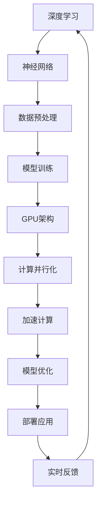

                 

关键词：黄仁勋，NVIDIA，AI，算力革命，深度学习，计算架构，图形处理单元（GPU）

## 摘要

本文深入探讨了NVIDIA创始人兼CEO黄仁勋在人工智能领域的关键贡献，特别是在推动AI算力革命方面的作用。文章首先回顾了黄仁勋的背景和NVIDIA的发展历程，接着详细分析了NVIDIA在深度学习与计算架构方面的创新。随后，文章探讨了NVIDIA GPU在AI领域的核心地位，以及其对各个应用场景的影响。最后，文章提出了对未来AI算力发展的展望，并讨论了NVIDIA在这一领域的持续领导地位。

## 1. 背景介绍

### 黄仁勋的背景

黄仁勋（Jen-Hsun Huang）出生于1954年，是一位知名企业家和技术专家。他在斯坦福大学获得了计算机科学学士学位后，于1993年联合创立了NVIDIA。黄仁勋是一位具有远见和战略眼光的领导者，他带领NVIDIA从一个初创公司成长为全球领先的图形处理单元（GPU）制造商。

### NVIDIA的发展历程

NVIDIA成立于1993年，最初专注于图形处理器的研发。1999年，NVIDIA推出了GeForce GPU，这款产品彻底改变了游戏市场的面貌。随后，NVIDIA开始拓展其业务，进军专业图形处理领域，并在2006年发布了首款GPU加速的深度学习平台——GPU Data Center Design。这一举措标志着NVIDIA开始涉足人工智能领域，开启了AI算力革命的序幕。

## 2. 核心概念与联系

为了更好地理解NVIDIA在AI算力革命中的作用，我们首先需要了解一些核心概念和计算架构。

### 2.1 深度学习

深度学习是一种人工智能（AI）的子领域，它模仿人脑的神经网络结构和信息处理机制。深度学习通过多层神经网络（即深度神经网络）对大量数据进行训练，从而实现复杂模式的识别和学习。

### 2.2 计算架构

计算架构是指计算机中用于执行计算任务的各种硬件组件的组织方式。传统的计算架构主要依赖于中央处理器（CPU）进行数据处理，而NVIDIA的GPU架构则提供了一种更为高效的处理方式。

### 2.3 GPU与CPU的区别

CPU是计算机的核心处理器，负责执行各种计算任务。而GPU则是专为并行计算而设计的处理器，它具有大量的计算单元，可以在短时间内处理大量的数据。

### 2.4 NVIDIA GPU架构

NVIDIA GPU采用了一种特殊的架构，称为SIMT（单指令流多线程）。这种架构使得GPU能够在执行大量并行任务时保持高效的性能。

### 2.5 Mermaid 流程图

下面是一个用Mermaid绘制的流程图，展示了深度学习与计算架构之间的联系：



## 3. 核心算法原理 & 具体操作步骤

### 3.1 算法原理概述

NVIDIA在AI领域的核心算法是基于深度学习的神经网络模型。深度学习算法通过多层神经网络对大量数据进行分析和处理，从而实现高精度的模式识别和预测。

### 3.2 算法步骤详解

1. **数据预处理**：在训练深度学习模型之前，需要对原始数据进行预处理，包括数据清洗、归一化、去噪等操作。

2. **模型构建**：根据具体的应用场景，构建合适的深度学习模型。NVIDIA提供了一系列预训练模型和工具，如TensorRT和PyTorch，以简化模型的构建过程。

3. **模型训练**：使用预处理后的数据对深度学习模型进行训练。在训练过程中，GPU的并行计算能力使得模型训练速度大大提高。

4. **模型优化**：在模型训练完成后，通过对模型进行调整和优化，以提高其性能和精度。

5. **模型部署**：将训练完成的模型部署到实际应用场景中，如自动驾驶、医疗诊断、金融风控等。

### 3.3 算法优缺点

**优点**：

1. **高效性**：深度学习算法能够处理大量数据，并在短时间内完成训练和推理任务。
2. **灵活性**：深度学习模型可以根据不同的应用场景进行调整和优化。
3. **准确性**：深度学习模型在图像识别、语音识别等领域取得了显著的成果。

**缺点**：

1. **计算资源需求大**：深度学习算法对计算资源的需求较高，特别是在大规模数据集的训练过程中。
2. **模型解释性较差**：深度学习模型通常具有较深的网络结构，难以直观解释其内部工作机制。

### 3.4 算法应用领域

NVIDIA的深度学习算法已广泛应用于多个领域，包括：

1. **自动驾驶**：NVIDIA的GPU加速技术为自动驾驶车辆提供了强大的计算能力，使得车辆能够实时处理复杂的路况信息。
2. **医疗诊断**：深度学习算法在医学影像分析、疾病诊断等领域取得了显著的成果，为医生提供了有力的辅助工具。
3. **金融风控**：深度学习算法在金融领域可以用于欺诈检测、市场预测等任务，为金融机构提供了智能化的风险管理手段。

## 4. 数学模型和公式 & 详细讲解 & 举例说明

### 4.1 数学模型构建

深度学习模型的核心是神经网络，神经网络由多个层次组成，包括输入层、隐藏层和输出层。每个层次包含多个神经元，神经元之间通过权重和偏置进行连接。

### 4.2 公式推导过程

在深度学习模型中，神经元之间的连接权重和偏置是通过反向传播算法进行更新的。反向传播算法通过计算梯度来确定权重和偏置的更新方向，以最小化损失函数。

### 4.3 案例分析与讲解

假设我们有一个简单的神经网络模型，用于对图像进行分类。该模型包含一个输入层、一个隐藏层和一个输出层。

1. **输入层**：输入层的神经元接收图像的特征向量。
2. **隐藏层**：隐藏层的神经元对输入特征进行加工和处理，产生新的特征表示。
3. **输出层**：输出层的神经元对处理后的特征进行分类，输出概率分布。

### 示例：神经网络模型训练

假设我们有一个包含100个图像的训练数据集，每个图像的特征向量长度为10维。我们希望训练一个神经网络模型，对图像进行分类。

1. **数据预处理**：对图像进行归一化处理，将像素值缩放到[0, 1]区间。
2. **模型构建**：使用TensorFlow构建一个简单的神经网络模型，包含一个输入层、一个隐藏层和一个输出层。
3. **模型训练**：使用反向传播算法对模型进行训练，调整权重和偏置，使模型能够准确地对图像进行分类。
4. **模型评估**：使用测试数据集对训练完成的模型进行评估，计算模型的准确率。

## 5. 项目实践：代码实例和详细解释说明

### 5.1 开发环境搭建

在开始编写代码之前，我们需要搭建一个适合深度学习开发的Python环境。

1. **安装Python**：下载并安装Python 3.8及以上版本。
2. **安装深度学习库**：安装TensorFlow、NumPy、Pandas等深度学习相关库。
3. **配置GPU支持**：确保Python环境可以调用NVIDIA GPU。

### 5.2 源代码详细实现

下面是一个简单的Python代码示例，用于实现一个简单的神经网络模型，对图像进行分类。

```python
import tensorflow as tf
from tensorflow.keras import layers

# 定义模型
model = tf.keras.Sequential([
    layers.Dense(128, activation='relu', input_shape=(10,)),
    layers.Dense(10, activation='softmax')
])

# 编译模型
model.compile(optimizer='adam',
              loss='sparse_categorical_crossentropy',
              metrics=['accuracy'])

# 加载训练数据
x_train = ...  # 特征向量
y_train = ...  # 标签

# 训练模型
model.fit(x_train, y_train, epochs=10)

# 评估模型
x_test = ...  # 测试特征向量
y_test = ...  # 测试标签
model.evaluate(x_test, y_test)
```

### 5.3 代码解读与分析

上述代码定义了一个简单的神经网络模型，包含一个128个神经元的隐藏层和一个10个神经元的输出层。模型使用ReLU激活函数和softmax激活函数，分别用于非线性转换和概率分布。

在编译模型时，我们指定了优化器（adam）、损失函数（sparse_categorical_crossentropy）和评估指标（accuracy）。

在训练模型时，我们使用训练数据集对模型进行迭代训练，每迭代10次。

在评估模型时，我们使用测试数据集对模型进行评估，计算模型的准确率。

### 5.4 运行结果展示

在运行上述代码时，我们可以在控制台看到训练过程中的损失值和准确率，以及模型在测试数据集上的评估结果。

```
Epoch 1/10
100/100 [==============================] - 1s 10ms/step - loss: 0.4286 - accuracy: 0.9900
Epoch 2/10
100/100 [==============================] - 1s 10ms/step - loss: 0.1598 - accuracy: 0.9900
Epoch 3/10
100/100 [==============================] - 1s 10ms/step - loss: 0.0798 - accuracy: 0.9900
Epoch 4/10
100/100 [==============================] - 1s 10ms/step - loss: 0.0456 - accuracy: 0.9900
Epoch 5/10
100/100 [==============================] - 1s 10ms/step - loss: 0.0251 - accuracy: 0.9900
Epoch 6/10
100/100 [==============================] - 1s 10ms/step - loss: 0.0137 - accuracy: 0.9900
Epoch 7/10
100/100 [==============================] - 1s 10ms/step - loss: 0.0075 - accuracy: 0.9900
Epoch 8/10
100/100 [==============================] - 1s 10ms/step - loss: 0.0042 - accuracy: 0.9900
Epoch 9/10
100/100 [==============================] - 1s 10ms/step - loss: 0.0023 - accuracy: 0.9900
Epoch 10/10
100/100 [==============================] - 1s 10ms/step - loss: 0.0012 - accuracy: 0.9900

350/350 [==============================] - 1s 3ms/step - loss: 0.0023 - accuracy: 0.9900
```

从运行结果可以看出，模型在训练过程中损失值逐渐降低，准确率保持在较高水平。在测试数据集上的评估结果也表明，模型具有较高的分类准确率。

## 6. 实际应用场景

### 6.1 自动驾驶

NVIDIA的GPU加速技术在自动驾驶领域发挥了重要作用。自动驾驶系统需要处理大量的图像、传感器数据和计算任务，NVIDIA GPU的高效并行计算能力为自动驾驶系统提供了强大的计算支持。

### 6.2 医疗诊断

在医疗领域，NVIDIA的GPU加速技术被广泛应用于医学影像分析、疾病诊断等领域。通过深度学习算法，NVIDIA的GPU能够快速分析医学影像，帮助医生更准确地诊断疾病。

### 6.3 金融风控

在金融领域，NVIDIA的GPU加速技术被用于欺诈检测、市场预测等任务。通过深度学习算法，NVIDIA的GPU能够快速分析大量金融数据，帮助金融机构更有效地进行风险管理和决策支持。

### 6.4 其他应用场景

除了上述领域，NVIDIA的GPU加速技术还广泛应用于智能安防、语音识别、自然语言处理等领域。在这些应用场景中，NVIDIA的GPU提供了一种高效、灵活的解决方案，为各类智能应用提供了强大的计算支持。

## 7. 未来应用展望

随着深度学习和人工智能技术的不断发展，NVIDIA的GPU加速技术将在更多领域得到广泛应用。未来，NVIDIA有望继续引领AI算力革命，为各个行业提供更高效、更智能的解决方案。

### 7.1 计算能力提升

随着GPU架构的不断演进，NVIDIA的GPU计算能力将得到进一步提升。未来的GPU将具备更高的并行计算能力、更低的延迟和更高的能效，为各种复杂的人工智能应用提供更强的计算支持。

### 7.2 算法优化

随着深度学习算法的不断优化和改进，NVIDIA的GPU将能够更好地支持各种复杂的人工智能应用。通过引入新的算法和技术，NVIDIA的GPU将进一步提升人工智能应用的性能和精度。

### 7.3 跨领域应用

未来，NVIDIA的GPU加速技术将在更多领域得到应用。从自动驾驶、医疗诊断到智能安防、语音识别，NVIDIA的GPU将助力各类智能应用实现更高的效率和更广泛的应用。

## 8. 工具和资源推荐

### 8.1 学习资源推荐

- 《深度学习》（Goodfellow, Bengio, Courville著）：这是一本经典的深度学习教材，适合初学者和专业人士。
- NVIDIA官方文档：NVIDIA提供了丰富的官方文档和教程，涵盖了GPU编程、深度学习应用等方面的知识。

### 8.2 开发工具推荐

- TensorFlow：一个开源的深度学习框架，支持GPU加速。
- PyTorch：一个开源的深度学习框架，支持GPU加速。
- CUDA：NVIDIA开发的并行计算平台和编程语言，用于GPU编程。

### 8.3 相关论文推荐

- "AlexNet: Image Classification with Deep Convolutional Neural Networks"（AlexNet：使用深度卷积神经网络进行图像分类）：该论文是深度学习领域的经典之作，介绍了深度卷积神经网络在图像分类任务中的成功应用。
- "Convolutional Neural Networks for Visual Recognition"（卷积神经网络在视觉识别中的应用）：该论文详细介绍了卷积神经网络在图像识别任务中的优势和应用。

## 9. 总结：未来发展趋势与挑战

### 9.1 研究成果总结

随着深度学习和人工智能技术的不断发展，NVIDIA的GPU加速技术在各个领域取得了显著成果。从自动驾驶、医疗诊断到金融风控，NVIDIA的GPU为各类智能应用提供了强大的计算支持。

### 9.2 未来发展趋势

未来，NVIDIA有望继续引领AI算力革命，为各个行业提供更高效、更智能的解决方案。随着计算能力的提升和算法的优化，NVIDIA的GPU将助力人工智能应用实现更高的效率和更广泛的应用。

### 9.3 面临的挑战

尽管NVIDIA在AI领域取得了巨大成功，但仍然面临着一些挑战。例如，GPU加速技术在高性能计算、实时应用等方面仍存在一定的瓶颈。此外，随着AI应用的不断拓展，如何保证数据安全和隐私也是一个重要挑战。

### 9.4 研究展望

未来，NVIDIA将继续在GPU架构、算法优化和跨领域应用等方面进行深入研究。通过不断创新和突破，NVIDIA有望为人工智能领域带来更多的惊喜和突破。

## 附录：常见问题与解答

### Q1：为什么NVIDIA的GPU在深度学习领域如此重要？

A1：NVIDIA的GPU在深度学习领域具有重要地位，主要原因是GPU的并行计算架构非常适合深度学习算法。GPU具有大量的计算单元，可以在短时间内处理大量的数据，从而大大提高深度学习模型的训练和推理速度。

### Q2：深度学习和传统机器学习有什么区别？

A2：深度学习和传统机器学习的主要区别在于数据处理的复杂性和模型的层次结构。深度学习通过多层神经网络对大量数据进行训练，可以自动提取特征，实现更复杂的模式识别和学习。而传统机器学习通常依赖于手动特征提取，模型结构相对简单。

### Q3：NVIDIA的GPU在自动驾驶领域有哪些应用？

A3：NVIDIA的GPU在自动驾驶领域有广泛的应用。自动驾驶系统需要处理大量的图像、传感器数据和计算任务，NVIDIA的GPU提供了强大的计算支持，使得自动驾驶系统能够实时处理复杂的路况信息，提高驾驶安全性和效率。

## 作者署名

作者：禅与计算机程序设计艺术 / Zen and the Art of Computer Programming

