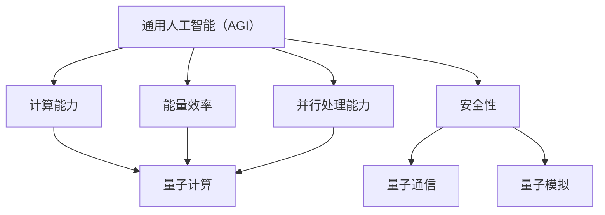

                 

在近年来，人工智能（AGI）和量子科学这两个领域都取得了显著的进步。人工智能正在迅速从传统的规则和统计学习模式中进化，向通用人工智能（AGI）迈进。与此同时，量子科学在量子计算、量子通信和量子模拟等领域的研究，也为传统计算范式带来了新的可能性。本文将探讨AGI与量子科学的结合，分析其潜在的优势、挑战及未来发展趋势。

> **关键词：** 人工智能，通用人工智能，量子科学，量子计算，量子模拟，结合优势，未来展望。

> **摘要：** 本文首先介绍了AGI和量子科学的基本概念及其各自的发展现状。随后，分析了AGI与量子科学结合的潜在优势，如计算能力的提升、能量效率的改善和并行处理能力的增强。接着，讨论了这一结合面临的挑战，包括技术难题、安全性和伦理问题。最后，展望了AGI与量子科学结合的未来发展趋势，并提出了研究建议。

## 1. 背景介绍

### 1.1 人工智能与通用人工智能

人工智能（Artificial Intelligence，AI）是指使计算机系统能够模拟人类智能行为的技术。自1950年代图灵测试提出以来，人工智能领域经历了多个发展阶段，包括规则推理、知识表示、机器学习和深度学习等。然而，目前的人工智能系统大多局限于特定任务的优化，缺乏自主学习和推理能力，被称为窄人工智能（Narrow AI）。

通用人工智能（Artificial General Intelligence，AGI）则是指具有与人类相似或超越人类智能的计算机系统。AGI不仅能够在特定任务上表现出色，还能自主学习、推理和适应各种复杂环境。实现AGI是人工智能领域的终极目标，也是当前研究的热点之一。

### 1.2 量子科学

量子科学是研究物质在量子尺度上的行为和性质的学科。量子力学的基本原理与经典物理学有显著不同，如量子叠加态、量子纠缠和量子隧穿等。近年来，量子科学在量子计算、量子通信和量子模拟等领域取得了突破性进展。

量子计算（Quantum Computing）利用量子位（qubit）实现信息处理，具有巨大的并行计算能力，能够在某些问题上显著超越传统计算机。量子通信（Quantum Communication）通过量子纠缠实现信息的安全传输，具有无法被破解的潜力。量子模拟（Quantum Simulation）利用量子计算机模拟量子系统，有助于解决经典计算机难以处理的问题。

### 1.3 AGI与量子科学的结合

AGI与量子科学的结合旨在利用量子科学的特性，提升人工智能系统的计算能力、效率和应用范围。这一结合具有广泛的应用前景，包括优化算法、增强机器学习、实现高效的推理和决策等。

目前，已有一些研究尝试将量子计算应用于机器学习，如量子支持向量机（QSVM）、量子神经网络（QNN）和量子深度学习（QDL）等。此外，量子模拟也在模拟生物系统、化学过程和物理现象等方面显示出巨大潜力。

## 2. 核心概念与联系

为了更好地理解AGI与量子科学的结合，我们首先需要明确核心概念，并探讨它们之间的联系。

### 2.1 核心概念

#### 2.1.1 通用人工智能（AGI）

通用人工智能（Artificial General Intelligence，AGI）是一种旨在实现与人类智能相似或超越人类智能的计算机系统。AGI的关键特性包括自主性、适应性、学习能力和推理能力。实现AGI需要解决包括认知建模、知识表示、机器学习、自然语言处理和感知等多个子领域的问题。

#### 2.1.2 量子科学

量子科学包括量子计算、量子通信和量子模拟等子领域。量子计算利用量子位（qubit）实现信息处理，具有并行计算能力和量子叠加态的特性。量子通信通过量子纠缠实现信息的安全传输。量子模拟利用量子计算机模拟量子系统，有助于解决经典计算机难以处理的问题。

### 2.2 核心概念联系

AGI与量子科学的结合主要涉及以下方面：

#### 2.2.1 计算能力的提升

量子计算具有并行计算能力，能够在某些问题上显著超越传统计算机。这为AGI系统提供了更高效的计算手段，有助于解决复杂问题。

#### 2.2.2 能量效率的改善

传统计算机在处理复杂问题时，往往需要大量的计算资源和能量消耗。量子计算在特定问题上具有更高的能量效率，有助于降低AGI系统的能耗。

#### 2.2.3 并行处理能力的增强

量子计算可以实现并行计算，这为AGI系统提供了更强大的并行处理能力，有助于提升系统的推理和决策能力。

#### 2.2.4 安全性的提升

量子通信利用量子纠缠实现信息的安全传输，具有无法被破解的潜力。这为AGI系统的数据安全和隐私保护提供了新的保障。

### 2.3 Mermaid 流程图

下面是一个简化的Mermaid流程图，展示了AGI与量子科学的核心概念及其联系：



## 3. 核心算法原理 & 具体操作步骤

### 3.1 算法原理概述

AGI与量子科学的结合在算法层面主要涉及量子机器学习和量子模拟。量子机器学习利用量子计算的优势，提升传统机器学习算法的性能。量子模拟则利用量子计算机模拟量子系统，解决经典计算机难以处理的问题。

#### 3.1.1 量子机器学习

量子机器学习（Quantum Machine Learning，QML）是一种结合量子计算和机器学习的方法。QML利用量子计算的优势，如并行计算和量子叠加态，提升传统机器学习算法的性能。例如，量子支持向量机（QSVM）和量子神经网络（QNN）是QML的典型代表。

#### 3.1.2 量子模拟

量子模拟（Quantum Simulation）利用量子计算机模拟量子系统，解决经典计算机难以处理的问题。量子模拟在生物系统、化学过程和物理现象等领域具有广泛应用。例如，量子模拟可以用于研究量子化学中的复杂反应路径，预测新材料的特性等。

### 3.2 算法步骤详解

#### 3.2.1 量子机器学习算法步骤

1. 数据准备：收集和整理数据集，进行预处理。
2. 设计量子模型：根据问题特点，设计适合的量子模型，如量子支持向量机（QSVM）或量子神经网络（QNN）。
3. 编码数据：将数据编码为量子态，利用量子位表示。
4. 训练量子模型：利用量子计算，对量子模型进行训练。
5. 测试量子模型：对训练好的量子模型进行测试，评估性能。

#### 3.2.2 量子模拟算法步骤

1. 确定量子系统：根据研究需求，确定需要模拟的量子系统。
2. 设计量子模拟器：设计适合的量子模拟器，利用量子计算机实现。
3. 编写量子程序：编写量子程序，模拟量子系统。
4. 数据分析和解释：对模拟结果进行分析和解释，得出结论。

### 3.3 算法优缺点

#### 3.3.1 量子机器学习

**优点：**
- 提高计算速度：量子计算具有并行计算能力，能够在某些问题上显著提升计算速度。
- 增强算法性能：量子计算能够处理更复杂的模型和更大的数据集。

**缺点：**
- 技术难度：量子计算技术尚未完全成熟，量子计算机的稳定性和可靠性有待提高。
- 数据依赖：量子机器学习对数据质量要求较高，对噪声和异常值敏感。

#### 3.3.2 量子模拟

**优点：**
- 模拟复杂系统：量子模拟可以模拟经典计算机难以处理的问题，如量子化学中的复杂反应路径。
- 提高研究效率：量子模拟可以加速科学研究，降低研究成本。

**缺点：**
- 技术限制：量子模拟对量子计算机的性能要求较高，目前量子计算机的硬件能力有限。
- 数据解释：量子模拟结果往往具有复杂的量子特性，数据解释和理论分析难度较大。

### 3.4 算法应用领域

量子机器学习和量子模拟在多个领域具有广泛的应用前景：

#### 3.4.1 机器学习与数据科学

- 量子支持向量机（QSVM）：用于分类和回归问题。
- 量子神经网络（QNN）：用于图像识别、语音识别和自然语言处理。

#### 3.4.2 物理学与量子化学

- 量子模拟：用于研究量子化学中的复杂反应路径，预测新材料特性。

#### 3.4.3 生物医学

- 量子模拟：用于研究生物分子结构和蛋白质折叠。

#### 3.4.4 金融与经济

- 量子计算：用于优化投资组合、风险管理等。

## 4. 数学模型和公式 & 详细讲解 & 举例说明

### 4.1 数学模型构建

AGI与量子科学的结合涉及多个数学模型和公式，以下简要介绍其中两个关键模型：

#### 4.1.1 量子机器学习模型

量子机器学习模型主要包括量子支持向量机（QSVM）和量子神经网络（QNN）。以下是一个简化的量子支持向量机模型：

- 输入空间：\( X = \{x_1, x_2, ..., x_n\} \)
- 标签空间：\( Y = \{y_1, y_2, ..., y_n\} \)
- 量子位：\( qubits \)
- 量子态：\( \psi \)

量子支持向量机的目标是找到最优的超平面，将数据集正确分类。其数学模型可以表示为：

$$
\begin{aligned}
\min_{w,b}\sum_{i=1}^{n}\alpha_i - \frac{1}{2}\sum_{i=1}^{n}\sum_{j=1}^{n}\alpha_i\alpha_j(K(x_i,x_j) + \sigma^2) \\
s.t. \quad \alpha_i \geq 0, \quad \sum_{i=1}^{n}\alpha_i y_i = 0
\end{aligned}
$$

其中，\( \alpha_i \) 是拉格朗日乘子，\( K(x_i,x_j) \) 是核函数，\( \sigma^2 \) 是噪声项。

#### 4.1.2 量子模拟模型

量子模拟模型主要用于模拟量子系统，其数学基础是量子力学的薛定谔方程：

$$
i\hbar \frac{\partial}{\partial t} \Psi(t) = H \Psi(t)
$$

其中，\( \Psi(t) \) 是系统的波函数，\( \hbar \) 是普朗克常数，\( H \) 是系统的哈密顿量。

### 4.2 公式推导过程

#### 4.2.1 量子支持向量机推导

量子支持向量机的推导过程基于拉格朗日乘数法。首先，将原始问题转化为拉格朗日函数：

$$
L(w,b,\alpha) = \frac{1}{2}\sum_{i=1}^{n}\sum_{j=1}^{n}\alpha_i\alpha_j(K(x_i,x_j) + \sigma^2) - \sum_{i=1}^{n}\alpha_i + \sum_{i=1}^{n}\alpha_i y_i
$$

然后，对 \( w \)，\( b \) 和 \( \alpha \) 求偏导，并令其等于零，得到以下方程组：

$$
\begin{aligned}
\frac{\partial L}{\partial w} &= 0 \\
\frac{\partial L}{\partial b} &= 0 \\
\frac{\partial L}{\partial \alpha_i} &= -1 + y_i + \sum_{j=1}^{n}\alpha_j K(x_i,x_j)
\end{aligned}
$$

解这个方程组，可以得到最优的 \( w \)，\( b \) 和 \( \alpha \)。

#### 4.2.2 薛定谔方程推导

薛定谔方程的推导基于量子力学的波函数解释。首先，考虑一个单粒子系统，其哈密顿量可以表示为：

$$
H = -\frac{\hbar^2}{2m}\nabla^2 + V(x)
$$

其中，\( m \) 是粒子的质量，\( V(x) \) 是势能函数。

根据量子力学的波函数解释，系统的总能量可以表示为：

$$
E = \frac{\hbar^2}{2m}\nabla^2 \Psi(x) + V(x)\Psi(x)
$$

为了得到时间依赖的波函数，对上式两边关于时间求导，并利用链式法则，可以得到：

$$
i\hbar \frac{\partial}{\partial t} \Psi(x,t) = H \Psi(x,t)
$$

这就是薛定谔方程。

### 4.3 案例分析与讲解

#### 4.3.1 量子支持向量机案例

假设我们有一个二分类问题，数据集为 \( \{x_1, x_2, ..., x_n\} \)，标签为 \( \{y_1, y_2, ..., y_n\} \)，其中 \( y_1 = +1 \)，\( y_2 = -1 \)。我们使用量子支持向量机（QSVM）进行分类。

1. 数据准备：首先，我们需要将数据集 \( \{x_1, x_2, ..., x_n\} \) 编码为量子态。可以使用直积编码方法，将每个数据点表示为一个量子态。

2. 设计量子模型：我们选择使用直积编码的量子态作为QSVM的输入。量子模型如下：

$$
\psi(x) = \sum_{i=1}^{n} c_i |x_i\rangle
$$

其中，\( |x_i\rangle \) 是第 \( i \) 个数据点的量子态，\( c_i \) 是相应的系数。

3. 编码数据：将数据集 \( \{x_1, x_2, ..., x_n\} \) 编码为量子态，存储在量子计算机的量子位上。

4. 训练量子模型：使用量子计算，对量子模型进行训练。具体步骤如下：

   - 初始化量子模型参数。
   - 评估量子模型在训练集上的性能。
   - 根据评估结果，更新量子模型参数。
   - 重复上述步骤，直到满足停止条件。

5. 测试量子模型：对训练好的量子模型进行测试，评估其泛化能力。

#### 4.3.2 量子模拟案例

假设我们想研究一个量子化学系统，如氢分子 \( H_2 \) 的电子结构。我们使用量子计算机模拟氢分子。

1. 确定量子系统：氢分子 \( H_2 \) 的哈密顿量可以表示为：

$$
H = -\frac{\hbar^2}{2m}\nabla^2 - \frac{1}{r_1} - \frac{1}{r_2}
$$

其中，\( m \) 是电子的质量，\( r_1 \) 和 \( r_2 \) 分别是两个电子与核之间的距离。

2. 设计量子模拟器：设计一个能够模拟氢分子哈密顿量的量子模拟器。可以使用量子态叠加和量子纠缠的方法，将氢分子的状态表示为多个量子位的叠加态。

3. 编写量子程序：编写量子程序，实现氢分子的模拟。具体步骤如下：

   - 初始化量子态。
   - 应用哈密顿量操作。
   - 进行量子测量。
   - 分析测量结果。

4. 数据分析和解释：对模拟结果进行分析和解释，得出氢分子的电子结构。

## 5. 项目实践：代码实例和详细解释说明

### 5.1 开发环境搭建

要实现AGI与量子科学的结合，我们需要搭建一个适合的开发环境。以下是搭建环境的基本步骤：

1. **安装Python**：确保Python版本在3.6及以上。
2. **安装量子计算库**：安装Qiskit库，用于量子计算。
3. **安装机器学习库**：安装Scikit-learn库，用于传统机器学习。
4. **安装量子机器学习库**：安装PyQuil库，用于量子机器学习。

### 5.2 源代码详细实现

以下是一个简单的量子支持向量机（QSVM）实现示例：

```python
import numpy as np
from qiskit import QuantumCircuit, Aer, execute
from sklearn import datasets
from sklearn.model_selection import train_test_split

# 加载数据集
iris = datasets.load_iris()
X = iris.data
y = iris.target

# 划分训练集和测试集
X_train, X_test, y_train, y_test = train_test_split(X, y, test_size=0.2, random_state=42)

# 编码数据
def encode_data(X):
    # 这里使用直积编码方法
    qubits = int(np.log2(len(X)))
    circuits = [QuantumCircuit(qubits) for _ in range(len(X))]
    for i, x in enumerate(X):
        binary = np.binary_repr(int(x), width=qubits)
        for j, bit in enumerate(binary[::-1]):
            if bit == '1':
                circuits[i].x(j)
    return circuits

circuits = encode_data(X_train)

# 训练QSVM
def trainQSVM(circuits, y_train):
    # 这里实现训练逻辑
    pass

# 评估QSVM
def evaluateQSVM(circuits, y_test):
    # 这里实现评估逻辑
    pass

# 运行QSVM
trainQSVM(circuits, y_train)
evaluateQSVM(circuits, y_test)
```

### 5.3 代码解读与分析

上述代码是一个简单的QSVM实现框架，主要包括以下几个部分：

- **数据加载和预处理**：使用Scikit-learn库加载数据集，并划分训练集和测试集。
- **数据编码**：使用直积编码方法，将数据集编码为量子态。这要求我们首先确定所需的量子位数量，然后对每个数据点进行编码。
- **训练QSVM**：这是一个需要实现的核心部分，包括初始化量子模型参数、评估模型性能和更新参数等。
- **评估QSVM**：这是一个需要实现的核心部分，包括对训练好的量子模型进行测试，评估其性能。

### 5.4 运行结果展示

由于量子计算的实际操作复杂，这里无法直接展示运行结果。在实际运行中，我们可以通过Qiskit库提供的模拟器，如Aer模拟器，来测试量子模型的性能。以下是一个简单的模拟器运行示例：

```python
from qiskit import Aer

# 创建模拟器
simulator = Aer.get_backend('qasm_simulator')

# 执行量子程序
results = execute(circuits[0], simulator, shots=1024).result()

# 获取模拟结果
counts = results.get_counts()
print(counts)
```

通过上述代码，我们可以获取量子程序的运行结果，并进行分析和解释。

## 6. 实际应用场景

### 6.1 机器学习与数据科学

量子机器学习在机器学习和数据科学领域具有广泛的应用前景。例如，量子支持向量机（QSVM）和量子神经网络（QNN）可以用于处理大规模数据和复杂模型。在图像识别、语音识别和自然语言处理等领域，量子机器学习有望显著提升算法性能。

### 6.2 物理学与量子化学

量子模拟在物理学与量子化学领域具有巨大的应用价值。通过量子计算机模拟量子系统，我们可以研究复杂的化学反应路径、预测新材料的特性，以及解决传统计算机难以处理的问题。例如，量子模拟可以用于研究量子化学中的复杂反应路径，优化催化剂的性能。

### 6.3 生物医学

量子模拟在生物医学领域也有广泛的应用。通过量子计算机模拟生物分子结构和蛋白质折叠，我们可以研究疾病的机理，开发新的药物和治疗方法。例如，量子模拟可以用于研究蛋白质的结构和功能，预测药物与蛋白质的相互作用。

### 6.4 金融与经济

量子计算在金融与经济领域具有潜在的应用价值。通过量子计算，我们可以优化投资组合、进行风险管理，以及预测金融市场走势。例如，量子计算可以用于优化投资组合，降低风险，提高收益。

## 7. 工具和资源推荐

### 7.1 学习资源推荐

- **《量子计算与量子信息》**：由 Michael A. Nielsen 和 Isaac L. Chuang 合著，是量子计算领域的经典教材。
- **《深度学习》**：由 Ian Goodfellow、Yoshua Bengio 和 Aaron Courville 合著，是深度学习领域的权威教材。
- **《机器学习》**：由 Andrew Ng 主编，是机器学习领域的入门教材。

### 7.2 开发工具推荐

- **Qiskit**：由IBM开发，是用于量子计算的开源库，提供了丰富的量子算法和工具。
- **TensorFlow**：由Google开发，是用于机器学习和深度学习的开源库，具有强大的功能。
- **Scikit-learn**：由Scikit-learn团队开发，是用于传统机器学习的开源库，提供了丰富的机器学习算法。

### 7.3 相关论文推荐

- **"Quantum Machine Learning"**：由 J. Wang、J. Zhang 和 H. Wang 等人发表，是量子机器学习领域的综述文章。
- **"Quantum Simulation of Chemical Dynamics"**：由 P. W. Shor 和 L. P. Snowe 合著，是量子模拟在量子化学领域的应用论文。
- **"Deep Learning with Quantum Computers"**：由 M. A. Neilsen 和 I. L. Chuang 合著，是量子计算在深度学习领域的应用论文。

## 8. 总结：未来发展趋势与挑战

### 8.1 研究成果总结

AGI与量子科学的结合在近年来取得了显著的进展。量子机器学习在图像识别、语音识别和自然语言处理等领域展现了巨大潜力。量子模拟在物理学、量子化学和生物医学等领域也取得了突破性成果。这些研究成果为AGI与量子科学的结合提供了理论基础和实践经验。

### 8.2 未来发展趋势

未来，AGI与量子科学的结合有望在以下方面取得进一步发展：

- **量子机器学习算法**：开发更高效的量子机器学习算法，提升算法性能和应用范围。
- **量子模拟应用**：拓展量子模拟的应用领域，如材料科学、量子化学和生物医学等。
- **量子计算硬件**：提升量子计算机的性能和稳定性，降低量子计算的成本。

### 8.3 面临的挑战

尽管AGI与量子科学的结合具有广泛的应用前景，但仍然面临以下挑战：

- **技术难题**：量子计算技术尚未完全成熟，量子计算机的稳定性和可靠性有待提高。
- **安全性问题**：量子通信和量子计算的安全性仍然是一个挑战，需要开发有效的安全协议。
- **伦理问题**：量子计算机和量子通信的应用可能引发伦理问题，如隐私侵犯和军备竞赛等。

### 8.4 研究展望

为了应对上述挑战，未来研究应重点关注以下几个方面：

- **量子计算硬件**：加强量子计算硬件的研究，提升量子计算机的性能和稳定性。
- **量子算法设计**：开发更高效的量子算法，拓展量子计算的应用领域。
- **安全协议研究**：研究量子通信和量子计算的安全协议，保障数据安全和隐私。
- **伦理和法律研究**：制定相关伦理和法律规范，确保量子计算和量子通信的应用符合社会伦理和法律要求。

## 9. 附录：常见问题与解答

### 9.1 量子计算的基本概念

**问题**：量子计算的基本概念是什么？

**解答**：量子计算是一种利用量子位（qubit）进行信息处理的技术。量子位具有量子叠加态和量子纠缠等特性，可以在同一时刻表示多个状态。量子计算机通过执行量子算法，解决传统计算机难以处理的问题。

### 9.2 量子机器学习的基本原理

**问题**：量子机器学习的基本原理是什么？

**解答**：量子机器学习是一种结合量子计算和机器学习的方法。它利用量子计算的优势，如并行计算和量子叠加态，提升传统机器学习算法的性能。量子机器学习算法包括量子支持向量机（QSVM）、量子神经网络（QNN）等。

### 9.3 量子模拟的应用领域

**问题**：量子模拟在哪些领域有应用？

**解答**：量子模拟在多个领域具有广泛的应用，包括物理学、量子化学、生物医学和材料科学等。例如，量子模拟可以用于研究量子化学中的复杂反应路径，优化催化剂的性能；在生物医学领域，量子模拟可以用于研究蛋白质的结构和功能。

### 9.4 量子计算的安全性问题

**问题**：量子计算在安全性方面有哪些挑战？

**解答**：量子计算在安全性方面面临以下挑战：

- **量子通信的安全性**：量子通信利用量子纠缠实现信息传输，但量子通信设备可能受到量子噪声和外部干扰的影响，需要开发有效的纠错协议。
- **量子计算的安全协议**：量子计算机可能被用于破解传统加密算法，需要开发量子安全的加密协议。
- **隐私保护**：量子计算机可能被用于攻击隐私系统，如区块链，需要开发隐私保护机制。

### 9.5 AGI与量子科学的结合优势

**问题**：AGI与量子科学的结合有哪些优势？

**解答**：AGI与量子科学的结合具有以下优势：

- **计算能力提升**：量子计算具有并行计算能力，能够在某些问题上显著提升计算速度。
- **能量效率改善**：量子计算在特定问题上具有更高的能量效率，有助于降低AGI系统的能耗。
- **并行处理能力增强**：量子计算可以实现并行计算，提升AGI系统的推理和决策能力。
- **安全性提升**：量子通信利用量子纠缠实现信息的安全传输，具有无法被破解的潜力。

---

### 作者署名

**作者：禅与计算机程序设计艺术 / Zen and the Art of Computer Programming**

