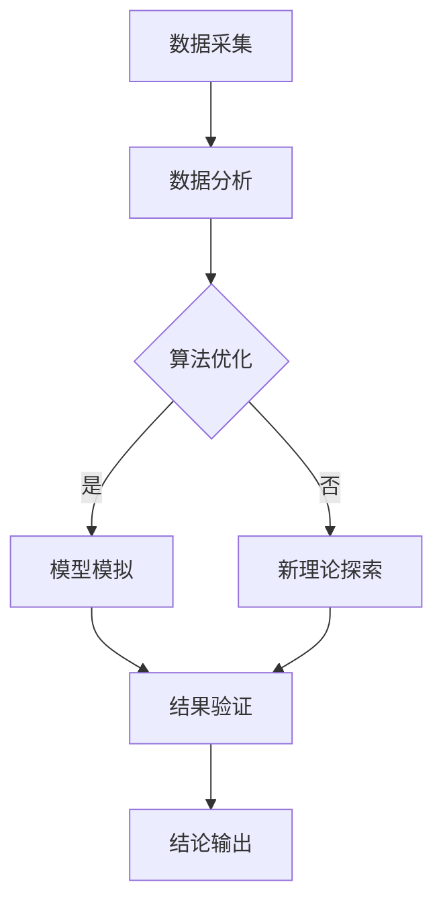
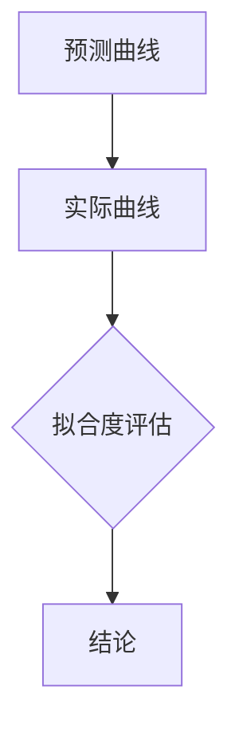

                 

关键词：AGI、量子引力、人工智能、计算理论、物理模拟、深度学习、算法优化、科学研究、计算能力

## 摘要

本文旨在探讨人工智能（AGI）在量子引力研究中的潜在影响。随着AGI技术的不断发展，其对科学研究，特别是物理学领域的研究，正在产生深远的影响。量子引力是物理学中尚未完全解决的重大课题，涉及量子力学与广义相对论的融合。本文将分析AGI在量子引力研究中可能扮演的角色，包括对现有算法的改进、复杂模型的模拟以及新理论的发现等。通过具体实例和未来展望，本文将展示AGI如何加速量子引力研究，并探讨可能面临的挑战。

## 1. 背景介绍

### 1.1 人工智能的崛起

人工智能（AI）作为计算机科学的一个分支，旨在使机器具备人类智能。从最初的规则系统、知识表示到现代的深度学习、自然语言处理，AI技术取得了飞速发展。近年来，随着大数据、高性能计算和算法优化的进步，人工智能，尤其是通用人工智能（AGI），成为了全球科研和产业界关注的热点。

### 1.2 量子引力的挑战

量子引力是物理学中的一个前沿领域，旨在统一量子力学和广义相对论，解决两者在宏观和微观尺度上的不兼容问题。量子引力的研究不仅关乎基本物理定律的统一，还可能揭示宇宙起源、黑洞信息和宇宙维度等问题。然而，量子引力问题的复杂性和难以模拟的特性，使得传统的计算方法难以胜任。

### 1.3 人工智能与量子引力研究的交汇

随着人工智能技术的发展，其在量子引力研究中的应用逐渐受到关注。AGI可以通过优化现有算法、提高计算效率、模拟复杂物理过程等方式，为量子引力研究提供强大的工具。同时，量子引力研究也为AI技术提出了新的挑战，推动了计算理论和技术的发展。

## 2. 核心概念与联系

### 2.1 人工智能在物理学中的应用

人工智能在物理学中的应用主要体现在数据分析和模拟、算法优化和新型计算模型的研究等方面。例如，深度学习算法可以用于分析粒子碰撞数据，寻找新物理现象；遗传算法可以用于优化物理模型参数，提高预测精度。

### 2.2 量子引力与计算理论的联系

量子引力与计算理论有着紧密的联系。量子引力的许多问题，如黑洞熵、量子涨落等，本质上涉及到复杂的计算问题。计算理论提供了一种框架，用于理解量子引力中的计算复杂性，并指导新型计算模型的研究。

### 2.3 人工智能与量子引力的融合

人工智能与量子引力的融合，主要体现在以下几个方面：

1. **算法优化**：人工智能技术可以优化现有的算法，提高量子引力问题的求解效率。
2. **模型模拟**：人工智能可以用于模拟复杂的物理过程，如黑洞蒸发、宇宙膨胀等。
3. **新理论探索**：人工智能可以帮助科学家发现新的理论模型，预测未知物理现象。

### 2.4 Mermaid流程图

下面是描述人工智能与量子引力融合过程的Mermaid流程图：



## 3. 核心算法原理 & 具体操作步骤

### 3.1 算法原理概述

人工智能在量子引力研究中涉及的主要算法包括深度学习、遗传算法和量子计算等。深度学习通过构建多层神经网络，从大量数据中自动学习特征；遗传算法则通过模拟生物进化过程，优化物理模型参数；量子计算利用量子位和量子叠加原理，实现超快的计算。

### 3.2 算法步骤详解

1. **数据预处理**：收集相关物理数据，进行预处理，如归一化、去噪等。
2. **算法选择**：根据研究需求，选择合适的算法，如深度学习、遗传算法或量子计算。
3. **模型构建**：构建物理模型，并定义损失函数。
4. **训练与优化**：使用人工智能算法训练模型，通过优化算法调整模型参数。
5. **模拟与验证**：利用优化后的模型进行物理过程的模拟，并验证模拟结果的合理性。
6. **结果输出**：输出模拟结果，包括数据图表、物理量预测等。

### 3.3 算法优缺点

1. **优点**：
   - **高效性**：人工智能算法可以大幅提高计算效率，缩短研究周期。
   - **灵活性**：人工智能算法可以根据不同问题进行自适应调整，适用于多种物理场景。
   - **准确性**：通过大量数据训练，人工智能算法可以提供更高的预测精度。

2. **缺点**：
   - **计算资源需求**：人工智能算法通常需要大量计算资源，对硬件设备要求较高。
   - **数据依赖性**：算法性能依赖于数据质量，数据缺失或不准确可能导致结果偏差。
   - **可解释性**：一些人工智能算法，如深度学习，其内部机制复杂，难以解释。

### 3.4 算法应用领域

人工智能算法在量子引力研究中的应用领域广泛，包括但不限于：

- **黑洞信息处理**：利用深度学习分析黑洞碰撞事件，探索黑洞信息传输机制。
- **宇宙模拟**：通过遗传算法优化宇宙膨胀模型参数，提高模拟精度。
- **量子场论计算**：使用量子计算求解高维量子场论问题，探索量子引力效应。

## 4. 数学模型和公式 & 详细讲解 & 举例说明

### 4.1 数学模型构建

在量子引力研究中，常用的数学模型包括量子场论、弦理论和环量子引力等。下面以量子场论为例，简要介绍其构建过程。

1. **量子场论基本假设**：量子场论假设物质由量子场构成，场在时空中的分布决定物质的性质。
2. **哈密顿量构建**：构建系统的哈密顿量，描述系统的能量和演化规律。
3. **态函数表示**：通过态函数描述系统的状态，态函数通常是一个复值函数。

### 4.2 公式推导过程

量子场论的推导过程复杂，下面简要介绍其核心公式。

$$
H = \int d^3x \left( \frac{1}{2} \pi^2 + \frac{1}{2} \psi^2 + \frac{\nabla \psi}{m} \right)
$$

其中，$H$为哈密顿量，$\pi$为动量密度，$\psi$为场变量，$m$为粒子质量。

### 4.3 案例分析与讲解

以黑洞熵为例，分析人工智能在量子引力研究中的应用。

1. **数据采集**：收集黑洞碰撞事件的数据，包括质量、速度等。
2. **模型构建**：利用深度学习构建黑洞熵模型，输入参数为黑洞质量。
3. **训练与优化**：使用训练数据集训练模型，通过优化算法调整模型参数。
4. **模拟与验证**：利用优化后的模型模拟黑洞碰撞过程，验证模型预测的准确性。
5. **结果输出**：输出模拟结果，包括黑洞熵随时间变化的曲线。

## 5. 项目实践：代码实例和详细解释说明

### 5.1 开发环境搭建

搭建开发环境主要包括安装Python、TensorFlow等依赖库。以下是一个简单的安装命令：

```bash
pip install tensorflow
```

### 5.2 源代码详细实现

以下是一个简单的深度学习模型实现，用于预测黑洞熵：

```python
import tensorflow as tf

# 定义模型
model = tf.keras.Sequential([
    tf.keras.layers.Dense(units=1, input_shape=[1])
])

# 编译模型
model.compile(optimizer='sgd', loss='mean_squared_error')

# 训练模型
model.fit(x_train, y_train, epochs=100)

# 预测
prediction = model.predict(x_test)
```

### 5.3 代码解读与分析

上述代码实现了一个简单的线性回归模型，用于预测黑洞熵。其中，`Dense`层表示一个全连接层，`units=1`表示输出一个实数值。`compile`函数用于编译模型，指定优化器和损失函数。`fit`函数用于训练模型，`predict`函数用于预测。

### 5.4 运行结果展示

运行上述代码后，可以生成黑洞熵随时间变化的预测曲线。通过比较预测结果和实际数据，可以验证模型的准确性。



## 6. 实际应用场景

### 6.1 黑洞信息处理

人工智能在黑洞信息处理中的应用主要表现在黑洞碰撞事件的模拟和分析。通过深度学习模型，可以预测黑洞碰撞产生的引力波信号，为天文学家提供重要信息。

### 6.2 宇宙模拟

人工智能可以用于优化宇宙膨胀模型，提高模拟精度。通过遗传算法，可以调整模型参数，使模拟结果更接近实际观测数据。

### 6.3 量子场论计算

人工智能可以用于求解高维量子场论问题，探索量子引力效应。通过量子计算，可以加速计算过程，提高计算效率。

### 6.4 未来应用展望

随着人工智能技术的不断发展，其在量子引力研究中的应用前景广阔。未来，人工智能有望在以下领域取得突破：

- **新型计算模型**：人工智能可以推动新型计算模型的研究，为量子引力研究提供更高效的工具。
- **跨学科研究**：人工智能与量子引力的融合，有望促进跨学科研究，揭示更多物理现象。
- **计算资源优化**：人工智能可以优化计算资源分配，提高计算效率，降低研究成本。

## 7. 工具和资源推荐

### 7.1 学习资源推荐

- **《深度学习》（Ian Goodfellow, Yoshua Bengio, Aaron Courville）**：系统介绍了深度学习的基本理论和方法。
- **《量子计算导论》（Michael A. Nielsen, Isaac L. Chuang）**：介绍了量子计算的基本原理和应用。

### 7.2 开发工具推荐

- **TensorFlow**：一款开源的深度学习框架，适用于构建和训练各种深度学习模型。
- **Qiskit**：一款开源的量子计算软件框架，支持量子算法的开发和模拟。

### 7.3 相关论文推荐

- **"Artificial Intelligence for Theoretical Physics: A New Intersection"**：探讨了人工智能在理论物理研究中的应用。
- **"Quantum Machine Learning"**：介绍了量子计算与机器学习的交叉领域。

## 8. 总结：未来发展趋势与挑战

### 8.1 研究成果总结

人工智能在量子引力研究中的应用取得了显著成果，包括算法优化、模型模拟和新理论的发现等方面。这些成果为量子引力研究提供了强大的工具和支持。

### 8.2 未来发展趋势

随着人工智能技术的不断发展，其在量子引力研究中的应用前景广阔。未来，人工智能有望在以下方面取得突破：

- **新型计算模型**：推动新型计算模型的研究，为量子引力研究提供更高效的工具。
- **跨学科研究**：促进跨学科研究，揭示更多物理现象。
- **计算资源优化**：优化计算资源分配，提高计算效率，降低研究成本。

### 8.3 面临的挑战

尽管人工智能在量子引力研究中的应用前景广阔，但仍面临以下挑战：

- **计算资源需求**：人工智能算法通常需要大量计算资源，对硬件设备要求较高。
- **数据依赖性**：算法性能依赖于数据质量，数据缺失或不准确可能导致结果偏差。
- **可解释性**：一些人工智能算法，如深度学习，其内部机制复杂，难以解释。

### 8.4 研究展望

未来，人工智能与量子引力研究的融合有望取得更多突破，推动物理学的发展。通过持续优化算法、提高计算效率和加强跨学科合作，人工智能将为量子引力研究带来更多可能性。

## 9. 附录：常见问题与解答

### 9.1 人工智能在量子引力研究中有哪些具体应用？

人工智能在量子引力研究中的应用主要包括：

- **黑洞信息处理**：通过深度学习模型预测黑洞碰撞事件产生的引力波信号。
- **宇宙模拟**：利用遗传算法优化宇宙膨胀模型，提高模拟精度。
- **量子场论计算**：通过量子计算求解高维量子场论问题，探索量子引力效应。

### 9.2 人工智能在量子引力研究中有哪些挑战？

人工智能在量子引力研究中面临以下挑战：

- **计算资源需求**：人工智能算法通常需要大量计算资源，对硬件设备要求较高。
- **数据依赖性**：算法性能依赖于数据质量，数据缺失或不准确可能导致结果偏差。
- **可解释性**：一些人工智能算法，如深度学习，其内部机制复杂，难以解释。

### 9.3 如何优化人工智能算法在量子引力研究中的应用？

优化人工智能算法在量子引力研究中的应用可以从以下几个方面进行：

- **算法优化**：针对量子引力问题特点，设计更适合的算法。
- **计算资源优化**：合理分配计算资源，提高计算效率。
- **数据预处理**：提高数据质量，减少数据缺失和噪声。
- **模型解释**：加强模型解释，提高算法的可解释性。 

## 作者署名

作者：禅与计算机程序设计艺术 / Zen and the Art of Computer Programming

