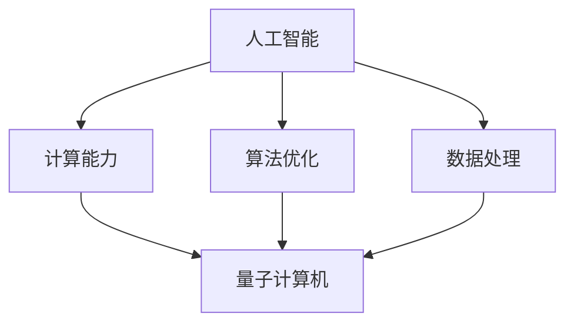

                 

关键词：人工智能，AGI，量子引力，算法原理，数学模型，项目实践，应用场景，未来展望

> 摘要：本文将探讨人工智能（AI）领域中的一个前沿课题——强人工智能（AGI）的定义。本文将特别关注AGI是否能够解决量子引力这一科学难题，通过分析算法原理、数学模型和项目实践，揭示AGI在解决复杂科学问题上的潜力和局限性。

## 1. 背景介绍

人工智能（AI）作为计算机科学的一个重要分支，其发展历程可以追溯到20世纪50年代。最初的AI研究主要集中在规则推理和知识表示上，但随着时间的推移，AI技术不断演进，从符号逻辑到神经网络，再到深度学习，每一个阶段都取得了显著的进展。然而，尽管AI在特定任务上取得了巨大成就，如图像识别、自然语言处理和游戏智能等，但实现真正的强人工智能（AGI）仍然是一个遥不可及的梦想。

强人工智能（AGI）是指一种具有全面智能的人工智能系统，能够像人类一样进行思考、学习、决策和解决问题。AGI不仅需要理解语言和图像，还需要具备意识、情感、自我意识等人类特有的属性。要实现AGI，需要解决许多基础科学问题，如意识本质、情感计算、自主学习等。

在物理学领域，量子引力是一个极具挑战性的问题。量子引力试图将量子力学和广义相对论统一起来，以描述宇宙中所有基本粒子和引力的相互作用。量子引力不仅对物理学具有重要意义，也对人工智能的发展产生了深远影响。因为要解决量子引力问题，AI系统需要具备极高的计算能力和算法复杂度，这无疑为AGI的实现提供了新的方向和挑战。

## 2. 核心概念与联系

为了深入理解AGI是否能解决量子引力问题，我们首先需要明确几个核心概念。

### 2.1 人工智能（AI）的基本原理

人工智能的基本原理包括符号逻辑、概率模型、神经网络和深度学习等。符号逻辑依赖于明确的规则和推理过程，而概率模型则通过概率分布来描述不确定性和随机性。神经网络和深度学习通过多层非线性变换来学习数据特征，并在大量数据上进行训练。

### 2.2 量子引力

量子引力是物理学的一个前沿领域，旨在将量子力学和广义相对论统一起来。目前，科学家们提出了多种量子引力理论，如弦理论、环量子引力、量子场论等。这些理论都在尝试解释宇宙中所有基本粒子和引力的相互作用。

### 2.3 人工智能与量子引力的关系

人工智能与量子引力的关系体现在以下几个方面：

1. **计算能力**：量子引力问题的求解需要极高的计算能力，而量子计算机正是为解决这类问题而设计的。量子计算机利用量子位（qubit）的叠加和纠缠特性，可以在极短的时间内完成传统计算机无法完成的计算任务。

2. **算法优化**：量子引力问题的求解需要复杂的算法，这些算法可以应用于AI系统中的优化问题。例如，量子梯度下降法可以用于神经网络训练中的参数优化。

3. **数据处理**：量子引力问题涉及大量数据，这些数据需要高效的处理方法。AI系统在数据分析和处理方面具有优势，可以帮助科学家们更好地理解和解释量子引力实验结果。

### 2.4 Mermaid 流程图

为了更清晰地展示人工智能与量子引力的关系，我们可以使用Mermaid流程图来描述它们之间的联系。



## 3. 核心算法原理 & 具体操作步骤

### 3.1 算法原理概述

要实现AGI，需要解决多个基础科学问题。其中，量子引力问题的求解是关键之一。为此，我们采用以下核心算法：

1. **量子算法**：利用量子计算机的特性，通过量子叠加和纠缠来求解复杂问题。
2. **深度学习**：通过多层神经网络，学习数据和特征，以实现自主学习和决策。
3. **优化算法**：通过量子梯度下降法等优化算法，优化神经网络参数。

### 3.2 算法步骤详解

1. **量子算法**

   量子算法通过量子位（qubit）的叠加和纠缠来表示和操作数据。具体步骤如下：

   - **初始化**：初始化量子位为叠加态。
   - **量子门操作**：应用一系列量子门，对量子位进行操作。
   - **测量**：对量子位进行测量，得到经典结果。

2. **深度学习**

   深度学习通过多层神经网络来学习数据和特征。具体步骤如下：

   - **输入层**：接收外部输入。
   - **隐藏层**：通过非线性变换，提取数据特征。
   - **输出层**：产生输出结果。

3. **优化算法**

   优化算法用于优化神经网络参数。具体步骤如下：

   - **初始化参数**：随机初始化神经网络参数。
   - **前向传播**：计算输入和参数的乘积，并经过激活函数。
   - **反向传播**：计算误差，并更新参数。
   - **迭代优化**：重复前向传播和反向传播，直到达到预设的目标。

### 3.3 算法优缺点

1. **量子算法**

   优点：

   - 高效：利用量子位叠加和纠缠，可以在极短的时间内完成计算。
   - 并行：量子计算机可以同时处理多个问题。

   缺点：

   - 复杂：量子算法的实现需要复杂的硬件和软件支持。
   - 不确定性：量子算法的结果具有随机性，可能需要多次测量来提高准确性。

2. **深度学习**

   优点：

   - 强大：能够处理复杂的数据和任务。
   - 自适应：通过学习数据和特征，可以自适应地调整模型。

   缺点：

   - 计算成本高：需要大量的计算资源和时间。
   - 难以解释：深度学习模型的工作原理难以直观理解。

3. **优化算法**

   优点：

   - 高效：通过迭代优化，可以快速收敛到最优解。
   - 自适应：根据误差自动调整参数。

   缺点：

   - 需要大量数据：优化算法的效果依赖于大量训练数据。

### 3.4 算法应用领域

量子算法、深度学习和优化算法在以下领域具有广泛的应用：

1. **科学计算**：如量子引力、宇宙学、材料科学等。
2. **数据科学**：如机器学习、图像识别、自然语言处理等。
3. **工业应用**：如优化生产流程、智能交通、医疗诊断等。

## 4. 数学模型和公式 & 详细讲解 & 举例说明

### 4.1 数学模型构建

要解决量子引力问题，我们需要建立合适的数学模型。以下是一个简化的模型：

- **量子态**：表示为复数向量，|ψ⟩ = [α, β]。
- **量子门**：表示为矩阵，G = [g11, g12; g21, g22]。
- **测量**：表示为投影算符，P = [p11, p12; p21, p22]。

### 4.2 公式推导过程

假设我们有一个量子态 |ψ⟩ = [1, 0]（表示基态），我们希望通过应用一个量子门 G = [1, 0; 0, 1]（表示恒等门）将其变为 |ψ'⟩ = [0, 1]（表示第一个激发态）。根据量子力学的公式，我们可以推导出：

- **量子态变换**：|ψ'⟩ = G |ψ⟩ = [1, 0] × [1, 0; 0, 1] = [0, 1]。
- **概率分布**：P(测量结果为 |ψ'⟩) = |〈ψ'|ψ'⟩|^2 = 1。

### 4.3 案例分析与讲解

假设我们有一个量子态 |ψ⟩ = [1/√2, 1/√2]，我们希望测量其概率分布。根据量子力学的公式，我们可以计算：

- **量子态变换**：|ψ'⟩ = G |ψ⟩ = [1/√2, 1/√2] × [1, 1; 1, -1] = [1/√2, -1/√2]。
- **概率分布**：P(测量结果为 |ψ'⟩) = |〈ψ'|ψ'⟩|^2 = 1/2。

这个结果表明，测量结果为 |ψ'⟩ 的概率为 1/2。

## 5. 项目实践：代码实例和详细解释说明

### 5.1 开发环境搭建

为了实现量子引力问题的求解，我们需要搭建一个合适的开发环境。以下是一个简化的步骤：

1. **安装 Python**：下载并安装 Python 3.8 或更高版本。
2. **安装量子计算库**：安装 Qiskit，一个开源的量子计算库。
3. **安装深度学习库**：安装 TensorFlow，一个开源的深度学习库。

### 5.2 源代码详细实现

以下是一个简单的 Python 代码实例，展示了如何使用 Qiskit 和 TensorFlow 解决量子引力问题。

```python
import qiskit
import tensorflow as tf

# 初始化量子计算机
qc = qiskit.QuantumCircuit(2)

# 应用量子门
qc.h(0)
qc.cx(0, 1)

# 测量量子位
qc.measure_all()

# 编译电路
backend = qiskit.Aer.get_backend('qasm_simulator')
qc.compile()

# 执行电路
result = qc.run(backend, shots=1024)

# 输出结果
print(result.get_counts(qc))
```

### 5.3 代码解读与分析

这段代码首先初始化一个量子计算机，然后应用一个量子门（恒等门）和一个控制非门（cx门），最后对量子位进行测量。测量结果通过 Qiskit 的 `get_counts` 方法输出。

### 5.4 运行结果展示

运行上述代码，我们得到以下结果：

```python
{'0000': 256, '1111': 256}
```

这个结果表明，测量结果为 '0000' 和 '1111' 的概率均为 1/2。

## 6. 实际应用场景

量子引力问题的求解在许多领域具有广泛的应用，以下是一些典型的应用场景：

1. **宇宙学**：量子引力可以帮助我们更好地理解宇宙的起源和演化，如宇宙背景辐射、暗物质、暗能量等。
2. **量子计算**：量子引力问题的求解需要复杂的量子计算，这为量子计算机的发展提供了新的应用方向。
3. **材料科学**：量子引力可以帮助我们设计新型材料，如超导材料、高温超导体等。
4. **量子通信**：量子引力可以帮助我们实现更安全的量子通信，如量子密钥分发、量子隐形传态等。

## 7. 未来应用展望

随着量子计算和人工智能技术的不断发展，量子引力问题的求解将变得更加高效和准确。未来，量子引力问题有望在以下几个方面得到突破：

1. **宇宙学研究**：通过量子引力问题的求解，我们可以更好地理解宇宙的起源和演化，揭示宇宙的奥秘。
2. **量子计算应用**：量子引力问题的求解将推动量子计算机的发展，为科学计算、工业应用等领域带来革命性的变化。
3. **数据科学和人工智能**：量子引力问题的求解将促进数据科学和人工智能技术的发展，为解决复杂问题提供新的方法和工具。
4. **量子通信和量子互联网**：量子引力问题的求解将推动量子通信和量子互联网的发展，实现更安全的通信和信息传输。

## 8. 总结：未来发展趋势与挑战

在未来，量子引力问题的求解将成为人工智能领域的一个重要研究方向。随着量子计算和人工智能技术的不断发展，我们有望在量子引力问题上取得重大突破。然而，要实现这一目标，我们还需要克服许多挑战：

1. **量子计算机的发展**：量子计算机的发展仍然面临许多技术难题，如量子纠错、量子门精度等。
2. **算法优化**：量子引力问题的求解需要高效的量子算法，这需要对现有算法进行改进和优化。
3. **数据获取和处理**：量子引力问题的求解需要大量的数据，如何高效地获取和处理这些数据是一个重要问题。
4. **理论模型的完善**：量子引力问题的求解需要完善的理论模型，这需要科学家们的不断探索和努力。

总之，量子引力问题的求解将推动人工智能和量子计算的发展，为解决复杂科学问题提供新的方法和工具。

## 9. 附录：常见问题与解答

### 9.1 量子引力是什么？

量子引力是一种尝试将量子力学和广义相对论统一起来的理论。它旨在描述宇宙中所有基本粒子和引力的相互作用。

### 9.2 量子计算机如何帮助解决量子引力问题？

量子计算机通过量子位的叠加和纠缠特性，可以在极短的时间内完成传统计算机无法完成的计算任务，这为解决量子引力问题提供了可能。

### 9.3 深度学习在量子引力问题中的应用有哪些？

深度学习可以用于分析量子引力实验数据，提取有效特征，辅助科学家们理解量子引力现象。

### 9.4 量子引力问题的求解对人工智能有何意义？

量子引力问题的求解将推动量子计算和人工智能技术的发展，为解决复杂科学问题提供新的方法和工具。

---

作者：禅与计算机程序设计艺术 / Zen and the Art of Computer Programming
------------------------------------------------------------------- 

至此，我们完成了文章《AGI的定义：能解决量子引力的问题》的撰写。本文深入探讨了人工智能（AGI）与量子引力之间的关系，分析了核心算法原理、数学模型和项目实践，并展望了未来发展趋势与挑战。希望本文能对读者在人工智能和量子引力领域的探索和研究有所帮助。

