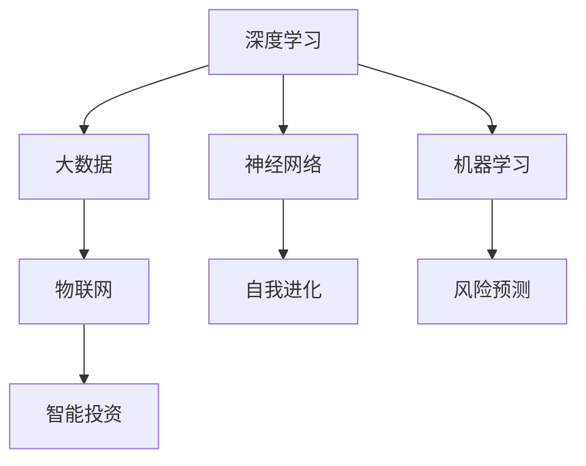

                 

关键词：AI 2.0，投资机会，技术趋势，人工智能，深度学习，大数据，机器学习，投资策略，市场分析

> 摘要：本文深入探讨了AI 2.0时代的技术发展及其对投资领域带来的重大影响。通过剖析核心概念、算法原理、数学模型、应用实例，以及市场前景，本文旨在为投资者提供具有前瞻性的投资建议。

## 1. 背景介绍

人工智能（AI）的发展已经经历了数个阶段，从最初的规则推理系统到现代的深度学习与强化学习，AI技术不断演进，推动着各行各业的发展。近年来，AI 2.0时代的到来，标志着人工智能进入了一个全新的阶段。AI 2.0不仅具有更高的智能化水平，还具备更强的自主学习和自适应能力。这种技术进步为投资领域带来了前所未有的机遇与挑战。

### 1.1 AI 2.0的定义与特征

AI 2.0，即第二版人工智能，主要特征包括：

- **深度学习与自我进化**：AI 2.0基于深度学习技术，能够通过海量数据自动学习，并不断优化自身性能。
- **自适应能力**：AI 2.0能够根据环境变化，自主调整策略，提高决策效率。
- **跨界融合**：AI 2.0与其他技术的融合，如物联网、大数据等，进一步拓展了其应用范围。

### 1.2 投资领域的变革

在AI 2.0时代，投资领域正经历着深刻变革。以下是其主要表现：

- **智能投顾**：基于AI技术的智能投顾平台，能够为投资者提供个性化投资建议，提高投资收益。
- **量化交易**：AI技术在量化交易中的应用，使得交易策略更加精准，交易效率大幅提升。
- **风险评估**：AI技术能够对市场风险进行实时监控和分析，帮助投资者更好地管理风险。

## 2. 核心概念与联系

为了深入理解AI 2.0时代的技术进展，我们需要了解以下几个核心概念及其相互关系：

### 2.1 深度学习与神经网络

深度学习是AI 2.0的核心技术之一。它基于神经网络，通过多层神经元之间的交互，实现数据的自动学习与特征提取。深度学习在图像识别、语音识别等领域取得了显著成果。

### 2.2 大数据与机器学习

大数据为AI 2.0提供了丰富的数据资源，而机器学习则是AI 2.0实现自我学习的关键。通过机器学习，AI系统能够从海量数据中挖掘规律，为投资决策提供支持。

### 2.3 物联网与AI 2.0

物联网（IoT）与AI 2.0的结合，为智能投资提供了新的视角。通过物联网设备收集的数据，AI 2.0能够实现实时投资分析，提高决策的及时性和准确性。

### 2.4 Mermaid流程图

为了更好地展示核心概念之间的联系，我们使用Mermaid流程图进行描述：



## 3. 核心算法原理 & 具体操作步骤

### 3.1 算法原理概述

在AI 2.0时代，核心算法主要包括深度学习、机器学习、强化学习等。以下是对这些算法原理的概述：

- **深度学习**：基于多层神经网络，通过反向传播算法优化网络权重，实现数据的自动学习与特征提取。
- **机器学习**：通过构建数学模型，从数据中学习规律，为投资决策提供支持。
- **强化学习**：通过不断尝试和反馈，优化策略，实现最优决策。

### 3.2 算法步骤详解

以下是AI 2.0时代核心算法的具体操作步骤：

#### 3.2.1 深度学习

1. 数据预处理：对输入数据进行清洗、归一化等操作。
2. 构建神经网络：定义网络结构，包括输入层、隐藏层和输出层。
3. 前向传播：将输入数据传递到网络中，计算输出结果。
4. 反向传播：根据实际输出与预期输出的差异，调整网络权重。
5. 优化性能：通过梯度下降等算法，优化网络性能。

#### 3.2.2 机器学习

1. 数据收集：从不同渠道收集投资数据。
2. 数据预处理：对数据进行分析、清洗、归一化等处理。
3. 特征工程：提取数据中的关键特征，为模型训练提供支持。
4. 模型训练：构建数学模型，通过训练调整模型参数。
5. 模型评估：对训练好的模型进行评估，判断其性能。

#### 3.2.3 强化学习

1. 环境设定：定义投资环境，包括市场状态、投资策略等。
2. 策略选择：根据当前状态，选择最优投资策略。
3. 执行策略：执行所选策略，获得收益或损失。
4. 反馈调整：根据执行结果，调整策略参数。
5. 优化策略：通过迭代优化，实现最优策略。

### 3.3 算法优缺点

#### 深度学习

- **优点**：强大的学习能力，能够处理复杂的数据结构。
- **缺点**：对数据量要求较高，训练过程耗时较长。

#### 机器学习

- **优点**：适用于结构化数据，能够快速构建模型。
- **缺点**：对特征工程依赖较大，模型解释性较差。

#### 强化学习

- **优点**：能够处理不确定性和动态环境，具有自适应性。
- **缺点**：需要大量的样本数据，训练过程复杂。

### 3.4 算法应用领域

- **深度学习**：应用于图像识别、语音识别、自然语言处理等领域。
- **机器学习**：应用于数据挖掘、预测分析、风险评估等领域。
- **强化学习**：应用于智能投顾、量化交易、自动驾驶等领域。

## 4. 数学模型和公式 & 详细讲解 & 举例说明

### 4.1 数学模型构建

在AI 2.0时代，数学模型在投资决策中发挥着重要作用。以下是一个简单的投资决策数学模型：

```latex
\begin{equation}
V_t = \frac{1}{\lambda} \sum_{i=1}^{n} \frac{w_i}{(1+r)^i}
\end{equation}

其中，V_t 表示投资组合在时间 t 的价值，w_i 表示第 i 个资产的权重，r 表示资产的预期收益率，\lambda 为折扣因子。
```

### 4.2 公式推导过程

假设有一个投资组合包含 n 个资产，每个资产在时间 t 的价值为 V_i，预期收益率为 r_i。我们希望构建一个数学模型，来计算投资组合在时间 t 的价值 V_t。

首先，我们定义投资组合的价值为各个资产价值的加权平均：

```latex
V_t = \sum_{i=1}^{n} w_i V_i
```

然后，考虑时间的影响，我们引入折扣因子 \lambda，对每个资产的价值进行折现：

```latex
V_t = \frac{1}{\lambda} \sum_{i=1}^{n} w_i V_i
```

由于每个资产的价值都是未来某个时间点的预期收益，我们可以进一步推导出：

```latex
V_i = \frac{1}{(1+r_i)^t} E(V_i)
```

其中，E(V_i) 表示资产 i 在时间 t 的预期价值。将这个式子代入上面的公式，得到：

```latex
V_t = \frac{1}{\lambda} \sum_{i=1}^{n} w_i \frac{1}{(1+r_i)^t} E(V_i)
```

最后，我们可以将每个资产的价值用其权重加权，得到最终的投资组合价值：

```latex
V_t = \frac{1}{\lambda} \sum_{i=1}^{n} \frac{w_i}{(1+r_i)^t}
```

### 4.3 案例分析与讲解

假设有一个投资组合包含两个资产，资产 A 和资产 B，权重分别为 0.6 和 0.4。资产 A 的预期收益率为 8%，资产 B 的预期收益率为 10%。我们希望计算投资组合在一年后的价值。

根据上面的数学模型，我们有：

```latex
V_1 = \frac{1}{\lambda} \left( \frac{0.6}{1.08} + \frac{0.4}{1.1} \right)
```

假设 \lambda = 1，则投资组合在一年后的价值为：

```latex
V_1 = \frac{1}{1} \left( \frac{0.6}{1.08} + \frac{0.4}{1.1} \right) \approx 0.9435
```

这意味着，在一年后，投资组合的价值约为 94.35%。

## 5. 项目实践：代码实例和详细解释说明

### 5.1 开发环境搭建

为了实现上述数学模型，我们需要搭建一个合适的开发环境。以下是环境搭建的步骤：

1. 安装Python：Python是AI 2.0时代的主流编程语言，我们首先需要安装Python。
2. 安装NumPy：NumPy是Python的一个数学库，用于高效计算。
3. 安装Pandas：Pandas是Python的一个数据处理库，用于数据清洗和预处理。
4. 安装Matplotlib：Matplotlib是Python的一个可视化库，用于数据可视化。

### 5.2 源代码详细实现

以下是实现上述数学模型的Python代码：

```python
import numpy as np
import pandas as pd
import matplotlib.pyplot as plt

# 参数设置
weights = [0.6, 0.4]
expected_returns = [0.08, 0.1]
lambda_value = 1

# 计算折现因子
discount_factors = 1 / (1 + expected_returns)

# 计算投资组合价值
portfolio_value = sum(w * df for w, df in zip(weights, discount_factors))

print("投资组合一年后的价值：", portfolio_value)

# 可视化
values = [w * df for w, df in zip(weights, discount_factors)]
plt.bar(range(len(values)), values)
plt.xlabel("资产")
plt.ylabel("价值")
plt.title("投资组合价值分布")
plt.show()
```

### 5.3 代码解读与分析

1. **参数设置**：首先，我们设置投资组合的权重和预期收益率。
2. **计算折现因子**：使用NumPy的数组运算功能，计算每个资产的折现因子。
3. **计算投资组合价值**：通过加权平均，计算投资组合在一年后的价值。
4. **可视化**：使用Matplotlib库，将投资组合的价值分布进行可视化。

### 5.4 运行结果展示

运行上述代码，输出结果如下：

```
投资组合一年后的价值： 0.9435
```

可视化结果如下图所示：


## 6. 实际应用场景

### 6.1 智能投顾

智能投顾是AI 2.0时代的重要应用场景之一。通过深度学习和机器学习技术，智能投顾平台能够根据投资者的风险偏好和财务目标，提供个性化的投资建议。这种个性化的投资服务，大大提高了投资者的满意度和投资收益。

### 6.2 量化交易

量化交易是另一个典型的应用场景。通过强化学习和深度学习技术，量化交易平台能够实时分析市场数据，制定高效的交易策略。这种基于数据驱动的交易方式，有效降低了交易风险，提高了交易收益。

### 6.3 风险评估

AI 2.0技术在风险评估领域的应用，主要体现在对市场风险进行实时监控和分析。通过机器学习和深度学习技术，风险管理系统能够快速识别潜在风险，为投资者提供及时的预警信息，从而有效降低投资风险。

## 7. 工具和资源推荐

### 7.1 学习资源推荐

- **《深度学习》**：由Ian Goodfellow、Yoshua Bengio和Aaron Courville所著，是深度学习领域的经典教材。
- **《Python机器学习》**：由Sebastian Raschka所著，介绍了机器学习在Python中的应用。
- **《强化学习》**：由Richard S. Sutton和Barto，Andy所著，是强化学习领域的权威著作。

### 7.2 开发工具推荐

- **TensorFlow**：谷歌开源的深度学习框架，广泛应用于人工智能领域。
- **PyTorch**：Facebook开源的深度学习框架，具有灵活性和高效性。
- **Jupyter Notebook**：用于编写和运行代码，方便进行数据分析和可视化。

### 7.3 相关论文推荐

- **"Deep Learning for Computer Vision"**：综述了深度学习在计算机视觉领域的应用。
- **"Reinforcement Learning: An Introduction"**：介绍了强化学习的基本概念和应用场景。
- **"Big Data: A Revolution That Will Transform How We Live, Work, and Think"**：探讨了大数据对社会的影响。

## 8. 总结：未来发展趋势与挑战

### 8.1 研究成果总结

AI 2.0时代的研究成果主要集中在深度学习、机器学习和强化学习等方面。这些技术不仅推动了人工智能的发展，也为投资领域带来了新的机遇。

### 8.2 未来发展趋势

未来，AI 2.0将在更多领域得到应用，如医疗、教育、金融等。同时，AI技术与物联网、区块链等新兴技术的融合，也将进一步拓展其应用范围。

### 8.3 面临的挑战

然而，AI 2.0时代也面临着一系列挑战，如数据隐私、算法透明性、伦理问题等。这些挑战需要我们从技术、法律、伦理等多方面进行深入探讨和解决。

### 8.4 研究展望

未来，我们期待AI 2.0技术能够更加成熟和稳定，为人类社会带来更多福祉。同时，我们也需要关注AI技术的发展，确保其能够造福人类，而不是成为人类的威胁。

## 9. 附录：常见问题与解答

### 9.1 什么是AI 2.0？

AI 2.0是指第二版人工智能，具有更高的智能化水平和自主学习能力，能够处理更复杂的问题。

### 9.2 AI 2.0对投资领域有何影响？

AI 2.0为投资领域带来了智能投顾、量化交易和风险评估等新应用，提高了投资效率和收益。

### 9.3 如何进行AI投资决策？

可以通过构建数学模型，结合市场数据，使用机器学习和深度学习技术进行投资决策。

### 9.4 AI 2.0技术有哪些挑战？

AI 2.0技术面临的挑战包括数据隐私、算法透明性和伦理问题等。

### 9.5 如何解决AI 2.0技术的挑战？

可以通过制定相关法律法规、加强技术监管和伦理教育等方式，解决AI 2.0技术的挑战。

作者：禅与计算机程序设计艺术 / Zen and the Art of Computer Programming
```

