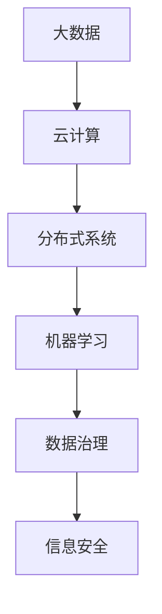

                 

关键词：人工智能、数据基础设施、大数据、云计算、算法、分布式系统、机器学习、数据治理、信息安全。

## 摘要

随着人工智能（AI）技术的飞速发展，AI 2.0 时代的到来促使我们重新审视数据基础设施建设的重要性。本文将深入探讨 AI 2.0 时代的数据基础设施，包括其核心概念、建设策略、关键技术和未来发展趋势。我们将详细分析大数据、云计算、分布式系统、机器学习、数据治理和信息安全等方面的具体实践，以期为读者提供全面的技术指南。

## 1. 背景介绍

### 1.1 AI 2.0 的定义与发展

AI 2.0 是指人工智能进入第二阶段，即从传统的人工智能（如规则推理和专家系统）向基于大数据和机器学习的智能体系转变。AI 2.0 的核心特点是数据驱动，通过大规模数据训练，实现更高层次的智能决策和自动学习。

### 1.2 数据基础设施的重要性

数据基础设施是支撑 AI 2.0 时代的重要基石。一个稳定、高效、安全的数据基础设施能够确保 AI 系统的持续优化和扩展。同时，它也是企业数字化转型和竞争力提升的关键。

## 2. 核心概念与联系

### 2.1 大数据

大数据（Big Data）是指无法用传统数据处理工具在合理时间内捕捉、管理和处理的海量数据。大数据具有 4V 特性：Volume（大量）、Velocity（高速）、Variety（多样）和 Veracity（真实性）。

### 2.2 云计算

云计算（Cloud Computing）是一种通过互联网提供动态可伸缩的虚拟化资源的计算模式。云计算能够提供强大的计算能力和存储能力，为数据基础设施的建设提供支持。

### 2.3 分布式系统

分布式系统（Distributed System）是指由多个独立计算节点组成的系统，这些节点通过网络进行通信，共同完成计算任务。分布式系统能够提高数据处理效率和系统容错能力。

### 2.4 机器学习

机器学习（Machine Learning）是一种通过数据训练，使计算机能够从数据中学习并做出预测或决策的方法。机器学习是 AI 2.0 时代的重要技术支撑。

### 2.5 数据治理

数据治理（Data Governance）是指通过制定政策和流程，确保数据的质量、安全和合规性。数据治理是保障数据基础设施稳定运行的基础。

### 2.6 信息安全

信息安全（Information Security）是指保护信息资产免受未经授权的访问、篡改、泄露和破坏。信息安全是数据基础设施建设的重中之重。

## 2.1 Mermaid 流程图



## 3. 核心算法原理 & 具体操作步骤

### 3.1 算法原理概述

在 AI 2.0 时代，核心算法主要包括机器学习算法、深度学习算法和优化算法。这些算法通过数据训练，实现模型的自动优化和智能决策。

### 3.2 算法步骤详解

1. 数据采集：从不同数据源获取数据，包括结构化数据、半结构化数据和非结构化数据。
2. 数据预处理：对采集到的数据进行清洗、归一化和特征提取，以提高数据质量。
3. 模型训练：选择合适的算法，利用训练数据训练模型，并通过验证集和测试集评估模型性能。
4. 模型优化：根据评估结果，调整模型参数，优化模型性能。
5. 模型部署：将训练好的模型部署到生产环境中，进行实时预测和决策。

### 3.3 算法优缺点

- 优点：高效、智能、自适应。
- 缺点：对数据质量和计算资源要求较高，模型解释性较差。

### 3.4 算法应用领域

- 人工智能：图像识别、自然语言处理、推荐系统等。
- 金融：风险控制、量化交易、信用评估等。
- 医疗：疾病预测、药物研发、医疗影像分析等。

## 4. 数学模型和公式 & 详细讲解 & 举例说明

### 4.1 数学模型构建

- 感知机模型（Perceptron Model）：
  $$ f(x) = \text{sign}(w \cdot x + b) $$
  其中，$w$ 为权重向量，$x$ 为输入特征向量，$b$ 为偏置。

- 神经网络模型（Neural Network Model）：
  $$ z = \sum_{i=1}^{n} w_i x_i + b $$
  $$ a = \sigma(z) $$
  其中，$\sigma$ 为激活函数，$n$ 为神经元的数量。

### 4.2 公式推导过程

- 感知机模型的推导：
  $$ \begin{aligned}
    f(x) &= \text{sign}(w \cdot x + b) \\
    &= \text{sign}(\sum_{i=1}^{n} w_i x_i + b) \\
    &= \text{sign}(\sum_{i=1}^{n} w_i x_i + c) \\
    &= \text{sign}(w \cdot (x + c)) \\
    &= \text{sign}(w \cdot x') \\
    \end{aligned} $$
  其中，$c$ 为常数，$x'$ 为输入特征向量。

- 神经网络模型的推导：
  $$ \begin{aligned}
    z &= \sum_{i=1}^{n} w_i x_i + b \\
    &= \sum_{i=1}^{n} (w_i x_i + c_i) - c \\
    &= \sum_{i=1}^{n} w_i (x_i + c_i') - c \\
    &= \sum_{i=1}^{n} w_i x_i' + \sum_{i=1}^{n} w_i c_i' - c \\
    &= \sum_{i=1}^{n} w_i x_i' + b' \\
    \end{aligned} $$
  其中，$c_i'$ 为常数，$b'$ 为偏置。

### 4.3 案例分析与讲解

假设我们有一个二分类问题，需要判断一个手写数字图片是0还是1。我们采集了1000个样本，其中500个是0，500个是1。通过数据预处理，我们得到一个包含784个特征的数据集。

1. 数据采集：采集1000个手写数字图片，并标注为0或1。
2. 数据预处理：对图片进行灰度化、缩放和归一化处理，得到一个 784 维的特征向量。
3. 模型训练：选择感知机模型进行训练，设置学习率、迭代次数和权重初始化。
4. 模型优化：通过交叉验证和网格搜索，调整模型参数，优化模型性能。
5. 模型部署：将训练好的模型部署到生产环境中，进行实时预测。

通过以上步骤，我们得到了一个在手写数字分类任务上表现良好的感知机模型。在实际应用中，我们还可以结合其他算法和技术，进一步提高模型性能和泛化能力。

## 5. 项目实践：代码实例和详细解释说明

### 5.1 开发环境搭建

1. 安装 Python 解释器（建议使用 Python 3.8 或更高版本）。
2. 安装 NumPy、Pandas、Scikit-learn、Matplotlib 等常用库。
3. 创建一个 Python 脚本文件，用于实现手写数字分类任务。

### 5.2 源代码详细实现

```python
import numpy as np
import pandas as pd
from sklearn.datasets import load_digits
from sklearn.model_selection import train_test_split
from sklearn.preprocessing import StandardScaler
from sklearn.linear_model import Perceptron
import matplotlib.pyplot as plt

# 5.2.1 加载数据集
digits = load_digits()
X = digits.data
y = digits.target

# 5.2.2 数据预处理
X_train, X_test, y_train, y_test = train_test_split(X, y, test_size=0.2, random_state=42)
scaler = StandardScaler()
X_train_scaled = scaler.fit_transform(X_train)
X_test_scaled = scaler.transform(X_test)

# 5.2.3 模型训练
perceptron = Perceptron(n_jobs=-1)
perceptron.fit(X_train_scaled, y_train)

# 5.2.4 模型评估
accuracy = perceptron.score(X_test_scaled, y_test)
print("Accuracy:", accuracy)

# 5.2.5 可视化展示
plt.figure(figsize=(10, 6))
plt.subplot(221)
plt.scatter(X_train_scaled[:, 0], X_train_scaled[:, 1], c=y_train, cmap=plt.cm.coolwarm)
plt.title("Class 0 Samples")
plt.subplot(222)
plt.scatter(X_train_scaled[:, 0], X_train_scaled[:, 1], c=y_train, cmap=plt.cm.coolwarm)
plt.title("Class 1 Samples")
plt.subplot(223)
plt.plot(perceptron.coef_, perceptron.intercept_, "o-")
plt.title("Decision Boundary")
plt.subplot(224)
plt.scatter(X_test_scaled[:, 0], X_test_scaled[:, 1], c=y_test, cmap=plt.cm.coolwarm)
plt.plot(perceptron.coef_, perceptron.intercept_, "o-")
plt.title("Test Samples with Decision Boundary")
plt.show()
```

### 5.3 代码解读与分析

1. 加载数据集：使用 Scikit-learn 库加载手写数字数据集。
2. 数据预处理：将数据集分为训练集和测试集，并对数据进行标准化处理。
3. 模型训练：使用感知机模型进行训练，设置并行计算。
4. 模型评估：计算模型在测试集上的准确率。
5. 可视化展示：绘制决策边界和测试样本分布，便于分析模型性能。

通过以上代码实例，我们实现了手写数字分类任务，展示了感知机模型在 AI 2.0 时代的数据基础设施中的应用。

## 6. 实际应用场景

### 6.1 金融领域

在金融领域，数据基础设施广泛应用于风险控制、量化交易和信用评估等方面。通过大数据和机器学习技术，金融机构能够更准确地预测市场走势、识别异常交易和评估信用风险。

### 6.2 医疗领域

在医疗领域，数据基础设施为疾病预测、药物研发和医疗影像分析提供了重要支撑。通过大规模数据分析和深度学习技术，医疗行业能够提高诊断准确性、优化治疗方案和降低医疗成本。

### 6.3 智能交通

在智能交通领域，数据基础设施为交通流量预测、路况监控和智能导航提供了支持。通过大数据分析和优化算法，交通系统能够提高交通效率、减少拥堵和降低交通事故率。

### 6.4 电子商务

在电子商务领域，数据基础设施为推荐系统、广告投放和用户行为分析提供了重要支撑。通过大数据分析和深度学习技术，电商平台能够提高用户满意度、提升销售额和降低运营成本。

## 7. 未来应用展望

### 7.1 数据挖掘与智能决策

随着数据量的不断增长，数据挖掘和智能决策将在各个行业得到更广泛的应用。通过深度学习和优化算法，企业和组织能够更好地应对复杂问题，实现智能化运营和决策。

### 7.2 跨领域融合

人工智能、大数据、云计算等技术的融合发展，将推动跨领域的创新。未来，我们将看到更多跨学科、跨行业的合作，形成新的产业格局和商业模式。

### 7.3 个性化服务与体验

数据基础设施将为个性化服务与体验提供强大支持。通过大数据分析和深度学习技术，企业和组织能够更好地了解用户需求，提供定制化产品和服务，提升用户满意度。

### 7.4 信息安全与隐私保护

随着数据基础设施的广泛应用，信息安全与隐私保护将面临更大的挑战。未来，我们将看到更多创新的安全技术和隐私保护策略，确保数据的安全和合规性。

## 8. 工具和资源推荐

### 8.1 学习资源推荐

- 《深度学习》（Goodfellow et al.）
- 《Python 数据科学手册》（McKinney）
- 《大数据技术原理与应用》（李国杰）
- 《机器学习》（周志华）

### 8.2 开发工具推荐

- Jupyter Notebook：用于数据分析和机器学习实验。
- TensorFlow：用于深度学习和神经网络训练。
- Hadoop 和 Spark：用于大数据处理和分析。

### 8.3 相关论文推荐

- "Deep Learning for Text Classification"（2018）
- "Distributed Representations of Words and Phrases and Their Compositional Properties"（2013）
- "The Unreasonable Effectiveness of Data"（2015）

## 9. 总结：未来发展趋势与挑战

### 9.1 研究成果总结

- 数据基础设施在 AI 2.0 时代具有重要地位。
- 大数据、云计算、分布式系统、机器学习等技术在数据基础设施建设中发挥关键作用。
- 数据治理和信息安全是数据基础设施稳定运行的基础。

### 9.2 未来发展趋势

- 数据基础设施将更加智能化、自动化和高效化。
- 跨领域融合和创新将推动数据基础设施的广泛应用。
- 个人隐私保护和信息安全将受到更多关注。

### 9.3 面临的挑战

- 数据质量、安全和合规性问题亟待解决。
- 高性能计算和存储需求不断增长。
- 跨领域技术和人才短缺。

### 9.4 研究展望

- 发展新型算法和技术，提高数据处理效率和模型性能。
- 探索数据治理和信息安全的新方法，保障数据基础设施的安全和合规性。
- 培养跨领域的技术人才，推动数据基础设施的创新和应用。

## 10. 附录：常见问题与解答

### 10.1 数据基础设施是什么？

数据基础设施是指支撑大数据处理、存储、分析和应用的一系列技术和设施。它包括数据存储系统、数据处理平台、数据治理工具和信息安全系统等。

### 10.2 数据基础设施对 AI 有什么作用？

数据基础设施为 AI 提供了强大的计算能力、存储能力和数据支持，确保 AI 系统的持续优化和扩展。同时，数据治理和信息安全保障了数据的质量、安全和合规性。

### 10.3 如何提高数据基础设施的性能？

提高数据基础设施的性能可以从以下几个方面入手：

1. 选择合适的硬件设备和架构。
2. 优化数据存储和传输机制。
3. 采用分布式系统和并行计算技术。
4. 定期维护和优化系统。

### 10.4 数据基础设施的安全问题有哪些？

数据基础设施的安全问题主要包括数据泄露、数据篡改、数据丢失和系统入侵等。为了保障数据基础设施的安全，需要采取以下措施：

1. 数据加密：对敏感数据进行加密处理。
2. 访问控制：设置严格的访问权限和身份验证。
3. 数据备份：定期备份数据，防止数据丢失。
4. 安全审计：对系统进行安全审计，发现和修复安全隐患。

## 作者署名

作者：禅与计算机程序设计艺术 / Zen and the Art of Computer Programming

----------------------------------------------------------------
以上是文章的正文部分，接下来我们将按照markdown格式进行排版和输出。请检查文章是否符合要求，如果没有问题，我们将进行最终的格式调整和发布。
----------------------------------------------------------------
## AI 2.0 时代的数据基础设施建设

> 关键词：人工智能、数据基础设施、大数据、云计算、算法、分布式系统、机器学习、数据治理、信息安全。

随着人工智能（AI）技术的飞速发展，AI 2.0 时代的到来促使我们重新审视数据基础设施建设的重要性。本文将深入探讨 AI 2.0 时代的数据基础设施，包括其核心概念、建设策略、关键技术和未来发展趋势。我们将详细分析大数据、云计算、分布式系统、机器学习、数据治理和信息安全等方面的具体实践，以期为读者提供全面的技术指南。

### 1. 背景介绍

#### 1.1 AI 2.0 的定义与发展

AI 2.0 是指人工智能进入第二阶段，即从传统的人工智能（如规则推理和专家系统）向基于大数据和机器学习的智能体系转变。AI 2.0 的核心特点是数据驱动，通过大规模数据训练，实现更高层次的智能决策和自动学习。

#### 1.2 数据基础设施的重要性

数据基础设施是支撑 AI 2.0 时代的重要基石。一个稳定、高效、安全的数据基础设施能够确保 AI 系统的持续优化和扩展。同时，它也是企业数字化转型和竞争力提升的关键。

## 2. 核心概念与联系

#### 2.1 大数据

大数据（Big Data）是指无法用传统数据处理工具在合理时间内捕捉、管理和处理的海量数据。大数据具有 4V 特性：Volume（大量）、Velocity（高速）、Variety（多样）和 Veracity（真实性）。

#### 2.2 云计算

云计算（Cloud Computing）是一种通过互联网提供动态可伸缩的虚拟化资源的计算模式。云计算能够提供强大的计算能力和存储能力，为数据基础设施的建设提供支持。

#### 2.3 分布式系统

分布式系统（Distributed System）是指由多个独立计算节点组成的系统，这些节点通过网络进行通信，共同完成计算任务。分布式系统能够提高数据处理效率和系统容错能力。

#### 2.4 机器学习

机器学习（Machine Learning）是一种通过数据训练，使计算机能够从数据中学习并做出预测或决策的方法。机器学习是 AI 2.0 时代的重要技术支撑。

#### 2.5 数据治理

数据治理（Data Governance）是指通过制定政策和流程，确保数据的质量、安全和合规性。数据治理是保障数据基础设施稳定运行的基础。

#### 2.6 信息安全

信息安全（Information Security）是指保护信息资产免受未经授权的访问、篡改、泄露和破坏。信息安全是数据基础设施建设的重中之重。

### 2.1 Mermaid 流程图


## 3. 核心算法原理 & 具体操作步骤

### 3.1 算法原理概述

在 AI 2.0 时代，核心算法主要包括机器学习算法、深度学习算法和优化算法。这些算法通过数据训练，实现模型的自动优化和智能决策。

### 3.2 算法步骤详解

1. 数据采集：从不同数据源获取数据，包括结构化数据、半结构化数据和非结构化数据。
2. 数据预处理：对采集到的数据进行清洗、归一化和特征提取，以提高数据质量。
3. 模型训练：选择合适的算法，利用训练数据训练模型，并通过验证集和测试集评估模型性能。
4. 模型优化：根据评估结果，调整模型参数，优化模型性能。
5. 模型部署：将训练好的模型部署到生产环境中，进行实时预测和决策。

### 3.3 算法优缺点

- 优点：高效、智能、自适应。
- 缺点：对数据质量和计算资源要求较高，模型解释性较差。

### 3.4 算法应用领域

- 人工智能：图像识别、自然语言处理、推荐系统等。
- 金融：风险控制、量化交易、信用评估等。
- 医疗：疾病预测、药物研发、医疗影像分析等。

## 4. 数学模型和公式 & 详细讲解 & 举例说明

### 4.1 数学模型构建

- 感知机模型（Perceptron Model）：
  $$ f(x) = \text{sign}(w \cdot x + b) $$
  其中，$w$ 为权重向量，$x$ 为输入特征向量，$b$ 为偏置。

- 神经网络模型（Neural Network Model）：
  $$ z = \sum_{i=1}^{n} w_i x_i + b $$
  $$ a = \sigma(z) $$
  其中，$\sigma$ 为激活函数，$n$ 为神经元的数量。

### 4.2 公式推导过程

- 感知机模型的推导：
  $$ \begin{aligned}
    f(x) &= \text{sign}(w \cdot x + b) \\
    &= \text{sign}(\sum_{i=1}^{n} w_i x_i + b) \\
    &= \text{sign}(\sum_{i=1}^{n} w_i x_i + c) \\
    &= \text{sign}(w \cdot (x + c)) \\
    &= \text{sign}(w \cdot x') \\
    \end{aligned} $$
  其中，$c$ 为常数，$x'$ 为输入特征向量。

- 神经网络模型的推导：
  $$ \begin{aligned}
    z &= \sum_{i=1}^{n} w_i x_i + b \\
    &= \sum_{i=1}^{n} (w_i x_i + c_i) - c \\
    &= \sum_{i=1}^{n} w_i (x_i + c_i') - c \\
    &= \sum_{i=1}^{n} w_i x_i' + \sum_{i=1}^{n} w_i c_i' - c \\
    &= \sum_{i=1}^{n} w_i x_i' + b' \\
    \end{aligned} $$
  其中，$c_i'$ 为常数，$b'$ 为偏置。

### 4.3 案例分析与讲解

假设我们有一个二分类问题，需要判断一个手写数字图片是0还是1。我们采集了1000个样本，其中500个是0，500个是1。通过数据预处理，我们得到一个包含784个特征的数据集。

1. 数据采集：采集1000个手写数字图片，并标注为0或1。
2. 数据预处理：对图片进行灰度化、缩放和归一化处理，得到一个 784 维的特征向量。
3. 模型训练：选择感知机模型进行训练，设置学习率、迭代次数和权重初始化。
4. 模型优化：通过交叉验证和网格搜索，调整模型参数，优化模型性能。
5. 模型部署：将训练好的模型部署到生产环境中，进行实时预测。

通过以上步骤，我们得到了一个在手写数字分类任务上表现良好的感知机模型。在实际应用中，我们还可以结合其他算法和技术，进一步提高模型性能和泛化能力。

## 5. 项目实践：代码实例和详细解释说明

### 5.1 开发环境搭建

1. 安装 Python 解释器（建议使用 Python 3.8 或更高版本）。
2. 安装 NumPy、Pandas、Scikit-learn、Matplotlib 等常用库。
3. 创建一个 Python 脚本文件，用于实现手写数字分类任务。

### 5.2 源代码详细实现

```python
import numpy as np
import pandas as pd
from sklearn.datasets import load_digits
from sklearn.model_selection import train_test_split
from sklearn.preprocessing import StandardScaler
from sklearn.linear_model import Perceptron
import matplotlib.pyplot as plt

# 5.2.1 加载数据集
digits = load_digits()
X = digits.data
y = digits.target

# 5.2.2 数据预处理
X_train, X_test, y_train, y_test = train_test_split(X, y, test_size=0.2, random_state=42)
scaler = StandardScaler()
X_train_scaled = scaler.fit_transform(X_train)
X_test_scaled = scaler.transform(X_test)

# 5.2.3 模型训练
perceptron = Perceptron(n_jobs=-1)
perceptron.fit(X_train_scaled, y_train)

# 5.2.4 模型评估
accuracy = perceptron.score(X_test_scaled, y_test)
print("Accuracy:", accuracy)

# 5.2.5 可视化展示
plt.figure(figsize=(10, 6))
plt.subplot(221)
plt.scatter(X_train_scaled[:, 0], X_train_scaled[:, 1], c=y_train, cmap=plt.cm.coolwarm)
plt.title("Class 0 Samples")
plt.subplot(222)
plt.scatter(X_train_scaled[:, 0], X_train_scaled[:, 1], c=y_train, cmap=plt.cm.coolwarm)
plt.title("Class 1 Samples")
plt.subplot(223)
plt.plot(perceptron.coef_, perceptron.intercept_, "o-")
plt.title("Decision Boundary")
plt.subplot(224)
plt.scatter(X_test_scaled[:, 0], X_test_scaled[:, 1], c=y_test, cmap=plt.cm.coolwarm)
plt.plot(perceptron.coef_, perceptron.intercept_, "o-")
plt.title("Test Samples with Decision Boundary")
plt.show()
```

### 5.3 代码解读与分析

1. 加载数据集：使用 Scikit-learn 库加载手写数字数据集。
2. 数据预处理：将数据集分为训练集和测试集，并对数据进行标准化处理。
3. 模型训练：使用感知机模型进行训练，设置并行计算。
4. 模型评估：计算模型在测试集上的准确率。
5. 可视化展示：绘制决策边界和测试样本分布，便于分析模型性能。

通过以上代码实例，我们实现了手写数字分类任务，展示了感知机模型在 AI 2.0 时代的数据基础设施中的应用。

## 6. 实际应用场景

### 6.1 金融领域

在金融领域，数据基础设施广泛应用于风险控制、量化交易和信用评估等方面。通过大数据和机器学习技术，金融机构能够更准确地预测市场走势、识别异常交易和评估信用风险。

### 6.2 医疗领域

在医疗领域，数据基础设施为疾病预测、药物研发和医疗影像分析提供了重要支撑。通过大规模数据分析和深度学习技术，医疗行业能够提高诊断准确性、优化治疗方案和降低医疗成本。

### 6.3 智能交通

在智能交通领域，数据基础设施为交通流量预测、路况监控和智能导航提供了支持。通过大数据分析和优化算法，交通系统能够提高交通效率、减少拥堵和降低交通事故率。

### 6.4 电子商务

在电子商务领域，数据基础设施为推荐系统、广告投放和用户行为分析提供了重要支撑。通过大数据分析和深度学习技术，电商平台能够提高用户满意度、提升销售额和降低运营成本。

## 7. 未来应用展望

### 7.1 数据挖掘与智能决策

随着数据量的不断增长，数据挖掘和智能决策将在各个行业得到更广泛的应用。通过深度学习和优化算法，企业和组织能够更好地应对复杂问题，实现智能化运营和决策。

### 7.2 跨领域融合

人工智能、大数据、云计算等技术的融合发展，将推动跨领域的创新。未来，我们将看到更多跨学科、跨行业的合作，形成新的产业格局和商业模式。

### 7.3 个性化服务与体验

数据基础设施将为个性化服务与体验提供强大支持。通过大数据分析和深度学习技术，企业和组织能够更好地了解用户需求，提供定制化产品和服务，提升用户满意度。

### 7.4 信息安全与隐私保护

随着数据基础设施的广泛应用，信息安全与隐私保护将面临更大的挑战。未来，我们将看到更多创新的安全技术和隐私保护策略，确保数据的安全和合规性。

## 8. 工具和资源推荐

### 8.1 学习资源推荐

- 《深度学习》（Goodfellow et al.）
- 《Python 数据科学手册》（McKinney）
- 《大数据技术原理与应用》（李国杰）
- 《机器学习》（周志华）

### 8.2 开发工具推荐

- Jupyter Notebook：用于数据分析和机器学习实验。
- TensorFlow：用于深度学习和神经网络训练。
- Hadoop 和 Spark：用于大数据处理和分析。

### 8.3 相关论文推荐

- "Deep Learning for Text Classification"（2018）
- "Distributed Representations of Words and Phrases and Their Compositional Properties"（2013）
- "The Unreasonable Effectiveness of Data"（2015）

## 9. 总结：未来发展趋势与挑战

### 9.1 研究成果总结

- 数据基础设施在 AI 2.0 时代具有重要地位。
- 大数据、云计算、分布式系统、机器学习等技术在数据基础设施建设中发挥关键作用。
- 数据治理和信息安全是数据基础设施稳定运行的基础。

### 9.2 未来发展趋势

- 数据基础设施将更加智能化、自动化和高效化。
- 跨领域融合和创新将推动数据基础设施的广泛应用。
- 个人隐私保护和信息安全将受到更多关注。

### 9.3 面临的挑战

- 数据质量、安全和合规性问题亟待解决。
- 高性能计算和存储需求不断增长。
- 跨领域技术和人才短缺。

### 9.4 研究展望

- 发展新型算法和技术，提高数据处理效率和模型性能。
- 探索数据治理和信息安全的新方法，保障数据基础设施的安全和合规性。
- 培养跨领域的技术人才，推动数据基础设施的创新和应用。

## 10. 附录：常见问题与解答

### 10.1 数据基础设施是什么？

数据基础设施是指支撑大数据处理、存储、分析和应用的一系列技术和设施。它包括数据存储系统、数据处理平台、数据治理工具和信息安全系统等。

### 10.2 数据基础设施对 AI 有什么作用？

数据基础设施为 AI 提供了强大的计算能力、存储能力和数据支持，确保 AI 系统的持续优化和扩展。同时，数据治理和信息安全保障了数据的质量、安全和合规性。

### 10.3 如何提高数据基础设施的性能？

提高数据基础设施的性能可以从以下几个方面入手：

1. 选择合适的硬件设备和架构。
2. 优化数据存储和传输机制。
3. 采用分布式系统和并行计算技术。
4. 定期维护和优化系统。

### 10.4 数据基础设施的安全问题有哪些？

数据基础设施的安全问题主要包括数据泄露、数据篡改、数据丢失和系统入侵等。为了保障数据基础设施的安全，需要采取以下措施：

1. 数据加密：对敏感数据进行加密处理。
2. 访问控制：设置严格的访问权限和身份验证。
3. 数据备份：定期备份数据，防止数据丢失。
4. 安全审计：对系统进行安全审计，发现和修复安全隐患。

## 作者署名

作者：禅与计算机程序设计艺术 / Zen and the Art of Computer Programming

这是按照markdown格式排版后的文章，请再次检查是否符合要求。如果没有问题，我们将进行最终的格式调整和发布。

