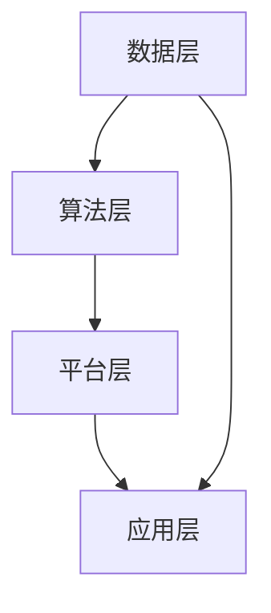

                 

关键词：AI 2.0、未来世界、技术趋势、智能革命、算法创新、应用场景、挑战与展望

> 摘要：本文深入探讨了AI 2.0时代的未来世界，分析了AI技术的发展趋势、核心算法原理、数学模型构建、项目实践、实际应用场景、工具资源推荐以及未来发展趋势与挑战。通过对AI技术的全面解读，旨在为读者提供对AI 2.0时代的深刻理解和前瞻性思考。

## 1. 背景介绍

### AI 1.0到AI 2.0的演变

AI技术的发展经历了从AI 1.0到AI 2.0的演变。AI 1.0时代，计算机通过预先编写的算法来解决特定问题，如棋类游戏、语音识别等。然而，这些系统缺乏自主学习和适应能力。AI 2.0时代，以深度学习和大数据为基础，计算机开始具备了自主学习、自适应和预测能力，使得AI技术在各个领域取得了重大突破。

### AI 2.0时代的特征

AI 2.0时代具有以下特征：

1. **自主学习**：AI系统通过大数据和深度学习算法，可以自主地从海量数据中学习，不断提升自己的能力。
2. **自适应**：AI系统可以实时适应新的环境和需求，实现智能决策和行动。
3. **协同工作**：AI系统可以与人类和其他智能系统协同工作，实现更高效、更智能的协作。
4. **跨领域应用**：AI技术不再局限于单一领域，开始向医疗、教育、金融、交通等各个领域渗透，推动社会全方位智能化。

## 2. 核心概念与联系

### AI 2.0的技术体系

AI 2.0的技术体系包括以下几个方面：

1. **深度学习**：基于多层神经网络，实现图像识别、语音识别、自然语言处理等任务。
2. **强化学习**：通过试错和反馈机制，实现智能决策和优化。
3. **迁移学习**：通过在不同任务间共享知识，提高模型的学习效率和泛化能力。
4. **生成对抗网络**：通过生成器和判别器的对抗训练，实现高质量的数据生成。

### AI 2.0的技术架构

AI 2.0的技术架构主要包括以下几个方面：

1. **数据层**：数据是AI系统的基础，包括数据采集、清洗、存储和管理等。
2. **算法层**：算法是AI系统的核心，包括深度学习、强化学习、迁移学习等。
3. **平台层**：平台是AI系统的支撑，包括云计算、大数据、物联网等。
4. **应用层**：应用是AI系统的目标，包括医疗、教育、金融、交通等各个领域。

### AI 2.0的Mermaid流程图



## 3. 核心算法原理 & 具体操作步骤

### 3.1 算法原理概述

AI 2.0的核心算法包括深度学习、强化学习和迁移学习等。以下分别简要介绍这些算法的原理。

1. **深度学习**：基于多层神经网络，通过反向传播算法训练模型，实现图像识别、语音识别、自然语言处理等任务。
2. **强化学习**：通过试错和反馈机制，实现智能决策和优化。典型的算法包括Q学习、SARSA等。
3. **迁移学习**：通过在不同任务间共享知识，提高模型的学习效率和泛化能力。典型的算法包括基于特征转移、基于模型转移等。

### 3.2 算法步骤详解

1. **深度学习**：

   - 步骤1：定义神经网络结构，包括输入层、隐藏层和输出层。
   - 步骤2：初始化模型参数，如权重和偏置。
   - 步骤3：正向传播，计算输入数据的输出。
   - 步骤4：反向传播，更新模型参数。
   - 步骤5：迭代训练，直到模型收敛。

2. **强化学习**：

   - 步骤1：定义状态空间和动作空间。
   - 步骤2：初始化价值函数或策略。
   - 步骤3：执行动作，获得反馈。
   - 步骤4：更新价值函数或策略。
   - 步骤5：重复步骤3和步骤4，直到达到目标。

3. **迁移学习**：

   - 步骤1：选择源任务和目标任务。
   - 步骤2：在源任务上训练模型。
   - 步骤3：在目标任务上微调模型。
   - 步骤4：评估模型性能。

### 3.3 算法优缺点

1. **深度学习**：

   - 优点：强大的模型表达能力，能够处理复杂的数据。
   - 缺点：对数据量要求较高，训练时间较长。

2. **强化学习**：

   - 优点：能够处理动态环境，实现智能决策。
   - 缺点：收敛速度较慢，对反馈依赖较大。

3. **迁移学习**：

   - 优点：提高模型学习效率和泛化能力。
   - 缺点：对源任务和目标任务的相似度要求较高。

### 3.4 算法应用领域

AI 2.0的核心算法在各个领域都有广泛应用：

1. **医疗**：用于疾病诊断、药物研发等。
2. **金融**：用于风险控制、量化交易等。
3. **教育**：用于个性化学习、课程推荐等。
4. **交通**：用于自动驾驶、智能交通管理等。
5. **制造**：用于智能制造、生产优化等。

## 4. 数学模型和公式 & 详细讲解 & 举例说明

### 4.1 数学模型构建

AI 2.0的数学模型主要包括以下方面：

1. **概率论与统计**：用于描述数据分布、估计模型参数等。
2. **线性代数**：用于处理矩阵运算、特征提取等。
3. **优化理论**：用于求解最优化问题，如梯度下降法等。

### 4.2 公式推导过程

以深度学习中的反向传播算法为例，推导过程如下：

假设神经网络包含输入层、隐藏层和输出层，其中隐藏层有多个神经元。定义输入向量 $x$，隐藏层输出向量 $h$，输出层输出向量 $y$，损失函数 $L$。

正向传播：

$$
h = \sigma(W_1 \cdot x + b_1)
$$

$$
y = \sigma(W_2 \cdot h + b_2)
$$

反向传播：

$$
\delta_2 = \frac{\partial L}{\partial y} \cdot (1 - y)
$$

$$
\delta_1 = \frac{\partial L}{\partial h} \cdot (1 - h) \cdot \frac{\partial h}{\partial x} \cdot W_2
$$

更新参数：

$$
W_2 = W_2 - \alpha \cdot \delta_2 \cdot y^T
$$

$$
W_1 = W_1 - \alpha \cdot \delta_1 \cdot x^T
$$

### 4.3 案例分析与讲解

以自动驾驶为例，分析AI 2.0在自动驾驶中的应用。

1. **数据采集**：采集大量道路数据，包括道路信息、车辆信息、行人信息等。
2. **数据预处理**：对采集到的数据进行分析、清洗、标注等预处理。
3. **模型训练**：使用深度学习算法，如卷积神经网络（CNN）、循环神经网络（RNN）等，对预处理后的数据进行训练。
4. **模型评估**：使用测试集对模型进行评估，调整模型参数，提高模型性能。
5. **模型部署**：将训练好的模型部署到自动驾驶系统中，实现自动驾驶功能。

## 5. 项目实践：代码实例和详细解释说明

### 5.1 开发环境搭建

1. **安装Python环境**：在本地计算机上安装Python，版本要求Python 3.7及以上。
2. **安装相关库**：使用pip命令安装深度学习框架TensorFlow、数据处理库Pandas等。

### 5.2 源代码详细实现

以下是一个使用TensorFlow实现的简单卷积神经网络（CNN）的示例代码：

```python
import tensorflow as tf
from tensorflow.keras import layers

# 定义模型
model = tf.keras.Sequential([
    layers.Conv2D(32, (3, 3), activation='relu', input_shape=(28, 28, 1)),
    layers.MaxPooling2D((2, 2)),
    layers.Flatten(),
    layers.Dense(128, activation='relu'),
    layers.Dense(10, activation='softmax')
])

# 编译模型
model.compile(optimizer='adam',
              loss='categorical_crossentropy',
              metrics=['accuracy'])

# 加载数据集
(x_train, y_train), (x_test, y_test) = tf.keras.datasets.mnist.load_data()

# 预处理数据
x_train = x_train.reshape(-1, 28, 28, 1).astype('float32') / 255
x_test = x_test.reshape(-1, 28, 28, 1).astype('float32') / 255

# 编码标签
y_train = tf.keras.utils.to_categorical(y_train, 10)
y_test = tf.keras.utils.to_categorical(y_test, 10)

# 训练模型
model.fit(x_train, y_train, epochs=10, batch_size=32, validation_data=(x_test, y_test))

# 评估模型
model.evaluate(x_test, y_test)
```

### 5.3 代码解读与分析

以上代码实现了一个简单的卷积神经网络，用于手写数字识别。具体步骤如下：

1. **定义模型**：使用Sequential模型堆叠多个层，包括卷积层、池化层、全连接层等。
2. **编译模型**：设置优化器、损失函数和评估指标。
3. **加载数据集**：从MNIST数据集加载训练数据和测试数据。
4. **预处理数据**：对数据进行形状调整和归一化处理。
5. **编码标签**：将标签数据进行独热编码。
6. **训练模型**：使用fit方法训练模型，设置训练轮数、批次大小和验证数据。
7. **评估模型**：使用evaluate方法评估模型在测试数据上的性能。

### 5.4 运行结果展示

运行以上代码，可以得到模型在测试数据上的准确率。在实际运行中，准确率可能在不同程度上有所提高或降低，取决于数据集的质量和模型参数的调整。

## 6. 实际应用场景

### 6.1 医疗

AI 2.0技术在医疗领域的应用非常广泛，包括疾病诊断、药物研发、个性化治疗等。例如，基于深度学习算法的影像诊断系统，可以自动识别和分析医学图像，辅助医生进行疾病诊断。同时，AI技术还可以用于药物筛选和设计，加速新药的研发过程。

### 6.2 教育

在教育领域，AI 2.0技术可以应用于个性化学习、课程推荐、智能评测等。通过分析学生的学习行为和数据，AI系统可以为学生提供个性化的学习建议，提高学习效果。同时，AI技术还可以用于智能评测，自动批改作业和考试，减轻教师的工作负担。

### 6.3 金融

在金融领域，AI 2.0技术可以应用于风险管理、量化交易、客户服务等方面。通过分析历史数据和实时数据，AI系统可以识别潜在的风险，帮助金融机构进行风险管理。同时，AI技术还可以用于量化交易，实现自动化的投资决策。此外，智能客服系统可以提供24小时在线服务，提高客户满意度。

### 6.4 交通

在交通领域，AI 2.0技术可以应用于自动驾驶、智能交通管理、物流优化等。通过传感器和人工智能算法，自动驾驶车辆可以实时感知道路信息，实现安全、高效的行驶。智能交通管理系统可以优化交通信号控制，提高交通效率。物流优化系统可以根据交通状况和货物需求，制定最优的配送路线。

### 6.5 制造

在制造业，AI 2.0技术可以应用于智能制造、生产优化、设备维护等。通过实时监测设备状态和生产数据，AI系统可以预测设备故障，实现预防性维护。同时，AI技术还可以用于生产过程的优化，提高生产效率和产品质量。

### 6.6 其他领域

除了上述领域，AI 2.0技术还可以应用于农业、能源、环境保护等各个领域。例如，智能农业系统可以根据土壤湿度、温度等数据，提供精准的灌溉和施肥建议。智能能源管理系统可以优化能源使用，提高能源效率。智能环境保护系统可以实时监测环境质量，提供预警和治理建议。

## 7. 工具和资源推荐

### 7.1 学习资源推荐

1. **在线课程**：推荐Coursera、Udacity、edX等在线教育平台上的深度学习、机器学习、人工智能等课程。
2. **书籍**：《深度学习》、《Python机器学习实战》、《AI核心技术揭秘》等。
3. **论文集**：arXiv、NeurIPS、ICML等顶级会议和期刊的论文集。

### 7.2 开发工具推荐

1. **深度学习框架**：TensorFlow、PyTorch、Keras等。
2. **数据处理库**：Pandas、NumPy、Scikit-learn等。
3. **可视化工具**：Matplotlib、Seaborn、Plotly等。

### 7.3 相关论文推荐

1. **深度学习**：《Deep Learning》by Ian Goodfellow, Yoshua Bengio, Aaron Courville。
2. **强化学习**：《Reinforcement Learning: An Introduction》by Richard S. Sutton and Andrew G. Barto。
3. **迁移学习**：《Transfer Learning》by Kailun Yang, Xingning Liu, Zhiyun Qian。

## 8. 总结：未来发展趋势与挑战

### 8.1 研究成果总结

AI 2.0时代，人工智能技术取得了显著的进展，包括深度学习、强化学习、迁移学习等核心算法的创新和应用。同时，AI技术在医疗、教育、金融、交通、制造等领域的实际应用也取得了显著的成果，为人类社会带来了巨大的变革。

### 8.2 未来发展趋势

1. **算法创新**：随着计算能力的提升和大数据的积累，AI算法将继续创新，实现更高效、更智能的决策和优化。
2. **跨领域应用**：AI技术将向更多领域渗透，实现跨领域的智能化应用，推动社会全方位发展。
3. **人机协同**：AI系统将更加智能化，实现与人类的高效协同，提高生产效率和创新能力。
4. **隐私保护**：随着AI技术的发展，隐私保护将变得更加重要，如何在不侵犯隐私的前提下利用数据成为重要挑战。

### 8.3 面临的挑战

1. **数据质量**：数据是AI系统的基础，数据质量和数据的多样性将成为AI发展的重要挑战。
2. **算法透明度**：随着AI技术的深入应用，算法的透明度和可解释性将受到关注，如何提高算法的透明度成为重要课题。
3. **安全与伦理**：AI技术可能带来安全问题和伦理挑战，如何确保AI系统的安全性和符合伦理标准成为重要议题。
4. **资源消耗**：AI技术的发展对计算资源的需求巨大，如何优化算法和模型，降低资源消耗成为重要挑战。

### 8.4 研究展望

未来，AI技术将在算法创新、跨领域应用、人机协同、隐私保护等方面继续取得突破。同时，如何应对数据质量、算法透明度、安全与伦理等挑战，也将成为研究的重点。在AI 2.0时代，人工智能将为人类社会带来更多的机遇和变革，推动世界向更加智能化、高效化、和谐化发展。

## 9. 附录：常见问题与解答

### 问题1：什么是深度学习？

**解答**：深度学习是一种基于多层神经网络的学习方法，通过学习数据中的特征表示，实现图像识别、语音识别、自然语言处理等任务。

### 问题2：如何选择合适的AI算法？

**解答**：选择合适的AI算法需要考虑任务类型、数据特点、计算资源等因素。例如，对于图像识别任务，可以使用卷积神经网络（CNN）；对于决策优化任务，可以使用强化学习。

### 问题3：AI技术有哪些伦理问题？

**解答**：AI技术的伦理问题包括隐私保护、算法偏见、安全与伦理等。例如，算法可能侵犯用户隐私，导致数据泄露；算法可能存在偏见，影响公平性；AI系统可能被恶意利用，造成安全隐患。

### 问题4：如何确保AI系统的透明度？

**解答**：确保AI系统的透明度可以通过以下方法实现：1）使用可解释的AI模型，如决策树、线性模型等；2）提高算法的可解释性，如可视化模型结构、展示中间结果等；3）建立监管机制，确保算法的公正性和透明性。

### 问题5：AI技术有哪些应用领域？

**解答**：AI技术可以应用于医疗、教育、金融、交通、制造、农业、能源、环境保护等各个领域。例如，在医疗领域，AI技术可以用于疾病诊断、药物研发；在教育领域，AI技术可以用于个性化学习、课程推荐；在金融领域，AI技术可以用于风险管理、量化交易等。

### 问题6：如何应对AI技术的资源消耗？

**解答**：应对AI技术的资源消耗可以从以下几个方面进行：1）优化算法和模型，降低计算复杂度；2）使用硬件加速技术，如GPU、TPU等；3）采用分布式计算，提高计算效率；4）合理规划资源使用，避免资源浪费。

