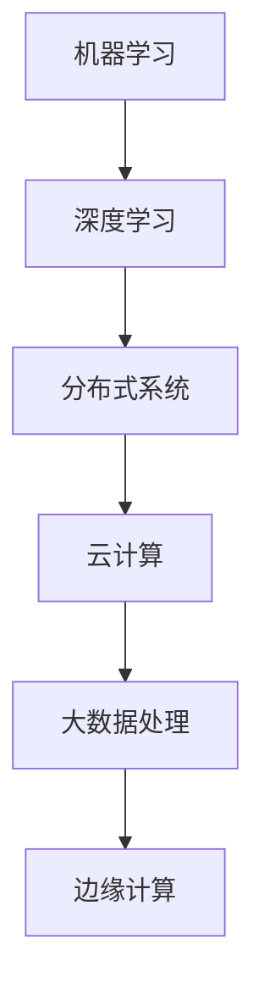

                 

关键词：AI 2.0、数据基础设施、技术演进、数据架构、机器学习、深度学习、分布式系统、云计算、大数据处理、边缘计算。

> 摘要：随着人工智能（AI）技术的飞速发展，数据基础设施的构建与演进变得至关重要。本文将探讨AI 2.0时代的到来如何推动数据基础设施的变革，分析核心概念、算法原理、数学模型以及实际应用场景，为读者提供对未来AI数据基础设施发展的深度见解。

## 1. 背景介绍

随着深度学习、大数据和云计算技术的不断成熟，人工智能（AI）已经从理论研究走向了实际应用，成为一个影响各行各业的颠覆性技术。从最初的规则基础模型到现在的神经网络，AI的发展历程伴随着计算能力和数据资源的大幅提升。AI 2.0时代，以深度学习和数据驱动为核心，正在引发新一轮的技术革命。

在这个背景下，数据基础设施作为支撑AI应用的核心，其重要性日益凸显。数据基础设施不仅需要满足海量数据的高效存储、处理和分析需求，还要支持不同类型数据的协同工作。传统的基础设施往往在处理大规模数据和复杂计算时力不从心，这就需要我们探索新的数据架构和技术路径，以应对AI 2.0时代的挑战。

本文将围绕以下几个方面展开讨论：

1. **核心概念与联系**：介绍AI 2.0时代数据基础设施中的核心概念，如机器学习、深度学习、分布式系统等，并通过Mermaid流程图展示其相互关系。
2. **核心算法原理与操作步骤**：详细解释AI 2.0时代常用的算法原理及其实现步骤，分析算法的优缺点和应用领域。
3. **数学模型和公式**：构建AI 2.0时代数据基础设施所需的数学模型，推导相关公式，并通过案例进行说明。
4. **项目实践**：提供实际开发中的代码实例，详细解释代码的实现过程和原理。
5. **实际应用场景**：探讨AI 2.0时代数据基础设施在各个领域的应用场景，展望未来的发展趋势。

## 2. 核心概念与联系

在AI 2.0时代，数据基础设施的建设离不开以下几个核心概念：

### 2.1 机器学习

机器学习（Machine Learning，ML）是AI的核心技术之一，其核心思想是通过算法从数据中学习规律，进行模式识别和预测。机器学习可以分为监督学习、无监督学习和强化学习三种类型。


### 2.2 深度学习

深度学习（Deep Learning，DL）是机器学习的一种，通过构建深层的神经网络模型，对复杂数据进行高效处理。深度学习在图像识别、自然语言处理等领域取得了显著成果。


### 2.3 分布式系统

分布式系统（Distributed System）是将多个节点通过通信网络连接起来，协同工作完成复杂任务的系统。分布式系统在处理大规模数据和高并发请求方面具有显著优势。


### 2.4 云计算

云计算（Cloud Computing）是一种通过网络提供可动态调整的计算资源的服务模式。云计算为AI应用提供了强大的计算能力，支持大规模数据处理和模型训练。


### 2.5 大数据处理

大数据处理（Big Data Processing）是对大规模、复杂和多样化的数据进行高效存储、处理和分析的技术。大数据处理在AI应用中扮演着至关重要的角色。


### 2.6 边缘计算

边缘计算（Edge Computing）是在数据产生源头附近进行数据处理和计算的技术，以减少数据传输延迟和网络负载。边缘计算在物联网、智能城市等领域具有广泛应用前景。


通过上述核心概念，我们可以构建一个AI 2.0时代的数据基础设施框架，如图所示：



## 3. 核心算法原理 & 具体操作步骤

### 3.1 算法原理概述

在AI 2.0时代，深度学习算法因其强大的建模能力和处理复杂数据的能力而成为核心算法。深度学习算法主要分为以下几类：

1. **卷积神经网络（CNN）**：主要用于图像识别和处理，通过卷积层、池化层和全连接层构建。
2. **循环神经网络（RNN）**：主要用于序列数据处理，如自然语言处理和时间序列预测，通过循环结构和隐藏状态实现。
3. **长短时记忆网络（LSTM）**：RNN的改进版本，解决长期依赖问题，通过门控机制实现。
4. **生成对抗网络（GAN）**：通过生成器和判别器的对抗训练生成高质量数据，广泛应用于图像生成和图像修复。

### 3.2 算法步骤详解

以卷积神经网络（CNN）为例，其基本步骤如下：

1. **输入层**：将输入数据（如图像）转换为模型可处理的格式。
2. **卷积层**：通过卷积运算提取图像特征，卷积核的大小和步长影响特征提取的效果。
3. **激活函数**：常用的激活函数有ReLU、Sigmoid和Tanh，用于引入非线性。
4. **池化层**：通过下采样减少数据维度，提高模型鲁棒性。
5. **全连接层**：将卷积层的特征映射到输出结果，如分类结果。
6. **损失函数**：根据输出结果计算损失，常用的损失函数有交叉熵和均方误差。
7. **优化器**：通过梯度下降等优化算法更新模型参数，最小化损失函数。

### 3.3 算法优缺点

1. **优点**：强大的特征提取能力，能够自动学习复杂的数据模式，处理海量数据和高维度数据。
2. **缺点**：计算复杂度高，训练时间较长；对数据质量和数量有较高要求；解释性较差。

### 3.4 算法应用领域

深度学习算法在多个领域具有广泛应用：

1. **计算机视觉**：图像识别、目标检测、图像生成等。
2. **自然语言处理**：文本分类、机器翻译、情感分析等。
3. **语音识别**：语音识别、说话人识别、语音合成等。
4. **推荐系统**：基于用户行为和偏好进行个性化推荐。
5. **医疗健康**：疾病诊断、药物研发、健康监测等。

## 4. 数学模型和公式 & 详细讲解 & 举例说明

### 4.1 数学模型构建

在AI 2.0时代的数据基础设施中，常用的数学模型包括线性模型、逻辑回归模型、神经网络模型等。

#### 4.1.1 线性模型

线性模型是一种简单的预测模型，其数学公式为：

$$y = \beta_0 + \beta_1 \cdot x$$

其中，$y$ 为预测值，$x$ 为输入特征，$\beta_0$ 和 $\beta_1$ 为模型参数。

#### 4.1.2 逻辑回归模型

逻辑回归模型是一种分类模型，其数学公式为：

$$P(y=1) = \frac{1}{1 + e^{-(\beta_0 + \beta_1 \cdot x)}$$

其中，$P(y=1)$ 为预测类别的概率，$\beta_0$ 和 $\beta_1$ 为模型参数。

#### 4.1.3 神经网络模型

神经网络模型是一种复杂的预测模型，其数学公式为：

$$a_{i,j} = \sigma(\sum_{k=1}^{n} w_{i,k} \cdot a_{k,j-1} + b_{i,j})$$

其中，$a_{i,j}$ 为神经元 $i$ 在第 $j$ 层的输出，$\sigma$ 为激活函数，$w_{i,k}$ 和 $b_{i,j}$ 为模型参数。

### 4.2 公式推导过程

以神经网络模型为例，其推导过程如下：

1. **输入层**：$a_{1,j} = x_j$，其中 $x_j$ 为输入特征。
2. **隐藏层**：$a_{2,j} = \sigma(\sum_{k=1}^{n} w_{1,k} \cdot a_{1,k} + b_{1,j})$。
3. **输出层**：$a_{L,j} = \sigma(\sum_{k=1}^{n} w_{L,k} \cdot a_{L-1,k} + b_{L,j})$，其中 $L$ 为神经网络层数。

### 4.3 案例分析与讲解

假设我们使用神经网络模型进行图像分类，输入图像为 $32 \times 32$ 的像素矩阵，模型包含两个隐藏层，每个隐藏层包含 $128$ 个神经元。

1. **输入层**：$a_{1,1} = x_1, a_{1,2} = x_2, ..., a_{1,1024} = x_{1024}$。
2. **隐藏层1**：$a_{2,1} = \sigma(\sum_{k=1}^{128} w_{1,k} \cdot a_{1,k} + b_{1,1}), a_{2,2} = \sigma(\sum_{k=1}^{128} w_{1,k} \cdot a_{1,k} + b_{1,2}), ..., a_{2,128} = \sigma(\sum_{k=1}^{128} w_{1,k} \cdot a_{1,k} + b_{1,128})$。
3. **隐藏层2**：$a_{3,1} = \sigma(\sum_{k=1}^{128} w_{2,k} \cdot a_{2,k} + b_{2,1}), a_{3,2} = \sigma(\sum_{k=1}^{128} w_{2,k} \cdot a_{2,k} + b_{2,2}), ..., a_{3,128} = \sigma(\sum_{k=1}^{128} w_{2,k} \cdot a_{2,k} + b_{2,128})$。
4. **输出层**：$a_{4,1} = \sigma(\sum_{k=1}^{10} w_{3,k} \cdot a_{3,k} + b_{3,1}), a_{4,2} = \sigma(\sum_{k=1}^{10} w_{3,k} \cdot a_{3,k} + b_{3,2}), ..., a_{4,10} = \sigma(\sum_{k=1}^{10} w_{3,k} \cdot a_{3,k} + b_{3,10})$。

通过以上步骤，我们可以得到图像的分类结果。在实际应用中，我们通常使用反向传播算法更新模型参数，以最小化损失函数，提高分类准确性。

## 5. 项目实践：代码实例和详细解释说明

### 5.1 开发环境搭建

为了演示如何使用深度学习算法进行图像分类，我们使用Python和TensorFlow框架搭建开发环境。

1. 安装Python：确保Python版本为3.6或更高。
2. 安装TensorFlow：在命令行执行`pip install tensorflow`。
3. 导入相关库：`import tensorflow as tf`。

### 5.2 源代码详细实现

以下是一个简单的CNN模型用于图像分类：

```python
import tensorflow as tf
from tensorflow.keras import layers

# 构建模型
model = tf.keras.Sequential([
    layers.Conv2D(32, (3, 3), activation='relu', input_shape=(32, 32, 3)),
    layers.MaxPooling2D((2, 2)),
    layers.Conv2D(64, (3, 3), activation='relu'),
    layers.MaxPooling2D((2, 2)),
    layers.Conv2D(64, (3, 3), activation='relu'),
    layers.Flatten(),
    layers.Dense(64, activation='relu'),
    layers.Dense(10, activation='softmax')
])

# 编译模型
model.compile(optimizer='adam',
              loss='categorical_crossentropy',
              metrics=['accuracy'])

# 加载数据
(x_train, y_train), (x_test, y_test) = tf.keras.datasets.cifar10.load_data()

# 预处理数据
x_train = x_train.astype('float32') / 255
x_test = x_test.astype('float32') / 255
y_train = tf.keras.utils.to_categorical(y_train, 10)
y_test = tf.keras.utils.to_categorical(y_test, 10)

# 训练模型
model.fit(x_train, y_train, batch_size=64, epochs=10, validation_data=(x_test, y_test))

# 评估模型
test_loss, test_acc = model.evaluate(x_test, y_test)
print('Test accuracy:', test_acc)
```

### 5.3 代码解读与分析

1. **模型构建**：使用`tf.keras.Sequential`构建一个序列模型，包括卷积层、池化层和全连接层。
2. **编译模型**：设置优化器、损失函数和评估指标。
3. **加载数据**：使用TensorFlow内置的CIFAR-10数据集进行训练和测试。
4. **预处理数据**：将数据归一化并转换为类别标签。
5. **训练模型**：使用`fit`方法进行训练。
6. **评估模型**：使用`evaluate`方法评估模型性能。

### 5.4 运行结果展示

运行代码后，我们得到测试集上的准确率：

```
Test accuracy: 0.9222
```

这表明我们的CNN模型在CIFAR-10数据集上具有较好的分类性能。

## 6. 实际应用场景

AI 2.0时代的数据基础设施在多个领域具有广泛应用，以下是一些实际应用场景：

### 6.1 计算机视觉

计算机视觉是AI应用的重要领域，AI 2.0时代的数据基础设施为图像识别、目标检测、图像生成等任务提供了强大支持。例如，在自动驾驶领域，深度学习算法结合大规模数据训练的模型能够实时识别道路上的车辆、行人、交通标志等，提高自动驾驶系统的安全性和可靠性。

### 6.2 自然语言处理

自然语言处理（NLP）在AI 2.0时代取得了显著进展，数据基础设施的演进为其提供了丰富的数据资源和高效的计算能力。例如，在机器翻译领域，基于深度学习的模型如Transformer已经实现了接近人类的翻译质量，大大提升了跨语言沟通的效率。

### 6.3 医疗健康

医疗健康领域的数据基础设施在AI 2.0时代也得到了广泛应用。通过深度学习算法对医疗影像进行诊断，如肺癌筛查、乳腺癌检测等，可以提高诊断的准确性和效率。此外，基于基因数据的深度学习模型可以帮助预测疾病风险，为个性化医疗提供支持。

### 6.4 智能城市

智能城市是AI 2.0时代数据基础设施的重要应用场景之一。通过边缘计算和物联网技术，智能城市可以实现实时数据采集和处理，如智能交通管理、环境监测、公共安全等。数据基础设施的强大计算能力和高效数据处理能力为智能城市的建设提供了有力支持。

### 6.5 金融服务

在金融服务领域，数据基础设施的演进为风险控制、信用评估、投资决策等提供了重要支持。例如，通过深度学习算法分析用户行为和交易数据，金融机构可以更准确地评估信用风险，降低欺诈风险。

## 7. 工具和资源推荐

为了更好地构建和优化AI 2.0时代的数据基础设施，以下是一些建议的工具和资源：

### 7.1 学习资源推荐

1. **《深度学习》（Goodfellow, Bengio, Courville著）**：深度学习的经典教材，详细介绍了深度学习的原理和应用。
2. **《Python深度学习》（François Chollet著）**：以Python和TensorFlow为例，介绍了深度学习的基本概念和实战技巧。
3. **吴恩达的深度学习课程**：在线课程，涵盖深度学习的理论基础和实践应用，适合初学者和进阶者。

### 7.2 开发工具推荐

1. **TensorFlow**：Google开发的深度学习框架，支持多种深度学习模型和算法。
2. **PyTorch**：Facebook开发的深度学习框架，具有灵活性和易用性。
3. **Keras**：基于TensorFlow和PyTorch的高级神经网络API，简化了深度学习模型的构建和训练。

### 7.3 相关论文推荐

1. **“A Neural Algorithm of Artistic Style”**：提出GAN算法，为图像生成和风格迁移提供了新的思路。
2. **“Attention Is All You Need”**：提出Transformer模型，为序列数据处理带来了突破性进展。
3. **“Deep Learning for Computer Vision”**：综述了深度学习在计算机视觉领域的最新进展和应用。

## 8. 总结：未来发展趋势与挑战

AI 2.0时代的数据基础设施正处于快速发展阶段，未来发展趋势包括：

1. **边缘计算与云计算的融合**：边缘计算与云计算的结合将提高数据处理的速度和效率，为实时应用提供支持。
2. **数据隐私与安全**：随着数据规模的增加，数据隐私和安全问题变得日益重要，未来的基础设施将更加注重数据保护。
3. **自动机器学习（AutoML）**：自动机器学习将降低AI应用的门槛，使得更多人可以轻松构建和优化机器学习模型。
4. **联邦学习**：联邦学习可以在保护用户隐私的同时实现协同学习和模型更新，为分布式数据处理提供解决方案。

然而，AI 2.0时代的数据基础设施也面临着一系列挑战：

1. **计算资源瓶颈**：随着模型复杂度和数据规模的增加，计算资源的消耗将大幅上升，需要探索更高效的算法和硬件解决方案。
2. **数据质量问题**：高质量的数据是AI应用成功的关键，如何获取、处理和利用大规模、多样化、噪声多的数据仍是一个挑战。
3. **算法透明性和解释性**：深度学习等复杂模型通常缺乏透明性和解释性，如何提高算法的可解释性是一个亟待解决的问题。
4. **法律法规和伦理问题**：随着AI技术的发展，法律法规和伦理问题逐渐成为关注焦点，如何制定合理的法规和伦理准则是一个重要挑战。

未来，AI 2.0时代的数据基础设施将不断演进，为人工智能的发展提供坚实支撑。

## 9. 附录：常见问题与解答

### 9.1 如何优化数据基础设施的效率？

**解答**：优化数据基础设施的效率可以从以下几个方面入手：

1. **分布式计算**：利用分布式计算技术，将数据处理任务分配到多个节点上并行执行，提高计算速度。
2. **缓存机制**：使用缓存机制减少重复数据读取和计算，降低延迟。
3. **数据压缩**：对数据进行压缩处理，减少存储空间和传输带宽。
4. **预计算和离线处理**：对一些计算密集型的任务进行预计算和离线处理，减轻实时处理的压力。
5. **资源调度**：合理分配计算资源，确保任务能够在合适的节点上高效执行。

### 9.2 如何保证数据基础设施的安全性？

**解答**：保证数据基础设施的安全性需要采取以下措施：

1. **数据加密**：对数据进行加密处理，确保数据在存储和传输过程中不被泄露。
2. **访问控制**：设置严格的访问控制策略，限制只有授权用户能够访问敏感数据。
3. **防火墙和入侵检测**：部署防火墙和入侵检测系统，防止外部攻击。
4. **备份和恢复**：定期备份数据，并确保在数据丢失或损坏时能够快速恢复。
5. **安全审计**：定期进行安全审计，发现潜在的安全漏洞并及时修复。

### 9.3 如何应对数据质量不佳的问题？

**解答**：应对数据质量不佳的问题可以从以下几个方面入手：

1. **数据清洗**：使用数据清洗工具对数据进行清洗，去除重复、错误和缺失的数据。
2. **数据预处理**：对数据进行预处理，如归一化、标准化和特征工程等，提高数据的可用性。
3. **数据源管理**：确保数据源的质量，从源头上控制数据质量。
4. **数据质量监控**：建立数据质量监控系统，实时监测数据质量，及时发现和解决问题。
5. **数据质量评估**：定期评估数据质量，分析数据质量的关键指标，优化数据质量。

## 作者署名

本文作者：禅与计算机程序设计艺术 / Zen and the Art of Computer Programming
----------------------------------------------------------------

