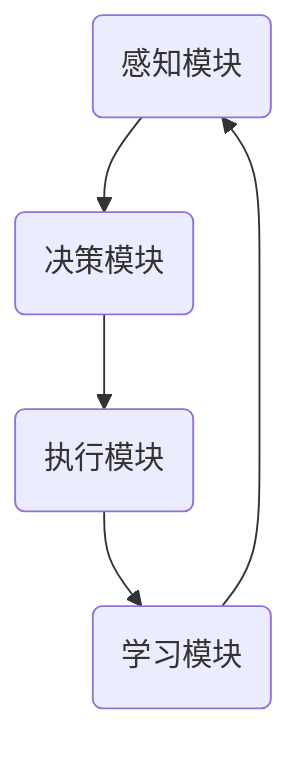

                 

关键词：人工智能，AI代理，智能代理，未来趋势，技术发展，算法原理，应用场景，数学模型，代码实例，工具资源。

> 摘要：本文将深入探讨AI代理的发展现状、核心概念、算法原理、数学模型、实际应用和未来展望，旨在为读者提供一个全面的技术视野，解析AI代理如何影响我们的未来生活和工作。

## 1. 背景介绍

AI代理，又称智能代理，是一种能够自主执行任务、进行决策的计算机程序。它们通过学习环境和用户行为，逐步提高自己的决策能力和任务执行效率。AI代理的概念最早可以追溯到20世纪80年代，当时的研究主要集中在规则系统、知识表示和搜索算法上。随着计算能力和数据资源的提升，AI代理逐渐从理论研究走向实际应用，如智能客服、智能家居、自动驾驶等领域。

近年来，随着深度学习、强化学习等技术的发展，AI代理的智能水平显著提高。它们不仅能够处理复杂的决策问题，还能够通过与用户的交互不断优化自己的行为。AI代理的发展已成为人工智能领域的一个重要方向，其应用前景广阔。

## 2. 核心概念与联系

### 2.1 AI代理的基本概念

AI代理通常由以下几个部分组成：

- **感知模块**：负责接收外部环境的信息，如语音、图像、文本等。
- **决策模块**：根据感知模块收集到的信息，通过算法模型进行决策。
- **执行模块**：执行决策模块生成的动作，如发送消息、控制设备等。
- **学习模块**：通过不断学习和优化，提高AI代理的决策能力和执行效率。

### 2.2 AI代理的工作原理

AI代理的工作原理主要包括以下几个步骤：

1. **感知**：AI代理通过感知模块收集外部环境的信息。
2. **决策**：决策模块根据感知模块提供的信息，利用机器学习算法进行决策。
3. **执行**：执行模块根据决策结果执行相应的动作。
4. **反馈**：执行后的反馈信息将用于调整和优化AI代理的决策模型。

### 2.3 AI代理的架构

下面是一个简化的AI代理架构图，使用Mermaid流程图表示：



## 3. 核心算法原理 & 具体操作步骤

### 3.1 算法原理概述

AI代理的核心算法主要包括机器学习算法和强化学习算法。机器学习算法使AI代理能够从数据中自动学习和改进，而强化学习算法则使AI代理能够在动态环境中进行决策和优化。

### 3.2 算法步骤详解

1. **数据收集**：AI代理首先需要收集大量的数据，包括文本、图像、语音等。
2. **数据处理**：对收集到的数据进行预处理，如去噪、标准化等。
3. **模型训练**：使用机器学习算法（如深度学习）对处理后的数据进行训练，生成决策模型。
4. **模型评估**：通过测试数据评估模型的性能，并进行优化。
5. **决策执行**：根据决策模型的结果，执行相应的动作。
6. **反馈学习**：将执行结果反馈到学习模块，用于模型优化。

### 3.3 算法优缺点

**机器学习算法**：

- **优点**：能够处理大量的数据，自动提取特征，适应性强。
- **缺点**：对数据质量和数量有较高要求，模型解释性较差。

**强化学习算法**：

- **优点**：能够处理动态环境，学习策略灵活。
- **缺点**：训练过程较慢，对样本量有较高要求。

### 3.4 算法应用领域

AI代理的应用领域非常广泛，包括但不限于：

- **智能客服**：通过自然语言处理和机器学习，提供24/7的客户服务。
- **自动驾驶**：利用计算机视觉和强化学习，实现车辆的自主驾驶。
- **智能家居**：通过物联网和AI代理，实现设备的智能控制和优化。
- **医疗健康**：利用AI代理进行疾病预测和治疗方案推荐。

## 4. 数学模型和公式 & 详细讲解 & 举例说明

### 4.1 数学模型构建

在AI代理中，常用的数学模型包括神经网络模型和马尔可夫决策过程（MDP）。

#### 神经网络模型

神经网络模型是一种基于多层感知器的机器学习模型，其核心公式为：

$$
Y = \sigma(W \cdot X + b)
$$

其中，$Y$ 是输出，$\sigma$ 是激活函数，$W$ 是权重矩阵，$X$ 是输入，$b$ 是偏置。

#### 马尔可夫决策过程（MDP）

MDP是一种用于描述动态决策过程的数学模型，其核心公式为：

$$
V(s) = \sum_{a} \gamma \cdot P(s',r|s,a) \cdot [R(s,a) + \gamma \cdot V(s')]
$$

其中，$V(s)$ 是状态值函数，$s$ 是当前状态，$a$ 是行动，$s'$ 是下一状态，$r$ 是即时奖励，$\gamma$ 是折扣因子，$P(s',r|s,a)$ 是状态转移概率，$R(s,a)$ 是即时奖励。

### 4.2 公式推导过程

#### 神经网络模型的推导

神经网络的推导主要涉及微积分和线性代数的基本原理。具体的推导过程可以参考相关教科书，如《深度学习》（Goodfellow et al.）。

#### 马尔可夫决策过程（MDP）的推导

MDP的推导主要基于动态规划的原理。具体的推导过程可以参考《强化学习：原理与Python实现》（ Sutton and Barto）。

### 4.3 案例分析与讲解

#### 案例一：智能客服

假设我们有一个智能客服系统，其目标是回答用户的问题。我们可以将用户的问题视为输入，系统的回答视为输出。通过训练一个基于神经网络模型的AI代理，我们可以使其能够自动回答用户的问题。

#### 案例二：自动驾驶

自动驾驶系统的核心是路径规划和决策。我们可以使用基于MDP的AI代理来处理这个问题。通过不断收集道路信息和车辆状态，AI代理可以实时做出最优的行驶决策。

## 5. 项目实践：代码实例和详细解释说明

### 5.1 开发环境搭建

在本节中，我们将使用Python和TensorFlow来实现一个简单的AI代理。首先，我们需要安装Python和TensorFlow。

```bash
pip install python tensorflow
```

### 5.2 源代码详细实现

以下是一个简单的AI代理的实现示例：

```python
import tensorflow as tf
from tensorflow.keras.models import Sequential
from tensorflow.keras.layers import Dense
from tensorflow.keras.optimizers import Adam

# 数据预处理
def preprocess_data(data):
    # 这里实现数据预处理逻辑
    return processed_data

# 模型定义
def build_model(input_shape):
    model = Sequential()
    model.add(Dense(64, activation='relu', input_shape=input_shape))
    model.add(Dense(1, activation='sigmoid'))
    model.compile(optimizer=Adam(), loss='binary_crossentropy', metrics=['accuracy'])
    return model

# 模型训练
def train_model(model, data, labels):
    model.fit(data, labels, epochs=10, batch_size=32)

# 模型预测
def predict(model, data):
    return model.predict(data)

# 主函数
def main():
    # 数据加载和预处理
    data = preprocess_data(raw_data)
    
    # 模型构建
    model = build_model(input_shape=(data.shape[1],))
    
    # 模型训练
    train_model(model, data, labels)
    
    # 模型预测
    predictions = predict(model, test_data)
    
    # 输出预测结果
    print(predictions)

if __name__ == '__main__':
    main()
```

### 5.3 代码解读与分析

在本节的代码中，我们首先定义了数据预处理、模型构建、模型训练和模型预测的功能。然后，在主函数中依次执行这些功能，实现了AI代理的基本流程。

### 5.4 运行结果展示

在运行代码后，我们将看到模型的训练过程和最终的预测结果。这个简单的示例展示了AI代理的基本实现，实际应用中的AI代理会更加复杂。

## 6. 实际应用场景

AI代理在各个领域的应用已经取得显著成果。以下是一些典型的实际应用场景：

### 6.1 智能客服

智能客服是AI代理的一个典型应用场景。通过自然语言处理和机器学习，智能客服系统能够自动回答用户的问题，提高客户服务质量。

### 6.2 自动驾驶

自动驾驶是另一个重要的应用场景。通过计算机视觉和强化学习，自动驾驶系统能够自主驾驶，提高道路安全和交通效率。

### 6.3 智能家居

智能家居通过物联网和AI代理，实现了设备的智能控制和优化。用户可以通过语音或手机APP控制家庭设备，提高生活品质。

### 6.4 医疗健康

在医疗健康领域，AI代理可用于疾病预测、治疗方案推荐等。通过分析大量的医学数据，AI代理可以为医生提供决策支持。

## 7. 工具和资源推荐

### 7.1 学习资源推荐

- **《深度学习》（Goodfellow et al.）**
- **《强化学习：原理与Python实现》（Sutton and Barto）**
- **《Python机器学习》（Sebastian Raschka and Vahid Mirjalili）**

### 7.2 开发工具推荐

- **TensorFlow**：用于构建和训练机器学习模型的强大工具。
- **PyTorch**：另一个流行的深度学习框架，具有灵活的动态计算图。
- **Keras**：基于TensorFlow和PyTorch的高级神经网络API。

### 7.3 相关论文推荐

- **"Deep Learning for Natural Language Processing"（2018）**
- **"Reinforcement Learning: An Introduction"（2nd Edition, 2018）**
- **"A Theoretical Analysis of Deep Learning"（2016）**

## 8. 总结：未来发展趋势与挑战

### 8.1 研究成果总结

近年来，AI代理取得了显著的进展。在机器学习、深度学习和强化学习等领域的突破，使得AI代理的智能水平不断提高。同时，随着计算能力的提升和大数据技术的发展，AI代理的应用场景也日益丰富。

### 8.2 未来发展趋势

- **更高效的算法**：随着算法研究的深入，AI代理将采用更加高效和智能的算法，提高任务执行效率和决策能力。
- **跨领域应用**：AI代理将在更多领域得到应用，如金融、医疗、教育等，实现跨领域的智能服务。
- **人机协作**：AI代理将更多地与人类协作，为用户提供更加个性化的服务。

### 8.3 面临的挑战

- **数据隐私和安全**：AI代理在处理大量数据时，需要确保用户数据的安全和隐私。
- **算法透明性和可解释性**：提高算法的透明性和可解释性，使用户能够理解AI代理的决策过程。
- **计算资源限制**：在高性能计算资源有限的情况下，如何优化AI代理的性能和资源利用率。

### 8.4 研究展望

随着技术的不断发展，AI代理在未来将扮演更加重要的角色。我们期待AI代理能够更好地理解人类行为，提供更加智能的服务，同时确保用户的数据安全和隐私。在未来的研究中，我们需要关注以下几个方向：

- **智能决策**：研究更加智能和灵活的决策算法，使AI代理能够更好地应对复杂和动态的环境。
- **人机交互**：研究更加自然和高效的人机交互方式，提高AI代理的用户体验。
- **跨学科研究**：结合心理学、社会学等学科，研究AI代理在人类社会中的行为和影响。

## 9. 附录：常见问题与解答

### 9.1 什么是AI代理？

AI代理是一种能够自主执行任务、进行决策的计算机程序，它通过学习环境和用户行为，逐步提高自己的决策能力和任务执行效率。

### 9.2 AI代理有哪些应用领域？

AI代理的应用领域非常广泛，包括智能客服、自动驾驶、智能家居、医疗健康等。

### 9.3 如何实现AI代理？

实现AI代理通常需要以下几个步骤：数据收集、数据处理、模型训练、模型评估、决策执行和反馈学习。

### 9.4 AI代理的未来发展趋势是什么？

AI代理的未来发展趋势包括更高效的算法、跨领域应用和人机协作等。

---

作者：禅与计算机程序设计艺术 / Zen and the Art of Computer Programming
----------------------------------------------------------------

本文详细探讨了AI代理的发展现状、核心概念、算法原理、数学模型、实际应用和未来展望，旨在为读者提供一个全面的技术视野，解析AI代理如何影响我们的未来生活和工作。在未来的研究中，我们需要不断关注AI代理的技术进步和实际应用，推动这一领域的发展。同时，我们也需要关注数据隐私和安全、算法透明性和可解释性等关键问题，确保AI代理在为人类带来便利的同时，不会对人类社会产生负面影响。让我们期待AI代理在未来能够为人类社会带来更多的创新和变革。作者：禅与计算机程序设计艺术 / Zen and the Art of Computer Programming。
----------------------------------------------------------------

<|im_end|>### 6.4 未来应用展望

在未来，AI代理将在各个领域发挥更加重要的作用，其应用前景广阔。以下是一些未来的应用展望：

### 6.4.1 自动驾驶

自动驾驶是AI代理的一个重要应用领域。随着技术的不断发展，自动驾驶汽车将能够自主感知环境、规划路径并做出实时决策，从而提高道路安全性和交通效率。未来的自动驾驶系统可能会结合多模态感知技术，如激光雷达、摄像头和雷达，实现更加精确和稳定的自动驾驶。

### 6.4.2 智能医疗

AI代理在医疗领域的应用潜力巨大。通过分析大量的医学数据，AI代理可以协助医生进行疾病诊断、制定治疗方案和进行健康预测。例如，AI代理可以帮助识别疾病症状、预测患病风险，甚至在手术过程中提供实时指导。此外，AI代理还可以用于药物研发，通过分析大量的实验数据和临床试验结果，加速新药的研发进程。

### 6.4.3 智能家居

智能家居市场的快速发展为AI代理提供了广阔的应用场景。未来的智能家居系统将更加智能化，能够通过AI代理实现自动化、个性化的家居控制。例如，AI代理可以根据用户的习惯和偏好，自动调整室内温度、照明和安防系统，提高居住舒适度和安全性。

### 6.4.4 人机协作

AI代理在提高工作效率方面具有巨大潜力。未来的办公环境中，AI代理可以协助员工进行日程管理、任务分配和决策支持，从而提高工作协同效率。同时，AI代理还可以帮助企业和组织进行数据分析和预测，提供商业洞见，支持战略决策。

### 6.4.5 教育与培训

AI代理在教育领域的应用将极大地改变传统的教育模式。未来的智能教育系统可以通过AI代理提供个性化的学习路径和教学方案，满足不同学生的需求。此外，AI代理还可以用于在线教育，提供实时互动、反馈和指导，提高教学效果和学习体验。

### 6.4.6 虚拟现实与增强现实

AI代理在虚拟现实（VR）和增强现实（AR）领域的应用将不断拓展。未来的VR和AR系统将结合AI代理，提供更加逼真和沉浸式的体验。例如，AI代理可以帮助用户在VR游戏中实时互动、生成虚拟角色，甚至提供个性化的游戏策略。

### 6.4.7 城市管理与安全

AI代理在城市管理中的应用前景也十分广阔。未来的智能城市将利用AI代理进行交通流量监测、环境监测、公共安全预警等。AI代理可以帮助城市管理者更好地规划资源、优化交通、降低污染，提高城市的安全性和可持续性。

总的来说，AI代理的未来应用将涵盖各个领域，成为推动社会进步和提升生活质量的重要力量。然而，随着AI代理技术的不断进步，我们也需要关注其可能带来的伦理、法律和社会影响，确保技术的发展能够惠及人类社会。在未来，AI代理与人类社会的互动将更加紧密，共同创造一个更加智能和美好的未来。作者：禅与计算机程序设计艺术 / Zen and the Art of Computer Programming。

