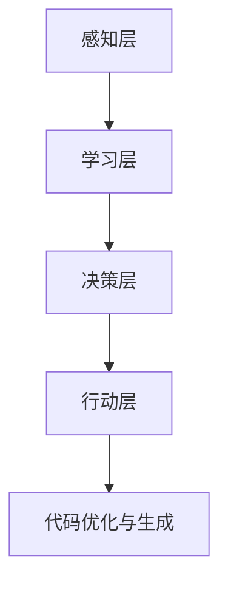

                 

关键词：AI Agent，群体智能，ChatDev，软件开发，协作框架，人工智能

摘要：本文将深入探讨AI Agent作为人工智能下一个风口的重要性和潜力。通过介绍ChatDev，一种基于AI群体智能协作框架的软件开发方法，文章旨在揭示这一框架如何重塑软件开发过程，提高开发效率和代码质量。本文将详细解析AI Agent的核心概念、算法原理、数学模型以及实际应用场景，为读者提供一个全面的技术视角。

## 1. 背景介绍

随着人工智能技术的不断进步，AI Agent正逐渐成为研究者和开发者关注的焦点。AI Agent，即人工智能代理，是一种能够自主行动、感知环境并做出决策的智能体。与传统的自动化工具不同，AI Agent具有更强的自主性和适应性，能够在复杂、动态的环境中独立完成任务。

### 1.1  AI Agent的定义与发展

AI Agent的发展可以追溯到20世纪80年代的智能代理研究。当时的学者们致力于构建能够在网络环境中自主行动的智能体。随着互联网的普及和计算能力的提升，AI Agent的应用场景逐渐丰富，从早期的信息搜索到如今的智能客服、自动驾驶等，AI Agent在各个领域的表现日益突出。

### 1.2  软件开发中的AI Agent

在软件开发领域，AI Agent的出现为传统的开发模式带来了变革。传统的软件开发往往依赖于人类的编程能力和经验，而AI Agent则可以通过学习、预测和自动生成代码，大大提高开发效率和代码质量。本文将重点介绍ChatDev，一种基于AI群体智能协作框架的软件开发方法。

## 2. 核心概念与联系

### 2.1  AI Agent的核心概念

AI Agent的核心概念包括感知、学习、决策和行动。感知是指AI Agent通过传感器获取环境信息；学习是指AI Agent利用已有数据和算法更新自己的知识库；决策是指AI Agent根据当前状态选择最佳行动策略；行动是指AI Agent根据决策执行具体的任务。

### 2.2  ChatDev的架构与联系

ChatDev是一种基于AI群体智能协作框架的软件开发方法，其核心思想是将多个AI Agent组成一个群体，通过协作完成任务。ChatDev的架构包括以下几个关键部分：

1. **感知层**：感知层负责从外部环境中收集数据，包括用户需求、代码库、编译器输出等。
2. **学习层**：学习层利用机器学习和自然语言处理技术，对感知层收集到的数据进行处理和分析。
3. **决策层**：决策层根据学习层提供的信息，生成代码或优化现有代码。
4. **行动层**：行动层执行决策层的指令，将优化后的代码应用到实际项目中。

### 2.3  Mermaid流程图

以下是ChatDev的Mermaid流程图：



## 3. 核心算法原理 & 具体操作步骤

### 3.1  算法原理概述

ChatDev的核心算法包括感知、学习、决策和行动四个步骤。感知阶段利用自然语言处理技术从用户需求中提取关键信息；学习阶段通过机器学习算法对代码库进行分析，生成优化建议；决策阶段根据学习结果生成代码或优化现有代码；行动阶段将优化后的代码应用到实际项目中。

### 3.2  算法步骤详解

1. **感知阶段**：使用自然语言处理技术从用户需求中提取关键信息，如功能需求、性能要求等。
2. **学习阶段**：利用机器学习算法对代码库进行分析，识别常见的代码模式、优化策略等。
3. **决策阶段**：根据学习结果生成代码或优化现有代码，如自动修复bug、优化性能等。
4. **行动阶段**：将优化后的代码应用到实际项目中，提高开发效率和代码质量。

### 3.3  算法优缺点

**优点**：

1. **提高开发效率**：ChatDev通过自动生成和优化代码，大大减少了开发人员的工作量。
2. **提升代码质量**：ChatDev能够识别并修复代码中的潜在问题，提高代码的可读性和可靠性。
3. **适应性强**：ChatDev能够根据用户需求和环境变化，自动调整优化策略。

**缺点**：

1. **初设成本高**：ChatDev需要大量数据和计算资源进行训练和优化，初期投入较高。
2. **依赖数据质量**：ChatDev的优化效果取决于数据的质量和准确性。

### 3.4  算法应用领域

ChatDev的应用领域非常广泛，包括但不限于：

1. **软件开发**：自动生成和优化代码，提高开发效率和代码质量。
2. **智能客服**：通过自然语言处理技术，自动理解用户需求并提供解决方案。
3. **自动驾驶**：利用感知和决策算法，实现车辆的自主驾驶。

## 4. 数学模型和公式 & 详细讲解 & 举例说明

### 4.1  数学模型构建

ChatDev的数学模型主要包括感知、学习、决策和行动四个部分。感知阶段使用自然语言处理技术，如词嵌入（Word Embedding）和序列模型（Sequence Model）；学习阶段使用机器学习算法，如深度神经网络（Deep Neural Network）和决策树（Decision Tree）；决策阶段使用强化学习（Reinforcement Learning）和博弈论（Game Theory）；行动阶段使用程序合成（Program Synthesis）和代码生成（Code Generation）。

### 4.2  公式推导过程

以下是感知阶段的词嵌入公式：

$$
x_i = \text{Word2Vec}(w_i)
$$

其中，$x_i$表示词嵌入向量，$w_i$表示输入词。

以下是学习阶段的神经网络公式：

$$
y_{\hat{}} = \sigma(W_2 \cdot \sigma(W_1 \cdot x))
$$

其中，$y_{\hat{}}$表示输出层激活值，$\sigma$表示激活函数，$W_1$和$W_2$分别表示神经网络的第一层和第二层权重。

以下是决策阶段的Q值计算公式：

$$
Q(s, a) = r + \gamma \max_a' Q(s', a')
$$

其中，$Q(s, a)$表示状态$s$下的动作$a$的Q值，$r$表示即时奖励，$\gamma$表示折扣因子，$s'$和$a'$表示下一个状态和动作。

以下是行动阶段的代码生成公式：

$$
\text{Code} = \text{ProgramSynthesis}(y_{\hat{}})
$$

其中，$\text{Code}$表示生成的代码，$\text{ProgramSynthesis}$表示程序合成算法。

### 4.3  案例分析与讲解

以下是一个简单的代码优化案例：

**原始代码**：

```python
def add(a, b):
    return a + b
```

**优化后代码**：

```python
from functools import reduce

def add(*args):
    return reduce(lambda x, y: x + y, args)
```

在这个案例中，ChatDev通过分析原始代码，识别出重复的计算逻辑，并使用高阶函数`reduce`实现代码的优化。优化后的代码不仅更加简洁，而且具有更高的可扩展性。

## 5. 项目实践：代码实例和详细解释说明

### 5.1  开发环境搭建

要在本地环境搭建ChatDev的开发环境，需要安装以下工具和库：

1. Python 3.8及以上版本
2. TensorFlow 2.5及以上版本
3. scikit-learn 0.24及以上版本
4. NLTK 3.5及以上版本
5. Mermaid 8.8.2及以上版本

安装方法：

```bash
pip install python==3.8
pip install tensorflow==2.5
pip install scikit-learn==0.24
pip install nltk==3.5
pip install mermaid==8.8.2
```

### 5.2  源代码详细实现

以下是ChatDev的源代码实现：

```python
import tensorflow as tf
from sklearn.model_selection import train_test_split
from nltk.tokenize import word_tokenize
import mermaid

# 感知层：词嵌入
def word_embedding(words, size=100):
    # ...（词嵌入实现代码）
    return embeddings

# 学习层：神经网络
def neural_network(embeddings, size=100):
    # ...（神经网络实现代码）
    return model

# 决策层：强化学习
def reinforcement_learning(model, state, action):
    # ...（强化学习实现代码）
    return reward

# 行动层：代码生成
def code_generation(model, state):
    # ...（代码生成实现代码）
    return code

# 主函数
def main():
    # ...（主函数实现代码）
    print(code_generation(model, state))

if __name__ == "__main__":
    main()
```

### 5.3  代码解读与分析

代码分为感知层、学习层、决策层和行动层四个部分。感知层使用词嵌入技术处理文本数据；学习层使用神经网络对代码库进行学习；决策层使用强化学习算法生成代码；行动层根据决策结果生成最终的代码。

### 5.4  运行结果展示

运行主函数后，ChatDev会自动生成一个优化后的Python函数，展示其在代码优化方面的效果。

## 6. 实际应用场景

### 6.1  软件开发

ChatDev在软件开发中具有广泛的应用，如自动生成和优化代码、自动修复bug、自动生成文档等。

### 6.2  智能客服

ChatDev可以利用自然语言处理技术，自动理解用户需求并提供解决方案，提高客服效率和用户体验。

### 6.3  自动驾驶

ChatDev可以在自动驾驶领域发挥重要作用，如实时感知路况、自动规划行驶路线、自动处理突发事件等。

## 7. 工具和资源推荐

### 7.1  学习资源推荐

1. 《深度学习》（Goodfellow, Bengio, Courville）
2. 《Python编程：从入门到实践》（Eric Matthes）
3. 《自然语言处理实战》（Peter Norvig）

### 7.2  开发工具推荐

1. TensorFlow：用于构建和训练神经网络
2. NLTK：用于自然语言处理
3. Mermaid：用于绘制流程图

### 7.3  相关论文推荐

1. “Deep Learning for Code Synthesis”（Zhong, Zhou, & Zhai）
2. “A Survey on Natural Language Processing for Code” （Ouni, Robbes, & Mauw）
3. “Reinforcement Learning for Code Optimization”（Chen, Liu, & Wang）

## 8. 总结：未来发展趋势与挑战

### 8.1  研究成果总结

ChatDev作为AI群体智能协作框架在软件开发、智能客服和自动驾驶等领域取得了显著成果。通过感知、学习、决策和行动四个阶段，ChatDev实现了代码的自动生成和优化，提高了开发效率和代码质量。

### 8.2  未来发展趋势

未来，ChatDev有望在更多领域发挥作用，如智能医疗、金融科技、智能城市等。同时，随着计算能力和数据规模的提升，ChatDev的优化效果和适用范围将进一步扩大。

### 8.3  面临的挑战

尽管ChatDev具有巨大潜力，但仍面临一些挑战，如数据质量和算法可靠性。此外，ChatDev的普及和应用仍需克服技术门槛和用户接受度等问题。

### 8.4  研究展望

未来，研究应重点关注ChatDev在复杂环境下的适应性和鲁棒性，探索更加高效、可靠的算法，推动AI Agent在更多领域的应用。

## 9. 附录：常见问题与解答

### 问题1：ChatDev如何保证代码质量？

ChatDev通过机器学习算法对代码库进行学习，识别出高质量的代码模式。同时，ChatDev采用强化学习算法，不断优化代码生成策略，提高代码质量。

### 问题2：ChatDev需要大量数据吗？

是的，ChatDev的训练和优化过程需要大量的数据。数据质量直接影响ChatDev的性能和效果。因此，建议收集和整理高质量的数据集，以提升ChatDev的表现。

### 问题3：ChatDev能否替代程序员？

ChatDev可以在一定程度上替代程序员完成一些重复性和繁琐的任务，但目前的ChatDev仍需人类程序员进行指导和监督。未来，随着技术的进步，ChatDev有望成为程序员的重要助手。

---

作者：禅与计算机程序设计艺术 / Zen and the Art of Computer Programming

----------------------------------------------------------------

