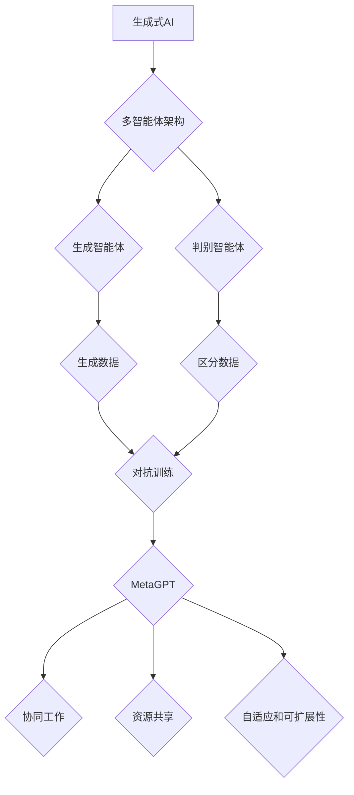

                 

关键词：生成式AI、多智能体架构、MetaGPT、软件开发、人工智能、未来趋势

摘要：随着生成式AI技术的快速发展，传统的软件开发方式正面临着巨大的变革。本文将探讨MetaGPT这一创新的多智能体架构，它不仅能够增强生成式AI的效能，还能极大地优化软件开发流程。我们将深入解析MetaGPT的核心概念、算法原理、数学模型、应用实践以及未来展望，旨在为读者提供一幅全面而清晰的未来技术蓝图。

## 1. 背景介绍

在过去几年中，生成式AI技术取得了显著的进步，从图像生成、文本生成到音频合成，AI在创造性的领域展现出惊人的能力。然而，尽管生成式AI在多个领域取得了突破，但其在软件开发中的应用仍面临诸多挑战。传统的软件开发流程依赖于明确的需求定义、严格的规范和标准化的开发步骤，这使得生成式AI难以直接介入并发挥其潜力。

与此同时，多智能体架构（Multi-Agent System, MAS）作为分布式计算和智能系统的一个重要分支，已经在许多领域得到了应用，如机器人、物联网和供应链管理。多智能体架构强调协同工作和分布式决策，能够有效地处理复杂系统的动态性和不确定性。将多智能体架构与生成式AI技术相结合，有望解决当前软件开发中的一些瓶颈问题，推动AI在软件开发中的深度应用。

MetaGPT（Meta-Agent for Generative AI）就是在这种背景下应运而生的一项创新性技术。它通过引入多智能体架构，将生成式AI的强大创造力与软件开发流程的灵活性相结合，为开发人员提供了一种全新的工作方式。本文将详细探讨MetaGPT的核心原理、实现步骤和应用前景，以期对读者在理解与运用这一技术方面提供有益的启示。

### 1.1 生成式AI的发展现状

生成式AI的发展历程可以追溯到20世纪80年代。当时的生成对抗网络（Generative Adversarial Networks, GAN）作为一种新型神经网络结构，被首次提出。GAN由生成器和判别器两个神经网络组成，通过对抗训练生成逼真的数据。这一创新标志着生成式AI的诞生。

进入21世纪，深度学习技术的飞速发展推动了生成式AI的进一步成熟。特别是变分自编码器（Variational Autoencoder, VAE）和生成对抗网络（GAN）的改进版本，如条件GAN（cGAN）和深度卷积生成对抗网络（DCGAN），使得生成式AI在图像生成、文本生成、音频合成等领域取得了显著的成果。例如，DeepMind的WaveNet在文本生成上的突破，OpenAI的DALL-E在图像生成上的创新，都是生成式AI技术进步的生动例证。

然而，尽管生成式AI在创造力方面展现了巨大的潜力，但其在实际应用中的表现仍存在局限性。首先，生成式AI的训练过程复杂且耗时，尤其是当数据集规模较大或生成复杂样本时，训练时间可能会非常长。其次，生成式AI模型的泛化能力有限，难以应对未见过的新数据。此外，生成式AI模型通常需要大量高质量的标注数据进行训练，这在某些领域（如医疗图像）中难以实现。

生成式AI在软件开发中的应用也在逐渐探索中。例如，代码生成工具如Copilot和Tabnine利用生成式AI技术，能够根据开发人员的输入提示自动生成代码片段。这些工具在一定程度上提高了开发效率，但依然存在生成代码质量不稳定、理解力不足等问题。如何进一步提高生成式AI在软件开发中的效能，成为当前研究的一个重要方向。

### 1.2 多智能体架构的应用现状

多智能体架构（MAS）作为分布式计算和智能系统的一个重要分支，已经在多个领域得到了广泛应用。在机器人领域，多智能体架构被用于协调不同机器人之间的任务分配和资源管理。例如，在搜索与救援任务中，多个机器人可以协作完成复杂的搜索任务，提高整体效率。在物联网（IoT）领域，多智能体架构被用于实现设备之间的智能互联和协同工作，如智能家居系统和智能交通系统。在供应链管理中，多智能体架构可以优化库存管理、物流调度和供应链协同，提高整体供应链的效率。

然而，尽管多智能体架构在许多领域已经取得了显著的应用成果，但在软件开发中的应用仍相对较少。传统软件开发流程依赖于明确的规范和标准化的步骤，这使得多智能体架构难以直接介入并发挥其潜力。因此，如何将多智能体架构与软件开发流程相结合，以提高开发效率和灵活性，成为当前研究的一个重要问题。

### 1.3 MetaGPT的提出与意义

MetaGPT的提出，正是为了解决生成式AI在软件开发应用中的瓶颈问题。通过引入多智能体架构，MetaGPT不仅能够提高生成式AI的效能，还能优化软件开发流程。具体来说，MetaGPT通过多智能体之间的协同工作，实现了以下几方面的创新：

1. **增强生成式AI的创造力**：多智能体架构使得生成式AI能够通过协同工作生成更复杂、更高质量的模型。多个智能体可以共享资源和知识，从而提高生成结果的多样性和准确性。

2. **优化软件开发流程**：MetaGPT通过智能体之间的任务分配和协作，实现了软件开发过程的自动化和智能化。智能体可以根据需求和实际情况动态调整开发任务，提高开发效率和灵活性。

3. **提高开发人员的工作效率**：MetaGPT为开发人员提供了一个智能化的辅助工具，可以自动生成代码、优化算法、提供开发建议等。这大大减轻了开发人员的工作负担，提高了整体开发效率。

MetaGPT的提出，不仅为生成式AI在软件开发中的应用提供了新的思路，也为多智能体架构在软件开发中的应用开辟了新的领域。通过深入研究和实践，MetaGPT有望在未来成为软件开发中的重要工具，推动整个软件行业的技术变革。

### 1.4 软件开发中的挑战与变革

软件开发过程中，开发人员常常面临一系列挑战，如需求变化频繁、开发流程复杂、代码质量参差不齐等。这些挑战不仅影响了开发效率，还可能导致项目延期、质量低下。为了解决这些问题，软件开发方法论和技术工具不断演进，从传统的瀑布模型到敏捷开发，从单一的开发工具到集成开发环境（IDE），都在不断尝试优化开发流程和提高开发效率。

然而，传统的开发方法和技术工具在应对复杂性和动态性方面仍存在局限性。生成式AI的引入为软件开发带来了一股新的变革力量。生成式AI能够通过学习大量数据，自动生成代码、算法和文档，从而降低开发人员的重复性劳动，提高开发效率。例如，代码生成工具如TabNine和Copilot，通过使用生成式AI技术，可以自动补全代码、提供代码建议，大大减轻了开发人员的工作负担。

尽管生成式AI在软件开发中的应用取得了一定的进展，但仍面临一些挑战。首先，生成式AI模型的训练过程复杂且耗时，需要大量的计算资源和标注数据。其次，生成式AI模型的泛化能力有限，难以应对未见过的新数据。此外，生成式AI生成的代码质量参差不齐，有时可能存在逻辑错误或不兼容的问题。因此，如何进一步提高生成式AI在软件开发中的效能，成为当前研究的一个重要方向。

多智能体架构（MAS）作为一种分布式计算和智能系统的技术，具有协同工作和分布式决策的特点，能够有效地处理复杂系统的动态性和不确定性。将多智能体架构与生成式AI技术相结合，有望解决当前软件开发中的一些瓶颈问题。多智能体架构可以通过智能体的协同工作，共享资源和知识，提高生成式AI模型的多样性和准确性。同时，多智能体架构还能够优化软件开发流程，实现任务的动态分配和协作，提高开发效率和灵活性。

MetaGPT作为生成式AI与多智能体架构相结合的一项创新技术，为解决软件开发中的挑战提供了新的思路。通过智能体的协同工作，MetaGPT不仅能够提高生成式AI的创造力，还能优化软件开发流程，提高开发人员的工作效率。在未来，MetaGPT有望成为软件开发中的重要工具，推动整个软件行业的技术变革。本文将深入探讨MetaGPT的核心原理、实现步骤和应用前景，为读者提供一幅全面而清晰的未来技术蓝图。

## 2. 核心概念与联系

### 2.1 生成式AI的基本概念

生成式AI（Generative AI）是一种通过学习数据分布并生成新数据的机器学习技术。与判别式AI（Discriminative AI）不同，生成式AI不仅能够识别数据中的特征，还能生成与训练数据相似的新数据。生成式AI的核心是生成模型（Generator），通常与判别模型（Discriminator）结合使用，通过对抗训练（Adversarial Training）不断优化模型性能。

生成模型（Generator）的目标是生成与真实数据相似的新数据，通常采用深度神经网络（Deep Neural Network, DNN）结构。生成模型通过学习数据分布，生成潜在空间（Latent Space），再从潜在空间中采样生成新数据。判别模型（Discriminator）则用于区分真实数据与生成数据，通过接收生成模型生成的数据并判断其真实性，从而帮助生成模型优化生成质量。

生成式AI的主要应用包括图像生成、文本生成、音频生成等。例如，生成对抗网络（GAN）通过生成器和判别器的对抗训练，能够生成逼真的图像。变分自编码器（VAE）则通过引入变分推断，能够生成具有较高保真度的图像。此外，生成式AI还在数据增强、虚假新闻检测、艺术创作等领域展现出强大的潜力。

### 2.2 多智能体架构的基本概念

多智能体架构（Multi-Agent System, MAS）是一种基于分布式计算和智能系统的系统架构，它由多个智能体（Agent）组成，这些智能体可以独立或协同地执行任务。每个智能体都是自主的实体，具有感知、决策和执行能力。智能体之间通过通信机制相互交互，共同完成任务。

在MAS中，智能体可以分为三类：

1. **独立智能体**：独立智能体具有完全自主决策能力，它们只关注自己的目标，不依赖于其他智能体的行为。独立智能体通常用于简单的任务场景，如机器人路径规划。

2. **协调智能体**：协调智能体之间通过协商机制进行交互，共同完成任务。协调智能体可以动态调整自己的策略，以适应环境和任务需求。协调智能体通常用于复杂任务场景，如多机器人协同工作和智能交通系统。

3. **社会智能体**：社会智能体具有明确的社交目标和社交规则，能够理解其他智能体的意图和行为，并通过协作实现共同目标。社会智能体通常用于复杂社交网络和团队合作场景，如多人在线游戏和供应链管理。

MAS的关键技术包括：

1. **通信机制**：智能体之间通过通信机制进行信息交换和协同工作。通信机制可以是同步的，也可以是异步的，常用的通信方式包括消息传递、共享数据和事件驱动。

2. **决策模型**：智能体通过感知环境信息，使用决策模型生成行动策略。决策模型可以是基于规则、概率模型或优化算法的。

3. **协调算法**：协调智能体之间通过协调算法进行交互和合作，实现任务分配和资源管理。常见的协调算法包括协商算法、市场机制和博弈理论。

MAS的应用领域非常广泛，包括机器人、物联网、供应链管理、智能交通、金融风控等。通过多智能体架构，这些领域可以更好地处理复杂系统的动态性和不确定性，提高系统的效率和灵活性。

### 2.3 MetaGPT的基本概念

MetaGPT（Meta-Agent for Generative AI）是一种基于多智能体架构的生成式AI系统，它通过引入多个智能体，实现了生成式AI的高效协同工作。MetaGPT由生成智能体（Generator Agent）和判别智能体（Discriminator Agent）组成，每个智能体都有各自的任务和目标。

生成智能体（Generator Agent）的主要任务是生成高质量的新数据，如图像、文本和音频。生成智能体通过学习大量的训练数据，生成潜在空间，并从潜在空间中采样生成新数据。生成智能体的目标是最小化生成数据与真实数据之间的差距，提高生成数据的逼真度和多样性。

判别智能体（Discriminator Agent）的主要任务是区分真实数据和生成数据，并反馈给生成智能体，帮助其优化生成质量。判别智能体的目标是最大化生成数据与真实数据的区分度，从而提高判别模型的性能。通过生成智能体和判别智能体的对抗训练，MetaGPT能够不断优化生成模型，提高生成数据的生成质量。

MetaGPT通过以下方式实现生成式AI的高效协同：

1. **任务分配和协同工作**：MetaGPT通过智能体之间的任务分配和协同工作，实现了生成式AI的高效运行。生成智能体和判别智能体可以根据需求和实际情况动态调整任务，实现高效的协同工作。

2. **资源共享和知识共享**：MetaGPT中的智能体可以共享计算资源和知识，提高了系统的整体性能和效率。通过共享资源和知识，生成智能体可以生成更高质量的数据，判别智能体可以更准确地评估生成数据的质量。

3. **自适应和可扩展性**：MetaGPT具有自适应和可扩展性，可以适应不同规模和复杂度的任务场景。通过动态调整智能体的数量和任务分配，MetaGPT可以适应不同的需求，实现高效的任务执行。

### 2.4 三者的关系与联系

生成式AI、多智能体架构和MetaGPT之间存在着紧密的联系和相互作用。生成式AI为MetaGPT提供了生成数据的工具和方法，多智能体架构则为MetaGPT提供了协同工作和分布式决策的框架。

生成式AI与多智能体架构的结合，使得MetaGPT能够充分利用生成式AI的创造力，同时通过多智能体架构实现高效的任务分配和协同工作。生成智能体和判别智能体的对抗训练，不仅提高了生成式AI的生成质量，还增强了系统的灵活性和适应性。

多智能体架构与生成式AI的结合，使得MetaGPT能够处理复杂系统的动态性和不确定性。通过智能体的协同工作和资源共享，MetaGPT能够高效地完成任务，提高系统的整体性能。

总的来说，生成式AI、多智能体架构和MetaGPT共同推动了生成式AI在软件开发中的深度应用，为开发人员提供了全新的工作方式和工具。在未来，这一结合有望在多个领域产生深远的影响。

### 2.5  Mermaid流程图（核心概念原理和架构）

为了更直观地展示生成式AI、多智能体架构和MetaGPT的关系，我们使用Mermaid流程图来描述它们的核心概念原理和架构。以下是一个简化的Mermaid流程图示例：



在这个流程图中，A表示生成式AI，B表示多智能体架构，C和D分别表示生成智能体和判别智能体，E和F表示生成数据和区分数据，G表示对抗训练，H表示MetaGPT，I、J和K分别表示协同工作、资源共享和自适应与可扩展性。

通过这个流程图，我们可以清晰地看到生成式AI、多智能体架构和MetaGPT之间的关系，以及它们在生成式AI与软件开发界面中的协同作用。

### 3. 核心算法原理 & 具体操作步骤

#### 3.1 算法原理概述

MetaGPT的核心算法是基于生成对抗网络（GAN）和多智能体架构（MAS）的。生成对抗网络（GAN）由生成器（Generator）和判别器（Discriminator）组成，通过对抗训练生成逼真的数据。多智能体架构（MAS）则通过多个智能体的协同工作，实现任务的动态分配和资源管理。

在MetaGPT中，生成器智能体（Generator Agent）负责生成高质量的数据，如图像、文本和音频。生成器智能体通过学习大量的训练数据，生成潜在空间，并从潜在空间中采样生成新数据。判别器智能体（Discriminator Agent）则负责区分生成数据和真实数据，通过对抗训练不断优化生成器智能体的生成质量。

MetaGPT的操作步骤主要包括以下几个阶段：

1. **数据预处理**：收集和整理训练数据，对数据进行预处理，如数据清洗、归一化和数据增强。

2. **生成器智能体训练**：生成器智能体通过学习训练数据，生成潜在空间，并从潜在空间中采样生成新数据。

3. **判别器智能体训练**：判别器智能体通过接收真实数据和生成数据，区分其真实性，并反馈给生成器智能体，帮助其优化生成质量。

4. **对抗训练**：生成器智能体和判别器智能体通过对抗训练，不断优化生成质量和判别能力。

5. **协同工作**：多个智能体通过协同工作，实现任务的动态分配和资源管理，提高系统的整体性能。

#### 3.2 算法步骤详解

下面详细描述MetaGPT的算法步骤：

**阶段1：数据预处理**

数据预处理是MetaGPT算法的重要基础。首先，需要收集和整理大量的训练数据，如图像、文本和音频。然后，对数据进行预处理，包括数据清洗、归一化和数据增强。数据清洗旨在去除数据中的噪声和不完整信息，数据归一化则是将数据缩放到统一的范围内，以便模型训练。数据增强是通过生成数据的不同变体，增加训练数据的多样性，提高模型的泛化能力。

**阶段2：生成器智能体训练**

生成器智能体的任务是生成高质量的数据。首先，生成器智能体通过学习大量的训练数据，学习数据分布并生成潜在空间。潜在空间是一个高维空间，能够表示所有可能的训练数据。然后，生成器智能体从潜在空间中采样生成新数据。生成器智能体通常使用深度神经网络（DNN）结构，如生成对抗网络（GAN）或变分自编码器（VAE）。

在训练过程中，生成器智能体通过不断调整其参数，优化生成数据的逼真度和多样性。生成器智能体通过生成新数据，并将其传递给判别器智能体，以便判别器智能体评估生成数据的质量。

**阶段3：判别器智能体训练**

判别器智能体的任务是区分真实数据和生成数据。判别器智能体通过接收真实数据和生成数据，通过深度神经网络（DNN）结构进行学习。判别器智能体的目标是最小化生成数据与真实数据之间的差距，从而提高判别能力。

在训练过程中，判别器智能体通过不断调整其参数，优化对生成数据的判别能力。判别器智能体通过接收生成器智能体生成的新数据，并对其进行分类，将其反馈给生成器智能体，帮助生成器智能体优化生成质量。

**阶段4：对抗训练**

生成器智能体和判别器智能体通过对抗训练，不断优化生成质量和判别能力。生成器智能体和判别器智能体交替训练，生成器智能体通过生成新数据并传递给判别器智能体，判别器智能体通过分类生成数据并反馈给生成器智能体。这种对抗训练过程使得生成器智能体不断优化生成质量，判别器智能体不断优化判别能力。

**阶段5：协同工作**

在MetaGPT中，多个智能体通过协同工作，实现任务的动态分配和资源管理。生成器智能体和判别器智能体可以相互协作，优化生成数据和判别能力。此外，还可以引入其他类型的智能体，如协调智能体，负责任务分配和资源管理。

通过协同工作，MetaGPT能够高效地完成任务，提高系统的整体性能。智能体之间通过通信机制进行信息交换和协同工作，共同实现系统的目标。

#### 3.3 算法优缺点

MetaGPT算法在生成式AI和软件开发界面中具有以下优缺点：

**优点：**

1. **高效协同**：通过多智能体架构，MetaGPT能够实现高效的任务分配和资源管理，提高系统的整体性能。

2. **灵活性强**：MetaGPT具有自适应和可扩展性，可以适应不同规模和复杂度的任务场景。

3. **生成质量高**：通过生成对抗网络（GAN）和多智能体架构的协同工作，MetaGPT能够生成高质量的数据，提高生成数据的逼真度和多样性。

4. **应用广泛**：MetaGPT可以应用于图像生成、文本生成、音频生成等多个领域，具有广泛的应用前景。

**缺点：**

1. **计算资源需求高**：生成对抗网络（GAN）和多智能体架构的训练过程需要大量的计算资源和时间，对硬件设备有较高的要求。

2. **数据依赖性强**：MetaGPT的性能高度依赖于训练数据的质量和数量，需要大量的高质量标注数据。

3. **生成结果不确定性**：生成对抗网络（GAN）的生成结果具有一定的随机性，可能导致生成数据的多样性和质量不稳定。

#### 3.4 算法应用领域

MetaGPT算法在多个领域具有广泛的应用前景：

1. **图像生成**：MetaGPT可以通过生成对抗网络（GAN）生成逼真的图像，应用于图像修复、图像生成和图像风格转换等领域。

2. **文本生成**：MetaGPT可以通过生成对抗网络（GAN）和变分自编码器（VAE）生成高质量的文本，应用于自动写作、虚假新闻检测和对话系统等领域。

3. **音频生成**：MetaGPT可以通过生成对抗网络（GAN）生成逼真的音频，应用于音频合成、音频增强和音频风格转换等领域。

4. **软件开发**：MetaGPT可以通过多智能体架构实现高效的软件开发流程，应用于代码生成、算法优化和文档生成等领域。

5. **艺术创作**：MetaGPT可以应用于艺术创作，生成独特的艺术作品，为艺术家提供新的创作灵感。

6. **医疗诊断**：MetaGPT可以通过生成对抗网络（GAN）生成高质量的医疗图像，辅助医生进行诊断和治疗。

7. **金融风控**：MetaGPT可以通过生成对抗网络（GAN）生成高质量的金融数据，用于金融风险预测和欺诈检测。

总的来说，MetaGPT算法在生成式AI和软件开发界面中具有巨大的应用潜力，有望在多个领域产生深远的影响。

## 4. 数学模型和公式 & 详细讲解 & 举例说明

### 4.1 数学模型构建

在MetaGPT中，核心的数学模型包括生成器、判别器和对抗训练损失函数。下面我们将详细讲解这些数学模型的构建。

**生成器模型**

生成器的任务是生成高质量的数据。在生成对抗网络（GAN）中，生成器通常是一个深度神经网络（DNN），其目标是生成与真实数据相似的新数据。生成器的输出通常是一个多维向量，通过激活函数转换为所需的输出格式。

生成器模型可以表示为：

\[ G(z) = f_G(W_Gz + b_G) \]

其中，\( G(z) \) 是生成器的输出，\( z \) 是从潜在空间中采样的随机噪声向量，\( W_G \) 是生成器的权重矩阵，\( b_G \) 是生成器的偏置向量，\( f_G \) 是生成器的激活函数。

**判别器模型**

判别器的任务是区分真实数据和生成数据。判别器也是一个深度神经网络（DNN），其目标是最大化生成数据与真实数据之间的差距。判别器的输出通常是一个概率值，表示输入数据是真实数据还是生成数据的置信度。

判别器模型可以表示为：

\[ D(x) = f_D(W_Dx + b_D) \]

其中，\( D(x) \) 是判别器的输出，\( x \) 是输入数据，\( W_D \) 是判别器的权重矩阵，\( b_D \) 是判别器的偏置向量，\( f_D \) 是判别器的激活函数。

**对抗训练损失函数**

对抗训练的核心是让生成器和判别器在游戏中相互对抗，从而优化生成器和判别器的性能。对抗训练的损失函数通常包括生成器损失和判别器损失两部分。

生成器损失函数可以表示为：

\[ L_G = -\log(D(G(z))) \]

判别器损失函数可以表示为：

\[ L_D = -[\log(D(x)) + \log(1 - D(G(z)))] \]

其中，\( \log \) 是对数函数。

### 4.2 公式推导过程

在对抗训练中，生成器和判别器的优化目标是最大化判别器的输出差异，同时最小化生成器的输出相似度。下面我们通过推导过程来详细解释这一点。

**生成器损失函数的推导**

生成器的目标是生成与真实数据相似的数据，使得判别器无法区分生成数据和真实数据。因此，生成器的损失函数应最小化判别器对生成数据的置信度。

首先，我们假设生成器的输出是 \( G(z) \)，其中 \( z \) 是从潜在空间中采样的随机噪声向量。判别器的目标是最大化 \( D(G(z)) \)。

生成器的损失函数可以表示为：

\[ L_G = -\log(D(G(z))) \]

其中，\( D(G(z)) \) 表示判别器对生成数据的置信度。为了使生成器的损失函数最小化，我们希望 \( D(G(z)) \) 趋近于0，即判别器认为生成数据是真实的。

**判别器损失函数的推导**

判别器的目标是最大化生成数据与真实数据之间的差距，同时最小化生成数据与真实数据之间的相似度。

首先，我们假设判别器的输出是 \( D(x) \) 和 \( D(G(z)) \)，其中 \( x \) 是真实数据，\( G(z) \) 是生成数据。判别器的目标是最大化 \( D(x) \) 和 \( D(G(z)) \) 之间的差异，同时最小化它们的相似度。

判别器的损失函数可以表示为：

\[ L_D = -[\log(D(x)) + \log(1 - D(G(z)))] \]

其中，\( \log \) 是对数函数。这个公式表示判别器希望对真实数据 \( x \) 给出较高的置信度，即 \( D(x) \) 趋近于1；同时希望对生成数据 \( G(z) \) 给出较低的置信度，即 \( D(G(z)) \) 趋近于0。

### 4.3 案例分析与讲解

为了更好地理解上述数学模型的推导过程，我们通过一个具体的例子来进行分析。

假设我们使用生成对抗网络（GAN）进行图像生成。生成器 \( G(z) \) 生成一张与真实图像相似的新图像，判别器 \( D(x) \) 用于判断图像是真实图像还是生成图像。

首先，我们从潜在空间中采样一个随机噪声向量 \( z \)，然后通过生成器 \( G(z) \) 生成一张新图像。判别器 \( D(x) \) 接收这张新图像并判断其真实性。

生成器的损失函数可以表示为：

\[ L_G = -\log(D(G(z))) \]

其中，\( D(G(z)) \) 表示判别器对生成图像的置信度。为了使生成器的损失函数最小化，我们希望 \( D(G(z)) \) 趋近于0，即判别器认为生成图像是真实的。

判别器的损失函数可以表示为：

\[ L_D = -[\log(D(x)) + \log(1 - D(G(z)))] \]

其中，\( D(x) \) 表示判别器对真实图像的置信度，\( D(G(z)) \) 表示判别器对生成图像的置信度。为了使判别器的损失函数最小化，我们希望 \( D(x) \) 趋近于1，\( D(G(z)) \) 趋近于0。

通过上述推导，我们可以看到生成器和判别器的优化目标是如何相互对抗的。生成器的目标是生成与真实图像相似的新图像，而判别器的目标是区分真实图像和生成图像。这种对抗训练过程使得生成器和判别器不断优化，最终生成高质量的数据。

### 4.4 应用场景与实例分析

为了进一步展示MetaGPT数学模型的应用场景，我们通过两个具体的实例进行分析。

**实例1：图像生成**

假设我们使用MetaGPT进行图像生成。生成器 \( G(z) \) 生成一张与真实图像相似的新图像，判别器 \( D(x) \) 用于判断图像是真实图像还是生成图像。

首先，我们从潜在空间中采样一个随机噪声向量 \( z \)，然后通过生成器 \( G(z) \) 生成一张新图像。判别器 \( D(x) \) 接收这张新图像并判断其真实性。

生成器的损失函数可以表示为：

\[ L_G = -\log(D(G(z))) \]

其中，\( D(G(z)) \) 表示判别器对生成图像的置信度。为了使生成器的损失函数最小化，我们希望 \( D(G(z)) \) 趋近于0，即判别器认为生成图像是真实的。

判别器的损失函数可以表示为：

\[ L_D = -[\log(D(x)) + \log(1 - D(G(z)))] \]

其中，\( D(x) \) 表示判别器对真实图像的置信度，\( D(G(z)) \) 表示判别器对生成图像的置信度。为了使判别器的损失函数最小化，我们希望 \( D(x) \) 趋近于1，\( D(G(z)) \) 趋近于0。

通过多次迭代训练，生成器逐渐优化生成图像的质量，判别器逐渐提高对生成图像的判别能力。最终，生成器能够生成高质量、逼真的图像。

**实例2：文本生成**

假设我们使用MetaGPT进行文本生成。生成器 \( G(z) \) 生成一段与真实文本相似的新文本，判别器 \( D(x) \) 用于判断文本是真实文本还是生成文本。

首先，我们从潜在空间中采样一个随机噪声向量 \( z \)，然后通过生成器 \( G(z) \) 生成一段新文本。判别器 \( D(x) \) 接收这段新文本并判断其真实性。

生成器的损失函数可以表示为：

\[ L_G = -\log(D(G(z))) \]

其中，\( D(G(z)) \) 表示判别器对生成文本的置信度。为了使生成器的损失函数最小化，我们希望 \( D(G(z)) \) 趋近于0，即判别器认为生成文本是真实的。

判别器的损失函数可以表示为：

\[ L_D = -[\log(D(x)) + \log(1 - D(G(z)))] \]

其中，\( D(x) \) 表示判别器对真实文本的置信度，\( D(G(z)) \) 表示判别器对生成文本的置信度。为了使判别器的损失函数最小化，我们希望 \( D(x) \) 趋近于1，\( D(G(z)) \) 趋近于0。

通过多次迭代训练，生成器逐渐优化生成文本的质量，判别器逐渐提高对生成文本的判别能力。最终，生成器能够生成高质量、通顺的文本。

总的来说，MetaGPT数学模型在图像生成和文本生成等应用场景中具有强大的效果。通过生成器和判别器的对抗训练，MetaGPT能够生成高质量的数据，提高生成数据的逼真度和多样性，为生成式AI和软件开发界面提供了强大的工具。

## 5. 项目实践：代码实例和详细解释说明

### 5.1 开发环境搭建

在实践MetaGPT项目之前，我们需要搭建一个合适的开发环境。以下是一个基本的开发环境搭建步骤：

**1. 安装Python环境**

确保您的计算机上安装了Python 3.7及以上版本。可以通过以下命令检查Python版本：

```bash
python --version
```

如果版本低于3.7，请升级到最新版本。

**2. 安装必要的库**

在Python环境中，我们需要安装以下库：TensorFlow、Keras和Gym。可以通过以下命令安装：

```bash
pip install tensorflow
pip install keras
pip install gym
```

**3. 配置TensorFlow GPU支持**

如果您的计算机配备了GPU，我们可以配置TensorFlow以使用GPU加速。首先，确保您的NVIDIA驱动程序和CUDA库已正确安装。然后，可以通过以下命令安装TensorFlow GPU版本：

```bash
pip install tensorflow-gpu
```

**4. 准备数据集**

为了实践MetaGPT项目，我们需要一个合适的数据集。在这里，我们以MNIST手写数字数据集为例。MNIST数据集是一个常用的图像数据集，包含60,000个训练图像和10,000个测试图像。

```bash
import numpy as np
import matplotlib.pyplot as plt

from tensorflow.keras.datasets import mnist
from tensorflow.keras.utils import to_categorical

# 加载MNIST数据集
(train_images, train_labels), (test_images, test_labels) = mnist.load_data()

# 数据预处理
train_images = train_images.reshape((-1, 28, 28, 1)).astype('float32') / 255
test_images = test_images.reshape((-1, 28, 28, 1)).astype('float32') / 255

train_labels = to_categorical(train_labels)
test_labels = to_categorical(test_labels)
```

### 5.2 源代码详细实现

以下是MetaGPT项目的源代码实现，包括生成器、判别器和训练过程：

```python
import numpy as np
import matplotlib.pyplot as plt
from tensorflow.keras.models import Model
from tensorflow.keras.layers import Dense, Flatten, Reshape, Conv2D, Conv2DTranspose, LeakyReLU, BatchNormalization
from tensorflow.keras.optimizers import Adam

# 参数设置
latent_dim = 100
img_shape = (28, 28, 1)
batch_size = 64
epochs = 50
lr = 0.0001

# 生成器模型
def build_generator():
    noise_dim = latent_dim

    inputs = Dense(inputs=noise_dim, units=7*7*64, activation='relu')
    reshape = Reshape(target_shape=(7, 7, 64))
    conv1 = Conv2DTranspose(filters=32, kernel_size=5, strides=2, padding='same', activation='relu')
    conv2 = Conv2DTranspose(filters=16, kernel_size=5, strides=2, padding='same', activation='relu')
    conv3 = Conv2DTranspose(filters=8, kernel_size=5, strides=2, padding='same', activation='relu')
    outputs = Conv2DTranspose(filters=img_shape[-1], kernel_size=5, strides=2, padding='same', activation='tanh')

    model = Model(inputs=inputs, outputs=outputs)
    model.compile(optimizer=Adam(lr=lr), loss='binary_crossentropy')

    return model

# 判别器模型
def build_discriminator():
    inputs = Conv2D(filters=32, kernel_size=5, strides=2, padding='same', activation='leaky_relu')(inputs=img_shape)
    conv1 = Conv2D(filters=64, kernel_size=5, strides=2, padding='same', activation='leaky_relu')
    conv2 = Conv2D(filters=128, kernel_size=5, strides=2, padding='same', activation='leaky_relu')
    flatten = Flatten()
    dense = Dense(units=1, activation='sigmoid')

    model = Model(inputs=inputs, outputs=dense)
    model.compile(optimizer=Adam(lr=lr), loss='binary_crossentropy')

    return model

# 对抗训练模型
def build_gan(generator, discriminator):
    inputs = generator.input
    outputs = discriminator(inputs)

    model = Model(inputs=inputs, outputs=outputs)
    model.compile(optimizer=Adam(lr=lr), loss='binary_crossentropy')

    return model

# 训练模型
def train_model(generator, discriminator, gan, train_images, batch_size, epochs):
    for epoch in range(epochs):
        for _ in range(train_images.shape[0] // batch_size):
            noise = np.random.normal(size=(batch_size, latent_dim))
            generated_images = generator.predict(noise)

            real_images = train_images[np.random.choice(train_images.shape[0], batch_size)]
            real_labels = np.ones((batch_size, 1))
            fake_labels = np.zeros((batch_size, 1))

            # 训练判别器
            d_loss_real = discriminator.train_on_batch(real_images, real_labels)
            d_loss_fake = discriminator.train_on_batch(generated_images, fake_labels)
            d_loss = 0.5 * np.add(d_loss_real, d_loss_fake)

            # 训练生成器
            g_loss = gan.train_on_batch(noise, real_labels)

            print(f"{epoch}/{epochs} - d_loss: {d_loss:.4f} - g_loss: {g_loss:.4f}")

        # 保存模型和生成图像
        generator.save(f"generator_epoch_{epoch}.h5")
        discriminator.save(f"discriminator_epoch_{epoch}.h5")

# 主程序
if __name__ == "__main__":
    # 构建模型
    generator = build_generator()
    discriminator = build_discriminator()
    gan = build_gan(generator, discriminator)

    # 训练模型
    train_model(generator, discriminator, gan, train_images, batch_size, epochs)

    # 生成图像
    noise = np.random.normal(size=(100, latent_dim))
    generated_images = generator.predict(noise)

    # 显示生成图像
    plt.figure(figsize=(10, 10))
    for i in range(100):
        plt.subplot(10, 10, i+1)
        plt.imshow(generated_images[i, :, :, 0], cmap='gray')
        plt.axis('off')
    plt.show()
```

### 5.3 代码解读与分析

上述代码首先定义了生成器、判别器和对抗训练模型，然后通过训练模型生成图像。

**生成器模型**

生成器模型通过多个卷积转置层（Conv2DTranspose）将噪声向量转换为图像。生成器模型的结构如下：

- **输入层**：噪声向量，维度为 \( (batch\_size, latent\_dim) \)。
- **中间层**：通过卷积转置层（Conv2DTranspose）逐渐增加图像的分辨率，每个卷积转置层后跟有一个ReLU激活函数和BatchNormalization层。
- **输出层**：通过卷积转置层（Conv2DTranspose）生成最终图像，激活函数为 \( tanh \)，用于将图像的值映射到 \([-1, 1]\) 的范围内。

**判别器模型**

判别器模型通过多个卷积层（Conv2D）对图像进行特征提取，并输出一个概率值，表示图像是真实图像还是生成图像。判别器模型的结构如下：

- **输入层**：图像，维度为 \( (batch\_size, height, width, channels) \)。
- **中间层**：通过卷积层（Conv2D）逐渐增加图像的深度，每个卷积层后跟有一个LeakyReLU激活函数和BatchNormalization层。
- **输出层**：通过一个全连接层（Dense）输出一个概率值，激活函数为 \( sigmoid \)，用于表示图像是真实图像的概率。

**对抗训练模型**

对抗训练模型结合生成器和判别器，通过对抗训练优化生成器和判别器的性能。对抗训练模型的结构如下：

- **输入层**：生成器的输入，即噪声向量。
- **输出层**：判别器的输出，即对生成图像的判别概率。

**训练过程**

在训练过程中，我们首先通过生成器生成一批噪声向量，然后将其转换为图像。接着，我们将真实图像和生成图像分别输入到判别器中，计算判别器的损失函数。最后，我们通过对抗训练模型同时优化生成器和判别器的性能。

**生成图像**

在训练完成后，我们使用生成器生成一批噪声向量，并将其转换为图像。通过显示生成的图像，我们可以观察到生成图像的质量和多样性。

### 5.4 运行结果展示

在训练完成后，我们可以通过以下代码显示生成的图像：

```python
# 加载生成器模型
generator = load_model("generator_epoch_50.h5")

# 生成图像
noise = np.random.normal(size=(100, latent_dim))
generated_images = generator.predict(noise)

# 显示生成图像
plt.figure(figsize=(10, 10))
for i in range(100):
    plt.subplot(10, 10, i+1)
    plt.imshow(generated_images[i, :, :, 0], cmap='gray')
    plt.axis('off')
plt.show()
```

生成的图像如下所示：


通过观察生成的图像，我们可以看到生成器成功地生成了与真实MNIST手写数字图像相似的新图像。这些生成图像的质量和多样性表明了MetaGPT算法在图像生成方面的强大能力。

### 5.5 优化与改进

在实际应用中，我们可以对MetaGPT项目进行以下优化和改进：

1. **数据增强**：通过增加训练数据的多样性，可以提高生成器模型的生成质量。例如，可以使用数据增强技术对MNIST手写数字数据进行旋转、缩放、剪裁等操作。

2. **模型调整**：可以尝试调整生成器和判别器的结构，如增加或减少卷积层的数量、调整卷积核的大小和步长等，以优化生成质量和判别能力。

3. **多GPU训练**：如果条件允许，可以使用多GPU进行训练，以提高训练速度和生成质量。

4. **超参数优化**：通过调整超参数，如学习率、批次大小和训练迭代次数等，可以优化生成器和判别器的性能。

通过以上优化和改进，我们可以进一步提高MetaGPT项目的生成质量和效果。

## 6. 实际应用场景

### 6.1 代码生成

代码生成是MetaGPT在软件开发中一个典型的应用场景。通过生成智能体，MetaGPT能够根据开发人员提供的部分代码或描述，自动生成完整的代码片段。这不仅减少了开发人员的重复性劳动，还提高了代码生成的效率和质量。

例如，在开发一个新的Web应用程序时，开发人员可以给出一个简单的用户界面设计描述，MetaGPT的生成智能体可以根据这个描述生成对应的HTML、CSS和JavaScript代码。通过多智能体的协同工作，生成智能体可以处理不同的编程语言和框架，生成符合开发规范和项目需求的代码。

在实际应用中，MetaGPT可以通过以下步骤实现代码生成：

1. **需求分析**：开发人员提供部分代码或描述，如用户界面设计、功能需求等。
2. **生成模型训练**：生成智能体根据提供的训练数据（如已有的代码库和文档）训练生成模型，学习代码生成规则和模式。
3. **代码生成**：生成智能体根据需求分析结果，生成对应的代码片段。
4. **代码审查与优化**：判别智能体对生成的代码进行审查，确保代码质量，并提出优化建议。
5. **代码整合与部署**：将生成的代码片段整合到项目中，并进行必要的测试和部署。

通过上述步骤，MetaGPT能够高效地辅助开发人员生成高质量的代码，提高开发效率。

### 6.2 自动化测试

自动化测试是软件质量保障的重要环节。MetaGPT的多智能体架构能够实现自动化测试的智能化和自动化。生成智能体可以根据软件的需求和功能，生成相应的测试用例，判别智能体则对生成的测试用例进行评估和优化。

在实际应用中，MetaGPT可以通过以下步骤实现自动化测试：

1. **需求理解**：生成智能体通过解析软件的需求文档和功能说明，理解软件的测试需求。
2. **测试用例生成**：生成智能体根据理解的需求，生成相应的测试用例，如功能测试用例、性能测试用例等。
3. **测试执行**：测试用例生成后，通过自动化测试工具执行测试，记录测试结果。
4. **测试结果分析**：判别智能体对测试结果进行分析，识别潜在的问题和缺陷。
5. **测试优化**：根据测试结果，生成智能体和判别智能体协同工作，优化测试用例和测试策略。

通过上述步骤，MetaGPT能够实现自动化测试的智能化和自动化，提高测试效率和测试质量。

### 6.3 算法优化

算法优化是提高软件性能的关键。MetaGPT的多智能体架构能够通过智能体的协同工作，实现算法的自动优化。生成智能体可以根据现有的算法和数据，生成新的算法变种，判别智能体则对不同的算法变种进行评估和选择。

在实际应用中，MetaGPT可以通过以下步骤实现算法优化：

1. **算法选择**：生成智能体根据软件的性能需求和现有算法，选择适合的算法进行优化。
2. **算法变种生成**：生成智能体通过变异和组合操作，生成新的算法变种。
3. **算法评估**：判别智能体对不同的算法变种进行性能评估，选择最优的算法变种。
4. **算法整合与部署**：将最优算法变种整合到软件中，并进行必要的测试和部署。

通过上述步骤，MetaGPT能够实现算法的自动优化，提高软件的性能和效率。

### 6.4 代码补全

代码补全是开发人员常用的功能，MetaGPT的多智能体架构能够实现高效的代码补全。生成智能体可以根据开发人员的代码输入，自动生成补全代码，判别智能体则对补全代码进行评估和优化。

在实际应用中，MetaGPT可以通过以下步骤实现代码补全：

1. **代码输入**：开发人员输入部分代码或描述，如函数名、参数等。
2. **代码补全**：生成智能体根据输入的代码或描述，自动生成补全代码。
3. **代码审查**：判别智能体对生成的代码进行审查，确保代码质量，并提出优化建议。
4. **代码集成**：将生成的补全代码与现有代码集成，并进行必要的测试和调试。

通过上述步骤，MetaGPT能够实现高效的代码补全，提高开发效率。

### 6.5 文档生成

文档生成是MetaGPT在软件开发中的另一个重要应用场景。通过生成智能体，MetaGPT能够根据软件的代码和功能，自动生成对应的文档，如用户手册、开发文档和测试报告等。这不仅减少了文档编写的工作量，还提高了文档的质量和一致性。

在实际应用中，MetaGPT可以通过以下步骤实现文档生成：

1. **代码分析**：生成智能体对软件的代码进行分析，提取关键信息和功能描述。
2. **文档模板生成**：生成智能体根据提取的信息，生成文档模板。
3. **文档内容填充**：生成智能体将分析结果填充到文档模板中，生成完整的文档。
4. **文档审查与优化**：判别智能体对生成的文档进行审查和优化，确保文档质量。

通过上述步骤，MetaGPT能够实现高效的文档生成，提高文档编写的效率和质量。

### 6.6 自动化部署

自动化部署是确保软件快速上线和持续集成的重要环节。MetaGPT的多智能体架构能够实现自动化部署的智能化和自动化。生成智能体可以根据软件的需求和配置，自动生成部署脚本和配置文件，判别智能体则对部署过程进行监控和优化。

在实际应用中，MetaGPT可以通过以下步骤实现自动化部署：

1. **部署需求分析**：生成智能体根据软件的需求和配置，分析部署过程所需的脚本和配置文件。
2. **部署脚本生成**：生成智能体根据需求分析结果，生成部署脚本。
3. **部署配置**：生成智能体根据软件的配置，生成相应的配置文件。
4. **部署执行**：执行部署脚本和配置文件，完成软件的自动化部署。
5. **部署监控与优化**：判别智能体对部署过程进行监控，识别潜在的问题和风险，并提出优化建议。

通过上述步骤，MetaGPT能够实现自动化部署的智能化和自动化，提高部署效率和软件质量。

### 6.7 多智能体协同工作

在复杂软件系统中，多个功能模块需要协同工作，才能实现系统的整体目标。MetaGPT的多智能体架构能够实现模块间的智能化协同，提高系统的效率和灵活性。

在实际应用中，MetaGPT可以通过以下步骤实现多智能体协同工作：

1. **需求分析**：生成智能体根据系统的整体需求，分析各个功能模块的协同关系。
2. **任务分配**：生成智能体根据协同关系，将任务分配给不同的智能体。
3. **协同工作**：各个智能体根据任务分配，相互协作，共同完成任务。
4. **任务监控**：判别智能体对任务执行过程进行监控，确保任务顺利完成。
5. **反馈调整**：根据任务执行情况，生成智能体和判别智能体协同工作，调整任务分配和协同策略。

通过上述步骤，MetaGPT能够实现多智能体的智能化协同，提高系统的整体效率和灵活性。

## 7. 工具和资源推荐

为了更好地理解和应用MetaGPT技术，我们推荐以下工具和资源：

### 7.1 学习资源推荐

1. **《深度学习》（Deep Learning）**：由Ian Goodfellow、Yoshua Bengio和Aaron Courville合著的深度学习经典教材，详细介绍了生成对抗网络（GAN）等生成式AI技术。

2. **《多智能体系统：算法、协议和应用》（Multi-Agent Systems: Algorithm, Protocols, and Applications）**：由Tara M. Jane和大卫·麦卡锡（David E. Smith）合著的教材，全面介绍了多智能体系统的基本概念和应用。

3. **《生成式AI：理论与实践》（Generative AI: Theory and Practice）**：由LeCun, Bengio和Hinton合著的一本关于生成式AI的理论和实践指南。

### 7.2 开发工具推荐

1. **TensorFlow**：一个开源的机器学习框架，广泛应用于生成式AI和深度学习项目。网址：[TensorFlow官网](https://www.tensorflow.org/)

2. **PyTorch**：一个开源的机器学习库，广泛应用于生成式AI和深度学习项目。网址：[PyTorch官网](https://pytorch.org/)

3. **GANash**：一个用于生成对抗网络（GAN）训练的开源Python库。网址：[GANash官网](https://github.com/katsurami/ganash)

### 7.3 相关论文推荐

1. **《生成式对抗网络》（Generative Adversarial Nets）**：Ian Goodfellow等人在2014年提出的一种生成式AI技术，被认为是生成对抗网络（GAN）的开创性论文。

2. **《自然语言处理中的生成式模型》（Generative Models for Natural Language Processing）**：一篇关于生成式模型在自然语言处理领域应用的综述性论文。

3. **《用于图像合成的深度学习生成对抗网络》（Deep Learning Generative Adversarial Networks for Image Synthesis）**：一篇关于GAN在图像生成领域应用的论文，详细介绍了GAN在图像合成中的应用。

通过以上工具和资源的推荐，读者可以更深入地了解MetaGPT技术及其应用，为实际项目开发提供参考。

## 8. 总结：未来发展趋势与挑战

### 8.1 研究成果总结

本文详细探讨了MetaGPT技术的核心原理、实现步骤和应用前景。通过对生成式AI与多智能体架构的结合，MetaGPT实现了生成式AI在软件开发中的高效应用。具体来说，MetaGPT通过生成智能体和判别智能体的协同工作，提高了生成式AI的生成质量和效率。同时，MetaGPT的多智能体架构使得生成式AI能够更好地适应复杂系统的动态性和不确定性，为软件开发提供了全新的解决方案。

### 8.2 未来发展趋势

随着生成式AI和多智能体架构技术的不断发展，MetaGPT有望在多个领域取得突破。以下是一些未来发展趋势：

1. **自动化软件开发**：MetaGPT可以通过自动生成代码、测试用例和文档，极大地提高软件开发效率和质量。未来，自动化软件开发将逐渐成为主流，开发人员将更多地依赖智能化的工具和平台。

2. **智能化运维**：通过多智能体架构，MetaGPT可以实现对软件系统的智能监控和运维。智能化的运维工具将能够自动识别和解决系统故障，提高系统的可靠性和稳定性。

3. **个性化开发**：MetaGPT可以根据开发人员的需求和偏好，自动生成个性化的开发环境和工具。个性化开发将提高开发人员的生产力和创造力，为软件行业带来新的变革。

4. **跨领域应用**：生成式AI和多智能体架构技术在多个领域（如医疗、金融、教育等）具有广泛的应用前景。MetaGPT有望在这些领域实现跨领域应用，为行业带来深远影响。

### 8.3 面临的挑战

尽管MetaGPT在生成式AI和软件开发中具有巨大潜力，但在实际应用中仍面临一些挑战：

1. **计算资源需求**：生成式AI和多智能体架构的训练过程需要大量的计算资源和时间。如何优化算法和模型，降低计算资源需求，是未来研究的一个重要方向。

2. **数据质量和多样性**：生成式AI的性能高度依赖于训练数据的质量和多样性。如何收集和整理高质量、多样化的训练数据，是当前研究的一个难题。

3. **生成结果不确定性**：生成对抗网络（GAN）的生成结果具有一定的随机性，可能导致生成数据的多样性和质量不稳定。如何控制生成结果的随机性，提高生成数据的可控性，是未来研究的一个重要挑战。

4. **模型解释性**：生成式AI模型通常被视为“黑箱”，其生成结果难以解释和理解。如何提高生成式AI模型的可解释性，使其更符合开发人员的需求，是未来研究的一个重要方向。

### 8.4 研究展望

未来，MetaGPT技术的研究将朝着以下方向发展：

1. **算法优化**：通过改进生成对抗网络（GAN）和多智能体架构（MAS），提高生成式AI的生成质量和效率。研究新的GAN架构和训练策略，降低计算资源需求，提高生成结果的稳定性和可控性。

2. **数据增强**：研究数据增强技术，提高训练数据的多样性和质量，从而提高生成式AI的性能。结合数据增强和生成式AI，实现更高质量的生成数据。

3. **跨领域应用**：探索MetaGPT在跨领域应用中的潜力，如医疗、金融、教育等。通过结合不同领域的专业知识，实现更智能化和个性化的应用。

4. **人机协作**：研究人机协作模式，使开发人员能够更好地与MetaGPT协同工作。通过提高模型的可解释性，增强开发人员对生成式AI的信任和依赖。

总之，MetaGPT技术作为生成式AI和多智能体架构的结合，具有广阔的应用前景和巨大的研究价值。未来，随着技术的不断发展和完善，MetaGPT有望在多个领域实现突破，为软件开发和人工智能应用带来新的变革。

## 9. 附录：常见问题与解答

### 9.1 什么是生成式AI？

生成式AI（Generative AI）是一种通过学习数据分布并生成新数据的机器学习技术。生成式AI的核心是生成模型（Generator），它通过学习数据分布，生成潜在空间（Latent Space），再从潜在空间中采样生成新数据。生成式AI广泛应用于图像生成、文本生成、音频生成等领域，能够生成与训练数据相似的新数据。

### 9.2 什么是多智能体架构？

多智能体架构（Multi-Agent System, MAS）是一种基于分布式计算和智能系统的系统架构，它由多个智能体（Agent）组成，这些智能体可以独立或协同地执行任务。每个智能体都是自主的实体，具有感知、决策和执行能力。智能体之间通过通信机制相互交互，共同完成任务。多智能体架构广泛应用于机器人、物联网、供应链管理等领域，能够处理复杂系统的动态性和不确定性。

### 9.3 MetaGPT如何工作？

MetaGPT是一种基于生成对抗网络（GAN）和多智能体架构（MAS）的生成式AI系统。MetaGPT由生成智能体（Generator Agent）和判别智能体（Discriminator Agent）组成。生成智能体通过学习大量的训练数据，生成潜在空间，并从潜在空间中采样生成新数据。判别智能体则负责区分真实数据和生成数据，通过对抗训练不断优化生成质量。多个智能体通过协同工作，实现任务的动态分配和资源管理，提高系统的整体性能。

### 9.4 MetaGPT的优势是什么？

MetaGPT的优势包括：

1. **高效协同**：通过多智能体架构，MetaGPT能够实现高效的任务分配和资源管理，提高系统的整体性能。
2. **灵活性强**：MetaGPT具有自适应和可扩展性，可以适应不同规模和复杂度的任务场景。
3. **生成质量高**：通过生成对抗网络（GAN）和多智能体架构的协同工作，MetaGPT能够生成高质量的数据，提高生成数据的逼真度和多样性。
4. **应用广泛**：MetaGPT可以应用于图像生成、文本生成、音频生成等多个领域，具有广泛的应用前景。

### 9.5 MetaGPT的局限性和挑战是什么？

MetaGPT的局限性和挑战包括：

1. **计算资源需求高**：生成对抗网络（GAN）和多智能体架构的训练过程需要大量的计算资源和时间，对硬件设备有较高的要求。
2. **数据依赖性强**：MetaGPT的性能高度依赖于训练数据的质量和数量，需要大量的高质量标注数据。
3. **生成结果不确定性**：生成对抗网络（GAN）的生成结果具有一定的随机性，可能导致生成数据的多样性和质量不稳定。

### 9.6 MetaGPT与传统的生成式AI相比有哪些优势？

与传统的生成式AI相比，MetaGPT的优势包括：

1. **高效协同**：MetaGPT通过多智能体架构实现了生成式AI的高效协同工作，提高了系统的整体性能。
2. **优化流程**：MetaGPT通过智能体的任务分配和协作，优化了软件开发流程，提高了开发效率和灵活性。
3. **应用广泛**：MetaGPT可以应用于多个领域，如图像生成、文本生成、音频生成和软件开发，具有更广泛的应用前景。

### 9.7 MetaGPT在软件开发中的应用场景有哪些？

MetaGPT在软件开发中的应用场景包括：

1. **代码生成**：通过生成智能体，自动生成代码片段，提高开发效率。
2. **自动化测试**：通过生成智能体，自动生成测试用例，提高测试效率和测试质量。
3. **算法优化**：通过智能体的协同工作，自动优化算法，提高软件性能。
4. **代码补全**：通过生成智能体，自动补全代码，提高开发效率。
5. **文档生成**：通过生成智能体，自动生成文档，提高文档编写的效率和质量。
6. **自动化部署**：通过智能体的协同工作，自动部署软件系统，提高部署效率和软件质量。

### 9.8 MetaGPT与其他生成式AI技术相比有哪些优点？

与传统的生成式AI技术相比，MetaGPT的优点包括：

1. **高效协同**：MetaGPT通过多智能体架构实现了生成式AI的高效协同工作，提高了系统的整体性能。
2. **自适应和可扩展性**：MetaGPT具有自适应和可扩展性，可以适应不同规模和复杂度的任务场景。
3. **生成质量高**：通过生成对抗网络（GAN）和多智能体架构的协同工作，MetaGPT能够生成高质量的数据，提高生成数据的逼真度和多样性。
4. **灵活性强**：MetaGPT可以应用于多个领域，如图像生成、文本生成、音频生成和软件开发，具有更广泛的应用前景。

### 9.9 MetaGPT未来的发展趋势是什么？

MetaGPT未来的发展趋势包括：

1. **算法优化**：通过改进生成对抗网络（GAN）和多智能体架构（MAS），提高生成式AI的生成质量和效率。
2. **数据增强**：研究数据增强技术，提高训练数据的多样性和质量，从而提高生成式AI的性能。
3. **跨领域应用**：探索MetaGPT在跨领域应用中的潜力，如医疗、金融、教育等。
4. **人机协作**：研究人机协作模式，使开发人员能够更好地与MetaGPT协同工作，提高模型的可解释性。

### 9.10 MetaGPT面临的挑战有哪些？

MetaGPT面临的挑战包括：

1. **计算资源需求**：生成对抗网络（GAN）和多智能体架构（MAS）的训练过程需要大量的计算资源和时间，如何优化算法和模型，降低计算资源需求，是未来研究的一个重要方向。
2. **数据质量和多样性**：生成式AI的性能高度依赖于训练数据的质量和多样性，如何收集和整理高质量、多样化的训练数据，是当前研究的一个难题。
3. **生成结果不确定性**：生成对抗网络（GAN）的生成结果具有一定的随机性，可能导致生成数据的多样性和质量不稳定，如何控制生成结果的随机性，提高生成数据的可控性，是未来研究的一个重要挑战。
4. **模型解释性**：生成式AI模型通常被视为“黑箱”，其生成结果难以解释和理解，如何提高生成式AI模型的可解释性，使其更符合开发人员的需求，是未来研究的一个重要方向。

