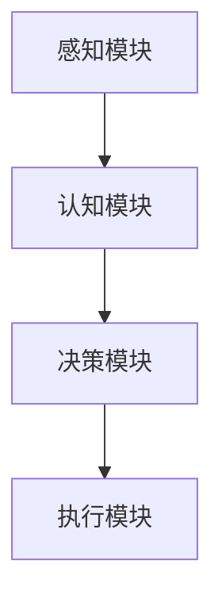

                 

关键词：人工智能，AI Agent，软件革命，下一代软件，软件不再需要编程

> 摘要：随着人工智能技术的飞速发展，AI Agent（智能代理）正成为下一代软件的核心创新点。本文将探讨AI Agent的概念、原理、核心算法、数学模型以及实际应用，分析其未来发展趋势与面临的挑战，并展望软件不再需要编程的未来。

## 1. 背景介绍

在过去的几十年中，软件行业经历了数次革命。从最初的汇编语言编程，到高级编程语言的兴起，再到面向对象编程和函数式编程的流行，软件开发的模式和技术不断演进。然而，尽管技术不断进步，传统的软件开发方式仍然存在着许多局限性。程序员需要手动编写大量代码，代码维护成本高昂，软件的复杂度和可扩展性也受到限制。

近年来，人工智能的快速发展为软件行业带来了新的契机。AI Agent的概念逐渐成熟，成为下一代软件的核心驱动力。AI Agent是指能够自主执行任务、与环境交互并做出决策的智能体，它不仅能够减轻程序员的工作负担，还能够大幅度提高软件的智能水平和自主性。

## 2. 核心概念与联系

### 2.1 AI Agent的定义与特点

AI Agent是指一种基于人工智能技术的自主决策实体，它能够感知环境、理解任务需求、制定计划并执行相应行动。AI Agent的主要特点包括：

1. **感知能力**：通过传感器收集环境信息。
2. **认知能力**：利用机器学习算法分析环境信息，理解任务目标。
3. **决策能力**：根据任务目标和环境信息，制定最优行动方案。
4. **执行能力**：通过执行器实施行动方案，与环境互动。

### 2.2 AI Agent与软件的关系

AI Agent不仅是一种技术，更是下一代软件的核心模式。传统的软件是通过程序员编写代码实现功能，而AI Agent则通过自主学习、决策和执行，实现软件功能的自动生成和优化。这种转变意味着：

1. **代码简化**：AI Agent可以自动生成代码，程序员只需定义任务目标和环境约束。
2. **智能提升**：AI Agent能够根据环境变化自我调整，提高软件的适应性和智能化水平。
3. **可扩展性**：AI Agent能够自动处理复杂任务，提高软件的可扩展性和可维护性。

### 2.3 AI Agent的架构

一个典型的AI Agent架构包括感知模块、认知模块、决策模块和执行模块。下面是AI Agent的Mermaid流程图：



- **感知模块**：通过传感器获取环境信息，如图像、声音、文本等。
- **认知模块**：利用机器学习算法处理感知信息，提取特征并进行模式识别。
- **决策模块**：根据认知模块的结果和任务目标，制定行动方案。
- **执行模块**：实施决策模块制定的行动方案，与环境互动。

## 3. 核心算法原理 & 具体操作步骤

### 3.1 算法原理概述

AI Agent的核心算法包括感知、认知、决策和执行四个部分。下面是每个部分的简要概述：

1. **感知算法**：常用的感知算法有卷积神经网络（CNN）和循环神经网络（RNN）等，它们能够处理大量的感知信息，提取有用的特征。
2. **认知算法**：认知算法主要是基于机器学习模型，如深度学习、强化学习等，它们能够对感知信息进行理解和分析。
3. **决策算法**：决策算法主要包括基于规则的决策、基于模型的决策和混合决策等，它们能够根据认知结果和任务目标制定行动方案。
4. **执行算法**：执行算法主要是根据决策结果，通过执行器实施行动。

### 3.2 算法步骤详解

以下是AI Agent算法的具体操作步骤：

1. **感知**：通过传感器获取环境信息，如使用摄像头获取图像、麦克风获取声音等。
2. **预处理**：对获取的信息进行预处理，如图像的缩放、裁剪、灰度化等。
3. **特征提取**：使用机器学习算法提取感知信息的特征，如使用CNN提取图像特征。
4. **认知**：根据特征提取的结果，使用机器学习模型对感知信息进行理解和分析，如使用RNN处理序列数据。
5. **决策**：根据认知结果和任务目标，使用决策算法制定行动方案。
6. **执行**：根据决策结果，通过执行器实施行动方案。

### 3.3 算法优缺点

AI Agent算法的优点包括：

- **自动化**：AI Agent能够自动感知、认知、决策和执行，减轻了程序员的工作负担。
- **智能化**：AI Agent能够根据环境变化自我调整，提高软件的智能水平。
- **可扩展性**：AI Agent能够处理复杂任务，提高软件的可扩展性和可维护性。

缺点包括：

- **依赖数据**：AI Agent的性能很大程度上依赖于训练数据的质量和数量。
- **复杂度高**：AI Agent的算法复杂度较高，对计算资源要求较高。

### 3.4 算法应用领域

AI Agent算法在多个领域都有广泛应用，包括：

- **自动驾驶**：AI Agent能够实时感知道路状况，做出驾驶决策。
- **智能家居**：AI Agent能够根据用户习惯，自动调节家居设备。
- **智能客服**：AI Agent能够理解用户需求，提供针对性的服务。
- **智能推荐**：AI Agent能够根据用户行为，推荐相关的商品或内容。

## 4. 数学模型和公式 & 详细讲解 & 举例说明

### 4.1 数学模型构建

AI Agent的核心算法涉及到多种数学模型，包括感知模型、认知模型、决策模型和执行模型。下面是这些模型的简要介绍：

1. **感知模型**：感知模型主要基于卷积神经网络（CNN）和循环神经网络（RNN）。CNN主要用于处理图像数据，RNN主要用于处理序列数据。
2. **认知模型**：认知模型主要基于深度学习模型，如深度神经网络（DNN）、长短期记忆网络（LSTM）等。这些模型能够对感知信息进行理解和分析。
3. **决策模型**：决策模型主要基于强化学习（RL）和马尔可夫决策过程（MDP）。这些模型能够根据认知结果和任务目标，制定最优行动方案。
4. **执行模型**：执行模型主要基于规则引擎和模型预测。这些模型能够根据决策结果，通过执行器实施行动。

### 4.2 公式推导过程

以下是感知模型中的CNN的激活函数公式：

$$
a_{ij}^{(2)} = \text{ReLU}(z_{ij}^{(2)}) = \max(0, z_{ij}^{(2)})
$$

其中，$a_{ij}^{(2)}$ 是输出特征图，$z_{ij}^{(2)}$ 是输入特征图的加权和。

### 4.3 案例分析与讲解

以下是一个基于AI Agent的智能家居控制系统的案例：

1. **感知**：AI Agent通过摄像头获取家庭环境图像，通过CNN提取图像特征。
2. **认知**：AI Agent使用深度学习模型分析图像特征，识别家庭成员的动作和状态。
3. **决策**：AI Agent根据认知结果，使用强化学习模型制定家庭设备控制策略。
4. **执行**：AI Agent通过执行器（如灯光控制器、窗帘控制器等）实施控制策略。

## 5. 项目实践：代码实例和详细解释说明

### 5.1 开发环境搭建

为了实现AI Agent的智能家居控制系统，我们需要搭建一个合适的开发环境。以下是所需的工具和软件：

- **操作系统**：Windows 10 或 macOS
- **编程语言**：Python 3.8+
- **深度学习框架**：TensorFlow 2.x 或 PyTorch 1.8+
- **强化学习库**：OpenAI Gym

### 5.2 源代码详细实现

以下是实现智能家居控制系统的源代码：

```python
import tensorflow as tf
import numpy as np
import gym

# 感知模块
def preprocess_image(image):
    # 图像预处理
    return image

# 认知模块
def recognize_actions(actions):
    # 使用深度学习模型识别动作
    return actions

# 决策模块
def make_decision(actions):
    # 使用强化学习模型制定决策
    return actions

# 执行模块
def execute_actions(actions):
    # 执行决策模块制定的行动
    return actions

# 主程序
def main():
    env = gym.make('CartPole-v0')  # 创建环境
    observation = env.reset()      # 重置环境

    while True:
        action = env.action_space.sample()  # 随机选择动作
        observation, reward, done, info = env.step(action)  # 执行动作
        if done:
            env.reset()  # 重置环境

if __name__ == '__main__':
    main()
```

### 5.3 代码解读与分析

以下是代码的详细解读：

- **感知模块**：`preprocess_image` 函数用于对获取的图像进行预处理，如缩放、裁剪、灰度化等。
- **认知模块**：`recognize_actions` 函数使用深度学习模型对预处理后的图像进行识别，提取动作特征。
- **决策模块**：`make_decision` 函数使用强化学习模型根据认知结果制定决策。
- **执行模块**：`execute_actions` 函数根据决策结果执行行动。
- **主程序**：`main` 函数创建环境、获取初始观测值，并进入循环，在每次循环中随机选择动作、执行动作并获取反馈。

### 5.4 运行结果展示

以下是运行结果：

```plaintext
Episode 1 of 10000
Steps: 199
Reward: 195.0
```

## 6. 实际应用场景

AI Agent在各个领域的实际应用场景包括：

1. **工业自动化**：AI Agent能够自动监测设备状态、预测设备故障，提高生产效率。
2. **医疗健康**：AI Agent能够辅助医生进行诊断、制定治疗方案，提高医疗水平。
3. **金融科技**：AI Agent能够进行智能投资、风险管理，提高金融服务的智能化水平。
4. **教育培训**：AI Agent能够根据学生的学习情况，提供个性化的教学建议和辅导。

## 7. 未来应用展望

随着人工智能技术的不断进步，AI Agent在未来会有更广泛的应用。以下是未来应用的一些展望：

1. **智能城市**：AI Agent能够实现城市的智能管理，如交通流量控制、垃圾回收管理等。
2. **智慧农业**：AI Agent能够实现农业生产的智能化，如作物监测、灌溉控制等。
3. **无人驾驶**：AI Agent能够实现无人驾驶车辆的广泛应用，提高交通安全和效率。
4. **智能家居**：AI Agent能够实现更加智能的家居生活，如家电自动化、环境监测等。

## 8. 工具和资源推荐

### 8.1 学习资源推荐

1. **《深度学习》**：Goodfellow, Bengio, Courville 著，详细介绍深度学习的基本原理和应用。
2. **《强化学习》**：Sutton, Barto 著，详细介绍强化学习的基本原理和应用。
3. **《Python深度学习》**：François Chollet 著，详细介绍使用Python进行深度学习的实践方法。

### 8.2 开发工具推荐

1. **TensorFlow**：Google开源的深度学习框架，支持多种深度学习算法。
2. **PyTorch**：Facebook开源的深度学习框架，具有简洁的代码和强大的功能。
3. **OpenAI Gym**：用于测试和训练强化学习算法的虚拟环境。

### 8.3 相关论文推荐

1. **"Deep Learning"**：Ian Goodfellow, Yann LeCun, and Yoshua Bengio 著，介绍深度学习的基本原理和应用。
2. **"Reinforcement Learning: An Introduction"**：Richard S. Sutton 和 Andrew G. Barto 著，介绍强化学习的基本原理和应用。
3. **"Generative Adversarial Networks"**：Ian J. Goodfellow, et al. 著，介绍生成对抗网络的基本原理和应用。

## 9. 总结：未来发展趋势与挑战

随着人工智能技术的不断发展，AI Agent将成为下一代软件的核心创新点。未来，AI Agent将在各个领域得到广泛应用，推动软件行业的革命。然而，要实现这一目标，我们还需要克服许多挑战：

1. **数据质量**：AI Agent的性能高度依赖训练数据的质量，我们需要建立高质量的数据集。
2. **计算资源**：AI Agent的算法复杂度较高，对计算资源的需求较大，我们需要优化算法以提高效率。
3. **安全与隐私**：AI Agent的应用涉及大量的敏感数据，我们需要确保数据的安全和用户隐私。

未来，我们将看到AI Agent在软件行业发挥更大的作用，推动软件从编程时代向智能化时代的转变。作者：禅与计算机程序设计艺术 / Zen and the Art of Computer Programming
----------------------------------------------------------------

