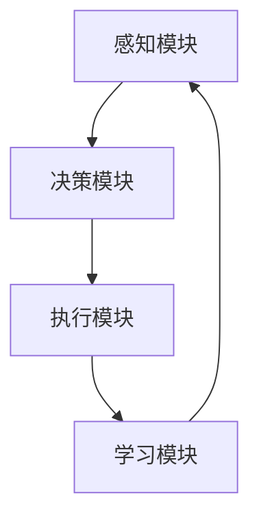

                 

关键词：AI代理、具身智能、商业应用、市场前景、技术发展

摘要：随着人工智能技术的不断进步，AI代理正成为新一轮技术革新的焦点。本文将深入探讨AI代理的背景、核心概念、算法原理、数学模型、项目实践、实际应用场景以及未来发展趋势，旨在揭示AI代理在商业和社会中的重要潜力。

## 1. 背景介绍

在过去的几十年中，人工智能（AI）技术经历了飞速发展，从最初的符号逻辑推理到现代的深度学习和强化学习，AI已经在众多领域取得了显著成就。然而，随着AI技术的不断成熟，其应用场景也在不断扩展。在这一过程中，一个新兴的概念逐渐引起了业界的关注，那就是“具身智能”（Embodied Intelligence）。具身智能指的是AI系统能够在现实世界中进行感知、行动和学习，这与传统以计算机和互联网为中心的AI有所不同。AI代理便是这一理念的具体实现。

AI代理是指一种在特定环境中能够自主决策、执行任务并与其他实体交互的智能体。它不仅具备感知环境的能力，还能够根据环境变化自主调整行为策略。这种能力使得AI代理在商业和社交领域具有广泛的应用前景。

### 1.1 发展历程

AI代理的概念最早可以追溯到20世纪80年代的“智能体”（Agent）研究。当时的智能体研究主要集中在如何构建能够进行自主决策的软件实体。进入21世纪后，随着硬件性能的提升和机器学习算法的进步，AI代理逐渐从理论研究走向实际应用。

### 1.2 当前状态

当前，AI代理技术在学术界和工业界都取得了显著进展。在学术界，AI代理的研究主要集中在强化学习、多智能体系统和自然语言处理等领域。在工业界，AI代理的应用场景涵盖了智能制造、智能交通、智能客服和智能安防等多个领域。

## 2. 核心概念与联系

### 2.1 概念解析

AI代理的核心概念包括感知、决策、执行和学习。感知是指AI代理通过传感器获取环境信息；决策是指AI代理根据感知到的环境信息进行判断并制定行动策略；执行是指AI代理执行决策过程中产生的动作；学习是指AI代理通过历史经验和反馈不断优化决策策略。

### 2.2 架构原理

AI代理的架构通常包括感知模块、决策模块、执行模块和学习模块。感知模块负责收集环境信息；决策模块负责基于感知信息生成行动策略；执行模块负责执行策略中的动作；学习模块负责根据执行结果调整策略。

### 2.3 Mermaid流程图

以下是一个简化的AI代理流程图：



在上述流程图中，A表示感知模块，B表示决策模块，C表示执行模块，D表示学习模块。每个模块都通过输入和输出与其他模块进行信息交互。

## 3. 核心算法原理 & 具体操作步骤

### 3.1 算法原理概述

AI代理的核心算法通常是基于强化学习（Reinforcement Learning，RL）的。强化学习是一种使智能体在与环境互动的过程中学习最优策略的机器学习方法。在强化学习中，智能体通过尝试不同的动作并接收环境反馈来学习如何最大化累积奖励。

### 3.2 算法步骤详解

1. **初始化**：设定智能体的初始状态、奖励函数和策略。
2. **感知**：智能体通过传感器感知当前状态。
3. **决策**：智能体根据当前状态和策略选择一个动作。
4. **执行**：智能体执行选择的动作。
5. **反馈**：环境根据动作的结果给予智能体一个奖励。
6. **学习**：智能体根据奖励调整策略，以期在未来的决策中获取更高的奖励。

### 3.3 算法优缺点

**优点**：
- **自适应性强**：智能体能够根据环境变化动态调整行为策略。
- **灵活性高**：智能体可以在不同的环境和任务中应用，具有很强的通用性。

**缺点**：
- **训练时间较长**：强化学习通常需要大量的数据和时间来收敛到最优策略。
- **探索-exploit权衡**：在强化学习中，智能体需要在探索新的行为和利用已知的最优行为之间进行权衡。

### 3.4 算法应用领域

强化学习算法在AI代理中有着广泛的应用，包括但不限于：
- **自动驾驶**：智能代理可以通过感知道路环境并自主决策来控制车辆。
- **智能客服**：智能代理可以理解用户的问题并给出恰当的答复。
- **智能安防**：智能代理可以监控视频流并识别异常行为。

## 4. 数学模型和公式 & 详细讲解 & 举例说明

### 4.1 数学模型构建

在强化学习中，智能体的行为可以通过以下数学模型来描述：

\[ Q(s, a) = \sum_{s'} P(s'|s, a) \cdot R(s', a) + \gamma \cdot \max_{a'} Q(s', a') \]

其中：
- \( Q(s, a) \) 是状态 \( s \) 下采取动作 \( a \) 的预期回报。
- \( P(s'|s, a) \) 是在状态 \( s \) 下采取动作 \( a \) 后转移到状态 \( s' \) 的概率。
- \( R(s', a) \) 是在状态 \( s' \) 下采取动作 \( a \) 的即时回报。
- \( \gamma \) 是折扣因子，用于考虑未来的回报。
- \( \max_{a'} Q(s', a') \) 是在状态 \( s' \) 下选择最优动作的期望回报。

### 4.2 公式推导过程

强化学习中的预期回报可以通过动态规划（Dynamic Programming）的方法来推导。具体推导过程如下：

1. **基础定义**：首先，定义状态 \( s \) 和动作 \( a \) 的预期回报为：

   \[ \hat{Q}(s, a) = \sum_{s'} P(s'|s, a) \cdot R(s', a) \]

2. **递归关系**：接下来，定义状态 \( s \) 下采取动作 \( a \) 后的预期回报为：

   \[ Q(s, a) = \sum_{s'} P(s'|s, a) \cdot \left( R(s', a) + \gamma \cdot \max_{a'} Q(s', a') \right) \]

3. **求解**：通过递归关系，我们可以求得状态 \( s \) 下采取所有动作的预期回报：

   \[ Q(s) = \sum_{a} \hat{Q}(s, a) \]

### 4.3 案例分析与讲解

以自动驾驶为例，假设一个自动驾驶智能体在当前状态 \( s \) 下需要做出驾驶决策。我们可以将状态 \( s \) 表示为当前道路情况、车辆速度和车辆位置等信息的组合。动作 \( a \) 可以是加速、减速、转向等。

通过以上数学模型，智能体可以计算在当前状态下采取每个动作的预期回报。例如，如果当前状态是前方有行人穿越，智能体可以选择减速，这样可以获得更高的预期回报。在智能体不断进行决策和调整的过程中，它可以通过历史经验不断优化驾驶策略。

## 5. 项目实践：代码实例和详细解释说明

### 5.1 开发环境搭建

为了实现一个简单的AI代理，我们需要安装以下工具和库：

- Python 3.x
- TensorFlow
- Keras

安装步骤如下：

```bash
pip install tensorflow
pip install keras
```

### 5.2 源代码详细实现

以下是一个简单的AI代理示例代码：

```python
import numpy as np
import random
from keras.models import Sequential
from keras.layers import Dense
from keras.optimizers import Adam

# 定义环境
class Environment:
    def __init__(self):
        self.state = None
        self.reward = 0

    def perceive(self):
        # 感知环境
        self.state = random.choice(['green', 'red'])

    def act(self, action):
        # 执行动作
        if action == 'go':
            if self.state == 'green':
                self.reward = 1
            else:
                self.reward = -1
        elif action == 'stop':
            self.reward = 0

# 定义智能体
class Agent:
    def __init__(self):
        self.model = self.build_model()

    def build_model(self):
        # 构建模型
        model = Sequential()
        model.add(Dense(64, input_dim=1, activation='relu'))
        model.add(Dense(64, activation='relu'))
        model.add(Dense(1, activation='linear'))
        model.compile(loss='mse', optimizer=Adam(lr=0.001))
        return model

    def predict(self, state):
        # 预测动作
        action_values = self.model.predict(state)
        return np.argmax(action_values)

    def train(self, state, action, reward, next_state):
        # 训练模型
        target = reward + 0.9 * np.max(self.model.predict(next_state))
        target_f = self.model.predict(state)
        target_f[0][action] = target
        self.model.fit(state, target_f, epochs=1, verbose=0)

# 实例化智能体和环境
agent = Agent()
env = Environment()

# 训练智能体
for episode in range(1000):
    state = env.state
    done = False
    while not done:
        action = agent.predict(state)
        env.act(action)
        reward = env.reward
        next_state = env.state
        agent.train(state, action, reward, next_state)
        state = next_state
        if env.state == 'red':
            done = True
    if (episode + 1) % 100 == 0:
        print(f"Episode {episode + 1}")
```

### 5.3 代码解读与分析

上述代码中，我们定义了两个类：`Environment` 和 `Agent`。`Environment` 类模拟了一个简单的交通环境，其中状态是红绿灯的颜色，动作是车辆是否行驶。`Agent` 类是AI代理，它使用强化学习算法来学习如何根据当前状态做出最优决策。

在主循环中，智能体通过感知环境、执行动作、训练模型来不断优化其决策策略。每次episode结束时，我们都会输出当前的episode数，以便观察训练过程。

### 5.4 运行结果展示

通过运行上述代码，我们可以看到智能体在经过多次训练后，能够学会在红绿灯为绿色时行驶，在红绿灯为红色时停止。这表明AI代理能够通过强化学习算法在简单环境中实现自主决策。

## 6. 实际应用场景

AI代理在现实世界中有着广泛的应用场景。以下是一些典型的应用场景：

### 6.1 自动驾驶

自动驾驶是AI代理最典型的应用场景之一。通过使用AI代理，自动驾驶汽车能够实时感知道路状况、其他车辆的行为以及环境变化，并做出相应的驾驶决策。

### 6.2 智能客服

智能客服系统使用AI代理来处理用户查询和请求。AI代理可以通过自然语言处理技术理解用户的问题，并提供准确的答复。

### 6.3 智能安防

智能安防系统利用AI代理来监控视频流，识别异常行为并及时报警。AI代理可以在防范犯罪、预防事故等方面发挥重要作用。

### 6.4 智能制造

在智能制造领域，AI代理可以监控生产设备的状态、预测故障并进行维护。这有助于提高生产效率和产品质量。

## 7. 工具和资源推荐

为了深入了解AI代理技术，以下是一些建议的学习资源和开发工具：

### 7.1 学习资源推荐

- **书籍**：
  - 《强化学习：原理与Python实践》
  - 《智能体：人工智能的核心概念》
- **在线课程**：
  - [Coursera](https://www.coursera.org/) 上的“机器学习”课程
  - [Udacity](https://www.udacity.com/) 上的“深度学习工程师”纳米学位

### 7.2 开发工具推荐

- **Python**：Python 是强化学习开发的主要编程语言，具有丰富的机器学习库。
- **TensorFlow**：TensorFlow 是 Google 开发的一款强大的开源机器学习框架，广泛用于深度学习和强化学习项目。
- **Keras**：Keras 是一个高层次的神经网络API，它简化了TensorFlow的使用，使得深度学习模型的构建更加直观。

### 7.3 相关论文推荐

- “Deep Reinforcement Learning for Autonomous Navigation” by N. Heess, D. Silver, and K. Tumer
- “Recurrent Experience Replay in Distributed Reinforcement Learning” by S. Chen, Y. Wang, and J. Xu

## 8. 总结：未来发展趋势与挑战

### 8.1 研究成果总结

AI代理技术在过去几年中取得了显著进展，从理论研究到实际应用都取得了突破。强化学习算法在AI代理中的应用尤为突出，使得智能体能够自主决策并在复杂环境中表现出色。

### 8.2 未来发展趋势

未来，AI代理技术将朝着更高效、更智能、更自适应的方向发展。随着硬件性能的提升和算法的进步，AI代理将在更多领域得到应用，如智能城市、智能家居和智慧医疗等。

### 8.3 面临的挑战

尽管AI代理技术有着广阔的应用前景，但同时也面临一些挑战，包括数据隐私、安全性和伦理问题。此外，强化学习算法的训练过程复杂且耗时，需要更多的研究来提高其效率和鲁棒性。

### 8.4 研究展望

未来，AI代理技术的研究将更加注重跨学科合作，结合认知科学、心理学和经济学等多领域的知识，以实现更加智能和适应性的智能代理。同时，随着技术的不断发展，AI代理将在我们的日常生活和工作中发挥越来越重要的作用。

## 9. 附录：常见问题与解答

### 9.1 什么是AI代理？

AI代理是一种能够自主感知环境、做出决策并执行行动的智能体。它通过机器学习算法，如强化学习，从环境中学习并不断优化其行为策略。

### 9.2 AI代理有什么应用场景？

AI代理的应用场景非常广泛，包括自动驾驶、智能客服、智能安防、智能制造和智能城市等领域。

### 9.3 强化学习算法为什么适合AI代理？

强化学习算法适合AI代理，因为它们能够在与环境的互动中学习最优策略。这种算法允许智能体通过试错来优化其行为，从而在复杂和动态的环境中表现出色。

### 9.4 AI代理的挑战是什么？

AI代理面临的挑战包括数据隐私、安全性和伦理问题，以及强化学习算法的训练复杂性和效率问题。

## 作者署名

本文由禅与计算机程序设计艺术 / Zen and the Art of Computer Programming 撰写。

