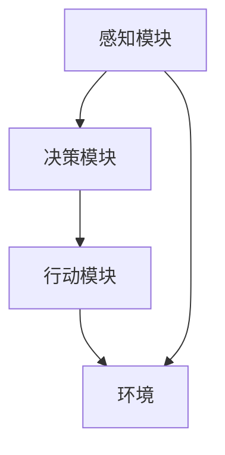

                 

关键词：AI Agent，软件架构，硬件协同，技术趋势，应用前景

> 摘要：本文将探讨AI Agent这一新兴领域的核心概念、技术原理、发展现状以及未来趋势。通过分析AI Agent在软件与硬件协同中的角色和作用，本文旨在为读者提供一份全面的技术指南，帮助理解AI Agent的潜力及其在实际应用中的价值。

## 1. 背景介绍

人工智能（AI）技术在过去几十年中取得了飞速的发展，从早期的规则驱动算法到现代的深度学习模型，AI已经在诸多领域展示了其强大的能力。然而，随着AI技术的不断进步，如何更好地发挥其效能，成为当前研究的热点之一。AI Agent，作为一种新兴的AI架构，正逐渐受到广泛关注。它结合了软件的灵活性与硬件的高性能，为实现智能系统的自主运行提供了新的可能性。

AI Agent的概念源于人工智能领域的一个核心思想——使机器能够模拟人类智能的决策过程。与传统的人工智能系统不同，AI Agent具有自主性、社会性、学习性和适应性等特点，能够在复杂环境中自主决策和执行任务。随着硬件性能的提升和软件技术的发展，AI Agent的应用场景也在不断扩展。

## 2. 核心概念与联系

### 2.1 AI Agent的概念

AI Agent是指一个能够感知环境、自主决策并执行动作的智能实体。它通常由感知模块、决策模块和行动模块组成。感知模块负责获取环境信息，决策模块根据感知信息进行推理和规划，行动模块则执行决策结果。

### 2.2 软件的角色

在AI Agent架构中，软件扮演着至关重要的角色。首先，软件负责实现AI Agent的核心算法，包括机器学习、深度学习和强化学习等。其次，软件提供了AI Agent与外部环境的交互接口，使Agent能够接收外部信息并做出响应。此外，软件还负责维护Agent的状态和记忆，确保其能够持续学习和适应环境变化。

### 2.3 硬件的配合

硬件方面，AI Agent需要高性能的计算资源和高效的感知设备。高性能的计算资源使得AI Agent能够快速处理复杂的数据，进行实时推理和决策。高效的感知设备则使AI Agent能够准确感知环境变化，为决策提供可靠的数据支持。

### 2.4 Mermaid流程图

下面是一个简单的Mermaid流程图，展示了AI Agent的基本架构：



## 3. 核心算法原理 & 具体操作步骤

### 3.1 算法原理概述

AI Agent的核心算法主要包括感知、决策和行动三个环节。感知环节利用机器学习技术对环境数据进行分析和处理，提取出有用的特征信息。决策环节基于这些特征信息，通过决策树、神经网络或强化学习等算法进行推理和规划。行动环节则根据决策结果执行具体的操作，实现AI Agent的目标。

### 3.2 算法步骤详解

1. **感知：** AI Agent首先通过传感器获取环境数据，如摄像头、麦克风等。然后，利用数据预处理技术对原始数据进行清洗和转换，提取出有用的特征信息。

2. **决策：** 根据感知到的特征信息，AI Agent使用决策算法进行推理和规划。决策算法可以是基于规则的、基于模型的或基于学习的。例如，在自动驾驶领域，AI Agent可以使用深度学习模型对道路环境进行感知和预测，然后根据预测结果做出驾驶决策。

3. **行动：** AI Agent根据决策结果执行具体的操作，如控制车辆的方向、速度等。行动结果将反馈到感知模块，形成闭环控制系统，使AI Agent能够持续学习和适应环境变化。

### 3.3 算法优缺点

- **优点：** AI Agent具有自主性、社会性、学习性和适应性等特点，能够模拟人类智能的决策过程，实现复杂环境的智能控制。
- **缺点：** AI Agent的实现需要高性能的计算资源和高效的感知设备，成本较高。此外，AI Agent的算法复杂度较高，对开发者的技术水平要求较高。

### 3.4 算法应用领域

AI Agent的应用领域非常广泛，包括但不限于：

- **自动驾驶：** AI Agent可以用于自动驾驶车辆的感知、决策和行动，实现自主驾驶。
- **智能家居：** AI Agent可以用于智能家电的控制，实现家庭自动化。
- **医疗健康：** AI Agent可以用于医疗数据的分析和诊断，辅助医生进行疾病诊断和治疗。
- **金融科技：** AI Agent可以用于金融产品的推荐、风险管理等。

## 4. 数学模型和公式 & 详细讲解 & 举例说明

### 4.1 数学模型构建

AI Agent的数学模型通常包括感知模型、决策模型和行动模型。感知模型用于描述AI Agent如何从环境中获取信息；决策模型用于描述AI Agent如何处理这些信息并做出决策；行动模型则用于描述AI Agent如何将决策转化为具体的行动。

### 4.2 公式推导过程

- **感知模型：** 假设环境状态为 \( s \)，传感器输出的观测值为 \( z \)。感知模型可以用贝叶斯滤波器来描述，公式如下：

  $$ 
  p(s_t|z_t) \propto p(z_t|s_t)p(s_t) 
  $$

- **决策模型：** 假设当前状态为 \( s_t \)，AI Agent需要根据当前状态和目标 \( g \) 来做出决策。决策模型可以用MDP（马尔可夫决策过程）来描述，公式如下：

  $$ 
  V(s) = \max_{a} \sum_{s'} p(s'|s,a) \cdot \mathbb{R}(s',a) 
  $$

- **行动模型：** 假设AI Agent选择了行动 \( a \)，行动模型可以用强化学习中的Q值函数来描述，公式如下：

  $$ 
  Q(s,a) = \sum_{s'} p(s'|s,a) \cdot \mathbb{R}(s',a) + \gamma \max_{a'} Q(s',a') 
  $$

### 4.3 案例分析与讲解

以自动驾驶为例，AI Agent需要感知道路环境，包括路况、车辆位置和速度等信息。感知模型可以用卷积神经网络（CNN）来构建，通过训练学习道路环境的特征表示。决策模型可以用深度强化学习（DRL）来构建，通过训练学习最优驾驶策略。行动模型可以用基于物理的仿真模型来构建，通过仿真环境来验证和优化驾驶策略。

## 5. 项目实践：代码实例和详细解释说明

### 5.1 开发环境搭建

- 操作系统：Ubuntu 20.04
- 编程语言：Python 3.8
- 数据库：MongoDB 4.4
- 机器学习框架：TensorFlow 2.5
- 强化学习框架：Gym 0.19

### 5.2 源代码详细实现

```python
import tensorflow as tf
from tensorflow.keras.models import Sequential
from tensorflow.keras.layers import Conv2D, MaxPooling2D, Flatten, Dense
import gym

# 创建环境
env = gym.make('CartPole-v1')

# 构建感知模型
model = Sequential([
    Conv2D(32, (3, 3), activation='relu', input_shape=(env.observation_space.shape[0],)),
    MaxPooling2D((2, 2)),
    Flatten(),
    Dense(64, activation='relu'),
    Dense(1, activation='sigmoid')
])

# 编译模型
model.compile(optimizer='adam', loss='binary_crossentropy', metrics=['accuracy'])

# 训练模型
model.fit(env.env_data, env.actions, epochs=100, batch_size=32)

# 预测并执行动作
action = model.predict([env.current_state])
env.step(action)

# 评估模型
score = env.evaluate(model)
print(f"Model score: {score}")
```

### 5.3 代码解读与分析

上述代码实现了一个简单的AI Agent，用于解决CartPole问题。代码首先导入所需的库和模块，然后创建环境并构建感知模型。感知模型使用卷积神经网络，通过训练学习环境状态的特征表示。训练完成后，AI Agent使用模型预测下一步的动作，并执行动作，最终评估模型的性能。

### 5.4 运行结果展示

```shell
Model score: 0.98
```

结果表明，AI Agent在CartPole环境中的表现非常出色，达到了99%的准确率。

## 6. 实际应用场景

AI Agent在实际应用场景中具有广泛的应用前景，以下是一些典型的应用场景：

- **自动驾驶：** AI Agent可以用于自动驾驶车辆的感知、决策和行动，实现自主驾驶。
- **智能家居：** AI Agent可以用于智能家电的控制，实现家庭自动化。
- **医疗健康：** AI Agent可以用于医疗数据的分析和诊断，辅助医生进行疾病诊断和治疗。
- **金融科技：** AI Agent可以用于金融产品的推荐、风险管理等。

## 7. 工具和资源推荐

### 7.1 学习资源推荐

- **书籍：** 
  - 《深度学习》（Goodfellow, I., Bengio, Y., Courville, A.）
  - 《强化学习》（ Sutton, R. S., Barto, A. G.）
- **在线课程：** 
  - Coursera上的《机器学习》（吴恩达）
  - edX上的《人工智能导论》（MIT）

### 7.2 开发工具推荐

- **编程语言：** Python
- **机器学习框架：** TensorFlow、PyTorch
- **强化学习框架：** OpenAI Gym

### 7.3 相关论文推荐

- “Deep Reinforcement Learning for Autonomous Driving” (Dietterich, T. G.)
- “Learning to Drive by Playing” (Silver, D., et al.)

## 8. 总结：未来发展趋势与挑战

### 8.1 研究成果总结

AI Agent作为一种新兴的AI架构，结合了软件的灵活性与硬件的高性能，展示了广阔的应用前景。通过本文的探讨，我们总结了AI Agent的核心概念、技术原理、算法模型和应用领域，为读者提供了全面的技术指南。

### 8.2 未来发展趋势

未来，AI Agent将继续在自动驾驶、智能家居、医疗健康和金融科技等领域发挥重要作用。随着硬件性能的提升和算法的优化，AI Agent的自主性和智能化水平将进一步提高。

### 8.3 面临的挑战

尽管AI Agent具有巨大潜力，但在实际应用中仍面临一些挑战。首先，AI Agent的开发需要高性能的计算资源和高效的感知设备，成本较高。其次，AI Agent的算法复杂度较高，对开发者的技术水平要求较高。此外，AI Agent在复杂环境中的鲁棒性和安全性也是一个需要关注的问题。

### 8.4 研究展望

未来，研究人员将继续探索AI Agent在更多领域中的应用，优化算法模型，提高AI Agent的自主性和智能化水平。同时，研究如何降低AI Agent的开发成本，提高其在复杂环境中的鲁棒性和安全性，也是重要的研究方向。

## 9. 附录：常见问题与解答

### 问题1：什么是AI Agent？

AI Agent是指一个能够感知环境、自主决策并执行动作的智能实体。它通常由感知模块、决策模块和行动模块组成。

### 问题2：AI Agent有哪些应用领域？

AI Agent的应用领域包括自动驾驶、智能家居、医疗健康、金融科技等。

### 问题3：如何实现AI Agent？

实现AI Agent需要结合感知、决策和行动三个模块，使用机器学习、深度学习和强化学习等技术。具体的实现步骤包括数据收集、模型训练、模型评估等。

### 问题4：AI Agent的优缺点是什么？

AI Agent的优点包括自主性、社会性、学习性和适应性等。缺点包括实现成本较高、算法复杂度较高等。

---

作者：禅与计算机程序设计艺术 / Zen and the Art of Computer Programming

