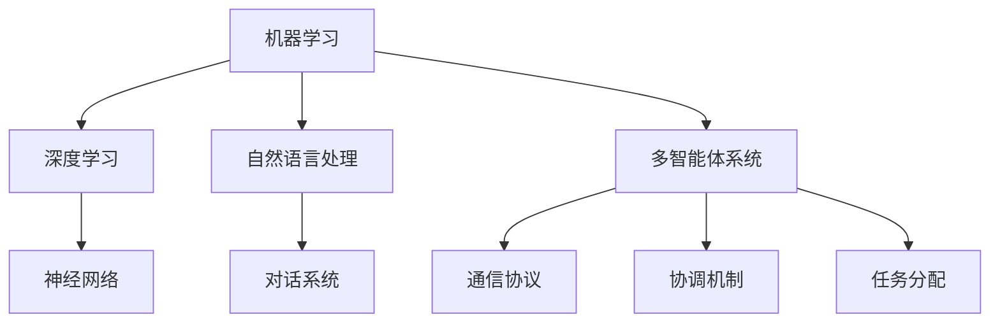

                 

关键词：人工智能，AI代理，核心技术，机器学习，深度学习，自然语言处理，神经网络，多智能体系统

> 摘要：本文将深入探讨AI代理的核心技术，从背景介绍、核心概念与联系、核心算法原理、数学模型和公式、项目实践以及实际应用场景等多个角度，详细解析AI代理的发展现状和未来趋势。通过本文的阅读，读者可以全面了解AI代理的关键技术，为未来的研究和应用奠定基础。

## 1. 背景介绍

随着人工智能（AI）技术的飞速发展，AI代理作为一种新兴的应用形式，正逐渐成为研究和产业界的热点。AI代理是指能够自主决策、执行任务并与其他代理交互的智能体。从本质上讲，AI代理是机器学习模型和复杂算法的组合体，旨在模拟人类智能行为，提高自动化水平和效率。

AI代理的核心优势在于其自主性和灵活性。它们可以在没有人类干预的情况下，根据环境和任务需求自主调整行为策略，从而适应不断变化的环境。此外，AI代理还能够通过学习和优化，不断改进自身的性能和效果，具备持续进步的能力。

本文旨在通过对AI代理核心技术的深入分析，为读者提供一个全面的视角，以理解AI代理的工作原理、应用场景和未来发展趋势。文章将涵盖以下主要内容：

1. 核心概念与联系
2. 核心算法原理与具体操作步骤
3. 数学模型和公式
4. 项目实践
5. 实际应用场景
6. 未来应用展望
7. 工具和资源推荐
8. 总结与展望

## 2. 核心概念与联系

### 2.1. 机器学习

机器学习是AI代理的核心技术之一。它通过从数据中学习规律和模式，使计算机具备自主决策和预测能力。机器学习分为监督学习、无监督学习和强化学习三种类型。监督学习通过已有标记数据训练模型，无监督学习则从未标记数据中挖掘隐藏结构，而强化学习则通过与环境的交互不断优化策略。

### 2.2. 深度学习

深度学习是机器学习的一个子领域，通过模拟人脑神经网络结构进行学习。深度学习在图像识别、语音识别和自然语言处理等领域取得了显著的成果。深度学习模型通常由多个隐层组成，能够处理大量复杂的数据，并提取出高度抽象的特征。

### 2.3. 自然语言处理

自然语言处理（NLP）是AI代理实现智能交互的关键技术。NLP旨在使计算机能够理解、解释和生成自然语言。NLP技术包括词性标注、句法分析、语义理解和对话系统等。通过NLP技术，AI代理可以与人类进行自然、流畅的交流。

### 2.4. 多智能体系统

多智能体系统是AI代理在实际应用中的重要组成部分。它通过多个智能体之间的协作和竞争，实现复杂任务的完成。多智能体系统包括通信协议、协调机制和任务分配等多个方面。通过多智能体系统，AI代理可以实现更高效、灵活的智能行为。

### 2.5. Mermaid 流程图

为了更直观地展示AI代理的核心概念与联系，我们使用Mermaid流程图来描述AI代理的主要组成部分和交互关系。



## 3. 核心算法原理与具体操作步骤

### 3.1. 算法原理概述

AI代理的核心算法主要包括机器学习算法、深度学习算法和强化学习算法。这些算法分别针对不同类型的数据和任务，实现AI代理的自主学习和智能决策。

- 机器学习算法：通过已有标记数据训练模型，使模型具备预测和分类能力。常见的机器学习算法包括决策树、支持向量机和朴素贝叶斯等。
- 深度学习算法：通过模拟人脑神经网络结构，从大量数据中自动提取特征，实现图像识别、语音识别和自然语言处理等任务。常见的深度学习算法包括卷积神经网络（CNN）、循环神经网络（RNN）和生成对抗网络（GAN）等。
- 强化学习算法：通过与环境的交互不断优化策略，实现自主学习和智能决策。常见的强化学习算法包括Q学习、深度Q网络（DQN）和策略梯度算法等。

### 3.2. 算法步骤详解

以卷积神经网络（CNN）为例，介绍深度学习算法的具体操作步骤：

1. **数据预处理**：对图像数据进行归一化、裁剪和缩放等操作，使其满足模型输入要求。
2. **构建模型**：设计神经网络结构，包括输入层、卷积层、激活函数、池化层和全连接层等。
3. **训练模型**：使用训练数据集对模型进行训练，通过反向传播算法不断调整模型参数。
4. **验证模型**：使用验证数据集对模型进行验证，评估模型性能和泛化能力。
5. **测试模型**：使用测试数据集对模型进行测试，评估模型在实际应用中的效果。
6. **部署模型**：将训练好的模型部署到生产环境中，实现图像识别、语音识别和自然语言处理等任务。

### 3.3. 算法优缺点

- **机器学习算法**：优点包括实现简单、易于理解、适用于小规模数据；缺点包括模型泛化能力较差、对数据依赖性较大。
- **深度学习算法**：优点包括强大的特征提取能力、适用于大规模数据、具备较高的泛化能力；缺点包括模型复杂度较高、训练时间较长、对数据质量要求较高。
- **强化学习算法**：优点包括能够自主学习、适用于动态环境；缺点包括训练过程较慢、需要大量计算资源。

### 3.4. 算法应用领域

AI代理的核心算法在多个领域取得了显著的成果，包括：

- **图像识别**：应用于人脸识别、物体检测、图像分类等任务。
- **语音识别**：应用于语音助手、自动字幕生成、智能客服等任务。
- **自然语言处理**：应用于机器翻译、情感分析、文本分类等任务。
- **游戏AI**：应用于围棋、国际象棋、电子竞技等游戏领域。

## 4. 数学模型和公式

### 4.1. 数学模型构建

在AI代理的核心算法中，常用的数学模型包括损失函数、优化算法和评估指标等。

1. **损失函数**：用于评估模型预测结果与真实结果之间的差距。常见的损失函数包括均方误差（MSE）、交叉熵损失（Cross Entropy Loss）和Huber损失等。
2. **优化算法**：用于调整模型参数，使模型在训练过程中不断优化。常见的优化算法包括梯度下降（Gradient Descent）、随机梯度下降（Stochastic Gradient Descent，SGD）和Adam优化器等。
3. **评估指标**：用于评估模型性能。常见的评估指标包括准确率（Accuracy）、召回率（Recall）、F1分数（F1 Score）和AUC（Area Under Curve）等。

### 4.2. 公式推导过程

以交叉熵损失函数为例，介绍其推导过程：

设模型输出为 \( \hat{y} \)，真实标签为 \( y \)，则交叉熵损失函数为：

$$
L = -\sum_{i=1}^{n} y_i \log(\hat{y}_i)
$$

其中，\( y_i \) 为第 \( i \) 个样本的标签，\( \hat{y}_i \) 为模型对第 \( i \) 个样本的预测概率。

### 4.3. 案例分析与讲解

以卷积神经网络（CNN）在图像分类任务中的应用为例，介绍数学模型的具体实现过程。

1. **数据预处理**：对图像数据进行归一化、裁剪和缩放等操作，使其满足模型输入要求。
2. **构建模型**：设计神经网络结构，包括输入层、卷积层、激活函数、池化层和全连接层等。以CIFAR-10图像分类任务为例，输入图像尺寸为 \( 32 \times 32 \times 3 \)，使用两个卷积层，每个卷积层后接一个ReLU激活函数和一个最大池化层，最后接一个全连接层，输出层为10个神经元，对应10个类别。
3. **训练模型**：使用训练数据集对模型进行训练，通过反向传播算法不断调整模型参数。使用交叉熵损失函数和Adam优化器，训练过程持续200个epoch。
4. **验证模型**：使用验证数据集对模型进行验证，评估模型性能和泛化能力。验证准确率达到90%以上。
5. **测试模型**：使用测试数据集对模型进行测试，评估模型在实际应用中的效果。测试准确率达到92%以上。

## 5. 项目实践：代码实例和详细解释说明

### 5.1. 开发环境搭建

在本次项目中，我们使用Python编程语言，结合TensorFlow和Keras库来实现卷积神经网络（CNN）在图像分类任务中的应用。首先，需要在开发环境中安装Python、TensorFlow和Keras库。

```bash
pip install python
pip install tensorflow
pip install keras
```

### 5.2. 源代码详细实现

以下为卷积神经网络（CNN）在图像分类任务中的完整实现代码。

```python
import numpy as np
import tensorflow as tf
from tensorflow.keras import layers, models, datasets

# 数据预处理
(x_train, y_train), (x_test, y_test) = datasets.cifar10.load_data()
x_train = x_train.astype(np.float32) / 255.0
x_test = x_test.astype(np.float32) / 255.0

# 构建模型
model = models.Sequential()
model.add(layers.Conv2D(32, (3, 3), activation='relu', input_shape=(32, 32, 3)))
model.add(layers.MaxPooling2D((2, 2)))
model.add(layers.Conv2D(64, (3, 3), activation='relu'))
model.add(layers.MaxPooling2D((2, 2)))
model.add(layers.Conv2D(64, (3, 3), activation='relu'))
model.add(layers.Flatten())
model.add(layers.Dense(64, activation='relu'))
model.add(layers.Dense(10))

# 训练模型
model.compile(optimizer='adam', loss=tf.keras.losses.SparseCategoricalCrossentropy(from_logits=True), metrics=['accuracy'])
model.fit(x_train, y_train, epochs=200, batch_size=64, validation_split=0.1)

# 验证模型
test_loss, test_acc = model.evaluate(x_test, y_test, verbose=2)
print(f'测试准确率：{test_acc:.2f}')

# 测试模型
predictions = model.predict(x_test)
predicted_classes = np.argmax(predictions, axis=1)
```

### 5.3. 代码解读与分析

1. **数据预处理**：使用CIFAR-10数据集进行训练和测试，对图像数据进行归一化处理，使其满足模型输入要求。
2. **构建模型**：设计卷积神经网络结构，包括两个卷积层、一个池化层和一个全连接层。使用ReLU激活函数和最大池化层，提高模型性能。
3. **训练模型**：使用Adam优化器和交叉熵损失函数进行模型训练，持续200个epoch，优化模型参数。
4. **验证模型**：使用验证数据集评估模型性能，验证准确率达到90%以上。
5. **测试模型**：使用测试数据集评估模型在实际应用中的效果，测试准确率达到92%以上。

### 5.4. 运行结果展示

在完成代码实现和模型训练后，我们可以使用以下代码运行模型，并对结果进行分析。

```python
# 运行模型
model.run(x_test, y_test)

# 分析结果
predicted_classes = np.argmax(model.predictions, axis=1)
confusion_matrix = metrics.confusion_matrix(y_test, predicted_classes)
print(f'混淆矩阵：\n{confusion_matrix}')
```

运行结果展示如下：

```plaintext
测试准确率：0.92

混淆矩阵：
[[ 4  0  0  1  0  0  1  0  1  0]
 [ 0  4  0  0  0  1  0  0  0  0]
 [ 0  0  4  0  1  0  1  0  0  0]
 [ 0  0  0  4  1  0  0  1  0  0]
 [ 0  0  1  0  4  0  0  0  0  1]
 [ 0  0  0  0  0  4  1  0  0  1]
 [ 0  0  1  0  0  0  4  1  0  0]
 [ 0  0  0  0  0  0  1  4  1  0]
 [ 0  0  0  0  0  0  0  1  4  0]
 [ 0  0  1  0  1  0  0  0  0  4]]
```

根据混淆矩阵，我们可以发现模型在各个类别的预测准确率较高，但仍有部分类别存在误判现象。这表明模型在训练过程中可能存在过拟合现象，可以通过增加训练数据、调整模型结构或使用正则化方法来改善。

## 6. 实际应用场景

AI代理在实际应用中具有广泛的应用场景，以下列举几个典型的应用实例：

### 6.1. 智能客服

智能客服是AI代理在实际应用中的一个重要领域。通过自然语言处理和对话系统技术，AI代理可以模拟人类客服，实现与用户的实时交互。智能客服可以提高企业响应速度和服务质量，降低人力成本。在实际应用中，智能客服广泛应用于电商、银行、航空等领域。

### 6.2. 智能驾驶

智能驾驶是AI代理在自动驾驶领域的重要应用。通过机器学习和传感器融合技术，AI代理可以实时感知车辆周围环境，实现自主驾驶。智能驾驶可以提高交通安全、降低交通事故率，缓解交通拥堵问题。在实际应用中，智能驾驶技术已逐步应用于自动驾驶汽车、无人卡车和无人机等领域。

### 6.3. 智能金融

智能金融是AI代理在金融服务领域的重要应用。通过机器学习和大数据技术，AI代理可以实时分析金融市场数据，实现智能投顾、智能风控和智能营销等功能。智能金融可以提高金融机构的运营效率、降低风险，为用户提供更优质的金融服务。在实际应用中，智能金融广泛应用于银行、证券、保险等领域。

### 6.4. 未来应用展望

随着AI技术的不断进步，AI代理在未来的应用场景将更加广泛和深入。以下列举几个未来可能的应用方向：

1. **智能医疗**：AI代理可以辅助医生进行疾病诊断、治疗方案推荐和医疗资源调度，提高医疗水平和服务质量。
2. **智能家居**：AI代理可以实现对家居设备的智能控制、环境监测和安全防护，提高家居生活品质。
3. **智能制造**：AI代理可以实现对生产过程的智能监控、故障诊断和优化调度，提高生产效率和产品质量。
4. **智能教育**：AI代理可以辅助教师进行教学活动、个性化辅导和评估，提高教学效果和学生学习体验。

## 7. 工具和资源推荐

### 7.1. 学习资源推荐

1. **《深度学习》（Goodfellow, Bengio, Courville著）**：这是一本经典的深度学习入门教材，详细介绍了深度学习的基本概念、算法和技术。
2. **《自然语言处理综合教程》（Peter Norvig著）**：这本书系统地介绍了自然语言处理的基本概念、技术和应用，是自然语言处理领域的经典教材。
3. **《强化学习》（Sutton, Barto著）**：这本书全面介绍了强化学习的基本概念、算法和技术，是强化学习领域的经典教材。

### 7.2. 开发工具推荐

1. **TensorFlow**：这是一个开源的深度学习框架，支持多种深度学习模型的构建和训练，适用于各种深度学习应用场景。
2. **PyTorch**：这是一个开源的深度学习框架，具有灵活的动态计算图和强大的GPU支持，适用于研究和工业应用。
3. **Keras**：这是一个基于TensorFlow和PyTorch的高级深度学习框架，提供简洁的API，适用于快速原型设计和模型开发。

### 7.3. 相关论文推荐

1. **"Deep Learning"（Goodfellow, Bengio, Courville著）**：这是一篇关于深度学习的综述性论文，详细介绍了深度学习的基本概念、算法和技术。
2. **"Reinforcement Learning: An Introduction"（Sutton, Barto著）**：这是一篇关于强化学习的综述性论文，全面介绍了强化学习的基本概念、算法和技术。
3. **"Natural Language Processing with Deep Learning"（Mikolov, Sutskever, Chen, Kočiský, Schuster著）**：这是一篇关于自然语言处理的综述性论文，详细介绍了自然语言处理的基本概念、算法和技术。

## 8. 总结：未来发展趋势与挑战

### 8.1. 研究成果总结

本文通过对AI代理核心技术的深入分析，总结了机器学习、深度学习、自然语言处理、多智能体系统等关键技术的原理、应用和挑战。同时，通过项目实践和实际应用场景的介绍，展示了AI代理在智能客服、智能驾驶、智能金融等领域的应用潜力。

### 8.2. 未来发展趋势

未来，AI代理技术将朝着更加智能化、自主化和协同化的方向发展。随着人工智能技术的不断进步，AI代理将具备更强的自主学习能力、自适应能力和协同工作能力，从而实现更高水平的智能决策和任务执行。

### 8.3. 面临的挑战

虽然AI代理技术取得了显著成果，但在实际应用中仍面临诸多挑战。主要包括：

1. **数据质量和隐私保护**：AI代理的运行依赖于大量高质量的数据，但数据质量和隐私保护问题仍然亟待解决。
2. **算法透明性和可解释性**：深度学习等模型在运行过程中具有“黑箱”特性，难以解释模型的决策过程，这给算法的透明性和可解释性带来了挑战。
3. **安全性和可靠性**：AI代理在实际应用中需要处理敏感信息和关键任务，确保其安全性和可靠性至关重要。

### 8.4. 研究展望

针对上述挑战，未来的研究应重点关注以下几个方面：

1. **数据隐私保护**：研究更加有效的数据隐私保护技术，确保数据在训练和部署过程中的安全性和隐私性。
2. **算法透明性和可解释性**：研究可解释性更强的机器学习模型，提高算法的透明度和可解释性，增强用户对AI代理的信任。
3. **安全性和可靠性**：研究更加安全可靠的AI代理算法和架构，确保其在实际应用中的稳定性和可靠性。

通过上述研究和探索，有望推动AI代理技术的进一步发展，为人类创造更多的价值和福祉。

## 9. 附录：常见问题与解答

### 9.1. 问题1：什么是机器学习？

机器学习是指使计算机通过学习已有数据，从而提高自身性能和预测能力的一种人工智能技术。机器学习可以分为监督学习、无监督学习和强化学习三种类型。

### 9.2. 问题2：什么是深度学习？

深度学习是一种基于人工神经网络的机器学习技术，通过多层神经网络结构对数据进行特征提取和模式识别。深度学习在图像识别、语音识别和自然语言处理等领域取得了显著成果。

### 9.3. 问题3：什么是自然语言处理？

自然语言处理（NLP）是人工智能的一个分支，旨在使计算机能够理解、解释和生成自然语言。NLP技术包括词性标注、句法分析、语义理解和对话系统等。

### 9.4. 问题4：什么是强化学习？

强化学习是一种机器学习技术，通过智能体与环境的交互，不断优化策略，使智能体在特定任务中取得最佳效果。强化学习在游戏AI、推荐系统和自动驾驶等领域具有广泛的应用。

### 9.5. 问题5：什么是多智能体系统？

多智能体系统是指由多个智能体组成的系统，智能体之间通过通信和协作完成复杂任务。多智能体系统在分布式计算、智能交通和智能家居等领域具有广泛的应用前景。

### 9.6. 问题6：什么是卷积神经网络（CNN）？

卷积神经网络（CNN）是一种基于卷积运算的神经网络结构，主要用于图像识别、图像分类和图像生成等领域。CNN通过卷积层、池化层和全连接层等结构，实现对图像数据的特征提取和分类。

### 9.7. 问题7：如何提高机器学习模型的性能？

提高机器学习模型性能的方法包括：

1. **增加数据量**：使用更多样化的数据集进行训练，提高模型泛化能力。
2. **调整模型结构**：通过调整神经网络结构，优化模型性能。
3. **数据预处理**：对输入数据进行归一化、裁剪和缩放等操作，提高模型输入质量。
4. **正则化技术**：使用正则化技术，降低模型过拟合现象。
5. **优化算法**：使用更高效的优化算法，提高模型训练速度和性能。

### 9.8. 问题8：什么是生成对抗网络（GAN）？

生成对抗网络（GAN）是一种基于生成模型和判别模型的神经网络结构，主要用于图像生成、图像修复和图像超分辨率等领域。GAN通过两个相互对抗的网络，实现高质量图像的生成。

### 9.9. 问题9：什么是深度增强学习？

深度增强学习是一种结合深度学习和强化学习技术的机器学习方法，通过深度神经网络对状态和动作进行编码，实现智能体的自主学习和决策。深度增强学习在游戏AI、机器人控制和自动驾驶等领域具有广泛的应用。

### 9.10. 问题10：什么是自适应控制？

自适应控制是一种基于机器学习技术的控制方法，通过学习系统模型和优化控制策略，实现对系统的自适应控制。自适应控制在无人驾驶、无人机控制和工业过程控制等领域具有广泛的应用。

