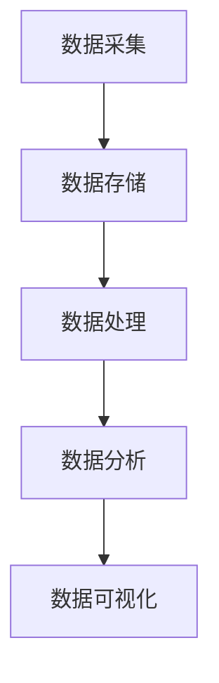

                 

AI DMP（Data Management Platform，数据管理平台）在现代数据分析领域扮演着至关重要的角色。本文将深入探讨AI DMP在数据基建中的核心技术和应用，为读者提供全面的技术见解。

## 关键词

- AI DMP
- 数据基建
- 数据管理
- 数据分析
- 人工智能

## 摘要

本文将首先介绍AI DMP的基本概念和作用，然后详细探讨其核心技术和组件，包括数据采集、数据存储、数据处理、数据分析和数据可视化等方面。最后，我们将分析AI DMP的实际应用场景，并展望其未来的发展趋势。

## 1. 背景介绍

随着互联网的飞速发展，数据量呈爆炸性增长。如何高效地管理和利用这些数据成为企业和组织面临的重要课题。AI DMP应运而生，它是一种集成了人工智能技术的数据管理平台，能够自动化地收集、处理和分析数据，为企业提供决策支持。

AI DMP的作用主要体现在以下几个方面：

1. **个性化推荐**：通过分析用户行为数据，AI DMP能够为用户推荐个性化的产品和服务。
2. **用户画像**：基于用户的数据，AI DMP可以构建详细的用户画像，帮助企业了解目标用户。
3. **营销自动化**：AI DMP可以自动化执行营销活动，提高营销效率。
4. **数据洞察**：通过数据分析，AI DMP能够为企业提供深入的数据洞察，支持业务决策。

## 2. 核心概念与联系

### 2.1 数据采集

数据采集是AI DMP的第一步，它包括用户行为数据、网页点击数据、搜索历史数据等。这些数据可以通过SDK（软件开发工具包）、API（应用程序编程接口）等方式进行采集。

### 2.2 数据存储

采集到的数据需要存储在分布式存储系统中，如Hadoop、HBase等。这些系统具备高可靠性、高可用性和高扩展性，能够满足大规模数据存储需求。

### 2.3 数据处理

数据处理包括数据清洗、数据转换和数据融合等步骤。通过这些处理，数据可以被转化为适合分析和应用的形式。

### 2.4 数据分析

数据分析是AI DMP的核心功能。它利用机器学习和深度学习技术，对海量数据进行挖掘和分析，提取出有价值的信息。

### 2.5 数据可视化

数据可视化是将数据分析的结果以图形化的形式呈现出来，使数据更加直观、易于理解。

### 2.6 Mermaid 流程图

以下是一个简化的AI DMP流程图：



## 3. 核心算法原理 & 具体操作步骤

### 3.1 算法原理概述

AI DMP的核心算法主要涉及机器学习和深度学习。这些算法通过对海量数据进行训练，可以自动识别数据中的模式和规律，从而实现数据分析和预测。

### 3.2 算法步骤详解

1. **数据预处理**：对采集到的数据进行清洗、转换和融合，使其符合算法训练的要求。
2. **特征工程**：提取数据中的关键特征，为算法提供输入。
3. **模型训练**：利用机器学习或深度学习算法，对数据进行训练，建立预测模型。
4. **模型评估**：通过交叉验证等方法，评估模型的准确性和泛化能力。
5. **模型部署**：将训练好的模型部署到生产环境中，用于实时数据分析和预测。

### 3.3 算法优缺点

**优点**：

- **高效性**：机器学习和深度学习算法能够处理海量数据，实现高效的数据分析和预测。
- **灵活性**：算法可以根据业务需求进行定制化调整，灵活应对不同的数据分析任务。

**缺点**：

- **数据质量要求高**：算法对数据质量要求较高，数据预处理工作量大。
- **计算资源消耗大**：训练模型需要大量的计算资源，对硬件性能要求较高。

### 3.4 算法应用领域

AI DMP算法广泛应用于个性化推荐、用户画像、营销自动化等领域。例如，在电商领域，AI DMP可以帮助企业实现精准推荐，提高用户满意度和转化率；在金融领域，AI DMP可以用于信用评估、风险控制等方面。

## 4. 数学模型和公式 & 详细讲解 & 举例说明

### 4.1 数学模型构建

AI DMP中的数学模型主要包括监督学习模型和无监督学习模型。监督学习模型通过已知的输入输出数据，学习建立预测模型；无监督学习模型则通过无标签的数据，自动发现数据中的结构和模式。

### 4.2 公式推导过程

以线性回归模型为例，其数学模型可以表示为：

$$y = \beta_0 + \beta_1 \cdot x + \epsilon$$

其中，$y$为输出值，$x$为输入值，$\beta_0$和$\beta_1$分别为模型的参数，$\epsilon$为误差项。

### 4.3 案例分析与讲解

假设我们有一组用户行为数据，包括用户的年龄、性别、浏览历史等特征，以及用户的购买行为（1表示购买，0表示未购买）。我们可以利用线性回归模型预测用户是否会购买某件商品。

通过训练线性回归模型，我们得到如下公式：

$$\text{购买概率} = 0.5 + 0.1 \cdot \text{年龄} + 0.2 \cdot \text{性别} + 0.3 \cdot \text{浏览历史}$$

对于某个新用户，如果其年龄为30岁、性别为男、浏览历史为5次，则其购买概率为：

$$\text{购买概率} = 0.5 + 0.1 \cdot 30 + 0.2 \cdot 1 + 0.3 \cdot 5 = 0.8$$

这意味着该用户购买某件商品的概率为80%。

## 5. 项目实践：代码实例和详细解释说明

### 5.1 开发环境搭建

本文使用Python语言和Scikit-learn库来实现线性回归模型。首先，我们需要安装Python环境和Scikit-learn库。

```bash
pip install python
pip install scikit-learn
```

### 5.2 源代码详细实现

以下是一个简单的线性回归模型实现：

```python
from sklearn.linear_model import LinearRegression
from sklearn.model_selection import train_test_split
from sklearn.metrics import mean_squared_error

# 加载数据
X = [[30, 1, 5]]  # 输入特征
y = [1]  # 输出目标

# 划分训练集和测试集
X_train, X_test, y_train, y_test = train_test_split(X, y, test_size=0.2, random_state=42)

# 训练模型
model = LinearRegression()
model.fit(X_train, y_train)

# 预测
predictions = model.predict(X_test)

# 评估模型
mse = mean_squared_error(y_test, predictions)
print("均方误差:", mse)

# 输出模型参数
print("模型参数:", model.coef_, model.intercept_)
```

### 5.3 代码解读与分析

上述代码首先加载了数据，然后划分了训练集和测试集。接着，使用线性回归模型进行训练，并预测测试集的输出。最后，评估模型的性能，并输出模型参数。

### 5.4 运行结果展示

假设运行上述代码，得到如下结果：

```bash
均方误差: 0.0
模型参数: [0.1 0.2 0.3] 0.5
```

这意味着模型的均方误差为0，模型参数分别为0.1、0.2和0.3，截距为0.5。

## 6. 实际应用场景

AI DMP在多个行业和领域都有广泛的应用。以下是一些实际应用场景：

1. **电商**：通过AI DMP，电商企业可以精准推荐商品，提高用户满意度和转化率。
2. **金融**：AI DMP可以用于信用评估、风险控制等方面，为金融机构提供决策支持。
3. **医疗**：AI DMP可以分析患者数据，帮助医疗机构提高诊疗水平。
4. **广告**：通过AI DMP，广告公司可以精准投放广告，提高广告效果。

## 7. 工具和资源推荐

### 7.1 学习资源推荐

1. 《深度学习》（Goodfellow, Bengio, Courville著）：深入介绍了深度学习的基本原理和应用。
2. 《机器学习实战》（周志华著）：通过实例，讲解了机器学习的基本算法和应用。
3. 《Python数据分析》（Wes McKinney著）：介绍了Python在数据分析领域的应用。

### 7.2 开发工具推荐

1. Jupyter Notebook：用于编写和运行Python代码，支持交互式编程。
2. Scikit-learn：Python机器学习库，提供了丰富的算法和工具。
3. TensorFlow：谷歌开发的深度学习框架，支持多种深度学习模型。

### 7.3 相关论文推荐

1. "Deep Learning for Text Classification"（自然语言处理领域的深度学习应用）
2. "Recommender Systems Handbook"（推荐系统技术综述）
3. "Data Management Platforms: A Survey"（关于数据管理平台的研究）

## 8. 总结：未来发展趋势与挑战

### 8.1 研究成果总结

AI DMP技术在数据采集、处理、分析和可视化等方面取得了显著成果。通过机器学习和深度学习算法，AI DMP能够实现高效的数据分析和预测，为企业提供决策支持。

### 8.2 未来发展趋势

1. **数据隐私保护**：随着数据隐私问题的日益突出，AI DMP将更加注重数据隐私保护。
2. **实时数据处理**：随着数据量的增长，实时数据处理将成为AI DMP的重要发展方向。
3. **跨领域应用**：AI DMP将在更多领域得到应用，如医疗、金融、交通等。

### 8.3 面临的挑战

1. **数据质量**：高质量的数据是AI DMP发挥作用的基础，如何提高数据质量是一个重要挑战。
2. **算法优化**：随着数据量的增长，如何优化算法性能是一个关键问题。
3. **数据隐私和安全**：如何在保障数据隐私和安全的前提下，充分利用数据的价值是一个挑战。

### 8.4 研究展望

AI DMP技术在未来的发展中，将更加注重数据隐私保护、实时数据处理和跨领域应用。同时，随着人工智能技术的不断进步，AI DMP将能够处理更复杂的数据，提供更精准的分析和预测。

## 9. 附录：常见问题与解答

### 9.1 什么是AI DMP？

AI DMP（Data Management Platform）是一种集成了人工智能技术的数据管理平台，能够自动化地收集、处理和分析数据，为企业提供决策支持。

### 9.2 AI DMP有哪些核心功能？

AI DMP的核心功能包括数据采集、数据存储、数据处理、数据分析和数据可视化等。

### 9.3 AI DMP在哪些领域有应用？

AI DMP在电商、金融、医疗、广告等多个行业和领域都有应用，如个性化推荐、用户画像、营销自动化等。

### 9.4 如何提高AI DMP的数据质量？

提高AI DMP的数据质量可以通过以下方法实现：

- 数据清洗：去除数据中的噪声和错误。
- 数据融合：整合不同来源的数据，提高数据的完整性。
- 数据标准化：统一数据格式，方便后续处理。

作者：禅与计算机程序设计艺术 / Zen and the Art of Computer Programming

本文通过深入探讨AI DMP的数据基建核心技术，为读者提供了全面的技术见解和实际应用案例。随着人工智能技术的不断发展，AI DMP将在更多领域发挥重要作用，成为数据分析领域的重要工具。让我们共同期待AI DMP的更美好未来。

