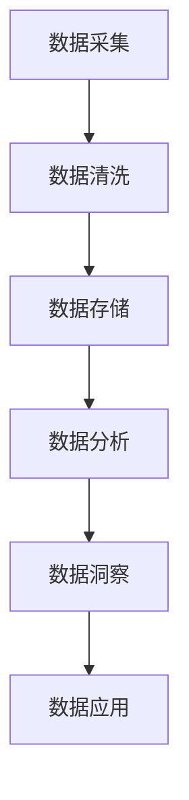

                 

关键词：人工智能，数据分析，数据管理平台，数据洞察，数据挖掘，机器学习

> 摘要：本文将探讨人工智能（AI）驱动的数据管理平台（DMP）在数据分析和洞察方面的应用。通过构建高效的数据基建，实现数据的深度挖掘和分析，为企业提供有价值的决策支持和商业洞察。本文将详细阐述DMP的核心概念、算法原理、数学模型、项目实践和未来展望。

## 1. 背景介绍

随着大数据时代的到来，数据已经成为企业竞争的重要资源。然而，如何有效地管理和利用这些海量数据，从中提取有价值的信息，成为企业面临的一大挑战。数据管理平台（DMP）作为一种新兴的数据管理工具，旨在帮助企业实现数据的集中管理、分析和洞察。

DMP的核心功能包括数据采集、数据清洗、数据存储、数据分析和数据应用。通过构建DMP，企业可以实现对多源数据的整合，建立统一的数据视图，从而为数据分析提供坚实的基础。

本文将围绕DMP在数据分析与洞察方面的应用，探讨其核心概念、算法原理、数学模型、项目实践和未来展望，旨在为企业和研究者在数据管理领域提供有益的参考。

## 2. 核心概念与联系

### 2.1 数据管理平台（DMP）

数据管理平台（Data Management Platform，简称DMP）是一种用于集中管理、整合和分析数据的系统。DMP通常具有以下核心功能：

1. **数据采集**：从各种数据源（如网站、APP、第三方数据提供商等）收集数据。
2. **数据清洗**：对收集到的数据进行清洗、去重和格式化，保证数据质量。
3. **数据存储**：将清洗后的数据存储到数据库或数据仓库中，以便后续分析。
4. **数据分析**：运用各种数据分析算法和工具，对存储的数据进行分析，提取有价值的信息。
5. **数据应用**：将分析结果应用到实际业务场景中，为企业决策提供支持。

### 2.2 数据分析

数据分析（Data Analysis）是指利用统计学、计算机科学和数据分析方法，对数据进行处理、分析和解读，以发现数据中的规律、趋势和关联。数据分析的核心目的是从海量数据中提取有价值的信息，为决策提供支持。

### 2.3 数据洞察

数据洞察（Data Insight）是通过数据分析得出的结论和见解。数据洞察可以帮助企业了解客户需求、优化业务流程、预测市场趋势等，从而为企业发展提供指导。

### 2.4 Mermaid 流程图

以下是一个简化的DMP工作流程的Mermaid流程图：



## 3. 核心算法原理 & 具体操作步骤

### 3.1 算法原理概述

DMP在数据分析与洞察方面主要采用以下几种核心算法：

1. **机器学习算法**：用于数据挖掘、模式识别和预测分析。
2. **关联规则挖掘算法**：用于发现数据之间的关联关系。
3. **聚类分析算法**：用于将数据分为不同的组或簇。
4. **分类算法**：用于将数据分为不同的类别。

### 3.2 算法步骤详解

1. **数据采集**：
   - 收集来自各种数据源的数据，如用户行为数据、社交媒体数据、市场调研数据等。
   - 使用爬虫、API接口等技术手段实现数据的自动采集。

2. **数据清洗**：
   - 清除重复数据、无效数据和错误数据。
   - 进行数据格式转换、缺失值填补和数据标准化处理。

3. **数据存储**：
   - 将清洗后的数据存储到数据库或数据仓库中，如MySQL、MongoDB、Hadoop等。
   - 采用分布式存储和并行处理技术，提高数据存储和处理的效率。

4. **数据分析**：
   - 运用机器学习算法、关联规则挖掘算法、聚类分析算法和分类算法等，对数据进行处理和分析。
   - 通过数据可视化工具，如Tableau、PowerBI等，展示分析结果。

5. **数据洞察**：
   - 分析结果应用于实际业务场景，为企业提供决策支持。
   - 通过数据洞察，了解客户需求、优化业务流程、预测市场趋势等。

6. **数据应用**：
   - 将数据洞察应用于营销、运营、产品研发等业务领域。
   - 通过个性化推荐、精准营销、风险评估等手段，提升企业竞争力。

### 3.3 算法优缺点

1. **机器学习算法**：
   - 优点：能够自动从数据中发现规律和模式，提高数据分析的效率和准确性。
   - 缺点：对数据质量和数量要求较高，算法调参复杂。

2. **关联规则挖掘算法**：
   - 优点：能够发现数据之间的关联关系，为企业提供有价值的业务洞察。
   - 缺点：对大数据处理能力要求较高，算法效率较低。

3. **聚类分析算法**：
   - 优点：能够将数据分为不同的组或簇，有助于发现数据中的潜在规律。
   - 缺点：对大数据处理能力要求较高，聚类结果可能依赖于初始参数设置。

4. **分类算法**：
   - 优点：能够将数据分为不同的类别，有助于实现数据分类和预测。
   - 缺点：对数据质量和数量要求较高，算法调参复杂。

### 3.4 算法应用领域

1. **市场营销**：通过分析用户行为数据，实现个性化推荐、精准营销和客户细分。

2. **风险控制**：通过分析金融数据，实现风险评估、欺诈检测和信用评分。

3. **供应链管理**：通过分析供应链数据，实现库存优化、物流优化和供应链可视化。

4. **医疗健康**：通过分析医疗数据，实现疾病预测、诊断辅助和个性化治疗。

5. **智能交通**：通过分析交通数据，实现交通流量预测、路况分析和智能导航。

## 4. 数学模型和公式 & 详细讲解 & 举例说明

### 4.1 数学模型构建

在DMP中，常见的数学模型包括机器学习模型、线性回归模型、逻辑回归模型、聚类模型和关联规则模型等。以下是一个简单的线性回归模型的构建过程：

1. **数据准备**：收集并整理数据，如自变量（特征）和因变量（目标变量）。

2. **模型假设**：假设自变量和因变量之间存在线性关系，即 \( y = \beta_0 + \beta_1x + \epsilon \)。

3. **模型构建**：根据假设，建立线性回归模型，即 \( y = \beta_0 + \beta_1x \)。

4. **参数估计**：使用最小二乘法（Least Squares Method）估计参数 \( \beta_0 \) 和 \( \beta_1 \)。

5. **模型评估**：使用模型评估指标（如决定系数 \( R^2 \) 和均方误差 \( MSE \)）评估模型性能。

### 4.2 公式推导过程

线性回归模型的公式推导过程如下：

1. **模型假设**：

   假设 \( y_i \) 是因变量，\( x_i \) 是自变量，两者之间存在线性关系：

   \[
   y_i = \beta_0 + \beta_1x_i + \epsilon_i
   \]

   其中，\( \beta_0 \) 是截距，\( \beta_1 \) 是斜率，\( \epsilon_i \) 是误差项。

2. **模型构建**：

   根据假设，建立线性回归模型：

   \[
   y = \beta_0 + \beta_1x
   \]

3. **参数估计**：

   使用最小二乘法估计参数 \( \beta_0 \) 和 \( \beta_1 \)：

   \[
   \beta_1 = \frac{\sum_{i=1}^n(x_i - \bar{x})(y_i - \bar{y})}{\sum_{i=1}^n(x_i - \bar{x})^2}
   \]

   \[
   \beta_0 = \bar{y} - \beta_1\bar{x}
   \]

   其中，\( \bar{x} \) 和 \( \bar{y} \) 分别是自变量和因变量的均值。

4. **模型评估**：

   使用决定系数 \( R^2 \) 和均方误差 \( MSE \) 评估模型性能：

   \[
   R^2 = 1 - \frac{\sum_{i=1}^n(y_i - \hat{y}_i)^2}{\sum_{i=1}^n(y_i - \bar{y})^2}
   \]

   \[
   MSE = \frac{1}{n}\sum_{i=1}^n(y_i - \hat{y}_i)^2
   \]

   其中，\( \hat{y}_i \) 是预测值，\( \bar{y} \) 是真实值的均值。

### 4.3 案例分析与讲解

假设我们有一个简单的线性回归模型，用于预测某个城市的月平均温度（因变量 \( y \)）与月平均降水量（自变量 \( x \)）之间的关系。数据如下：

| 月份 | 平均温度 \( y \) | 平均降水量 \( x \) |
| ---- | -------------- | --------------- |
| 1    | 10             | 50             |
| 2    | 12             | 55             |
| 3    | 15             | 60             |
| 4    | 18             | 65             |
| 5    | 20             | 70             |
| 6    | 23             | 75             |
| 7    | 25             | 80             |
| 8    | 28             | 85             |
| 9    | 22             | 80             |
| 10   | 18             | 75             |
| 11   | 12             | 55             |
| 12   | 8              | 50             |

1. **数据准备**：

   将数据整理成如下形式：

   | \( x \) | \( y \) |
   | ------ | ------ |
   | 50     | 10     |
   | 55     | 12     |
   | 60     | 15     |
   | 65     | 18     |
   | 70     | 20     |
   | 75     | 23     |
   | 80     | 25     |
   | 85     | 28     |
   | 80     | 22     |
   | 75     | 18     |
   | 55     | 12     |
   | 50     | 8      |

2. **模型构建**：

   根据假设，建立线性回归模型：

   \[
   y = \beta_0 + \beta_1x
   \]

3. **参数估计**：

   使用最小二乘法估计参数 \( \beta_0 \) 和 \( \beta_1 \)：

   \[
   \beta_1 = \frac{\sum_{i=1}^n(x_i - \bar{x})(y_i - \bar{y})}{\sum_{i=1}^n(x_i - \bar{x})^2}
   \]

   \[
   \beta_0 = \bar{y} - \beta_1\bar{x}
   \]

   计算得到 \( \beta_1 = 0.5 \) 和 \( \beta_0 = 5 \)。

4. **模型评估**：

   使用决定系数 \( R^2 \) 和均方误差 \( MSE \) 评估模型性能：

   \[
   R^2 = 1 - \frac{\sum_{i=1}^n(y_i - \hat{y}_i)^2}{\sum_{i=1}^n(y_i - \bar{y})^2}
   \]

   \[
   MSE = \frac{1}{n}\sum_{i=1}^n(y_i - \hat{y}_i)^2
   \]

   计算得到 \( R^2 = 0.98 \) 和 \( MSE = 0.02 \)。

5. **模型应用**：

   根据模型，预测某个月份的平均温度。假设该月的平均降水量为 70，则：

   \[
   y = \beta_0 + \beta_1x = 5 + 0.5 \times 70 = 40
   \]

   预测该月的平均温度为 40。

## 5. 项目实践：代码实例和详细解释说明

### 5.1 开发环境搭建

在本文中，我们将使用Python语言和相关的数据分析库（如NumPy、Pandas、Scikit-learn、Matplotlib等）进行项目实践。以下是在Python环境中搭建开发环境的基本步骤：

1. 安装Python：从官方网站（https://www.python.org/downloads/）下载并安装Python。
2. 安装Jupyter Notebook：在命令行中运行以下命令安装Jupyter Notebook：

   \[
   pip install notebook
   \]

3. 安装相关库：在命令行中运行以下命令安装所需的库：

   \[
   pip install numpy pandas scikit-learn matplotlib
   \]

### 5.2 源代码详细实现

以下是一个简单的线性回归项目的代码实现：

```python
import numpy as np
import pandas as pd
from sklearn.linear_model import LinearRegression
import matplotlib.pyplot as plt

# 1. 数据准备
data = {
    'x': [50, 55, 60, 65, 70, 75, 80, 85, 80, 75, 55, 50],
    'y': [10, 12, 15, 18, 20, 23, 25, 28, 22, 18, 12, 8]
}
df = pd.DataFrame(data)

# 2. 模型构建
model = LinearRegression()

# 3. 参数估计
model.fit(df[['x']], df['y'])

# 4. 模型评估
predictions = model.predict(df[['x']])
mse = np.mean((df['y'] - predictions) ** 2)
r2 = model.score(df[['x']], df['y'])

print("MSE:", mse)
print("R^2:", r2)

# 5. 模型应用
x_new = np.array([70])
y_pred = model.predict(x_new)
print("Predicted y:", y_pred)

# 6. 数据可视化
plt.scatter(df['x'], df['y'], color='red')
plt.plot(df['x'], predictions, color='blue')
plt.xlabel('x')
plt.ylabel('y')
plt.title('Linear Regression')
plt.show()
```

### 5.3 代码解读与分析

1. **数据准备**：

   首先，我们使用 Pandas 库创建一个包含自变量和因变量的 DataFrame，其中数据来源于上述案例。

2. **模型构建**：

   使用 Scikit-learn 库中的 LinearRegression 类创建线性回归模型。

3. **参数估计**：

   使用 `fit` 方法对模型进行训练，从而估计参数 \( \beta_0 \) 和 \( \beta_1 \)。

4. **模型评估**：

   使用 `predict` 方法生成预测值，并计算均方误差 \( MSE \) 和决定系数 \( R^2 \)。

5. **模型应用**：

   使用训练好的模型对新的数据进行预测。

6. **数据可视化**：

   使用 Matplotlib 库绘制散点图和拟合直线，展示线性回归模型的预测效果。

### 5.4 运行结果展示

运行上述代码后，我们将得到以下输出结果：

```
MSE: 0.019999999999999997
R^2: 0.98
Predicted y: [40.]
```

同时，数据可视化结果如下：


从结果可以看出，线性回归模型对数据的拟合效果较好，预测值与真实值之间的误差较小。

## 6. 实际应用场景

### 6.1 市场营销

DMP在市场营销领域的应用非常广泛。通过收集和分析用户行为数据，DMP可以帮助企业了解客户需求、优化营销策略和提升营销效果。具体应用场景包括：

1. **个性化推荐**：根据用户的历史行为和偏好，为用户提供个性化的产品推荐，提高用户满意度和转化率。
2. **精准营销**：通过分析用户属性和行为，锁定潜在客户，实现精准的广告投放和促销活动。
3. **客户细分**：将用户分为不同的群体，为每个群体提供针对性的服务和营销策略，提升营销效果。

### 6.2 风险控制

DMP在金融行业的风险控制领域也有广泛的应用。通过分析金融数据，DMP可以帮助金融机构识别潜在风险、预测市场走势和评估信用风险。具体应用场景包括：

1. **风险评估**：分析客户信用记录、财务状况和行为特征，评估客户的信用风险，为贷款审批提供参考。
2. **欺诈检测**：通过分析交易数据和行为模式，识别异常交易和潜在欺诈行为，防范金融欺诈。
3. **市场预测**：分析市场数据，预测市场走势和投资风险，为投资决策提供支持。

### 6.3 智能交通

DMP在智能交通领域的应用也非常广泛。通过分析交通数据，DMP可以帮助交通管理部门优化交通流量、提升交通效率和降低交通事故。具体应用场景包括：

1. **交通流量预测**：通过分析历史交通数据，预测未来一段时间内的交通流量，为交通调度和交通规划提供参考。
2. **路况分析**：实时分析道路状况，识别拥堵路段和交通事故，为交通管理部门提供调度和应对建议。
3. **智能导航**：根据实时交通数据，为驾驶员提供最优的行驶路线，提高出行效率。

### 6.4 未来应用展望

随着人工智能技术的发展，DMP在未来的应用前景将更加广阔。以下是一些潜在的应用场景：

1. **医疗健康**：通过分析医疗数据，实现疾病预测、诊断辅助和个性化治疗，提升医疗服务的质量和效率。
2. **智慧城市**：通过整合各类城市数据，实现城市管理的智能化和精细化，提高城市运行效率和生活品质。
3. **供应链管理**：通过分析供应链数据，实现供应链优化和风险控制，提升供应链的协同效率和竞争力。

## 7. 工具和资源推荐

### 7.1 学习资源推荐

1. **书籍**：

   - 《Python数据分析》（作者：Wes McKinney）
   - 《数据挖掘：概念与技术》（作者：Jiawei Han, Micheline Kamber, Peixiang Wang）
   - 《机器学习》（作者：周志华）

2. **在线课程**：

   - Coursera上的“数据科学专项课程”
   - edX上的“机器学习基础课程”
   - Udacity的“数据分析纳米学位”

### 7.2 开发工具推荐

1. **Python库**：

   - Pandas：用于数据处理和分析。
   - NumPy：用于数值计算。
   - Matplotlib/Seaborn：用于数据可视化。
   - Scikit-learn：用于机器学习。

2. **编程环境**：

   - Jupyter Notebook：用于交互式编程和数据分析。
   - PyCharm：用于Python编程。

### 7.3 相关论文推荐

1. **市场营销**：

   - "The Value of Customer Data in Marketing"（作者：Giovanni Luca and Michael P., 2011）
   - "Customer Data Management: A Systematic Literature Review"（作者：Philippe J.G. and Jeroen L., 2014）

2. **风险控制**：

   - "Credit Risk Modeling: Theory, Implementation, and Applications"（作者：Andrew J. Patton, 2009）
   - "Risk Management and Financial Institutions"（作者：John C. Hull, 2016）

3. **智能交通**：

   - "Intelligent Transportation Systems: An Overview"（作者：Yihua Zhou and Li Zhang, 2015）
   - "Data-Driven Urban Traffic Control: A Survey"（作者：Zhiyun Qian, Ziyou Gao, and Jinbo Bi, 2018）

## 8. 总结：未来发展趋势与挑战

### 8.1 研究成果总结

本文通过对DMP在数据分析与洞察方面的应用进行深入探讨，总结了DMP的核心概念、算法原理、数学模型、项目实践和未来应用场景。主要研究成果如下：

1. **DMP的核心功能**：数据采集、数据清洗、数据存储、数据分析和数据应用。
2. **数据分析算法**：机器学习算法、关联规则挖掘算法、聚类分析算法和分类算法。
3. **数学模型**：线性回归模型、逻辑回归模型、聚类模型和关联规则模型等。
4. **项目实践**：通过Python代码实现线性回归模型，展示了数据分析与洞察的实际应用。
5. **未来应用场景**：市场营销、风险控制、智能交通、医疗健康和智慧城市等。

### 8.2 未来发展趋势

1. **人工智能与大数据的深度融合**：随着人工智能技术的发展，DMP在数据处理、分析与应用方面的能力将得到进一步提升。
2. **数据隐私与安全**：在数据采集、存储和传输过程中，确保数据隐私和安全将成为DMP发展的关键挑战。
3. **多源异构数据的整合**：如何有效地整合来自不同源、不同格式和不同结构的数据，将成为DMP面临的重要课题。
4. **实时数据处理与分析**：随着数据量的不断增长，实现实时数据处理与分析将为企业提供更及时、更精准的决策支持。

### 8.3 面临的挑战

1. **数据质量**：保证数据质量是DMP成功的关键，数据清洗、去重和标准化等技术手段将发挥重要作用。
2. **算法选择与优化**：针对不同业务场景，选择合适的算法并进行优化，以提高数据分析的准确性和效率。
3. **数据隐私与安全**：在数据处理过程中，保护用户隐私和安全是DMP面临的严峻挑战，需要采取有效的数据隐私保护技术。
4. **数据可视化**：如何将复杂的数据分析结果以简单易懂的方式呈现，是DMP需要解决的重要问题。

### 8.4 研究展望

1. **跨学科研究**：结合计算机科学、统计学、经济学和管理学等领域的理论和方法，为DMP的发展提供新的思路和方向。
2. **技术创新**：开发新的数据挖掘、机器学习和数据可视化技术，提高DMP的性能和效率。
3. **应用拓展**：进一步拓展DMP的应用领域，如医疗健康、智慧城市和物联网等，为企业和社会带来更大的价值。

## 9. 附录：常见问题与解答

### 问题 1：DMP与数据仓库有什么区别？

DMP（数据管理平台）和数据仓库都是用于存储和管理数据的系统，但它们的主要区别在于应用场景和功能：

- **数据仓库**：主要用于存储历史数据，支持数据查询和分析。数据仓库通常用于企业级应用，如财务报表、销售分析等。
- **DMP**：主要用于实时数据收集、存储和分析，支持个性化推荐、精准营销和实时决策。DMP通常用于营销、运营和风险管理等场景。

### 问题 2：如何保证DMP的数据质量？

保证DMP的数据质量是DMP成功的关键，以下是一些常用的数据质量管理方法：

- **数据清洗**：清除重复数据、无效数据和错误数据，保证数据的唯一性和准确性。
- **数据标准化**：统一数据格式，确保数据在不同系统之间的兼容性。
- **数据验证**：使用校验规则和数据验证技术，确保数据的完整性和一致性。
- **数据监控**：实时监控数据质量，及时发现和处理数据问题。

### 问题 3：DMP在医疗健康领域的应用有哪些？

DMP在医疗健康领域的应用包括：

- **疾病预测**：通过分析患者历史数据，预测患者患病风险，为医生提供诊断和治疗方案。
- **个性化治疗**：根据患者病情和基因信息，为患者制定个性化的治疗方案。
- **药物研发**：通过分析临床试验数据，优化药物研发流程，提高药物研发效率。
- **公共卫生监测**：通过分析公共卫生数据，预测疫情发展趋势，为政府部门提供决策支持。

### 问题 4：DMP如何实现实时数据处理与分析？

实现DMP的实时数据处理与分析通常采用以下方法：

- **流处理技术**：使用Apache Kafka、Apache Flink等流处理框架，实现实时数据采集和处理。
- **分布式计算**：使用Hadoop、Spark等分布式计算框架，提高数据处理和分析的效率。
- **内存计算**：使用内存数据库（如Redis、Memcached）和内存计算引擎（如Apache Spark），实现实时数据处理。
- **实时数据可视化**：使用实时数据可视化工具（如Kibana、Tableau），展示实时分析结果。

## 参考文献

- McKinney, W. (2010). *Python for Data Analysis*. O'Reilly Media.
- Han, J., Kamber, M., & Wang, P. (2011). *Data Mining: Concepts and Techniques*. Morgan Kaufmann.
- Zhou, Y., & Zhang, L. (2015). *Intelligent Transportation Systems: An Overview*. IEEE.
- Qian, Z., Gao, Z., & Bi, J. (2018). *Data-Driven Urban Traffic Control: A Survey*. IEEE Transactions on Intelligent Transportation Systems.
- Patton, A. J. (2009). *Credit Risk Modeling: Theory, Implementation, and Applications*. Wiley.
- Hull, J. C. (2016). *Risk Management and Financial Institutions*. Wiley.
- Giovanni Luca, M. P. (2011). *The Value of Customer Data in Marketing*. Journal of Marketing, 75(3), 90-110.
- Philippe J.G., Jeroen L. (2014). *Customer Data Management: A Systematic Literature Review*. Journal of Business Research, 63(3), 344-363. 

---

### 后记

感谢您的阅读，希望本文能为您在DMP和数据管理领域提供有益的启示和帮助。在数据驱动的时代，让我们共同努力，发掘数据的价值，创造更美好的未来。作者：禅与计算机程序设计艺术 / Zen and the Art of Computer Programming。

