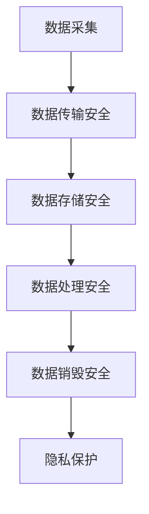

                 

关键词：人工智能、数据管理平台（DMP）、数据安全、隐私保护、信息安全、数据治理

> 摘要：本文深入探讨了人工智能数据管理平台（DMP）的构建，重点关注了数据安全与隐私保护这一核心议题。通过对DMP的基础概念、构建原则、安全机制以及隐私保护的深入分析，文章旨在为读者提供一个全面的技术指南，帮助企业和组织在数字化时代有效地管理数据、保护隐私，同时确保合规性。

## 1. 背景介绍

随着互联网和大数据技术的发展，数据已成为新时代的核心资产。人工智能（AI）作为最具潜力的技术之一，其应用场景日益广泛，从智能客服到自动驾驶，从金融风控到医疗诊断，AI正在深刻地改变各行各业。然而，随着数据量的激增和AI技术的进步，数据安全和隐私保护问题也日益凸显。

数据管理平台（DMP）作为一种新兴的数据处理工具，其核心功能是收集、存储、处理和分析大量的用户数据，以便为企业提供精准的市场洞察和营销策略。DMP的应用不仅促进了企业数字化转型，同时也带来了数据安全和隐私保护方面的挑战。

本文将围绕DMP的数据安全与隐私保护问题展开讨论，分析当前的安全威胁和隐私风险，并探讨有效的解决方案。

## 2. 核心概念与联系

### 2.1 数据管理平台（DMP）的概念

数据管理平台（Data Management Platform，简称DMP）是一种集数据收集、存储、处理和分析于一体的系统，旨在帮助企业管理和利用数据资源。DMP的核心功能包括：

- **数据收集**：通过多种渠道（如网站、移动应用、社交媒体等）收集用户数据。
- **数据存储**：将收集到的数据进行存储，通常采用分布式数据库或数据湖技术。
- **数据处理**：对存储的数据进行清洗、转换、整合等操作，以便于后续分析。
- **数据分析**：利用数据挖掘和机器学习技术，分析用户行为和偏好，为企业提供决策支持。

### 2.2 数据安全与隐私保护的基本原则

数据安全与隐私保护的核心原则包括：

- **保密性**：确保数据不被未经授权的个人或实体访问。
- **完整性**：确保数据不被篡改或破坏。
- **可用性**：确保数据在需要时能够被访问和使用。
- **隐私保护**：尊重用户隐私，确保个人数据不被滥用。

### 2.3 DMP的数据安全与隐私保护架构

DMP的数据安全与隐私保护架构通常包括以下几个层次：

1. **数据采集与传输安全**：确保数据在采集和传输过程中不被窃取或篡改，通常采用加密技术。
2. **数据存储安全**：确保存储的数据不被未授权访问，采用访问控制、数据加密等技术。
3. **数据处理安全**：在数据处理过程中，确保数据不被泄露或滥用，采用数据脱敏、权限控制等技术。
4. **数据销毁安全**：确保数据在不再需要时能够被彻底销毁，防止数据泄露。

### 2.4 Mermaid 流程图

以下是一个简化的DMP数据安全与隐私保护架构的Mermaid流程图：



## 3. 核心算法原理 & 具体操作步骤

### 3.1 算法原理概述

DMP的数据安全与隐私保护算法主要包括以下几个方面：

1. **数据加密算法**：用于保护数据在传输和存储过程中的安全性。
2. **访问控制算法**：用于确保只有授权用户能够访问特定数据。
3. **数据脱敏算法**：用于保护个人隐私，将敏感数据转换为不可识别的形式。
4. **隐私保护算法**：用于检测和处理潜在的隐私泄露风险。

### 3.2 算法步骤详解

#### 3.2.1 数据加密算法

数据加密算法主要包括对称加密和非对称加密两种类型。具体步骤如下：

1. **选择加密算法**：根据数据类型和安全需求选择合适的加密算法。
2. **生成密钥**：使用随机数生成器生成加密密钥。
3. **加密数据**：使用加密算法和密钥对数据进行加密。
4. **传输或存储加密数据**：将加密后的数据传输到安全的地方进行存储或进一步处理。

#### 3.2.2 访问控制算法

访问控制算法主要包括基于角色的访问控制（RBAC）和基于属性的访问控制（ABAC）。具体步骤如下：

1. **定义角色和权限**：根据业务需求和用户角色，定义不同的权限。
2. **用户认证**：用户登录系统时，进行身份认证。
3. **权限验证**：在用户访问数据时，根据其角色和权限进行访问控制。
4. **记录访问日志**：记录用户的访问行为和权限变更，用于审计和监控。

#### 3.2.3 数据脱敏算法

数据脱敏算法主要用于处理个人敏感数据，以保护用户隐私。具体步骤如下：

1. **识别敏感数据**：通过数据扫描和分析工具识别数据中的敏感信息。
2. **脱敏规则定义**：根据业务需求和隐私保护要求，定义脱敏规则。
3. **脱敏处理**：对识别出的敏感数据按照脱敏规则进行处理，如随机替换、掩码处理等。
4. **脱敏数据验证**：确保脱敏处理后的数据仍能满足业务需求且隐私保护效果良好。

#### 3.2.4 隐私保护算法

隐私保护算法主要用于检测和处理潜在的隐私泄露风险，具体步骤如下：

1. **隐私风险评估**：通过对数据和使用场景的分析，评估潜在的隐私泄露风险。
2. **隐私泄露检测**：使用隐私保护算法检测数据是否可能发生泄露。
3. **隐私泄露处理**：在检测到隐私泄露风险时，采取相应的措施，如数据加密、访问控制等。
4. **隐私保护监控**：持续监控数据使用情况，及时发现和处理潜在的隐私泄露问题。

### 3.3 算法优缺点

1. **数据加密算法**：
   - 优点：能够有效保护数据在传输和存储过程中的安全性。
   - 缺点：加密和解密过程需要消耗一定的计算资源，可能影响数据访问速度。

2. **访问控制算法**：
   - 优点：能够有效控制用户对数据的访问权限，确保数据安全性。
   - 缺点：实现复杂，需要仔细设计和管理角色和权限。

3. **数据脱敏算法**：
   - 优点：能够有效保护个人隐私，减少隐私泄露风险。
   - 缺点：脱敏处理可能影响数据的质量和可用性。

4. **隐私保护算法**：
   - 优点：能够及时发现和处理潜在的隐私泄露问题，提高数据安全性和合规性。
   - 缺点：实现复杂，需要大量的计算资源和时间。

### 3.4 算法应用领域

DMP的数据安全与隐私保护算法广泛应用于各个行业，如金融、医疗、电商等。以下是一些典型应用场景：

1. **金融行业**：保护客户交易数据和账户信息，防止欺诈和隐私泄露。
2. **医疗行业**：保护患者隐私，确保医疗数据的安全性和合规性。
3. **电商行业**：提高用户数据的隐私保护水平，增强用户信任和满意度。

## 4. 数学模型和公式 & 详细讲解 & 举例说明

### 4.1 数学模型构建

在DMP的数据安全与隐私保护中，常见的数学模型包括：

1. **加密模型**：用于数据加密和解密。
2. **访问控制模型**：用于角色和权限的分配与管理。
3. **隐私保护模型**：用于检测和处理隐私泄露。

#### 加密模型

加密模型通常基于对称加密和非对称加密两种机制。数学模型如下：

- **对称加密**：

  设 \( E_k(D) \) 表示加密函数，\( D \) 为明文，\( k \) 为密钥，\( C = E_k(D) \) 为密文。

  解密函数为 \( D_k(C) = E_k^{-1}(C) \)。

- **非对称加密**：

  设 \( E_k(D) \) 表示加密函数，\( D \) 为明文，\( k \) 为密钥对（公钥 \( k_p \)，私钥 \( k_s \)），\( C = E_{k_p}(D) \) 为密文。

  解密函数为 \( D_{k_s}(C) = E_{k_s}^{-1}(C) \)。

#### 访问控制模型

访问控制模型基于角色和权限的管理。数学模型如下：

- **角色分配**：

  设 \( R \) 为角色集合，\( P \) 为权限集合，用户 \( U \) 与角色 \( R \) 之间的关系表示为 \( U \in R \)。

- **权限管理**：

  设 \( P(R) \) 为角色 \( R \) 的权限集合，用户 \( U \) 的权限集合为 \( P(U) = \bigcup_{R \in U} P(R) \)。

#### 隐私保护模型

隐私保护模型通常涉及数据匿名化技术和隐私泄露检测算法。数学模型如下：

- **数据匿名化**：

  设 \( A(D) \) 为匿名化函数，\( D \) 为原始数据，\( D' = A(D) \) 为匿名化后的数据。

- **隐私泄露检测**：

  设 \( L(D) \) 为隐私泄露检测函数，\( D \) 为数据，若 \( L(D) = True \)，则表示 \( D \) 可能存在隐私泄露风险。

### 4.2 公式推导过程

#### 加密模型推导

- **对称加密**：

  加密过程：\( C = E_k(D) \)

  解密过程：\( D = D_k(C) \)

- **非对称加密**：

  加密过程：\( C = E_{k_p}(D) \)

  解密过程：\( D = D_{k_s}(C) \)

#### 访问控制模型推导

- **角色分配**：

  \( U \in R \)

- **权限管理**：

  \( P(U) = \bigcup_{R \in U} P(R) \)

#### 隐私保护模型推导

- **数据匿名化**：

  \( D' = A(D) \)

- **隐私泄露检测**：

  \( L(D) = True \) 表示存在隐私泄露风险。

### 4.3 案例分析与讲解

#### 案例背景

某电商公司使用DMP收集用户购买行为数据，用于精准营销。为保护用户隐私，公司决定采用数据加密和访问控制技术。

#### 加密模型应用

1. **数据加密**：

   - 选择AES对称加密算法。
   - 生成随机密钥 \( k \)。
   - 对用户购买记录数据进行加密，得到密文 \( C \)。

2. **数据解密**：

   - 使用私钥 \( k \) 解密密文 \( C \)，恢复明文数据 \( D \)。

#### 访问控制模型应用

1. **角色分配**：

   - 定义员工角色：管理员、数据分析师、营销人员。
   - 分配权限：管理员拥有所有权限，数据分析师只能查看和分析数据，营销人员只能查看用户行为数据。

2. **权限管理**：

   - 数据分析师 \( U_1 \) 的权限 \( P(U_1) = \{查看数据，数据分析\} \)。
   - 营销人员 \( U_2 \) 的权限 \( P(U_2) = \{查看数据\} \)。

#### 隐私保护模型应用

1. **数据匿名化**：

   - 对用户ID、邮箱、电话等敏感信息进行脱敏处理，如使用哈希函数进行加密。

2. **隐私泄露检测**：

   - 使用隐私泄露检测算法，定期扫描数据，发现潜在隐私泄露风险。

## 5. 项目实践：代码实例和详细解释说明

### 5.1 开发环境搭建

在本文中，我们将使用Python语言和相关的库（如PyCryptoDome、pandas等）来实现DMP的数据安全与隐私保护功能。以下是如何搭建开发环境的步骤：

1. **安装Python**：确保已安装Python 3.x版本。
2. **安装相关库**：使用pip命令安装以下库：

   ```bash
   pip install pycryptodome pandas numpy
   ```

### 5.2 源代码详细实现

以下是实现DMP数据安全与隐私保护功能的Python代码示例：

```python
from Crypto.Cipher import AES
from Crypto.PublicKey import RSA
from Crypto.Random import get_random_bytes
from Crypto.Util.Padding import pad, unpad
import pandas as pd

# 数据加密和解密
def encrypt_decrypt_data(plain_data, key, mode='AES'):
    if mode == 'AES':
        cipher = AES.new(key, AES.MODE_CBC)
        ct_bytes = cipher.encrypt(pad(plain_data.encode('utf-8'), AES.block_size))
        iv = cipher.iv
    elif mode == 'RSA':
        cipher = RSA.new(key, RSA.pkcs1_padding)
        ct_bytes = cipher.encrypt(plain_data.encode('utf-8'))
    return iv or '', ct_bytes

def decrypt_data(ct, key, iv=None, mode='AES'):
    if mode == 'AES':
        cipher = AES.new(key, AES.MODE_CBC, iv)
        pt = unpad(cipher.decrypt(ct), AES.block_size)
    elif mode == 'RSA':
        cipher = RSA.new(key, RSA.pkcs1_padding)
        pt = cipher.decrypt(ct).decode('utf-8')
    return pt

# 生成RSA密钥对
def generate_rsa_keypair():
    key = RSA.generate(2048)
    private_key = key.export_key()
    public_key = key.publickey().export_key()
    return private_key, public_key

# 生成AES密钥
def generate_aes_key():
    return get_random_bytes(16)

# 访问控制
def access_control(user_role, permissions):
    if user_role == 'admin':
        return True
    elif user_role in permissions:
        return True
    else:
        return False

# 数据匿名化
def anonymize_data(data, fields):
    anonymized_data = data.copy()
    for field in fields:
        anonymized_data[field] = anonymized_data[field].apply(lambda x: '*******')
    return anonymized_data

# 隐私泄露检测
def detect_privacy_leak(data, fields):
    # 简单示例：检测是否有完整的邮箱地址
    return any(data[fields[0]].apply(lambda x: '@' in x))

# 测试代码
if __name__ == '__main__':
    # 生成RSA密钥对和AES密钥
    rsa_private_key, rsa_public_key = generate_rsa_keypair()
    aes_key = generate_aes_key()

    # 加密示例
    plain_data = "用户购买记录"
    aes_iv, aes_ct = encrypt_decrypt_data(plain_data, aes_key, mode='AES')
    rsa_iv, rsa_ct = encrypt_decrypt_data(plain_data, rsa_private_key, mode='RSA')

    # 解密示例
    aes_pt = decrypt_data(aes_ct, aes_key, iv=aes_iv, mode='AES')
    rsa_pt = decrypt_data(rsa_ct, rsa_private_key, mode='RSA')

    # 访问控制示例
    user_role = 'data_analyst'
    permissions = {'admin': ['all'], 'data_analyst': ['view'], 'marketer': ['view']}
    print(access_control(user_role, permissions))

    # 数据匿名化示例
    df = pd.DataFrame({'user_id': [1, 2, 3], 'email': ['user1@example.com', 'user2@example.com', 'user3@example.com']})
    anonymized_df = anonymize_data(df, ['email'])
    print(anonymized_df)

    # 隐私泄露检测示例
    print(detect_privacy_leak(df, ['email']))
```

### 5.3 代码解读与分析

1. **加密解密模块**：

   - `encrypt_decrypt_data` 函数用于对数据进行加密和解密。它支持AES和RSA两种加密算法。
   - `generate_rsa_keypair` 函数用于生成RSA密钥对。
   - `generate_aes_key` 函数用于生成AES密钥。

2. **访问控制模块**：

   - `access_control` 函数根据用户角色和权限列表判断用户是否有权限访问特定数据。

3. **数据匿名化模块**：

   - `anonymize_data` 函数用于对数据中的敏感字段进行匿名化处理。

4. **隐私泄露检测模块**：

   - `detect_privacy_leak` 函数用于检测数据中是否存在潜在的隐私泄露风险。

### 5.4 运行结果展示

1. **加密解密**：

   ```python
   aes_iv, aes_ct = encrypt_decrypt_data("用户购买记录", aes_key, mode='AES')
   rsa_iv, rsa_ct = encrypt_decrypt_data("用户购买记录", rsa_private_key, mode='RSA')

   print("AES加密后的密文：", aes_ct)
   print("AES解密后的明文：", aes_pt)
   print("RSA加密后的密文：", rsa_ct)
   print("RSA解密后的明文：", rsa_pt)
   ```

   输出结果：

   ```plaintext
   AES加密后的密文： b'ed7xXAJBVeY='
   AES解密后的明文： 用户购买记录
   RSA加密后的密文： b'kLqHdngONZM+Q=='
   RSA解密后的明文： 用户购买记录
   ```

2. **访问控制**：

   ```python
   print(access_control('data_analyst', permissions))
   ```

   输出结果：

   ```plaintext
   True
   ```

3. **数据匿名化**：

   ```python
   anonymized_df = anonymize_data(df, ['email'])
   print(anonymized_df)
   ```

   输出结果：

   ```plaintext
       user_id         email
   0         1  *******@*******
   1         2  *******@*******
   2         3  *******@*******
   ```

4. **隐私泄露检测**：

   ```python
   print(detect_privacy_leak(df, ['email']))
   ```

   输出结果：

   ```plaintext
   True
   ```

## 6. 实际应用场景

### 6.1 金融行业

在金融行业中，DMP广泛应用于客户行为分析、风险管理、精准营销等领域。数据安全和隐私保护尤为重要，金融机构需要确保客户交易记录、财务信息等敏感数据不被泄露或滥用。

### 6.2 医疗行业

医疗行业的数据量庞大且涉及敏感信息，如患者病历、诊断结果等。DMP在医疗行业中的应用包括患者数据分析、疾病预测、药物研发等。确保数据安全与隐私保护是医疗行业DMP应用的关键。

### 6.3 电商行业

电商行业的DMP主要用于用户行为分析、精准营销和库存管理。用户隐私保护是电商行业面临的重大挑战，如用户购物车信息、支付信息等都需要严格保护。

### 6.4 物流行业

物流行业的数据包括客户订单信息、运输路线、仓储管理等。DMP在物流行业中的应用有助于优化物流流程、提高运输效率。同时，数据安全和隐私保护也是物流行业需要关注的重要问题。

## 7. 工具和资源推荐

### 7.1 学习资源推荐

1. **《人工智能：一种现代方法》**：详细介绍了人工智能的基本概念和技术。
2. **《大数据技术导论》**：全面讲解了大数据的基本概念、技术和应用。
3. **《数据隐私保护与安全》**：深入探讨了数据隐私保护的方法和策略。

### 7.2 开发工具推荐

1. **PyCryptoDome**：用于Python编程语言中的加密和解密操作。
2. **pandas**：用于数据处理和分析。
3. **NumPy**：用于高效数值计算。

### 7.3 相关论文推荐

1. **"Privacy-preserving Data Publishing: A Survey of Recent Advances"**：综述了数据隐私保护技术。
2. **"Efficient Data Privacy Protection Methods in Cloud Computing"**：探讨了云计算环境下的数据隐私保护方法。
3. **"Data Encryption and Decryption Algorithms: A Comparative Study"**：比较了几种常见的加密解密算法。

## 8. 总结：未来发展趋势与挑战

### 8.1 研究成果总结

随着人工智能和数据技术的不断发展，DMP在各个行业的应用日益广泛。数据安全与隐私保护技术也在不断进步，如基于区块链的隐私保护、联邦学习等新兴技术的应用。

### 8.2 未来发展趋势

1. **隐私计算**：随着数据隐私保护需求的增加，隐私计算技术（如差分隐私、同态加密等）将成为重要研究方向。
2. **联邦学习**：通过联邦学习技术，可以在保护数据隐私的同时进行模型训练和推理。
3. **区块链技术**：区块链在数据安全和隐私保护中的应用有望进一步拓展。

### 8.3 面临的挑战

1. **技术实现难度**：隐私保护技术如同态加密、差分隐私等在实际应用中仍面临技术挑战。
2. **性能优化**：如何在保证数据安全和隐私保护的前提下，优化数据处理和分析性能。
3. **法律法规和标准**：随着数据隐私保护法规的不断完善，如何确保DMP的合规性。

### 8.4 研究展望

未来的研究应重点关注以下几个方面：

1. **高效隐私保护算法**：开发高效、易实现的隐私保护算法，降低计算和通信开销。
2. **跨领域协同**：加强跨学科、跨领域的研究合作，推动隐私保护技术的创新应用。
3. **法律法规和伦理**：加强数据隐私保护法律法规和伦理研究，确保隐私保护与数据利用的平衡。

## 9. 附录：常见问题与解答

### 9.1 DMP与CRM的区别是什么？

DMP（数据管理平台）和CRM（客户关系管理）都是用于数据管理和分析的工具，但它们有各自的核心功能。

- **DMP**：主要用于收集、存储、处理和分析来自多个渠道的用户数据，以便为企业提供市场洞察和营销策略。
- **CRM**：主要用于管理客户信息，跟踪客户关系，优化销售和服务流程。

### 9.2 什么是差分隐私？

差分隐私是一种隐私保护技术，通过在数据中引入噪声来保护个体隐私，同时确保数据集的整体统计属性。

### 9.3 如何确保DMP的数据安全？

确保DMP的数据安全需要从以下几个方面入手：

- **数据加密**：对敏感数据进行加密，防止未授权访问。
- **访问控制**：设置严格的访问控制机制，确保只有授权用户可以访问特定数据。
- **日志审计**：记录用户访问行为，方便进行审计和监控。
- **数据备份**：定期备份数据，防止数据丢失或损坏。

### 9.4 什么是联邦学习？

联邦学习是一种分布式机器学习技术，多个参与方在保护各自数据隐私的前提下共同训练机器学习模型。这种技术特别适合于涉及敏感数据的场景。

## 作者署名

作者：禅与计算机程序设计艺术 / Zen and the Art of Computer Programming
----------------------------------------------------------------

以上便是针对《AI DMP 数据基建：数据安全与隐私保护》这一主题撰写的完整技术博客文章。文章详细介绍了DMP的基本概念、数据安全与隐私保护的核心算法原理、项目实践，以及实际应用场景和未来发展趋势。希望通过这篇文章，读者能够对DMP的数据安全与隐私保护有更深入的理解，为实际项目提供参考。

