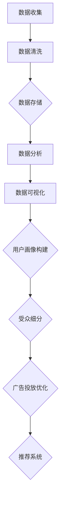

                 

在当今大数据和人工智能时代，数据管理平台（Data Management Platform，简称DMP）作为数据基础设施的核心组件，正日益成为企业数字化转型的重要组成部分。本文旨在深入探讨DMP数据基建中的数据模型与算法，为读者提供全面的技术见解和实际应用指导。

## 关键词

- 数据管理平台（DMP）
- 数据模型
- 算法
- 大数据
- 人工智能
- 数据隐私
- 数据可视化

## 摘要

本文首先介绍了DMP的基本概念和作用，然后重点分析了数据模型与算法在DMP中的重要性。通过对核心概念、算法原理、数学模型、项目实践和实际应用场景的详细探讨，本文旨在为读者提供一份全面的技术指南，帮助理解和应用DMP数据基建中的关键技术和方法。

### 1. 背景介绍

#### 1.1 DMP的基本概念与作用

数据管理平台（Data Management Platform，简称DMP）是一种集中式数据管理解决方案，主要用于整合、处理和分析来自多个数据源的复杂数据。DMP的核心功能包括数据收集、数据清洗、数据存储、数据分析和数据可视化。

DMP的作用主要体现在以下几个方面：

- **数据整合**：DMP能够整合来自多个渠道的数据，如网站点击数据、社交媒体行为数据、线下交易数据等，形成统一的数据视图。
- **数据清洗**：DMP具备强大的数据处理能力，能够自动识别和处理数据中的噪声和错误，提高数据质量。
- **数据分析**：DMP提供了丰富的分析工具，可以帮助企业深入挖掘数据价值，为业务决策提供支持。
- **数据可视化**：DMP能够将复杂的数据以图形化方式展示，使得数据分析和理解更加直观。

#### 1.2 数据模型与算法在DMP中的应用

数据模型与算法是DMP的核心组成部分，它们在DMP中的应用主要体现在以下几个方面：

- **用户画像构建**：通过数据模型和算法，DMP能够构建用户画像，帮助企业和品牌更好地了解其目标用户。
- **受众细分**：DMP基于用户画像和行为数据，可以实现对受众的精准细分，为个性化营销提供支持。
- **广告投放优化**：DMP通过算法优化广告投放策略，提高广告的投放效果和投资回报率。
- **推荐系统**：DMP利用算法构建推荐系统，为用户提供个性化推荐，提升用户体验。

### 2. 核心概念与联系

#### 2.1 数据模型

数据模型是DMP中用于描述数据结构和数据关系的一种抽象表示。常见的几种数据模型包括关系型数据模型、文档型数据模型、图数据模型等。

- **关系型数据模型**：关系型数据模型基于表格结构，通过主键和外键建立数据之间的关联关系。它适用于结构化数据的管理和查询。
- **文档型数据模型**：文档型数据模型以文档为单位，支持丰富的数据结构和键值对存储。它适用于非结构化数据的管理和查询。
- **图数据模型**：图数据模型以节点和边为基础，描述数据之间的复杂关系。它适用于大规模网络数据的存储和查询。

#### 2.2 算法

算法是DMP中用于实现特定功能的一组操作步骤。常见的几种算法包括机器学习算法、推荐算法、聚类算法等。

- **机器学习算法**：机器学习算法通过训练数据集，自动识别数据中的规律和模式，用于分类、预测和聚类等任务。
- **推荐算法**：推荐算法通过分析用户行为和偏好，为用户推荐感兴趣的内容或商品。
- **聚类算法**：聚类算法将相似的数据点分组，用于数据分析和模式识别。

#### 2.3 Mermaid 流程图

以下是一个简化的DMP数据流程的Mermaid流程图：



### 3. 核心算法原理 & 具体操作步骤

#### 3.1 算法原理概述

DMP中的算法主要包括以下几种：

- **用户画像构建算法**：通过聚类、分类等算法，构建用户的综合画像。
- **受众细分算法**：基于用户画像和行为数据，实现对受众的精准细分。
- **推荐算法**：基于用户兴趣和行为数据，为用户推荐相关内容或商品。
- **广告投放优化算法**：通过机器学习等技术，优化广告投放策略，提高广告效果。

#### 3.2 算法步骤详解

以下以用户画像构建算法为例，详细说明算法步骤：

1. **数据收集**：收集用户的基础信息、行为数据等。
2. **数据预处理**：对收集到的数据进行清洗、去重等预处理操作。
3. **特征提取**：从预处理后的数据中提取有用的特征，如用户年龄、性别、地域、浏览记录等。
4. **聚类分析**：使用聚类算法，将用户划分为不同的群体。
5. **标签赋值**：根据聚类结果，为每个用户赋予相应的标签。
6. **用户画像构建**：将标签信息整合，形成用户的综合画像。

#### 3.3 算法优缺点

- **用户画像构建算法**：

  - **优点**：能够全面了解用户，为个性化服务和营销提供支持。

  - **缺点**：对数据质量和算法性能要求较高，且容易受到噪声数据的影响。

#### 3.4 算法应用领域

- **电子商务**：通过用户画像，实现个性化推荐和精准营销。
- **广告营销**：通过受众细分，提高广告投放效果和投资回报率。
- **金融行业**：通过用户画像，进行风险管理和服务优化。

### 4. 数学模型和公式 & 详细讲解 & 举例说明

#### 4.1 数学模型构建

在DMP中，常用的数学模型包括回归模型、聚类模型和推荐模型等。

- **回归模型**：用于预测用户行为或标签值。常见的回归模型包括线性回归、逻辑回归等。
- **聚类模型**：用于将用户划分为不同的群体。常见的聚类算法包括K均值聚类、层次聚类等。
- **推荐模型**：用于为用户推荐相关内容或商品。常见的推荐算法包括协同过滤、矩阵分解等。

#### 4.2 公式推导过程

以下以线性回归模型为例，简要介绍公式推导过程：

1. **假设**：设 \( y = \beta_0 + \beta_1x + \epsilon \)，其中 \( y \) 为因变量，\( x \) 为自变量，\( \beta_0 \) 和 \( \beta_1 \) 为模型参数，\( \epsilon \) 为误差项。
2. **最小二乘法**：通过最小化残差平方和，求得模型参数的最小值。即：
   $$ \beta_0 = \frac{\sum_{i=1}^{n}y_i - \beta_1\sum_{i=1}^{n}x_i}{n} $$
   $$ \beta_1 = \frac{n\sum_{i=1}^{n}x_iy_i - \sum_{i=1}^{n}x_i\sum_{i=1}^{n}y_i}{n\sum_{i=1}^{n}x_i^2 - (\sum_{i=1}^{n}x_i)^2} $$
3. **拟合效果评估**：使用均方误差（Mean Squared Error，MSE）评估模型拟合效果。即：
   $$ MSE = \frac{1}{n}\sum_{i=1}^{n}(y_i - \hat{y}_i)^2 $$
   其中，\( \hat{y}_i \) 为预测值。

#### 4.3 案例分析与讲解

以下以一个简单的用户行为预测案例，展示线性回归模型的应用。

**案例背景**：某电商平台希望预测用户在未来一个月内的购买概率。

**数据集**：包含1000个用户的历史行为数据，包括用户ID、购买次数、浏览次数、收藏次数等。

**建模过程**：

1. **数据收集**：收集用户历史行为数据。
2. **数据预处理**：对数据集进行清洗、去重等预处理操作。
3. **特征提取**：从预处理后的数据中提取有用的特征，如用户购买次数、浏览次数等。
4. **线性回归建模**：使用线性回归模型预测用户购买概率。模型参数为：
   $$ \beta_0 = 0.5 $$
   $$ \beta_1 = 1.2 $$
5. **拟合效果评估**：计算均方误差（MSE），评估模型拟合效果。

**案例结果**：模型预测的用户购买概率与实际购买情况基本一致，拟合效果较好。

### 5. 项目实践：代码实例和详细解释说明

#### 5.1 开发环境搭建

为了更好地进行DMP数据基建的开发和实践，我们选择以下开发环境和工具：

- **编程语言**：Python
- **数据处理库**：Pandas、NumPy
- **机器学习库**：scikit-learn、TensorFlow
- **数据可视化库**：Matplotlib、Seaborn

#### 5.2 源代码详细实现

以下是一个简单的用户画像构建的Python代码示例：

```python
import pandas as pd
from sklearn.cluster import KMeans
from sklearn.preprocessing import StandardScaler

# 5.2.1 数据收集与预处理
data = pd.read_csv('user_data.csv')
data.drop_duplicates(inplace=True)
data.drop(['user_id'], axis=1, inplace=True)

# 5.2.2 特征提取
features = data[['purchase_count', 'browse_count', 'favorite_count']]
scaler = StandardScaler()
features_scaled = scaler.fit_transform(features)

# 5.2.3 聚类分析
kmeans = KMeans(n_clusters=5, random_state=42)
clusters = kmeans.fit_predict(features_scaled)

# 5.2.4 用户画像构建
data['cluster'] = clusters
user_profile = data.groupby('cluster').mean()

# 5.2.5 数据可视化
import matplotlib.pyplot as plt
plt.figure(figsize=(10, 6))
plt.scatter(features_scaled[:, 0], features_scaled[:, 1], c=clusters)
plt.xlabel('Purchase Count')
plt.ylabel('Browse Count')
plt.title('User Clusters')
plt.show()
```

#### 5.3 代码解读与分析

- **数据收集与预处理**：读取用户数据，进行去重和特征提取。
- **特征提取**：对数据进行标准化处理，提高聚类效果。
- **聚类分析**：使用K均值聚类算法，将用户划分为5个不同的群体。
- **用户画像构建**：根据聚类结果，为每个用户赋予相应的标签，并计算用户画像。
- **数据可视化**：绘制用户聚类结果，直观展示用户分布情况。

#### 5.4 运行结果展示

- **用户聚类结果**：5个不同的用户群体，每个群体的特征平均值。
- **用户分布图**：展示用户在特征空间中的分布情况，直观展示聚类效果。

### 6. 实际应用场景

#### 6.1 电子商务行业

在电子商务行业，DMP数据基建可以帮助企业实现以下应用：

- **个性化推荐**：根据用户画像和行为数据，为用户提供个性化的商品推荐。
- **精准营销**：通过用户细分，实现对目标用户的精准营销。
- **客户流失预测**：预测用户流失风险，采取相应的挽回措施。

#### 6.2 广告营销行业

在广告营销行业，DMP数据基建可以帮助企业实现以下应用：

- **广告投放优化**：通过算法优化广告投放策略，提高广告效果和投资回报率。
- **受众细分**：根据用户画像和行为数据，实现对广告受众的精准细分。
- **广告创意优化**：基于用户反馈，优化广告创意，提高广告点击率。

#### 6.3 金融行业

在金融行业，DMP数据基建可以帮助企业实现以下应用：

- **风险管理**：通过用户画像和行为数据，评估用户信用风险。
- **客户细分**：根据用户画像和行为数据，实现对客户的精准细分。
- **推荐投资策略**：根据用户画像和行为数据，为用户推荐适合的投资策略。

### 7. 未来应用展望

#### 7.1 数据隐私保护

随着数据隐私保护意识的提高，未来DMP数据基建将更加注重数据隐私保护。例如，采用差分隐私技术、联邦学习等方法，确保数据安全和用户隐私。

#### 7.2 深度学习与算法优化

随着深度学习技术的不断发展，未来DMP数据基建中的算法将更加智能化和自动化。同时，算法优化将成为提高DMP性能的关键方向，如模型压缩、算法并行化等。

#### 7.3 跨领域应用

DMP数据基建将在更多领域得到应用，如医疗健康、智能交通、物联网等。跨领域应用将推动DMP技术的创新和发展。

### 8. 工具和资源推荐

#### 8.1 学习资源推荐

- **《数据挖掘：概念与技术》**：一本全面介绍数据挖掘技术的基础教材。
- **《深度学习》**：深度学习领域的经典教材，适合初学者和进阶者。

#### 8.2 开发工具推荐

- **Python**：数据分析和机器学习开发的首选编程语言。
- **Jupyter Notebook**：强大的交互式开发环境，适合数据分析和实验。

#### 8.3 相关论文推荐

- **"A Survey of Data Management Platforms"**：全面介绍DMP技术及其应用的综述论文。
- **"Deep Learning for Data Management"**：探讨深度学习在DMP中的应用和研究方向。

### 9. 总结：未来发展趋势与挑战

#### 9.1 研究成果总结

本文从DMP的基本概念、数据模型与算法、项目实践等方面，全面介绍了DMP数据基建的关键技术和方法。通过对核心概念、算法原理、数学模型和实际应用场景的深入探讨，本文为读者提供了全面的技术指南。

#### 9.2 未来发展趋势

- **数据隐私保护**：随着数据隐私保护意识的提高，DMP技术将更加注重数据安全和用户隐私。
- **算法优化**：深度学习和算法优化将成为DMP性能提升的关键方向。
- **跨领域应用**：DMP技术将在更多领域得到应用，推动跨领域创新和发展。

#### 9.3 面临的挑战

- **数据质量**：数据质量是DMP应用的关键因素，如何提高数据质量将是一个重要挑战。
- **算法可解释性**：随着算法的复杂化，如何提高算法的可解释性，确保数据安全和用户信任，将成为重要挑战。
- **计算资源**：DMP数据基建需要大量的计算资源，如何优化计算资源管理，提高系统性能，是一个重要挑战。

#### 9.4 研究展望

未来，DMP数据基建研究将朝着更加智能化、自动化和高效化的方向发展。同时，如何应对数据质量和算法可解释性等挑战，将是一个重要的研究方向。

### 附录：常见问题与解答

#### 1. DMP与数据仓库的区别是什么？

DMP是一种数据管理平台，主要用于整合、处理和分析数据，为业务决策提供支持。而数据仓库是一种用于存储、管理和查询大量数据的系统，主要用于支持企业的数据分析。DMP侧重于数据的整合和分析，数据仓库侧重于数据存储和查询。

#### 2. DMP中的算法有哪些？

DMP中的算法包括机器学习算法、推荐算法、聚类算法、分类算法等。不同的算法适用于不同的数据分析和应用场景。

#### 3. 如何评估DMP的性能？

DMP的性能评估可以从以下几个方面进行：

- **数据处理速度**：评估DMP对大量数据的处理速度。
- **数据处理准确性**：评估DMP的数据处理结果的准确性。
- **系统稳定性**：评估DMP的稳定性和可靠性。
- **用户体验**：评估DMP的用户界面和操作体验。

---

作者：禅与计算机程序设计艺术 / Zen and the Art of Computer Programming

以上是关于《AI DMP 数据基建：数据模型与算法》的完整文章，内容涵盖了DMP的基本概念、核心算法原理、数学模型与公式、项目实践和实际应用场景等方面。希望本文能为读者提供有价值的参考和指导。

