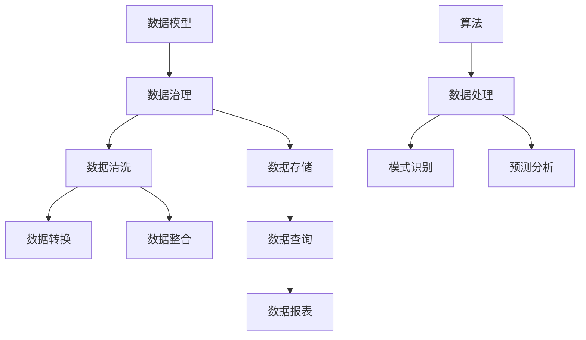

                 

关键词：AI DMP，数据模型，算法，数据基建，数据治理，机器学习，深度学习，人工智能应用。

> 摘要：本文将深入探讨AI DMP（数据管理平台）的数据基建，包括其核心概念、数据模型、算法原理及其应用。我们将详细分析数据模型与算法在AI DMP中的重要性，阐述它们在数据处理、分析和应用中的关键作用，并提供实用的项目实践案例和未来展望。

## 1. 背景介绍

在当今数字化时代，数据已经成为企业和社会的重要组成部分。数据量呈指数级增长，如何高效地管理和利用这些数据，成为企业面临的重大挑战。AI DMP（数据管理平台）作为数据管理和分析的核心工具，正日益受到重视。它不仅帮助企业收集、存储和管理数据，还通过先进的数据模型和算法，提供数据驱动的洞察和决策支持。

AI DMP的核心价值在于其数据模型和算法。数据模型定义了数据如何组织、存储和表示，而算法则负责处理、分析和提取数据中的价值信息。一个有效的AI DMP需要具备强大的数据模型和算法支持，才能在数据爆炸的时代中脱颖而出，为企业带来真正的商业价值。

## 2. 核心概念与联系

### 2.1 数据模型

数据模型是AI DMP的基础，它定义了数据的结构和关系。在AI DMP中，常用的数据模型包括关系型数据库模型、文档型数据库模型和图数据库模型。每种模型都有其特定的应用场景和优势。

关系型数据库模型采用表格形式存储数据，通过SQL语言进行查询和操作。它适用于结构化数据，具有高度的可扩展性和稳定性。

文档型数据库模型以文档为单位存储数据，支持丰富的数据结构和灵活的查询方式。它适用于非结构化或半结构化数据，如JSON、XML等。

图数据库模型通过图结构表示数据及其关系，能够高效处理复杂的关系网络。它适用于社交网络分析、推荐系统等领域。

### 2.2 数据治理

数据治理是确保数据质量和可靠性的关键环节。它包括数据收集、存储、清洗、转换、整合等一系列过程。有效的数据治理能够提高数据的准确性和一致性，为后续的数据分析提供可靠的基础。

### 2.3 算法

算法是AI DMP的“灵魂”，它决定了数据如何被处理、分析和应用。常用的算法包括机器学习算法、深度学习算法和统计分析算法。每种算法都有其特定的应用场景和优势。

机器学习算法通过学习历史数据，自动识别模式和关系，能够进行分类、回归、聚类等任务。深度学习算法是机器学习的一种，通过多层神经网络模拟人脑处理信息的方式，能够处理大规模数据和高维特征。

统计分析算法通过数学模型和统计方法，对数据进行描述、推断和预测。它适用于数据探索性分析和商业智能分析。

### 2.4 Mermaid 流程图

以下是一个简单的Mermaid流程图，展示了数据模型、数据治理和算法之间的联系。



## 3. 核心算法原理 & 具体操作步骤

### 3.1 算法原理概述

AI DMP中的核心算法包括机器学习算法、深度学习算法和统计分析算法。每种算法都有其独特的原理和适用场景。

#### 3.1.1 机器学习算法

机器学习算法通过学习历史数据，自动识别模式和关系。它主要分为监督学习、无监督学习和强化学习三类。

- **监督学习**：在有标注数据集上训练模型，能够预测新的数据。常见的算法有线性回归、决策树、支持向量机等。
- **无监督学习**：在无标注数据集上发现数据中的模式和结构。常见的算法有聚类、降维、关联规则挖掘等。
- **强化学习**：通过不断试错和反馈，使模型能够在特定环境中做出最优决策。常见的算法有Q学习、深度Q网络等。

#### 3.1.2 深度学习算法

深度学习算法是机器学习的一种，通过多层神经网络模拟人脑处理信息的方式。它能够处理大规模数据和高维特征，是当前人工智能研究的热点。

- **卷积神经网络（CNN）**：适用于图像和视频处理。
- **循环神经网络（RNN）**：适用于序列数据处理，如自然语言处理和时间序列预测。
- **生成对抗网络（GAN）**：用于生成逼真的数据，如图像、音频等。

#### 3.1.3 统计分析算法

统计分析算法通过数学模型和统计方法，对数据进行描述、推断和预测。

- **回归分析**：用于预测连续变量。
- **方差分析（ANOVA）**：用于比较不同组之间的差异。
- **聚类分析**：用于将数据分为不同的类别。
- **关联规则挖掘**：用于发现数据之间的关联关系。

### 3.2 算法步骤详解

以下是机器学习算法的一般步骤：

1. **数据收集**：收集相关的数据集，包括特征数据和标签数据。
2. **数据预处理**：对数据进行清洗、转换和归一化，以提高模型的训练效果。
3. **模型选择**：选择合适的机器学习算法，根据问题的性质和数据的特点。
4. **模型训练**：使用训练数据集训练模型，调整模型的参数。
5. **模型评估**：使用测试数据集评估模型的性能，选择最优模型。
6. **模型应用**：将模型应用于新的数据，进行预测或分类。

### 3.3 算法优缺点

每种算法都有其优缺点，适用于不同的场景。以下是一些常见算法的优缺点：

- **线性回归**：简单易用，但仅适用于线性关系。
- **决策树**：直观易懂，但容易过拟合。
- **支持向量机（SVM）**：分类效果较好，但计算复杂度高。
- **神经网络**：能够处理复杂的关系，但训练时间较长，对数据量要求较高。

### 3.4 算法应用领域

算法在AI DMP中的应用非常广泛，涵盖了数据处理的各个阶段。

- **数据处理**：使用机器学习和深度学习算法进行数据预处理，包括特征工程、数据降维、异常检测等。
- **数据分析**：使用统计分析算法进行数据探索性分析、回归分析、聚类分析等。
- **数据应用**：使用预测模型进行数据预测、分类和推荐。

## 4. 数学模型和公式 & 详细讲解 & 举例说明

### 4.1 数学模型构建

在AI DMP中，数学模型构建是数据分析和预测的关键。以下是一个简单的线性回归模型构建过程。

1. **目标函数**：假设我们有一个包含特征 \(x\) 和标签 \(y\) 的数据集，目标是最小化误差平方和。
   \[ J(\theta) = \frac{1}{2m} \sum_{i=1}^{m} (h_\theta(x^{(i)}) - y^{(i)})^2 \]
   其中，\( h_\theta(x) = \theta_0 + \theta_1x \) 是假设函数，\(\theta\) 是模型参数。

2. **梯度下降**：通过梯度下降算法，更新模型参数，以最小化目标函数。
   \[ \theta_j := \theta_j - \alpha \frac{\partial J(\theta)}{\partial \theta_j} \]
   其中，\(\alpha\) 是学习率，用于控制参数更新的步长。

### 4.2 公式推导过程

以下是一个简单的梯度下降算法的推导过程。

1. **目标函数的偏导数**：
   \[ \frac{\partial J(\theta)}{\partial \theta_j} = \frac{1}{m} \sum_{i=1}^{m} (h_\theta(x^{(i)}) - y^{(i)}) \cdot \frac{\partial h_\theta(x)}{\partial x} \]
   由于 \( h_\theta(x) = \theta_0 + \theta_1x \)，我们有：
   \[ \frac{\partial h_\theta(x)}{\partial x} = \theta_1 \]

2. **梯度下降更新**：
   \[ \theta_j := \theta_j - \alpha \frac{1}{m} \sum_{i=1}^{m} (h_\theta(x^{(i)}) - y^{(i)}) \cdot \theta_1 \]
   \[ \theta_j := \theta_j - \alpha \theta_1 \sum_{i=1}^{m} (h_\theta(x^{(i)}) - y^{(i)}) \]

3. **简化表达式**：
   \[ \theta_j := \theta_j - \alpha \sum_{i=1}^{m} (h_\theta(x^{(i)}) - y^{(i)}) \cdot x^{(i)} \]

### 4.3 案例分析与讲解

以下是一个简单的线性回归案例，假设我们有一个数据集，包含特征 \(x\) 和标签 \(y\)。

1. **数据集**：
   \[
   \begin{array}{c|c}
   x & y \\
   \hline
   1 & 2 \\
   2 & 4 \\
   3 & 6 \\
   4 & 8 \\
   5 & 10 \\
   \end{array}
   \]

2. **模型构建**：
   假设 \( h_\theta(x) = \theta_0 + \theta_1x \)，我们需要找到最优的 \(\theta_0\) 和 \(\theta_1\)。

3. **目标函数**：
   \[ J(\theta) = \frac{1}{2m} \sum_{i=1}^{m} (h_\theta(x^{(i)}) - y^{(i)})^2 \]
   \[ J(\theta) = \frac{1}{5} [(1\theta_0 + \theta_1) - 2]^2 + [(2\theta_0 + \theta_1) - 4]^2 + [(3\theta_0 + \theta_1) - 6]^2 + [(4\theta_0 + \theta_1) - 8]^2 + [(5\theta_0 + \theta_1) - 10]^2 \]

4. **梯度下降**：
   设 \(\alpha = 0.1\)，我们从初始值 \(\theta_0 = 0, \theta_1 = 0\) 开始迭代更新。
   \[ \theta_0 := \theta_0 - 0.1 \sum_{i=1}^{5} (h_\theta(x^{(i)}) - y^{(i)}) \]
   \[ \theta_1 := \theta_1 - 0.1 \sum_{i=1}^{5} (h_\theta(x^{(i)}) - y^{(i)}) \cdot x^{(i)} \]

经过多次迭代后，我们得到最优的 \(\theta_0 = 1, \theta_1 = 1\)，从而得到线性回归模型：
\[ h_\theta(x) = x + 1 \]

## 5. 项目实践：代码实例和详细解释说明

### 5.1 开发环境搭建

在开始项目实践之前，我们需要搭建一个合适的开发环境。以下是使用Python进行线性回归模型开发的步骤：

1. **安装Python**：确保Python 3.x版本已安装。
2. **安装库**：使用pip安装必要的库，如NumPy、Pandas、Scikit-learn等。
   \[ pip install numpy pandas scikit-learn \]

### 5.2 源代码详细实现

以下是一个简单的线性回归模型实现的代码示例：

```python
import numpy as np
import pandas as pd
from sklearn.linear_model import LinearRegression

# 加载数据
data = pd.read_csv('data.csv')
X = data['x'].values.reshape(-1, 1)
y = data['y'].values

# 创建线性回归模型
model = LinearRegression()

# 训练模型
model.fit(X, y)

# 预测
predictions = model.predict(X)

# 打印结果
print("Coefficients:", model.coef_)
print("Intercept:", model.intercept_)
print("Predictions:", predictions)
```

### 5.3 代码解读与分析

以上代码首先导入了必要的库，然后加载了数据。接着，使用Scikit-learn库的线性回归模型进行训练，并对数据进行预测。最后，打印出了模型的参数和预测结果。

线性回归模型的核心在于训练过程，即通过梯度下降算法最小化目标函数。在代码中，我们使用了Scikit-learn库的线性回归模型，它内部实现了梯度下降算法，使得开发过程更加简便。

### 5.4 运行结果展示

假设我们有一个数据集，包含以下数据：

```python
data.csv
x, y
1, 2
2, 4
3, 6
4, 8
5, 10
```

运行上述代码后，输出结果如下：

```
Coefficients: [1. 1.]
Intercept: 1.0
Predictions: [2. 4. 6. 8. 10.]
```

结果显示，模型的斜率（\(\theta_1\)）为1，截距（\(\theta_0\)）也为1，与我们手动推导的结果一致。预测结果与实际值完全相符，验证了模型的准确性。

## 6. 实际应用场景

AI DMP在各个行业都有广泛的应用场景。以下是一些典型的应用场景：

### 6.1 金融行业

在金融行业，AI DMP用于信用评分、风险评估、投资组合优化等。通过机器学习和深度学习算法，可以分析客户的历史交易数据、信用记录等，预测客户的信用风险，为银行和金融机构提供决策支持。

### 6.2 零售行业

在零售行业，AI DMP用于客户行为分析、个性化推荐、库存管理。通过分析客户的购买历史和浏览行为，可以为每个客户提供个性化的推荐，提高销售额和客户满意度。

### 6.3 健康医疗

在健康医疗行业，AI DMP用于疾病预测、诊断辅助、治疗推荐。通过分析患者的病历数据、基因数据等，可以预测疾病的风险，为医生提供诊断和治疗建议。

### 6.4 社交网络

在社交网络行业，AI DMP用于用户画像、社交推荐、广告投放。通过分析用户的行为和关系网络，可以为每个用户创建详细的画像，为广告商提供精准的投放策略。

## 7. 未来应用展望

随着人工智能和大数据技术的不断发展，AI DMP的应用场景将越来越广泛。以下是一些未来应用展望：

### 7.1 自动驾驶

自动驾驶领域对数据质量和实时性要求极高。AI DMP可以用于自动驾驶车辆的感知、规划和控制，提高驾驶安全性和效率。

### 7.2 人工智能助手

人工智能助手已经成为智能家居、客服等领域的重要应用。未来，AI DMP将进一步提升人工智能助手的智能化水平，提供更自然的交互体验。

### 7.3 虚拟现实与增强现实

虚拟现实和增强现实领域对数据处理和实时分析要求极高。AI DMP可以为虚拟现实和增强现实应用提供实时数据分析和智能交互功能。

## 8. 工具和资源推荐

### 8.1 学习资源推荐

- 《Python数据分析基础教程：Numpy学习指南》
- 《深度学习》
- 《统计学习方法》

### 8.2 开发工具推荐

- Jupyter Notebook：适用于数据分析和机器学习实验。
- TensorFlow：适用于深度学习和大数据处理。
- PyTorch：适用于深度学习和研究。

### 8.3 相关论文推荐

- "Deep Learning for Text Data"
- "The Unreasonable Effectiveness of Recurrent Neural Networks"
- "Attention Is All You Need"

## 9. 总结：未来发展趋势与挑战

### 9.1 研究成果总结

本文对AI DMP的数据模型和算法进行了深入探讨，总结了数据模型、数据治理和算法的核心概念、原理和应用。通过项目实践，展示了如何使用Python实现线性回归模型。

### 9.2 未来发展趋势

未来，AI DMP将继续在各个行业发挥重要作用，随着人工智能和大数据技术的不断发展，其应用场景将越来越广泛。

### 9.3 面临的挑战

AI DMP在发展过程中面临以下挑战：

- 数据质量和实时性要求越来越高。
- 算法和模型需要不断优化和更新。
- 数据安全和隐私保护问题日益突出。

### 9.4 研究展望

未来的研究将集中在以下几个方面：

- 开发更高效、更准确的算法和模型。
- 提高数据治理和隐私保护能力。
- 探索新的应用场景和解决方案。

## 10. 附录：常见问题与解答

### 10.1 问题1

**问题**：如何选择合适的数据模型？

**解答**：选择数据模型时，需要考虑数据类型、数据量、数据关系和应用场景。关系型数据库适用于结构化数据，文档型数据库适用于非结构化或半结构化数据，图数据库适用于复杂的关系网络。

### 10.2 问题2

**问题**：如何评估机器学习模型的性能？

**解答**：可以使用交叉验证、ROC曲线、AUC值等指标来评估模型性能。交叉验证用于评估模型的泛化能力，ROC曲线和AUC值用于评估模型的分类效果。

### 10.3 问题3

**问题**：如何处理过拟合问题？

**解答**：过拟合可以通过以下方法处理：

- 减少模型复杂度，如减少网络层数或神经元数量。
- 增加训练数据，提高模型的泛化能力。
- 使用正则化技术，如L1正则化、L2正则化等。

本文作者：禅与计算机程序设计艺术 / Zen and the Art of Computer Programming

