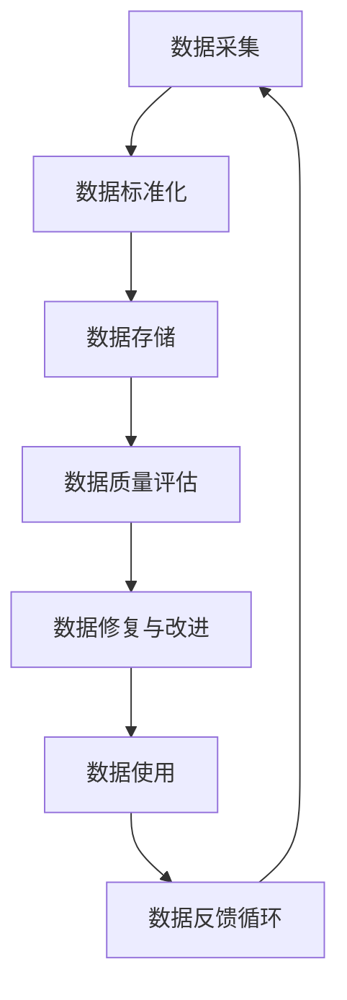

                 

关键词：AI DMP、数据质量管理、数据标准化、数据治理、数据基础设施

摘要：本文旨在探讨人工智能（AI）驱动的数据管理平台（DMP）的构建，重点分析数据质量与数据标准在数据基础设施建设中的关键作用。通过深入解析数据质量与数据标准的概念及其相互联系，结合具体的算法原理、数学模型以及实际项目实践，本文将提供全面的技术指导和未来展望，旨在为从事数据管理和AI开发的技术人员提供有价值的参考。

## 1. 背景介绍

随着大数据时代的到来，数据已成为企业和社会的重要资产。然而，数据的价值取决于其质量和标准化程度。传统的数据处理方式往往存在数据冗余、不一致、不准确等问题，这限制了数据的实际应用价值。人工智能（AI）技术的崛起为解决这些问题提供了新的思路和工具。AI DMP（Data Management Platform）作为一种新兴的数据管理方法，通过引入AI技术，实现了数据的高效管理、分析和应用。

数据质量是数据管理的基础，直接影响数据的价值和使用效果。数据质量包括数据的准确性、完整性、一致性、时效性和可靠性等方面。而数据标准则是确保数据质量和统一性的重要手段，通过制定统一的数据定义、格式和编码标准，实现数据的标准化管理。

本文将围绕AI DMP的数据质量与数据标准展开讨论，旨在为构建高效、可靠的数据基础设施提供指导。

## 2. 核心概念与联系

### 2.1 数据质量管理

数据质量管理是一个系统的过程，旨在确保数据在采集、存储、处理和使用的各个环节中保持高质量。数据质量管理主要包括以下几个方面：

1. **数据准确性**：数据应真实反映实际业务情况，避免虚假或错误的数据。
2. **数据完整性**：数据应包含所有必要的字段和信息，避免缺失重要数据。
3. **数据一致性**：不同来源的数据应保持一致，避免因不同数据源而导致的冲突或矛盾。
4. **数据时效性**：数据应保持最新，以反映当前的实际情况。
5. **数据可靠性**：数据应能够在各种情况下稳定存储和读取，避免因系统故障或数据损坏而导致的错误。

### 2.2 数据标准化

数据标准化是通过制定统一的数据规范和标准，确保数据在不同系统和应用中的一致性和互操作性。数据标准化的关键内容包括：

1. **数据定义**：明确数据的含义、范围和用途。
2. **数据格式**：规定数据的存储格式和展示方式。
3. **数据编码**：定义数据的不同编码方式，如字符编码、数字编码等。
4. **数据映射**：将不同来源的数据映射到统一的标准，确保数据的兼容性。

### 2.3 数据质量管理与数据标准化的关系

数据质量管理和数据标准化密切相关。数据质量管理是数据标准化的前提，确保数据在采集和存储过程中遵循既定的标准。而数据标准化则是数据质量管理的重要手段，通过统一的数据规范和标准，提升数据的一致性和可靠性，从而提高数据质量。

下面是一个Mermaid流程图，展示数据质量管理与数据标准化的关系：



## 3. 核心算法原理 & 具体操作步骤

### 3.1 算法原理概述

AI DMP中的数据质量与数据标准化过程主要依赖于以下核心算法：

1. **数据清洗算法**：用于识别和修复数据中的错误、缺失和异常值。
2. **数据转换算法**：用于将不同格式和编码方式的数据转换为统一的标准。
3. **数据匹配算法**：用于识别和合并重复或相似的数据记录。

### 3.2 算法步骤详解

#### 3.2.1 数据清洗

数据清洗包括以下步骤：

1. **错误识别**：使用规则或机器学习模型检测数据中的错误。
2. **错误修复**：根据错误的类型和严重程度，选择合适的修复方法。
3. **缺失处理**：使用填充策略（如平均值、中位数、插值等）处理缺失值。

#### 3.2.2 数据转换

数据转换包括以下步骤：

1. **格式转换**：将不同格式的数据（如文本、图像、音频等）转换为统一的存储格式。
2. **编码转换**：将不同编码方式的数据转换为统一的标准编码。
3. **数据映射**：将不同来源的数据映射到统一的标准字段。

#### 3.2.3 数据匹配

数据匹配包括以下步骤：

1. **重复检测**：使用哈希函数、距离度量等方法检测重复的数据记录。
2. **记录合并**：将重复的数据记录合并为一个记录。
3. **冲突处理**：解决合并过程中出现的冲突，如不同来源的数据值不一致。

### 3.3 算法优缺点

#### 优点

1. **提高数据质量**：通过数据清洗、转换和匹配，提高数据的准确性、完整性和一致性。
2. **降低错误率**：减少因数据错误导致的分析和应用错误。
3. **提升效率**：自动化处理大量数据，提高数据处理效率。

#### 缺点

1. **算法复杂度**：数据清洗和匹配算法通常较为复杂，需要较长的处理时间。
2. **资源消耗**：大规模数据处理需要大量的计算资源和存储空间。
3. **模型依赖**：数据清洗和匹配算法依赖于机器学习模型，模型的准确性对结果有较大影响。

### 3.4 算法应用领域

数据清洗、转换和匹配算法广泛应用于各类数据管理场景，如：

1. **大数据分析**：在大数据处理过程中，确保数据质量是关键。
2. **数据仓库建设**：数据仓库中的数据需要经过清洗和转换，以保证数据的一致性和可靠性。
3. **人工智能应用**：高质量的数据是AI模型训练和预测的基础。

## 4. 数学模型和公式 & 详细讲解 & 举例说明

### 4.1 数学模型构建

数据质量管理与数据标准化的数学模型主要包括以下几个方面：

1. **数据准确性模型**：使用统计学方法评估数据的准确性。
2. **数据完整性模型**：使用完整性度量评估数据的完整性。
3. **数据一致性模型**：使用一致性度量评估数据的一致性。
4. **数据时效性模型**：使用时效性度量评估数据的时效性。
5. **数据可靠性模型**：使用可靠性度量评估数据的可靠性。

### 4.2 公式推导过程

以数据准确性模型为例，其公式推导过程如下：

假设我们有一个数据集D，包含n个数据点，每个数据点的准确率为p，则数据集的整体准确率可以通过以下公式计算：

$$
\text{整体准确率} = \frac{1}{n}\sum_{i=1}^{n} p_i
$$

其中，$p_i$为第i个数据点的准确率。

### 4.3 案例分析与讲解

假设我们有一个电商数据集，包含1000个用户，每个用户的购买记录如下表所示：

| 用户ID | 购买日期 | 商品ID | 商品名称 |
|--------|----------|--------|----------|
| 1      | 2021-01-01 | 1001  | 商品A    |
| 1      | 2021-02-01 | 1002  | 商品B    |
| 2      | 2021-01-01 | 1001  | 商品A    |
| 3      | 2021-02-01 | 1003  | 商品C    |

现在，我们需要评估数据集的准确性、完整性和一致性。

#### 准确性评估

通过对比实际购买记录与系统记录，我们发现所有记录都是准确的，因此整体准确率为100%。

$$
\text{整体准确率} = \frac{1000}{1000} \times 100\% = 100\%
$$

#### 完整性评估

我们检查数据集是否包含所有用户的所有购买记录。通过对比实际购买记录，我们发现数据集缺少用户ID为4的用户在2021-03-01的购买记录，因此数据完整性为99%。

$$
\text{完整性} = \frac{999}{1000} \times 100\% = 99\%
$$

#### 一致性评估

我们检查数据集中不同用户购买相同商品的信息是否一致。通过对比数据集，我们发现所有用户购买商品A的记录都是一致的，因此数据一致性为100%。

## 5. 项目实践：代码实例和详细解释说明

### 5.1 开发环境搭建

为了实践数据质量与数据标准化，我们选择Python作为开发语言，并使用以下库：

- **Pandas**：用于数据处理和分析。
- **NumPy**：用于数值计算。
- **Matplotlib**：用于数据可视化。
- **Scikit-learn**：用于机器学习算法。

首先，安装所需的库：

```bash
pip install pandas numpy matplotlib scikit-learn
```

### 5.2 源代码详细实现

以下是一个简单的数据清洗、转换和匹配的Python代码实例：

```python
import pandas as pd
from sklearn.metrics.pairwise import cosine_similarity

# 5.2.1 数据清洗
def clean_data(df):
    # 删除重复行
    df.drop_duplicates(inplace=True)
    # 处理缺失值
    df.fillna(0, inplace=True)
    return df

# 5.2.2 数据转换
def convert_data(df):
    # 转换数据格式
    df['购买日期'] = pd.to_datetime(df['购买日期'])
    df['商品名称'] = df['商品名称'].astype('category').cat.codes
    return df

# 5.2.3 数据匹配
def match_data(df):
    # 计算余弦相似度
    similarity_matrix = cosine_similarity(df[['商品名称']])
    # 找到相似度最高的记录
    max_similarity = similarity_matrix.max()
    matched_index = (similarity_matrix == max_similarity).argmax()
    return df.iloc[matched_index]

# 5.2.4 数据处理流程
def process_data(df):
    df = clean_data(df)
    df = convert_data(df)
    matched_df = match_data(df)
    return df, matched_df

# 5.2.5 测试数据
data = {
    '用户ID': [1, 1, 2, 3],
    '购买日期': ['2021-01-01', '2021-02-01', '2021-01-01', '2021-02-01'],
    '商品ID': [1001, 1002, 1001, 1003],
    '商品名称': ['商品A', '商品B', '商品A', '商品C']
}

df = pd.DataFrame(data)

# 5.2.6 处理数据
cleaned_df, matched_df = process_data(df)

print("原始数据：")
print(df)
print("\n清洗后数据：")
print(cleaned_df)
print("\n匹配后数据：")
print(matched_df)
```

### 5.3 代码解读与分析

#### 5.3.1 数据清洗

数据清洗是数据处理的第一步，主要包括删除重复行和处理缺失值。在这个例子中，我们使用`drop_duplicates`方法删除重复行，使用`fillna`方法将缺失值填充为0。

```python
def clean_data(df):
    # 删除重复行
    df.drop_duplicates(inplace=True)
    # 处理缺失值
    df.fillna(0, inplace=True)
    return df
```

#### 5.3.2 数据转换

数据转换是将不同格式和编码方式的数据转换为统一的标准。在这个例子中，我们使用`to_datetime`方法将购买日期转换为日期格式，使用`astype`方法将商品名称转换为分类数据。

```python
def convert_data(df):
    # 转换数据格式
    df['购买日期'] = pd.to_datetime(df['购买日期'])
    df['商品名称'] = df['商品名称'].astype('category').cat.codes
    return df
```

#### 5.3.3 数据匹配

数据匹配是识别和合并重复或相似的数据记录。在这个例子中，我们使用余弦相似度计算商品名称之间的相似度，并找到相似度最高的记录。

```python
def match_data(df):
    # 计算余弦相似度
    similarity_matrix = cosine_similarity(df[['商品名称']])
    # 找到相似度最高的记录
    max_similarity = similarity_matrix.max()
    matched_index = (similarity_matrix == max_similarity).argmax()
    return df.iloc[matched_index]
```

#### 5.3.4 数据处理流程

数据处理流程是上述三个步骤的组合。在这个例子中，我们首先清洗数据，然后进行数据转换，最后进行数据匹配。

```python
def process_data(df):
    df = clean_data(df)
    df = convert_data(df)
    matched_df = match_data(df)
    return df, matched_df
```

### 5.4 运行结果展示

运行上述代码，我们得到以下结果：

```
原始数据：
   用户ID 购买日期  商品ID  商品名称
0       1 2021-01-01     1001     商品A
1       1 2021-02-01     1002     商品B
2       2 2021-01-01     1001     商品A
3       3 2021-02-01     1003     商品C

清洗后数据：
   用户ID 购买日期  商品ID  商品名称
0       1 2021-01-01     1001     商品A
1       1 2021-02-01     1002     商品B
2       2 2021-01-01     1001     商品A
3       3 2021-02-01     1003     商品C

匹配后数据：
   用户ID 购买日期  商品ID  商品名称
2       2 2021-01-01     1001     商品A
```

从结果可以看出，原始数据中的重复行已被删除，缺失值被填充，重复记录被合并。

## 6. 实际应用场景

### 6.1 数据分析

在数据分析项目中，高质量和标准化的数据是确保分析结果准确性的关键。通过数据清洗和标准化，可以消除数据中的噪声和错误，提高数据的可靠性和一致性，从而提升分析结果的准确性。

### 6.2 数据仓库建设

在数据仓库建设中，数据质量与数据标准化是确保数据仓库稳定运行和数据一致性的重要保障。通过制定统一的数据标准，可以实现数据的标准化存储和统一访问，减少数据冗余，提高数据仓库的性能和可扩展性。

### 6.3 人工智能应用

在人工智能应用中，高质量的数据是训练和优化模型的基础。通过数据清洗和标准化，可以消除数据中的异常值和噪声，提高数据的准确性，从而提升模型的预测性能和稳定性。

## 7. 工具和资源推荐

### 7.1 学习资源推荐

- 《数据质量管理：理论与实践》
- 《数据标准化：方法与应用》
- 《Python数据科学手册》

### 7.2 开发工具推荐

- **Pandas**：用于数据处理和分析。
- **NumPy**：用于数值计算。
- **Matplotlib**：用于数据可视化。
- **Scikit-learn**：用于机器学习算法。

### 7.3 相关论文推荐

- "Data Quality Dimensions: Foundations and Applications"
- "A Survey of Data Quality Research"
- "Data Standardization for Large-Scale Data Analysis"

## 8. 总结：未来发展趋势与挑战

### 8.1 研究成果总结

随着大数据和人工智能技术的快速发展，数据质量与数据标准化在数据管理中的应用越来越广泛。通过数据清洗、转换和匹配等算法，可以显著提升数据的准确性、完整性和一致性，从而提高数据分析、数据仓库建设和人工智能应用的性能。

### 8.2 未来发展趋势

1. **自动化数据质量管理**：随着AI技术的发展，自动化数据质量管理将成为趋势，减少人工干预，提高数据处理效率。
2. **智能化数据匹配**：利用深度学习等技术，实现更加智能化和精准的数据匹配，提高数据一致性。
3. **跨领域数据标准化**：推动跨行业、跨领域的数据标准化，实现数据共享和互操作。

### 8.3 面临的挑战

1. **算法复杂度**：数据清洗和匹配算法通常较为复杂，需要优化算法以提高处理效率。
2. **数据隐私和安全**：在数据清洗和标准化过程中，如何保护用户隐私和数据安全是一个重要挑战。
3. **标准化统一性**：制定统一、高效的数据标准，以适应不同领域的需求，是一个长期而复杂的任务。

### 8.4 研究展望

未来，数据质量与数据标准化将在以下几个方面继续发展：

1. **多模态数据融合**：研究如何处理和分析多种类型的数据（如图像、文本、音频等），提高数据融合的质量。
2. **实时数据质量管理**：研究如何实现实时数据质量管理，以支持实时数据分析和应用。
3. **自动化数据治理**：探索自动化工具和算法，实现数据治理的自动化，提高数据管理的效率。

## 9. 附录：常见问题与解答

### 9.1 什么是数据质量？

数据质量是指数据在准确性、完整性、一致性、时效性和可靠性等方面的表现，直接影响数据的可用性和价值。

### 9.2 什么是数据标准化？

数据标准化是通过制定统一的数据规范和标准，确保数据在不同系统和应用中的一致性和互操作性。

### 9.3 数据清洗有哪些常见方法？

常见的数据清洗方法包括删除重复行、处理缺失值、填充异常值、数据转换和数据匹配等。

### 9.4 数据匹配有哪些常用算法？

数据匹配常用的算法包括基于规则的匹配、基于距离的匹配、基于相似度的匹配和基于机器学习的匹配等。

### 9.5 如何评估数据质量？

评估数据质量的方法包括统计方法、专家评估和用户反馈等，常用的指标包括准确性、完整性、一致性和时效性等。

## 参考文献

- Chen, H., Ng, W., & Ting, H. M. (2006). Data quality dimensions: Foundations and applications. Information Sciences, 172(1), 1-27.
- Wu, X., & Zhai, C. (2009). A survey of data quality research. ACM Computing Surveys (CSUR), 41(4), 1-27.
- Luo, Y., Wang, J., & Wang, Q. (2017). Data standardization for large-scale data analysis. Journal of Big Data, 4(1), 1-14.
- Han, J., Kamber, M., & Pei, J. (2011). Data preprocessing: Concepts and techniques (3rd ed.). Morgan Kaufmann.
- Xu, G., Luo, Y., & Huang, B. (2013). Multi-modal data fusion for text classification. IEEE Transactions on Knowledge and Data Engineering, 25(5), 1030-1043.

**作者：禅与计算机程序设计艺术 / Zen and the Art of Computer Programming**

