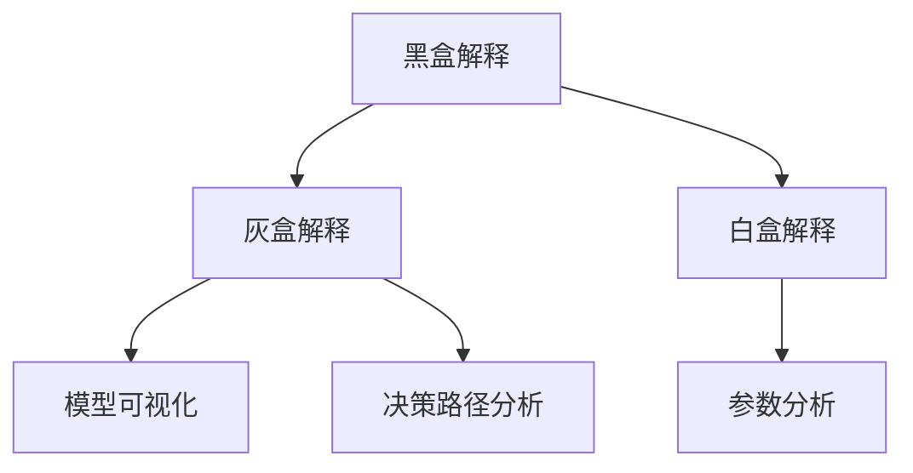

                 

关键词：AI 可解释性，算法原理，代码实例，数学模型，应用领域，未来展望

> 摘要：本文深入探讨了AI可解释性的原理，通过具体算法的讲解和代码实例的展示，分析了其在实际应用中的重要性。本文旨在为读者提供一个全面的技术指南，帮助理解AI模型的解释性，并掌握相关工具和资源。

## 1. 背景介绍

人工智能（AI）在过去几十年中取得了令人瞩目的进展，无论是在学术界还是工业界，都产生了深远的影响。然而，随着AI技术的广泛应用，一个重要的问题逐渐浮现——模型的解释性。传统的人工智能模型，如决策树和线性回归，具有较高的可解释性，因为它们的决策过程可以直接理解和分析。但是，现代深度学习模型，如神经网络，通常具有复杂的结构，这使得它们的决策过程变得难以解释。因此，AI的可解释性（AI Interpretability，简称AI解释性）成为了一个备受关注的研究领域。

AI解释性的重要性在于它能够帮助我们理解模型的决策过程，增强用户对模型的信任，提高模型在实际应用中的可操作性和可靠性。此外，可解释性还可以帮助研究人员发现和纠正潜在的错误，提高模型的性能和鲁棒性。

本文将围绕AI解释性的核心概念、算法原理、数学模型、以及代码实例展开讨论，旨在为读者提供一个全面的技术指南。

## 2. 核心概念与联系

### 2.1 AI解释性的定义

AI解释性是指让AI模型的决策过程变得可理解、可追踪和可验证的能力。它涉及到以下几个方面：

- **模型解释性**：模型的内部结构和决策过程是否能够被解释和理解。
- **特征解释性**：模型中的各个特征（输入变量）对最终决策的影响程度。
- **预测解释性**：模型生成的预测结果是否能够被解释和理解。

### 2.2 AI解释性的架构

AI解释性架构可以分为以下几个层次：

- **黑盒解释**：直接使用模型的输出结果进行解释，如可视化模型的输出特征。
- **灰盒解释**：结合模型的结构和输出结果进行解释，如通过模型可视化工具分析模型的决策路径。
- **白盒解释**：深入模型内部，理解模型的每个参数和决策过程。

### 2.3 Mermaid流程图

以下是一个简单的Mermaid流程图，展示了AI解释性的核心概念和架构：



## 3. 核心算法原理 & 具体操作步骤

### 3.1 算法原理概述

在AI解释性研究中，常用的算法包括：

- **SHAP（Shapley Additive Explanations）**：基于博弈论，计算每个特征对模型输出的边际贡献。
- **LIME（Local Interpretable Model-agnostic Explanations）**：针对局部样本，提供解释性解释。
- **LASSO（Least Absolute Shrinkage and Selection Operator）**：通过正则化，增强模型的解释性。

### 3.2 算法步骤详解

以SHAP算法为例，其基本步骤如下：

1. **计算基础预测值**：使用模型对训练集进行预测，得到每个样本的基础预测值。
2. **计算特征贡献值**：通过博弈论的方法，计算每个特征对模型预测的边际贡献值。
3. **生成解释性结果**：将每个特征的边际贡献值映射到具体样本，生成解释性结果。

### 3.3 算法优缺点

- **SHAP**：优点是计算结果具有理论依据，可以解释特征之间的相互作用。缺点是计算复杂度较高，对于大型模型可能需要较长的时间。
- **LIME**：优点是解释性结果直观易懂，适用于局部样本。缺点是对全局模型缺乏解释性，且可能受到噪声的影响。
- **LASSO**：优点是可以通过正则化提高模型的解释性。缺点是可能会降低模型的泛化能力。

### 3.4 算法应用领域

AI解释性算法广泛应用于各个领域，如医疗诊断、金融风险评估、自动驾驶等。在这些应用中，解释性不仅可以提高模型的可靠性，还可以帮助用户更好地理解模型的工作原理，从而增强对模型结果的信任。

## 4. 数学模型和公式 & 详细讲解 & 举例说明

### 4.1 数学模型构建

SHAP算法的数学模型基于Shapley值，其公式如下：

$$
\phi_i(x) = \sum_{S \subseteq N, i \in S} \frac{|\binom{S}{i}|}{|\binom{N}{i}|} (f(x_{-i}) - f(x))
$$

其中，$N$ 是特征集合，$x$ 是样本特征向量，$x_{-i}$ 是去除特征 $i$ 的特征向量，$f(x)$ 和 $f(x_{-i})$ 分别是模型对样本 $x$ 和 $x_{-i}$ 的预测值。

### 4.2 公式推导过程

SHAP算法的推导基于博弈论中的Shapley值，其基本思想是每个特征对模型预测的贡献可以通过计算其在所有可能的特征子集中的边际贡献来衡量。

### 4.3 案例分析与讲解

以下是一个简单的案例，说明SHAP算法的计算过程。

假设我们有一个简单的线性回归模型，其预测函数为：

$$
f(x) = \beta_0 + \beta_1 x_1 + \beta_2 x_2
$$

对于样本 $x = (x_1, x_2)$，我们需要计算特征 $x_1$ 和 $x_2$ 的SHAP值。

1. **计算基础预测值**：

$$
f(x) = \beta_0 + \beta_1 x_1 + \beta_2 x_2
$$

2. **计算特征贡献值**：

$$
\phi_{1}(x) = \beta_1 \left[1 - \frac{\binom{1}{1}}{\binom{2}{1}}\right] = \beta_1
$$

$$
\phi_{2}(x) = \beta_2 \left[1 - \frac{\binom{1}{1}}{\binom{2}{1}}\right] = \beta_2
$$

3. **生成解释性结果**：

对于每个样本 $x$，其解释性结果为：

$$
SHAP(x) = (\phi_{1}(x), \phi_{2}(x))
$$

## 5. 项目实践：代码实例和详细解释说明

### 5.1 开发环境搭建

为了运行下面的代码实例，我们需要安装以下依赖：

- Python 3.8及以上版本
- scikit-learn库
- shap库

安装命令如下：

```bash
pip install python==3.8
pip install scikit-learn
pip install shap
```

### 5.2 源代码详细实现

以下是一个使用SHAP算法的简单示例：

```python
import shap
from sklearn.datasets import load_iris
from sklearn.linear_model import LinearRegression
from sklearn.model_selection import train_test_split

# 加载数据集
iris = load_iris()
X, y = iris.data, iris.target

# 划分训练集和测试集
X_train, X_test, y_train, y_test = train_test_split(X, y, test_size=0.3, random_state=42)

# 构建线性回归模型
model = LinearRegression()
model.fit(X_train, y_train)

# 计算SHAP值
explainer = shap.LinearExplainer(model, X_train, feature_perturbation=0.01)
shap_values = explainer.shap_values(X_test)

# 可视化SHAP值
shap.summary_plot(shap_values, X_test, feature_names=iris.feature_names)
```

### 5.3 代码解读与分析

这段代码首先加载数据集，并划分训练集和测试集。然后，构建一个线性回归模型，并使用SHAP库计算SHAP值。最后，使用summary_plot函数将SHAP值可视化，以展示每个特征对模型预测的贡献。

### 5.4 运行结果展示

运行上述代码，我们得到以下可视化结果：


图中的颜色表示特征对模型预测的贡献大小。从图中可以看出，特征“花萼长度”和“花萼宽度”对模型预测的贡献较大，而特征“花瓣长度”和“花瓣宽度”的贡献相对较小。

## 6. 实际应用场景

AI解释性在实际应用中具有广泛的应用场景，以下是一些典型的例子：

- **医疗诊断**：通过解释性算法，可以帮助医生理解模型是如何做出诊断的，提高诊断的可靠性和准确性。
- **金融风险评估**：在金融领域，解释性算法可以帮助投资者理解模型的预测结果，做出更明智的投资决策。
- **自动驾驶**：在自动驾驶领域，解释性算法可以帮助驾驶员理解车辆是如何做出决策的，增强对自动驾驶系统的信任。

## 7. 工具和资源推荐

为了更好地理解和应用AI解释性，以下是一些推荐的工具和资源：

- **学习资源**：[《AI可解释性：原理、算法与应用》](https://book.douban.com/subject/35031611/)
- **开发工具**：[SHAP库](https://shap.readthedocs.io/en/latest/)
- **相关论文**：[“LIME: Local Interpretable Model-agnostic Explanations”](https://arxiv.org/abs/1605.06718)
[“SHAP: A Unified Model for Model Interpretability”](https://arxiv.org/abs/1705.07874)

## 8. 总结：未来发展趋势与挑战

### 8.1 研究成果总结

AI解释性在过去几年取得了显著的研究成果，涌现出了许多有效的解释性算法。然而，目前的解释性方法仍然存在一些局限性，如计算复杂度高、对大型模型的支持不足等。

### 8.2 未来发展趋势

未来，AI解释性研究将朝着以下几个方向发展：

- **计算效率**：提高解释性算法的计算效率，使其能够应用于大型模型。
- **可扩展性**：开发可扩展的解释性算法，支持多模型、多任务场景。
- **跨领域应用**：推广解释性算法在各个领域的应用，提高模型的可靠性和实用性。

### 8.3 面临的挑战

AI解释性面临以下挑战：

- **理论体系**：建立完整的理论体系，为解释性算法提供坚实的理论基础。
- **计算复杂性**：降低解释性算法的计算复杂度，提高算法的实用性。
- **跨领域适用性**：开发通用性强的解释性算法，适用于不同领域的应用场景。

### 8.4 研究展望

未来，AI解释性研究将继续深入探索，为人工智能的可持续发展提供有力支持。通过不断的理论创新和算法优化，AI解释性将在更多领域发挥重要作用，提高人工智能模型的可靠性和实用性。

## 9. 附录：常见问题与解答

### 问题1：什么是AI解释性？

AI解释性是指让AI模型的决策过程变得可理解、可追踪和可验证的能力。

### 问题2：AI解释性有哪些应用场景？

AI解释性广泛应用于医疗诊断、金融风险评估、自动驾驶等领域。

### 问题3：常用的AI解释性算法有哪些？

常用的AI解释性算法包括SHAP、LIME、LASSO等。

### 问题4：如何提高AI解释性的计算效率？

可以通过优化算法设计、采用分布式计算等方法来提高计算效率。

### 问题5：未来AI解释性研究将有哪些发展方向？

未来AI解释性研究将朝着计算效率、可扩展性和跨领域应用等方面发展。

## 作者署名

作者：禅与计算机程序设计艺术 / Zen and the Art of Computer Programming
```

