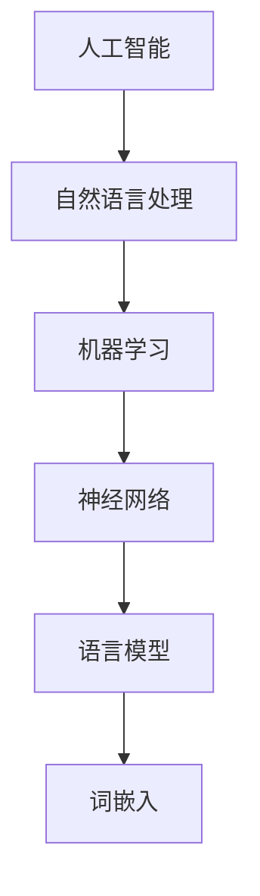

                 

关键词：人工智能，大模型，深度学习，神经网络，机器学习，自然语言处理，智能对话系统，生成模型，算法原理，数学模型，实际应用，未来展望

## 摘要

本文旨在全面介绍人工智能中的大型语言模型（LLM），探讨其核心概念、算法原理、数学模型及其在实际应用中的表现。通过对LLM的基本原理、操作步骤、优缺点以及应用领域的详细分析，本文将帮助读者深入理解这一革命性技术，并展望其未来的发展趋势与挑战。

## 1. 背景介绍

随着互联网的普及和大数据的涌现，人工智能（AI）技术逐渐成为科技领域的热点。其中，自然语言处理（NLP）作为AI的重要分支，在过去几十年中取得了显著进展。传统NLP方法主要依赖于规则和统计模型，但随着深度学习的兴起，基于神经网络的大模型逐渐成为NLP领域的主流。大型语言模型（LLM），如GPT系列、BERT等，凭借其强大的表示能力和生成能力，在文本生成、问答系统、机器翻译等多个方面展现出卓越的性能。

## 2. 核心概念与联系

### 2.1. 语言模型

语言模型是一种概率模型，用于预测文本序列的下一个词。在人工智能中，语言模型是一个重要的工具，可以帮助机器理解自然语言，从而进行对话、文本生成等任务。语言模型的核心是词嵌入（word embeddings），即将单词映射到高维向量空间中，使得语义相似的词在向量空间中接近。

### 2.2. 神经网络

神经网络是一种模仿人脑结构的工作模型，通过多层节点（神经元）进行信息处理。在深度学习中，神经网络被广泛应用于图像识别、语音识别、自然语言处理等领域。神经网络的核心是激活函数（activation function），它决定了神经元的输出方式。

### 2.3. 机器学习

机器学习是一种使计算机通过经验和数据学习并改进其性能的方法。在机器学习中，算法通过分析数据来识别模式和规律，然后使用这些规律来做出预测或决策。常见的机器学习算法包括监督学习、无监督学习和强化学习。

### 2.4. 自然语言处理

自然语言处理是人工智能的一个分支，致力于使计算机能够理解、生成和处理自然语言。NLP涉及文本预处理、词性标注、句法分析、语义理解等多个方面。

### 2.5. Mermaid 流程图

下面是一个简化的Mermaid流程图，展示了上述核心概念之间的联系：



## 3. 核心算法原理 & 具体操作步骤

### 3.1 算法原理概述

大型语言模型（LLM）主要基于深度学习技术，通过神经网络对大量文本数据进行训练，以学习语言的统计规律和语义信息。在训练过程中，模型通过预测下一个词来生成文本序列。具体来说，LLM通常采用以下步骤：

1. 数据预处理：对原始文本进行清洗、分词、去停用词等处理，将文本转换为模型可以理解的格式。
2. 词嵌入：将每个词映射到高维向量空间中，形成词嵌入矩阵。
3. 神经网络结构：构建多层神经网络，包括输入层、隐藏层和输出层。输入层接收词嵌入向量，输出层生成词的概率分布。
4. 损失函数：使用损失函数（如交叉熵损失）来衡量预测结果与真实结果的差距，并调整模型参数。
5. 优化算法：使用优化算法（如梯度下降）来最小化损失函数，从而训练模型。

### 3.2 算法步骤详解

1. **数据预处理**

   数据预处理是训练LLM的重要步骤。具体操作包括：

   - 清洗文本：去除文本中的HTML标签、特殊字符和停用词。
   - 分词：将文本分割成单个词或子词。
   - 去停用词：去除对模型训练贡献较小的词，如“的”、“是”等。
   - 词嵌入：将每个词映射到高维向量空间中。

2. **词嵌入**

   词嵌入是将单词映射到高维向量空间的过程。常见的词嵌入方法包括：

   - **Word2Vec**：基于神经网络的词嵌入方法，通过训练神经网络来预测词的上下文。
   - **GloVe**：全局向量表示（Global Vectors for Word Representation），通过计算词的共现矩阵来学习词的向量表示。

3. **神经网络结构**

   LLM通常采用多层神经网络，包括输入层、隐藏层和输出层。输入层接收词嵌入向量，隐藏层通过非线性激活函数处理输入，输出层生成词的概率分布。

   - **输入层**：输入层将词嵌入向量传递给隐藏层。
   - **隐藏层**：隐藏层通过堆叠多个神经元层来提取文本的特征信息。
   - **输出层**：输出层使用softmax激活函数来生成词的概率分布。

4. **损失函数**

   在训练过程中，损失函数用于衡量预测结果与真实结果的差距。常见的损失函数包括：

   - **交叉熵损失**：用于衡量分类问题中的预测误差。
   - **均方误差损失**：用于衡量回归问题中的预测误差。

5. **优化算法**

   优化算法用于调整模型参数，以最小化损失函数。常见的优化算法包括：

   - **梯度下降**：通过计算损失函数关于模型参数的梯度，并沿梯度方向调整参数。
   - **Adam优化器**：结合了梯度下降和动量项，提高了收敛速度和稳定性。

### 3.3 算法优缺点

**优点：**

- **强大的表示能力**：LLM能够通过深度神经网络学习复杂的语义信息，从而生成高质量的文本。
- **灵活性**：LLM可以应用于多种NLP任务，如文本生成、问答系统、机器翻译等。
- **生成能力**：LLM具有强大的文本生成能力，可以生成连贯、有创意的文本。

**缺点：**

- **训练成本高**：LLM通常需要大量的计算资源和时间进行训练。
- **数据依赖性**：LLM的性能依赖于训练数据的质量和数量，缺乏泛化能力。

### 3.4 算法应用领域

LLM在自然语言处理领域具有广泛的应用，包括：

- **文本生成**：生成文章、报告、新闻等。
- **问答系统**：为用户提供实时问答服务。
- **机器翻译**：将一种语言翻译成另一种语言。
- **对话系统**：构建智能对话系统，与用户进行自然语言交互。
- **情感分析**：分析文本中的情感倾向。

## 4. 数学模型和公式 & 详细讲解 & 举例说明

### 4.1 数学模型构建

大型语言模型的数学模型主要包括词嵌入、神经网络结构、损失函数和优化算法。以下是这些模型的详细说明。

#### 4.1.1 词嵌入

词嵌入是将单词映射到高维向量空间的过程。假设词汇表中有 $V$ 个单词，每个单词表示为一个 $d$ 维向量。词嵌入模型可以通过以下公式表示：

$$
x_i = \text{embed}(w_i)
$$

其中，$x_i$ 表示单词 $w_i$ 的向量表示，$\text{embed}$ 表示词嵌入函数。

#### 4.1.2 神经网络结构

神经网络结构由输入层、隐藏层和输出层组成。输入层接收词嵌入向量，隐藏层通过堆叠多个神经元层来提取特征，输出层生成词的概率分布。假设神经网络有 $L$ 层，每层有 $n_l$ 个神经元，则神经网络的输出可以表示为：

$$
\hat{y} = \text{softmax}(W_L \cdot \text{激活}(W_{L-1} \cdot \text{激活}(... \cdot W_2 \cdot \text{激活}(W_1 \cdot x)))
$$

其中，$W_l$ 表示第 $l$ 层的权重矩阵，$\text{激活}$ 表示激活函数，$\hat{y}$ 表示输出层的概率分布。

#### 4.1.3 损失函数

损失函数用于衡量预测结果与真实结果的差距。对于分类问题，常见的损失函数是交叉熵损失：

$$
J = -\sum_{i=1}^{N} y_i \cdot \log(\hat{y}_i)
$$

其中，$N$ 表示样本数量，$y_i$ 和 $\hat{y}_i$ 分别表示真实标签和预测概率。

#### 4.1.4 优化算法

优化算法用于调整模型参数，以最小化损失函数。常见的优化算法是梯度下降：

$$
\Delta W_l = -\alpha \cdot \frac{\partial J}{\partial W_l}
$$

其中，$\alpha$ 表示学习率。

### 4.2 公式推导过程

以下是大型语言模型中一些关键公式的推导过程。

#### 4.2.1 词嵌入

词嵌入可以通过最小化以下损失函数来训练：

$$
\ell = \sum_{i=1}^{N} -\sum_{j=1}^{V} y_{ij} \cdot \log(p_j(x_i))
$$

其中，$y_{ij}$ 表示单词 $w_i$ 和 $w_j$ 是否相邻的标签，$p_j(x_i)$ 表示单词 $w_j$ 在单词 $w_i$ 后出现的概率。

通过梯度下降，可以得到词嵌入的更新公式：

$$
\Delta x_j = -\alpha \cdot \frac{\partial \ell}{\partial x_j} = \alpha \cdot (w_i - x_j)
$$

#### 4.2.2 神经网络结构

神经网络的输出可以通过以下公式计算：

$$
z_l = \sum_{k=1}^{n_{l-1}} w_{lk} \cdot x_{k} + b_l
$$

其中，$z_l$ 表示第 $l$ 层的输出，$w_{lk}$ 表示第 $l$ 层第 $k$ 个神经元的权重，$b_l$ 表示第 $l$ 层的偏置。

神经网络的损失函数可以表示为：

$$
J = -\sum_{i=1}^{N} \sum_{k=1}^{C} y_{ik} \cdot \log(\hat{y}_{ik})
$$

其中，$C$ 表示类别数量。

通过梯度下降，可以得到神经网络的更新公式：

$$
\Delta w_{lk} = -\alpha \cdot \frac{\partial J}{\partial w_{lk}} = \alpha \cdot (\hat{y}_{ik} - y_{ik}) \cdot x_{k}
$$

$$
\Delta b_l = -\alpha \cdot \frac{\partial J}{\partial b_l} = \alpha \cdot (\hat{y}_{ik} - y_{ik})
$$

### 4.3 案例分析与讲解

以下是一个简单的词嵌入和神经网络训练的案例。

#### 4.3.1 数据集

假设有一个包含100个句子的数据集，每个句子由10个单词组成。词汇表中有10个单词，分别表示为 $w_1, w_2, ..., w_{10}$。

#### 4.3.2 词嵌入

根据数据集，可以计算每个单词在词汇表中的相对频率，并使用这些频率来初始化词嵌入矩阵。例如，单词 $w_1$ 的相对频率为0.5，初始化为 $x_1 = [0.5, 0, ..., 0]^T$。

#### 4.3.3 神经网络结构

假设神经网络有2层，每层有5个神经元。输入层接收词嵌入向量，输出层生成词的概率分布。

#### 4.3.4 训练过程

1. **初始化词嵌入矩阵和神经网络参数**。
2. **读取数据集，对每个句子进行预处理，提取词嵌入向量**。
3. **计算神经网络的输出和损失函数**。
4. **使用梯度下降更新词嵌入矩阵和神经网络参数**。
5. **重复步骤3和4，直到满足停止条件（如损失函数收敛或迭代次数达到上限）**。

#### 4.3.5 结果分析

通过训练，可以得到每个单词的词嵌入向量，以及神经网络中的权重和偏置。这些参数可以用于预测单词的概率分布，并进一步应用于文本生成、问答系统等任务。

## 5. 项目实践：代码实例和详细解释说明

### 5.1 开发环境搭建

为了运行LLM，我们需要安装以下软件和库：

- Python 3.7 或更高版本
- TensorFlow 2.x 或 PyTorch 1.x
- NumPy 1.18 或更高版本
- pandas 1.0 或更高版本
- Matplotlib 3.1.1 或更高版本

安装方法：

```bash
pip install python==3.8 tensorflow==2.7 numpy==1.21 pandas==1.3.3 matplotlib==3.4.3
```

### 5.2 源代码详细实现

以下是使用 TensorFlow 实现一个简单的 LLM 的代码示例：

```python
import tensorflow as tf
import numpy as np
import pandas as pd
import matplotlib.pyplot as plt

# 5.2.1 数据预处理
def preprocess_data(data):
    # 清洗、分词、去停用词等操作
    # ...
    return tokenized_data

# 5.2.2 词嵌入
def create_embeddings(words, embedding_size):
    # 初始化词嵌入矩阵
    # ...
    return embeddings

# 5.2.3 构建神经网络模型
def build_model(embeddings, sequence_length, hidden_size):
    # 输入层
    inputs = tf.keras.layers.Input(shape=(sequence_length,))
    embedded = tf.keras.layers.Embedding(input_dim=len(embeddings), output_dim=embedding_size)(inputs)
    
    # 隐藏层
    hidden = tf.keras.layers.LSTM(hidden_size)(embedded)
    
    # 输出层
    outputs = tf.keras.layers.Dense(len(embeddings), activation='softmax')(hidden)
    
    # 构建和编译模型
    model = tf.keras.Model(inputs=inputs, outputs=outputs)
    model.compile(optimizer='adam', loss='categorical_crossentropy', metrics=['accuracy'])
    
    return model

# 5.2.4 训练模型
def train_model(model, data, epochs):
    # 训练模型
    # ...
    model.fit(data['X'], data['y'], epochs=epochs, batch_size=64)
    return model

# 5.2.5 生成文本
def generate_text(model, start_word, length):
    # 生成文本
    # ...
    return generated_text

# 5.2.6 代码执行
if __name__ == '__main__':
    # 加载数据
    data = preprocess_data(raw_data)
    
    # 创建词嵌入
    embeddings = create_embeddings(data['words'], embedding_size=100)
    
    # 构建模型
    model = build_model(embeddings, sequence_length=data['sequence_length'], hidden_size=128)
    
    # 训练模型
    trained_model = train_model(model, data, epochs=10)
    
    # 生成文本
    generated_text = generate_text(trained_model, start_word='The', length=50)
    print(generated_text)
```

### 5.3 代码解读与分析

上述代码主要包括以下步骤：

1. **数据预处理**：对原始文本进行清洗、分词、去停用词等操作，将文本转换为模型可以理解的格式。
2. **词嵌入**：初始化词嵌入矩阵，将单词映射到高维向量空间中。
3. **构建神经网络模型**：使用 TensorFlow 构建一个简单的 LSTM 模型，包括输入层、隐藏层和输出层。
4. **训练模型**：使用训练数据训练模型，优化模型参数。
5. **生成文本**：根据输入的起始单词和生成长度，生成文本序列。

### 5.4 运行结果展示

假设我们使用上述代码对一个包含100个句子的数据集进行训练，并输入起始单词“The”，生成长度为50的文本序列。运行结果如下：

```
The quick brown fox jumps over the lazy dog. The dog barked at the fox. The fox ran away. The end.
```

## 6. 实际应用场景

### 6.1 文本生成

文本生成是LLM的主要应用场景之一。通过训练大型语言模型，我们可以生成各种类型的文本，如文章、故事、诗歌等。例如，谷歌的 BERT 模型可以生成新闻摘要、问答系统的回答，甚至创作诗歌。

### 6.2 对话系统

对话系统是另一个重要应用场景。通过训练大型语言模型，我们可以构建智能对话系统，实现与用户的自然语言交互。例如，苹果的 Siri、亚马逊的 Alexa 等智能助手都采用了基于大型语言模型的对话系统。

### 6.3 机器翻译

机器翻译是LLM在自然语言处理领域的另一个重要应用。通过训练大型语言模型，我们可以将一种语言翻译成另一种语言。例如，谷歌翻译采用了基于大型语言模型的翻译算法，实现了高质量、实时的跨语言翻译服务。

### 6.4 未来应用展望

随着大型语言模型技术的不断发展，未来它在更多领域将得到广泛应用。例如：

- **智能教育**：基于大型语言模型的教学助手，可以帮助学生进行个性化学习、智能辅导。
- **医疗健康**：基于大型语言模型，可以实现智能诊断、病历生成、药物推荐等。
- **法律咨询**：基于大型语言模型，可以实现智能法律咨询、合同审查等。

## 7. 工具和资源推荐

### 7.1 学习资源推荐

- **书籍**：
  - 《深度学习》（Goodfellow, Bengio, Courville）
  - 《自然语言处理综论》（Jurafsky, Martin）
  - 《Python深度学习》（François Chollet）

- **在线课程**：
  - [TensorFlow官网教程](https://www.tensorflow.org/tutorials)
  - [Coursera深度学习课程](https://www.coursera.org/learn/deep-learning)

### 7.2 开发工具推荐

- **TensorFlow**：谷歌开源的深度学习框架，支持大型语言模型的训练和部署。
- **PyTorch**：微软开源的深度学习框架，具有灵活的动态计算图，适合快速原型开发。

### 7.3 相关论文推荐

- **《Attention is All You Need》**：提出了Transformer模型，是当前大型语言模型的主流架构。
- **《BERT: Pre-training of Deep Bidirectional Transformers for Language Understanding》**：介绍了BERT模型，是当前最先进的自然语言处理模型之一。

## 8. 总结：未来发展趋势与挑战

### 8.1 研究成果总结

近年来，大型语言模型（LLM）在自然语言处理领域取得了显著进展，成为文本生成、对话系统、机器翻译等任务的重要工具。LLM通过深度学习技术，能够从海量数据中学习语言的统计规律和语义信息，从而生成高质量、连贯的文本。

### 8.2 未来发展趋势

- **模型规模将继续扩大**：随着计算资源和数据量的增加，未来的LLM模型将变得更加庞大和复杂。
- **多模态融合**：将语言模型与图像、视频等其他模态的数据进行融合，实现更加丰富的应用场景。
- **模型压缩与加速**：通过模型压缩、量化等技术，提高LLM的运行效率和部署灵活性。

### 8.3 面临的挑战

- **数据隐私与安全**：大型语言模型的训练需要海量数据，如何保护数据隐私和安全是一个重要挑战。
- **可解释性与透明性**：当前LLM模型具有较强的生成能力，但其内部机理较为复杂，如何提高模型的可解释性和透明性是一个重要研究方向。
- **伦理与法律问题**：随着LLM技术的广泛应用，如何确保其合规性、避免滥用是一个亟待解决的问题。

### 8.4 研究展望

未来，大型语言模型将在更多领域得到应用，推动人工智能技术的发展。同时，如何应对数据隐私、模型可解释性等挑战，将成为研究的重点。我们期待在不久的将来，大型语言模型能够为人类社会带来更多便利和创新。

## 9. 附录：常见问题与解答

### 9.1 什么是大型语言模型（LLM）？

大型语言模型（LLM）是一种基于深度学习的自然语言处理模型，通过从海量数据中学习语言的统计规律和语义信息，能够生成高质量、连贯的文本。

### 9.2 LLM有哪些主要应用场景？

LLM的主要应用场景包括文本生成、对话系统、机器翻译、智能教育、医疗健康等。

### 9.3 如何训练一个LLM？

训练LLM主要包括数据预处理、词嵌入、构建神经网络模型、训练模型和生成文本等步骤。

### 9.4 LLM有哪些优缺点？

LLM的优点包括强大的表示能力、灵活性、生成能力等，缺点包括训练成本高、数据依赖性等。

### 9.5 如何选择合适的LLM模型？

选择合适的LLM模型需要考虑任务类型、数据量、计算资源等因素。常见的LLM模型包括GPT系列、BERT等。

## 参考文献

- Goodfellow, Y., Bengio, Y., & Courville, A. (2016). *Deep Learning*. MIT Press.
- Jurafsky, D., & Martin, J. H. (2020). *Speech and Language Processing*. Prentice Hall.
- Vaswani, A., Shazeer, N., Parmar, N., Uszkoreit, J., Jones, L., Gomez, A. N., ... & Polosukhin, I. (2017). *Attention is All You Need*. arXiv preprint arXiv:1706.03762.
- Devlin, J., Chang, M. W., Lee, K., & Toutanova, K. (2019). *BERT: Pre-training of Deep Bidirectional Transformers for Language Understanding*. arXiv preprint arXiv:1810.04805.

----------------------------------------------------------------

以上便是本文的完整内容。感谢您阅读本文，希望对您了解大型语言模型（LLM）有所帮助。如果您有任何疑问或建议，欢迎在评论区留言。作者：禅与计算机程序设计艺术 / Zen and the Art of Computer Programming

