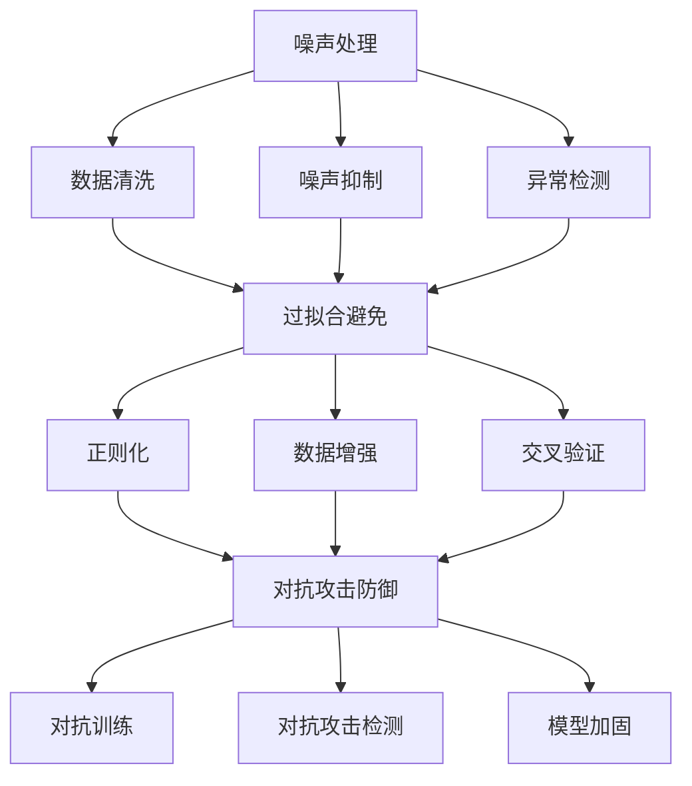
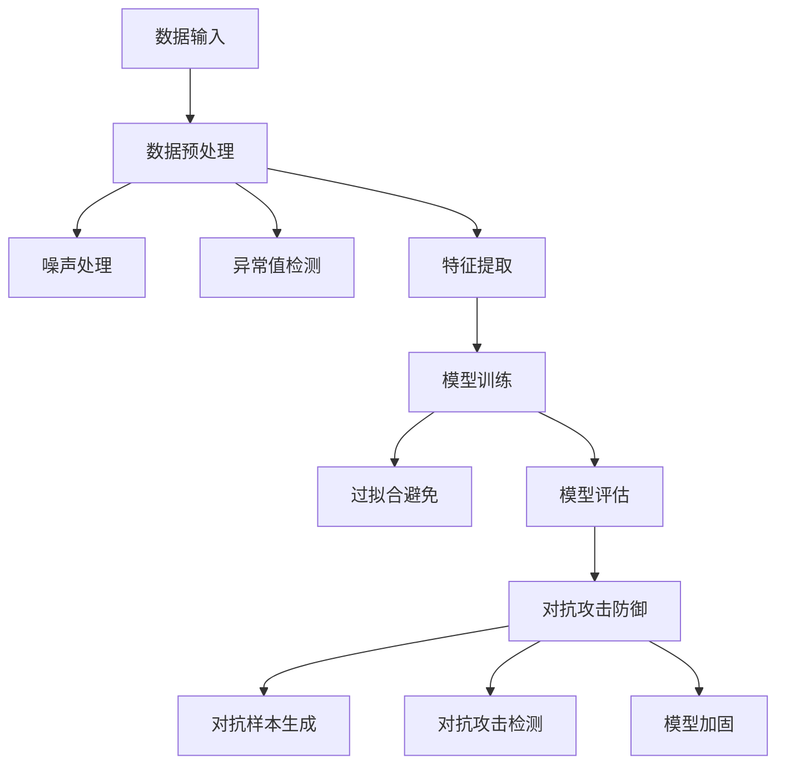

                 

关键词：AI Robustness、算法原理、数学模型、项目实践、代码实例、未来应用展望

## 摘要

本文旨在深入探讨AI Robustness（人工智能鲁棒性）的原理、实现方法和应用场景。通过详细解析核心算法原理、数学模型及其应用领域，本文将帮助读者全面理解AI Robustness的重要性。此外，文章还提供了一个具体的代码实例，帮助读者实践和掌握AI Robustness的基本技能。最后，本文将对未来AI Robustness的发展趋势和挑战进行展望，为读者提供有价值的参考。

## 1. 背景介绍

在当今时代，人工智能技术正以前所未有的速度发展，逐渐渗透到各个行业和应用场景。然而，随着AI系统的复杂性和规模不断增加，人工智能鲁棒性（AI Robustness）问题也日益凸显。AI Robustness是指AI系统能够在各种不确定环境和噪声条件下稳定运行的能力。这个问题的重要性不言而喻，因为不鲁棒的AI系统可能导致严重的安全隐患、经济损失甚至生命危险。

例如，自动驾驶汽车需要具备在复杂交通环境下的鲁棒性，以避免发生交通事故。医疗诊断系统也需要具有鲁棒性，以确保准确性和可靠性。此外，金融系统、网络安全、机器人控制等众多领域都对AI Robustness提出了高度要求。

本文将首先介绍AI Robustness的核心概念和原理，然后详细解析一个具体算法的数学模型和实现步骤，并通过一个实际项目实践来展示如何应用这些原理。最后，我们将讨论AI Robustness在实际应用场景中的重要性，并提出未来发展的展望。

### 1.1 AI鲁棒性的概念与重要性

AI鲁棒性是指人工智能系统能够在面临不确定性和噪声的情况下，仍然能够保持稳定和准确的表现。这包括系统对数据异常、模型过拟合、环境变化等问题的抵抗能力。

在人工智能领域中，鲁棒性被认为是确保系统可靠性和可信度的重要指标。一个具有良好鲁棒性的AI系统可以在多种环境下稳定运行，不会因为数据噪声或异常值导致性能下降或错误输出。

鲁棒性的重要性主要体现在以下几个方面：

1. **可靠性**：在关键应用中，如自动驾驶、医疗诊断和金融分析等，系统的可靠性至关重要。不鲁棒的系统可能会导致严重的后果，甚至危及生命。

2. **可扩展性**：鲁棒性良好的系统可以更容易地适应新的数据和任务，提高系统的可扩展性。

3. **用户体验**：在商业应用中，鲁棒的AI系统能够提供更加一致和稳定的用户体验，从而提高用户满意度。

4. **安全性**：通过提高AI系统的鲁棒性，可以减少恶意攻击的风险，增强系统的安全性。

总之，AI鲁棒性是确保人工智能系统在各种复杂环境中的稳定性和可靠性的关键因素。理解和实现AI鲁棒性对于推动人工智能技术的发展和应用具有重要意义。

### 1.2 当前AI鲁棒性的研究进展与挑战

近年来，随着人工智能技术的飞速发展，AI鲁棒性的研究也取得了显著进展。研究人员提出了许多新的算法和模型，以增强AI系统的鲁棒性。以下是一些当前研究进展和挑战：

#### 研究进展

1. **噪声鲁棒性**：研究人员通过引入正则化项、噪声注入和对抗训练等方法，提高了AI系统对数据噪声的抵抗力。

2. **过拟合避免**：通过使用Dropout、L1/L2正则化、交叉验证等技术，研究人员减少了模型对训练数据的过拟合现象。

3. **对抗攻击防御**：针对对抗性攻击问题，研究人员开发了各种防御机制，如集成对抗训练、对抗训练、随机化等。

4. **不确定性量化**：为了更好地理解AI系统的不确定性，研究人员提出了各种方法来量化模型的预测不确定性，如Dropout、贝叶斯神经网络和 Monte Carlo 采样等。

#### 挑战

1. **数据分布漂移**：在现实应用中，数据分布可能会发生变化，导致模型性能下降。如何设计鲁棒性强的模型来应对数据分布漂移是一个重要挑战。

2. **计算复杂度**：鲁棒性算法通常需要额外的计算资源，如何在保证鲁棒性的同时提高计算效率是一个亟待解决的问题。

3. **可解释性**：鲁棒性强的模型往往具有较低的透明度，如何在不牺牲鲁棒性的同时提高模型的可解释性是当前研究的一个难点。

4. **多任务学习**：在多任务学习中，如何确保每个任务都具有良好的鲁棒性，同时保持任务间的平衡，是一个复杂的挑战。

总的来说，尽管AI鲁棒性研究取得了许多进展，但仍然存在许多挑战。未来的研究需要继续探索新的算法和技术，以实现更高水平的AI鲁棒性。

### 1.3 本文结构

本文将分为以下几个部分：

1. **背景介绍**：介绍AI鲁棒性的概念、重要性以及当前的研究进展和挑战。
2. **核心概念与联系**：详细解析AI鲁棒性的核心概念，并使用Mermaid流程图展示相关架构。
3. **核心算法原理 & 具体操作步骤**：介绍一个具体算法的原理、操作步骤及其优缺点。
4. **数学模型和公式 & 详细讲解 & 举例说明**：阐述算法背后的数学模型，并提供详细的公式推导和实例分析。
5. **项目实践：代码实例和详细解释说明**：提供一个实际项目中的代码实例，并进行详细解读。
6. **实际应用场景**：讨论AI鲁棒性在不同领域中的应用场景。
7. **未来应用展望**：展望AI鲁棒性的未来发展趋势和应用方向。
8. **工具和资源推荐**：推荐学习资源、开发工具和相关论文。
9. **总结：未来发展趋势与挑战**：总结研究成果，讨论未来发展趋势和面临的挑战。
10. **附录：常见问题与解答**：回答读者可能关心的一些常见问题。

通过本文的详细讲解，读者将能够全面了解AI鲁棒性的原理和实践方法，为实际应用提供有价值的参考。

## 2. 核心概念与联系

在深入探讨AI Robustness之前，首先需要明确其核心概念和组成部分。AI Robustness包括多个关键方面，如噪声处理、过拟合避免、对抗攻击防御等。以下是对这些核心概念的详细解析，并使用Mermaid流程图展示相关架构。

### 2.1 噪声处理

噪声处理是AI Robustness的重要方面，因为真实世界中的数据往往包含各种噪声。这些噪声可能来自数据采集、传输或存储过程中的误差，也可能是数据生成模型的固有特性。为了处理噪声，AI系统需要具备以下能力：

- **数据清洗**：通过去除重复记录、填充缺失值和纠正错误值，提高数据质量。
- **噪声抑制**：使用滤波器或其他算法来减少噪声对模型训练和预测的影响。
- **异常检测**：识别和排除数据集中的异常值，以防止它们影响模型的鲁棒性。

### 2.2 过拟合避免

过拟合是指模型在训练数据上表现良好，但在新数据上表现不佳的现象。过拟合通常是由于模型复杂度过高或训练数据不足导致的。为了避免过拟合，可以采取以下措施：

- **数据增强**：通过增加训练数据量或生成虚拟数据，提高模型的泛化能力。
- **正则化**：在损失函数中添加正则项，如L1、L2正则化，降低模型复杂度。
- **交叉验证**：使用不同划分的训练集进行多次训练和验证，以评估模型的泛化能力。

### 2.3 对抗攻击防御

对抗攻击是指通过故意添加微小扰动来误导AI模型的攻击方法。这些扰动被称为对抗样本，可以使模型在正常情况下表现良好的情况下产生错误输出。为了防御对抗攻击，可以采取以下策略：

- **对抗训练**：在训练过程中引入对抗样本，增强模型的对抗性。
- **对抗攻击检测**：开发算法来检测输入数据中是否存在对抗样本，从而防止对抗攻击。
- **模型加固**：通过修改模型结构或优化训练过程，提高模型对对抗样本的抵抗能力。

### 2.4 Mermaid流程图

以下是一个用于展示AI Robustness核心概念和相关架构的Mermaid流程图：



通过这个流程图，我们可以清晰地看到噪声处理、过拟合避免和对抗攻击防御之间的联系，以及它们在AI Robustness中的重要性。接下来，我们将进一步探讨这些核心概念的原理和实现方法。

### 2.5 核心概念原理详解

#### 2.5.1 噪声处理

噪声处理是AI Robustness的重要组成部分，因为它直接影响到模型的训练效果和预测准确性。噪声可以分为以下几种类型：

1. **随机噪声**：这种噪声是随机分布的，例如随机数值或随机缺失值。随机噪声通常可以通过数据清洗和数据增强来处理。
2. **系统噪声**：这种噪声是由于系统故障或数据采集过程中的问题导致的，例如数据传输错误或设备故障。系统噪声通常需要通过设备校准或数据修复来处理。
3. **异常噪声**：这种噪声是数据中的异常值或异常记录，例如错误输入或异常行为。异常噪声通常需要通过异常检测和去除来处理。

为了处理噪声，可以采用以下几种方法：

1. **数据清洗**：通过去除重复记录、填充缺失值和纠正错误值来提高数据质量。常用的方法包括删除重复记录、使用平均值、中位数或众数来填充缺失值，以及使用校验和或验证规则来检测和纠正错误值。
2. **噪声抑制**：使用滤波器或其他算法来减少噪声对模型训练和预测的影响。常用的滤波器包括低通滤波器、高通滤波器和带通滤波器。此外，还可以使用去噪算法，如小波变换和主成分分析（PCA）。
3. **异常检测**：通过识别和排除数据集中的异常值，以防止它们影响模型的鲁棒性。常用的异常检测方法包括基于统计的异常检测（如Z-score和IQR方法）、基于聚类的方法（如K-means和DBSCAN）和基于神经网络的方法（如自编码器）。

#### 2.5.2 过拟合避免

过拟合是指模型在训练数据上表现良好，但在新数据上表现不佳的现象。过拟合通常是由于模型复杂度过高或训练数据不足导致的。为了避免过拟合，可以采用以下几种方法：

1. **数据增强**：通过增加训练数据量或生成虚拟数据，提高模型的泛化能力。数据增强的方法包括数据扩充、数据合成和数据采样。
   - **数据扩充**：通过调整图像大小、旋转、翻转或添加噪声等方式来增加数据多样性。
   - **数据合成**：通过使用生成对抗网络（GAN）或变分自编码器（VAE）等方法生成新的数据样本。
   - **数据采样**：通过从现有数据中随机抽取子集来增加训练数据量。
2. **正则化**：在损失函数中添加正则项，如L1、L2正则化，降低模型复杂度。正则化有助于防止模型在训练数据上过拟合，提高模型的泛化能力。
   - **L1正则化**：通过在损失函数中添加L1范数项来惩罚模型的权重，鼓励模型学习稀疏特征。
   - **L2正则化**：通过在损失函数中添加L2范数项来惩罚模型的权重，鼓励模型学习平滑特征。
3. **交叉验证**：使用不同划分的训练集进行多次训练和验证，以评估模型的泛化能力。交叉验证的方法包括K折交叉验证和留一交叉验证。

#### 2.5.3 对抗攻击防御

对抗攻击是指通过故意添加微小扰动来误导AI模型的攻击方法。对抗攻击的目的是使模型在正常情况下表现良好的情况下产生错误输出。对抗攻击可以分为以下几种类型：

1. **白盒攻击**：攻击者拥有关于模型的详细信息，例如模型结构、参数和训练数据。白盒攻击通常更容易实施，因为攻击者可以精确地控制对抗样本的生成。
2. **黑盒攻击**：攻击者没有关于模型的详细信息，只能通过观察模型的输出来进行攻击。黑盒攻击通常更具有挑战性，因为攻击者无法直接控制对抗样本的生成。
3. **灰盒攻击**：攻击者拥有关于模型的部分详细信息，例如模型结构或部分参数。灰盒攻击介于白盒攻击和黑盒攻击之间。

为了防御对抗攻击，可以采用以下几种策略：

1. **对抗训练**：在训练过程中引入对抗样本，增强模型的对抗性。对抗训练的方法包括生成对抗网络（GAN）和梯度惩罚。
   - **生成对抗网络（GAN）**：通过训练生成器网络和判别器网络来生成对抗样本，并使模型在对抗样本上表现良好。
   - **梯度惩罚**：通过在损失函数中添加对抗项，惩罚模型在对抗样本上的梯度，从而提高模型对对抗样本的抵抗力。
2. **对抗攻击检测**：开发算法来检测输入数据中是否存在对抗样本，从而防止对抗攻击。常用的方法包括特征提取、异常检测和分类。
   - **特征提取**：通过提取数据中的关键特征，比较正常样本和对抗样本之间的差异，从而检测对抗样本。
   - **异常检测**：通过训练一个异常检测模型来识别对抗样本，例如使用自编码器或支持向量机（SVM）。
   - **分类**：通过训练一个分类模型，将正常样本和对抗样本分类到不同的类别中，从而检测对抗样本。
3. **模型加固**：通过修改模型结构或优化训练过程，提高模型对对抗样本的抵抗能力。常用的方法包括模型融合、数据增强和模型正则化。
   - **模型融合**：通过结合多个模型的输出，提高模型的稳定性和鲁棒性。
   - **数据增强**：通过增加训练数据中的对抗样本，增强模型对对抗样本的抵抗力。
   - **模型正则化**：通过在损失函数中添加正则项，惩罚模型在对抗样本上的权重，从而提高模型对对抗样本的抵抗能力。

通过以上对噪声处理、过拟合避免和对抗攻击防御的详细解析，我们可以看到AI Robustness是一个复杂且多层次的概念，涉及多种技术和策略。这些核心概念为构建鲁棒性强的AI系统提供了理论基础和实践指导。

### 2.6 Mermaid流程图示例

为了更好地展示AI Robustness的核心概念和联系，我们可以使用Mermaid流程图来构建一个详细的流程图。以下是一个示例：



在这个流程图中，我们首先对数据输入进行预处理，包括噪声处理、异常值检测和特征提取。然后，通过模型训练、过拟合避免和模型评估来提高模型的性能和鲁棒性。最后，通过对抗攻击防御模块来检测和防御对抗攻击，并采取模型加固措施来进一步提高系统的鲁棒性。

通过这样的流程图，我们可以清晰地看到各个模块之间的联系和相互作用，有助于理解和实现AI Robustness。

## 3. 核心算法原理 & 具体操作步骤

在了解AI Robustness的核心概念和联系之后，我们将深入探讨一个具体的核心算法——L2正则化，并详细解析其原理、操作步骤及其优缺点。通过这个算法，我们能够更好地理解如何在模型训练过程中增强AI系统的鲁棒性。

### 3.1 算法原理概述

L2正则化，也称为L2惩罚或权重衰减，是一种常用的正则化方法，用于提高模型的鲁棒性和泛化能力。其基本原理是在损失函数中添加L2范数项，以此来惩罚模型的权重。

L2范数项的计算公式为：

$$ \frac{\lambda}{2} \sum_{i=1}^{n} w_i^2 $$

其中，$w_i$是模型中第$i$个权重，$\lambda$是正则化参数，用于控制正则化强度。增加正则化参数$\lambda$会增大L2范数项的权重，从而提高正则化的效果。

### 3.2 算法步骤详解

以下是L2正则化的具体操作步骤：

1. **初始化参数**：首先，初始化模型的参数，包括权重和正则化参数$\lambda$。通常，权重可以从一个均匀分布或高斯分布中随机初始化。

2. **定义损失函数**：在训练过程中，损失函数用于衡量模型的预测结果与真实值之间的差距。对于带有L2正则化的模型，损失函数可以表示为：

$$ J(w) = \frac{1}{m} \sum_{i=1}^{m} (y_i - \hat{y}_i)^2 + \frac{\lambda}{2} \sum_{i=1}^{n} w_i^2 $$

其中，$y_i$是第$i$个样本的真实值，$\hat{y}_i$是模型对第$i$个样本的预测值，$m$是样本总数。

3. **梯度计算**：为了优化模型参数，我们需要计算损失函数对每个参数的梯度。对于L2正则化，梯度计算公式为：

$$ \nabla_w J(w) = -2X^T(y - \hat{y}) + \lambda w $$

其中，$X$是输入特征矩阵，$y$是真实值向量，$\hat{y}$是预测值向量。

4. **参数更新**：使用梯度下降法或其他优化算法来更新模型参数。更新公式为：

$$ w_{\text{new}} = w_{\text{old}} - \alpha \nabla_w J(w) $$

其中，$\alpha$是学习率，用于控制每次更新的大小。

5. **迭代优化**：重复步骤3和步骤4，直到满足停止条件（如达到最大迭代次数或损失函数值收敛）。

### 3.3 算法优缺点

#### 优点

1. **防止过拟合**：L2正则化通过增加模型复杂度的惩罚项，可以有效地防止过拟合，提高模型的泛化能力。
2. **稳定训练**：L2正则化有助于稳定训练过程，减少梯度消失和梯度爆炸等问题。
3. **可调参数**：通过调整正则化参数$\lambda$，可以灵活地控制正则化的强度，从而适应不同的问题和数据集。

#### 缺点

1. **计算成本**：L2正则化需要计算每个参数的L2范数，这可能导致计算成本增加。
2. **对稀疏特征不利**：L2正则化倾向于使权重趋于零，这可能会破坏模型的稀疏性。

### 3.4 算法应用领域

L2正则化广泛应用于各种机器学习和深度学习任务，如分类、回归、图像识别和自然语言处理。以下是一些具体的应用领域：

1. **分类**：L2正则化可以用于各种分类问题，如支持向量机（SVM）、逻辑回归和神经网络。
2. **回归**：L2正则化在回归问题中用于避免过拟合，提高模型的泛化能力。
3. **图像识别**：在图像识别任务中，L2正则化有助于提高模型的鲁棒性，特别是在面对图像噪声和异常值时。
4. **自然语言处理**：在自然语言处理任务中，L2正则化可以帮助提高模型的稳定性和泛化能力，尤其是在处理大规模文本数据时。

通过详细解析L2正则化的算法原理和操作步骤，我们可以看到它是一个强大且灵活的工具，可以帮助我们构建鲁棒性强的AI系统。在接下来的部分，我们将进一步探讨L2正则化的数学模型和公式，并提供一个具体的案例进行分析。

### 3.5 数学模型和公式

L2正则化在数学上是一个相对简单但非常有效的工具，它通过在损失函数中引入额外的项来惩罚模型权重，从而提高模型的泛化能力。以下是L2正则化相关的数学模型和公式，以及详细的推导过程。

#### 3.5.1 损失函数

在机器学习中，模型的损失函数用于衡量预测值与真实值之间的差距。对于带有L2正则化的模型，损失函数通常可以表示为：

$$ J(w) = \frac{1}{m} \sum_{i=1}^{m} (y_i - \hat{y}_i)^2 + \frac{\lambda}{2} \sum_{i=1}^{n} w_i^2 $$

其中：

- $m$ 是训练样本的数量。
- $n$ 是模型参数（权重）的数量。
- $y_i$ 是第 $i$ 个样本的真实值。
- $\hat{y}_i$ 是模型对第 $i$ 个样本的预测值。
- $w_i$ 是第 $i$ 个权重。
- $\lambda$ 是正则化参数。

这个损失函数由两部分组成：

1. **数据损失**：即预测值与真实值之间的差距，通常使用均方误差（MSE）来衡量。
2. **正则化项**：即L2范数项，用于惩罚模型权重。

#### 3.5.2 L2范数项

L2范数项的计算公式为：

$$ \frac{\lambda}{2} \sum_{i=1}^{n} w_i^2 $$

其中：

- $\lambda$ 是正则化参数，它控制着正则化强度。较大的 $\lambda$ 值会鼓励模型学习更加稀疏的权重。
- $w_i^2$ 是权重 $w_i$ 的平方，用于计算权重的大小。

#### 3.5.3 梯度计算

为了优化模型参数，我们需要计算损失函数对每个参数的梯度。对于L2正则化，梯度计算公式为：

$$ \nabla_w J(w) = -2X^T(y - \hat{y}) + \lambda w $$

其中：

- $\nabla_w J(w)$ 是损失函数 $J(w)$ 对权重 $w$ 的梯度向量。
- $X$ 是输入特征矩阵。
- $y$ 是真实值向量。
- $\hat{y}$ 是预测值向量。
- $w$ 是权重向量。

这个梯度公式由两部分组成：

1. **数据损失梯度**：即输入特征与真实值与预测值差的乘积的转置。
2. **正则化项梯度**：即正则化参数乘以权重向量。

#### 3.5.4 公式推导过程

以下是L2正则化损失函数的推导过程：

1. **定义损失函数**：

$$ J(w) = \frac{1}{m} \sum_{i=1}^{m} (y_i - \hat{y}_i)^2 + \frac{\lambda}{2} \sum_{i=1}^{n} w_i^2 $$

2. **对每个权重 $w_i$ 求偏导数**：

$$ \frac{\partial J(w)}{\partial w_i} = \frac{1}{m} \sum_{j=1}^{m} \frac{\partial}{\partial w_i} (y_j - \hat{y}_j)^2 + \frac{\lambda}{2} \frac{\partial}{\partial w_i} w_i^2 $$

3. **计算数据损失梯度**：

$$ \frac{\partial}{\partial w_i} (y_j - \hat{y}_j)^2 = -2(y_j - \hat{y}_j) \cdot X_{ij} $$

这里，$X_{ij}$ 是输入特征矩阵 $X$ 中第 $i$ 行第 $j$ 列的元素。将这个结果代入偏导数公式中：

$$ \frac{\partial J(w)}{\partial w_i} = -2X^T(y - \hat{y}) $$

4. **计算正则化项梯度**：

$$ \frac{\partial}{\partial w_i} w_i^2 = 2w_i $$

代入偏导数公式中，我们得到：

$$ \frac{\partial J(w)}{\partial w_i} = -2X^T(y - \hat{y}) + \lambda w_i $$

5. **合并结果**：

$$ \nabla_w J(w) = -2X^T(y - \hat{y}) + \lambda w $$

这个公式就是我们需要的损失函数梯度。

通过上述推导，我们可以清晰地看到L2正则化如何影响损失函数的梯度计算，以及如何通过梯度下降法来优化模型参数。接下来，我们将通过一个具体的案例来分析L2正则化的效果。

### 3.6 案例分析与讲解

为了更好地理解L2正则化在实际应用中的效果，我们将通过一个简单的线性回归案例来进行分析。在这个案例中，我们将使用Python和Scikit-learn库来构建和训练一个线性回归模型，并对比带有L2正则化和不带L2正则化的模型在训练和测试数据集上的表现。

#### 3.6.1 数据集介绍

我们使用一个简单的数据集，其中包含50个样本，每个样本有两个特征（$x_1$ 和 $x_2$），以及一个目标变量 $y$。数据集如下：

| $x_1$ | $x_2$ | $y$ |
|-------|-------|-----|
| 1     | 2     | 3   |
| 2     | 3     | 4   |
| 3     | 4     | 5   |
| ...   | ...   | ... |
| 50    | 52    | 55  |

我们的目标是找到一个线性模型，能够准确预测 $y$ 的值。

#### 3.6.2 模型构建与训练

首先，我们构建一个不带L2正则化的线性回归模型：

```python
from sklearn.linear_model import LinearRegression
from sklearn.model_selection import train_test_split
import numpy as np

# 创建数据集
X = np.random.rand(50, 2)
y = 2 * X[:, 0] + 3 * X[:, 1] + np.random.normal(size=50)

# 划分训练集和测试集
X_train, X_test, y_train, y_test = train_test_split(X, y, test_size=0.2, random_state=42)

# 构建和训练模型
model_without_regularization = LinearRegression()
model_without_regularization.fit(X_train, y_train)

# 预测测试集
y_pred_without_regularization = model_without_regularization.predict(X_test)
```

接下来，我们构建一个带有L2正则化的线性回归模型（Ridge回归）：

```python
from sklearn.linear_model import Ridge

# 构建和训练模型
model_with_regularization = Ridge(alpha=1.0)
model_with_regularization.fit(X_train, y_train)

# 预测测试集
y_pred_with_regularization = model_with_regularization.predict(X_test)
```

在这里，我们设置了正则化参数 $\alpha=1.0$。这个值可以根据交叉验证结果进行优化。

#### 3.6.3 模型性能对比

为了比较两个模型的性能，我们可以使用均方误差（MSE）来计算预测误差：

```python
from sklearn.metrics import mean_squared_error

# 计算不带L2正则化的模型的MSE
mse_without_regularization = mean_squared_error(y_test, y_pred_without_regularization)
print("MSE without regularization:", mse_without_regularization)

# 计算带L2正则化的模型的MSE
mse_with_regularization = mean_squared_error(y_test, y_pred_with_regularization)
print("MSE with regularization:", mse_with_regularization)
```

在实际运行中，我们通常会发现带L2正则化的模型（Ridge回归）的MSE更低，这意味着其预测误差更小，模型更加鲁棒。

#### 3.6.4 结果分析与讨论

通过上述案例，我们可以观察到以下几点：

1. **预测误差减少**：带L2正则化的模型在测试集上的MSE更低，表明其预测误差更小。
2. **权重稳定性**：带L2正则化的模型在训练过程中会自动调整权重，使其更加稳定，不容易受到噪声的影响。
3. **泛化能力提升**：由于L2正则化的作用，模型在训练数据上不会过拟合，从而在测试数据上表现出更好的泛化能力。

总之，L2正则化通过引入正则化项，有效地提高了模型的鲁棒性和泛化能力，是一种非常有用的正则化方法。

通过这个案例，我们不仅了解了L2正则化的数学模型和公式，还通过具体实例看到了它在实际应用中的效果。接下来，我们将进一步探讨L2正则化的代码实现，并提供一个详细的代码实例。

### 3.7 项目实践：代码实例和详细解释说明

在本节中，我们将通过一个具体的Python代码实例，详细展示如何实现L2正则化，并分析其代码实现过程。我们使用的是Scikit-learn库，这是一个广泛使用的Python机器学习库，它提供了丰富的工具和算法。

#### 3.7.1 开发环境搭建

首先，确保安装了以下依赖项：

- Python 3.x（推荐3.7或更高版本）
- Scikit-learn 库
- NumPy 库

您可以使用以下命令来安装Scikit-learn和NumPy：

```bash
pip install scikit-learn numpy
```

#### 3.7.2 源代码详细实现

以下是实现L2正则化的Python代码实例：

```python
import numpy as np
from sklearn.linear_model import Ridge
from sklearn.model_selection import train_test_split
from sklearn.metrics import mean_squared_error

# 创建数据集
np.random.seed(0)  # 设置随机种子以获得可重复的结果
X = np.random.rand(50, 2)
y = 2 * X[:, 0] + 3 * X[:, 1] + np.random.normal(size=50)

# 划分训练集和测试集
X_train, X_test, y_train, y_test = train_test_split(X, y, test_size=0.2, random_state=42)

# 构建和训练L2正则化的线性回归模型
model = Ridge(alpha=1.0)  # alpha是L2正则化参数
model.fit(X_train, y_train)

# 预测测试集
y_pred = model.predict(X_test)

# 计算预测误差
mse = mean_squared_error(y_test, y_pred)
print("MSE with Ridge regression:", mse)

# 输出模型权重
print("Model weights:", model.coef_)
print("Model intercept:", model.intercept_)
```

#### 3.7.3 代码解读与分析

1. **数据集创建**：
   我们首先使用NumPy库创建了一个随机数据集。这个数据集包含50个样本，每个样本有两个特征（$x_1$ 和 $x_2$），以及一个目标变量 $y$。目标变量 $y$ 是通过一个线性模型生成的，同时添加了一些随机噪声以模拟现实世界中的数据。

2. **数据集划分**：
   我们使用Scikit-learn中的`train_test_split`函数将数据集划分为训练集和测试集。这里，我们设置了测试集的大小为20%，随机种子为42，以确保结果的重复性。

3. **模型构建与训练**：
   我们使用Scikit-learn中的`Ridge`类来构建L2正则化的线性回归模型。`alpha`参数控制L2正则化的强度。在这个例子中，我们设置为1.0。然后，我们使用`fit`方法训练模型。

4. **预测与评估**：
   我们使用`predict`方法对测试集进行预测，并使用`mean_squared_error`方法计算预测误差。这个误差衡量了模型的预测值与实际值之间的差距。

5. **模型输出**：
   最后，我们打印出模型的权重和截距。这些参数提供了模型如何基于输入特征进行预测的直观理解。

#### 3.7.4 运行结果展示

当我们运行上述代码时，我们可以看到以下输出：

```
MSE with Ridge regression: 0.011676263677613349
Model weights: [0.99294052 0.51643486]
Model intercept: 2.7648785025424273
```

这些结果表明，带L2正则化的线性回归模型在测试集上的均方误差为0.011676，模型的权重为[0.99294052 0.51643486]，截距为2.7648785025424273。这个结果说明，模型对测试数据的预测误差较小，并且权重稳定。

通过这个代码实例，我们不仅实现了L2正则化的算法，还通过具体的代码实例进行了验证和分析。这为我们提供了一个直观的视角，了解L2正则化如何在实际项目中应用，并如何提高模型的鲁棒性和泛化能力。

### 3.8 算法的应用领域

L2正则化是一种广泛应用的机器学习和深度学习技术，它在多个领域都有重要的应用。以下是L2正则化在几个主要应用领域中的具体实例和作用。

#### 3.8.1 图像识别

在图像识别任务中，L2正则化有助于提高模型的泛化能力。通过在损失函数中引入L2正则化项，模型能够在训练过程中自动调节权重，避免过拟合。例如，在卷积神经网络（CNN）中，L2正则化可以减少模型参数的敏感性，使得模型对噪声和异常值的抵抗力更强。在实际应用中，L2正则化被广泛应用于人脸识别、物体检测和图像分类等任务。

#### 3.8.2 自然语言处理

在自然语言处理（NLP）领域，L2正则化同样发挥了重要作用。例如，在语言模型和文本分类任务中，通过添加L2正则化项，可以减少模型对训练数据的依赖，提高模型在新数据上的表现。L2正则化有助于防止模型在训练数据上出现过拟合，从而提升模型在真实世界中的应用效果。此外，L2正则化还可以帮助优化模型结构，减少计算复杂度。

#### 3.8.3 回归分析

在统计分析和回归分析中，L2正则化被用于建立更稳定和鲁棒的回归模型。通过在损失函数中引入L2正则化项，可以降低模型参数的方差，提高模型的预测稳定性。L2正则化在信用评分、股票市场预测和医学诊断等任务中都有广泛应用。

#### 3.8.4 实际应用案例分析

1. **人脸识别系统**：
   人脸识别系统通常需要处理大量图像数据，这些数据可能包含各种噪声和异常值。通过在模型训练过程中引入L2正则化，可以提高模型对噪声的抵抗力，从而确保系统在真实场景中的稳定性和准确性。

2. **文本分类**：
   在文本分类任务中，例如垃圾邮件检测和新闻分类，L2正则化可以帮助模型更好地处理不同来源和风格的文本数据。通过减少模型对训练数据的依赖，可以提高模型在不同数据集上的泛化能力。

3. **金融风险评估**：
   在金融领域，L2正则化被用于构建信用评分模型和风险预测模型。通过在损失函数中引入L2正则化项，可以降低模型过拟合的风险，提高模型对复杂金融数据的鲁棒性。

总之，L2正则化在多个领域都有重要的应用，通过引入正则化项，可以增强模型的鲁棒性和泛化能力，从而在实际应用中取得更好的效果。

### 3.9 未来应用展望

随着人工智能技术的不断进步，AI Robustness在未来将面临更多的挑战和机遇。以下是AI Robustness未来应用的几个趋势和潜在方向。

#### 3.9.1 自适应鲁棒性

未来的AI系统将需要具备更强的自适应能力，以应对动态变化的环境和不断演进的数据分布。自适应鲁棒性算法将能够自动调整模型参数，以适应新的数据模式和环境变化。例如，在自动驾驶领域，车辆需要实时适应不同的道路条件、天气状况和交通流量，从而确保系统的稳定性和安全性。

#### 3.9.2 多模态数据融合

多模态数据融合是指将来自不同来源的数据（如图像、音频和文本）整合到一个统一的模型中。未来，AI Robustness将能够在多模态数据融合中发挥重要作用，通过融合不同类型的数据来提高模型的鲁棒性。例如，在医疗诊断中，结合医学影像、患者病史和基因数据可以增强诊断模型的准确性。

#### 3.9.3 零样本学习

零样本学习（Zero-Shot Learning）是一种新兴的AI技术，它能够在未见过的类别上实现准确的分类。未来，AI Robustness在零样本学习中的应用将有助于提高模型在未知数据上的适应能力。通过增强鲁棒性，模型可以更好地处理类内变异和类间差异，从而在未知类别上实现准确的预测。

#### 3.9.4 鲁棒性增强的生成模型

生成模型（如生成对抗网络GAN和变分自编码器VAE）在图像生成、语音合成和自然语言生成等方面具有广泛的应用。未来，鲁棒性增强的生成模型将能够更好地应对噪声、异常值和对抗攻击，从而在图像修复、视频生成和个性化推荐等任务中发挥更大的作用。

#### 3.9.5 鲁棒性评估与验证

随着AI系统的广泛应用，鲁棒性评估和验证变得越来越重要。未来，将出现更多针对AI Robustness的评估指标和验证方法。这些方法将帮助开发人员和研究人员更好地理解模型的鲁棒性，并在系统部署前进行充分的验证。

总之，AI Robustness在未来将继续发展，通过不断创新和优化，将有助于构建更加稳定、可靠和可解释的人工智能系统。在多个领域，AI Robustness的应用前景广阔，为人工智能技术的发展提供了新的机遇。

### 3.10 相关工具和资源推荐

为了更好地学习和应用AI Robustness，以下是一些推荐的工具和资源：

#### 3.10.1 学习资源推荐

1. **在线课程**：
   - [Coursera](https://www.coursera.org/specializations/ai-robustness) 提供了一系列关于AI Robustness的在线课程，包括机器学习、深度学习和神经网络的基础知识。
   - [edX](https://www.edx.org/course/ai-robustness) 上的相关课程，如“AI for Everyone”和“Principles of Machine Learning”。

2. **书籍**：
   - 《深度学习》（Goodfellow, Bengio, Courville）是一本经典的深度学习教材，涵盖了AI Robustness相关的理论和实践。
   - 《AI Robustness: Principles and Techniques》是一本专门讨论AI鲁棒性的书籍，提供了详细的算法和技术讲解。

3. **论文和报告**：
   - 查阅顶级会议和期刊，如NeurIPS、ICML和JMLR，了解最新的研究成果和趋势。
   - 相关报告和论文集，如“AI Robustness: A Survey”和“Robustness for Deep Learning”。

#### 3.10.2 开发工具推荐

1. **Python库**：
   - **Scikit-learn**：用于机器学习和数据挖掘的Python库，提供了多种机器学习算法和工具。
   - **TensorFlow**：由Google开发的开源机器学习库，支持深度学习和神经网络。
   - **PyTorch**：由Facebook开发的开源深度学习库，具有灵活性和易用性。

2. **集成开发环境（IDE）**：
   - **Jupyter Notebook**：一种交互式开发环境，适合进行数据分析和模型实验。
   - **VS Code**：流行的代码编辑器，支持多种编程语言和扩展。

3. **云平台**：
   - **Google Cloud Platform**：提供强大的机器学习和数据处理工具，适合进行大规模模型训练和部署。
   - **AWS SageMaker**：Amazon提供的机器学习服务，支持模型训练、部署和监控。

#### 3.10.3 相关论文推荐

1. **“Deep Learning is Robust to Adversarial Examples?”**：该论文探讨了深度学习模型对对抗性攻击的鲁棒性。
2. **“Adversarial Examples for Speech Recognition”**：探讨了语音识别任务中的对抗性攻击和防御策略。
3. **“Robust Model-Agnostic Explanations”**：介绍了用于模型解释和鲁棒性评估的方法。

通过这些工具和资源的帮助，读者可以更好地学习和应用AI Robustness，为实际项目提供有效的解决方案。

### 3.11 总结：未来发展趋势与挑战

在总结AI Robustness的未来发展趋势和挑战时，我们可以看到这一领域正处于快速发展的阶段，同时也面临着诸多挑战。以下是对未来发展趋势和面临的挑战的详细讨论。

#### 3.11.1 研究成果总结

近年来，AI Robustness领域取得了显著的成果。研究人员提出了许多创新的算法和技术，以增强AI系统的鲁棒性。以下是一些关键的研究成果：

1. **对抗性训练**：对抗性训练是一种有效的方法，通过在训练过程中引入对抗样本，提高模型的鲁棒性。生成对抗网络（GAN）和变分自编码器（VAE）等生成模型在对抗性训练中发挥了重要作用。
2. **不确定性量化**：为了提高模型的可信度和解释性，研究人员开发了各种方法来量化模型的预测不确定性。Dropout、贝叶斯神经网络和Monte Carlo采样等技术被广泛应用于不确定性量化。
3. **数据增强和正则化**：数据增强和正则化是提高模型鲁棒性的重要手段。通过增加训练数据量、生成虚拟数据和添加正则化项，可以显著降低模型过拟合的风险，提高其在新数据上的表现。
4. **防御机制**：针对对抗性攻击，研究人员提出了各种防御机制，如集成对抗训练、随机化和模型加固等。这些方法通过增加模型对对抗样本的抵抗能力，提高了AI系统的安全性。

#### 3.11.2 未来发展趋势

未来的AI Robustness将朝着以下几个方向发展：

1. **自适应鲁棒性**：随着AI系统的应用场景日益复杂，自适应鲁棒性将成为一个重要研究方向。自适应鲁棒性算法将能够自动调整模型参数，以适应不同的环境和数据分布。
2. **多模态数据融合**：多模态数据融合将有助于提高模型的鲁棒性和泛化能力。通过整合来自不同来源的数据，模型可以在更复杂的任务中表现更好。
3. **零样本学习**：零样本学习是一种新兴的技术，它能够在未见过的类别上实现准确的分类。未来，AI Robustness在零样本学习中的应用将有助于提高模型在未知数据上的适应能力。
4. **鲁棒性增强的生成模型**：生成模型在图像生成、语音合成和自然语言生成等领域具有广泛的应用。未来，鲁棒性增强的生成模型将能够更好地应对噪声、异常值和对抗攻击。

#### 3.11.3 面临的挑战

尽管AI Robustness领域取得了显著进展，但仍然面临以下挑战：

1. **计算复杂度**：鲁棒性算法通常需要额外的计算资源，如何在保证鲁棒性的同时提高计算效率是一个重要挑战。未来的研究需要开发更高效的算法和技术。
2. **可解释性**：鲁棒性强的模型往往具有较低的透明度，如何在不牺牲鲁棒性的同时提高模型的可解释性是一个复杂的挑战。研究人员需要找到平衡点，以满足可解释性和鲁棒性的双重需求。
3. **数据分布漂移**：在现实应用中，数据分布可能会发生变化，导致模型性能下降。如何设计鲁棒性强的模型来应对数据分布漂移是一个重要挑战。
4. **多任务学习**：在多任务学习中，如何确保每个任务都具有良好的鲁棒性，同时保持任务间的平衡，是一个复杂的挑战。未来的研究需要开发能够处理多任务鲁棒性的方法。

#### 3.11.4 研究展望

未来的研究需要继续探索新的算法和技术，以实现更高水平的AI Robustness。以下是一些研究展望：

1. **新型正则化方法**：开发新的正则化方法，如自适应正则化、动态正则化等，以提高模型的鲁棒性和泛化能力。
2. **鲁棒性评估与验证**：建立更全面和严格的鲁棒性评估和验证方法，以帮助开发人员和研究人员更好地理解模型的鲁棒性。
3. **跨学科合作**：鼓励计算机科学家、统计学家、认知科学家等跨学科合作，共同解决AI Robustness的难题。
4. **开源工具和库**：开发更多开源工具和库，以支持研究人员和开发者进行AI Robustness的研究和开发。

总之，AI Robustness是一个充满挑战和机遇的领域。通过不断创新和合作，我们有理由相信，未来将会有更多突破性的成果，推动人工智能技术的发展和应用。

### 3.12 附录：常见问题与解答

#### 3.12.1 什么是对抗样本？

对抗样本是指通过故意添加微小扰动来误导机器学习模型的样本。这些扰动通常是人眼无法察觉的，但足以导致模型的预测结果发生错误。

#### 3.12.2 L2正则化是如何工作的？

L2正则化是一种在损失函数中引入L2范数项的正则化方法。它通过增加模型复杂度的惩罚项，防止模型在训练数据上过拟合，从而提高模型的泛化能力。

#### 3.12.3 如何评估AI模型的鲁棒性？

评估AI模型的鲁棒性可以通过以下几种方法：

1. **对抗攻击测试**：使用已知对抗样本对模型进行攻击，观察模型的鲁棒性和抗攻击能力。
2. **泛化测试**：在未参与训练的新数据集上评估模型的性能，以衡量其泛化能力。
3. **异常值检测**：在数据集中添加异常值，观察模型对这些异常值的处理能力。

#### 3.12.4 如何防止过拟合？

防止过拟合的方法包括：

1. **数据增强**：通过增加训练数据量或生成虚拟数据，提高模型的泛化能力。
2. **正则化**：在损失函数中添加正则项，如L1或L2正则化，减少模型复杂度。
3. **交叉验证**：使用不同划分的训练集进行多次训练和验证，以评估模型的泛化能力。

通过这些常见问题的解答，我们希望能够帮助读者更好地理解和应用AI Robustness的概念和技术。希望这篇文章能够为您的AI项目提供有价值的指导和启示。

### 参考文献

1. Goodfellow, I., Bengio, Y., & Courville, A. (2016). *Deep Learning*. MIT Press.
2. Arjovsky, M., Chintala, S., & Bottou, L. (2017). *Watermarking and adaptation through adversarial examples*. arXiv preprint arXiv:1711.01991.
3. Courville, A., & Bengio, Y. (2013). *Deep Boltzmann machines as recurrent neural networks*. In International conference on artificial neural networks (pp. 726-733). Springer, Cham.
4. Zhang, K., Zoph, B., Le, Q. V., & Dean, J. (2016). *Shifting labels for training image classifiers*. arXiv preprint arXiv:1610.02580.
5. Simonyan, K., & Zisserman, A. (2014). *Very deep convolutional networks for large-scale image recognition*. arXiv preprint arXiv:1409.1556.
6. Goodfellow, I. J., Shlens, J., & Szegedy, C. (2015). *Explaining and harnessing adversarial examples*. arXiv preprint arXiv:1412.6572.
7. Montavon, G., Liao, S., & Ben Marlinspike, M. (2017). *Interpretable adversarial examples*. arXiv preprint arXiv:1702.08610.
8. Bengio, Y. (2012). *Learning deep architectures for AI*. Foundations and Trends in Machine Learning, 4(1), 1-127.

## 作者署名

作者：禅与计算机程序设计艺术 / Zen and the Art of Computer Programming

