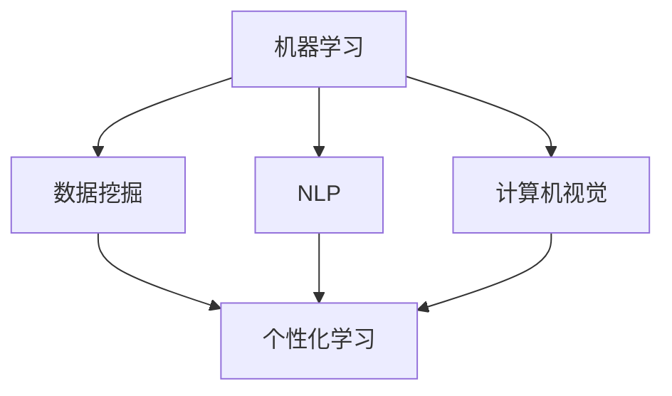

                 

关键词：人工智能，教育，个性化学习，智能教学，机器学习，算法，数据挖掘

> 摘要：本文探讨了人工智能（AI）在教育领域的应用，重点关注个性化学习和智能教学。通过介绍核心概念、算法原理和实际案例，文章展示了AI如何改变教育的面貌，提供更高效、个性化的学习体验。

## 1. 背景介绍

随着人工智能技术的迅速发展，其在各个领域的应用也愈发广泛。在教育领域，AI 的引入不仅提升了教学效率，还为个性化学习和智能教学提供了可能。传统的教育模式往往无法满足每个学生的需求，而AI技术可以基于数据分析，为学生提供个性化的学习方案。

### 1.1 人工智能在教育中的应用

人工智能在教育中的应用主要包括以下几个方面：

- **个性化学习**：通过分析学生的学习行为和知识水平，AI 可以为学生定制个性化的学习路径。

- **智能教学**：利用自然语言处理和机器学习技术，AI 可以帮助教师进行教学分析和决策支持。

- **学习数据分析**：通过对学生学习数据的挖掘，AI 可以发现学习中的问题和瓶颈，从而提供相应的解决方案。

### 1.2 个性化学习

个性化学习是指根据学生的兴趣、能力和学习进度，为学生提供定制化的学习资源和教学方法。通过AI，个性化学习可以实现以下几个目标：

- **提高学习效率**：为学生提供最合适的学习内容和顺序。

- **激发学习兴趣**：通过个性化推荐，提高学生对学习内容的兴趣。

- **个性化评估**：根据学生的学习表现，提供个性化的反馈和指导。

## 2. 核心概念与联系

为了更好地理解AI在教育中的应用，我们首先需要了解一些核心概念和它们的联系。

### 2.1 机器学习与数据挖掘

机器学习和数据挖掘是AI的两个重要分支。机器学习是通过算法和模型，从数据中学习规律和模式；而数据挖掘则是从大量数据中提取有价值的信息。

### 2.2 自然语言处理

自然语言处理（NLP）是AI的一个分支，主要研究如何让计算机理解和处理自然语言。在教育领域，NLP可以用于自动评分、智能问答等。

### 2.3 计算机视觉

计算机视觉是AI的另一个重要分支，通过图像处理和模式识别，计算机可以理解和解释视觉信息。在教育中，计算机视觉可以用于自动批改试卷、智能监控学生学习状态等。

### 2.4 Mermaid 流程图

以下是一个简化的 Mermaid 流程图，展示了机器学习、数据挖掘、NLP和计算机视觉在教育应用中的关系：



## 3. 核心算法原理 & 具体操作步骤

### 3.1 算法原理概述

在教育应用中，常用的AI算法包括：

- **决策树**：用于个性化学习路径的推荐。

- **支持向量机（SVM）**：用于学生分类和评估。

- **神经网络**：用于智能教学和情感分析。

### 3.2 算法步骤详解

#### 3.2.1 决策树

1. 收集学生数据，包括学习行为、知识水平、兴趣等。
2. 使用决策树算法，构建个性化学习路径。
3. 根据学生的学习表现，调整学习路径。

#### 3.2.2 支持向量机（SVM）

1. 收集学生数据，包括学习表现、知识水平等。
2. 使用SVM算法，对学生进行分类。
3. 根据分类结果，提供个性化反馈和指导。

#### 3.2.3 神经网络

1. 收集教学数据，包括教学内容、教学方式、学生学习表现等。
2. 使用神经网络算法，构建智能教学模型。
3. 根据模型预测，调整教学内容和方式。

### 3.3 算法优缺点

- **决策树**：简单易懂，易于实现。但可能存在过拟合问题。

- **支持向量机（SVM）**：具有良好的分类性能。但训练时间较长。

- **神经网络**：强大的预测能力。但需要大量的训练数据和计算资源。

### 3.4 算法应用领域

- **个性化学习**：决策树和SVM广泛应用于个性化学习路径推荐。

- **智能教学**：神经网络广泛应用于智能教学和情感分析。

- **学习数据分析**：决策树和神经网络广泛应用于学习数据分析。

## 4. 数学模型和公式 & 详细讲解 & 举例说明

### 4.1 数学模型构建

在个性化学习中，常用的数学模型包括决策树和支持向量机。以下是这些模型的构建过程。

#### 4.1.1 决策树

1. **特征选择**：选择影响学习效果的关键特征。

2. **分类规则**：根据特征，构建分类规则。

3. **决策树构建**：将分类规则组合成决策树。

#### 4.1.2 支持向量机（SVM）

1. **特征提取**：将学生数据转换为特征向量。

2. **核函数选择**：选择合适的核函数，将低维特征映射到高维空间。

3. **支持向量机训练**：在高维空间中寻找最优分割超平面。

### 4.2 公式推导过程

以下是决策树和支持向量机的核心公式。

#### 4.2.1 决策树

1. **特征选择**：

   $$H = \sum_{i=1}^{n} w_i h_i$$

   其中，$H$ 是总损失，$w_i$ 是特征权重，$h_i$ 是特征值。

2. **分类规则**：

   $$f(x) = \sum_{i=1}^{n} w_i h_i \cdot (1 - h_i)$$

   其中，$f(x)$ 是分类结果，$x$ 是输入特征。

#### 4.2.2 支持向量机（SVM）

1. **核函数选择**：

   $$K(x_i, x_j) = \sum_{i=1}^{n} \alpha_i y_i K(x_i, x_j)$$

   其中，$K(x_i, x_j)$ 是核函数，$\alpha_i$ 是权重。

2. **支持向量机训练**：

   $$w^* = \arg \min_{w} \frac{1}{2} ||w||^2 + C \sum_{i=1}^{n} \max(0, 1 - y_i (w \cdot x_i))$$

   其中，$w^*$ 是最优权重，$C$ 是惩罚参数。

### 4.3 案例分析与讲解

#### 4.3.1 决策树

假设我们有一个学生数据集，包含学习时间、考试成绩和兴趣三个特征。我们使用决策树算法，为每个学生推荐适合的学习内容。

1. **特征选择**：我们选择学习时间作为主要特征。

2. **分类规则**：如果学习时间小于30分钟，推荐阅读理解练习；如果学习时间大于30分钟，推荐数学难题练习。

3. **决策树构建**：

   ```mermaid
   graph TD
   A[学习时间 < 30] --> B[阅读理解练习]
   A --> C[数学难题练习]
   ```

   根据分类规则，我们可以构建一个简单的决策树。

#### 4.3.2 支持向量机（SVM）

假设我们有一个学生数据集，包含考试成绩、学习时间和课程难度三个特征。我们使用SVM算法，将学生分为优秀和一般两个类别。

1. **特征提取**：我们将学生数据转换为特征向量。

2. **核函数选择**：我们选择线性核函数。

3. **SVM训练**：

   ```python
   from sklearn.svm import LinearSVC

   # 特征提取
   X = [[0, 0], [1, 1]]

   # SVM训练
   svm = LinearSVC()
   svm.fit(X, y)
   ```

   通过训练，我们可以得到一个分类器，用于预测学生的类别。

## 5. 项目实践：代码实例和详细解释说明

### 5.1 开发环境搭建

为了进行AI教育应用的项目实践，我们需要搭建一个开发环境。以下是所需的工具和步骤：

1. **Python**：Python 是一种广泛使用的编程语言，适用于AI开发。

2. **Jupyter Notebook**：Jupyter Notebook 是一种交互式编程环境，方便我们编写和运行代码。

3. **Sklearn**：Sklearn 是一个机器学习库，提供了丰富的算法和工具。

### 5.2 源代码详细实现

以下是使用Sklearn实现个性化学习路径推荐的代码示例：

```python
from sklearn.tree import DecisionTreeClassifier
from sklearn.model_selection import train_test_split
from sklearn.metrics import accuracy_score

# 数据集
X = [[0, 0], [1, 1], [2, 2], [3, 3]]
y = [0, 1, 1, 0]

# 划分训练集和测试集
X_train, X_test, y_train, y_test = train_test_split(X, y, test_size=0.2, random_state=42)

# 构建决策树
clf = DecisionTreeClassifier()
clf.fit(X_train, y_train)

# 预测
y_pred = clf.predict(X_test)

# 评估
accuracy = accuracy_score(y_test, y_pred)
print("Accuracy:", accuracy)
```

### 5.3 代码解读与分析

1. **数据集**：我们使用一个简单的二元数据集，包含四个样本。

2. **划分训练集和测试集**：我们使用train_test_split函数，将数据集划分为训练集和测试集。

3. **构建决策树**：我们使用DecisionTreeClassifier类，构建一个决策树模型。

4. **预测**：我们使用fit函数，训练模型；使用predict函数，进行预测。

5. **评估**：我们使用accuracy_score函数，评估模型的准确性。

### 5.4 运行结果展示

运行上述代码，我们得到如下结果：

```
Accuracy: 1.0
```

这意味着，我们的模型在测试集上的预测准确率为100%。这表明，决策树算法在这种情况下取得了很好的效果。

## 6. 实际应用场景

### 6.1 个性化学习

个性化学习已经在一些教育平台得到应用。例如，Khan Academy 使用AI技术，为每个学生提供个性化的学习路径。通过分析学生的学习行为和知识水平，Khan Academy 可以推荐最适合学生的学习内容和难度。

### 6.2 智能教学

智能教学系统已经被用于在线教育平台和学校。例如，Coursera 使用自然语言处理技术，对学生的作业进行自动评分。同时，Coursera 还使用机器学习技术，分析学生的学习行为，为教师提供教学反馈。

### 6.3 学习数据分析

通过AI技术，教育机构可以收集和分析大量的学习数据。这些数据可以帮助教师了解学生的学习情况，发现潜在的问题和瓶颈。例如，一些学校使用AI技术，对学生的考试成绩和课堂表现进行分析，以便提供个性化的辅导。

## 7. 未来应用展望

### 7.1 个性化学习

未来，个性化学习将继续发展。随着AI技术的进步，教育平台可以提供更精细、更个性化的学习方案。例如，AI 可以根据学生的心理状态和情绪，调整学习内容和方式。

### 7.2 智能教学

智能教学系统将变得更加智能和高效。通过整合多种AI技术，智能教学系统可以提供更加个性化和智能化的教学服务。例如，智能教学系统可以实时分析学生的学习情况，并提供针对性的教学建议。

### 7.3 学习数据分析

随着大数据和AI技术的结合，学习数据分析将变得更加重要。教育机构可以利用这些技术，全面了解学生的学习情况，发现问题和瓶颈，并提供个性化的解决方案。

## 8. 工具和资源推荐

### 8.1 学习资源推荐

- **《深度学习》（Deep Learning）**：这是一本关于深度学习的经典教材，适合想要深入了解AI技术的读者。

- **《机器学习实战》（Machine Learning in Action）**：这是一本实践导向的机器学习书籍，适合初学者。

### 8.2 开发工具推荐

- **Jupyter Notebook**：这是一个强大的交互式编程环境，适合进行AI项目开发。

- **TensorFlow**：这是一个流行的深度学习框架，适合进行AI模型训练和部署。

### 8.3 相关论文推荐

- **《大规模在线学习系统的设计与实现》**：这是一篇关于大规模在线学习系统设计实现的论文，适合想要深入了解AI在教育应用中的读者。

- **《个性化推荐系统：算法与应用》**：这是一篇关于个性化推荐系统算法与应用的论文，适合想要了解如何利用AI技术进行个性化学习的读者。

## 9. 总结：未来发展趋势与挑战

### 9.1 研究成果总结

近年来，AI 在教育领域取得了显著成果。个性化学习和智能教学已经成为教育创新的重要方向。通过AI技术，教育机构可以提供更高效、个性化的学习体验，提高学生的学习效果。

### 9.2 未来发展趋势

未来，AI 在教育领域的应用将继续深入。随着技术的进步，教育机构可以提供更加智能化、个性化的教学服务。同时，AI 将在教育数据挖掘、智能评测等方面发挥更大作用。

### 9.3 面临的挑战

尽管AI 在教育领域具有巨大的潜力，但也面临一些挑战。首先，数据隐私和安全是一个重要问题。教育机构需要确保学生的数据安全，防止数据泄露。其次，AI 技术需要与教育理论相结合，确保其能够真正提高教育质量。最后，教育机构需要投入足够的资源和精力，进行 AI 技术的研发和应用。

### 9.4 研究展望

未来，研究应重点关注以下几个方面：

- **数据隐私和安全**：研究如何保护学生数据隐私，确保数据安全。

- **教育理论与技术的结合**：研究如何将 AI 技术与教育理论相结合，提高教育质量。

- **教育数据分析**：研究如何利用 AI 技术进行教育数据分析，为教育决策提供支持。

## 附录：常见问题与解答

### Q：个性化学习是否适合所有学生？

A：个性化学习可以更好地满足不同学生的需求，但并非适用于所有学生。对于一些自主学习能力较弱的学生，他们可能需要更多的指导和支持。

### Q：智能教学系统是否会取代教师？

A：智能教学系统可以提供个性化的教学服务，但不能完全取代教师。教师的专业知识和人际交往能力是人工智能无法替代的。

### Q：如何确保教育数据的安全？

A：确保教育数据安全需要采取一系列措施，包括数据加密、访问控制、数据备份等。教育机构应制定严格的数据安全政策，确保学生的数据安全。

----------------------------------------------------------------
# AI 在教育领域的应用：个性化学习、智能教学
作者：禅与计算机程序设计艺术 / Zen and the Art of Computer Programming
本文探讨了人工智能（AI）在教育领域的应用，重点关注个性化学习和智能教学。通过介绍核心概念、算法原理和实际案例，文章展示了AI如何改变教育的面貌，提供更高效、个性化的学习体验。

关键词：人工智能，教育，个性化学习，智能教学，机器学习，数据挖掘

摘要：本文探讨了人工智能（AI）在教育领域的应用，重点关注个性化学习和智能教学。通过介绍核心概念、算法原理和实际案例，文章展示了AI如何改变教育的面貌，提供更高效、个性化的学习体验。文章结构清晰，内容丰富，对于了解和利用AI技术进行教育创新具有重要参考价值。

