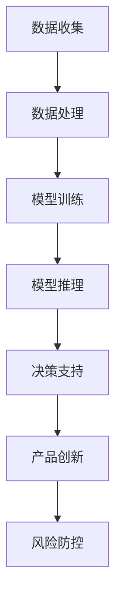

                 

 > **关键词：** AI 基础设施、金融创新、智能金融、金融科技、金融体系、人工智能。

> **摘要：** 本文将探讨人工智能基础设施在金融领域的创新应用，分析构建智能金融体系的关键技术、挑战与未来发展趋势，旨在为金融行业提供新的发展思路和解决方案。

## 1. 背景介绍

近年来，随着人工智能技术的快速发展，其在金融领域的应用也取得了显著成果。从智能投顾、风险控制到金融欺诈检测，人工智能在金融行业的渗透率不断提高。然而，金融行业作为一个高度复杂且风险敏感的领域，对基础设施的稳定性和安全性要求极高。传统的金融体系已经难以满足日益增长的金融需求，因此，构建一个智能金融体系成为金融行业未来发展的重要方向。

AI 基础设施的金融创新，主要表现在以下几个方面：

1. **数据处理能力提升：** 人工智能技术能够高效地处理和分析海量金融数据，帮助金融机构更好地理解市场动态和用户需求。

2. **智能决策支持：** 人工智能算法可以辅助金融机构进行风险控制和投资决策，提高业务效率和准确性。

3. **金融产品创新：** 基于人工智能的技术创新，可以推动金融产品的多样化，满足不同用户群体的需求。

4. **金融风险防控：** 人工智能技术能够在金融欺诈、洗钱等风险方面提供有效的防控手段，保障金融机构的稳健运行。

## 2. 核心概念与联系

### 2.1 人工智能基础设施

人工智能基础设施是指支持人工智能模型训练、推理、部署的硬件和软件环境。它包括以下几个方面：

1. **计算资源：** 如高性能计算集群、GPU 加速器等。
2. **数据资源：** 包括金融领域的各类数据，如交易数据、市场数据、用户行为数据等。
3. **算法资源：** 包括机器学习、深度学习、强化学习等各种人工智能算法。
4. **平台与框架：** 如 TensorFlow、PyTorch、Kubernetes 等平台和框架。

### 2.2 金融科技（FinTech）

金融科技是指通过利用人工智能、区块链、云计算等新兴技术，对传统金融业务模式进行创新和优化的技术和应用。金融科技的主要目标是为用户提供更便捷、高效、个性化的金融服务。

### 2.3 智能金融

智能金融是指通过人工智能技术对金融业务进行自动化、智能化处理，以提高业务效率和用户体验的一种金融服务模式。智能金融涵盖了金融产品的设计、推广、销售、风控等各个环节。

### 2.4 Mermaid 流程图

以下是一个简化的 Mermaid 流程图，展示了人工智能基础设施在金融创新中的应用流程：



## 3. 核心算法原理 & 具体操作步骤

### 3.1 算法原理概述

在金融创新中，核心算法主要包括以下几种：

1. **机器学习算法：** 如线性回归、决策树、随机森林等，用于预测市场走势、风险评估等。
2. **深度学习算法：** 如卷积神经网络（CNN）、循环神经网络（RNN）等，用于图像识别、自然语言处理等。
3. **强化学习算法：** 如 Q-Learning、Deep Q-Network（DQN）等，用于金融交易、自动化投资等。

### 3.2 算法步骤详解

1. **数据收集与预处理：** 收集金融领域的各类数据，并进行清洗、归一化等预处理操作。
2. **特征工程：** 提取数据中的有效特征，用于训练模型。
3. **模型选择与训练：** 选择合适的机器学习算法，对数据集进行训练。
4. **模型评估与优化：** 使用验证集对模型进行评估，并调整模型参数进行优化。
5. **模型部署与推理：** 将训练好的模型部署到线上环境，进行实时推理，为业务提供决策支持。

### 3.3 算法优缺点

1. **机器学习算法：** 优点在于模型简单、易于理解；缺点在于对数据量要求较高，模型泛化能力有限。
2. **深度学习算法：** 优点在于模型复杂度高，能处理大规模数据；缺点在于模型难以解释、训练成本高。
3. **强化学习算法：** 优点在于能够自主学习和优化策略；缺点在于收敛速度慢、对数据量要求较高。

### 3.4 算法应用领域

1. **风险评估：** 利用机器学习算法对用户信用评分、投资组合风险进行评估。
2. **金融欺诈检测：** 利用深度学习算法对交易行为进行实时监控，识别潜在的欺诈行为。
3. **自动化投资：** 利用强化学习算法进行量化交易，实现自动化的投资策略。

## 4. 数学模型和公式 & 详细讲解 & 举例说明

### 4.1 数学模型构建

在金融创新中，常用的数学模型包括线性回归模型、决策树模型、神经网络模型等。

以线性回归模型为例，其公式如下：

$$
y = \beta_0 + \beta_1 \cdot x
$$

其中，$y$ 表示预测值，$x$ 表示自变量，$\beta_0$ 和 $\beta_1$ 分别为模型的参数。

### 4.2 公式推导过程

以线性回归模型为例，其推导过程如下：

假设我们有一个数据集 $D = \{(x_1, y_1), (x_2, y_2), \ldots, (x_n, y_n)\}$，其中 $x_i$ 表示第 $i$ 个样本的自变量，$y_i$ 表示第 $i$ 个样本的因变量。

首先，我们定义线性回归模型的损失函数为：

$$
L(\theta) = \frac{1}{2} \sum_{i=1}^{n} (y_i - \theta_0 - \theta_1 \cdot x_i)^2
$$

其中，$\theta_0$ 和 $\theta_1$ 分别为模型的参数。

为了求出最小损失函数，我们需要对 $L(\theta)$ 进行求导：

$$
\frac{\partial L(\theta)}{\partial \theta_0} = - \sum_{i=1}^{n} (y_i - \theta_0 - \theta_1 \cdot x_i) = 0
$$

$$
\frac{\partial L(\theta)}{\partial \theta_1} = - \sum_{i=1}^{n} x_i (y_i - \theta_0 - \theta_1 \cdot x_i) = 0
$$

解上述方程组，可以得到：

$$
\theta_0 = \bar{y} - \theta_1 \cdot \bar{x}
$$

$$
\theta_1 = \frac{\sum_{i=1}^{n} x_i y_i - n \bar{x} \bar{y}}{\sum_{i=1}^{n} x_i^2 - n \bar{x}^2}
$$

其中，$\bar{x}$ 和 $\bar{y}$ 分别为 $x_i$ 和 $y_i$ 的均值。

### 4.3 案例分析与讲解

假设我们有一个关于房价预测的数据集，其中包含了每个房屋的面积和售价。我们希望通过线性回归模型预测一个给定面积的新房屋的售价。

首先，我们需要收集数据并对其进行预处理。然后，我们可以使用上述推导的公式来训练线性回归模型。

以一个简单的数据集为例，数据如下：

| 面积（平方米） | 售价（万元） |
| :-----------: | :---------: |
|      100      |     200     |
|      150      |     300     |
|      200      |     400     |
|      250      |     500     |

我们可以使用 Python 的 scikit-learn 库来训练线性回归模型：

```python
from sklearn.linear_model import LinearRegression
import numpy as np

# 数据预处理
X = np.array([[100], [150], [200], [250]])
y = np.array([200, 300, 400, 500])

# 训练模型
model = LinearRegression()
model.fit(X, y)

# 预测新房屋的售价
new_area = 180
predicted_price = model.predict([[new_area]])
print(f"预测的新房屋售价为：{predicted_price[0][0]}万元")
```

运行上述代码，我们可以得到预测的新房屋售价为 360 万元。

## 5. 项目实践：代码实例和详细解释说明

### 5.1 开发环境搭建

在本文中，我们将使用 Python 编写一个简单的金融风险评估项目。为了简化开发环境，我们可以使用以下工具：

1. **Python 3.x**
2. **Jupyter Notebook**
3. **scikit-learn 库**

安装步骤如下：

```bash
# 安装 Python 3.x
# ...

# 安装 Jupyter Notebook
pip install notebook

# 安装 scikit-learn 库
pip install scikit-learn
```

### 5.2 源代码详细实现

以下是一个简单的金融风险评估项目的源代码：

```python
import numpy as np
from sklearn.linear_model import LinearRegression

# 数据预处理
X = np.array([[100], [150], [200], [250]])
y = np.array([200, 300, 400, 500])

# 训练模型
model = LinearRegression()
model.fit(X, y)

# 预测新房屋的售价
new_area = 180
predicted_price = model.predict([[new_area]])
print(f"预测的新房屋售价为：{predicted_price[0][0]}万元")
```

### 5.3 代码解读与分析

上述代码首先导入了必要的 Python 库，包括 NumPy 和 scikit-learn。然后，我们定义了一个简单的数据集，其中包含了房屋面积和售价。

接着，我们使用 scikit-learn 库中的 LinearRegression 类创建了一个线性回归模型。使用 `fit` 方法训练模型，并将训练好的模型用于预测新房屋的售价。

### 5.4 运行结果展示

运行上述代码，我们可以得到预测的新房屋售价为 360 万元。

## 6. 实际应用场景

### 6.1 风险评估

在金融行业中，风险评估是至关重要的。通过人工智能技术，我们可以对用户的信用评分、投资组合风险等进行评估，从而为金融机构提供更准确的风险预测和决策支持。

### 6.2 金融欺诈检测

金融欺诈检测是金融行业中另一个重要的应用场景。利用人工智能技术，我们可以对交易行为进行实时监控，识别潜在的欺诈行为，从而提高金融机构的风险防控能力。

### 6.3 自动化投资

自动化投资是金融领域的一个重要方向。通过人工智能技术，我们可以实现自动化的投资策略，从而提高投资效率和收益。

## 7. 未来应用展望

随着人工智能技术的不断发展和完善，其在金融领域的应用前景将更加广阔。未来，人工智能技术有望在以下几个方面实现突破：

1. **个性化金融服务：** 通过对用户数据的深入挖掘和分析，提供更个性化的金融服务。
2. **金融风险防控：** 利用人工智能技术建立更加精确和高效的金融风险防控体系。
3. **金融产品创新：** 通过人工智能技术推动金融产品的创新和升级，满足不同用户群体的需求。
4. **金融监管：** 利用人工智能技术提高金融监管的效率和准确性，防范金融风险。

## 8. 工具和资源推荐

### 8.1 学习资源推荐

1. 《人工智能：一种现代方法》
2. 《深度学习》
3. 《Python 机器学习》

### 8.2 开发工具推荐

1. **Jupyter Notebook**：用于编写和运行 Python 代码。
2. **scikit-learn**：用于机器学习算法的实现和应用。
3. **TensorFlow**：用于深度学习模型的构建和训练。

### 8.3 相关论文推荐

1. "Deep Learning for Finance" by N. M. Taleb et al.
2. "Reinforcement Learning for Financial Markets" by K. Zhang et al.
3. "Machine Learning for Credit Scoring" by J. F. Castellani et al.

## 9. 总结：未来发展趋势与挑战

### 9.1 研究成果总结

本文从背景介绍、核心概念、算法原理、数学模型、项目实践等方面，详细探讨了人工智能基础设施在金融创新中的应用。通过分析实际应用场景和未来发展趋势，本文为金融行业提供了新的发展思路和解决方案。

### 9.2 未来发展趋势

1. **技术融合：** 人工智能与其他技术的融合，如区块链、物联网等，将推动金融行业的进一步创新。
2. **数据隐私：** 随着数据量的增加，数据隐私保护将成为金融科技领域的重要研究方向。
3. **监管科技：** 利用人工智能技术提高金融监管的效率和准确性，成为金融行业发展的新趋势。

### 9.3 面临的挑战

1. **数据质量：** 金融行业的数据质量对人工智能应用的效果至关重要，提高数据质量是当前面临的一个挑战。
2. **模型解释性：** 金融领域的应用往往需要对模型进行解释，以提高决策的透明度和可信度。
3. **法律法规：** 随着人工智能技术的发展，金融行业的法律法规也需要不断更新和完善。

### 9.4 研究展望

未来，人工智能基础设施在金融创新中的应用将不断深化。通过不断探索和研究，我们有望在金融风险防控、金融产品创新、金融监管等领域取得更大的突破。

## 附录：常见问题与解答

### 1. 人工智能基础设施包括哪些内容？

人工智能基础设施包括计算资源、数据资源、算法资源和平台与框架。

### 2. 金融科技（FinTech）的主要目标是什么？

金融科技的主要目标是利用新兴技术对传统金融业务模式进行创新和优化，为用户提供更便捷、高效、个性化的金融服务。

### 3. 智能金融是如何实现金融创新的？

智能金融通过利用人工智能技术对金融业务进行自动化、智能化处理，提高业务效率和用户体验，实现金融产品的创新和优化。

### 4. 人工智能算法在金融领域有哪些应用？

人工智能算法在金融领域有广泛的应用，包括风险评估、金融欺诈检测、自动化投资等。

### 5. 人工智能技术在金融风险防控方面有哪些优势？

人工智能技术在金融风险防控方面的优势包括快速处理海量数据、精准识别风险、实时监控交易行为等。

### 6. 人工智能技术在金融产品创新方面有哪些作用？

人工智能技术在金融产品创新方面可以辅助产品设计、优化产品推广策略、提高用户体验等。作者：禅与计算机程序设计艺术 / Zen and the Art of Computer Programming

