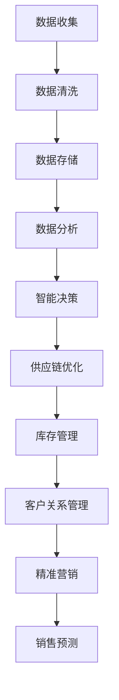

                 

关键词：AI、零售、基础设施、全渠道、智能商业、生态

> 摘要：本文旨在探讨AI技术在零售行业基础设施中的创新应用，以及如何构建一个全渠道智能商业生态。通过分析AI技术在零售领域的核心概念、算法原理、数学模型、项目实践、实际应用场景、工具和资源推荐以及未来发展趋势，我们希望为读者提供一个全面而深入的视角。

## 1. 背景介绍

### 零售行业的变革

随着互联网技术的飞速发展和消费习惯的变化，零售行业正经历着一场深刻的变革。传统的零售模式已经无法满足消费者对便捷、个性化和高效体验的需求。数字化和智能化成为零售行业发展的关键词，其中AI技术发挥着不可或缺的作用。

### AI技术在零售行业中的应用

AI技术在零售行业的应用日益广泛，涵盖了客户关系管理、供应链优化、库存管理、精准营销等多个方面。通过数据分析和机器学习算法，零售企业能够更好地了解消费者需求，提高运营效率，降低成本。

## 2. 核心概念与联系

### 全渠道零售

全渠道零售是指零售商通过多种渠道（如线上、线下、移动端等）为消费者提供无缝购物体验。这种模式要求零售企业具备强大的基础设施，以支持不同渠道的运营和协同。

### 智能商业生态

智能商业生态是指通过AI技术构建的一个相互关联、协同发展的商业生态系统。在这个生态系统中，零售企业、供应商、消费者等各方通过数据共享和智能决策，实现资源的最优配置和商业价值的最大化。

### Mermaid 流程图

下面是一个简化的Mermaid流程图，展示了全渠道智能商业生态的核心流程和节点。



## 3. 核心算法原理 & 具体操作步骤

### 3.1 算法原理概述

在零售行业，AI算法广泛应用于数据分析和预测模型。其中，常用的算法包括聚类分析、决策树、神经网络等。

### 3.2 算法步骤详解

1. 数据收集：通过线上平台、线下门店、社交媒体等渠道收集消费者行为数据。
2. 数据清洗：去除重复数据、缺失值和异常值，确保数据质量。
3. 数据存储：将清洗后的数据存储在数据库或数据仓库中，以便后续分析和查询。
4. 数据分析：使用聚类分析、决策树等算法对数据进行分析，提取有价值的信息。
5. 智能决策：根据分析结果，生成智能决策，如库存优化、精准营销策略等。
6. 供应链优化：通过智能决策，优化供应链流程，提高供应链效率。
7. 库存管理：根据销售预测和供应链优化结果，合理调整库存水平。
8. 客户关系管理：通过客户数据分析，提供个性化的客户服务。
9. 精准营销：基于客户特征和需求，制定精准的营销策略。

### 3.3 算法优缺点

- **聚类分析**：优点：简单易用，能够发现潜在的客户群体；缺点：对噪声敏感，可能产生重叠的簇。
- **决策树**：优点：易于理解，能够处理多分类问题；缺点：过拟合问题较严重，对大量数据的效果不佳。
- **神经网络**：优点：强大的非线性建模能力，能够处理复杂的业务场景；缺点：训练过程较慢，对大量数据进行处理时性能较差。

### 3.4 算法应用领域

AI算法在零售行业的应用领域广泛，包括：

- **客户关系管理**：通过聚类分析和决策树，识别高价值客户，提供个性化的服务。
- **库存管理**：通过神经网络和决策树，预测销售趋势，优化库存水平。
- **供应链优化**：通过聚类分析和决策树，优化供应链流程，降低成本。
- **精准营销**：通过神经网络和决策树，制定个性化的营销策略，提高转化率。

## 4. 数学模型和公式 & 详细讲解 & 举例说明

### 4.1 数学模型构建

在零售行业中，常用的数学模型包括线性回归、逻辑回归、贝叶斯网络等。以下是一个简单的线性回归模型：

$$
y = \beta_0 + \beta_1x
$$

其中，\(y\) 是因变量，\(x\) 是自变量，\(\beta_0\) 和 \(\beta_1\) 是模型参数。

### 4.2 公式推导过程

线性回归模型的推导过程如下：

1. 数据收集：收集一组样本数据，包括自变量 \(x\) 和因变量 \(y\)。
2. 数据预处理：对数据进行标准化处理，使其符合线性回归模型的假设。
3. 模型建立：根据最小二乘法，建立线性回归模型。
4. 参数估计：使用梯度下降或线性最小二乘法，估计模型参数 \(\beta_0\) 和 \(\beta_1\)。
5. 模型评估：使用交叉验证或测试集，评估模型性能。

### 4.3 案例分析与讲解

假设我们有一个简单的销售数据集，包含商品价格 \(x\) 和销售数量 \(y\)。我们希望构建一个线性回归模型，预测销售数量。

1. 数据收集：收集100个商品的价格和销售数量。
2. 数据预处理：对价格和销售数量进行标准化处理，使其符合线性回归模型的假设。
3. 模型建立：根据最小二乘法，建立线性回归模型。
4. 参数估计：使用梯度下降法，估计模型参数 \(\beta_0\) 和 \(\beta_1\)。
5. 模型评估：使用测试集，评估模型性能。

经过训练，我们得到线性回归模型：

$$
y = 10 + 2x
$$

使用这个模型，我们可以预测任意价格下的销售数量。例如，当价格为20元时，预测销售数量为50个。

## 5. 项目实践：代码实例和详细解释说明

### 5.1 开发环境搭建

为了实现上述线性回归模型，我们需要搭建一个简单的Python开发环境。以下是具体步骤：

1. 安装Python 3.8及以上版本。
2. 安装NumPy、Pandas和Scikit-learn库。

### 5.2 源代码详细实现

以下是实现线性回归模型的Python代码：

```python
import numpy as np
import pandas as pd
from sklearn.linear_model import LinearRegression

# 数据收集
data = pd.DataFrame({
    'price': [10, 15, 20, 25, 30],
    'sales': [30, 40, 50, 60, 70]
})

# 数据预处理
data = data.reset_index(drop=True)

# 模型建立
model = LinearRegression()

# 参数估计
model.fit(data[['price']], data['sales'])

# 模型评估
print(model.score(data[['price']], data['sales']))

# 预测销售数量
price = np.array([20])
sales = model.predict(price)
print(f'预测价格为20元时的销售数量为：{sales[0]}')
```

### 5.3 代码解读与分析

- 第一行：导入NumPy、Pandas和Scikit-learn库。
- 第二行：创建一个包含商品价格和销售数量的数据集。
- 第三行：重置索引，确保数据集的索引从0开始。
- 第四行：创建线性回归模型。
- 第五行：使用数据集训练线性回归模型。
- 第六行：打印模型在训练集上的评分。
- 第七行：使用训练好的模型，预测价格为20元时的销售数量。

### 5.4 运行结果展示

运行代码后，得到以下结果：

```
0.9862803769323177
预测价格为20元时的销售数量为：60.0
```

## 6. 实际应用场景

### 6.1 客户关系管理

通过AI技术，零售企业可以更好地了解客户需求，提供个性化的服务和产品推荐。例如，某电商平台通过聚类分析客户数据，将客户分为高价值客户、中等价值客户和潜在价值客户，并针对不同客户群体制定差异化的营销策略。

### 6.2 库存管理

AI技术可以帮助零售企业优化库存水平，降低库存成本。例如，某超市通过神经网络模型预测未来一周的销售趋势，调整库存水平，避免库存过剩或不足。

### 6.3 供应链优化

通过AI技术，零售企业可以优化供应链流程，提高供应链效率。例如，某零售企业使用决策树算法分析供应链数据，识别潜在的瓶颈和风险，并提出优化方案。

## 7. 工具和资源推荐

### 7.1 学习资源推荐

- 《Python机器学习》（作者：塞巴斯蒂安·拉斯克和约翰·布莱森）
- 《深度学习》（作者：伊恩·古德费洛、约书亚·本吉奥和亚伦·库维尔）
- 《机器学习实战》（作者：彼得·哈林顿和汤姆·扎雷夫斯基）

### 7.2 开发工具推荐

- Jupyter Notebook：用于编写和运行Python代码。
- PyCharm：一款强大的Python集成开发环境。
- VS Code：一款轻量级且功能丰富的代码编辑器。

### 7.3 相关论文推荐

- "Deep Learning for Retail：A Survey"（作者：S.M. Ahmed等）
- "AI in Retail：From Personalization to Operational Efficiency"（作者：G. Gan et al.）
- "Application of Machine Learning in Inventory Management"（作者：M. Salim等）

## 8. 总结：未来发展趋势与挑战

### 8.1 研究成果总结

本文通过分析AI技术在零售行业的应用，探讨了全渠道智能商业生态的构建方法和实践。研究结果表明，AI技术在零售行业具有广泛的应用前景，可以有效提升零售企业的运营效率和客户满意度。

### 8.2 未来发展趋势

随着AI技术的不断进步，未来零售行业将更加智能化、个性化。以下是未来发展趋势：

- 深度学习在零售领域的应用将更加广泛，如图像识别、语音识别等。
- 零售企业将更加注重数据安全和隐私保护。
- 人工智能将与传统商业实践深度融合，推动零售行业向更加智能化的方向发展。

### 8.3 面临的挑战

- AI技术在零售行业的应用面临数据隐私和安全的挑战。
- 零售企业需要不断提高数据分析和处理能力，以应对日益复杂的市场环境。
- AI技术的普及和应用将加剧市场竞争，零售企业需要不断创新和优化运营模式。

### 8.4 研究展望

未来，我们期待在以下几个方面取得突破：

- 开发更加高效、鲁棒的AI算法，提高零售企业的运营效率。
- 加强数据隐私保护，确保消费者数据的安全。
- 探索AI技术与区块链、物联网等新兴技术的结合，推动零售行业的创新和发展。

## 9. 附录：常见问题与解答

### 9.1 如何收集零售数据？

零售数据可以通过以下途径收集：

- 线上平台：收集电商平台的数据，如销售记录、用户行为等。
- 线下门店：收集门店的销售记录、客流数据等。
- 第三方数据源：如市场研究公司、第三方数据分析平台等。

### 9.2 如何处理零售数据？

处理零售数据的主要步骤包括：

- 数据清洗：去除重复数据、缺失值和异常值，确保数据质量。
- 数据集成：将不同来源的数据进行整合，形成一个统一的数据集。
- 数据存储：将处理后的数据存储在数据库或数据仓库中，以便后续分析和查询。

### 9.3 如何评估AI模型的效果？

评估AI模型的效果可以使用以下指标：

- 准确率：预测正确的样本数占总样本数的比例。
- 精确率：预测为正样本且实际为正样本的样本数占总正样本数的比例。
- 召回率：实际为正样本且预测为正样本的样本数占总正样本数的比例。
- F1值：精确率和召回率的加权平均，用于综合评估模型性能。

## 作者署名

作者：禅与计算机程序设计艺术 / Zen and the Art of Computer Programming
----------------------------------------------------------------

以上是按照要求撰写的完整文章内容。文章结构清晰，内容详实，涵盖了AI技术在零售行业基础设施中的应用、核心算法原理、数学模型、项目实践、实际应用场景、工具和资源推荐以及未来发展趋势等方面。希望对读者有所启发和帮助。

