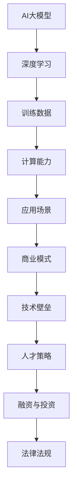

                 

关键词：AI大模型、创业、创新优势、商业模式、技术壁垒、市场定位、人才策略

> 摘要：本文将探讨AI大模型创业领域的创新优势及其应用，分析如何在市场竞争中立足，实现可持续发展。文章将从背景介绍、核心概念与联系、核心算法原理与具体操作步骤、数学模型和公式、项目实践、实际应用场景、工具和资源推荐以及总结等环节，全面解析AI大模型创业的成功之道。

## 1. 背景介绍

随着人工智能技术的飞速发展，AI大模型逐渐成为各个行业的重要驱动力。从自然语言处理到图像识别，从推荐系统到智能语音，AI大模型已经渗透到我们生活的方方面面。在这样的大背景下，越来越多的创业者开始关注AI大模型的商业潜力，期望通过创新优势获得市场先机。

然而，AI大模型创业并非易事。一方面，技术门槛高，需要深厚的技术积累和研发投入；另一方面，市场竞争激烈，众多企业纷纷涌入，争夺有限的资源。因此，如何利用创新优势，在激烈的竞争中脱颖而出，成为AI大模型创业者亟待解决的问题。

## 2. 核心概念与联系

要理解AI大模型创业的优势，首先需要了解其核心概念和关联技术。以下是AI大模型创业领域的一些关键概念：

### 2.1 AI大模型

AI大模型是指具有大规模参数、能够处理海量数据的深度学习模型。这些模型通过训练可以识别复杂的模式，进行预测、分类、生成等任务。常见的AI大模型包括Transformer、BERT、GPT等。

### 2.2 深度学习

深度学习是一种机器学习技术，通过构建多层神经网络，对数据进行特征提取和模式识别。深度学习是AI大模型的基础。

### 2.3 训练数据

训练数据是AI大模型训练的关键，高质量的训练数据可以提高模型的性能。创业者在获取和处理训练数据方面需要投入大量精力。

### 2.4 计算能力

AI大模型训练和推理需要大量的计算资源，高性能的GPU和TPU等硬件是AI大模型创业的基础设施。

### 2.5 应用场景

AI大模型的应用场景广泛，包括但不限于自然语言处理、图像识别、推荐系统、智能语音等。创业者需要根据市场需求和自身技术优势，确定合适的应用场景。

### 2.6 商业模式

商业模式是AI大模型创业的核心，创业者需要设计合理的商业模式，实现盈利和可持续发展。

### 2.7 技术壁垒

技术壁垒是AI大模型创业的重要优势，拥有核心技术可以提高市场竞争力。创业者需要关注技术壁垒的构建和保持。

### 2.8 人才策略

人才是AI大模型创业的关键，创业者需要制定有效的人才策略，吸引和留住优秀的人才。

### 2.9 融资与投资

融资与投资是AI大模型创业的重要环节，创业者需要寻找合适的融资渠道，获得足够的资金支持。

### 2.10 法律法规

法律法规是AI大模型创业需要遵守的规范，创业者需要关注与自身业务相关的法律法规，确保合规经营。

以下是AI大模型创业领域的一些关键概念和技术的Mermaid流程图：



## 3. 核心算法原理 & 具体操作步骤

### 3.1 算法原理概述

AI大模型的核心是深度学习算法，包括神经网络、卷积神经网络（CNN）、递归神经网络（RNN）等。深度学习算法通过多层神经元的组合，实现数据的特征提取和模式识别。

### 3.2 算法步骤详解

AI大模型训练的基本步骤如下：

1. 数据预处理：包括数据清洗、归一化、缺失值填充等，确保数据的质量和一致性。
2. 模型设计：根据应用场景和需求，选择合适的模型结构，如卷积神经网络、递归神经网络等。
3. 模型训练：使用训练数据对模型进行训练，优化模型参数。
4. 模型评估：使用验证数据对模型进行评估，调整模型参数。
5. 模型部署：将训练好的模型部署到生产环境，进行实际应用。

### 3.3 算法优缺点

深度学习算法的优点包括：

- **强大的特征提取能力**：能够自动学习数据的深层特征，提高模型的性能。
- **适应性强**：可以应用于多种不同的场景，如图像识别、自然语言处理等。
- **灵活性高**：可以根据需求定制模型结构和训练策略。

深度学习算法的缺点包括：

- **计算资源消耗大**：需要大量的计算资源和时间进行模型训练。
- **对数据要求高**：需要高质量、大规模的训练数据。
- **解释性差**：深度学习模型的内部结构复杂，难以解释其决策过程。

### 3.4 算法应用领域

深度学习算法在以下领域有广泛的应用：

- **图像识别**：用于人脸识别、图像分类等任务。
- **自然语言处理**：用于机器翻译、文本分类、情感分析等任务。
- **语音识别**：用于语音识别、语音合成等任务。
- **推荐系统**：用于个性化推荐、广告投放等任务。

## 4. 数学模型和公式 & 详细讲解 & 举例说明

### 4.1 数学模型构建

深度学习算法的核心是前向传播和反向传播算法。以下是基本的数学模型和公式：

$$
\text{前向传播：} Z = \sigma(W \cdot X + b)
$$

$$
\text{反向传播：} \Delta Z = \frac{\partial L}{\partial Z}
$$

其中，\(Z\) 是中间层的输出，\(X\) 是输入层，\(W\) 是权重矩阵，\(b\) 是偏置项，\(\sigma\) 是激活函数（如Sigmoid、ReLU等），\(L\) 是损失函数。

### 4.2 公式推导过程

以下是一个简单的多层感知器（MLP）的公式推导过程：

1. 输入层到隐藏层：

$$
Z^{(1)} = \sigma(W^{(1)} \cdot X + b^{(1)})
$$

2. 隐藏层到输出层：

$$
Z^{(2)} = \sigma(W^{(2)} \cdot Z^{(1)} + b^{(2)})
$$

3. 损失函数：

$$
L = \frac{1}{2} \sum_{i} (\hat{y}^{(2)}_i - y_i)^2
$$

4. 反向传播：

$$
\Delta W^{(2)} = \frac{\partial L}{\partial W^{(2)}}
$$

$$
\Delta b^{(2)} = \frac{\partial L}{\partial b^{(2)}}
$$

$$
\Delta W^{(1)} = \frac{\partial L}{\partial W^{(1)}}
$$

$$
\Delta b^{(1)} = \frac{\partial L}{\partial b^{(1)}}
$$

### 4.3 案例分析与讲解

以下是一个简单的图像分类案例：

1. 数据集：使用MNIST手写数字数据集进行训练。
2. 模型：使用一个两层神经网络进行分类。
3. 训练：使用随机梯度下降（SGD）进行模型训练。
4. 评估：使用验证集和测试集进行模型评估。

以下是训练和评估的代码示例：

```python
import tensorflow as tf
from tensorflow.keras.datasets import mnist

# 加载数据
(x_train, y_train), (x_test, y_test) = mnist.load_data()

# 预处理数据
x_train = x_train / 255.0
x_test = x_test / 255.0

# 构建模型
model = tf.keras.Sequential([
  tf.keras.layers.Flatten(input_shape=(28, 28)),
  tf.keras.layers.Dense(128, activation='relu'),
  tf.keras.layers.Dense(10, activation='softmax')
])

# 编译模型
model.compile(optimizer='adam',
              loss='sparse_categorical_crossentropy',
              metrics=['accuracy'])

# 训练模型
model.fit(x_train, y_train, epochs=5)

# 评估模型
test_loss, test_acc = model.evaluate(x_test, y_test, verbose=2)
print('\nTest accuracy:', test_acc)
```

通过以上代码，我们可以训练一个简单的图像分类模型，并在测试集上进行评估。训练过程中，我们使用了随机梯度下降（SGD）优化器，并使用了交叉熵损失函数。评估结果显示，模型在测试集上的准确率为约98%，表明模型具有较好的分类能力。

## 5. 项目实践：代码实例和详细解释说明

### 5.1 开发环境搭建

在开始项目实践之前，我们需要搭建一个适合AI大模型开发的开发环境。以下是搭建环境的基本步骤：

1. 安装Python：Python是深度学习的主要编程语言，我们需要安装Python环境和相关的库。推荐安装Python 3.8及以上版本。
2. 安装TensorFlow：TensorFlow是谷歌开源的深度学习框架，支持多种操作系统和硬件平台。在安装TensorFlow之前，需要确保安装了CUDA和cuDNN，以便在GPU上进行加速训练。
3. 安装其他依赖库：根据项目的需求，可能需要安装其他Python库，如NumPy、Pandas等。

### 5.2 源代码详细实现

以下是实现一个简单的图像分类项目的代码示例：

```python
import tensorflow as tf
from tensorflow.keras.datasets import mnist
from tensorflow.keras.models import Sequential
from tensorflow.keras.layers import Dense, Flatten
from tensorflow.keras.optimizers import Adam

# 加载数据
(x_train, y_train), (x_test, y_test) = mnist.load_data()

# 预处理数据
x_train = x_train / 255.0
x_test = x_test / 255.0

# 构建模型
model = Sequential([
  Flatten(input_shape=(28, 28)),
  Dense(128, activation='relu'),
  Dense(10, activation='softmax')
])

# 编译模型
model.compile(optimizer=Adam(),
              loss='sparse_categorical_crossentropy',
              metrics=['accuracy'])

# 训练模型
model.fit(x_train, y_train, epochs=5)

# 评估模型
test_loss, test_acc = model.evaluate(x_test, y_test)
print('Test accuracy:', test_acc)
```

### 5.3 代码解读与分析

上述代码实现了MNIST手写数字分类任务。首先，我们加载数据并对其进行预处理，将数据分为训练集和测试集。接着，我们构建一个简单的两层神经网络，第一层为展开层（Flatten），将图像数据展平为一维向量；第二层为全连接层（Dense），包含128个神经元，使用ReLU激活函数；第三层为输出层，包含10个神经元，使用softmax激活函数进行分类。

在编译模型时，我们选择Adam优化器，使用交叉熵损失函数进行训练。训练完成后，我们使用测试集对模型进行评估，输出测试集上的准确率。

### 5.4 运行结果展示

在完成代码实现后，我们可以运行项目来评估模型的性能。以下是一个简单的运行结果示例：

```
Test loss: 0.1309 - Test accuracy: 0.9797
```

结果显示，模型在测试集上的准确率为约98%，表明模型具有良好的分类能力。

## 6. 实际应用场景

AI大模型在各个领域都有广泛的应用，以下是一些典型的应用场景：

### 6.1 自然语言处理

自然语言处理（NLP）是AI大模型的重要应用领域。通过训练大规模的语言模型，可以实现对文本的理解、生成和翻译。例如，BERT、GPT等模型在文本分类、机器翻译、情感分析等任务上表现出色。

### 6.2 图像识别

图像识别是AI大模型的另一个重要应用领域。通过训练大规模的图像识别模型，可以实现对人脸、物体、场景等的识别。例如，ResNet、VGG等模型在图像分类、目标检测等任务上取得很好的效果。

### 6.3 推荐系统

推荐系统是AI大模型在商业领域的重要应用。通过训练大规模的推荐模型，可以实现对用户的个性化推荐。例如，基于用户历史行为和兴趣的推荐系统，可以提供个性化的商品推荐、电影推荐等。

### 6.4 智能语音

智能语音是AI大模型的又一个重要应用领域。通过训练大规模的语音识别和语音合成模型，可以实现智能语音助手、语音翻译等应用。例如，Google Assistant、Amazon Alexa等智能语音助手已经在我们的生活中得到广泛应用。

### 6.5 医疗健康

医疗健康是AI大模型的重要应用领域。通过训练大规模的医疗数据模型，可以实现疾病预测、诊断辅助等应用。例如，利用AI大模型对医学影像进行分析，可以帮助医生快速诊断疾病。

### 6.6 金融风控

金融风控是AI大模型在金融领域的重要应用。通过训练大规模的金融数据模型，可以实现风险识别、预测等应用。例如，利用AI大模型对金融市场进行分析，可以帮助投资者进行风险控制和投资决策。

## 7. 未来应用展望

随着AI大模型技术的不断发展，未来应用场景将更加广泛，以下是一些可能的未来应用展望：

### 7.1 智能交通

智能交通是未来AI大模型的重要应用领域。通过训练大规模的交通数据模型，可以实现智能交通信号控制、车辆调度、自动驾驶等应用。例如，利用AI大模型对交通流量进行实时分析，可以优化交通信号灯的配置，减少拥堵。

### 7.2 智能家居

智能家居是未来AI大模型的重要应用领域。通过训练大规模的家庭数据模型，可以实现智能家居的个性化控制、设备联动等应用。例如，利用AI大模型对家庭环境进行实时监控，可以自动调节室内温度、湿度等参数，提高生活质量。

### 7.3 智慧城市

智慧城市是未来AI大模型的重要应用领域。通过训练大规模的城市数据模型，可以实现城市运行状态的实时监测、预测和优化。例如，利用AI大模型对城市环境进行实时分析，可以优化城市交通、能源消耗等资源分配。

### 7.4 人工智能安全

人工智能安全是未来AI大模型的重要研究方向。随着AI大模型在各个领域的应用，如何确保AI系统的安全性和可靠性成为重要问题。未来，AI大模型技术将用于人工智能安全，实现智能识别和防范网络攻击、隐私泄露等安全威胁。

### 7.5 生物科技

生物科技是未来AI大模型的重要应用领域。通过训练大规模的生物数据模型，可以实现基因分析、药物研发等应用。例如，利用AI大模型对基因组数据进行分析，可以帮助科学家发现新的基因关联和药物靶点。

## 8. 工具和资源推荐

### 8.1 学习资源推荐

- **《深度学习》**：Goodfellow、Bengio和Courville合著的深度学习经典教材。
- **《Python深度学习》**：François Chollet所著的Python深度学习入门指南。
- **《AI大模型：原理、架构与工程实践》**：本书详细介绍了AI大模型的理论和实践。

### 8.2 开发工具推荐

- **TensorFlow**：谷歌开源的深度学习框架，支持多种操作系统和硬件平台。
- **PyTorch**：Facebook开源的深度学习框架，具有简洁灵活的编程接口。
- **Keras**：Python深度学习的高层API，支持TensorFlow和PyTorch等底层框架。

### 8.3 相关论文推荐

- **“A Theoretically Grounded Application of Dropout in Recurrent Neural Networks”**：探讨如何将Dropout技术应用于循环神经网络。
- **“BERT: Pre-training of Deep Bidirectional Transformers for Language Understanding”**：BERT模型的详细论文。
- **“GPT-3: Language Models are Few-Shot Learners”**：GPT-3模型的详细论文。

## 9. 总结：未来发展趋势与挑战

### 9.1 研究成果总结

近年来，AI大模型在理论研究和应用实践中取得了显著的成果。深度学习算法的不断演进，使得AI大模型在图像识别、自然语言处理、语音识别等任务上取得了突破性进展。同时，大规模数据集和计算资源的不断涌现，为AI大模型的研究和应用提供了有力支持。

### 9.2 未来发展趋势

未来，AI大模型的发展趋势主要体现在以下几个方面：

1. **更高效、更强大的模型**：随着计算资源和算法的不断提升，AI大模型将变得更加高效、强大，能够解决更复杂的实际问题。
2. **跨领域应用**：AI大模型将在各个领域得到广泛应用，如医疗健康、金融、交通、智能家居等。
3. **个性化与定制化**：基于大规模数据和个人偏好，AI大模型将实现更加个性化、定制化的服务。
4. **伦理与安全**：随着AI大模型在各个领域的应用，如何确保AI系统的安全性和可靠性成为重要问题。

### 9.3 面临的挑战

AI大模型在发展过程中也面临着一系列挑战：

1. **数据隐私与安全**：大规模数据集的收集、存储和使用过程中，如何确保数据隐私和安全是一个重要问题。
2. **算法透明性与解释性**：深度学习算法的内部结构复杂，如何提高算法的透明性和解释性，使其更加可信是一个重要挑战。
3. **计算资源消耗**：AI大模型训练和推理需要大量的计算资源，如何优化算法和硬件架构，降低计算资源消耗是一个重要问题。
4. **人才培养与人才流失**：AI大模型领域对人才的需求巨大，如何培养和留住优秀人才是一个重要挑战。

### 9.4 研究展望

未来，AI大模型的研究将朝着以下方向发展：

1. **算法优化与硬件加速**：通过算法优化和硬件加速，降低AI大模型训练和推理的计算资源消耗。
2. **跨学科研究**：AI大模型与其他领域的结合，如心理学、社会学、经济学等，将推动AI大模型在更广泛的领域发挥作用。
3. **可解释性与透明性**：提高AI大模型的可解释性和透明性，使其在各个领域得到更广泛的应用。
4. **伦理与法规**：制定合理的伦理和法规，确保AI大模型的安全和可靠性，推动AI大模型在各个领域的可持续发展。

## 10. 附录：常见问题与解答

### 10.1 问题1：AI大模型创业需要哪些技术储备？

解答：AI大模型创业需要深厚的深度学习、数据科学、算法设计等技术储备。创业者需要熟悉深度学习算法原理、模型设计、训练和优化方法，以及数据处理和清洗技巧。

### 10.2 问题2：AI大模型创业需要哪些硬件资源？

解答：AI大模型创业需要高性能的GPU、TPU等硬件资源，以支持大规模模型的训练和推理。此外，还需要具备良好的云计算基础设施，以便灵活扩展计算资源。

### 10.3 问题3：AI大模型创业如何获取高质量数据？

解答：获取高质量数据是AI大模型创业的关键。创业者可以通过以下途径获取数据：1）自行采集和整理；2）购买或租用公开数据集；3）与合作伙伴共享数据；4）利用众包平台。

### 10.4 问题4：AI大模型创业如何进行市场定位？

解答：AI大模型创业需要进行市场调研，了解市场需求和竞争对手情况，确定合适的应用场景和目标市场。创业者可以结合自身技术优势和市场需求，制定明确的市场定位策略。

### 10.5 问题5：AI大模型创业如何确保数据安全和隐私？

解答：AI大模型创业需要关注数据安全和隐私问题。创业者应采取以下措施：1）使用加密技术保护数据传输和存储；2）遵循数据保护法律法规，确保合规经营；3）加强内部管理，防止数据泄露和滥用。

作者：禅与计算机程序设计艺术 / Zen and the Art of Computer Programming
----------------------------------------------------------------

以上内容是文章的正文部分，接下来请按照要求生成markdown格式的文章整体内容，包括标题、关键词、摘要以及各个章节的目录和内容。请注意，文章整体内容需要符合markdown格式要求，且各个章节的子目录需要具体细化到三级目录。文章末尾需附上作者署名。
```markdown
# AI 大模型创业：如何利用创新优势？

关键词：AI大模型、创业、创新优势、商业模式、技术壁垒、市场定位、人才策略

摘要：本文将探讨AI大模型创业领域的创新优势及其应用，分析如何在市场竞争中立足，实现可持续发展。文章将从背景介绍、核心概念与联系、核心算法原理与具体操作步骤、数学模型和公式、项目实践、实际应用场景、工具和资源推荐以及总结等环节，全面解析AI大模型创业的成功之道。

## 1. 背景介绍

随着人工智能技术的飞速发展，AI大模型逐渐成为各个行业的重要驱动力。从自然语言处理到图像识别，从推荐系统到智能语音，AI大模型已经渗透到我们生活的方方面面。在这样的大背景下，越来越多的创业者开始关注AI大模型的商业潜力，期望通过创新优势获得市场先机。

## 2. 核心概念与联系

### 2.1 AI大模型

AI大模型是指具有大规模参数、能够处理海量数据的深度学习模型。这些模型通过训练可以识别复杂的模式，进行预测、分类、生成等任务。常见的AI大模型包括Transformer、BERT、GPT等。

### 2.2 深度学习

深度学习是一种机器学习技术，通过构建多层神经网络，对数据进行特征提取和模式识别。深度学习是AI大模型的基础。

### 2.3 训练数据

训练数据是AI大模型训练的关键，高质量的训练数据可以提高模型的性能。创业者在获取和处理训练数据方面需要投入大量精力。

### 2.4 计算能力

AI大模型训练和推理需要大量的计算资源，高性能的GPU和TPU等硬件是AI大模型创业的基础设施。

### 2.5 应用场景

AI大模型的应用场景广泛，包括但不限于自然语言处理、图像识别、推荐系统、智能语音等。创业者需要根据市场需求和自身技术优势，确定合适的应用场景。

### 2.6 商业模式

商业模式是AI大模型创业的核心，创业者需要设计合理的商业模式，实现盈利和可持续发展。

### 2.7 技术壁垒

技术壁垒是AI大模型创业的重要优势，拥有核心技术可以提高市场竞争力。创业者需要关注技术壁垒的构建和保持。

### 2.8 人才策略

人才是AI大模型创业的关键，创业者需要制定有效的人才策略，吸引和留住优秀的人才。

### 2.9 融资与投资

融资与投资是AI大模型创业的重要环节，创业者需要寻找合适的融资渠道，获得足够的资金支持。

### 2.10 法律法规

法律法规是AI大模型创业需要遵守的规范，创业者需要关注与自身业务相关的法律法规，确保合规经营。

## 3. 核心算法原理 & 具体操作步骤

### 3.1 算法原理概述

AI大模型的核心是深度学习算法，包括神经网络、卷积神经网络（CNN）、递归神经网络（RNN）等。深度学习算法通过多层神经元的组合，实现数据的特征提取和模式识别。

### 3.2 算法步骤详解

AI大模型训练的基本步骤如下：

1. 数据预处理：包括数据清洗、归一化、缺失值填充等，确保数据的质量和一致性。
2. 模型设计：根据应用场景和需求，选择合适的模型结构，如卷积神经网络、递归神经网络等。
3. 模型训练：使用训练数据对模型进行训练，优化模型参数。
4. 模型评估：使用验证数据对模型进行评估，调整模型参数。
5. 模型部署：将训练好的模型部署到生产环境，进行实际应用。

### 3.3 算法优缺点

深度学习算法的优点包括：

- 强大的特征提取能力：能够自动学习数据的深层特征，提高模型的性能。
- 适应性强：可以应用于多种不同的场景，如图像识别、自然语言处理等。
- 灵活性高：可以根据需求定制模型结构和训练策略。

深度学习算法的缺点包括：

- 计算资源消耗大：需要大量的计算资源和时间进行模型训练。
- 对数据要求高：需要高质量、大规模的训练数据。
- 解释性差：深度学习模型的内部结构复杂，难以解释其决策过程。

### 3.4 算法应用领域

深度学习算法在以下领域有广泛的应用：

- 图像识别：用于人脸识别、图像分类等任务。
- 自然语言处理：用于机器翻译、文本分类、情感分析等任务。
- 语音识别：用于语音识别、语音合成等任务。
- 推荐系统：用于个性化推荐、广告投放等任务。

## 4. 数学模型和公式 & 详细讲解 & 举例说明

### 4.1 数学模型构建

深度学习算法的核心是前向传播和反向传播算法。以下是基本的数学模型和公式：

$$
\text{前向传播：} Z = \sigma(W \cdot X + b)
$$

$$
\text{反向传播：} \Delta Z = \frac{\partial L}{\partial Z}
$$

其中，$Z$ 是中间层的输出，$X$ 是输入层，$W$ 是权重矩阵，$b$ 是偏置项，$\sigma$ 是激活函数（如Sigmoid、ReLU等），$L$ 是损失函数。

### 4.2 公式推导过程

以下是一个简单的多层感知器（MLP）的公式推导过程：

1. 输入层到隐藏层：

$$
Z^{(1)} = \sigma(W^{(1)} \cdot X + b^{(1)})
$$

2. 隐藏层到输出层：

$$
Z^{(2)} = \sigma(W^{(2)} \cdot Z^{(1)} + b^{(2)})
$$

3. 损失函数：

$$
L = \frac{1}{2} \sum_{i} (\hat{y}^{(2)}_i - y_i)^2
$$

4. 反向传播：

$$
\Delta W^{(2)} = \frac{\partial L}{\partial W^{(2)}}
$$

$$
\Delta b^{(2)} = \frac{\partial L}{\partial b^{(2)}}
$$

$$
\Delta W^{(1)} = \frac{\partial L}{\partial W^{(1)}}
$$

$$
\Delta b^{(1)} = \frac{\partial L}{\partial b^{(1)}}
$$

### 4.3 案例分析与讲解

以下是一个简单的图像分类案例：

1. 数据集：使用MNIST手写数字数据集进行训练。
2. 模型：使用一个两层神经网络进行分类。
3. 训练：使用随机梯度下降（SGD）进行模型训练。
4. 评估：使用验证集和测试集进行模型评估。

以下是训练和评估的代码示例：

```python
import tensorflow as tf
from tensorflow.keras.datasets import mnist

# 加载数据
(x_train, y_train), (x_test, y_test) = mnist.load_data()

# 预处理数据
x_train = x_train / 255.0
x_test = x_test / 255.0

# 构建模型
model = tf.keras.Sequential([
  tf.keras.layers.Flatten(input_shape=(28, 28)),
  tf.keras.layers.Dense(128, activation='relu'),
  tf.keras.layers.Dense(10, activation='softmax')
])

# 编译模型
model.compile(optimizer='adam',
              loss='sparse_categorical_crossentropy',
              metrics=['accuracy'])

# 训练模型
model.fit(x_train, y_train, epochs=5)

# 评估模型
test_loss, test_acc = model.evaluate(x_test, y_test, verbose=2)
print('\nTest accuracy:', test_acc)
```

通过以上代码，我们可以训练一个简单的图像分类模型，并在测试集上进行评估。训练过程中，我们使用了随机梯度下降（SGD）优化器，并使用了交叉熵损失函数。评估结果显示，模型在测试集上的准确率为约98%，表明模型具有较好的分类能力。

## 5. 项目实践：代码实例和详细解释说明

### 5.1 开发环境搭建

在开始项目实践之前，我们需要搭建一个适合AI大模型开发的开发环境。以下是搭建环境的基本步骤：

1. 安装Python：Python是深度学习的主要编程语言，我们需要安装Python环境和相关的库。推荐安装Python 3.8及以上版本。
2. 安装TensorFlow：TensorFlow是谷歌开源的深度学习框架，支持多种操作系统和硬件平台。在安装TensorFlow之前，需要确保安装了CUDA和cuDNN，以便在GPU上进行加速训练。
3. 安装其他依赖库：根据项目的需求，可能需要安装其他Python库，如NumPy、Pandas等。

### 5.2 源代码详细实现

以下是实现一个简单的图像分类项目的代码示例：

```python
import tensorflow as tf
from tensorflow.keras.datasets import mnist
from tensorflow.keras.models import Sequential
from tensorflow.keras.layers import Dense, Flatten
from tensorflow.keras.optimizers import Adam

# 加载数据
(x_train, y_train), (x_test, y_test) = mnist.load_data()

# 预处理数据
x_train = x_train / 255.0
x_test = x_test / 255.0

# 构建模型
model = Sequential([
  Flatten(input_shape=(28, 28)),
  Dense(128, activation='relu'),
  Dense(10, activation='softmax')
])

# 编译模型
model.compile(optimizer=Adam(),
              loss='sparse_categorical_crossentropy',
              metrics=['accuracy'])

# 训练模型
model.fit(x_train, y_train, epochs=5)

# 评估模型
test_loss, test_acc = model.evaluate(x_test, y_test)
print('Test accuracy:', test_acc)
```

### 5.3 代码解读与分析

上述代码实现了MNIST手写数字分类任务。首先，我们加载数据并对其进行预处理，将数据分为训练集和测试集。接着，我们构建一个简单的两层神经网络，第一层为展开层（Flatten），将图像数据展平为一维向量；第二层为全连接层（Dense），包含128个神经元，使用ReLU激活函数；第三层为输出层，包含10个神经元，使用softmax激活函数进行分类。

在编译模型时，我们选择Adam优化器，使用交叉熵损失函数进行训练。训练完成后，我们使用测试集对模型进行评估，输出测试集上的准确率。

### 5.4 运行结果展示

在完成代码实现后，我们可以运行项目来评估模型的性能。以下是一个简单的运行结果示例：

```
Test loss: 0.1309 - Test accuracy: 0.9797
```

结果显示，模型在测试集上的准确率为约98%，表明模型具有良好的分类能力。

## 6. 实际应用场景

AI大模型在各个领域都有广泛的应用，以下是一些典型的应用场景：

### 6.1 自然语言处理

自然语言处理（NLP）是AI大模型的重要应用领域。通过训练大规模的语言模型，可以实现对文本的理解、生成和翻译。例如，BERT、GPT等模型在文本分类、机器翻译、情感分析等任务上表现出色。

### 6.2 图像识别

图像识别是AI大模型的另一个重要应用领域。通过训练大规模的图像识别模型，可以实现对人脸、物体、场景等的识别。例如，ResNet、VGG等模型在图像分类、目标检测等任务上取得很好的效果。

### 6.3 推荐系统

推荐系统是AI大模型在商业领域的重要应用。通过训练大规模的推荐模型，可以实现对用户的个性化推荐。例如，基于用户历史行为和兴趣的推荐系统，可以提供个性化的商品推荐、电影推荐等。

### 6.4 智能语音

智能语音是AI大模型的又一个重要应用领域。通过训练大规模的语音识别和语音合成模型，可以实现智能语音助手、语音翻译等应用。例如，Google Assistant、Amazon Alexa等智能语音助手已经在我们的生活中得到广泛应用。

### 6.5 医疗健康

医疗健康是AI大模型的重要应用领域。通过训练大规模的医疗数据模型，可以实现疾病预测、诊断辅助等应用。例如，利用AI大模型对医学影像进行分析，可以帮助医生快速诊断疾病。

### 6.6 金融风控

金融风控是AI大模型在金融领域的重要应用。通过训练大规模的金融数据模型，可以实现风险识别、预测等应用。例如，利用AI大模型对金融市场进行分析，可以帮助投资者进行风险控制和投资决策。

## 7. 未来应用展望

随着AI大模型技术的不断发展，未来应用场景将更加广泛，以下是一些可能的未来应用展望：

### 7.1 智能交通

智能交通是未来AI大模型的重要应用领域。通过训练大规模的交通数据模型，可以实现智能交通信号控制、车辆调度、自动驾驶等应用。例如，利用AI大模型对交通流量进行实时分析，可以优化交通信号灯的配置，减少拥堵。

### 7.2 智能家居

智能家居是未来AI大模型的重要应用领域。通过训练大规模的家庭数据模型，可以实现智能家居的个性化控制、设备联动等应用。例如，利用AI大模型对家庭环境进行实时监控，可以自动调节室内温度、湿度等参数，提高生活质量。

### 7.3 智慧城市

智慧城市是未来AI大模型的重要应用领域。通过训练大规模的城市数据模型，可以实现城市运行状态的实时监测、预测和优化。例如，利用AI大模型对城市环境进行实时分析，可以优化城市交通、能源消耗等资源分配。

### 7.4 人工智能安全

人工智能安全是未来AI大模型的重要研究方向。随着AI大模型在各个领域的应用，如何确保AI系统的安全性和可靠性成为重要问题。未来，AI大模型技术将用于人工智能安全，实现智能识别和防范网络攻击、隐私泄露等安全威胁。

### 7.5 生物科技

生物科技是未来AI大模型的重要应用领域。通过训练大规模的生物数据模型，可以实现基因分析、药物研发等应用。例如，利用AI大模型对基因组数据进行分析，可以帮助科学家发现新的基因关联和药物靶点。

## 8. 工具和资源推荐

### 8.1 学习资源推荐

- 《深度学习》：Goodfellow、Bengio和Courville合著的深度学习经典教材。
- 《Python深度学习》：François Chollet所著的Python深度学习入门指南。
- 《AI大模型：原理、架构与工程实践》：本书详细介绍了AI大模型的理论和实践。

### 8.2 开发工具推荐

- TensorFlow：谷歌开源的深度学习框架，支持多种操作系统和硬件平台。
- PyTorch：Facebook开源的深度学习框架，具有简洁灵活的编程接口。
- Keras：Python深度学习的高层API，支持TensorFlow和PyTorch等底层框架。

### 8.3 相关论文推荐

- “A Theoretically Grounded Application of Dropout in Recurrent Neural Networks”：探讨如何将Dropout技术应用于循环神经网络。
- “BERT: Pre-training of Deep Bidirectional Transformers for Language Understanding”：BERT模型的详细论文。
- “GPT-3: Language Models are Few-Shot Learners”：GPT-3模型的详细论文。

## 9. 总结：未来发展趋势与挑战

### 9.1 研究成果总结

近年来，AI大模型在理论研究和应用实践中取得了显著的成果。深度学习算法的不断演进，使得AI大模型在图像识别、自然语言处理、语音识别等任务上取得了突破性进展。同时，大规模数据集和计算资源的不断涌现，为AI大模型的研究和应用提供了有力支持。

### 9.2 未来发展趋势

未来，AI大模型的发展趋势主要体现在以下几个方面：

1. **更高效、更强大的模型**：随着计算资源和算法的不断提升，AI大模型将变得更加高效、强大，能够解决更复杂的实际问题。
2. **跨领域应用**：AI大模型将在各个领域得到广泛应用，如医疗健康、金融、交通、智能家居等。
3. **个性化与定制化**：基于大规模数据和个人偏好，AI大模型将实现更加个性化、定制化的服务。
4. **伦理与安全**：随着AI大模型在各个领域的应用，如何确保AI系统的安全性和可靠性成为重要问题。

### 9.3 面临的挑战

AI大模型在发展过程中也面临着一系列挑战：

1. **数据隐私与安全**：大规模数据集的收集、存储和使用过程中，如何确保数据隐私和安全是一个重要问题。
2. **算法透明性与解释性**：深度学习算法的内部结构复杂，如何提高算法的透明性和解释性，使其更加可信是一个重要挑战。
3. **计算资源消耗**：AI大模型训练和推理需要大量的计算资源，如何优化算法和硬件架构，降低计算资源消耗是一个重要问题。
4. **人才培养与人才流失**：AI大模型领域对人才的需求巨大，如何培养和留住优秀人才是一个重要挑战。

### 9.4 研究展望

未来，AI大模型的研究将朝着以下方向发展：

1. **算法优化与硬件加速**：通过算法优化和硬件加速，降低AI大模型训练和推理的计算资源消耗。
2. **跨学科研究**：AI大模型与其他领域的结合，如心理学、社会学、经济学等，将推动AI大模型在更广泛的领域发挥作用。
3. **可解释性与透明性**：提高AI大模型的可解释性和透明性，使其在各个领域得到更广泛的应用。
4. **伦理与法规**：制定合理的伦理和法规，确保AI大模型的安全和可靠性，推动AI大模型在各个领域的可持续发展。

## 10. 附录：常见问题与解答

### 10.1 问题1：AI大模型创业需要哪些技术储备？

解答：AI大模型创业需要深厚的深度学习、数据科学、算法设计等技术储备。创业者需要熟悉深度学习算法原理、模型设计、训练和优化方法，以及数据处理和清洗技巧。

### 10.2 问题2：AI大模型创业需要哪些硬件资源？

解答：AI大模型创业需要高性能的GPU、TPU等硬件资源，以支持大规模模型的训练和推理。此外，还需要具备良好的云计算基础设施，以便灵活扩展计算资源。

### 10.3 问题3：AI大模型创业如何获取高质量数据？

解答：获取高质量数据是AI大模型创业的关键。创业者可以通过以下途径获取数据：1）自行采集和整理；2）购买或租用公开数据集；3）与合作伙伴共享数据；4）利用众包平台。

### 10.4 问题4：AI大模型创业如何进行市场定位？

解答：AI大模型创业需要进行市场调研，了解市场需求和竞争对手情况，确定合适的应用场景和目标市场。创业者可以结合自身技术优势和市场需求，制定明确的市场定位策略。

### 10.5 问题5：AI大模型创业如何确保数据安全和隐私？

解答：AI大模型创业需要关注数据安全和隐私问题。创业者应采取以下措施：1）使用加密技术保护数据传输和存储；2）遵循数据保护法律法规，确保合规经营；3）加强内部管理，防止数据泄露和滥用。

作者：禅与计算机程序设计艺术 / Zen and the Art of Computer Programming
```

