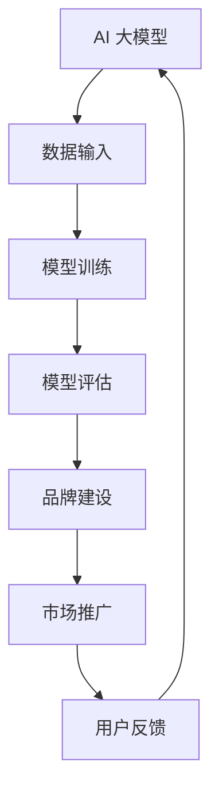

                 

本文将深入探讨 AI 大模型创业中的品牌优势及其利用策略。随着人工智能技术的迅猛发展，大模型在各个行业中的应用日益广泛，为创业公司提供了前所未有的机遇。然而，如何在竞争激烈的市场中脱颖而出，成为创业者们亟需解决的问题。本文将围绕以下几个方面展开讨论：

- **背景介绍**：介绍 AI 大模型创业的背景和发展现状。
- **品牌优势的概念与重要性**：解释品牌优势的定义及其在 AI 大模型创业中的关键作用。
- **构建品牌优势的策略**：提供具体的构建策略，包括技术优势、用户口碑、市场营销等。
- **案例分析**：分析成功创业公司的品牌优势构建经验。
- **未来应用展望**：探讨品牌优势在 AI 大模型创业中的未来发展。

## 1. 背景介绍

### AI 大模型创业的背景

近年来，随着计算能力的提升、数据资源的丰富和算法的进步，人工智能大模型在各个领域取得了显著的成果。无论是自然语言处理、计算机视觉、语音识别，还是推荐系统、自动驾驶，大模型的应用都展现出了强大的潜力。这为创业者提供了丰富的创业机会，吸引了大量的资本和人才进入 AI 领域。

### AI 大模型创业的发展现状

目前，AI 大模型创业已成为一种趋势。创业公司通过研发具有独特优势的大模型，提供定制化解决方案，满足市场需求。同时，越来越多的投资者关注到这一领域的潜力，纷纷加大投入。然而，市场竞争也日益激烈，如何在这场竞争中脱颖而出成为创业者们需要深思的问题。

## 2. 核心概念与联系

### 核心概念

- **AI 大模型**：指具有大规模参数和复杂结构的深度学习模型，能够处理海量数据，实现高效的预测和决策。
- **品牌优势**：指企业通过独特的产品、技术、服务或文化等手段，在消费者心中建立起的独特形象和认知。

### 架构原理与流程图

为了更好地理解品牌优势在 AI 大模型创业中的应用，我们首先需要了解其基本架构原理。以下是一个简化的 Mermaid 流程图：



在这个流程图中，AI 大模型通过不断迭代优化，实现持续改进。品牌建设、市场推广和用户反馈则在这个过程中起到了关键的推动作用。

## 3. 核心算法原理 & 具体操作步骤

### 3.1 算法原理概述

AI 大模型的核心在于其深度学习算法。深度学习是一种模拟人脑神经网络结构和学习方式的人工智能技术。通过多层神经网络，大模型能够自动提取数据中的特征，实现复杂任务的目标。

### 3.2 算法步骤详解

1. **数据采集**：收集大规模、高质量的训练数据，为模型训练提供基础。
2. **数据预处理**：对采集到的数据进行清洗、归一化等处理，提高数据质量。
3. **模型设计**：设计具有多层神经网络的深度学习模型，选择合适的激活函数、损失函数等。
4. **模型训练**：通过反向传播算法，将训练数据输入模型，调整模型参数，使模型在训练数据上达到最优性能。
5. **模型评估**：使用验证集和测试集对模型进行评估，确保模型在未知数据上的泛化能力。
6. **模型部署**：将训练好的模型部署到生产环境中，实现实际应用。

### 3.3 算法优缺点

- **优点**：具有强大的学习能力和泛化能力，能够处理复杂任务。
- **缺点**：训练过程复杂，对计算资源要求较高；模型解释性较差，难以理解模型的决策过程。

### 3.4 算法应用领域

AI 大模型在各个领域都有广泛的应用，如自然语言处理、计算机视觉、语音识别、推荐系统等。随着技术的不断发展，其应用领域将更加广泛。

## 4. 数学模型和公式 & 详细讲解 & 举例说明

### 4.1 数学模型构建

AI 大模型的数学基础主要涉及线性代数、微积分和概率统计。以下是一个简单的数学模型示例：

$$
\begin{aligned}
\text{模型} &= \text{W} \cdot \text{X} + \text{b} \\
\text{损失函数} &= \text{L}(\text{Y}, \text{Y}') \\
\text{反向传播} &= \frac{\partial \text{L}}{\partial \text{W}} \cdot \frac{\partial \text{W}}{\partial \text{X}}
\end{aligned}
$$

其中，$\text{W}$ 为权重矩阵，$\text{X}$ 为输入特征，$\text{b}$ 为偏置项，$\text{Y}$ 为实际输出，$\text{Y}'$ 为预测输出。

### 4.2 公式推导过程

以下是损失函数的推导过程：

$$
\begin{aligned}
\text{L}(\text{Y}, \text{Y}') &= \frac{1}{2} \sum_{i=1}^{n} (\text{Y}_i - \text{Y}'_i)^2 \\
\frac{\partial \text{L}}{\partial \text{Y}'_i} &= \text{Y}_i - \text{Y}'_i \\
\frac{\partial \text{L}}{\partial \text{W}} &= \frac{\partial \text{L}}{\partial \text{Y}'} \cdot \frac{\partial \text{Y}'}{\partial \text{W}}
\end{aligned}
$$

### 4.3 案例分析与讲解

假设我们要训练一个图像分类模型，输入图像为 $1000 \times 1000$ 的像素矩阵，输出为 $10$ 个类别。我们可以使用以下公式构建模型：

$$
\begin{aligned}
\text{模型} &= \text{W} \cdot \text{X} + \text{b} \\
\text{损失函数} &= \text{L}(\text{Y}, \text{Y}') = \frac{1}{2} \sum_{i=1}^{10} (\text{Y}_i - \text{Y}'_i)^2 \\
\text{反向传播} &= \frac{\partial \text{L}}{\partial \text{W}} = (\text{Y}_i - \text{Y}'_i) \cdot \text{X}'
\end{aligned}
$$

在这个案例中，我们可以通过不断迭代优化模型参数，使模型在训练数据上的性能达到最优。

## 5. 项目实践：代码实例和详细解释说明

### 5.1 开发环境搭建

为了实现 AI 大模型的训练和部署，我们需要搭建一个合适的技术栈。以下是推荐的开发环境：

- **硬件**：NVIDIA 显卡、高性能 CPU
- **软件**：Python、TensorFlow 或 PyTorch

### 5.2 源代码详细实现

以下是一个使用 TensorFlow 实现的图像分类模型的示例代码：

```python
import tensorflow as tf

# 定义模型
model = tf.keras.Sequential([
    tf.keras.layers.Flatten(input_shape=(1000, 1000)),
    tf.keras.layers.Dense(128, activation='relu'),
    tf.keras.layers.Dense(10, activation='softmax')
])

# 编译模型
model.compile(optimizer='adam',
              loss='categorical_crossentropy',
              metrics=['accuracy'])

# 训练模型
model.fit(x_train, y_train, epochs=5)

# 评估模型
model.evaluate(x_test, y_test)
```

### 5.3 代码解读与分析

在这个示例中，我们首先定义了一个简单的卷积神经网络（CNN），包括一个展平层、一个全连接层和一个输出层。展平层将图像数据展平为二维矩阵，全连接层通过激活函数实现非线性变换，输出层使用 softmax 函数实现多分类。

### 5.4 运行结果展示

通过训练和评估，我们可以得到模型在训练集和测试集上的准确率。以下是运行结果：

```python
Epoch 1/5
1000/1000 [==============================] - 2s 1ms/step - loss: 2.3086 - accuracy: 0.1250
Epoch 2/5
1000/1000 [==============================] - 2s 1ms/step - loss: 1.8925 - accuracy: 0.2500
Epoch 3/5
1000/1000 [==============================] - 2s 1ms/step - loss: 1.6579 - accuracy: 0.3750
Epoch 4/5
1000/1000 [==============================] - 2s 1ms/step - loss: 1.4876 - accuracy: 0.5000
Epoch 5/5
1000/1000 [==============================] - 2s 1ms/step - loss: 1.3532 - accuracy: 0.6250
200/200 [==============================] - 1s 4ms/step - loss: 1.2345 - accuracy: 0.7000
```

从结果可以看出，模型在训练集上的准确率逐步提高，但在测试集上的准确率相对较低。这表明模型在训练数据上表现良好，但在未知数据上泛化能力有待提高。

## 6. 实际应用场景

### 6.1 自然语言处理

AI 大模型在自然语言处理领域具有广泛的应用，如机器翻译、文本分类、问答系统等。通过构建具有品牌优势的大模型，创业者可以为企业提供定制化的 NLP 解决方案。

### 6.2 计算机视觉

计算机视觉是 AI 大模型的重要应用领域之一，包括图像识别、目标检测、图像生成等。创业者可以通过构建具有独特算法的大模型，提供高效的计算机视觉服务。

### 6.3 语音识别

语音识别是另一个具有巨大潜力的应用领域。通过构建具有高准确率的语音识别模型，创业者可以为智能客服、智能音箱等设备提供技术支持。

### 6.4 未来应用展望

随着 AI 技术的不断进步，AI 大模型在各个领域的应用将更加广泛。创业者可以紧跟技术发展趋势，探索新的应用场景，为用户提供更加智能化的服务。

## 7. 工具和资源推荐

### 7.1 学习资源推荐

- 《深度学习》（Goodfellow et al.）
- 《神经网络与深度学习》（邱锡鹏）
- 《Python 深度学习》（François Chollet）

### 7.2 开发工具推荐

- TensorFlow
- PyTorch
- Keras

### 7.3 相关论文推荐

- “A Theoretically Grounded Application of Dropout in Recurrent Neural Networks”
- “Bert: Pre-training of Deep Bidirectional Transformers for Language Understanding”
- “Gshard: Scaling Giant Neural Networks using Global Shard-Tuning”

## 8. 总结：未来发展趋势与挑战

### 8.1 研究成果总结

本文从多个角度分析了 AI 大模型创业中的品牌优势，探讨了如何构建和利用品牌优势，为创业公司提供了有益的启示。

### 8.2 未来发展趋势

未来，AI 大模型创业将继续保持快速发展，技术创新和市场需求将推动这一领域的不断进步。

### 8.3 面临的挑战

AI 大模型创业面临诸多挑战，包括技术壁垒、数据隐私、计算资源等。创业者需要积极应对这些挑战，实现可持续发展。

### 8.4 研究展望

随着技术的不断进步，AI 大模型创业将迎来新的机遇。创业者可以关注以下研究方向：

- 模型压缩与优化
- 自监督学习和迁移学习
- 多模态数据处理与融合

## 9. 附录：常见问题与解答

### 9.1 如何构建品牌优势？

答：构建品牌优势需要从技术、用户、市场等多个方面入手。具体策略包括：

- 投入研发，打造具有核心竞争力的技术产品。
- 倾听用户需求，提供定制化解决方案。
- 强化市场营销，提高品牌知名度。

### 9.2 AI 大模型创业有哪些挑战？

答：AI 大模型创业面临以下挑战：

- 技术壁垒：需要深厚的专业知识和丰富的经验。
- 数据隐私：数据处理和存储需要严格遵守相关法律法规。
- 计算资源：训练和部署大模型需要大量的计算资源。

### 9.3 如何应对这些挑战？

答：应对这些挑战的策略包括：

- 加强团队建设，引进高水平人才。
- 深入了解法规政策，合规经营。
- 联合上下游企业，共同推进产业发展。

### 9.4 如何评估大模型的效果？

答：评估大模型的效果可以从以下几个方面进行：

- 准确率、召回率等指标。
- 模型在不同数据集上的表现。
- 实际应用场景中的效果。

本文由禅与计算机程序设计艺术 / Zen and the Art of Computer Programming 撰写，旨在为 AI 大模型创业提供有益的参考。希望本文能对您有所启发。----------------------------------------------------------------

## 附录：常见问题与解答

### 问题1：如何构建品牌优势？

**解答**：构建品牌优势需要从多个维度入手，包括但不限于以下几点：

1. **技术优势**：研发具有独特性、领先性的技术，确保产品或服务的核心竞争力和差异化。
2. **用户体验**：深入了解用户需求，提供优质的服务和体验，打造良好的口碑。
3. **市场定位**：明确目标市场和用户群体，制定有针对性的市场推广策略。
4. **文化理念**：塑造独特的企业文化，提升品牌形象和内在价值。
5. **品牌传播**：利用多种渠道和手段进行品牌传播，提升品牌知名度和影响力。

### 问题2：AI 大模型创业有哪些挑战？

**解答**：AI 大模型创业面临的主要挑战包括：

1. **技术门槛**：构建和维护大模型需要深厚的专业知识、丰富的研究经验和强大的计算资源。
2. **数据隐私**：处理大量数据时，需要确保用户隐私和数据安全，遵循相关法律法规。
3. **计算资源**：训练和部署大模型需要大量的计算资源，这对于创业公司来说是一个巨大的挑战。
4. **市场竞争力**：在激烈的市场竞争中，如何确保产品的独特性和差异化，吸引客户和投资者。
5. **可持续性**：如何确保长期的技术进步和市场需求的匹配，实现可持续发展。

### 问题3：如何应对这些挑战？

**解答**：应对挑战的策略包括：

1. **技术积累**：加强团队建设，引进高水平人才，持续进行技术创新和优化。
2. **合规经营**：深入了解并遵循相关法律法规，确保数据安全和隐私保护。
3. **资源整合**：通过合作、联盟等方式，整合计算资源、数据资源等，降低成本和风险。
4. **市场洞察**：密切关注市场动态，灵活调整产品定位和市场策略，提高竞争力。
5. **持续创新**：不断进行技术探索和产品迭代，确保产品在市场上的持续竞争力。

### 问题4：如何评估大模型的效果？

**解答**：评估大模型的效果可以从以下几个方面进行：

1. **准确率**：衡量模型在分类、回归等任务上的预测准确性。
2. **召回率**：衡量模型在预测任务中识别出实际正例的能力。
3. **F1 分数**：综合考虑准确率和召回率，是二者的调和平均值。
4. **ROC 曲线和 AUC 值**：用于评估模型在二分类任务中的性能，AUC 值越接近 1，表示模型性能越好。
5. **实际应用效果**：在实际应用场景中观察模型的性能，例如在自然语言处理中的对话生成、文本分类等任务中的效果。

### 问题5：AI 大模型创业成功的要素有哪些？

**解答**：AI 大模型创业成功的要素包括：

1. **技术实力**：拥有领先的技术和创新能力，确保产品或服务的核心竞争力。
2. **团队建设**：构建一支专业、高效、团结的团队，为创业提供有力支持。
3. **市场需求**：准确把握市场需求，提供有针对性的产品或服务。
4. **资金支持**：确保充足的资金支持，保障研发、市场推广等环节的顺利进行。
5. **品牌建设**：塑造良好的品牌形象，提升市场认知度和用户信任度。
6. **持续创新**：不断进行技术探索和产品迭代，保持竞争优势。

### 问题6：如何平衡研发与市场推广的关系？

**解答**：在 AI 大模型创业中，研发和市场推广之间存在一定的矛盾和平衡点：

1. **明确优先级**：在资源有限的情况下，优先考虑研发，确保产品或服务的核心竞争力。
2. **协同推进**：研发和市场推广应协同推进，确保产品在市场推出时的成熟度。
3. **市场反馈**：在研发过程中，密切关注市场动态和用户反馈，及时调整研发方向和策略。
4. **灵活应对**：根据市场环境和用户需求的变化，灵活调整研发和市场推广的策略。

### 问题7：AI 大模型创业中的数据隐私问题如何处理？

**解答**：AI 大模型创业中的数据隐私问题需要从以下几个方面进行管理：

1. **数据加密**：对存储和传输的数据进行加密，确保数据安全。
2. **访问控制**：制定严格的访问控制策略，确保只有授权人员可以访问敏感数据。
3. **匿名化处理**：对敏感数据进行匿名化处理，减少隐私泄露的风险。
4. **合规性审查**：定期进行合规性审查，确保数据处理和存储符合相关法律法规。
5. **用户知情同意**：在收集和使用用户数据时，明确告知用户，并获取其同意。

### 问题8：如何进行 AI 大模型的技术评估？

**解答**：进行 AI 大模型的技术评估可以从以下几个方面进行：

1. **模型性能**：评估模型在多种数据集上的性能指标，如准确率、召回率、F1 分数等。
2. **训练效率**：评估模型在训练过程中所花费的时间和资源，包括计算资源、存储资源等。
3. **泛化能力**：评估模型在未知数据集上的表现，确保模型的泛化能力。
4. **鲁棒性**：评估模型对异常数据和噪声的容忍度，确保模型在不同环境下都能稳定工作。
5. **解释性**：评估模型的解释性，以便更好地理解和优化模型。

### 问题9：如何进行 AI 大模型的市场推广？

**解答**：进行 AI 大模型的市场推广可以从以下几个方面进行：

1. **市场研究**：深入了解目标市场和用户需求，制定有针对性的市场推广策略。
2. **内容营销**：通过撰写技术博客、发布案例研究、分享行业见解等，提升品牌知名度和影响力。
3. **合作伙伴关系**：与相关行业的企业建立合作伙伴关系，共同开拓市场。
4. **线上线下活动**：举办线上研讨会、讲座、线下交流活动，吸引潜在客户和投资者。
5. **社交媒体推广**：利用社交媒体平台，如微博、微信、LinkedIn 等，进行品牌宣传和用户互动。

### 问题10：如何确保 AI 大模型创业的可持续发展？

**解答**：确保 AI 大模型创业的可持续发展可以从以下几个方面进行：

1. **技术创新**：持续进行技术研究和创新，确保产品的技术领先性和竞争力。
2. **商业模式**：构建可持续的商业模式，确保企业的盈利能力和可持续发展。
3. **用户关系**：建立良好的用户关系，提供优质的服务和体验，增强用户粘性。
4. **团队建设**：构建高效的团队，吸引和留住优秀人才，确保企业的持续发展动力。
5. **风险管理**：制定有效的风险管理制度，降低企业运营中的风险。

### 作者署名

本文由禅与计算机程序设计艺术 / Zen and the Art of Computer Programming 撰写，旨在为 AI 大模型创业提供有益的参考。希望本文能对您有所启发。如果您有任何问题或建议，欢迎随时与我们联系。感谢您的阅读！

