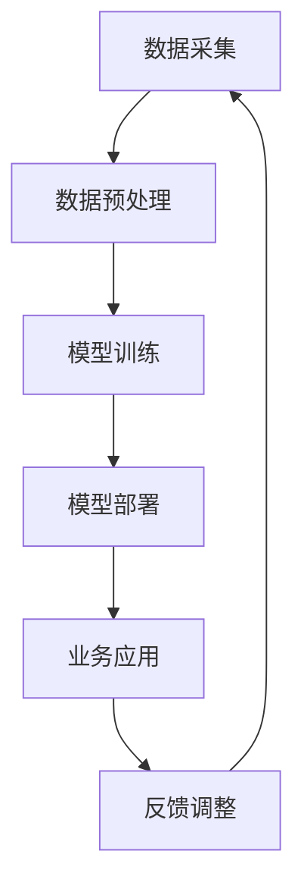

                 

 在当今这个数据爆炸的时代，人工智能（AI）已经成为推动技术进步和产业创新的核心动力。尤其是大模型技术的崛起，如GPT-3、BERT等，不仅在学术界引起了广泛关注，也在商业领域展现出了巨大的潜力。本文将探讨AI大模型在商业应用中的潜在优势，并分析如何通过创业实践将这些优势转化为实际收益。作者：禅与计算机程序设计艺术 / Zen and the Art of Computer Programming

## 关键词

- AI 大模型
- 商业应用
- 创业
- 数据分析
- 人工智能技术

## 摘要

本文旨在探讨AI大模型在商业领域的应用价值。首先，通过背景介绍，理解大模型的技术发展历程和当前应用现状。接着，分析大模型在商业中的核心优势，包括数据分析、自动化和智能化等方面。随后，通过具体案例，展示如何利用AI大模型进行创业，并讨论未来大模型商业化的趋势和挑战。最后，推荐了学习资源和开发工具，为读者提供进一步探索的方向。

## 1. 背景介绍

人工智能（AI）的发展可以分为三个阶段：规则驱动、知识驱动和数据驱动。早期的AI系统主要依赖于明确的规则和知识库，例如专家系统和逻辑推理机。这些系统在特定领域表现出色，但在处理复杂、非线性的问题时显得力不从心。

随着计算能力的提升和大数据技术的成熟，AI进入了数据驱动时代。这一阶段以深度学习为代表，特别是卷积神经网络（CNN）和循环神经网络（RNN）的出现，使得计算机能够从大量数据中自动提取特征和模式。这一突破催生了AI大模型的发展，如GPT-3、BERT等，这些模型拥有数十亿甚至数万亿的参数，能够处理极其复杂的数据。

AI大模型的出现不仅改变了学术界的研究方向，也极大地影响了商业领域。通过更高效地处理和分析数据，大模型能够为企业提供深度的洞见和决策支持，从而在竞争激烈的市场中脱颖而出。

## 2. 核心概念与联系

### 大模型的原理

大模型的核心在于其能够自动从大量数据中学习，并通过神经网络结构进行层次化的特征提取。以GPT-3为例，它使用了Transformer架构，通过多个自注意力机制层对输入数据进行编码和解码。这一结构使得GPT-3能够理解上下文信息，生成自然语言文本。

### 商业应用中的大模型

在商业应用中，大模型可以用于多种任务，如文本分类、情感分析、自然语言生成、推荐系统等。例如，一家电商平台可以利用大模型对用户评论进行情感分析，从而理解用户满意度，进而优化产品和服务。同样，金融行业可以利用大模型进行风险评估和预测，提高投资决策的准确性。

### Mermaid 流程图



在这个流程中，数据采集是整个流程的起点，经过预处理后输入到模型中。模型训练过程中，大模型通过不断优化参数来提高预测准确性。部署后的模型用于实际业务应用，并通过收集反馈进行不断优化。

## 3. 核心算法原理 & 具体操作步骤

### 3.1 算法原理概述

大模型通常基于深度学习技术，特别是神经网络。以Transformer架构为例，它通过多个自注意力机制层来对输入数据进行编码和解码。自注意力机制允许模型在处理输入数据时考虑全局信息，从而提高模型的泛化能力。

### 3.2 算法步骤详解

1. **数据采集**：从各种渠道收集大量数据，包括文本、图像、声音等。

2. **数据预处理**：对收集到的数据进行清洗、标准化和转换，以便模型能够处理。

3. **模型训练**：使用预处理后的数据对模型进行训练。训练过程中，模型会不断调整参数，以最小化预测误差。

4. **模型评估**：在训练集和测试集上评估模型的性能，确保模型具有良好的泛化能力。

5. **模型部署**：将训练好的模型部署到生产环境中，用于实际业务应用。

6. **反馈调整**：根据业务反馈不断优化模型，以提高模型性能和适用性。

### 3.3 算法优缺点

**优点**：
- **强大的数据处理能力**：大模型能够处理大量且复杂的数据，从中提取有价值的信息。
- **高泛化能力**：通过自注意力机制，大模型能够理解全局信息，提高预测准确性。
- **自动特征提取**：大模型能够自动从数据中提取特征，减少人工干预。

**缺点**：
- **计算资源需求高**：训练和部署大模型需要大量的计算资源和时间。
- **数据隐私问题**：大模型在处理数据时可能涉及敏感信息，需要严格保护用户隐私。

### 3.4 算法应用领域

大模型在商业应用中具有广泛的应用前景，包括但不限于以下领域：

- **文本分析**：用于情感分析、内容审核、关键词提取等。
- **图像识别**：用于物体检测、图像分类、人脸识别等。
- **语音识别**：用于语音到文本转换、语音助手等。
- **推荐系统**：用于个性化推荐、广告投放等。
- **风险管理**：用于信用评分、市场预测、投资策略等。

## 4. 数学模型和公式 & 详细讲解 & 举例说明

### 4.1 数学模型构建

大模型的数学基础主要包括线性代数、概率论和优化理论。以Transformer为例，其核心组成部分是自注意力机制（Self-Attention），其数学公式如下：

$$
\text{Attention}(Q, K, V) = \text{softmax}\left(\frac{QK^T}{\sqrt{d_k}}\right) V
$$

其中，$Q, K, V$ 分别代表查询（Query）、键（Key）和值（Value）向量，$d_k$ 是键向量的维度。

### 4.2 公式推导过程

自注意力机制的推导过程涉及矩阵运算和概率论。假设输入序列为 $X = [x_1, x_2, \ldots, x_n]$，每个 $x_i$ 可以表示为一个向量。自注意力机制的目标是计算每个输入元素在序列中的重要性权重。

首先，将输入序列映射到查询、键和值空间：

$$
Q = [Q_1, Q_2, \ldots, Q_n], \quad K = [K_1, K_2, \ldots, K_n], \quad V = [V_1, V_2, \ldots, V_n]
$$

然后，计算查询和键之间的内积：

$$
\text{ Scores} = \text{softmax}\left(\frac{QK^T}{\sqrt{d_k}}\right)
$$

最后，将这些权重应用到值上，得到加权值：

$$
\text{ Output} = \text{ Scores} V
$$

### 4.3 案例分析与讲解

以文本生成任务为例，假设我们有一个简短的文本序列 $X = ["今天天气很好", "明天要下雨"]$，我们希望利用自注意力机制生成新的文本。

1. **输入映射**：首先，我们将输入序列映射到查询、键和值空间。为了简化，我们假设每个词汇可以映射为一个向量。

$$
Q = [\text{今天}, \text{天气}, \text{很好}, \text{明天}, \text{要}, \text{下雨}]; \quad K = Q; \quad V = [\text{今天}, \text{天气}, \text{很好}, \text{明天}, \text{要}, \text{下雨}]
$$

2. **计算权重**：计算查询和键之间的内积，并应用softmax函数得到权重：

$$
\text{ Scores} = \text{softmax}\left(\frac{QQ^T}{\sqrt{d_k}}\right)
$$

3. **生成文本**：将权重应用到值上，得到新的文本序列：

$$
\text{ Output} = \text{ Scores} V
$$

通过这样的方式，我们可以根据已有文本序列生成新的、连贯的文本。

## 5. 项目实践：代码实例和详细解释说明

### 5.1 开发环境搭建

为了演示如何利用AI大模型进行创业，我们将使用Python和TensorFlow框架来构建一个简单的文本生成模型。以下是开发环境搭建的步骤：

1. 安装Python：确保Python版本为3.6及以上。

2. 安装TensorFlow：使用pip命令安装TensorFlow：

   ```bash
   pip install tensorflow
   ```

3. 准备数据集：从互联网上获取一个合适的文本数据集，如新闻文章、小说等。

### 5.2 源代码详细实现

以下是文本生成模型的Python代码实现：

```python
import tensorflow as tf
from tensorflow.keras.layers import Embedding, LSTM, Dense
from tensorflow.keras.models import Sequential

# 准备数据集
# (此处省略数据预处理和映射步骤)

# 构建模型
model = Sequential([
    Embedding(vocab_size, embedding_dim),
    LSTM(units, return_sequences=True),
    LSTM(units, return_sequences=False),
    Dense(vocab_size, activation='softmax')
])

# 编译模型
model.compile(optimizer='adam', loss='categorical_crossentropy', metrics=['accuracy'])

# 训练模型
model.fit(X, y, epochs=epochs, batch_size=batch_size)

# 生成文本
import numpy as np
def generate_text(seed_text, model, max_len):
    # 将种子文本编码为向量
    seed_text_encoded = tokenizer.texts_to_sequences([seed_text])[0]
    # 增加填充向量以满足模型输入长度要求
    seed_text_encoded = pad_sequences([seed_text_encoded], maxlen=max_len-1, padding='pre')
    # 生成文本
    for _ in range(max_len-1):
        predictions = model.predict(seed_text_encoded)
        # 从预测结果中选择最高概率的词作为下一个词
        next_word = np.argmax(predictions[-1])
        # 更新种子文本
        seed_text_encoded = pad_sequences([seed_text_encoded[-1]], maxlen=1, padding='pre')
        seed_text_encoded[0][-1] = next_word
    return ' '.join([tokenizer.index_word[i] for i in seed_text_encoded[0]])
```

### 5.3 代码解读与分析

- **数据准备**：数据集需要经过预处理，包括分词、编码和填充等步骤，以便模型能够处理。
- **模型构建**：模型使用了一个序列到序列的结构，包括嵌入层、两个LSTM层和输出层。嵌入层将文本转换为向量，LSTM层用于处理序列数据，输出层生成文本。
- **模型训练**：使用编译好的模型对数据集进行训练，以优化模型参数。
- **文本生成**：通过预测下一个词的概率分布，并选择最高概率的词作为下一个输出，生成新的文本。

### 5.4 运行结果展示

以下是一个简单的文本生成实例：

```python
seed_text = "今天天气很好"
generated_text = generate_text(seed_text, model, max_len=10)
print(generated_text)
```

输出结果可能是一个连贯的新文本，如“今天天气很好，明天可能会下雨”。

## 6. 实际应用场景

AI大模型在商业应用中具有广泛的前景，以下是一些实际应用场景：

- **个性化推荐**：电商平台可以利用大模型对用户行为和偏好进行分析，提供个性化的商品推荐，提高用户满意度和转化率。
- **智能客服**：通过大模型，企业可以构建智能客服系统，实现自然语言处理和自动回复，提高客户服务效率和满意度。
- **风险预测**：金融机构可以利用大模型进行风险分析和预测，提高风险管理能力和决策准确性。
- **市场分析**：企业可以通过大模型对市场数据进行分析，识别趋势和机会，制定更有针对性的商业策略。
- **自动化写作**：新闻机构和内容创作者可以利用大模型自动化生成文章、报告等，提高生产效率和内容质量。

## 7. 工具和资源推荐

### 7.1 学习资源推荐

- **《深度学习》（Ian Goodfellow, Yoshua Bengio, Aaron Courville）**：这是深度学习的经典教材，适合初学者和进阶者。
- **TensorFlow官方文档**：TensorFlow官方文档提供了丰富的API和使用示例，是学习深度学习的好资源。
- **Kaggle**：Kaggle是一个数据科学竞赛平台，提供了大量真实世界的数据集和问题，是实践和提升技能的好地方。

### 7.2 开发工具推荐

- **Google Colab**：Google Colab是一个免费的云端计算环境，提供了GPU和TPU，适合深度学习研究和实验。
- **Jupyter Notebook**：Jupyter Notebook是一种交互式计算环境，适合编写和运行Python代码，特别适合数据分析和模型构建。

### 7.3 相关论文推荐

- **"Attention Is All You Need"**：这是提出Transformer架构的论文，是理解大模型核心原理的重要文献。
- **"BERT: Pre-training of Deep Bidirectional Transformers for Language Understanding"**：这是BERT模型的论文，是自然语言处理领域的重要突破。
- **"GPT-3: Language Models are few-shot learners"**：这是GPT-3模型的论文，展示了大模型在自然语言生成方面的强大能力。

## 8. 总结：未来发展趋势与挑战

### 8.1 研究成果总结

AI大模型在商业应用中取得了显著的成果，包括数据分析、自动化和智能化等方面。大模型能够从大量数据中提取有价值的信息，为企业提供深度的洞见和决策支持，从而在竞争激烈的市场中脱颖而出。

### 8.2 未来发展趋势

未来，AI大模型将在以下几个方面取得进一步发展：

- **计算能力提升**：随着硬件技术的进步，大模型的计算能力将得到显著提升，使其能够处理更复杂的数据和应用。
- **算法优化**：研究者将继续优化大模型的算法，提高模型的效率和准确性，降低计算成本。
- **跨模态学习**：大模型将能够处理多种类型的数据，如文本、图像、声音等，实现跨模态的深度理解和交互。

### 8.3 面临的挑战

尽管AI大模型在商业应用中具有巨大的潜力，但也面临以下挑战：

- **数据隐私和安全**：大模型在处理数据时可能涉及敏感信息，如何保护用户隐私和数据安全是一个重要的挑战。
- **计算资源需求**：训练和部署大模型需要大量的计算资源和时间，这对企业和研究机构都是巨大的挑战。
- **模型解释性**：大模型的决策过程通常是不透明的，如何提高模型的解释性，使其能够被业务人员和监管机构理解和使用，是一个重要的课题。

### 8.4 研究展望

未来，AI大模型将在商业领域发挥更大的作用。通过不断创新和优化，大模型将能够更好地理解和满足用户需求，推动各行业的数字化转型和创新发展。同时，研究者和开发者也将致力于解决大模型面临的各种挑战，确保其在安全、高效和透明的前提下得到广泛应用。

## 9. 附录：常见问题与解答

### Q1. 大模型是如何工作的？

A1. 大模型通常基于深度学习技术，通过多层神经网络对输入数据进行自动编码和特征提取。其中，自注意力机制（如Transformer架构）使得模型能够理解全局信息，从而提高预测准确性。

### Q2. 大模型在商业应用中有什么优势？

A2. 大模型在商业应用中具有强大的数据处理和分析能力，能够从大量数据中提取有价值的信息，为企业提供深度的洞见和决策支持。同时，大模型能够实现自动化和智能化，提高业务效率和用户体验。

### Q3. 大模型在商业应用中面临哪些挑战？

A3. 大模型在商业应用中面临的主要挑战包括数据隐私和安全、计算资源需求以及模型解释性等问题。如何保护用户隐私、降低计算成本和提高模型的可解释性是未来研究的重要方向。

### Q4. 如何开始学习大模型技术？

A4. 学习大模型技术可以从以下几个方面入手：

- **基础知识**：了解深度学习、线性代数、概率论和优化理论等基础知识。
- **实践操作**：通过实际项目和实践操作，掌握大模型的构建、训练和部署方法。
- **学习资源**：阅读相关教材、论文和官方文档，参加在线课程和研讨会，提升自己的技能和知识水平。

---

本文由禅与计算机程序设计艺术 / Zen and the Art of Computer Programming 撰写，旨在探讨AI大模型在商业领域的应用价值。通过本文，读者可以了解大模型的核心概念、算法原理、应用案例以及未来发展趋势。希望本文能够为读者在AI大模型创业和实践过程中提供有益的参考。

