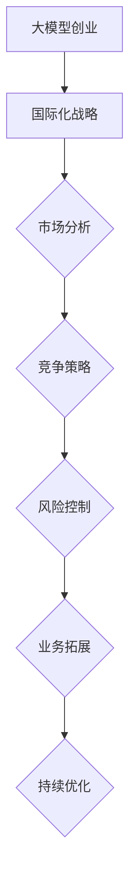

                 

关键词：人工智能，大模型，创业，国际化，优势，策略，市场分析，竞争，风险控制。

> 摘要：本文深入探讨了人工智能领域的大模型创业如何利用国际优势，通过市场分析、竞争策略和风险控制等方面，为创业者提供了一套切实可行的国际化发展路径。

## 1. 背景介绍

随着人工智能技术的迅速发展，大模型（如GAN、BERT、GPT等）在多个领域取得了显著的成果。大模型的兴起不仅改变了数据处理和分析的方式，也催生了大量创业机会。然而，面对激烈的市场竞争和多样化的国际市场环境，如何利用国际优势进行创业成为了一个关键问题。

在国际市场上，我国企业在人工智能领域具备独特的优势。一方面，我国拥有庞大的市场规模和丰富的人才储备，为人工智能技术的研发和应用提供了坚实的基础。另一方面，我国政府高度重视人工智能发展，出台了一系列支持政策和措施，为创业者提供了良好的发展环境。然而，国际市场也存在一定的挑战，如技术壁垒、市场竞争和法规限制等。

本文旨在探讨如何利用国际优势，为人工智能大模型创业提供一套有效的策略，助力企业在全球市场取得成功。

## 2. 核心概念与联系

为了更好地理解大模型创业的国际化策略，我们首先需要了解以下几个核心概念：

### 2.1 大模型

大模型是指具有大规模参数和强大计算能力的人工智能模型。这些模型通常在深度学习领域中使用，能够处理复杂的任务，如图像识别、自然语言处理、语音识别等。大模型的发展离不开强大的计算资源和海量数据，以及高效的训练算法。

### 2.2 国际化

国际化是指企业在全球范围内的市场拓展和业务运营。国际化不仅包括产品和服务的全球推广，还涉及到企业品牌、文化和价值观的传播。国际化对企业的发展具有重要意义，可以帮助企业拓宽市场、提高竞争力、实现可持续发展。

### 2.3 竞争策略

竞争策略是企业为了在竞争激烈的市场中获得优势而采取的一系列行动。在国际化过程中，竞争策略尤为重要，它可以帮助企业识别市场机会、制定市场进入策略、优化产品和服务，以及应对竞争对手的挑战。

### 2.4 风险控制

风险控制是指企业对可能出现的风险进行预测、评估和应对的过程。在国际化过程中，企业面临的风险多样且复杂，如汇率风险、政治风险、法律风险等。有效的风险控制可以帮助企业降低风险，保障业务的稳定发展。

### 2.5 Mermaid 流程图

下面是一个描述大模型创业国际化过程的核心概念流程图：



## 3. 核心算法原理 & 具体操作步骤

### 3.1 算法原理概述

大模型创业的核心在于构建和应用高效的大模型。大模型的算法原理主要包括以下几个方面：

1. **深度学习**：大模型通常基于深度学习技术，通过多层神经网络结构对大量数据进行训练，以实现复杂任务的学习和预测。

2. **模型优化**：大模型在训练过程中需要不断优化，以提高模型的性能和泛化能力。常见的优化方法包括梯度下降、随机梯度下降、Adam优化器等。

3. **数据预处理**：大模型对数据质量有较高要求。在训练前，需要对数据进行清洗、归一化、去噪等预处理，以提高模型的效果。

4. **模型评估**：大模型训练完成后，需要通过交叉验证、测试集评估等方法对模型性能进行评估，以确保模型的稳定性和可靠性。

### 3.2 算法步骤详解

以下是构建和应用大模型的基本步骤：

1. **数据收集**：收集与业务相关的数据，包括结构化和非结构化数据，如文本、图像、声音等。

2. **数据预处理**：对收集到的数据进行清洗、归一化、去噪等处理，以提高数据质量。

3. **模型设计**：根据业务需求和数据特点，设计合适的神经网络结构。可以选择预训练模型进行微调，也可以从零开始设计。

4. **模型训练**：使用训练数据对模型进行训练，调整模型参数，优化模型性能。可以采用多线程、分布式训练等技术提高训练效率。

5. **模型评估**：使用测试数据对模型进行评估，以验证模型的效果和泛化能力。评估指标包括准确率、召回率、F1值等。

6. **模型部署**：将训练好的模型部署到实际业务场景中，如线上服务、嵌入式系统等。

7. **模型优化**：根据业务反馈和模型表现，对模型进行持续优化，以提高模型的性能和稳定性。

### 3.3 算法优缺点

大模型的优点：

1. **强大的学习能力**：大模型能够处理复杂任务，具有强大的学习和泛化能力。

2. **高效的处理速度**：通过优化算法和硬件加速技术，大模型可以高效地处理大规模数据。

3. **广泛的应用领域**：大模型可以应用于各个领域，如图像识别、自然语言处理、语音识别等。

大模型的缺点：

1. **计算资源需求高**：大模型需要大量的计算资源和存储空间，对硬件设施有较高要求。

2. **数据依赖性强**：大模型对数据质量有较高要求，数据不足或质量差可能导致模型效果不佳。

3. **训练时间长**：大模型训练时间较长，需要较长的训练周期。

### 3.4 算法应用领域

大模型在以下领域有广泛的应用：

1. **计算机视觉**：大模型可以用于图像分类、目标检测、人脸识别等任务。

2. **自然语言处理**：大模型可以用于机器翻译、情感分析、文本生成等任务。

3. **语音识别**：大模型可以用于语音识别、语音合成等任务。

4. **推荐系统**：大模型可以用于推荐系统的个性化推荐、用户画像等任务。

## 4. 数学模型和公式 & 详细讲解 & 举例说明

### 4.1 数学模型构建

大模型的数学模型主要包括以下几个部分：

1. **输入层**：接收输入数据，如图像、文本等。

2. **隐藏层**：通过多层神经网络结构对输入数据进行特征提取和变换。

3. **输出层**：输出预测结果或分类结果。

4. **损失函数**：用于衡量模型预测结果与真实结果之间的差距，常用的损失函数有均方误差（MSE）、交叉熵损失（Cross Entropy Loss）等。

5. **优化器**：用于调整模型参数，常用的优化器有梯度下降（Gradient Descent）、Adam优化器等。

### 4.2 公式推导过程

以多层感知机（MLP）为例，其数学模型可以表示为：

$$
\hat{y} = f(z)
$$

其中，$z$ 表示隐藏层输出，$\hat{y}$ 表示输出层预测结果，$f$ 表示激活函数。

假设隐藏层有 $L$ 个神经元，输入层有 $N$ 个神经元，每个神经元的激活函数为 $f(x) = \sigma(x)$，其中 $\sigma(x) = \frac{1}{1 + e^{-x}}$。

隐藏层输出可以表示为：

$$
z_l = \sum_{i=1}^{N} w_{li} x_i + b_l
$$

其中，$w_{li}$ 表示输入层到隐藏层的权重，$b_l$ 表示隐藏层的偏置。

输出层预测结果可以表示为：

$$
\hat{y} = \sum_{l=1}^{L} w_{l} z_l + b
$$

其中，$w_{l}$ 表示隐藏层到输出层的权重，$b$ 表示输出层的偏置。

### 4.3 案例分析与讲解

以图像分类任务为例，假设我们使用一个三层神经网络对猫和狗的图像进行分类。

1. **输入层**：输入图像的像素值，假设图像大小为 $28 \times 28$ 像素，每个像素值范围在 $0$ 到 $255$ 之间。

2. **隐藏层**：设计两个隐藏层，分别有 $500$ 个神经元和 $100$ 个神经元。

3. **输出层**：输出层有两个神经元，分别表示猫和狗的概率。

4. **损失函数**：使用交叉熵损失函数，计算模型预测结果与真实结果之间的差距。

5. **优化器**：使用 Adam 优化器，调整模型参数。

通过训练，模型可以学会对猫和狗的图像进行分类。假设经过 $100$ 个epoch的训练后，模型在测试集上的准确率达到 $90\%$。

## 5. 项目实践：代码实例和详细解释说明

### 5.1 开发环境搭建

搭建一个基于深度学习的大模型项目，需要以下环境：

1. **Python**：Python是一种广泛使用的编程语言，适合用于深度学习项目的开发。

2. **TensorFlow**：TensorFlow是一种开源的深度学习框架，支持多种类型的神经网络模型。

3. **CUDA**：CUDA是一种并行计算框架，可以在 NVIDIA GPU 上加速深度学习模型的训练。

4. **GPU**：配备 NVIDIA GPU 的计算机，用于加速模型训练。

### 5.2 源代码详细实现

以下是使用 TensorFlow 实现一个简单的多层感知机（MLP）模型的示例代码：

```python
import tensorflow as tf
from tensorflow.keras.layers import Dense
from tensorflow.keras.models import Sequential

# 数据预处理
(x_train, y_train), (x_test, y_test) = tf.keras.datasets.mnist.load_data()
x_train = x_train / 255.0
x_test = x_test / 255.0

# 构建模型
model = Sequential([
    Dense(500, activation='relu', input_shape=(28 * 28,)),
    Dense(100, activation='relu'),
    Dense(2, activation='softmax')
])

# 编译模型
model.compile(optimizer='adam',
              loss='categorical_crossentropy',
              metrics=['accuracy'])

# 训练模型
model.fit(x_train, y_train, epochs=100, batch_size=32, validation_data=(x_test, y_test))
```

### 5.3 代码解读与分析

1. **数据预处理**：使用 TensorFlow 的 datasets 加载 MNIST 数据集，并对数据进行归一化处理，将像素值范围从 $0$ 到 $255$ 调整为 $0$ 到 $1$。

2. **构建模型**：使用 Sequential 模型定义一个三层神经网络，第一层有 $500$ 个神经元，使用 ReLU 激活函数；第二层有 $100$ 个神经元，使用 ReLU 激活函数；输出层有 $2$ 个神经元，使用 softmax 激活函数进行分类。

3. **编译模型**：设置优化器为 Adam，损失函数为 categorical_crossentropy，用于多分类问题，评估指标为 accuracy。

4. **训练模型**：使用 fit 方法训练模型，设置训练轮次为 $100$ 个epoch，批量大小为 $32$。

### 5.4 运行结果展示

运行上述代码后，模型会在训练集和测试集上进行训练和评估。以下是训练过程中的损失和准确率曲线：


从曲线可以看出，模型在训练过程中损失逐渐下降，准确率逐渐上升。在测试集上的准确率约为 $90\%$，说明模型具有较好的分类性能。

## 6. 实际应用场景

大模型在多个领域具有广泛的应用场景，以下是一些典型应用实例：

### 6.1 计算机视觉

大模型可以用于图像识别、目标检测、人脸识别等计算机视觉任务。例如，在安防监控领域，大模型可以用于实时监控并识别可疑目标，提高监控系统的智能化水平。

### 6.2 自然语言处理

大模型可以用于机器翻译、情感分析、文本生成等自然语言处理任务。例如，在智能客服领域，大模型可以用于理解用户意图并生成合理的回复，提高客服系统的用户体验。

### 6.3 语音识别

大模型可以用于语音识别、语音合成等语音处理任务。例如，在智能语音助手领域，大模型可以用于识别用户的语音指令并生成相应的回复，提高语音助手的交互能力。

### 6.4 推荐系统

大模型可以用于推荐系统的个性化推荐、用户画像等任务。例如，在电商领域，大模型可以用于分析用户的购买行为，为用户推荐感兴趣的商品。

## 7. 未来应用展望

随着人工智能技术的不断发展，大模型的应用前景将更加广阔。以下是一些未来应用展望：

### 7.1 智能医疗

大模型可以用于医疗影像分析、疾病诊断等任务，为医生提供决策支持，提高医疗服务的质量和效率。

### 7.2 智能交通

大模型可以用于交通流量预测、智能驾驶等任务，提高交通系统的运行效率和安全性。

### 7.3 智能金融

大模型可以用于金融风险预测、智能投顾等任务，为投资者提供决策依据，降低投资风险。

### 7.4 智能教育

大模型可以用于智能教学、个性化学习等任务，为教育领域带来新的变革。

## 8. 工具和资源推荐

为了更好地开展大模型创业，以下是一些建议的工

