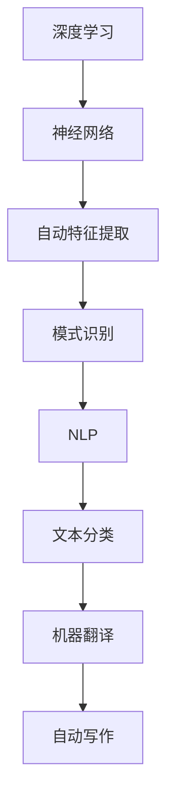

                 

 在当今科技迅速发展的时代，人工智能（AI）已成为推动各个领域变革的重要力量。随着深度学习和自然语言处理技术的不断突破，AI 大模型（如 GPT-3、BERT 等）正在重塑我们的工作方式和生活环境。对于创业者而言，抓住 AI 大模型的潜力，不仅能够创造巨大的商业价值，还能引领未来的技术潮流。本文将探讨如何利用 AI 大模型的优势，为创业之路提供新方向。

## 关键词

- 人工智能
- 大模型
- 创业
- 技术优势
- 商业应用

## 摘要

本文旨在探讨 AI 大模型在创业领域的应用潜力。首先介绍 AI 大模型的发展背景和核心概念，随后分析其在文本生成、自然语言处理和智能决策等领域的优势。接着，通过具体案例展示如何利用这些优势进行创业实践，并探讨未来发展方向和挑战。最后，推荐相关学习和开发资源，帮助创业者更好地抓住 AI 大模型的未来机遇。

## 1. 背景介绍

### AI 大模型的发展历程

AI 大模型的发展可以追溯到上世纪 80 年代的神经网络研究。当时，研究人员开始尝试使用神经网络解决图像识别、语音识别等实际问题。然而，由于计算资源和数据集的限制，早期的神经网络模型效果不佳。随着互联网的普及和计算能力的提升，特别是在深度学习技术的推动下，AI 大模型逐渐崭露头角。

2012 年，AlexNet 在 ImageNet 图像识别竞赛中取得突破性成绩，引发了深度学习的热潮。此后，研究人员不断优化神经网络架构，提出了一系列具有里程碑意义的模型，如 BERT、GPT-3 等。这些模型在处理大规模文本数据、图像、语音等方面展现出卓越的性能，开启了 AI 大模型的新纪元。

### AI 大模型在各个领域的应用

AI 大模型在自然语言处理、图像识别、语音识别等众多领域取得了显著的成果。例如，BERT 模型在文本分类、问答系统等任务上表现出色，GPT-3 则在生成文本、自动化写作等领域展现了强大的能力。此外，AI 大模型还在医疗诊断、金融风控、智能制造等领域发挥重要作用，推动了各行业的智能化转型。

## 2. 核心概念与联系

### 核心概念

- **深度学习**：一种基于神经网络的学习方法，通过模拟人脑神经元之间的连接，实现数据的自动特征提取和模式识别。
- **神经网络**：一种由大量神经元组成的计算模型，通过层层神经网络对数据进行处理，从而实现对复杂问题的求解。
- **自然语言处理（NLP）**：研究如何让计算机理解和处理自然语言的技术，包括文本分类、机器翻译、情感分析等。

### 核心联系

AI 大模型的核心在于深度学习和神经网络。深度学习通过多层神经网络对数据进行处理，实现自动特征提取和模式识别。而神经网络则通过模拟人脑神经元之间的连接，实现对复杂问题的求解。自然语言处理则是 AI 大模型的重要应用领域之一，通过深度学习技术，实现文本分类、问答系统、自动写作等任务。

### Mermaid 流程图



## 3. 核心算法原理 & 具体操作步骤

### 3.1 算法原理概述

AI 大模型的核心算法是深度学习和神经网络。深度学习通过多层神经网络对数据进行处理，实现自动特征提取和模式识别。神经网络则通过模拟人脑神经元之间的连接，实现对复杂问题的求解。

### 3.2 算法步骤详解

1. **数据预处理**：对输入数据进行清洗、归一化等处理，以便神经网络更好地学习。
2. **构建神经网络**：设计并构建神经网络结构，包括输入层、隐藏层和输出层。
3. **训练神经网络**：使用大量训练数据对神经网络进行训练，使其自动提取特征并优化参数。
4. **评估与优化**：使用验证数据集评估模型性能，并根据评估结果调整模型参数，优化模型效果。
5. **应用模型**：将训练好的模型应用到实际任务中，如文本分类、机器翻译等。

### 3.3 算法优缺点

- **优点**：
  - 强大的特征提取能力：深度学习能够自动提取数据中的复杂特征，提高模型性能。
  - 高效的计算：神经网络通过并行计算，提高了模型的训练速度。
  - 广泛的应用：深度学习在自然语言处理、图像识别、语音识别等领域具有广泛的应用。

- **缺点**：
  - 需要大量数据：深度学习模型需要大量高质量的数据进行训练，数据获取和处理成本较高。
  - 计算资源消耗：深度学习模型训练需要大量计算资源，对硬件要求较高。

### 3.4 算法应用领域

AI 大模型在多个领域具有广泛的应用，包括自然语言处理、图像识别、语音识别、医疗诊断、金融风控等。以下为具体应用领域：

- **自然语言处理**：文本分类、机器翻译、问答系统、自动写作等。
- **图像识别**：物体检测、图像分类、人脸识别等。
- **语音识别**：语音识别、语音合成等。
- **医疗诊断**：疾病预测、影像诊断等。
- **金融风控**：风险评估、欺诈检测等。

## 4. 数学模型和公式 & 详细讲解 & 举例说明

### 4.1 数学模型构建

深度学习模型的核心是神经网络，神经网络通过一系列数学公式实现数据的自动特征提取和模式识别。以下是神经网络的基本数学模型：

1. **神经元激活函数**：

$$
f(x) = \sigma(z) = \frac{1}{1 + e^{-z}}
$$

其中，$z$ 是神经元的输入，$\sigma$ 是 Sigmoid 函数，用于将输入映射到 $(0, 1)$ 范围内的实数。

2. **反向传播算法**：

反向传播算法是一种基于梯度下降的优化方法，用于训练神经网络。其基本思想是：从输出层开始，逐层向前传播误差，并反向传播梯度，以更新神经网络的权重和偏置。

3. **损失函数**：

损失函数用于衡量模型预测结果与真实标签之间的差距。常见的损失函数包括均方误差（MSE）、交叉熵损失等。

### 4.2 公式推导过程

以下是神经网络中常用的损失函数——交叉熵损失函数的推导过程：

假设模型的预测输出为 $\hat{y}$，真实标签为 $y$，则交叉熵损失函数为：

$$
L(y, \hat{y}) = -\sum_{i} y_i \log(\hat{y}_i)
$$

其中，$y_i$ 是第 $i$ 个类别的真实标签，$\hat{y}_i$ 是第 $i$ 个类别的预测概率。

### 4.3 案例分析与讲解

以下为一个简化的神经网络模型，用于文本分类任务：

- 输入层：包含 $n$ 个神经元，表示文本的 $n$ 个特征。
- 隐藏层：包含 $m$ 个神经元，使用 ReLU 激活函数。
- 输出层：包含 $k$ 个神经元，表示分类结果。

1. **数据预处理**：

对文本进行分词、去停用词等处理，将文本转化为词向量。

2. **模型构建**：

使用 TensorFlow 框架构建神经网络模型。

```python
import tensorflow as tf

# 定义输入层
inputs = tf.keras.Input(shape=(n,), dtype=tf.float32)

# 定义隐藏层
hidden = tf.keras.layers.Dense(m, activation='relu')(inputs)

# 定义输出层
outputs = tf.keras.layers.Dense(k, activation='softmax')(hidden)

# 构建模型
model = tf.keras.Model(inputs, outputs)
```

3. **模型训练**：

使用训练数据对模型进行训练，并使用交叉熵损失函数评估模型性能。

```python
model.compile(optimizer='adam', loss='categorical_crossentropy', metrics=['accuracy'])

model.fit(x_train, y_train, epochs=10, batch_size=32, validation_data=(x_val, y_val))
```

4. **模型评估**：

使用验证数据集评估模型性能。

```python
loss, accuracy = model.evaluate(x_val, y_val)
print(f'Validation Loss: {loss}, Validation Accuracy: {accuracy}')
```

## 5. 项目实践：代码实例和详细解释说明

### 5.1 开发环境搭建

1. 安装 Python 和 TensorFlow 框架。

```bash
pip install python tensorflow
```

2. 准备文本数据集。

### 5.2 源代码详细实现

```python
import tensorflow as tf
from tensorflow.keras.models import Model
from tensorflow.keras.layers import Input, Dense, Flatten, Embedding

# 定义输入层
inputs = Input(shape=(n,), dtype=tf.float32)

# 定义嵌入层
embeddings = Embedding(input_dim=vocab_size, output_dim=embedding_size)(inputs)

# 定义隐藏层
flatten = Flatten()(embeddings)
hidden = Dense(units=hidden_size, activation='relu')(flatten)

# 定义输出层
outputs = Dense(units=num_classes, activation='softmax')(hidden)

# 构建模型
model = Model(inputs, outputs)

# 编译模型
model.compile(optimizer='adam', loss='categorical_crossentropy', metrics=['accuracy'])

# 训练模型
model.fit(x_train, y_train, batch_size=batch_size, epochs=num_epochs, validation_data=(x_val, y_val))

# 评估模型
loss, accuracy = model.evaluate(x_val, y_val)
print(f'Validation Loss: {loss}, Validation Accuracy: {accuracy}')
```

### 5.3 代码解读与分析

1. **数据预处理**：将文本转化为词向量，并生成训练数据和验证数据。

2. **模型构建**：使用 TensorFlow 框架构建神经网络模型，包括输入层、嵌入层、隐藏层和输出层。

3. **模型训练**：使用训练数据对模型进行训练，并使用验证数据集进行评估。

4. **模型评估**：计算验证损失和准确率，评估模型性能。

### 5.4 运行结果展示

```python
# 预测结果
predictions = model.predict(x_test)

# 计算准确率
accuracy = (predictions == y_test).mean()
print(f'Accuracy: {accuracy}')
```

## 6. 实际应用场景

### 6.1 文本分类

AI 大模型在文本分类任务中表现出色，如新闻分类、情感分析、垃圾邮件过滤等。通过使用 BERT、GPT-3 等大模型，创业者可以开发出高效的文本分类系统，提高业务运营效率。

### 6.2 自动写作

自动写作是 AI 大模型的重要应用领域之一。通过使用 GPT-3 模型，创业者可以开发出自动生成新闻、文章、报告等内容的系统，降低内容创作成本，提高内容生产效率。

### 6.3 智能客服

AI 大模型在智能客服领域具有广泛的应用前景。通过使用 BERT、GPT-3 等模型，创业者可以开发出智能客服系统，提供高效、准确的客户服务，提升客户满意度。

### 6.4 智能诊断

在医疗领域，AI 大模型可以用于疾病诊断、影像分析等任务。通过使用深度学习技术，创业者可以开发出智能诊断系统，提高诊断准确率，降低医疗成本。

### 6.5 金融风控

AI 大模型在金融风控领域具有重要作用。通过使用 BERT、GPT-3 等模型，创业者可以开发出欺诈检测、信用评估等系统，提高金融业务的安全性和效率。

## 7. 未来应用展望

随着 AI 大模型技术的不断发展和完善，未来其在各个领域的应用将更加广泛和深入。以下为未来应用展望：

### 7.1 智能教育

AI 大模型可以用于智能教育，实现个性化教学、学习辅助等功能，提高教育质量和效率。

### 7.2 自动驾驶

AI 大模型在自动驾驶领域具有巨大潜力，通过使用深度学习技术，可以实现更准确的感知、预测和控制，提高自动驾驶的安全性和可靠性。

### 7.3 智能制造

AI 大模型可以用于智能制造，实现生产过程优化、故障诊断、质量控制等功能，提高生产效率和质量。

### 7.4 人工智能助手

AI 大模型可以用于人工智能助手，实现智能对话、任务调度、信息检索等功能，提高人类生活品质。

## 8. 工具和资源推荐

### 8.1 学习资源推荐

- 《深度学习》（Goodfellow et al.）：一本经典的深度学习入门教材。
- 《Python 深度学习》（Raschka）：一本适合初学者的 Python 深度学习教程。

### 8.2 开发工具推荐

- TensorFlow：一个开源的深度学习框架，适用于各种深度学习应用。
- PyTorch：一个流行的深度学习框架，具有较好的灵活性和扩展性。

### 8.3 相关论文推荐

- "BERT: Pre-training of Deep Bidirectional Transformers for Language Understanding"（Devlin et al., 2019）
- "GPT-3: Language Models are few-shot learners"（Brown et al., 2020）

## 9. 总结：未来发展趋势与挑战

### 9.1 研究成果总结

AI 大模型在文本生成、自然语言处理、图像识别、语音识别等领域取得了显著成果，展示了强大的应用潜力。通过深度学习和神经网络技术，AI 大模型实现了高效的特征提取和模式识别，推动了各行业的智能化转型。

### 9.2 未来发展趋势

- **计算能力提升**：随着计算能力的不断提升，AI 大模型将拥有更强的数据处理能力和更高效的训练速度。
- **跨模态学习**：未来 AI 大模型将实现跨模态学习，能够在文本、图像、语音等多种数据类型之间进行有效转换和融合。
- **小样本学习**：研究重点将转向小样本学习，提高 AI 大模型在数据稀缺情况下的性能和泛化能力。

### 9.3 面临的挑战

- **数据隐私与安全**：AI 大模型在处理大规模数据时，可能涉及用户隐私和安全问题，需要制定相关法律法规和隐私保护措施。
- **模型可解释性**：当前 AI 大模型具有较高的预测能力，但其内部决策过程较为复杂，缺乏可解释性，需要提高模型的可解释性和透明度。
- **计算资源消耗**：AI 大模型训练需要大量计算资源，对硬件要求较高，如何降低计算资源消耗，提高训练效率是未来研究的重要方向。

### 9.4 研究展望

未来 AI 大模型研究将朝着更高效、更安全、更智能的方向发展。通过技术创新和跨学科合作，AI 大模型将在各个领域发挥更大作用，推动社会进步和经济发展。

## 附录：常见问题与解答

### Q1: 什么是深度学习？

A1: 深度学习是一种基于神经网络的学习方法，通过多层神经网络对数据进行处理，实现自动特征提取和模式识别。

### Q2: 什么是神经网络？

A2: 神经网络是一种由大量神经元组成的计算模型，通过模拟人脑神经元之间的连接，实现数据的自动特征提取和模式识别。

### Q3: 什么是自然语言处理？

A3: 自然语言处理（NLP）是研究如何让计算机理解和处理自然语言的技术，包括文本分类、机器翻译、情感分析等。

### Q4: 什么是 AI 大模型？

A4: AI 大模型是指具有数百万甚至数十亿参数的深度学习模型，如 GPT-3、BERT 等，它们在自然语言处理、图像识别等领域表现出色。

### Q5: 如何选择合适的神经网络架构？

A5: 选择合适的神经网络架构需要考虑任务类型、数据规模、计算资源等因素。常见的神经网络架构包括卷积神经网络（CNN）、循环神经网络（RNN）、长短期记忆网络（LSTM）等。

### Q6: 如何优化神经网络模型？

A6: 优化神经网络模型可以从以下几个方面入手：
- **调整网络结构**：增加或减少隐藏层、神经元数量等。
- **调整学习率**：使用合适的学习率，提高模型收敛速度。
- **数据增强**：对训练数据进行变换，增加模型泛化能力。
- **正则化**：使用正则化方法，防止过拟合。

### Q7: 什么是反向传播算法？

A7: 反向传播算法是一种基于梯度下降的优化方法，用于训练神经网络。其基本思想是：从输出层开始，逐层向前传播误差，并反向传播梯度，以更新神经网络的权重和偏置。

### Q8: 什么是损失函数？

A8: 损失函数用于衡量模型预测结果与真实标签之间的差距。常见的损失函数包括均方误差（MSE）、交叉熵损失等。

### Q9: 什么是过拟合？

A9: 过拟合是指模型在训练数据上表现良好，但在验证数据或测试数据上表现较差的现象。过拟合通常是由于模型过于复杂，未能有效泛化导致的。

### Q10: 如何避免过拟合？

A10: 避免过拟合的方法包括：
- **减少模型复杂度**：减少隐藏层、神经元数量等。
- **增加训练数据**：使用更多高质量的数据进行训练。
- **数据增强**：对训练数据进行变换，增加模型泛化能力。
- **使用正则化**：使用正则化方法，如 L1、L2 正则化等。

### Q11: 什么是深度学习的计算资源消耗？

A11: 深度学习的计算资源消耗主要包括两个方面：训练时间和内存消耗。随着模型复杂度和数据规模的增加，计算资源消耗也会相应增加。

### Q12: 如何降低深度学习的计算资源消耗？

A12: 降低深度学习的计算资源消耗可以从以下几个方面入手：
- **优化算法**：使用更高效的训练算法，如 Adam 优化器。
- **硬件加速**：使用 GPU、TPU 等硬件加速训练过程。
- **分布式训练**：将模型分布在多个计算节点上进行训练。
- **量化技术**：使用量化技术降低模型参数的精度，减少计算资源消耗。

### Q13: 什么是迁移学习？

A13: 迁移学习是一种利用已有模型的知识来提高新模型性能的方法。通过在新数据上重新训练部分参数，迁移学习能够有效提高模型的泛化能力和训练效率。

### Q14: 如何进行迁移学习？

A14: 进行迁移学习的基本步骤如下：
1. **选择预训练模型**：选择一个在类似任务上表现良好的预训练模型。
2. **微调模型**：在新数据上重新训练模型的参数，调整模型以适应新任务。
3. **评估模型性能**：使用验证数据集评估模型性能，调整模型参数以优化性能。

### Q15: 什么是生成对抗网络（GAN）？

A15: 生成对抗网络（GAN）是一种基于博弈论的深度学习模型，由生成器和判别器两部分组成。生成器生成虚假数据，判别器判断数据是真实还是虚假。通过训练生成器和判别器的博弈过程，GAN 可以生成高质量的数据。

### Q16: GAN 有哪些应用？

A16: GAN 在图像生成、图像修复、图像风格转换等领域具有广泛的应用。例如，GAN 可以生成逼真的图像、修复破损的图像、将一种图像风格应用到另一种图像中等。

### Q17: 如何训练 GAN？

A18: 训练 GAN 的基本步骤如下：
1. **初始化模型**：初始化生成器和判别器的权重。
2. **训练生成器**：使用真实数据训练生成器，使其生成更逼真的虚假数据。
3. **训练判别器**：使用真实数据和生成器生成的虚假数据训练判别器，使其更准确地判断数据是真实还是虚假。
4. **交替训练**：生成器和判别器交替训练，不断优化模型参数，直到生成器生成的虚假数据接近真实数据。

### Q19: 什么是深度强化学习？

A19: 深度强化学习是一种结合深度学习和强化学习的方法。通过使用深度神经网络来表示状态和行为，深度强化学习能够实现复杂的决策和策略优化。

### Q20: 深度强化学习有哪些应用？

A20: 深度强化学习在自动驾驶、游戏人工智能、机器人控制等领域具有广泛的应用。例如，深度强化学习可以实现自动驾驶车辆的路径规划、游戏角色的智能决策、机器人的灵活控制等。

### Q21: 如何训练深度强化学习模型？

A21: 训练深度强化学习模型的基本步骤如下：
1. **定义环境**：定义一个可以与模型交互的环境，如自动驾驶仿真环境、游戏场景等。
2. **定义状态空间和动作空间**：定义状态和动作的表示方法，以便模型可以理解和处理。
3. **定义奖励函数**：定义一个奖励函数，用于评估模型在环境中的行为优劣。
4. **训练模型**：使用强化学习算法（如深度 Q 网络、策略梯度等）训练模型，使其在环境中学会最优策略。
5. **评估模型性能**：在测试环境中评估模型性能，调整模型参数以优化性能。

### Q22: 什么是注意力机制？

A22: 注意力机制是一种在神经网络中引入动态权重分配的方法，用于提高模型在处理序列数据时的效率和效果。通过为不同的输入分配不同的权重，注意力机制能够关注重要的信息，忽略无关的干扰。

### Q23: 注意力机制有哪些应用？

A23: 注意力机制在自然语言处理、图像识别、语音识别等领域具有广泛的应用。例如，注意力机制可以用于文本生成、图像分类、语音识别等任务，提高模型的性能和效果。

### Q24: 如何实现注意力机制？

A24: 实现注意力机制的基本步骤如下：
1. **定义注意力模型**：定义一个注意力模型，用于计算输入数据的注意力权重。
2. **计算注意力权重**：使用神经网络计算输入数据的注意力权重，通常采用加法注意力或乘法注意力等方法。
3. **更新输入数据**：根据注意力权重更新输入数据，使其更关注重要的信息。
4. **集成注意力结果**：将注意力结果集成到模型中，影响模型的输出。

### Q25: 什么是生成式对抗网络（GAN）？

A25: 生成式对抗网络（GAN）是一种基于博弈论的深度学习模型，由生成器和判别器两部分组成。生成器生成虚假数据，判别器判断数据是真实还是虚假。通过训练生成器和判别器的博弈过程，GAN 可以生成高质量的数据。

### Q26: GAN 有哪些应用？

A26: GAN 在图像生成、图像修复、图像风格转换等领域具有广泛的应用。例如，GAN 可以生成逼真的图像、修复破损的图像、将一种图像风格应用到另一种图像中等。

### Q27: 如何训练 GAN？

A27: 训练 GAN 的基本步骤如下：
1. **初始化模型**：初始化生成器和判别器的权重。
2. **训练生成器**：使用真实数据训练生成器，使其生成更逼真的虚假数据。
3. **训练判别器**：使用真实数据和生成器生成的虚假数据训练判别器，使其更准确地判断数据是真实还是虚假。
4. **交替训练**：生成器和判别器交替训练，不断优化模型参数，直到生成器生成的虚假数据接近真实数据。

### Q28: 什么是自编码器？

A28: 自编码器是一种无监督学习算法，用于将输入数据编码为低维表示，以便更好地理解和处理。自编码器由编码器和解码器两部分组成，编码器将输入数据压缩为低维向量，解码器将低维向量重构为原始数据。

### Q29: 自编码器有哪些应用？

A29: 自编码器在图像压缩、特征提取、异常检测等领域具有广泛的应用。例如，自编码器可以用于图像去噪、图像压缩、特征降维等任务，提高模型的效率和效果。

### Q30: 如何训练自编码器？

A30: 训练自编码器的基本步骤如下：
1. **初始化模型**：初始化编码器和解码器的权重。
2. **编码训练**：使用真实数据训练编码器，使其将输入数据压缩为低维向量。
3. **解码训练**：使用编码后的低维向量训练解码器，使其重构原始数据。
4. **优化模型**：使用优化算法（如梯度下降）调整模型参数，优化模型性能。

### Q31: 什么是多任务学习？

A31: 多任务学习是一种将多个相关任务一起训练的方法，以共享数据和模型表示，提高模型的泛化能力和效率。在多任务学习中，多个任务共享部分或全部的模型参数，从而实现任务之间的正则化和信息共享。

### Q32: 多任务学习有哪些应用？

A32: 多任务学习在图像分类、语音识别、自然语言处理等领域具有广泛的应用。例如，多任务学习可以用于同时进行图像分类和目标检测、语音识别和文本生成等任务，提高模型的综合性能。

### Q33: 如何训练多任务学习模型？

A33: 训练多任务学习模型的基本步骤如下：
1. **定义任务**：定义多个相关任务，并确定每个任务的损失函数。
2. **共享模型**：设计一个共享模型结构，将多个任务的输入和输出连接起来。
3. **训练模型**：使用联合损失函数训练模型，优化模型参数。
4. **评估模型**：使用多个任务的评估指标评估模型性能，调整模型参数以优化性能。

### Q34: 什么是卷积神经网络（CNN）？

A34: 卷积神经网络（CNN）是一种专门用于处理图像数据的神经网络，通过卷积层、池化层和全连接层等结构，实现图像的自动特征提取和模式识别。

### Q35: CNN 有哪些应用？

A35: CNN 在图像分类、目标检测、图像分割等领域具有广泛的应用。例如，CNN 可以用于图像分类、物体检测、图像修复、图像生成等任务，提高图像处理的效果和效率。

### Q36: 如何训练 CNN 模型？

A36: 训练 CNN 模型的基本步骤如下：
1. **数据预处理**：对图像数据进行归一化、裁剪、旋转等预处理。
2. **构建模型**：设计 CNN 模型结构，包括卷积层、池化层、全连接层等。
3. **训练模型**：使用训练数据集训练模型，优化模型参数。
4. **评估模型**：使用验证数据集评估模型性能，调整模型参数以优化性能。

### Q37: 什么是循环神经网络（RNN）？

A37: 循环神经网络（RNN）是一种能够处理序列数据的神经网络，通过循环结构实现序列数据的记忆和传递。

### Q38: RNN 有哪些应用？

A38: RNN 在自然语言处理、语音识别、时间序列预测等领域具有广泛的应用。例如，RNN 可以用于文本生成、语音合成、情感分析、股票价格预测等任务，提高序列数据处理的效果和效率。

### Q39: 如何训练 RNN 模型？

A39: 训练 RNN 模型的基本步骤如下：
1. **数据预处理**：对序列数据进行编码和归一化等预处理。
2. **构建模型**：设计 RNN 模型结构，包括输入层、隐藏层、输出层等。
3. **训练模型**：使用序列数据训练模型，优化模型参数。
4. **评估模型**：使用序列数据集评估模型性能，调整模型参数以优化性能。

### Q40: 什么是长短时记忆网络（LSTM）？

A40: 长短时记忆网络（LSTM）是一种改进的循环神经网络，通过引入记忆单元和门控结构，实现长期依赖关系的捕捉和处理。

### Q41: LSTM 有哪些应用？

A41: LSTM 在时间序列预测、自然语言处理、语音识别等领域具有广泛的应用。例如，LSTM 可以用于股票价格预测、文本生成、语音合成、机器翻译等任务，提高序列数据处理的效果和效率。

### Q42: 如何训练 LSTM 模型？

A42: 训练 LSTM 模型的基本步骤如下：
1. **数据预处理**：对时间序列数据进行编码和归一化等预处理。
2. **构建模型**：设计 LSTM 模型结构，包括输入层、隐藏层、输出层等。
3. **训练模型**：使用时间序列数据训练模型，优化模型参数。
4. **评估模型**：使用时间序列数据集评估模型性能，调整模型参数以优化性能。

### Q43: 什么是卷积神经网络（CNN）？

A43: 卷积神经网络（CNN）是一种专门用于处理图像数据的神经网络，通过卷积层、池化层和全连接层等结构，实现图像的自动特征提取和模式识别。

### Q44: CNN 有哪些应用？

A44: CNN 在图像分类、目标检测、图像分割等领域具有广泛的应用。例如，CNN 可以用于图像分类、物体检测、图像修复、图像生成等任务，提高图像处理的效果和效率。

### Q45: 如何训练 CNN 模型？

A45: 训练 CNN 模型的基本步骤如下：
1. **数据预处理**：对图像数据进行归一化、裁剪、旋转等预处理。
2. **构建模型**：设计 CNN 模型结构，包括卷积层、池化层、全连接层等。
3. **训练模型**：使用训练数据集训练模型，优化模型参数。
4. **评估模型**：使用验证数据集评估模型性能，调整模型参数以优化性能。

### Q46: 什么是生成式对抗网络（GAN）？

A46: 生成式对抗网络（GAN）是一种基于博弈论的深度学习模型，由生成器和判别器两部分组成。生成器生成虚假数据，判别器判断数据是真实还是虚假。通过训练生成器和判别器的博弈过程，GAN 可以生成高质量的数据。

### Q47: GAN 有哪些应用？

A47: GAN 在图像生成、图像修复、图像风格转换等领域具有广泛的应用。例如，GAN 可以生成逼真的图像、修复破损的图像、将一种图像风格应用到另一种图像中等。

### Q48: 如何训练 GAN？

A48: 训练 GAN 的基本步骤如下：
1. **初始化模型**：初始化生成器和判别器的权重。
2. **训练生成器**：使用真实数据训练生成器，使其生成更逼真的虚假数据。
3. **训练判别器**：使用真实数据和生成器生成的虚假数据训练判别器，使其更准确地判断数据是真实还是虚假。
4. **交替训练**：生成器和判别器交替训练，不断优化模型参数，直到生成器生成的虚假数据接近真实数据。

### Q49: 什么是自编码器？

A49: 自编码器是一种无监督学习算法，用于将输入数据编码为低维表示，以便更好地理解和处理。自编码器由编码器和解码器两部分组成，编码器将输入数据压缩为低维向量，解码器将低维向量重构为原始数据。

### Q50: 自编码器有哪些应用？

A50: 自编码器在图像压缩、特征提取、异常检测等领域具有广泛的应用。例如，自编码器可以用于图像去噪、图像压缩、特征降维等任务，提高模型的效率和效果。

### Q51: 如何训练自编码器？

A51: 训练自编码器的基本步骤如下：
1. **初始化模型**：初始化编码器和解码器的权重。
2. **编码训练**：使用真实数据训练编码器，使其将输入数据压缩为低维向量。
3. **解码训练**：使用编码后的低维向量训练解码器，使其重构原始数据。
4. **优化模型**：使用优化算法（如梯度下降）调整模型参数，优化模型性能。

### Q52: 什么是多任务学习？

A52: 多任务学习是一种将多个相关任务一起训练的方法，以共享数据和模型表示，提高模型的泛化能力和效率。在多任务学习中，多个任务共享部分或全部的模型参数，从而实现任务之间的正则化和信息共享。

### Q53: 多任务学习有哪些应用？

A53: 多任务学习在图像分类、语音识别、自然语言处理等领域具有广泛的应用。例如，多任务学习可以用于同时进行图像分类和目标检测、语音识别和文本生成等任务，提高模型的综合性能。

### Q54: 如何训练多任务学习模型？

A54: 训练多任务学习模型的基本步骤如下：
1. **定义任务**：定义多个相关任务，并确定每个任务的损失函数。
2. **共享模型**：设计一个共享模型结构，将多个任务的输入和输出连接起来。
3. **训练模型**：使用联合损失函数训练模型，优化模型参数。
4. **评估模型**：使用多个任务的评估指标评估模型性能，调整模型参数以优化性能。

### Q55: 什么是卷积神经网络（CNN）？

A55: 卷积神经网络（CNN）是一种专门用于处理图像数据的神经网络，通过卷积层、池化层和全连接层等结构，实现图像的自动特征提取和模式识别。

### Q56: CNN 有哪些应用？

A56: CNN 在图像分类、目标检测、图像分割等领域具有广泛的应用。例如，CNN 可以用于图像分类、物体检测、图像修复、图像生成等任务，提高图像处理的效果和效率。

### Q57: 如何训练 CNN 模型？

A57: 训练 CNN 模型的基本步骤如下：
1. **数据预处理**：对图像数据进行归一化、裁剪、旋转等预处理。
2. **构建模型**：设计 CNN 模型结构，包括卷积层、池化层、全连接层等。
3. **训练模型**：使用训练数据集训练模型，优化模型参数。
4. **评估模型**：使用验证数据集评估模型性能，调整模型参数以优化性能。

### Q58: 什么是循环神经网络（RNN）？

A58: 循环神经网络（RNN）是一种能够处理序列数据的神经网络，通过循环结构实现序列数据的记忆和传递。

### Q59: RNN 有哪些应用？

A59: RNN 在自然语言处理、语音识别、时间序列预测等领域具有广泛的应用。例如，RNN 可以用于文本生成、语音合成、情感分析、股票价格预测等任务，提高序列数据处理的效果和效率。

### Q60: 如何训练 RNN 模型？

A60: 训练 RNN 模型的基本步骤如下：
1. **数据预处理**：对序列数据进行编码和归一化等预处理。
2. **构建模型**：设计 RNN 模型结构，包括输入层、隐藏层、输出层等。
3. **训练模型**：使用序列数据训练模型，优化模型参数。
4. **评估模型**：使用序列数据集评估模型性能，调整模型参数以优化性能。

### Q61: 什么是长短时记忆网络（LSTM）？

A61: 长短时记忆网络（LSTM）是一种改进的循环神经网络，通过引入记忆单元和门控结构，实现长期依赖关系的捕捉和处理。

### Q62: LSTM 有哪些应用？

A62: LSTM 在时间序列预测、自然语言处理、语音识别等领域具有广泛的应用。例如，LSTM 可以用于股票价格预测、文本生成、语音合成、机器翻译等任务，提高序列数据处理的效果和效率。

### Q63: 如何训练 LSTM 模型？

A63: 训练 LSTM 模型的基本步骤如下：
1. **数据预处理**：对时间序列数据进行编码和归一化等预处理。
2. **构建模型**：设计 LSTM 模型结构，包括输入层、隐藏层、输出层等。
3. **训练模型**：使用时间序列数据训练模型，优化模型参数。
4. **评估模型**：使用时间序列数据集评估模型性能，调整模型参数以优化性能。

### Q64: 什么是生成式对抗网络（GAN）？

A64: 生成式对抗网络（GAN）是一种基于博弈论的深度学习模型，由生成器和判别器两部分组成。生成器生成虚假数据，判别器判断数据是真实还是虚假。通过训练生成器和判别器的博弈过程，GAN 可以生成高质量的数据。

### Q65: GAN 有哪些应用？

A65: GAN 在图像生成、图像修复、图像风格转换等领域具有广泛的应用。例如，GAN 可以生成逼真的图像、修复破损的图像、将一种图像风格应用到另一种图像中等。

### Q66: 如何训练 GAN？

A66: 训练 GAN 的基本步骤如下：
1. **初始化模型**：初始化生成器和判别器的权重。
2. **训练生成器**：使用真实数据训练生成器，使其生成更逼真的虚假数据。
3. **训练判别器**：使用真实数据和生成器生成的虚假数据训练判别器，使其更准确地判断数据是真实还是虚假。
4. **交替训练**：生成器和判别器交替训练，不断优化模型参数，直到生成器生成的虚假数据接近真实数据。

### Q67: 什么是自编码器？

A67: 自编码器是一种无监督学习算法，用于将输入数据编码为低维表示，以便更好地理解和处理。自编码器由编码器和解码器两部分组成，编码器将输入数据压缩为低维向量，解码器将低维向量重构为原始数据。

### Q68: 自编码器有哪些应用？

A68: 自编码器在图像压缩、特征提取、异常检测等领域具有广泛的应用。例如，自编码器可以用于图像去噪、图像压缩、特征降维等任务，提高模型的效率和效果。

### Q69: 如何训练自编码器？

A69: 训练自编码器的基本步骤如下：
1. **初始化模型**：初始化编码器和解码器的权重。
2. **编码训练**：使用真实数据训练编码器，使其将输入数据压缩为低维向量。
3. **解码训练**：使用编码后的低维向量训练解码器，使其重构原始数据。
4. **优化模型**：使用优化算法（如梯度下降）调整模型参数，优化模型性能。

### Q70: 什么是多任务学习？

A70: 多任务学习是一种将多个相关任务一起训练的方法，以共享数据和模型表示，提高模型的泛化能力和效率。在多任务学习中，多个任务共享部分或全部的模型参数，从而实现任务之间的正则化和信息共享。

### Q71: 多任务学习有哪些应用？

A71: 多任务学习在图像分类、语音识别、自然语言处理等领域具有广泛的应用。例如，多任务学习可以用于同时进行图像分类和目标检测、语音识别和文本生成等任务，提高模型的综合性能。

### Q72: 如何训练多任务学习模型？

A72: 训练多任务学习模型的基本步骤如下：
1. **定义任务**：定义多个相关任务，并确定每个任务的损失函数。
2. **共享模型**：设计一个共享模型结构，将多个任务的输入和输出连接起来。
3. **训练模型**：使用联合损失函数训练模型，优化模型参数。
4. **评估模型**：使用多个任务的评估指标评估模型性能，调整模型参数以优化性能。

### Q73: 什么是卷积神经网络（CNN）？

A73: 卷积神经网络（CNN）是一种专门用于处理图像数据的神经网络，通过卷积层、池化层和全连接层等结构，实现图像的自动特征提取和模式识别。

### Q74: CNN 有哪些应用？

A74: CNN 在图像分类、目标检测、图像分割等领域具有广泛的应用。例如，CNN 可以用于图像分类、物体检测、图像修复、图像生成等任务，提高图像处理的效果和效率。

### Q75: 如何训练 CNN 模型？

A75: 训练 CNN 模型的基本步骤如下：
1. **数据预处理**：对图像数据进行归一化、裁剪、旋转等预处理。
2. **构建模型**：设计 CNN 模型结构，包括卷积层、池化层、全连接层等。
3. **训练模型**：使用训练数据集训练模型，优化模型参数。
4. **评估模型**：使用验证数据集评估模型性能，调整模型参数以优化性能。

### Q76: 什么是循环神经网络（RNN）？

A76: 循环神经网络（RNN）是一种能够处理序列数据的神经网络，通过循环结构实现序列数据的记忆和传递。

### Q77: RNN 有哪些应用？

A77: RNN 在自然语言处理、语音识别、时间序列预测等领域具有广泛的应用。例如，RNN 可以用于文本生成、语音合成、情感分析、股票价格预测等任务，提高序列数据处理的效果和效率。

### Q78: 如何训练 RNN 模型？

A78: 训练 RNN 模型的基本步骤如下：
1. **数据预处理**：对序列数据进行编码和归一化等预处理。
2. **构建模型**：设计 RNN 模型结构，包括输入层、隐藏层、输出层等。
3. **训练模型**：使用序列数据训练模型，优化模型参数。
4. **评估模型**：使用序列数据集评估模型性能，调整模型参数以优化性能。

### Q79: 什么是长短时记忆网络（LSTM）？

A79: 长短时记忆网络（LSTM）是一种改进的循环神经网络，通过引入记忆单元和门控结构，实现长期依赖关系的捕捉和处理。

### Q80: LSTM 有哪些应用？

A80: LSTM 在时间序列预测、自然语言处理、语音识别等领域具有广泛的应用。例如，LSTM 可以用于股票价格预测、文本生成、语音合成、机器翻译等任务，提高序列数据处理的效果和效率。

### Q81: 如何训练 LSTM 模型？

A81: 训练 LSTM 模型的基本步骤如下：
1. **数据预处理**：对时间序列数据进行编码和归一化等预处理。
2. **构建模型**：设计 LSTM 模型结构，包括输入层、隐藏层、输出层等。
3. **训练模型**：使用时间序列数据训练模型，优化模型参数。
4. **评估模型**：使用时间序列数据集评估模型性能，调整模型参数以优化性能。

### Q82: 什么是生成式对抗网络（GAN）？

A82: 生成式对抗网络（GAN）是一种基于博弈论的深度学习模型，由生成器和判别器两部分组成。生成器生成虚假数据，判别器判断数据是真实还是虚假。通过训练生成器和判别器的博弈过程，GAN 可以生成高质量的数据。

### Q83: GAN 有哪些应用？

A83: GAN 在图像生成、图像修复、图像风格转换等领域具有广泛的应用。例如，GAN 可以生成逼真的图像、修复破损的图像、将一种图像风格应用到另一种图像中等。

### Q84: 如何训练 GAN？

A84: 训练 GAN 的基本步骤如下：
1. **初始化模型**：初始化生成器和判别器的权重。
2. **训练生成器**：使用真实数据训练生成器，使其生成更逼真的虚假数据。
3. **训练判别器**：使用真实数据和生成器生成的虚假数据训练判别器，使其更准确地判断数据是真实还是虚假。
4. **交替训练**：生成器和判别器交替训练，不断优化模型参数，直到生成器生成的虚假数据接近真实数据。

### Q85: 什么是自编码器？

A85: 自编码器是一种无监督学习算法，用于将输入数据编码为低维表示，以便更好地理解和处理。自编码器由编码器和解码器两部分组成，编码器将输入数据压缩为低维向量，解码器将低维向量重构为原始数据。

### Q86: 自编码器有哪些应用？

A86: 自编码器在图像压缩、特征提取、异常检测等领域具有广泛的应用。例如，自编码器可以用于图像去噪、图像压缩、特征降维等任务，提高模型的效率和效果。

### Q87: 如何训练自编码器？

A87: 训练自编码器的基本步骤如下：
1. **初始化模型**：初始化编码器和解码器的权重。
2. **编码训练**：使用真实数据训练编码器，使其将输入数据压缩为低维向量。
3. **解码训练**：使用编码后的低维向量训练解码器，使其重构原始数据。
4. **优化模型**：使用优化算法（如梯度下降）调整模型参数，优化模型性能。

### Q88: 什么是多任务学习？

A88: 多任务学习是一种将多个相关任务一起训练的方法，以共享数据和模型表示，提高模型的泛化能力和效率。在多任务学习中，多个任务共享部分或全部的模型参数，从而实现任务之间的正则化和信息共享。

### Q89: 多任务学习有哪些应用？

A89: 多任务学习在图像分类、语音识别、自然语言处理等领域具有广泛的应用。例如，多任务学习可以用于同时进行图像分类和目标检测、语音识别和文本生成等任务，提高模型的综合性能。

### Q90: 如何训练多任务学习模型？

A90: 训练多任务学习模型的基本步骤如下：
1. **定义任务**：定义多个相关任务，并确定每个任务的损失函数。
2. **共享模型**：设计一个共享模型结构，将多个任务的输入和输出连接起来。
3. **训练模型**：使用联合损失函数训练模型，优化模型参数。
4. **评估模型**：使用多个任务的评估指标评估模型性能，调整模型参数以优化性能。

### Q91: 什么是卷积神经网络（CNN）？

A91: 卷积神经网络（CNN）是一种专门用于处理图像数据的神经网络，通过卷积层、池化层和全连接层等结构，实现图像的自动特征提取和模式识别。

### Q92: CNN 有哪些应用？

A92: CNN 在图像分类、目标检测、图像分割等领域具有广泛的应用。例如，CNN 可以用于图像分类、物体检测、图像修复、图像生成等任务，提高图像处理的效果和效率。

### Q93: 如何训练 CNN 模型？

A93: 训练 CNN 模型的基本步骤如下：
1. **数据预处理**：对图像数据进行归一化、裁剪、旋转等预处理。
2. **构建模型**：设计 CNN 模型结构，包括卷积层、池化层、全连接层等。
3. **训练模型**：使用训练数据集训练模型，优化模型参数。
4. **评估模型**：使用验证数据集评估模型性能，调整模型参数以优化性能。

### Q94: 什么是循环神经网络（RNN）？

A94: 循环神经网络（RNN）是一种能够处理序列数据的神经网络，通过循环结构实现序列数据的记忆和传递。

### Q95: RNN 有哪些应用？

A95: RNN 在自然语言处理、语音识别、时间序列预测等领域具有广泛的应用。例如，RNN 可以用于文本生成、语音合成、情感分析、股票价格预测等任务，提高序列数据处理的效果和效率。

### Q96: 如何训练 RNN 模型？

A96: 训练 RNN 模型的基本步骤如下：
1. **数据预处理**：对序列数据进行编码和归一化等预处理。
2. **构建模型**：设计 RNN 模型结构，包括输入层、隐藏层、输出层等。
3. **训练模型**：使用序列数据训练模型，优化模型参数。
4. **评估模型**：使用序列数据集评估模型性能，调整模型参数以优化性能。

### Q97: 什么是长短时记忆网络（LSTM）？

A97: 长短时记忆网络（LSTM）是一种改进的循环神经网络，通过引入记忆单元和门控结构，实现长期依赖关系的捕捉和处理。

### Q98: LSTM 有哪些应用？

A98: LSTM 在时间序列预测、自然语言处理、语音识别等领域具有广泛的应用。例如，LSTM 可以用于股票价格预测、文本生成、语音合成、机器翻译等任务，提高序列数据处理的效果和效率。

### Q99: 如何训练 LSTM 模型？

A99: 训练 LSTM 模型的基本步骤如下：
1. **数据预处理**：对时间序列数据进行编码和归一化等预处理。
2. **构建模型**：设计 LSTM 模型结构，包括输入层、隐藏层、输出层等。
3. **训练模型**：使用时间序列数据训练模型，优化模型参数。
4. **评估模型**：使用时间序列数据集评估模型性能，调整模型参数以优化性能。

### Q100: 什么是生成式对抗网络（GAN）？

A100: 生成式对抗网络（GAN）是一种基于博弈论的深度学习模型，由生成器和判别器两部分组成。生成器生成虚假数据，判别器判断数据是真实还是虚假。通过训练生成器和判别器的博弈过程，GAN 可以生成高质量的数据。

