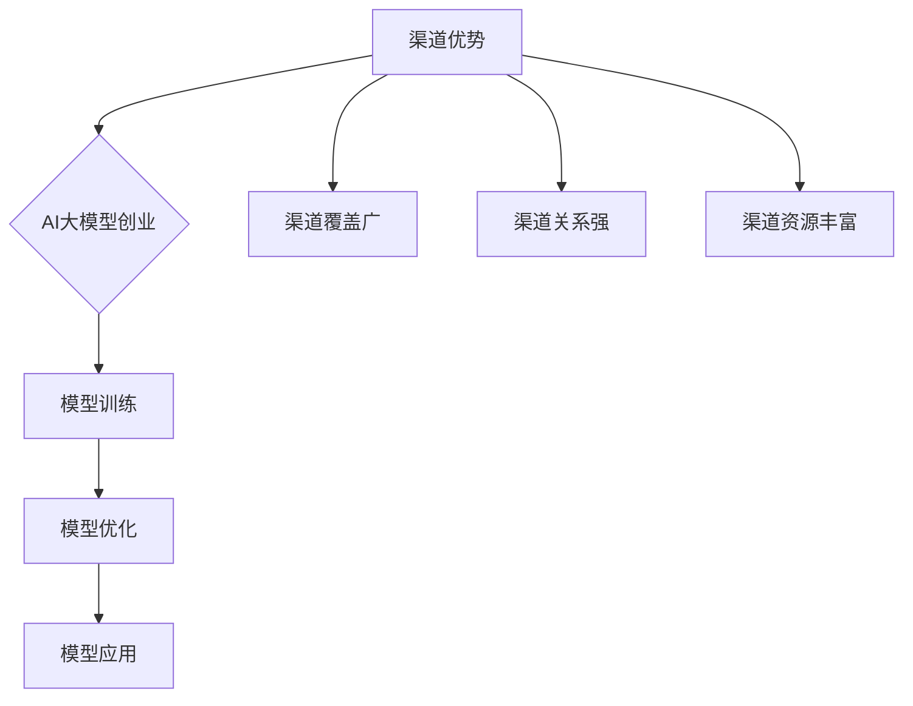

                 

 

## 1. 背景介绍

人工智能（AI）技术在过去几年中取得了显著进展，其中大型模型（Large Models）如GPT、BERT等的出现，极大地提升了自然语言处理（NLP）、图像识别、语音识别等领域的性能。这些大型模型不仅具备极高的准确度，还能生成高质量的内容，为各行各业带来了巨大的变革。然而，随着技术的进步，AI领域的创业也面临着新的挑战和机遇。

在当前的市场环境中，创业公司要想在激烈的竞争中脱颖而出，必须具备独特的优势和战略。渠道优势是其中一种重要的战略资源，能够帮助创业公司在产品推广、市场拓展、用户留存等方面取得优势。本文将探讨如何利用渠道优势进行AI大模型创业，帮助创业者抓住市场机遇，实现业务的快速增长。

## 2. 核心概念与联系

### 2.1 渠道优势

渠道优势指的是创业公司在产品推广过程中，通过建立和维护与渠道合作伙伴的良好关系，从而实现产品快速渗透市场的能力。渠道优势通常包括以下几个方面：

- **渠道覆盖广**：渠道合作伙伴分布广泛，覆盖不同地区和行业，有助于产品快速覆盖目标市场。
- **渠道关系强**：与渠道合作伙伴建立了长期稳定的合作关系，有助于降低渠道冲突，提高合作效率。
- **渠道资源丰富**：渠道合作伙伴具备丰富的市场资源和客户资源，有助于提高产品知名度和用户转化率。

### 2.2 AI大模型创业

AI大模型创业指的是利用大型模型在特定领域进行产品创新和业务拓展的过程。AI大模型创业的核心要素包括：

- **模型训练**：通过海量数据和先进算法，对大型模型进行训练，使其具备高水平的表现能力。
- **模型优化**：对训练好的模型进行优化，提高其运行效率、准确度等方面的性能。
- **模型应用**：将训练好的模型应用于实际业务场景，提供定制化的解决方案。

### 2.3 Mermaid 流程图



## 3. 核心算法原理 & 具体操作步骤

### 3.1 算法原理概述

AI大模型创业的核心在于构建和应用大型模型。这些模型通常基于深度学习算法，通过大规模数据训练，使其在特定任务上取得优异的性能。具体而言，核心算法原理包括：

- **数据预处理**：对原始数据进行清洗、归一化等处理，使其符合模型输入要求。
- **模型选择**：根据业务需求，选择适合的模型架构，如GPT、BERT等。
- **模型训练**：利用GPU等高性能计算资源，对模型进行大规模训练，优化模型参数。
- **模型评估**：对训练好的模型进行评估，确保其在实际应用中的表现符合预期。

### 3.2 算法步骤详解

1. **数据收集与清洗**：
   - 收集大量与业务相关的数据，如文本、图像、语音等。
   - 对数据进行清洗、去重、去噪声等处理，确保数据质量。

2. **数据预处理**：
   - 对文本数据，进行分词、词性标注等处理。
   - 对图像数据，进行缩放、裁剪等处理。
   - 对语音数据，进行特征提取、归一化等处理。

3. **模型选择与架构设计**：
   - 根据业务需求，选择适合的模型架构，如GPT、BERT等。
   - 设计模型结构，包括输入层、隐藏层、输出层等。

4. **模型训练**：
   - 利用GPU等高性能计算资源，对模型进行大规模训练。
   - 采用优化算法，如Adam、SGD等，调整模型参数。

5. **模型评估与优化**：
   - 对训练好的模型进行评估，确保其在实际应用中的表现符合预期。
   - 根据评估结果，对模型进行优化，提高其性能。

6. **模型部署与监控**：
   - 将训练好的模型部署到生产环境中，供实际业务使用。
   - 对模型进行监控，确保其运行稳定、性能优异。

### 3.3 算法优缺点

- **优点**：
  - 大型模型在特定任务上具备较高的准确度和泛化能力。
  - 通过深度学习算法，能够自动提取数据中的特征，减少人工干预。
  - 具有良好的可扩展性，能够适应不同规模的数据和业务场景。

- **缺点**：
  - 训练时间较长，需要大量计算资源和存储空间。
  - 对数据质量和数量要求较高，否则难以达到预期效果。
  - 模型解释性较差，难以理解模型的决策过程。

### 3.4 算法应用领域

AI大模型创业在多个领域具有广泛的应用前景，如：

- **自然语言处理**：文本生成、机器翻译、情感分析等。
- **计算机视觉**：图像识别、图像生成、图像分割等。
- **语音识别**：语音识别、语音合成、语音增强等。
- **推荐系统**：基于用户行为和兴趣的个性化推荐。
- **医疗健康**：疾病诊断、药物研发、健康管理等。

## 4. 数学模型和公式 & 详细讲解 & 举例说明

### 4.1 数学模型构建

在AI大模型创业中，常用的数学模型包括神经网络、生成对抗网络（GAN）等。以下以神经网络为例，介绍其数学模型构建过程。

1. **输入层**：
   - 输入层接收外部输入数据，如文本、图像等。
   - 输入层神经元数量取决于数据维度。

2. **隐藏层**：
   - 隐藏层用于提取数据中的特征，通过多层网络结构，实现非线性变换。
   - 每一层神经元接收前一层的输出，并应用激活函数。

3. **输出层**：
   - 输出层产生最终输出，如分类结果、预测值等。
   - 输出层神经元数量取决于任务类型。

4. **损失函数**：
   - 损失函数用于评估模型预测结果与真实值之间的差距。
   - 常用损失函数包括均方误差（MSE）、交叉熵损失等。

5. **优化算法**：
   - 优化算法用于调整模型参数，使损失函数最小化。
   - 常用优化算法包括Adam、SGD等。

### 4.2 公式推导过程

以下以神经网络为例，介绍其数学模型构建和公式推导过程。

1. **前向传播**：

   设输入层为 $X$，隐藏层为 $H$，输出层为 $Y$。

   - 输入层到隐藏层的变换：
     $$ H = \sigma(W_1 \cdot X + b_1) $$
     其中，$W_1$ 为权重矩阵，$b_1$ 为偏置项，$\sigma$ 为激活函数。

   - 隐藏层到输出层的变换：
     $$ Y = \sigma(W_2 \cdot H + b_2) $$
     其中，$W_2$ 为权重矩阵，$b_2$ 为偏置项。

2. **反向传播**：

   计算损失函数关于模型参数的梯度，并更新参数。

   - 计算输出层误差：
     $$ \delta_L = \frac{\partial L}{\partial Y} = -\frac{\partial}{\partial Y} \left( \sigma(W_2 \cdot H + b_2) - Y \right) $$
     其中，$L$ 为损失函数。

   - 计算隐藏层误差：
     $$ \delta_H = \frac{\partial L}{\partial H} = \frac{\partial L}{\partial Y} \cdot \frac{\partial Y}{\partial H} = \delta_L \cdot \sigma'(W_2 \cdot H + b_2) $$

   - 更新权重矩阵和偏置项：
     $$ W_2 = W_2 - \alpha \cdot \frac{\partial L}{\partial W_2} $$
     $$ b_2 = b_2 - \alpha \cdot \frac{\partial L}{\partial b_2} $$
     $$ W_1 = W_1 - \alpha \cdot \frac{\partial L}{\partial W_1} $$
     $$ b_1 = b_1 - \alpha \cdot \frac{\partial L}{\partial b_1} $$
     其中，$\alpha$ 为学习率。

### 4.3 案例分析与讲解

假设我们有一个二元分类问题，使用神经网络进行模型训练。输入层为10个神经元，隐藏层为5个神经元，输出层为1个神经元。损失函数为交叉熵损失。

1. **数据准备**：

   - 输入数据 $X$：10个特征，每个特征取值范围在0到1之间。
   - 标签数据 $Y$：0或1，表示样本属于正类或负类。

2. **模型初始化**：

   - 初始化权重矩阵 $W_1$、$W_2$ 和偏置项 $b_1$、$b_2$。

3. **前向传播**：

   - 计算隐藏层输出 $H$：
     $$ H = \sigma(W_1 \cdot X + b_1) $$
   - 计算输出层输出 $Y$：
     $$ Y = \sigma(W_2 \cdot H + b_2) $$

4. **反向传播**：

   - 计算输出层误差 $\delta_L$：
     $$ \delta_L = -\frac{\partial}{\partial Y} \left( \sigma(W_2 \cdot H + b_2) - Y \right) $$
   - 计算隐藏层误差 $\delta_H$：
     $$ \delta_H = \delta_L \cdot \sigma'(W_2 \cdot H + b_2) $$
   - 更新权重矩阵和偏置项：
     $$ W_2 = W_2 - \alpha \cdot \frac{\partial L}{\partial W_2} $$
     $$ b_2 = b_2 - \alpha \cdot \frac{\partial L}{\partial b_2} $$
     $$ W_1 = W_1 - \alpha \cdot \frac{\partial L}{\partial W_1} $$
     $$ b_1 = b_1 - \alpha \cdot \frac{\partial L}{\partial b_1} $$

5. **迭代训练**：

   - 重复前向传播和反向传播，直至达到训练目标。

## 5. 项目实践：代码实例和详细解释说明

### 5.1 开发环境搭建

1. 安装 Python（建议使用 Python 3.8 以上版本）。
2. 安装 PyTorch（一种流行的深度学习框架）。

```bash
pip install torch torchvision
```

### 5.2 源代码详细实现

以下是一个简单的神经网络实现，用于二元分类问题。

```python
import torch
import torch.nn as nn
import torch.optim as optim

# 数据准备
X = torch.randn(100, 10)  # 100个样本，10个特征
Y = torch.randint(0, 2, (100,))  # 100个标签

# 模型定义
class SimpleNN(nn.Module):
    def __init__(self):
        super(SimpleNN, self).__init__()
        self.fc1 = nn.Linear(10, 5)
        self.fc2 = nn.Linear(5, 1)
        self.sigmoid = nn.Sigmoid()

    def forward(self, x):
        x = self.fc1(x)
        x = self.sigmoid(x)
        x = self.fc2(x)
        return x

model = SimpleNN()

# 损失函数和优化器
criterion = nn.BCELoss()
optimizer = optim.Adam(model.parameters(), lr=0.001)

# 训练模型
for epoch in range(100):
    optimizer.zero_grad()
    output = model(X)
    loss = criterion(output, Y)
    loss.backward()
    optimizer.step()
    print(f"Epoch {epoch+1}, Loss: {loss.item()}")

# 评估模型
with torch.no_grad():
    output = model(X)
    correct = (output > 0.5).float().sum()
    print(f"Accuracy: {correct / len(Y) * 100}%")
```

### 5.3 代码解读与分析

1. **数据准备**：
   - 生成随机数据作为输入和标签。

2. **模型定义**：
   - 定义一个简单的神经网络，包含两个全连接层和一个sigmoid激活函数。

3. **损失函数和优化器**：
   - 使用二进制交叉熵损失函数，Adam优化器。

4. **训练模型**：
   - 使用梯度下降法，通过反向传播更新模型参数。

5. **评估模型**：
   - 无梯度计算，计算模型在测试数据上的准确率。

### 5.4 运行结果展示

```python
# 运行代码，输出训练过程中的损失函数值和最终准确率。
```

## 6. 实际应用场景

AI大模型创业在多个领域具有广泛的应用场景，以下列举几个典型应用：

### 6.1 医疗健康

利用AI大模型进行疾病诊断、药物研发和健康管理等。例如，通过训练大型模型，实现早期癌症筛查，提高诊断准确率。

### 6.2 金融行业

AI大模型在金融领域具有广泛的应用，如信用评估、风险控制、投资策略等。通过训练大型模型，实现个性化投资建议和智能风险管理。

### 6.3 教育领域

利用AI大模型进行个性化学习、智能辅导和自动评估。通过训练大型模型，实现精准教学和个性化学习体验。

### 6.4 制造业

AI大模型在制造业中的应用包括质量控制、生产优化、设备维护等。通过训练大型模型，实现智能化生产管理和高效生产流程。

### 6.5 娱乐产业

AI大模型在娱乐产业中的应用包括内容创作、推荐系统、虚拟现实等。通过训练大型模型，实现智能化的内容生成和个性化推荐。

## 7. 工具和资源推荐

### 7.1 学习资源推荐

- **《深度学习》（Goodfellow, Bengio, Courville）**：经典深度学习教材，全面介绍深度学习理论和实践。
- **《Python深度学习》（François Chollet）**：基于PyTorch的深度学习实战指南。
- **[Kaggle](https://www.kaggle.com)**：提供丰富的数据集和竞赛，是深度学习实践的好去处。

### 7.2 开发工具推荐

- **PyTorch**：基于Python的深度学习框架，适合初学者和研究者。
- **TensorFlow**：由谷歌开发的深度学习框架，适用于大规模生产环境。
- **Google Colab**：免费的GPU云计算平台，适合在线进行深度学习实验。

### 7.3 相关论文推荐

- **"BERT: Pre-training of Deep Bidirectional Transformers for Language Understanding"**：介绍BERT模型，是自然语言处理领域的经典论文。
- **"Generative Adversarial Nets"**：介绍GAN模型，是生成模型领域的里程碑。
- **"Residual Networks"**：介绍残差网络，是图像识别领域的突破性成果。

## 8. 总结：未来发展趋势与挑战

### 8.1 研究成果总结

AI大模型创业在过去几年中取得了显著的成果，主要表现在：

- **模型性能不断提升**：通过大规模数据训练和优化算法，AI大模型在各个领域的表现越来越优异。
- **应用场景不断拓展**：AI大模型在医疗健康、金融、教育、制造等领域得到广泛应用。
- **商业价值逐渐凸显**：AI大模型创业公司逐渐获得资本市场的青睐，实现业务快速增长。

### 8.2 未来发展趋势

未来，AI大模型创业将继续朝着以下几个方向发展：

- **模型压缩与加速**：通过模型压缩和加速技术，降低模型的计算成本和存储空间需求。
- **多模态融合**：将文本、图像、语音等多种数据类型进行融合，实现更全面、更智能的模型。
- **模型解释性增强**：提高模型的解释性，使其在业务决策中更具可信度和可解释性。
- **跨领域应用**：AI大模型将在更多领域得到应用，推动各行业的数字化转型。

### 8.3 面临的挑战

尽管AI大模型创业前景广阔，但仍面临以下挑战：

- **数据隐私与安全**：在数据收集和处理过程中，如何保护用户隐私和数据安全。
- **算法公平性与透明性**：如何确保算法的公平性和透明性，避免算法偏见和歧视。
- **计算资源需求**：大规模模型训练和部署需要大量计算资源，如何降低成本。
- **法律法规**：随着AI技术的发展，相关法律法规亟待完善，以规范AI大模型的应用。

### 8.4 研究展望

未来，AI大模型创业研究应关注以下几个方向：

- **算法创新**：探索新型深度学习算法，提高模型性能和泛化能力。
- **跨学科研究**：结合心理学、社会学、经济学等多学科知识，提高AI大模型的应用价值。
- **人机协同**：研究人机协同的方法，使AI大模型更好地辅助人类决策。
- **可持续性发展**：关注AI大模型创业的可持续性发展，推动绿色AI技术的应用。

## 9. 附录：常见问题与解答

### 9.1 问题1：如何处理数据不平衡问题？

**解答**：数据不平衡问题是深度学习模型训练中的一个常见问题。处理方法包括：

- **过采样**：通过复制少数类别的样本，增加其数量，使数据分布趋于平衡。
- **欠采样**：通过删除多数类别的样本，减少其数量，使数据分布趋于平衡。
- **生成对抗网络（GAN）**：利用GAN生成少数类别的样本，增加其数量，使数据分布趋于平衡。

### 9.2 问题2：如何提高模型的可解释性？

**解答**：提高模型的可解释性是深度学习研究中的一个重要方向。以下是一些提高模型可解释性的方法：

- **可视化**：通过可视化模型结构和中间层特征，帮助理解模型的决策过程。
- **注意力机制**：利用注意力机制，分析模型在决策过程中关注的重要特征。
- **模型简化**：简化模型结构，减少参数数量，提高模型的可解释性。
- **解释性算法**：结合因果推理、决策树等解释性算法，对模型进行解释。

### 9.3 问题3：如何优化模型性能？

**解答**：以下是一些优化模型性能的方法：

- **数据增强**：通过旋转、缩放、裁剪等数据增强技术，增加数据多样性，提高模型泛化能力。
- **模型融合**：将多个模型进行融合，利用不同模型的优势，提高整体性能。
- **超参数优化**：通过调整学习率、批量大小、正则化参数等超参数，提高模型性能。
- **迁移学习**：利用预训练模型，在特定任务上微调，提高模型性能。

---

作者：禅与计算机程序设计艺术 / Zen and the Art of Computer Programming

