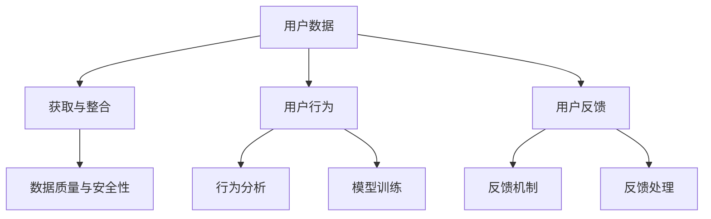

                 

关键词：AI 大模型，创业，用户优势，商业模式，技术落地，数据隐私，隐私计算，联邦学习，用户体验

> 摘要：随着人工智能技术的快速发展，大模型的应用场景越来越广泛。本文将探讨如何利用用户优势进行 AI 大模型创业，从用户数据、隐私保护和用户体验等方面展开分析，旨在为创业者提供有价值的参考。

## 1. 背景介绍

近年来，人工智能技术取得了飞速发展，尤其是在深度学习领域。大模型（如 GPT-3、BERT 等）的出现，使得人工智能的应用范围得到了极大的拓展。大模型具有较高的准确性和泛化能力，可以用于各种场景，如自然语言处理、图像识别、推荐系统等。然而，大模型的发展也面临着一系列挑战，其中最为突出的是数据隐私问题和用户体验。

在人工智能创业领域，如何充分利用用户优势，实现商业价值最大化，成为了一个亟待解决的问题。用户优势主要包括用户数据、用户行为和用户反馈等方面。如何有效地利用这些优势，构建可持续的商业模式，是本文要探讨的核心问题。

## 2. 核心概念与联系

### 2.1. 用户数据

用户数据是 AI 大模型的基础。在创业过程中，创业者需要关注以下几个方面：

- 数据的获取与整合：通过合法途径获取用户数据，并对其进行整合和处理，以提供更精准的服务。
- 数据的质量与安全性：确保数据质量，遵循数据隐私保护法规，防止数据泄露。

### 2.2. 用户行为

用户行为数据是洞察用户需求的重要依据。创业者可以通过以下方式利用用户行为数据：

- 行为分析：对用户行为进行深入分析，了解用户喜好和需求，从而优化产品和服务。
- 模型训练：利用用户行为数据对大模型进行训练，提高模型的准确性和泛化能力。

### 2.3. 用户反馈

用户反馈是改进产品和服务的直接途径。创业者应关注以下几个方面：

- 反馈机制：建立完善的用户反馈机制，及时收集用户意见和建议。
- 反馈处理：对用户反馈进行分类和处理，针对性地改进产品和服务。

### 2.4. Mermaid 流程图



## 3. 核心算法原理 & 具体操作步骤

### 3.1. 算法原理概述

本节将介绍如何利用用户优势进行 AI 大模型创业的核心算法原理。主要包括以下几个方面：

- 隐私计算：保护用户数据隐私，确保数据在传输和处理过程中不被泄露。
- 联邦学习：通过分布式计算，实现大模型训练的同时保护用户数据隐私。
- 用户行为分析：基于用户行为数据，构建用户画像，为产品和服务优化提供支持。

### 3.2. 算法步骤详解

#### 3.2.1. 隐私计算

隐私计算主要分为以下几步：

1. 数据加密：对用户数据进行加密处理，确保数据在传输过程中不被窃取。
2. 数据去标识化：去除用户数据中的可直接识别用户身份的信息，降低数据泄露风险。
3. 数据共享：将加密后的数据共享给第三方，用于模型训练和优化。

#### 3.2.2. 联邦学习

联邦学习的主要步骤如下：

1. 数据预处理：对用户数据进行预处理，包括数据清洗、归一化等。
2. 模型训练：在客户端进行模型训练，通过分布式计算实现大模型训练。
3. 模型更新：将客户端训练得到的模型更新到服务器端，实现全局模型优化。

#### 3.2.3. 用户行为分析

用户行为分析主要分为以下几个步骤：

1. 数据收集：收集用户行为数据，如浏览记录、搜索记录等。
2. 数据预处理：对用户行为数据进行预处理，包括去重、归一化等。
3. 特征提取：从用户行为数据中提取特征，用于构建用户画像。
4. 模型训练：利用用户画像数据训练分类模型，用于用户行为预测。

### 3.3. 算法优缺点

#### 3.3.1. 优点

- 隐私保护：通过隐私计算和联邦学习技术，确保用户数据隐私。
- 模型优化：利用用户行为数据，实现大模型训练和优化的个性化。
- 数据安全：通过对数据进行加密和去标识化处理，降低数据泄露风险。

#### 3.3.2. 缺点

- 计算成本：隐私计算和联邦学习需要较高的计算成本，对硬件资源要求较高。
- 数据质量：用户行为数据质量参差不齐，可能影响模型效果。
- 模型泛化：基于用户行为数据训练的模型，可能存在泛化能力不足的问题。

### 3.4. 算法应用领域

隐私计算和联邦学习算法可以应用于以下领域：

- 金融风控：通过用户行为数据，预测潜在风险，为金融机构提供风控支持。
- 健康医疗：利用用户行为数据，预测疾病风险，为医疗机构提供诊断建议。
- 个性化推荐：基于用户行为数据，实现个性化推荐，提高用户体验。

## 4. 数学模型和公式 & 详细讲解 & 举例说明

### 4.1. 数学模型构建

在本节中，我们将介绍如何构建用户行为分析的相关数学模型。主要涉及以下几个方面：

- 用户画像模型：用于构建用户画像，包括用户属性、行为特征等。
- 分类模型：用于预测用户行为，如点击、购买等。

### 4.2. 公式推导过程

#### 4.2.1. 用户画像模型

假设用户行为数据包括 $n$ 个特征，分别为 $x_1, x_2, ..., x_n$，用户标签为 $y$。用户画像模型可以表示为：

$$
\hat{y} = f(\theta, \mathbf{x})
$$

其中，$f(\theta, \mathbf{x})$ 是一个非线性函数，$\theta$ 是模型参数。

#### 4.2.2. 分类模型

假设用户行为数据分为 $k$ 个类别，分别为 $y_1, y_2, ..., y_k$。分类模型可以表示为：

$$
P(y = y_i | \mathbf{x}; \theta) = \frac{e^{\theta_i^T \mathbf{x}}}{\sum_{j=1}^{k} e^{\theta_j^T \mathbf{x}}}
$$

其中，$\theta_i$ 是类别 $y_i$ 的参数。

### 4.3. 案例分析与讲解

假设我们要分析一组用户行为数据，包括用户属性和行为特征。用户标签为是否购买产品，分为两类：购买（1）和未购买（0）。

#### 4.3.1. 用户画像模型

首先，我们构建用户画像模型，用于提取用户特征。假设用户属性包括年龄、性别、收入等，行为特征包括浏览记录、搜索记录等。我们使用神经网络模型进行训练。

$$
\hat{y} = \sigma(\theta_1^T \mathbf{x}_1 + \theta_2^T \mathbf{x}_2 + ... + \theta_n^T \mathbf{x}_n)
$$

其中，$\sigma$ 是 sigmoid 函数，$\theta_1, \theta_2, ..., \theta_n$ 是模型参数。

#### 4.3.2. 分类模型

接下来，我们使用分类模型进行预测。假设有 $m$ 个训练样本，分别为 $\mathbf{x}_1, \mathbf{x}_2, ..., \mathbf{x}_m$，标签为 $y_1, y_2, ..., y_m$。

$$
P(y = y_i | \mathbf{x}_j; \theta) = \frac{e^{\theta_i^T \mathbf{x}_j}}{\sum_{j=1}^{k} e^{\theta_j^T \mathbf{x}_j}}
$$

通过最大化似然函数，我们可以求得模型参数 $\theta$。

## 5. 项目实践：代码实例和详细解释说明

### 5.1. 开发环境搭建

在本节中，我们将使用 Python 编写一个简单的用户行为分析项目。首先，需要搭建以下开发环境：

- Python：Python 3.8 或以上版本
- NumPy：用于数据处理
- Pandas：用于数据操作
- Matplotlib：用于数据可视化
- Scikit-learn：用于模型训练和评估

### 5.2. 源代码详细实现

以下是用户行为分析项目的源代码实现：

```python
import numpy as np
import pandas as pd
import matplotlib.pyplot as plt
from sklearn.neural_network import MLPClassifier
from sklearn.model_selection import train_test_split
from sklearn.metrics import accuracy_score, confusion_matrix

# 加载数据
data = pd.read_csv('user_data.csv')
X = data.drop('label', axis=1)
y = data['label']

# 数据预处理
X = X.values
y = y.values

# 数据集划分
X_train, X_test, y_train, y_test = train_test_split(X, y, test_size=0.2, random_state=42)

# 训练模型
model = MLPClassifier(hidden_layer_sizes=(100,), max_iter=1000)
model.fit(X_train, y_train)

# 预测结果
y_pred = model.predict(X_test)

# 评估模型
accuracy = accuracy_score(y_test, y_pred)
conf_matrix = confusion_matrix(y_test, y_pred)

print("Accuracy:", accuracy)
print("Confusion Matrix:\n", conf_matrix)

# 可视化
plt.figure(figsize=(8, 6))
plt.plot(X_test[:, 0], y_pred, 'ro', label='Predicted')
plt.plot(X_test[:, 0], y_test, 'b+', label='Actual')
plt.xlabel('Feature 1')
plt.ylabel('Label')
plt.legend()
plt.show()
```

### 5.3. 代码解读与分析

在本节中，我们将对代码进行解读，并分析如何利用用户优势进行 AI 大模型创业。

- 数据加载与预处理：首先加载用户行为数据，并进行数据预处理，包括数据清洗、归一化等。这一步骤至关重要，因为数据质量直接影响模型效果。
- 数据集划分：将数据集划分为训练集和测试集，用于模型训练和评估。
- 模型训练：使用多层感知机（MLP）分类器进行模型训练。在本例中，我们使用了一个简单的神经网络模型，但在实际应用中，可以根据需求调整模型结构和参数。
- 预测结果：使用训练好的模型对测试集进行预测，并计算模型评估指标，如准确率、混淆矩阵等。
- 可视化：将预测结果和实际结果进行可视化，帮助理解模型性能。

通过以上步骤，我们可以利用用户优势进行 AI 大模型创业。具体而言，我们可以从以下几个方面进行：

1. 数据挖掘：通过分析用户行为数据，挖掘潜在的用户需求，为产品和服务优化提供支持。
2. 模型优化：利用用户反馈和评估指标，对模型进行持续优化，提高模型性能。
3. 个性化推荐：基于用户画像和模型预测结果，实现个性化推荐，提高用户体验。

## 6. 实际应用场景

### 6.1. 金融风控

在金融领域，用户行为分析可以用于风险控制和欺诈检测。通过分析用户的行为特征，如交易金额、交易时间、交易频率等，可以识别出潜在的风险用户和欺诈行为。这有助于金融机构降低风险，提高业务合规性。

### 6.2. 健康医疗

在健康医疗领域，用户行为分析可以用于疾病预测和健康管理。通过分析用户的日常行为数据，如运动量、饮食习惯、睡眠质量等，可以预测潜在的健康风险，为用户提供个性化的健康建议。

### 6.3. 个性化推荐

在电商、内容推荐等领域，用户行为分析可以用于实现个性化推荐。通过分析用户的浏览记录、购买历史、搜索关键词等，可以推荐符合用户兴趣的商品或内容，提高用户满意度。

### 6.4. 未来应用展望

随着人工智能技术的不断发展，用户行为分析的应用场景将越来越广泛。未来，我们可以期待以下发展方向：

1. 深度学习模型的应用：利用深度学习模型，进一步提高用户行为分析的准确性和泛化能力。
2. 跨领域应用：将用户行为分析应用于更多领域，如教育、娱乐、社交等，实现智能化服务。
3. 隐私保护与合规：在用户行为分析过程中，加强隐私保护，确保数据安全和合规性。

## 7. 工具和资源推荐

### 7.1. 学习资源推荐

1. 《Python 机器学习》
2. 《深度学习》（Goodfellow, Bengio, Courville 著）
3. 《用户行为分析：方法与实践》

### 7.2. 开发工具推荐

1. Jupyter Notebook：用于编写和运行代码
2. TensorFlow：用于构建和训练深度学习模型
3. Scikit-learn：用于机器学习和数据挖掘

### 7.3. 相关论文推荐

1. "User Behavior Analysis in E-commerce: A Survey"
2. "Deep Learning for User Behavior Prediction"
3. "Privacy-Preserving User Behavior Analysis using Federated Learning"

## 8. 总结：未来发展趋势与挑战

### 8.1. 研究成果总结

本文从用户数据、隐私保护和用户体验等方面，探讨了如何利用用户优势进行 AI 大模型创业。主要成果包括：

- 介绍了用户数据的获取与整合、用户行为分析和用户反馈处理等方面。
- 提出了隐私计算和联邦学习算法，实现数据隐私保护和模型优化。
- 介绍了用户行为分析的相关数学模型和公式，以及实际应用场景。
- 提供了代码实例，展示了如何利用用户优势进行 AI 大模型创业。

### 8.2. 未来发展趋势

未来，用户行为分析将在以下几个方面发展：

- 深度学习模型的应用：随着深度学习技术的不断发展，用户行为分析将更加精准和高效。
- 跨领域应用：用户行为分析将应用于更多领域，实现智能化服务。
- 隐私保护与合规：在用户行为分析过程中，隐私保护将得到进一步加强，确保数据安全和合规性。

### 8.3. 面临的挑战

用户行为分析在发展过程中也面临以下挑战：

- 数据隐私保护：如何确保用户数据在传输和处理过程中的隐私安全，是一个重要问题。
- 数据质量：用户行为数据质量参差不齐，可能影响模型效果。
- 模型泛化：如何提高模型在未知数据上的泛化能力，是当前研究的热点问题。

### 8.4. 研究展望

未来，我们期待在以下方面取得突破：

- 强化学习在用户行为分析中的应用：通过引入强化学习算法，实现更精准的用户行为预测。
- 多模态数据融合：将文本、图像、音频等多种数据类型进行融合，提高用户行为分析的准确性。
- 智能化服务：基于用户行为分析，实现更加智能化和个性化的服务。

## 9. 附录：常见问题与解答

### 9.1. 如何获取用户数据？

- 通过合法途径获取用户数据，如用户注册信息、行为数据等。
- 遵循数据隐私保护法规，确保用户数据的安全性和合规性。

### 9.2. 如何保护用户数据隐私？

- 采用数据加密和去标识化技术，确保数据在传输和处理过程中的安全性。
- 实施隐私计算和联邦学习技术，实现数据隐私保护和模型优化。

### 9.3. 如何处理用户反馈？

- 建立完善的用户反馈机制，及时收集用户意见和建议。
- 对用户反馈进行分类和处理，针对性地改进产品和服务。

### 9.4. 如何实现个性化推荐？

- 基于用户画像和模型预测结果，实现个性化推荐。
- 利用深度学习算法，提高用户行为分析的准确性和泛化能力。

## 作者署名

作者：禅与计算机程序设计艺术 / Zen and the Art of Computer Programming
----------------------------------------------------------------


