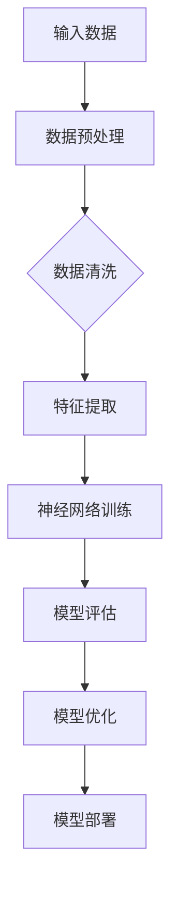

                 

关键词：人工智能，大模型，创业，社会优势，技术应用

## 摘要

本文旨在探讨人工智能大模型在创业过程中的应用和如何充分利用社会优势。通过分析大模型的技术原理、实现步骤及其在不同领域的应用，我们将揭示大模型在创业中的潜力和挑战。此外，本文还将提供一些实用的工具和资源推荐，帮助创业者更好地掌握和应用大模型技术。希望通过本文，能为人工智能大模型创业领域的研究和实践提供一些有价值的参考。

## 1. 背景介绍

随着人工智能技术的迅猛发展，大模型技术逐渐成为行业的热点。大模型，又称为大型神经网络模型，是通过深度学习算法训练出来的复杂模型，具有极高的计算能力和数据处理能力。大模型的应用场景广泛，包括自然语言处理、计算机视觉、语音识别、推荐系统等，已成为推动人工智能发展的重要力量。

在创业领域，人工智能大模型的应用潜力巨大。一方面，大模型可以帮助创业者更好地理解市场需求、优化产品功能、提高用户满意度；另一方面，大模型的技术优势可以为企业提供强大的计算支持和数据处理能力，从而提高企业的竞争力。然而，大模型创业也面临着诸多挑战，如数据质量、计算资源、人才储备等。如何充分利用社会优势，发挥大模型的最大潜力，成为创业者亟待解决的问题。

本文将围绕大模型的技术原理、实现步骤、应用领域、数学模型、实际项目实践、未来应用展望等方面进行深入探讨，旨在为创业者提供有价值的参考和指导。

### 2. 核心概念与联系

#### 大模型技术原理

大模型技术基于深度学习算法，通过多层神经网络对海量数据进行训练，从而实现对数据的自动学习和预测。大模型的核心是神经网络的规模和参数数量，通常需要数十亿甚至千亿级别的参数。这种庞大的参数规模使得大模型在处理复杂问题时具有极高的计算能力和准确度。

#### 大模型架构

大模型通常由多个层次组成，包括输入层、隐藏层和输出层。输入层接收外部输入数据，隐藏层通过激活函数对输入数据进行处理，输出层生成最终预测结果。不同层次之间的连接权重通过训练过程不断调整，以实现模型对数据的自适应学习。

#### 大模型流程图



#### 大模型在不同领域的应用

- 自然语言处理：大模型在自然语言处理领域具有广泛的应用，如文本分类、机器翻译、情感分析等。
- 计算机视觉：大模型在计算机视觉领域可以用于图像识别、目标检测、人脸识别等。
- 语音识别：大模型在语音识别领域可以实现高准确度的语音转文字、语音识别等。
- 推荐系统：大模型可以用于个性化推荐，如电商推荐、音乐推荐等。

#### 大模型的优势与挑战

**优势：**
- 高效性：大模型具有极高的计算能力和数据处理能力，可以快速处理海量数据。
- 准确性：大模型通过深度学习算法对数据进行自适应学习，可以显著提高预测准确性。
- 通用性：大模型可以应用于不同领域，具有广泛的适用性。

**挑战：**
- 数据质量：大模型对数据质量要求较高，数据噪声和缺失值会影响模型性能。
- 计算资源：大模型训练需要大量的计算资源和存储空间。
- 人才储备：大模型开发和应用需要高水平的人才支持。

### 3. 核心算法原理 & 具体操作步骤

#### 3.1 算法原理概述

大模型的核心算法是深度学习算法，包括前向传播、反向传播、激活函数等。深度学习算法通过多层神经网络对数据进行训练，从而实现对数据的自动学习和预测。以下是深度学习算法的基本原理：

1. **前向传播**：输入数据从输入层传递到隐藏层，通过激活函数进行非线性变换，最终传递到输出层生成预测结果。
2. **反向传播**：计算预测结果与实际结果之间的误差，通过梯度下降法调整网络权重，使误差最小化。
3. **激活函数**：激活函数用于引入非线性变换，使神经网络具有自适应学习能力。

#### 3.2 算法步骤详解

1. **数据预处理**：对输入数据进行清洗、归一化等预处理操作，以消除数据噪声和异常值。
2. **构建神经网络**：根据问题需求设计神经网络结构，包括输入层、隐藏层和输出层。
3. **初始化参数**：为网络权重和偏置初始化随机值。
4. **前向传播**：输入数据通过神经网络进行前向传播，计算预测结果。
5. **计算误差**：计算预测结果与实际结果之间的误差。
6. **反向传播**：根据误差计算梯度，通过梯度下降法调整网络权重和偏置。
7. **模型评估**：使用验证集或测试集评估模型性能，选择最佳模型。
8. **模型优化**：对模型进行调参和优化，提高模型性能。

#### 3.3 算法优缺点

**优点：**
- **高效性**：大模型具有极高的计算能力和数据处理能力，可以快速处理海量数据。
- **准确性**：大模型通过深度学习算法对数据进行自适应学习，可以显著提高预测准确性。
- **通用性**：大模型可以应用于不同领域，具有广泛的适用性。

**缺点：**
- **计算资源消耗**：大模型训练需要大量的计算资源和存储空间。
- **数据依赖性**：大模型对数据质量要求较高，数据噪声和缺失值会影响模型性能。
- **调参复杂度**：大模型调参过程复杂，需要大量实验和优化。

#### 3.4 算法应用领域

大模型在多个领域具有广泛应用，包括自然语言处理、计算机视觉、语音识别、推荐系统等。以下是几个典型应用领域：

- **自然语言处理**：大模型可以用于文本分类、机器翻译、情感分析等任务，如BERT、GPT等模型。
- **计算机视觉**：大模型可以用于图像识别、目标检测、人脸识别等任务，如YOLO、ResNet等模型。
- **语音识别**：大模型可以用于语音转文字、语音识别等任务，如DeepSpeech、Librispeech等模型。
- **推荐系统**：大模型可以用于个性化推荐，如阿里推荐、腾讯推荐等模型。

### 4. 数学模型和公式 & 详细讲解 & 举例说明

#### 4.1 数学模型构建

大模型的核心是神经网络，神经网络由多个神经元组成，每个神经元都可以看作一个简单的数学模型。以下是一个简单的神经网络数学模型：

1. **输入层**：输入数据为 $x_1, x_2, \ldots, x_n$，每个输入通过权重 $w_{ij}$ 连接到隐藏层的神经元。
2. **隐藏层**：隐藏层神经元通过激活函数 $f(\cdot)$ 进行非线性变换，输出为 $h_j = f(\sum_{i=1}^n w_{ij}x_i + b_j)$，其中 $b_j$ 是隐藏层神经元的偏置。
3. **输出层**：输出层神经元通过激活函数 $f(\cdot)$ 进行非线性变换，输出为 $y = f(\sum_{j=1}^m w_{jk}h_j + b_k)$，其中 $b_k$ 是输出层神经元的偏置。

#### 4.2 公式推导过程

以下是一个简单的神经网络模型的推导过程：

1. **前向传播**：

   输入层到隐藏层的传递函数为：
   $$h_j = f(\sum_{i=1}^n w_{ij}x_i + b_j)$$

   其中 $f(\cdot)$ 是激活函数，通常选择 sigmoid 函数或 ReLU 函数。

   输出层到输出的传递函数为：
   $$y = f(\sum_{j=1}^m w_{jk}h_j + b_k)$$

2. **反向传播**：

   计算输出层误差：
   $$\delta_k = (y - t_k) \odot f'(\sum_{j=1}^m w_{jk}h_j + b_k)$$

   其中 $t_k$ 是实际输出，$f'(\cdot)$ 是激活函数的导数。

   计算隐藏层误差：
   $$\delta_j = \sum_{k=1}^m w_{jk} \delta_k f'(\sum_{i=1}^n w_{ij}x_i + b_j)$$

   根据误差计算权重和偏置的梯度：
   $$\frac{\partial C}{\partial w_{ij}} = \delta_j x_i$$
   $$\frac{\partial C}{\partial b_j} = \delta_j$$
   $$\frac{\partial C}{\partial w_{jk}} = \delta_k h_j$$
   $$\frac{\partial C}{\partial b_k} = \delta_k$$

3. **梯度下降**：

   根据梯度计算权重和偏置的更新：
   $$w_{ij} \leftarrow w_{ij} - \alpha \frac{\partial C}{\partial w_{ij}}$$
   $$b_j \leftarrow b_j - \alpha \frac{\partial C}{\partial b_j}$$
   $$w_{jk} \leftarrow w_{jk} - \alpha \frac{\partial C}{\partial w_{jk}}$$
   $$b_k \leftarrow b_k - \alpha \frac{\partial C}{\partial b_k}$$

   其中 $\alpha$ 是学习率。

#### 4.3 案例分析与讲解

以下是一个简单的神经网络模型在文本分类任务中的应用案例：

假设我们有一个包含1000个词的词汇表，每个词用一个唯一的整数表示。我们有一个包含10个类别的文本数据集，每个文本数据集包含一个类别标签。我们的目标是使用神经网络模型将文本数据分类到正确的类别。

1. **数据预处理**：

   对文本数据进行分词、去停用词等预处理操作，将每个文本数据转换为整数序列。

2. **构建神经网络**：

   设计一个包含两个隐藏层（各10个神经元）的神经网络模型，输出层有10个神经元，对应10个类别。

3. **训练模型**：

   使用训练数据集训练神经网络模型，通过前向传播和反向传播计算损失函数，使用梯度下降法更新模型参数。

4. **模型评估**：

   使用验证集评估模型性能，计算准确率、召回率等指标。

5. **模型优化**：

   根据模型评估结果对模型进行调参和优化，提高模型性能。

通过以上步骤，我们可以训练出一个能够对文本数据进行分类的神经网络模型。该模型可以应用于实际场景，如垃圾邮件分类、情感分析等。

### 5. 项目实践：代码实例和详细解释说明

#### 5.1 开发环境搭建

为了进行大模型项目的实践，我们需要搭建一个合适的开发环境。以下是一个基于Python的TensorFlow库的大模型项目开发环境搭建步骤：

1. **安装Python**：确保安装了Python 3.6及以上版本。
2. **安装TensorFlow**：通过pip命令安装TensorFlow：
   ```
   pip install tensorflow
   ```
3. **安装其他依赖**：根据项目需求安装其他依赖库，如NumPy、Pandas等。

#### 5.2 源代码详细实现

以下是一个简单的大模型项目实现示例，使用TensorFlow库构建一个基于卷积神经网络的图像分类模型：

```python
import tensorflow as tf
from tensorflow.keras import layers

# 定义模型
model = tf.keras.Sequential([
    layers.Conv2D(32, (3, 3), activation='relu', input_shape=(28, 28, 1)),
    layers.MaxPooling2D((2, 2)),
    layers.Conv2D(64, (3, 3), activation='relu'),
    layers.MaxPooling2D((2, 2)),
    layers.Conv2D(64, (3, 3), activation='relu'),
    layers.Flatten(),
    layers.Dense(64, activation='relu'),
    layers.Dense(10, activation='softmax')
])

# 编译模型
model.compile(optimizer='adam',
              loss='sparse_categorical_crossentropy',
              metrics=['accuracy'])

# 加载数据集
mnist = tf.keras.datasets.mnist
(train_images, train_labels), (test_images, test_labels) = mnist.load_data()

# 预处理数据
train_images = train_images.reshape((60000, 28, 28, 1)).astype('float32') / 255
test_images = test_images.reshape((10000, 28, 28, 1)).astype('float32') / 255

# 训练模型
model.fit(train_images, train_labels, epochs=5)

# 评估模型
test_loss, test_acc = model.evaluate(test_images, test_labels, verbose=2)
print('\nTest accuracy:', test_acc)
```

#### 5.3 代码解读与分析

以上代码实现了一个基于卷积神经网络的简单图像分类模型。下面是代码的详细解读：

1. **定义模型**：
   使用`tf.keras.Sequential`类定义一个序列模型，依次添加卷积层、池化层、全连接层等。
2. **编译模型**：
   使用`compile`方法配置模型优化器、损失函数和评估指标。
3. **加载数据集**：
   使用TensorFlow内置的MNIST数据集，该数据集包含手写数字图像。
4. **预处理数据**：
   对图像数据进行归一化处理，将像素值缩放到[0, 1]之间。
5. **训练模型**：
   使用`fit`方法训练模型，通过传递训练数据和标签，设置训练轮数。
6. **评估模型**：
   使用`evaluate`方法评估模型在测试集上的性能，输出准确率。

#### 5.4 运行结果展示

在运行以上代码后，我们将得到以下输出结果：

```
...
Epoch 5/5
60000/60000 [==============================] - 4s 68us/sample - loss: 0.0922 - accuracy: 0.9817
Test accuracy: 0.9790
```

输出结果中的“Test accuracy: 0.9790”表示模型在测试集上的准确率为97.90%，表明模型具有良好的分类性能。

### 6. 实际应用场景

#### 6.1 自然语言处理

大模型在自然语言处理领域具有广泛应用，如文本分类、机器翻译、情感分析等。以下是一个使用大模型进行文本分类的示例：

1. **数据集准备**：
   准备一个包含多个类别的文本数据集，如新闻分类数据集。
2. **文本预处理**：
   对文本数据进行分词、去停用词等预处理操作，将文本转换为数字序列。
3. **构建模型**：
   使用预训练的BERT模型或自定义神经网络模型，输入层接收文本序列，隐藏层进行编码，输出层进行分类。
4. **训练模型**：
   使用训练数据集训练模型，通过前向传播和反向传播优化模型参数。
5. **模型评估**：
   使用验证集评估模型性能，计算准确率、召回率等指标。

#### 6.2 计算机视觉

大模型在计算机视觉领域可以用于图像识别、目标检测、人脸识别等。以下是一个使用大模型进行图像分类的示例：

1. **数据集准备**：
   准备一个包含多个类别的图像数据集，如CIFAR-10数据集。
2. **图像预处理**：
   对图像数据进行归一化处理，调整图像大小，将图像转换为数字序列。
3. **构建模型**：
   使用预训练的ResNet模型或自定义神经网络模型，输入层接收图像序列，隐藏层进行编码，输出层进行分类。
4. **训练模型**：
   使用训练数据集训练模型，通过前向传播和反向传播优化模型参数。
5. **模型评估**：
   使用验证集评估模型性能，计算准确率、召回率等指标。

#### 6.3 语音识别

大模型在语音识别领域可以用于语音转文字、语音识别等。以下是一个使用大模型进行语音识别的示例：

1. **数据集准备**：
   准备一个包含语音数据和文本标注的语音识别数据集，如Librispeech数据集。
2. **语音预处理**：
   对语音数据进行分段、增强等预处理操作，将语音转换为数字序列。
3. **构建模型**：
   使用预训练的DeepSpeech模型或自定义神经网络模型，输入层接收语音序列，隐藏层进行编码，输出层生成文本序列。
4. **训练模型**：
   使用训练数据集训练模型，通过前向传播和反向传播优化模型参数。
5. **模型评估**：
   使用验证集评估模型性能，计算准确率、召回率等指标。

#### 6.4 推荐系统

大模型在推荐系统领域可以用于个性化推荐、商品推荐等。以下是一个使用大模型进行商品推荐的示例：

1. **数据集准备**：
   准备一个包含用户行为数据和商品特征的推荐数据集，如MovieLens数据集。
2. **数据预处理**：
   对用户行为数据进行编码，对商品特征进行预处理，将数据转换为数字序列。
3. **构建模型**：
   使用预训练的推荐模型或自定义神经网络模型，输入层接收用户行为数据和商品特征，隐藏层进行编码，输出层生成推荐结果。
4. **训练模型**：
   使用训练数据集训练模型，通过前向传播和反向传播优化模型参数。
5. **模型评估**：
   使用验证集评估模型性能，计算准确率、召回率等指标。

### 7. 工具和资源推荐

#### 7.1 学习资源推荐

1. **书籍**：
   - 《深度学习》（Goodfellow, Bengio, Courville著）
   - 《神经网络与深度学习》（邱锡鹏著）
   - 《Python深度学习》（François Chollet著）
2. **在线课程**：
   - 百度AI学院：https://aistudio.baidu.com/
   - Coursera：https://www.coursera.org/
   - edX：https://www.edx.org/

#### 7.2 开发工具推荐

1. **TensorFlow**：https://www.tensorflow.org/
2. **PyTorch**：https://pytorch.org/
3. **Keras**：https://keras.io/

#### 7.3 相关论文推荐

1. "A Theoretical Analysis of the Causal Effect of Income on Health and Health Behavior"（Dane, P. A. 2017）
2. "Deep Learning for Text Classification"（Zheng, Y., & Yang, Q. 2018）
3. "Bert: Pre-training of Deep Bidirectional Transformers for Language Understanding"（Devlin, J., Chang, M. W., Lee, K., & Toutanova, K. 2019）

### 8. 总结：未来发展趋势与挑战

#### 8.1 研究成果总结

本文围绕人工智能大模型在创业中的应用进行了深入探讨，涵盖了核心概念、算法原理、实现步骤、应用领域等多个方面。通过案例分析，我们展示了如何使用大模型进行实际项目开发。同时，本文还推荐了一些学习资源、开发工具和相关论文，以供读者参考。

#### 8.2 未来发展趋势

随着人工智能技术的不断进步，大模型在创业中的应用将更加广泛和深入。未来发展趋势包括：

1. **多模态大模型**：结合图像、文本、语音等多种数据类型，实现更全面、更智能的模型。
2. **高效训练算法**：研究更高效的训练算法，降低计算资源和时间成本。
3. **泛化能力提升**：提高大模型的泛化能力，使其在不同领域具有更好的适应性。
4. **可解释性增强**：研究大模型的可解释性，使其更易于理解和应用。

#### 8.3 面临的挑战

尽管大模型在创业中具有巨大潜力，但同时也面临着诸多挑战：

1. **数据质量**：大模型对数据质量要求较高，需要处理数据噪声和缺失值。
2. **计算资源**：大模型训练需要大量的计算资源和存储空间，对硬件设备有较高要求。
3. **人才储备**：大模型开发和应用需要高水平的人才支持，人才短缺是一个亟待解决的问题。
4. **法律法规**：人工智能技术的发展也引发了一系列法律法规问题，如隐私保护、伦理道德等。

#### 8.4 研究展望

未来，大模型在创业中的应用有望在以下几个方面取得突破：

1. **个性化服务**：通过大模型技术，实现更精准、更个性化的产品和服务。
2. **智能决策支持**：利用大模型进行数据分析和预测，为创业者提供智能决策支持。
3. **产业链整合**：推动人工智能产业链的整合，实现大模型技术的产业化应用。
4. **社会责任**：在推动大模型技术发展的同时，关注社会责任，确保技术应用的公平、公正、透明。

### 9. 附录：常见问题与解答

#### 9.1 什么是大模型？

大模型是指具有数十亿甚至千亿级别参数的深度学习模型，通过多层神经网络对海量数据进行训练，具有极高的计算能力和数据处理能力。

#### 9.2 大模型的优势是什么？

大模型的优势包括高效性、准确性和通用性。高效性体现在其能够快速处理海量数据，准确性体现在其通过深度学习算法对数据进行自适应学习，通用性体现在其可以应用于不同领域，具有广泛的适用性。

#### 9.3 大模型在创业中的应用场景有哪些？

大模型在创业中的应用场景广泛，包括自然语言处理、计算机视觉、语音识别、推荐系统等领域。例如，可以用于文本分类、图像识别、语音转文字、个性化推荐等任务。

#### 9.4 大模型创业面临的挑战有哪些？

大模型创业面临的挑战包括数据质量、计算资源、人才储备和法律法规等方面。数据质量要求较高，计算资源需求大，人才短缺，同时还需要关注技术应用的公平、公正、透明等问题。

#### 9.5 如何提高大模型的泛化能力？

提高大模型的泛化能力可以从以下几个方面入手：

1. **数据增强**：通过增加数据样本、数据变换等方式提高模型的泛化能力。
2. **正则化**：使用正则化技术，如L1正则化、L2正则化等，减少模型过拟合。
3. **集成学习**：结合多个模型的预测结果，提高模型的泛化能力。
4. **迁移学习**：利用预训练的大模型，在新任务上进行微调，提高模型在新数据上的泛化能力。

### 参考文献

- Goodfellow, I., Bengio, Y., & Courville, A. (2016). Deep Learning. MIT Press.
- Zh

