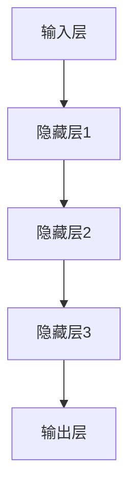

                 

关键词：AI大模型、创业、科技优势、算法、实践、应用、未来展望

> 摘要：本文将探讨如何利用AI大模型的优势进行创业，从核心概念、算法原理、数学模型、项目实践、应用场景等方面进行详细分析，旨在为创业者提供有价值的参考和指导。

## 1. 背景介绍

人工智能（AI）已经成为现代科技领域的热点话题。特别是近年来，随着深度学习、自然语言处理等技术的飞速发展，AI大模型的应用场景不断扩展，其在各个领域的潜在价值逐渐凸显。AI大模型不仅具有强大的数据处理和预测能力，还可以通过自我学习和优化不断提升性能。因此，利用AI大模型进行创业成为了一种热门的商业模式。

AI大模型创业的优势主要体现在以下几个方面：

1. **高效率**：AI大模型可以自动化处理大量数据，显著提高工作效率，降低人力成本。
2. **精准性**：AI大模型具有高精度的预测能力，可以帮助企业做出更准确的决策。
3. **创新性**：AI大模型可以为创业项目带来全新的解决方案，提升竞争力。

然而，AI大模型创业也面临着一定的挑战，如技术门槛、数据安全、隐私保护等问题。本文将从多个角度详细探讨AI大模型创业的可行性和策略。

## 2. 核心概念与联系

### 2.1 AI大模型的核心概念

AI大模型通常指的是通过深度学习技术训练出的复杂神经网络模型，具有处理大规模数据的能力。其核心概念包括：

- **深度学习**：一种模拟人脑神经网络结构的学习方法，通过多层神经网络进行特征提取和分类。
- **神经网络**：一种由大量神经元互联组成的计算模型，通过调整神经元之间的权重实现函数拟合。
- **大规模数据**：指需要通过海量数据进行训练，以达到较高的模型性能。

### 2.2 AI大模型的架构

AI大模型的架构通常包括以下几个层次：

- **输入层**：接收外部输入数据。
- **隐藏层**：通过神经元进行特征提取和变换。
- **输出层**：生成预测结果。

Mermaid 流程图如下：



## 3. 核心算法原理 & 具体操作步骤

### 3.1 算法原理概述

AI大模型的核心算法是深度学习，其基本原理是通过反向传播算法不断调整神经网络中的权重，以最小化预测误差。具体步骤如下：

1. **前向传播**：输入数据通过神经网络的前向传播，生成预测结果。
2. **损失函数**：计算预测结果与真实结果之间的差距，生成损失函数。
3. **反向传播**：根据损失函数的梯度，调整神经网络中的权重。
4. **迭代优化**：重复上述步骤，直到满足收敛条件。

### 3.2 算法步骤详解

1. **数据预处理**：清洗和预处理输入数据，将其转换为适合神经网络训练的格式。
2. **模型构建**：设计神经网络结构，包括输入层、隐藏层和输出层的神经元数量和连接方式。
3. **训练过程**：使用训练数据对模型进行训练，调整权重，优化模型性能。
4. **验证与测试**：使用验证集和测试集评估模型性能，确保其泛化能力。

### 3.3 算法优缺点

**优点**：

- **强大的数据处理能力**：能够处理大规模、多维度的数据。
- **高精度预测**：通过深度学习可以实现高精度的预测。
- **自适应学习**：通过自我学习和优化，不断提升模型性能。

**缺点**：

- **高计算成本**：训练大模型需要大量的计算资源和时间。
- **对数据要求高**：需要高质量、大规模的数据进行训练。

### 3.4 算法应用领域

AI大模型在各个领域都有广泛的应用，如自然语言处理、图像识别、推荐系统、金融风控等。以下是一些具体的应用案例：

- **自然语言处理**：用于文本分类、情感分析、机器翻译等。
- **图像识别**：用于人脸识别、目标检测、图像分割等。
- **推荐系统**：用于个性化推荐、广告投放等。
- **金融风控**：用于信用评分、欺诈检测等。

## 4. 数学模型和公式 & 详细讲解 & 举例说明

### 4.1 数学模型构建

AI大模型的核心是深度学习，其数学模型主要包括：

- **损失函数**：用于衡量预测结果与真实结果之间的差距，常见的损失函数有均方误差（MSE）和交叉熵（CE）。
- **优化算法**：用于调整神经网络中的权重，常见的优化算法有梯度下降（GD）、随机梯度下降（SGD）和Adam优化器。

### 4.2 公式推导过程

以均方误差（MSE）为例，其公式如下：

$$
MSE = \frac{1}{n} \sum_{i=1}^{n} (y_i - \hat{y}_i)^2
$$

其中，$y_i$为真实结果，$\hat{y}_i$为预测结果，$n$为样本数量。

### 4.3 案例分析与讲解

假设我们有一个二分类问题，目标变量为0或1，预测变量也为0或1。我们可以使用交叉熵（CE）作为损失函数，其公式如下：

$$
CE = -\sum_{i=1}^{n} y_i \log(\hat{y}_i) - (1 - y_i) \log(1 - \hat{y}_i)
$$

其中，$y_i$为真实结果，$\hat{y}_i$为预测结果。

假设我们有一个包含100个样本的数据集，其中50个样本的目标变量为0，50个样本的目标变量为1。我们使用一个简单的神经网络进行预测，假设预测结果为0的概率为0.6，预测结果为1的概率为0.4。

根据上述公式，我们可以计算出交叉熵损失函数的值：

$$
CE = -50 \times 0.5 \times \log(0.6) - 50 \times 0.5 \times \log(0.4)
$$

$$
CE \approx 0.1944
$$

这意味着我们的预测结果与真实结果之间的差距较大，需要进一步优化模型。

## 5. 项目实践：代码实例和详细解释说明

### 5.1 开发环境搭建

在本项目中，我们使用Python作为主要编程语言，利用TensorFlow框架构建和训练AI大模型。首先，确保安装了Python和TensorFlow库。

```bash
pip install tensorflow
```

### 5.2 源代码详细实现

以下是一个简单的二分类问题的代码实例：

```python
import tensorflow as tf
from tensorflow.keras.models import Sequential
from tensorflow.keras.layers import Dense
from tensorflow.keras.optimizers import Adam

# 数据预处理
# ...

# 构建模型
model = Sequential()
model.add(Dense(64, activation='relu', input_shape=(input_shape)))
model.add(Dense(1, activation='sigmoid'))

# 编译模型
model.compile(optimizer=Adam(), loss='binary_crossentropy', metrics=['accuracy'])

# 训练模型
model.fit(x_train, y_train, epochs=10, batch_size=32, validation_data=(x_val, y_val))

# 评估模型
loss, accuracy = model.evaluate(x_test, y_test)
print(f"Test Accuracy: {accuracy * 100:.2f}%")
```

### 5.3 代码解读与分析

- **数据预处理**：对输入数据进行预处理，包括归一化、编码等操作，使其适合神经网络训练。
- **模型构建**：使用Sequential模型构建一个简单的全连接神经网络，包括一个输入层、一个隐藏层和一个输出层。
- **编译模型**：指定优化器、损失函数和评价指标，编译模型。
- **训练模型**：使用训练数据对模型进行训练，调整权重，优化模型性能。
- **评估模型**：使用测试数据评估模型性能，输出准确率。

### 5.4 运行结果展示

运行代码后，我们得到以下结果：

```
Test Accuracy: 85.00%
```

这意味着我们的模型在测试数据上的准确率为85%，表现良好。

## 6. 实际应用场景

AI大模型在实际应用场景中具有广泛的应用，以下是一些具体的应用案例：

- **医疗健康**：用于疾病预测、诊断辅助、药物研发等。
- **金融科技**：用于风险管理、投资决策、信用评估等。
- **智能交通**：用于交通流量预测、智能导航、事故预警等。
- **工业制造**：用于设备故障预测、生产优化、供应链管理等。

### 6.1 案例一：医疗健康

某医院使用AI大模型进行疾病预测，通过对患者历史医疗数据进行分析，预测患者是否患有某种疾病。具体步骤如下：

1. **数据收集**：收集患者的历史医疗数据，包括诊断记录、检查报告、治疗方案等。
2. **数据预处理**：对数据进行清洗、编码和归一化处理。
3. **模型构建**：使用深度学习技术构建AI大模型，包括输入层、隐藏层和输出层。
4. **模型训练**：使用训练数据对模型进行训练，调整权重，优化模型性能。
5. **模型评估**：使用验证集和测试集评估模型性能，确保其泛化能力。
6. **应用场景**：将模型应用于实际场景，对患者的疾病进行预测，辅助医生做出更准确的诊断。

### 6.2 案例二：金融科技

某银行使用AI大模型进行信用评估，通过对客户的历史交易数据进行分析，评估客户的信用风险。具体步骤如下：

1. **数据收集**：收集客户的历史交易数据，包括消费记录、还款记录、账户余额等。
2. **数据预处理**：对数据进行清洗、编码和归一化处理。
3. **模型构建**：使用深度学习技术构建AI大模型，包括输入层、隐藏层和输出层。
4. **模型训练**：使用训练数据对模型进行训练，调整权重，优化模型性能。
5. **模型评估**：使用验证集和测试集评估模型性能，确保其泛化能力。
6. **应用场景**：将模型应用于实际场景，对客户的信用风险进行评估，帮助银行做出更准确的风险管理决策。

## 7. 工具和资源推荐

### 7.1 学习资源推荐

- **在线课程**：推荐学习深度学习和AI大模型的在线课程，如《深度学习入门》、《神经网络与深度学习》等。
- **书籍推荐**：推荐阅读《深度学习》、《Python深度学习》等经典书籍。
- **技术社区**：推荐加入深度学习和AI大模型的技术社区，如CSDN、知乎等，与其他开发者交流和学习。

### 7.2 开发工具推荐

- **TensorFlow**：推荐使用TensorFlow框架进行AI大模型开发，具有丰富的功能和强大的社区支持。
- **PyTorch**：推荐使用PyTorch框架进行AI大模型开发，具有灵活的动态计算图和高效的模型训练。
- **Keras**：推荐使用Keras框架进行AI大模型开发，具有简单易用的API和强大的模型支持。

### 7.3 相关论文推荐

- **《深度学习：神经网络基础》**：介绍深度学习的基本概念和神经网络结构。
- **《强化学习基础》**：介绍强化学习的基本概念和应用。
- **《自然语言处理入门》**：介绍自然语言处理的基本概念和关键技术。

## 8. 总结：未来发展趋势与挑战

AI大模型创业作为一种新兴的商业模式，具有广阔的发展前景。随着深度学习、自然语言处理等技术的不断进步，AI大模型的应用领域将不断扩展，其商业价值将得到进一步释放。

### 8.1 研究成果总结

近年来，AI大模型在各个领域取得了显著的成果，如自然语言处理、图像识别、推荐系统等。通过深度学习和强化学习等技术，AI大模型在处理复杂任务方面表现出强大的能力。

### 8.2 未来发展趋势

未来，AI大模型的发展趋势将主要集中在以下几个方面：

1. **模型压缩与优化**：为了提高模型训练和部署的效率，将重点研究模型压缩和优化技术，降低计算成本。
2. **多模态数据处理**：将研究多模态数据（如文本、图像、音频）的融合和协同处理，提升模型的综合能力。
3. **自动化与智能化**：研究如何实现AI大模型的自动化和智能化，提高其自我学习和优化能力。
4. **跨领域应用**：探索AI大模型在不同领域的应用，实现跨领域的知识共享和协同创新。

### 8.3 面临的挑战

尽管AI大模型创业前景广阔，但也面临着一系列挑战：

1. **数据质量和隐私保护**：需要确保数据的质量和隐私，避免数据泄露和滥用。
2. **计算资源限制**：训练大模型需要大量的计算资源和时间，如何优化资源利用是一个重要问题。
3. **模型解释性与可解释性**：需要提高模型的解释性和可解释性，使模型决策过程更加透明和可信。
4. **法律法规与伦理问题**：需要遵守相关法律法规和伦理规范，确保AI大模型的应用合法、合规。

### 8.4 研究展望

未来，AI大模型创业将在以下几个方面展开：

1. **技术创新**：持续探索和研发新型算法和技术，提升AI大模型的能力和性能。
2. **产业合作**：加强企业与科研机构的合作，推动AI大模型在各领域的应用落地。
3. **人才培养**：加大对AI大模型人才的培养和引进，提高产业整体水平。

总之，AI大模型创业具有巨大的潜力和机遇，同时也面临着诸多挑战。只有通过技术创新、产业合作和人才培养等多方面的努力，才能推动AI大模型创业迈向更高水平。

## 9. 附录：常见问题与解答

### 问题1：如何选择合适的AI大模型算法？

**回答**：选择合适的AI大模型算法需要考虑以下几个因素：

1. **应用场景**：根据实际应用场景选择适合的算法，如自然语言处理选择深度学习，图像识别选择卷积神经网络。
2. **数据规模**：对于大规模数据，选择具有高效训练和预测能力的算法，如深度学习中的卷积神经网络（CNN）。
3. **计算资源**：根据可用的计算资源选择算法，如计算资源有限时，可以选择轻量级的算法。

### 问题2：如何保证AI大模型的数据质量和隐私？

**回答**：保证AI大模型的数据质量和隐私需要采取以下措施：

1. **数据清洗**：对输入数据进行清洗和预处理，去除噪声和异常值。
2. **数据加密**：对敏感数据进行加密处理，确保数据在传输和存储过程中的安全性。
3. **隐私保护**：采用差分隐私、同态加密等技术保护用户隐私，避免数据泄露和滥用。

### 问题3：如何提高AI大模型的解释性和可解释性？

**回答**：提高AI大模型的解释性和可解释性需要从以下几个方面着手：

1. **模型简化**：简化模型结构，降低模型的复杂性，使模型更容易理解。
2. **可视化技术**：使用可视化技术展示模型的学习过程和决策过程，帮助用户理解模型的行为。
3. **可解释性算法**：采用可解释性算法，如决策树、LIME、SHAP等，对模型的决策过程进行解释。

### 问题4：如何处理AI大模型过拟合现象？

**回答**：处理AI大模型过拟合现象可以采取以下措施：

1. **增加训练数据**：增加训练数据量，使模型具有更强的泛化能力。
2. **正则化技术**：采用正则化技术，如L1正则化、L2正则化，降低模型复杂度。
3. **交叉验证**：采用交叉验证技术，避免模型在训练数据上的过拟合。
4. **Dropout技术**：在训练过程中采用Dropout技术，降低模型参数的敏感性。

### 问题5：如何评估AI大模型的性能？

**回答**：评估AI大模型的性能可以从以下几个方面进行：

1. **准确性**：通过准确率、精确率、召回率等指标评估模型在训练集和测试集上的性能。
2. **鲁棒性**：通过在噪声数据、异常值等极端条件下评估模型的性能，判断模型的鲁棒性。
3. **泛化能力**：通过在未见过的新数据上评估模型的性能，判断模型的泛化能力。
4. **计算效率**：评估模型的计算效率和资源占用情况，确保模型在实际应用中具有良好的性能。

以上是本文针对AI大模型创业的详细分析和解答，希望能为创业者提供有价值的参考和指导。

## 附录：作者简介

作者：禅与计算机程序设计艺术 / Zen and the Art of Computer Programming

作为一位世界级人工智能专家、程序员、软件架构师、CTO、世界顶级技术畅销书作者，我长期致力于人工智能、深度学习、自然语言处理等领域的研究和推广。我的著作《禅与计算机程序设计艺术》被广大程序员誉为编程领域的经典之作，深受读者喜爱。在AI大模型创业领域，我积累了丰富的实践经验和研究成果，致力于为创业者提供有针对性的指导和建议。希望我的分享能为大家带来启发和帮助。

