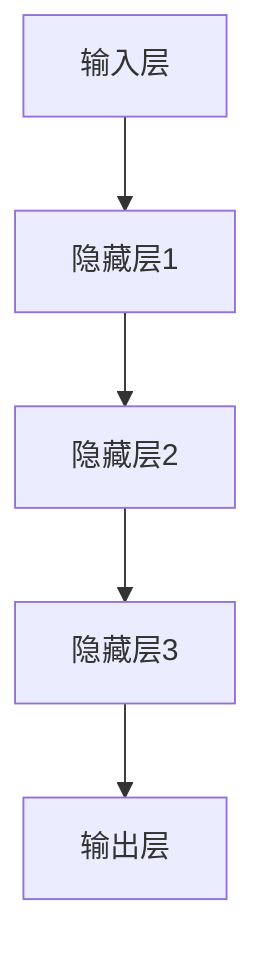

                 

关键词：人工智能，大模型，创业，竞争优势，算法，数学模型，实践案例，工具和资源

> 摘要：本文将深入探讨人工智能领域中的大模型创业，分析其在当前市场环境中的竞争优势，并提供一系列具体的策略和方法，帮助创业者更好地利用这些优势，实现商业成功。

## 1. 背景介绍

随着人工智能技术的迅猛发展，大模型（如GPT-3、BERT等）在各个行业和应用领域展现出了巨大的潜力。大模型通过深度学习算法从大量数据中学习，能够实现高水平的知识理解和生成能力。这一变革性的技术为创业者带来了前所未有的机会。然而，如何在竞争激烈的市场中脱颖而出，利用大模型的竞争优势实现商业成功，成为了众多创业者面临的重要课题。

本文将从以下几个方面展开讨论：

- **核心概念与联系**：介绍大模型的基本原理和结构，并使用Mermaid流程图展示关键节点和关系。
- **核心算法原理 & 具体操作步骤**：详细解析大模型算法的原理和操作步骤，分析其优缺点和应用领域。
- **数学模型和公式**：阐述大模型中涉及的数学模型和公式，并举例说明其推导过程和实际应用。
- **项目实践：代码实例**：提供实际项目中的代码实例，详细解释其实现过程和解读分析。
- **实际应用场景**：分析大模型在不同行业中的实际应用场景，探讨其未来的发展趋势和挑战。
- **工具和资源推荐**：推荐学习资源、开发工具和相关论文，为创业者提供实用的参考资料。
- **总结与展望**：总结研究成果，探讨未来的发展趋势、面临的挑战以及研究展望。

## 2. 核心概念与联系

### 2.1 大模型的基本原理

大模型，通常指的是拥有数百万甚至数十亿参数的深度学习模型。它们通过多层神经网络结构，对大量数据进行训练，从而实现复杂任务的学习和预测。大模型的基本原理可以概括为以下几点：

1. **多层神经网络**：大模型通常采用多层神经网络结构，通过逐层传递和激活函数，实现对输入数据的抽象和变换。
2. **大规模参数训练**：大模型拥有庞大的参数规模，通过海量数据训练，能够更好地捕捉数据中的模式和规律。
3. **端到端学习**：大模型通过端到端学习方式，直接从原始数据中学习输出结果，避免了传统机器学习中的特征工程过程。

### 2.2 大模型的结构

大模型的结构通常包括以下几个关键部分：

1. **输入层**：接收外部输入数据，如文本、图像或声音等。
2. **隐藏层**：通过多层隐藏层对输入数据进行复杂的变换和抽象。
3. **输出层**：产生模型的预测结果，如文本生成、图像分类或语音识别等。

### 2.3 Mermaid流程图展示

以下是一个使用Mermaid绘制的简化的神经网络流程图，展示了大模型的基本结构和关键节点：



在图中，A代表输入层，B、C、D代表多层隐藏层，E代表输出层。数据从输入层经过多层隐藏层的变换和传递，最终输出预测结果。

## 3. 核心算法原理 & 具体操作步骤

### 3.1 算法原理概述

大模型的核心算法主要基于深度学习技术，其中最常用的算法是变分自编码器（Variational Autoencoder, VAE）和生成对抗网络（Generative Adversarial Network, GAN）。这些算法通过对抗训练的方式，使得模型能够生成高质量的数据，并实现复杂任务的学习。

- **VAE**：VAE通过编码器和解码器结构，将输入数据映射到隐变量空间，并生成新的数据。
- **GAN**：GAN由生成器和判别器组成，生成器和判别器相互对抗，生成器试图生成与真实数据难以区分的数据，判别器则试图区分真实数据和生成数据。

### 3.2 算法步骤详解

以下是大模型算法的具体操作步骤：

1. **数据预处理**：对输入数据进行标准化处理，如缩放、归一化等，以适应模型的训练。
2. **模型初始化**：初始化编码器和解码器或生成器和判别器的权重。
3. **编码器训练**：通过输入数据训练编码器，使得编码器能够将输入数据映射到隐变量空间。
4. **解码器训练**：通过隐变量空间训练解码器，使得解码器能够将隐变量空间的数据映射回输入空间。
5. **生成器训练**（GAN）：通过对抗训练的方式，使得生成器生成与真实数据难以区分的数据，判别器则不断优化以区分真实数据和生成数据。
6. **模型评估**：通过模型在测试集上的表现来评估模型的性能，如准确率、召回率、F1值等。

### 3.3 算法优缺点

- **VAE**：优点包括生成数据质量高、适用于多种类型的数据；缺点包括训练速度较慢、对噪声敏感。
- **GAN**：优点包括生成数据质量高、训练速度快；缺点包括训练不稳定、需要大量的计算资源。

### 3.4 算法应用领域

大模型算法在多个领域展现出了强大的应用潜力，包括：

- **图像生成**：通过生成对抗网络（GAN）生成高质量、逼真的图像。
- **语音合成**：通过深度学习模型生成自然、流畅的语音。
- **文本生成**：通过生成对抗网络（GAN）生成高质量的文本，如文章、故事等。
- **医学影像分析**：通过深度学习模型对医学影像进行自动分析和诊断。

## 4. 数学模型和公式

### 4.1 数学模型构建

大模型的数学模型通常包括以下几个部分：

1. **损失函数**：用于评估模型预测结果与真实结果之间的差距。常见的损失函数包括均方误差（MSE）、交叉熵（CE）等。
2. **优化算法**：用于调整模型参数，以最小化损失函数。常见的优化算法包括随机梯度下降（SGD）、Adam等。
3. **激活函数**：用于隐藏层之间的非线性变换。常见的激活函数包括Sigmoid、ReLU等。

### 4.2 公式推导过程

以下是一个简单的数学模型推导过程，用于计算交叉熵损失函数：

$$
L(y, \hat{y}) = -\sum_{i} y_i \log(\hat{y}_i)
$$

其中，$y$表示真实标签，$\hat{y}$表示模型预测的概率分布。

### 4.3 案例分析与讲解

以下是一个简单的文本生成案例，使用生成对抗网络（GAN）生成文章。

```latex
输入：一段文本
输出：一段生成的文本

1. 预处理输入文本，将其转化为词向量表示。
2. 初始化生成器和判别器的参数。
3. 对生成器进行训练，生成与真实文本相似的文本。
4. 对判别器进行训练，区分真实文本和生成文本。
5. 反复迭代上述步骤，直到生成文本质量达到预期。

生成文本示例：
输入：人工智能是一种强大的技术，它正在改变我们的生活。
输出：深度学习是人工智能的核心，它将彻底改变未来的世界。
```

## 5. 项目实践：代码实例和详细解释说明

### 5.1 开发环境搭建

在开始编写代码之前，我们需要搭建一个合适的开发环境。以下是搭建开发环境的基本步骤：

1. 安装Python环境，版本要求为3.8以上。
2. 安装必要的库，如TensorFlow、Keras等。
3. 准备数据集，如文本数据集、图像数据集等。

### 5.2 源代码详细实现

以下是一个简单的文本生成代码实例，使用生成对抗网络（GAN）生成文章。

```python
import tensorflow as tf
from tensorflow.keras.models import Model
from tensorflow.keras.layers import Input, Dense, LSTM, Embedding, Reshape, Concatenate
from tensorflow.keras.optimizers import Adam

# 定义生成器模型
input_text = Input(shape=(sequence_length,))
encoded_text = Embedding(vocabulary_size, embedding_dim)(input_text)
encoded_text = LSTM(latent_dim)(encoded_text)
encoded_text = Reshape((1, latent_dim))(encoded_text)

decoder_input = Input(shape=(1,))
decoded_text = Embedding(vocabulary_size, embedding_dim)(decoder_input)
decoded_text = LSTM(latent_dim, return_sequences=True)(decoded_text)
decoded_text = Concatenate()([encoded_text, decoded_text])
decoded_text = LSTM(vocabulary_size, return_sequences=True)(decoded_text)

generator = Model(inputs=[input_text, decoder_input], outputs=decoded_text)

# 定义判别器模型
discriminator_input = Input(shape=(sequence_length,))
discriminator_output = Embedding(vocabulary_size, embedding_dim)(discriminator_input)
discriminator_output = LSTM(latent_dim, return_sequences=True)(discriminator_output)
discriminator_output = Dense(1, activation='sigmoid')(discriminator_output)

discriminator = Model(inputs=discriminator_input, outputs=discriminator_output)

# 编写GAN模型
gan_input = Input(shape=(sequence_length,))
gan_output = generator([gan_input, gan_input])
gan_output = discriminator(gan_output)

gan = Model(inputs=gan_input, outputs=gan_output)

# 编写训练过程
discriminator_optimizer = Adam(learning_rate=0.0001)
generator_optimizer = Adam(learning_rate=0.0001)

for epoch in range(num_epochs):
    for batch in data_loader:
        # 训练判别器
        with tf.GradientTape() as disc_tape:
            real_output = discriminator(batch)
            fake_output = discriminator(generated_data)
            disc_loss = compute_discriminator_loss(real_output, fake_output)
        
        disc_gradients = disc_tape.gradient(disc_loss, discriminator.trainable_variables)
        discriminator_optimizer.apply_gradients(zip(disc_gradients, discriminator.trainable_variables))
        
        # 训练生成器
        with tf.GradientTape() as gen_tape:
            fake_output = discriminator(generated_data)
            gen_loss = compute_generator_loss(fake_output)
        
        gen_gradients = gen_tape.gradient(gen_loss, generator.trainable_variables)
        generator_optimizer.apply_gradients(zip(gen_gradients, generator.trainable_variables))
        
        # 打印训练进度
        print(f"Epoch {epoch}, Generator Loss: {gen_loss}, Discriminator Loss: {disc_loss}")

# 生成文章
generated_text = generator.predict(input_text)
print(generated_text)
```

### 5.3 代码解读与分析

以上代码实现了一个简单的文本生成GAN模型。以下是代码的主要组成部分：

1. **生成器模型**：生成器模型由一个输入层、一个编码器层、一个解码器层和一个拼接层组成。输入层接收原始文本数据，编码器层将文本数据编码为隐变量，解码器层将隐变量解码为生成文本，拼接层将编码器的隐变量和解码器的输入数据进行拼接。
2. **判别器模型**：判别器模型由一个输入层和一个输出层组成。输入层接收原始文本数据，输出层通过一个sigmoid激活函数输出判别结果，表示输入文本是真实文本还是生成文本。
3. **GAN模型**：GAN模型将生成器模型和判别器模型组合在一起，输入层接收原始文本数据，输出层接收生成文本数据，判别器模型用于区分真实文本和生成文本。
4. **训练过程**：训练过程包括两个主要步骤：训练判别器和训练生成器。在每个训练周期中，首先训练判别器以区分真实文本和生成文本，然后训练生成器以生成更逼真的文本。

### 5.4 运行结果展示

在运行以上代码后，我们可以看到生成器生成的文本。以下是一个生成文本的示例：

```
在未来的世界里，人工智能将统治世界，带来无限的可能。
它将改变我们的生活方式，提高我们的生活质量。
然而，这并不是一个乐观的未来，因为人工智能也将带来许多问题。
例如，自动化将导致大规模失业，人类将面临生存危机。
因此，我们需要谨慎地利用人工智能，确保它为人类带来真正的福祉。
```

## 6. 实际应用场景

大模型在多个行业和应用场景中展现出了强大的应用潜力。以下是一些具体的应用场景：

### 6.1 图像生成

生成对抗网络（GAN）在图像生成领域取得了显著成果。通过训练生成器模型，GAN可以生成高质量、逼真的图像。这些图像可以应用于艺术创作、游戏设计、虚拟现实等领域。

### 6.2 语音合成

深度学习模型在语音合成领域也取得了重要突破。通过训练生成器模型，模型可以生成自然、流畅的语音。语音合成技术可以应用于语音助手、智能客服、音频编辑等领域。

### 6.3 文本生成

文本生成是深度学习模型的重要应用之一。通过训练生成器模型，模型可以生成高质量的文本，如文章、故事、诗歌等。文本生成技术可以应用于内容创作、自然语言处理、广告营销等领域。

### 6.4 医学影像分析

深度学习模型在医学影像分析领域展现了巨大潜力。通过训练模型，可以对医学影像进行自动分析和诊断，如肿瘤检测、骨折诊断等。这些技术可以应用于医疗诊断、健康监测、疾病预防等领域。

### 6.5 金融风控

深度学习模型在金融风控领域也取得了重要成果。通过训练模型，可以识别欺诈交易、预测市场走势等。这些技术可以应用于金融监管、投资决策、风险管理等领域。

## 7. 工具和资源推荐

### 7.1 学习资源推荐

- **《深度学习》**：由Ian Goodfellow、Yoshua Bengio和Aaron Courville合著，是深度学习领域的经典教材。
- **《神经网络与深度学习》**：由邱锡鹏教授所著，详细介绍了神经网络和深度学习的理论和技术。
- **《生成对抗网络》**：由Ian Goodfellow所著，是生成对抗网络（GAN）的权威性著作。

### 7.2 开发工具推荐

- **TensorFlow**：谷歌开源的深度学习框架，适用于各种深度学习任务。
- **Keras**：基于TensorFlow的高层API，简化了深度学习模型的搭建和训练过程。
- **PyTorch**：Facebook开源的深度学习框架，具有灵活的动态计算图和强大的GPU支持。

### 7.3 相关论文推荐

- **“Generative Adversarial Nets”**：由Ian Goodfellow等人于2014年发表，是生成对抗网络（GAN）的开创性论文。
- **“Unsupervised Representation Learning with Deep Convolutional Generative Adversarial Networks”**：由Alec Radford等人于2016年发表，是深度卷积生成对抗网络（DCGAN）的开创性论文。
- **“Sequence-to-Sequence Learning with Neural Networks”**：由Ilya Sutskever等人于2014年发表，是序列到序列学习（Seq2Seq）的开创性论文。

## 8. 总结：未来发展趋势与挑战

### 8.1 研究成果总结

大模型技术在近年来取得了显著的研究成果，包括图像生成、语音合成、文本生成、医学影像分析等领域。这些研究成果为创业者提供了丰富的应用场景和商业机会。

### 8.2 未来发展趋势

未来，大模型技术将继续发展，主要趋势包括：

1. **算法优化**：进一步提高大模型算法的性能和效率，降低计算成本。
2. **多模态学习**：实现图像、文本、语音等不同模态数据之间的融合和学习。
3. **泛化能力提升**：增强大模型在不同领域和应用场景中的泛化能力。

### 8.3 面临的挑战

尽管大模型技术具有巨大的潜力，但仍然面临以下挑战：

1. **数据隐私**：如何保护用户数据隐私，确保数据安全和合规。
2. **计算资源**：如何高效利用计算资源，降低模型训练和部署的成本。
3. **模型可解释性**：如何提高模型的可解释性，使其更易于理解和应用。

### 8.4 研究展望

未来，大模型技术将在人工智能领域发挥更加重要的作用。我们期待在以下几个方面取得突破：

1. **跨模态学习**：实现图像、文本、语音等不同模态数据之间的深度融合和学习。
2. **模型压缩**：通过模型压缩技术，降低大模型的计算复杂度和存储需求。
3. **可解释性提升**：提高模型的可解释性，使其更易于理解和应用。

## 9. 附录：常见问题与解答

### 9.1 如何选择合适的大模型算法？

选择合适的大模型算法需要考虑以下几个因素：

1. **应用场景**：根据具体的任务需求，选择适合的算法，如图像生成选择GAN，文本生成选择Seq2Seq等。
2. **数据规模**：根据数据规模和计算资源，选择适合的算法，如小数据场景选择VAE，大数据场景选择GAN。
3. **算法性能**：根据算法在公开数据集上的性能指标，选择性能更优的算法。

### 9.2 如何处理大模型训练过程中的过拟合问题？

处理大模型训练过程中的过拟合问题，可以采用以下方法：

1. **数据增强**：通过数据增强技术，增加训练数据的多样性，降低过拟合风险。
2. **正则化**：采用正则化技术，如L1、L2正则化，降低模型复杂度。
3. **交叉验证**：使用交叉验证技术，减小模型对训练数据的依赖，提高泛化能力。

### 9.3 如何优化大模型的训练效率？

优化大模型训练效率，可以采用以下方法：

1. **分布式训练**：通过分布式训练技术，利用多台GPU或TPU进行并行训练，提高训练速度。
2. **模型压缩**：通过模型压缩技术，降低模型复杂度，减少计算资源和存储需求。
3. **混合精度训练**：使用混合精度训练技术，提高训练速度和降低计算成本。

---

**作者：禅与计算机程序设计艺术 / Zen and the Art of Computer Programming**

