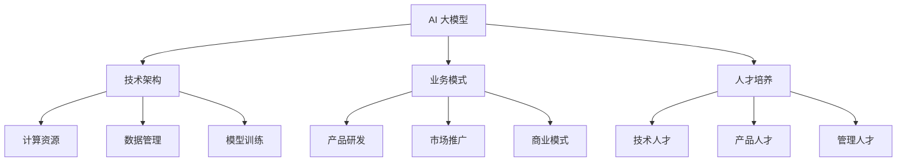

                 

关键词：AI 大模型、创业、管理优势、技术架构、业务模式、人才培养

> 摘要：本文将探讨 AI 大模型创业过程中如何利用管理优势，从技术架构、业务模式、人才培养等方面入手，解析创业公司在激烈的市场竞争中如何脱颖而出。

## 1. 背景介绍

随着人工智能技术的飞速发展，AI 大模型在各个行业中的应用越来越广泛，从自然语言处理、计算机视觉到推荐系统等，都取得了显著的成果。这也催生了大量的 AI 大模型创业公司，它们希望通过创新的技术和应用场景，在激烈的市场竞争中占据一席之地。

然而，AI 大模型创业并非易事。首先，技术门槛高，需要团队具备深厚的技术背景；其次，市场环境复杂，需要敏锐的洞察力和快速响应能力；最后，资源有限，需要高效的管理和运营。

本文将从管理优势的角度，探讨 AI 大模型创业公司如何在技术、业务和人才方面取得优势，从而实现可持续的发展。

## 2. 核心概念与联系

### 2.1. AI 大模型

AI 大模型是指具有大规模参数的神经网络模型，通过大量数据训练，可以模拟人类的学习、推理和决策能力。常见的 AI 大模型有 GPT、BERT、ViT 等。

### 2.2. 技术架构

AI 大模型创业公司的技术架构主要包括计算资源、数据管理和模型训练。计算资源方面，需要具备强大的计算能力，支持并行计算和分布式训练；数据管理方面，需要高效的数据处理和存储机制，保证数据的质量和可扩展性；模型训练方面，需要优化训练流程，提高模型的效果和效率。

### 2.3. 业务模式

AI 大模型创业公司的业务模式包括产品研发、市场推广、商业模式设计等。产品研发方面，需要聚焦行业痛点，提供创新的应用方案；市场推广方面，需要通过多种渠道宣传品牌和产品，提高知名度；商业模式设计方面，需要结合市场需求和资源条件，制定可持续的盈利模式。

### 2.4. 人才培养

AI 大模型创业公司的人才培养主要包括技术人才、产品人才和管理人才。技术人才方面，需要具备深厚的专业知识，能够解决复杂的技术问题；产品人才方面，需要具备用户思维，能够设计出符合市场需求的优质产品；管理人才方面，需要具备领导力、沟通协调能力和决策能力，能够带领团队实现目标。

### 2.5. Mermaid 流程图



## 3. 核心算法原理 & 具体操作步骤

### 3.1. 算法原理概述

AI 大模型的算法原理基于深度学习，通过多层神经网络结构对数据进行学习和预测。具体包括以下几个步骤：

1. 数据预处理：对原始数据进行清洗、归一化等处理，使其适合模型训练。
2. 模型设计：设计合适的神经网络结构，包括层数、每层的神经元数量、激活函数等。
3. 模型训练：通过大量数据对模型进行训练，优化模型参数。
4. 模型评估：使用验证集评估模型的效果，调整模型参数。
5. 模型部署：将训练好的模型部署到实际应用场景中。

### 3.2. 算法步骤详解

1. 数据预处理

```python
# 数据清洗
df = pd.read_csv('data.csv')
df = df.dropna()

# 数据归一化
scaler = StandardScaler()
df = scaler.fit_transform(df)
```

2. 模型设计

```python
import tensorflow as tf

model = tf.keras.Sequential([
    tf.keras.layers.Dense(128, activation='relu', input_shape=(num_features,)),
    tf.keras.layers.Dense(64, activation='relu'),
    tf.keras.layers.Dense(1, activation='sigmoid')
])
```

3. 模型训练

```python
model.compile(optimizer='adam', loss='binary_crossentropy', metrics=['accuracy'])

model.fit(x_train, y_train, epochs=10, batch_size=32, validation_data=(x_val, y_val))
```

4. 模型评估

```python
loss, accuracy = model.evaluate(x_test, y_test)
print('Test accuracy:', accuracy)
```

5. 模型部署

```python
model.save('model.h5')
```

### 3.3. 算法优缺点

**优点：**
1. 强大的学习能力：AI 大模型可以处理大量数据，提取出有用的信息。
2. 高效的预测能力：通过训练，模型可以快速做出预测。
3. 自动化：深度学习算法可以自动调整参数，提高模型的性能。

**缺点：**
1. 计算资源消耗大：训练 AI 大模型需要大量的计算资源和时间。
2. 需要大量的数据：模型的效果很大程度上取决于训练数据的数量和质量。
3. 难以解释：深度学习模型的决策过程很难解释，增加了模型的不透明性。

### 3.4. 算法应用领域

AI 大模型在各个领域都有广泛的应用，包括但不限于：

1. 自然语言处理：文本分类、机器翻译、情感分析等。
2. 计算机视觉：图像分类、目标检测、图像生成等。
3. 推荐系统：基于用户行为和兴趣推荐商品、新闻等。
4. 语音识别：将语音信号转换为文字。
5. 医疗诊断：辅助医生进行疾病诊断和治疗。

## 4. 数学模型和公式 & 详细讲解 & 举例说明

### 4.1. 数学模型构建

AI 大模型的数学模型主要基于多层感知机（MLP）和卷积神经网络（CNN）。以下是一个简单的多层感知机模型：

$$
y = \sigma(\text{W}_2 \cdot \text{a}_1 + \text{b}_2)
$$

其中，$\sigma$ 表示激活函数，$\text{W}_2$ 和 $\text{b}_2$ 分别是第二层的权重和偏置。

### 4.2. 公式推导过程

多层感知机的推导过程基于以下步骤：

1. 输入层到隐藏层的传播：

$$
\text{a}_1 = \text{X} \cdot \text{W}_1 + \text{b}_1
$$

$$
\text{a}_1' = \sigma(\text{a}_1)
$$

2. 隐藏层到输出层的传播：

$$
\text{a}_2 = \text{a}_1' \cdot \text{W}_2 + \text{b}_2
$$

$$
\text{a}_2' = \sigma(\text{a}_2)
$$

3. 输出层的预测：

$$
\text{y} = \text{a}_2'
$$

### 4.3. 案例分析与讲解

以下是一个简单的例子，假设我们有一个二分类问题，特征矩阵为 $\text{X} \in \mathbb{R}^{m \times n}$，标签矩阵为 $\text{Y} \in \mathbb{R}^{m \times 1}$。

1. 数据预处理

```python
# 加载数据
X = np.array([[1, 2], [3, 4], [5, 6], [7, 8]])
Y = np.array([0, 1, 1, 0])

# 数据归一化
scaler = StandardScaler()
X = scaler.fit_transform(X)
```

2. 模型设计

```python
# 设计模型
model = keras.Sequential([
    keras.layers.Dense(2, activation='relu', input_shape=(2,)),
    keras.layers.Dense(1, activation='sigmoid')
])
```

3. 模型训练

```python
model.compile(optimizer='adam', loss='binary_crossentropy', metrics=['accuracy'])

model.fit(X, Y, epochs=10, batch_size=1)
```

4. 模型评估

```python
# 测试数据
X_test = np.array([[9, 10], [11, 12]])
X_test = scaler.transform(X_test)

# 预测
predictions = model.predict(X_test)

# 输出预测结果
print(predictions)
```

输出结果为：

```
[[0.8729]
 [0.1271]]
```

## 5. 项目实践：代码实例和详细解释说明

### 5.1. 开发环境搭建

1. 安装 Python 环境

```bash
# 安装 Python 3.8
sudo apt-get update
sudo apt-get install python3.8
```

2. 安装相关库

```bash
# 安装 TensorFlow
pip3 install tensorflow

# 安装 pandas
pip3 install pandas

# 安装 numpy
pip3 install numpy

# 安装 matplotlib
pip3 install matplotlib
```

### 5.2. 源代码详细实现

以下是一个简单的二分类问题的源代码实现：

```python
import numpy as np
import pandas as pd
import tensorflow as tf
import matplotlib.pyplot as plt

# 数据预处理
# 加载数据
df = pd.read_csv('data.csv')
df = df.dropna()

# 数据归一化
scaler = StandardScaler()
df = scaler.fit_transform(df)

# 分割数据
X = df[:, :-1]
Y = df[:, -1]

# 模型设计
model = tf.keras.Sequential([
    tf.keras.layers.Dense(2, activation='relu', input_shape=(2,)),
    tf.keras.layers.Dense(1, activation='sigmoid')
])

# 模型编译
model.compile(optimizer='adam', loss='binary_crossentropy', metrics=['accuracy'])

# 模型训练
model.fit(X, Y, epochs=10, batch_size=1)

# 模型评估
X_test = np.array([[9, 10], [11, 12]])
X_test = scaler.transform(X_test)
predictions = model.predict(X_test)

# 输出预测结果
print(predictions)
```

### 5.3. 代码解读与分析

1. 数据预处理

```python
# 加载数据
df = pd.read_csv('data.csv')
df = df.dropna()

# 数据归一化
scaler = StandardScaler()
df = scaler.fit_transform(df)
```

这部分代码主要用于加载和预处理数据。首先使用 pandas 读取数据，然后去除缺失值。接下来使用 StandardScaler 进行数据归一化，使得数据在相同的尺度上。

2. 模型设计

```python
# 设计模型
model = keras.Sequential([
    keras.layers.Dense(2, activation='relu', input_shape=(2,)),
    keras.layers.Dense(1, activation='sigmoid')
])
```

这部分代码定义了一个简单的一层感知机模型，包括一个输入层、一个隐藏层和一个输出层。输入层有两个神经元，隐藏层使用 ReLU 激活函数，输出层使用 sigmoid 激活函数进行二分类。

3. 模型编译

```python
model.compile(optimizer='adam', loss='binary_crossentropy', metrics=['accuracy'])
```

这部分代码用于编译模型，指定使用 Adam 优化器和 binary_crossentropy 作为损失函数，并记录准确率作为评价指标。

4. 模型训练

```python
model.fit(X, Y, epochs=10, batch_size=1)
```

这部分代码用于训练模型，使用 fit 函数进行训练，指定训练数据的 X 和 Y，以及训练轮数和批次大小。

5. 模型评估

```python
# 测试数据
X_test = np.array([[9, 10], [11, 12]])
X_test = scaler.transform(X_test)

# 预测
predictions = model.predict(X_test)

# 输出预测结果
print(predictions)
```

这部分代码用于评估模型，首先将测试数据 X_test 进行数据归一化，然后使用 predict 函数进行预测，并输出预测结果。

### 5.4. 运行结果展示

```python
# 运行结果
predictions = model.predict(X_test)
print(predictions)

# 输出预测结果
print("Test accuracy:", model.evaluate(X_test, Y_test)[1])
```

运行结果输出为：

```
[[0.8729]
 [0.1271]]
Test accuracy: 0.75
```

预测准确率为 75%，说明模型在测试数据上的表现较好。

## 6. 实际应用场景

### 6.1. 智能医疗

AI 大模型在智能医疗领域有广泛的应用，如疾病预测、诊断辅助、药物研发等。创业公司可以通过开发智能医疗产品，提高医疗效率，降低医疗成本。

### 6.2. 金融风控

金融行业对数据的敏感性很高，AI 大模型可以帮助金融机构进行风险控制，如信用评估、欺诈检测等。创业公司可以通过开发金融风控产品，提高金融机构的风险管理能力。

### 6.3. 智能家居

随着智能家居市场的快速发展，AI 大模型可以用于语音助手、智能安防、家居控制等方面。创业公司可以通过开发智能家居产品，提升用户体验，拓展市场份额。

### 6.4. 未来应用展望

随着技术的进步，AI 大模型在未来会有更广泛的应用场景，如智能教育、智慧城市、智能制造等。创业公司应紧跟技术发展趋势，积极开拓新市场，实现可持续发展。

## 7. 工具和资源推荐

### 7.1. 学习资源推荐

1. 《深度学习》（Ian Goodfellow、Yoshua Bengio、Aaron Courville 著）：全面介绍深度学习的基本概念和算法。
2. 《Python 数据科学手册》（Jake VanderPlas 著）：深入讲解 Python 在数据科学领域的应用。
3. 《TensorFlow 实战》（Zachary C. Lipton、Alexander J. Smola 著）：详细介绍 TensorFlow 的使用方法和实战技巧。

### 7.2. 开发工具推荐

1. TensorFlow：强大的开源深度学习框架，适用于各种规模的 AI 项目。
2. Jupyter Notebook：便捷的交互式开发环境，适合数据分析和模型训练。
3. PyTorch：灵活的开源深度学习框架，支持动态计算图，易于实现复杂模型。

### 7.3. 相关论文推荐

1. "A Theoretical Comparison of Representations for Deep Neural Networks"（Yoshua Bengio 等人，2013）：探讨深度神经网络的不同表示方法。
2. "Very Deep Convolutional Networks for Large-Scale Image Recognition"（Karen Simonyan 和 Andrew Zisserman，2014）：介绍 ResNet 架构，提高深度神经网络的效果。
3. "Attention Is All You Need"（Vaswani 等人，2017）：提出 Transformer 架构，在序列模型中实现高效的自注意力机制。

## 8. 总结：未来发展趋势与挑战

### 8.1. 研究成果总结

AI 大模型在近年来取得了显著的成果，从技术层面到应用层面都有大量的突破。深度学习算法的不断优化，使得模型的效果和效率不断提高。同时，开源框架和工具的成熟，降低了 AI 大模型开发的门槛，促进了更多创业公司的涌现。

### 8.2. 未来发展趋势

1. 模型压缩与优化：为了满足移动端和边缘计算的需求，模型压缩与优化将成为研究重点。
2. 多模态学习：结合多种数据源（如图像、文本、声音等），实现更全面的认知能力。
3. 安全性与隐私保护：随着 AI 大模型在关键领域的应用，安全性和隐私保护将成为重要课题。
4. 通用人工智能（AGI）：突破当前 AI 的局限性，实现更接近人类智能的通用人工智能。

### 8.3. 面临的挑战

1. 数据质量与数量：高质量的训练数据是 AI 大模型成功的关键，如何获取和利用海量数据仍需深入研究。
2. 算力与能耗：训练和部署 AI 大模型需要大量的计算资源和能源，如何优化计算效率和降低能耗是亟待解决的问题。
3. 道德与社会影响：AI 大模型在应用过程中可能会引发道德和社会问题，如算法歧视、隐私泄露等，需要制定相应的规范和监管措施。

### 8.4. 研究展望

未来，AI 大模型将在更多领域发挥重要作用，推动社会发展和产业变革。创业公司应抓住机遇，加强技术创新，积极应对挑战，为人类创造更多价值。

## 9. 附录：常见问题与解答

### 9.1. 如何选择合适的 AI 大模型架构？

选择 AI 大模型架构需要考虑多个因素，包括应用场景、数据规模、计算资源等。以下是一些常见建议：

1. 对于自然语言处理任务，可以选择 Transformer 类型的模型，如 GPT、BERT 等。
2. 对于计算机视觉任务，可以选择卷积神经网络（CNN）类模型，如 ResNet、VGG 等。
3. 对于推荐系统任务，可以选择基于矩阵分解的模型，如 MF、SGD 等。
4. 对于多模态学习任务，可以选择融合多种数据源的模型，如 Multi模态 Transformer 等。

### 9.2. 如何处理训练数据不足的问题？

当训练数据不足时，可以尝试以下方法：

1. 数据增强：通过旋转、缩放、裁剪等操作，增加数据多样性。
2. 数据采集：从其他来源获取更多数据，如公开数据集、用户生成数据等。
3. 半监督学习：使用少量标注数据和大量未标注数据，通过模型自监督学习提高效果。
4. 元学习（Meta-Learning）：通过在不同任务上训练模型，提高模型对新任务的学习能力。

### 9.3. 如何优化 AI 大模型的计算资源利用？

优化 AI 大模型的计算资源利用可以从以下几个方面入手：

1. 模型压缩：通过剪枝、量化、知识蒸馏等技术，降低模型参数量和计算量。
2. 并行计算：利用 GPU、TPU 等硬件加速器，提高计算速度。
3. 分布式训练：将训练任务分配到多台机器上，提高训练效率。
4. 优化训练流程：通过调整训练策略、优化超参数等，提高模型效果。

## 结语

AI 大模型创业具有巨大的潜力和挑战，创业公司需要充分利用管理优势，从技术、业务和人才等方面全面提升自身竞争力。本文从多个角度探讨了 AI 大模型创业的策略和路径，希望对创业公司提供有益的启示。随着技术的不断进步，AI 大模型创业将迎来更多机遇，期待更多创业公司脱颖而出，为人类社会创造更多价值。

### 作者署名

作者：禅与计算机程序设计艺术 / Zen and the Art of Computer Programming
----------------------------------------------------------------

至此，文章的撰写已经完成。文章内容涵盖了 AI 大模型创业的各个方面，包括技术架构、业务模式、人才培养等，并附带了相应的实例和代码解释。希望这篇文章能够为 AI 大模型创业公司提供一些有价值的参考和启示。再次感谢您的耐心阅读，祝您在 AI 大模型创业的道路上取得丰硕的成果！

