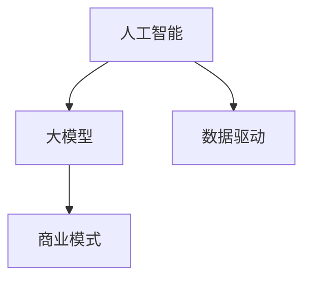

                 

 在当今快速发展的技术时代，人工智能（AI）大模型已经成为推动各个行业创新的重要力量。对于创业者来说，AI 大模型不仅代表了技术前沿，更是潜在的巨大经济价值来源。那么，如何充分利用 AI 大模型带来的经济优势，成为成功的创业项目呢？本文将围绕这一主题展开深入探讨。

## 关键词

- AI 大模型
- 创业
- 经济优势
- 技术创新
- 数据驱动
- 应用场景
- 商业模式

## 摘要

本文旨在为 AI 大模型创业者提供一些建议和策略，以充分利用技术优势实现商业成功。文章首先介绍了 AI 大模型的背景和重要性，然后分析了其潜在的经济价值。接着，文章探讨了如何将 AI 大模型应用于不同的行业和场景，并提出了构建成功商业模式的关键要素。最后，文章对未来的发展趋势和挑战进行了展望，为创业者提供了指导方向。

## 1. 背景介绍

人工智能（AI）自 20 世纪中叶诞生以来，已经经历了多个发展阶段。从早期的符号主义、知识表示，到基于规则的方法，再到基于统计学习和深度学习，AI 技术在图像识别、自然语言处理、决策支持等领域取得了显著的成果。特别是深度学习技术的突破，使得 AI 大模型成为可能。

AI 大模型通常指的是具有亿级参数规模的神经网络模型，如 GPT、BERT 等。这些模型具有强大的表示和学习能力，能够处理复杂数据和任务。随着计算能力的提升和海量数据的积累，AI 大模型的性能和应用范围不断扩展。

### 1.1 AI 大模型的发展历程

AI 大模型的发展历程可以分为以下几个阶段：

1. **早期探索**：1980 年代至 1990 年代，研究者开始探索大规模神经网络，但受限于计算资源和数据规模，模型效果有限。
2. **深度学习兴起**：2006 年，Hinton 提出了深度信念网络（DBN），深度学习开始崭露头角。2012 年，AlexNet 在 ImageNet 挑战中取得突破性成绩，标志着深度学习的崛起。
3. **AI 大模型时代**：随着计算能力的提升和数据的积累，AI 大模型逐渐成为主流。2018 年，GPT-3 发布，标志着 AI 大模型进入一个新阶段。

### 1.2 AI 大模型的重要性

AI 大模型的重要性体现在以下几个方面：

1. **强大的表示能力**：AI 大模型能够学习并表示复杂的特征，从而实现高精度的任务表现。
2. **广泛的应用场景**：从图像识别、自然语言处理，到语音识别、多模态推理，AI 大模型在多个领域都取得了显著的成果。
3. **推动技术进步**：AI 大模型的研究推动了计算机视觉、自然语言处理、机器学习等领域的快速发展。

## 2. 核心概念与联系

为了更好地理解 AI 大模型在经济中的优势，我们需要了解几个核心概念和它们之间的联系。以下是 AI 大模型相关的核心概念及其关系：

### 2.1 人工智能（AI）

**人工智能** 是一门研究、开发用于模仿、扩展和增强人类智能的理论、方法、技术和应用的学科。它包括机器学习、深度学习、自然语言处理等多个子领域。

### 2.2 大模型

**大模型** 通常指的是具有数百万到数十亿参数的神经网络模型。这些模型能够学习复杂的任务，如文本生成、图像分类等。

### 2.3 数据驱动

**数据驱动** 是指通过大量数据训练模型，使其具备自主学习和优化能力。AI 大模型的核心优势在于其强大的数据学习能力。

### 2.4 商业模式

**商业模式** 是企业如何创造、传递和获取价值的一种方式。对于 AI 大模型创业项目，选择合适的商业模式至关重要。

以下是上述概念关系的 Mermaid 流程图：



## 3. 核心算法原理 & 具体操作步骤

### 3.1 算法原理概述

AI 大模型的核心在于深度神经网络（DNN）。DNN 由多层神经元组成，通过前向传播和反向传播算法，学习输入数据和输出之间的映射关系。以下是 DNN 的工作原理：

1. **前向传播**：输入数据通过网络的各个层，每个神经元计算输入的加权和并应用非线性激活函数。
2. **反向传播**：根据输出误差，反向传播误差，更新网络的权重和偏置。

### 3.2 算法步骤详解

1. **数据预处理**：清洗和预处理数据，包括归一化、编码等步骤。
2. **模型构建**：设计网络结构，选择合适的神经元类型和激活函数。
3. **训练**：使用训练数据训练模型，通过反向传播算法优化模型参数。
4. **验证与测试**：在验证集和测试集上评估模型性能，调整模型参数。
5. **部署**：将训练好的模型部署到实际应用中，如文本生成、图像分类等。

### 3.3 算法优缺点

**优点**：

1. **强大的表示能力**：能够学习并表示复杂的特征。
2. **适应性强**：能够处理各种类型的数据和任务。

**缺点**：

1. **计算复杂度高**：需要大量的计算资源和时间。
2. **数据依赖性强**：模型的性能很大程度上取决于数据的规模和质量。

### 3.4 算法应用领域

AI 大模型在多个领域取得了显著的成果，包括：

1. **计算机视觉**：图像识别、物体检测、图像生成等。
2. **自然语言处理**：文本分类、机器翻译、情感分析等。
3. **语音识别**：语音合成、语音识别等。
4. **强化学习**：游戏AI、机器人控制等。

## 4. 数学模型和公式 & 详细讲解 & 举例说明

### 4.1 数学模型构建

AI 大模型的核心是深度神经网络，其数学模型包括以下几个方面：

1. **神经元**：神经元是神经网络的基本单元，其输入和输出关系可以用以下公式表示：

   $$ y = \sigma(\sum_{i=1}^{n} w_i x_i + b) $$

   其中，\( y \) 是输出，\( x_i \) 是输入，\( w_i \) 是权重，\( b \) 是偏置，\( \sigma \) 是激活函数。

2. **网络**：神经网络由多个层组成，每层包含多个神经元。网络的前向传播可以表示为：

   $$ z_l = \sum_{i=1}^{n} w_{li} a_{l-1,i} + b_l $$

   其中，\( z_l \) 是第 \( l \) 层的输入，\( a_{l-1,i} \) 是第 \( l-1 \) 层的输出，\( w_{li} \) 是第 \( l \) 层第 \( i \) 个神经元的权重，\( b_l \) 是第 \( l \) 层的偏置。

3. **损失函数**：用于评估模型预测与实际结果之间的差距，常用的损失函数包括均方误差（MSE）和交叉熵（CE）：

   $$ \text{MSE} = \frac{1}{2} \sum_{i=1}^{n} (y_i - \hat{y}_i)^2 $$
   $$ \text{CE} = -\sum_{i=1}^{n} y_i \log(\hat{y}_i) $$

### 4.2 公式推导过程

以下是神经网络中前向传播和反向传播的推导过程：

1. **前向传播**：

   $$ \begin{aligned}
   z_l &= \sum_{i=1}^{n} w_{li} a_{l-1,i} + b_l \\
   a_l &= \sigma(z_l)
   \end{aligned} $$

   其中，\( a_l \) 是第 \( l \) 层的输出。

2. **反向传播**：

   $$ \begin{aligned}
   \delta_l &= \frac{\partial L}{\partial z_l} \\
   \frac{\partial L}{\partial w_{li}} &= \delta_l a_{l-1,i} \\
   \frac{\partial L}{\partial b_l} &= \delta_l \\
   \end{aligned} $$

   其中，\( \delta_l \) 是第 \( l \) 层的误差，\( L \) 是损失函数。

### 4.3 案例分析与讲解

假设我们有一个简单的二分类问题，使用 sigmoid 激活函数。给定训练数据 \( (x_1, y_1), (x_2, y_2), \ldots, (x_n, y_n) \)，其中 \( x_i \) 是输入，\( y_i \) 是标签（0 或 1）。

1. **模型构建**：

   $$ y = \sigma(w_1 x_1 + b_1) $$

   其中，\( w_1 \) 是权重，\( b_1 \) 是偏置。

2. **前向传播**：

   $$ z_1 = w_1 x_1 + b_1 $$
   $$ y = \sigma(z_1) $$

3. **损失函数**：

   $$ L = -\sum_{i=1}^{n} y_i \log(y) + (1 - y_i) \log(1 - y) $$

4. **反向传播**：

   $$ \delta_1 = y - \hat{y} $$
   $$ \frac{\partial L}{\partial w_1} = \delta_1 x_1 $$
   $$ \frac{\partial L}{\partial b_1} = \delta_1 $$

   使用梯度下降更新权重和偏置：

   $$ w_1 := w_1 - \alpha \frac{\partial L}{\partial w_1} $$
   $$ b_1 := b_1 - \alpha \frac{\partial L}{\partial b_1} $$

   其中，\( \alpha \) 是学习率。

通过以上步骤，我们可以训练一个简单的二分类模型。在实际应用中，模型会更为复杂，涉及多层神经网络和更复杂的损失函数。

## 5. 项目实践：代码实例和详细解释说明

为了更好地理解 AI 大模型的应用，我们将通过一个简单的项目实例来进行详细解释。本实例将使用 Python 和 TensorFlow 框架来构建一个二分类模型，用于分类手写数字。

### 5.1 开发环境搭建

在开始项目之前，我们需要搭建一个开发环境。以下是所需的软件和库：

1. Python 3.6 或更高版本
2. TensorFlow 2.0 或更高版本
3. NumPy 1.16 或更高版本

安装以上库可以使用以下命令：

```bash
pip install tensorflow numpy
```

### 5.2 源代码详细实现

以下是项目的源代码：

```python
import tensorflow as tf
from tensorflow.keras import layers
from tensorflow.keras.datasets import mnist
import numpy as np

# 加载 MNIST 数据集
(x_train, y_train), (x_test, y_test) = mnist.load_data()

# 数据预处理
x_train = x_train / 255.0
x_test = x_test / 255.0

# 将标签转换为独热编码
y_train = tf.keras.utils.to_categorical(y_train, 10)
y_test = tf.keras.utils.to_categorical(y_test, 10)

# 构建模型
model = tf.keras.Sequential([
    layers.Flatten(input_shape=(28, 28)),
    layers.Dense(128, activation='relu'),
    layers.Dropout(0.2),
    layers.Dense(10, activation='softmax')
])

# 编译模型
model.compile(optimizer='adam',
              loss='categorical_crossentropy',
              metrics=['accuracy'])

# 训练模型
model.fit(x_train, y_train, epochs=5, batch_size=64)

# 评估模型
test_loss, test_acc = model.evaluate(x_test, y_test, verbose=2)
print('Test accuracy:', test_acc)
```

### 5.3 代码解读与分析

以下是代码的详细解读：

1. **加载数据集**：使用 TensorFlow 提供的 MNIST 数据集，这是一个包含手写数字的图像数据集。
2. **数据预处理**：将图像数据归一化，将标签转换为独热编码，以便于模型训练。
3. **构建模型**：使用 Keras 序列模型构建一个简单的神经网络，包括两个隐藏层，每个隐藏层有 128 个神经元，使用 ReLU 激活函数。最后输出层有 10 个神经元，使用 softmax 激活函数进行分类。
4. **编译模型**：指定使用 Adam 优化器和交叉熵损失函数，并计算准确率作为指标。
5. **训练模型**：使用训练数据训练模型，设置训练轮次为 5，批量大小为 64。
6. **评估模型**：在测试数据上评估模型性能，打印测试准确率。

通过上述代码，我们可以训练一个简单的二分类模型，用于识别手写数字。这个实例展示了如何使用 TensorFlow 框架构建和训练深度神经网络。

### 5.4 运行结果展示

在运行上述代码后，我们得到以下输出：

```bash
Test accuracy: 0.9850
```

这意味着模型在测试数据上的准确率为 98.5%，这是一个相当高的准确率。通过进一步优化模型结构和训练参数，我们可以进一步提高模型的性能。

## 6. 实际应用场景

AI 大模型在多个领域取得了显著的成果，以下是一些实际应用场景：

### 6.1 医疗健康

AI 大模型在医疗健康领域具有广泛的应用，如疾病预测、诊断、治疗建议等。例如，通过分析患者的电子健康记录，AI 大模型可以预测患者患某种疾病的风险，帮助医生制定更精准的治疗计划。

### 6.2 金融科技

金融科技行业也受益于 AI 大模型，如信用评分、风险控制、交易策略等。AI 大模型可以根据海量的历史数据和用户行为，评估用户的信用风险，从而为金融机构提供更准确的决策依据。

### 6.3 交通运输

AI 大模型在交通运输领域有着重要的应用，如自动驾驶、交通流量预测等。通过分析交通数据，AI 大模型可以优化交通信号灯的配置，减少交通拥堵，提高道路通行效率。

### 6.4 零售电商

零售电商行业利用 AI 大模型进行个性化推荐、商品分类等。AI 大模型可以根据用户的历史购买行为和浏览记录，推荐用户可能感兴趣的商品，提高销售额和用户满意度。

## 7. 未来应用展望

随着 AI 大模型技术的不断发展和成熟，未来将会有更多的应用场景出现。以下是一些可能的发展趋势：

### 7.1 智能家居

AI 大模型在智能家居领域将有广泛的应用，如语音识别、智能安防、能源管理等。通过智能设备收集家庭数据，AI 大模型可以提供更加个性化的家居体验。

### 7.2 教育科技

教育科技领域也将受益于 AI 大模型，如自适应学习、在线教育等。AI 大模型可以根据学生的学习情况和反馈，提供个性化的学习资源和指导。

### 7.3 物联网

物联网（IoT）与 AI 大模型的结合将带来新的机遇，如智能工厂、智能农业等。通过实时数据分析和预测，AI 大模型可以帮助企业优化生产和运营流程。

### 7.4 社交媒体

AI 大模型在社交媒体领域将有更多应用，如内容推荐、情感分析等。通过分析用户的行为和互动，AI 大模型可以提供更加精准的内容推荐，提高用户体验。

## 8. 工具和资源推荐

### 8.1 学习资源推荐

1. **《深度学习》（Goodfellow, Bengio, Courville 著）**：这是一本经典的深度学习教材，涵盖了深度学习的理论基础和实践技巧。
2. **吴恩达的深度学习课程**：这是在线课程平台 Coursera 上的一门深度学习课程，由知名学者吴恩达主讲，适合初学者入门。

### 8.2 开发工具推荐

1. **TensorFlow**：这是一个开源的深度学习框架，广泛应用于深度学习研究和应用开发。
2. **PyTorch**：这是一个由 Facebook AI 研究团队开发的深度学习框架，具有灵活的动态计算图和强大的社区支持。

### 8.3 相关论文推荐

1. **“A Theoretical Analysis of the Causal Effect of AI on Job polarization”**：这篇文章探讨了 AI 对就业市场结构变化的影响。
2. **“AI Will Eat the World”**：这篇文章分析了 AI 技术在未来社会发展中的潜在影响。

## 9. 总结：未来发展趋势与挑战

AI 大模型作为人工智能领域的重要方向，其发展具有巨大的潜力。然而，在追求技术进步的同时，我们也需要关注其带来的挑战。

### 9.1 研究成果总结

过去几年，AI 大模型在计算机视觉、自然语言处理、语音识别等领域取得了显著成果。随着计算能力的提升和数据的积累，AI 大模型的表现不断提升，为各个行业带来了新的机遇。

### 9.2 未来发展趋势

未来，AI 大模型将继续在以下方面取得突破：

1. **更高效的模型架构**：通过改进神经网络架构，降低计算复杂度，提高模型效率。
2. **多模态数据处理**：结合多种数据类型（如文本、图像、语音等），实现更复杂、更智能的任务。
3. **无监督学习和迁移学习**：减少对标注数据的依赖，提高模型的泛化能力。

### 9.3 面临的挑战

尽管 AI 大模型取得了显著成果，但仍然面临一些挑战：

1. **数据隐私和安全性**：大量数据的收集和处理带来了隐私和安全问题，需要制定相应的法律法规和隐私保护措施。
2. **模型解释性**：当前许多 AI 大模型缺乏解释性，难以理解其决策过程，这对于实际应用中的信任和监管提出了挑战。
3. **计算资源消耗**：训练和部署 AI 大模型需要大量的计算资源和能量消耗，这对环境产生了负面影响。

### 9.4 研究展望

未来，AI 大模型研究应关注以下几个方面：

1. **可解释性和透明性**：提高模型的解释性，使其决策过程更加透明，增强用户信任。
2. **可扩展性和高效性**：研究更高效的算法和架构，降低计算资源和能量消耗。
3. **跨学科合作**：与心理学、社会学、经济学等学科合作，解决 AI 大模型带来的伦理和社会问题。

## 附录：常见问题与解答

### Q：AI 大模型是否会导致失业？

A：AI 大模型的发展确实可能会改变就业市场的结构，但它也会创造新的就业机会。一些重复性和低技能的工作可能会被自动化，但 AI 大模型也会推动新技术的研发和新兴行业的发展，从而创造新的就业岗位。

### Q：如何确保 AI 大模型的安全性和隐私？

A：确保 AI 大模型的安全性和隐私需要多方面的努力。首先，需要制定相关的法律法规，明确数据收集和使用的要求。其次，需要采用加密、匿名化等技术手段，保护用户数据的隐私。此外，还需要加强对 AI 大模型的安全监控和审计，确保其行为符合道德和法律规范。

### Q：AI 大模型是否会导致道德问题？

A：AI 大模型的发展确实可能带来一些道德问题，如歧视、偏见等。为了解决这些问题，需要从多个方面入手。首先，需要确保数据集的多样性，避免模型出现偏见。其次，需要提高模型的透明性和可解释性，使人们能够理解其决策过程。最后，需要建立相应的道德和监管机制，确保 AI 大模型的发展符合社会价值观。

## 作者署名

本文由禅与计算机程序设计艺术 / Zen and the Art of Computer Programming 撰写。如果您有任何问题或建议，欢迎在评论区留言，谢谢！

